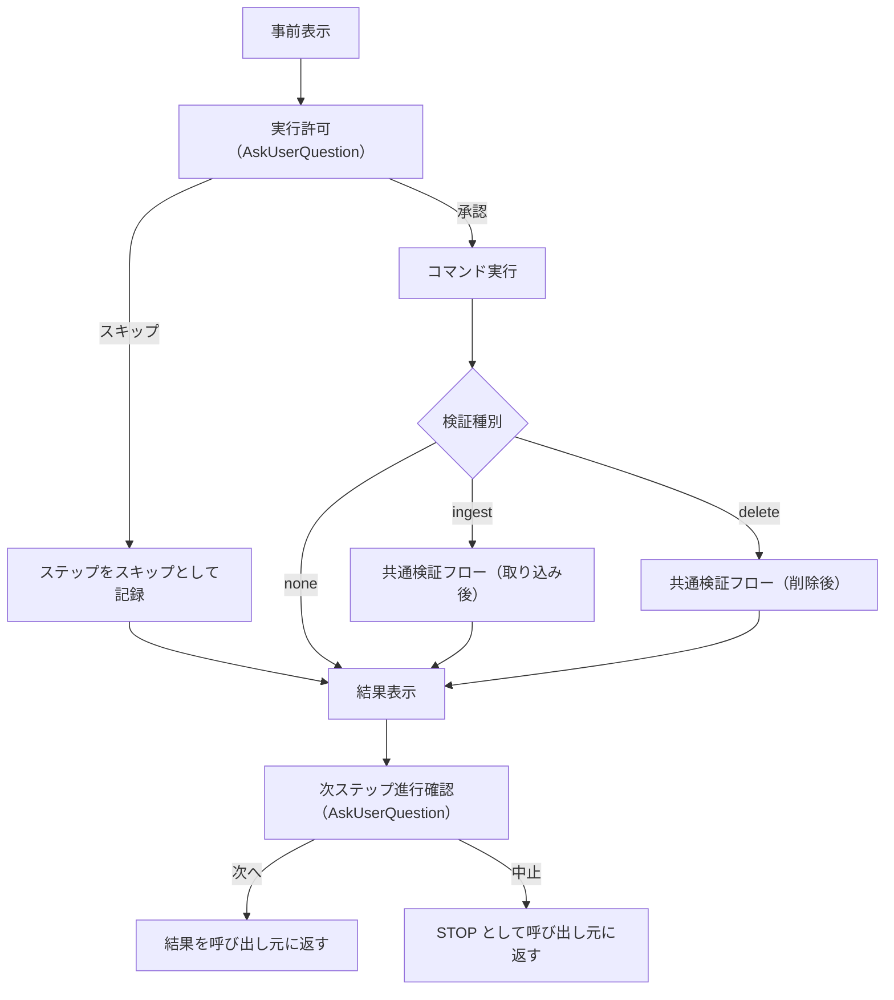

# QA 実行スキル

## 概要

QA 検証ステップの実行・確認を、エージェントの自己判断でスキップされないように制御するスキル。

- 対象: QA スキルの各検証ステップ（コマンド実行 + 実行後の検証）
- 対象外: QA スキル全体のフロー制御（グループ選択・worktree セットアップ等は `/qa` の責務）

本スキルは自己完結的に動作する。コマンド・検証種別・期待結果を受け取ったら、事前表示 → 実行許可 → コマンド実行 → 検証フロー → 結果表示 → 進行確認の全フローを自律的に完了し、最終結果のみを呼び出し元に返す。呼び出し元（`/qa` スキル）が検証フローの一部を代行することは想定しない。

## 背景

- QA スキル初回実行で、共通検証フロー（データ確認・検索確認）がエージェントの判断でスキップされた。出力量の削減や効率化を理由に、手順書に定義された確認手続きが省略されると QA の意味がなくなる
- `/execute` スキルの「事前確認 → 実行許可 → 実行」フローを拡張し、QA 特有の「実行 → 確認手続き」まで一貫して制御する必要がある
- 各ステップの実行前にコマンド・パラメータ・期待結果を明示し、ユーザーの許可を得てから実行することで、エージェントの自律的なスキップを構造的に防止する

## 制約

- **都度確認**: 各ステップで必ず `AskUserQuestion` による実行許可を取得する。複数ステップのバッチ承認は不可
- **確認手続きのスキップ禁止**: 実行したステップの検証フローは省略・簡略化してはならない。エージェントの判断による「確認済みなのでスキップ」「出力が多いので省略」は禁止。ただし、コマンド実行がエラーで終了した場合は検証対象が成立しないため検証フローを実行しない（例外）。また、ユーザーがステップ自体のスキップ（`s`）を選択した場合はステップ未実行のため検証対象外
- **事前表示の義務**: 実行前に必ずコマンド・パラメータ・期待結果を表示する。表示なしの実行は禁止
- **結果の全量表示**: 検証結果は省略せず全量表示する。具体的には、(1) 実行したコマンドの stdout/stderr を途中で省略せず提示すること、(2) 検証で実施した個々の確認内容とその成否を省略せず記述すること。ユーザーが結果を確認できることが QA の前提

## コマンド体系

### 呼び出し

本スキルは `/qa` スキルの内部から呼び出される。ユーザーが直接呼び出すことは想定しない。

| 呼び出し元 | 用途 |
|-----------|------|
| `/qa` | 各検証ステップの実行時に本スキルを呼び出す |

### パラメータ

`/qa` スキルが本スキルに渡す情報:

| パラメータ | 必須 | 説明 |
|-----------|------|------|
| コマンド | Yes | 実行するコマンド文字列（CLI コマンドまたは MCP ツール呼び出し） |
| 期待結果 | Yes | このステップで期待する結果の説明 |
| 検証種別 | Yes | `ingest`（取り込み後の共通検証フロー）/ `delete`（削除後の逆方向検証）/ `none`（検証フローなし） |
| 検証パラメータ | No | 共通検証フローに必要な追加情報（検索クエリ、source_type 等） |

## 処理フロー



### ステップ 1: 事前表示

実行するコマンドとパラメータ、期待結果を以下の形式で表示する:

```
--- QA ステップ ---
コマンド: <実行するコマンド>
期待結果: <このステップで期待する結果>
検証: <共通検証フロー（取り込み後） / 共通検証フロー（削除後） / なし>
```

### ステップ 2: 実行許可

`AskUserQuestion` でユーザーに実行の許可を確認する。

```
実行しますか？ (y: 実行 / s: スキップ)
```

- `y`: 実行に進む
- `s`: このステップをスキップし、結果を「SKIP」として記録する。ステップ 5（結果表示）およびステップ 6（進行確認）を経て呼び出し元に返す

### ステップ 3: コマンド実行

許可を得た後、コマンドを実行する。実行結果（標準出力・標準エラー・終了コード）を記録する。

エラーが発生した場合:

- エラー内容を表示する
- 結果を「NG」として記録する
- 検証フローは実行しない（実行自体が失敗しているため）
- ステップ 5（結果表示）およびステップ 6（進行確認）を経て呼び出し元に返す

### ステップ 4: 確認手続き

検証種別に応じた確認手続きを実行する。

#### 検証種別: `ingest`（取り込み後の共通検証フロー）

| # | 検証 | 方法 | 確認観点 |
|---|------|------|---------|
| 1 | 実データ確認 | source_store / converted_store のファイルを `ls` で確認 | ファイルが存在すること。メタデータの確認方法は媒体により異なる |
| 2 | Git 状態確認 | source_store 内の git リポジトリで `git status` を実行 | 新規ファイルが追加されていること。意図しない変更がないこと |
| 3 | 検索確認 | `search --query <取り込み内容に関連するクエリ>` | 取り込んだソースがヒットすること。メタデータ行が正しいこと |

メタデータ確認方法:

- **local 以外**（web, bluesky, zenn, youtube, aozora, journal）: `.meta` サイドカーファイルの内容を確認（source_type, title, collected_at）
- **local**: `.meta` は存在しない。metadata.db の sources テーブルで確認する

#### 検証種別: `delete`（削除後の逆方向検証）

| # | 検証 | 確認観点 |
|---|------|---------|
| 1 | 実データ確認 | source_store からファイルが削除されていること |
| 2 | Git 状態確認 | ファイル削除が `git status` に反映されていること |
| 3 | 検索確認 | 削除したソースが検索結果に含まれないこと |

#### 検証種別: `none`

確認手続きを行わない。コマンドの実行結果のみを表示する。

#### 判定ルール

- **期待結果との完全一致**: 期待結果に記載された条件を全て満たさない限り NG とする。条件を変更して再実行した結果で OK としてはならない（例: パラメータを変えて再実行し、その結果をもって OK と判定することは禁止）。ただし「予期しない状態の扱い」に基づきユーザーが明示的に OK と判断した場合は例外とする
- **検証フローの必須実行**: 検証種別が `ingest` または `delete` の場合、コマンド実行成功後に共通検証フローの全項目を実行しなければ NG とする。項目の省略・簡略化は不可
- **確認観点の充足**: 各確認観点を 1 つでも満たさない場合、検証結果は NG とする。確認観点を満たさない事実を別の手段で補完して OK としてはならない
- **予期しない状態の扱い**: コマンド実行結果が期待結果と異なる場合（エラーではないが想定外の状態）、自己判断で OK / NG を決めず、ユーザーに状況を報告して判断を仰ぐ。ユーザーが OK と判断した場合に限り、「期待結果との完全一致」の例外として「OK（ユーザー判断）」と記録する。通常の OK とは区別して扱うこと

### ステップ 5: 結果表示

実行結果と検証結果を以下の形式で表示する:

```
--- 結果 ---
コマンド: <実行したコマンド>
実行結果: OK / NG / SKIP
検証結果: OK / NG / SKIP（検証なし）
詳細: <検証で確認した各項目の成否。NG の場合は失敗箇所>
```

### ステップ 6: 次ステップ進行確認

結果表示後、`AskUserQuestion` でフローの継続を確認する。

```
次のステップに進みますか？ (n: 次へ / q: 中止)
```

- `n`: ステップ結果（OK / NG / SKIP）を呼び出し元に返し、次のステップに進む
- `q`: ステップ結果を「STOP」として呼び出し元に返す。呼び出し元の `/qa` はフロー全体を中止する。実行結果・検証結果はステップ 5 で表示済みのため、ユーザーは結果を確認した上で中止を判断できる

この確認が qa スキルへの継続/中止シグナルとなる。qa スキル側での追加のユーザー確認は不要であり、`n` の継続シグナルを受け取った場合にのみ、qa スキルは次のステップ用の qa-execute を即座に呼び出す。`q` で STOP が返された場合は、qa スキルはそこでフロー全体を中止し、次の qa-execute は呼び出さない。

ステップ 2（実行許可）とステップ 6（進行確認）は確認の意味が異なる:

- ステップ 2: 「このコマンドを実行してよいか」（実行の許可）
- ステップ 6: 「結果を確認した上で次に進んでよいか」（フローの継続判断）

## 入出力

### 入力

| 入力 | 形式 |
|------|------|
| コマンド | コマンド文字列 |
| 期待結果 | テキスト |
| 検証種別 | `ingest` / `delete` / `none` |
| 検証パラメータ | 検索クエリ・source_type 等（任意） |

### 出力

| 出力 | 形式 |
|------|------|
| 事前表示 | コマンド・パラメータ・期待結果のフォーマット済みテキスト |
| 実行結果 | コマンドの標準出力・標準エラー |
| 検証結果 | 各検証項目の OK/NG とサマリー |
| ステップ結果 | OK / NG / SKIP / STOP（呼び出し元の `/qa` が結果サマリーに集約する。STOP 時はフロー中止） |

## 関連ドキュメント

- [QA スキル仕様](qa-skill.md) — 本スキルの呼び出し元
- 機能実行スキル仕様（`~/.claude/docs/specs/agentic/skills/execute-skill.md`）— 事前確認フローの参考元
