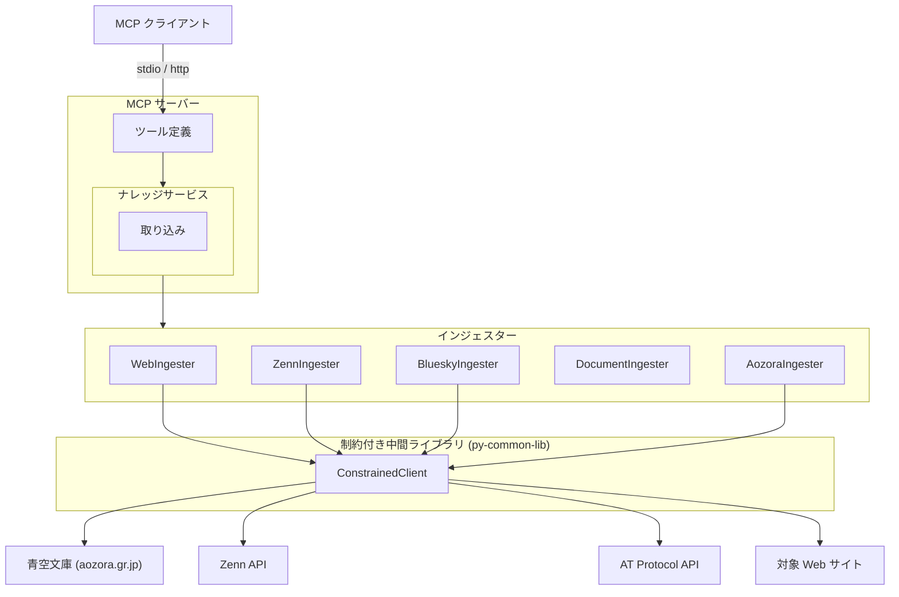
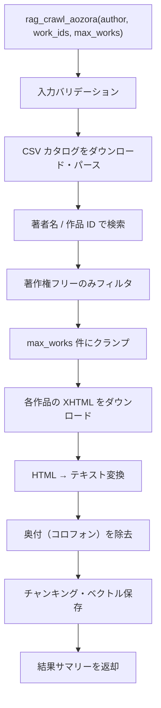

# 青空文庫インジェスター

## 概要

青空文庫（aozorabunko）の作品テキストを取得し、ナレッジベースに取り込むインジェスター。
CSV カタログから作品を検索し、XHTML ファイルをダウンロードして本文テキストを抽出する。

スコープ:

- CSV カタログのダウンロード・パースによる作品メタデータの取得
- 著者名または作品 ID による作品の検索・フィルタリング
- XHTML 形式の作品本文の取得とナレッジベースへの取り込み
- MCP ツールとしての作品取り込みインターフェースの提供

スコープ外:

- テキスト形式（ShiftJIS テキスト + 青空文庫独自マークアップ）の直接パース
- 著作権保護中の作品の取得（パブリックドメインのみ）
- 作品の投稿・編集・削除（読み取り専用）
- EBK（電子書籍）形式の処理

## 背景

- 青空文庫は日本語文学のパブリックドメイン作品を収集・公開するデジタル図書館であり、約 17,800 作品を収録している
- 日本語の長文テキスト（小説・随筆・詩等）をナレッジベースに取り込むことで、文学作品に関する質問応答や参照が可能になる
- 既存のインジェスター（Web、Zenn、BlueSky、ドキュメント）は短〜中文テキストが主であり、数万〜数十万文字の長文コンテンツを一括取り込みするケースは初めてとなる
- 青空文庫は REST API を提供しておらず、CSV カタログ + ファイル直接ダウンロードというアクセス方式を取る

## 制約

- 外部 HTTP リクエストは ConstrainedClient（py-common-lib）経由で実行する
- ハードリミット（コード内定数。設定・引数・環境変数で緩和不可。厳格化は可能）:
  - 操作あたりリクエスト総数上限: 500（ConstrainedClient 共通）
  - 最低リクエスト間隔: 0.1 秒（ConstrainedClient 共通。CSV ダウンロード、XHTML 取得を含む全外部リクエスト間に適用）
  - 操作全体タイムアウト: 600 秒（許容範囲 1〜600 秒、ConstrainedClient 共通）
  - 作品取得上限: 50 件（青空文庫インジェスター固有。長文テキストのため Zenn/BlueSky より小さい値を設定）
- サーキットブレーカー: 5 回連続失敗で操作全体を中断する（ConstrainedClient 共通）
- バリデーションとクランプの使い分け:
  - **バリデーションエラー（拒否）**: 型不正（非整数など）、0、負数。これらは明らかな誤入力であり、クランプで救済しない
  - **クランプ（警告ログ付き）**: 正の整数だが許容範囲外（例: `max_works=100` → 50 にクランプ）。意図的な大きい値の指定を安全な範囲に制限する
- `--no-limit` 等の制約バイパス手段は一切設けない
- `0 = 無制限` のセマンティクスを排除する
- CSV カタログはローカルにキャッシュし、同一操作内での再ダウンロードを避ける。キャッシュの永続化（操作をまたいだ再利用）は初期スコープでは行わない
- 著作権フラグが「なし」（パブリックドメイン）の作品のみ取り込み対象とする。著作権ありの作品はフィルタで除外する

## 外部連携

### 青空文庫

青空文庫は REST API を提供していない。CSV カタログファイルとファイル直接ダウンロードによるアクセス方式を取る。

| 連携先 | 用途 | 接続方式 |
|--------|------|---------|
| 青空文庫（www.aozora.gr.jp） | CSV カタログダウンロード、XHTML ファイル取得 | HTTP ファイルダウンロード（ConstrainedClient 経由） |

#### CSV カタログ

| 項目 | 内容 |
|------|------|
| URL | `https://www.aozora.gr.jp/index_pages/list_person_all_extended_utf8.zip` |
| 形式 | ZIP 圧縮された CSV ファイル（UTF-8） |
| レコード数 | 約 19,500 行（同一作品が複数行に分かれる場合あり: 著者・翻訳者等の役割別） |
| ユニーク作品数 | 約 17,800 件 |

CSV の主要カラム:

| カラム名 | 説明 |
|---------|------|
| `作品ID` | 作品の一意識別子 |
| `作品名` | 作品タイトル |
| `作品名読み` | タイトルの読み（ひらがな） |
| `姓` | 著者の姓 |
| `名` | 著者の名 |
| `姓読み` | 著者の姓の読み |
| `名読み` | 著者の名の読み |
| `役割フラグ` | 著者・翻訳者等の役割 |
| `分類番号` | NDC 分類番号 |
| `文字遣い種別` | 新字新仮名・旧字旧仮名等 |
| `作品著作権フラグ` | 「なし」= パブリックドメイン |
| `XHTML/HTMLファイルURL` | XHTML ファイルの直接 URL |
| `テキストファイルURL` | テキストファイルの直接 URL |
| `テキストファイル符号化方式` | ShiftJIS または UTF-8 |
| `図書カードURL` | 作品の書誌情報ページ URL |

#### XHTML ファイル

| 項目 | 内容 |
|------|------|
| URL | CSV の `XHTML/HTMLファイルURL` カラムから取得 |
| 形式 | XHTML/HTML（主に ShiftJIS エンコーディング） |
| 内容 | 作品本文（ルビ・注記を含む HTML マークアップ済み） |

XHTML ファイルを採用する理由:

- テキストファイルは青空文庫独自マークアップ（`《》` によるルビ、`[#...]` による注記）のパーサーが必要だが、XHTML は標準的な HTML パーサー（BeautifulSoup4）で処理可能
- XHTML にはルビが `<ruby>` タグで構造化されており、不要な場合は容易に除去できる
- 既存の Web クローラーと同様の HTML→テキスト変換パイプラインを活用できる

## 想定プロファイル

### rag_crawl_aozora（青空文庫作品一括取り込み）

| 項目 | 内容 |
|------|------|
| 最悪ケースリクエスト数 | 1（CSV カタログダウンロード）+ 50（XHTML ファイル取得上限）= 51。バジェットトラッカー上限 500 の範囲内 |
| 最悪ケース所要時間 | 51 × 0.1 秒（ハードリミット最小間隔での理論最短）= 5.1 秒。デフォルト設定（1.0 秒間隔）では 51 秒。per-request タイムアウト・処理時間は含まない。操作全体タイムアウト 600 秒の範囲内 |
| 想定エラー率 | 青空文庫サーバー依存。リトライ機構なし（失敗作品はスキップし処理を続行）。5 回連続失敗でサーキットブレーカーが発動し操作中断 |

## 安全制約

| 制約名 | 種別 | 値 | 解除可否 |
|--------|------|-----|---------|
| 操作あたりリクエスト総数上限 | ハードリミット | 500 | 引き上げ不可（引き下げ可） |
| 最低リクエスト間隔 | ハードリミット | 0.1 秒 | 引き下げ不可（引き上げ可） |
| 操作全体タイムアウト | ハードリミット | 600 秒、許容範囲 1〜600 秒 | 引き上げ不可（引き下げ可、下限 1 秒） |
| サーキットブレーカー閾値 | ハードリミット | 5 回連続失敗 | 引き上げ不可（引き下げ可） |
| 作品取得上限 | ハードリミット | 50 件 | 引き上げ不可（引き下げ可） |
| 取得作品数 | 設定値 | 許容範囲 1〜50、デフォルト 20 | 範囲内で変更可 |
| リクエストタイムアウト | 設定値 | 許容範囲 1〜120 秒、デフォルト 30 秒 | 範囲内で変更可 |
| リクエスト間隔 | 設定値 | 許容範囲 0.1〜60 秒、デフォルト 1.0 秒 | 範囲内で変更可 |
| 生 HTTP クライアント利用禁止 | CI チェック | `src/` 全体を grep で走査（httpx / aiohttp / requests / urllib.request）。`# safety:allowed` 行を除外。ConstrainedClient は py-common-lib パッケージで提供（`src/` 外のため検出対象外） | 許可例外は `# safety:allowed` コメントで可 |

テスト実行時の安全な値: 作品取得上限 3 件で実行する。異常値テスト（0、負数、上限超過）を含めること。

## インターフェース

### MCP ツール

既存の `rag_crawl`（URL ベースの Web クロール）とは独立した新規ツールとして追加する。青空文庫は CSV カタログ + ファイルダウンロードという固有のアクセス方式であり、Web クロールとは取得方式・制約が異なるため分離する。

> **Note**: 本仕様書は設計先行（`docs(pre-impl)`）で作成している。後続の実装フェーズで `rag-knowledge.md` のツール数・ツール一覧も併せて更新する。

| ツール | 入力 | 振る舞い |
|--------|------|---------|
| rag_crawl_aozora | author（任意）、work_ids（任意）、max_works（任意） | 青空文庫の作品を CSV カタログ経由で検索し、XHTML をダウンロードしてナレッジベースに取り込む。同一作品の再取り込み時は `source_id`（図書カード URL）の一致で検出し、既存の知識を最新に置き換える |

ツール入力パラメータ:

| パラメータ | 型 | 必須 | 説明 |
|-----------|-----|------|------|
| `author` | 文字列 | いいえ | 著者名（姓名の部分一致検索）。`work_ids` と同時に指定した場合は AND 条件 |
| `work_ids` | 文字列 | いいえ | 作品 ID のカンマ区切りリスト（例: `"000879,001234"`）。特定の作品を指定して取り込む |
| `max_works` | 整数 | いいえ | 取得する最大作品数。デフォルト: 20、許容範囲: 1〜50 |

- `author` と `work_ids` の少なくとも一方は必須。両方未指定の場合はバリデーションエラーとする
- `author` のみ指定: 著者名で検索し、最大 `max_works` 件を取り込む
- `work_ids` のみ指定: 指定された作品 ID の作品を取り込む（`max_works` は `work_ids` の件数が上限を超えた場合のクランプに使用）
- `author` と `work_ids` の両方を指定: `work_ids` に該当する作品のうち、著者名が一致するものを取り込む

ツール出力: 取り込み結果のサマリーテキスト（検索ヒット数、取得作品数、チャンク数、エラー数）

### 設定項目

| 設定キー（config.toml） | 型 | デフォルト | 許容範囲 | 説明 |
|---------|-----|-----------|---------|------|
| `rag_aozora_max_works` | 整数 | 20 | 1〜50 | 取得する最大作品数 |
| `rag_aozora_request_timeout` | 整数 | 30 | 1〜120 | リクエストタイムアウト（秒） |
| `rag_aozora_request_interval` | 小数 | 1.0 | 0.1〜60 | リクエスト間の最低間隔（秒） |

## コンポーネント構成

### 青空文庫インジェスターの位置付け

### コンポーネント一覧

| コンポーネント | 役割 |
|--------------|------|
| AozoraIngester | 青空文庫作品取り込み用インジェスター。BaseIngester を継承し、CSV カタログ + XHTML ダウンロードで作品を取得する |
| ConstrainedClient (py-common-lib) | 全外部 HTTP リクエストのゲートウェイ。ハードリミット・バジェット・サーキットブレーカーを統合する |

### 作品一括取り込みフロー

### CSV カタログ取得の処理手順

1. CSV カタログ ZIP ファイルをダウンロードする（`https://www.aozora.gr.jp/index_pages/list_person_all_extended_utf8.zip`）
2. ZIP を展開し、CSV ファイルを UTF-8 としてパースする
3. 同一作品 ID の複数行（著者・翻訳者等）を作品 ID でグループ化し、最初の行（通常は著者）をメタデータの代表とする
4. パース結果をメモリ上にキャッシュし、同一操作内での再パースを避ける

### 作品検索の処理手順

1. 検索条件を適用する:
   - `author` 指定時: CSV の `姓` + `名` を結合した文字列に対して部分一致検索する
   - `work_ids` 指定時: CSV の `作品ID` カラムで完全一致フィルタする
   - 両方指定時: AND 条件で絞り込む
2. `作品著作権フラグ` が「なし」の作品のみを抽出する
3. `XHTML/HTMLファイルURL` が存在する作品のみを抽出する（URL が空の作品はスキップ）
4. 作品 ID の昇順でソートする
5. `max_works` 件にクランプする

### 個別作品取得の処理手順

1. CSV から取得した `XHTML/HTMLファイルURL` に HTTP GET リクエストを送信する
2. レスポンスのエンコーディングを検出する（Content-Type ヘッダーまたは HTML の meta charset。大多数は ShiftJIS）
3. HTML を BeautifulSoup4 でパースする
4. 本文テキストを抽出する:
   - `<ruby>` タグからルビ（`<rt>` 要素）を除去し、親テキストのみを保持する
   - `
` 等の本文領域を特定する（青空文庫 XHTML の標準構造に基づく）
   - 奥付（作品末尾の書誌情報・入力者クレジット等）を除去する。奥付は `
` 等の領域で識別する
5. IngestedContent を構築して返す:
   - `source_id`: 図書カード URL（例: `https://www.aozora.gr.jp/cards/000879/card127.html`）
   - `title`: 作品タイトル（CSV の `作品名`）
   - `text`: 抽出済みテキスト
   - `source_type`: `"aozora"`
   - `metadata`: `work_id`、`author`（姓 + 名）、`author_reading`（姓読み + 名読み）、`ndc_classification`（分類番号）、`orthography`（文字遣い種別）、`card_url`（図書カード URL）

## エッジケース

| ケース | 振る舞い |
|--------|---------|
| `author` と `work_ids` の両方が未指定 | バリデーションエラーとして拒否する |
| 著者名に一致する作品が 0 件 | 0 件取得として正常終了する |
| 指定した `work_ids` が CSV に存在しない | 該当 ID をスキップし、存在する作品のみ処理する。全 ID が存在しない場合は 0 件取得として正常終了する |
| 作品の `XHTML/HTMLファイルURL` が空 | 該当作品をスキップする。検索結果サマリーにスキップ理由を含める |
| XHTML ファイルのダウンロードに失敗（404 等） | 該当作品をスキップし、他の作品の処理を続行する。エラーをログ出力する |
| XHTML ファイルのエンコーディングが不明 | ShiftJIS を試行し、失敗した場合は UTF-8 を試行する。両方失敗した場合はスキップする |
| XHTML の HTML 構造が想定と異なる | テキスト抽出を試み、抽出結果が空の場合はスキップする。エラーをログ出力する |
| 本文テキストが空（抽出後） | 該当作品をスキップする。空テキストの取り込みは行わない |
| 著作権保護中の作品 | CSV フィルタで除外する。取り込み対象にならない |
| CSV カタログのダウンロードに失敗 | 操作全体を中断しエラーを返す（カタログなしでは検索不可） |
| CSV カタログの形式変更 | CSV パースエラーまたは必須カラム欠落として操作を中断する。エラーの詳細をログ出力する |
| 同一作品の再取り込み | `source_id`（図書カード URL）の一致で検出し、既存データを最新に置き換える |
| 大量ヒット（50 件超） | `max_works`（ハードリミット 50）で打ち切る。上限到達の旨を警告ログに出力する |
| 外部ホスティングの作品（aozora.gr.jp 以外の URL） | URL のドメインを問わず取得を試みる（ConstrainedClient の制約内で） |
| バジェット上限到達 | 取得済みデータを返し、上限到達の旨をログ出力する |
| サーキットブレーカー発動 | 操作を中断し、取得済みデータを返す。エラーの詳細をログ出力する |
| 操作全体タイムアウト | 操作を中断し、取得済みデータを返す |
| 設定値がハードリミット超過（正の整数） | ハードリミット値にクランプし、警告ログを出力する |
| `max_works` に 0 や負数を指定 | バリデーションエラーとして拒否する（クランプ対象外。制約セクション参照） |
| `author` が空文字列 | 未指定として扱う（`work_ids` が指定されていればそちらで検索） |
| `work_ids` の形式不正（非数字を含む等） | バリデーションエラーとして拒否する |
| 同一作品 ID が CSV に複数行ある（著者・翻訳者等） | 最初の行をメタデータの代表とし、重複排除する |
| CSV カタログ ZIP の展開に失敗（破損、非対応形式等） | 操作全体を中断しエラーを返す |
| 青空文庫サーバーのレート制限（429） | ConstrainedClient のサーキットブレーカーで検出される。連続失敗として計上し、閾値超過で操作を中断する |

## 関連ドキュメント

- [rag-knowledge.md](rag-knowledge.md) — RAG ナレッジ基盤仕様（ConstrainedClient・安全制約の共通定義）
- [zenn-ingester.md](zenn-ingester.md) — Zenn インジェスター仕様（参考: 既存インジェスター）
- [bluesky-ingester.md](bluesky-ingester.md) — BlueSky インジェスター仕様（参考: 既存インジェスター）
