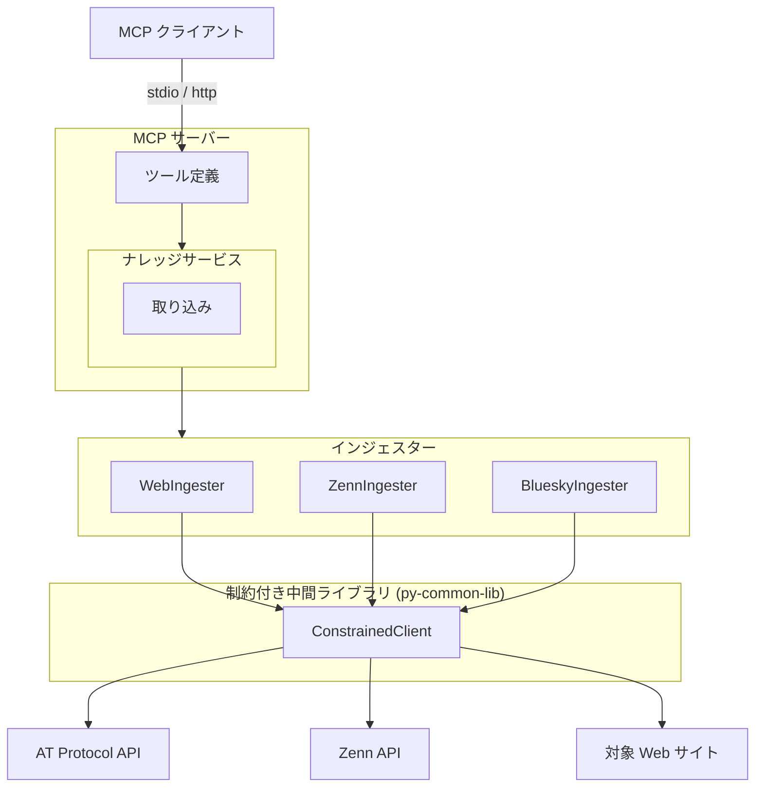
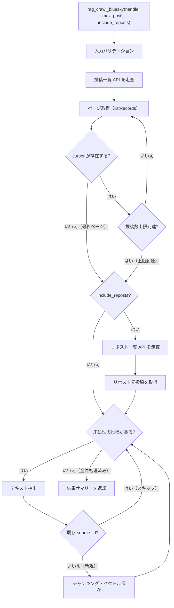

# BlueSky インジェスター

## 概要

BlueSky（AT Protocol）の投稿を API 経由で取得し、ナレッジベースに取り込むインジェスター。
`com.atproto.repo.listRecords` API を使用し、指定ユーザーの公開投稿を一括取得する。

スコープ:

- 指定ユーザーの公開投稿の取得（オリジナル投稿 + 引用リポスト）
- リポストの取得（オプション）
- MCP ツールとしての投稿取り込みインターフェースの提供

スコープ外:

- 他ユーザーの投稿の取得（リポスト元の取得を除く）
- 投稿の作成・編集・削除（読み取り専用）
- DM（ダイレクトメッセージ）の取得
- フォロー・いいね等のソーシャルデータの取得

## 背景

- インジェスタープラグイン構造の一環として、BlueSky の投稿をナレッジベースに取り込む機能が必要
- AT Protocol API を使用し、既存の BaseIngester / IngestedContent の共通インターフェースに準拠した設計を行う
- BlueSky の投稿は最大 300 文字（grapheme 単位）の短文であり、Markdown 変換は不要

## 制約

- 外部 HTTP リクエストは ConstrainedClient（py-common-lib）経由で実行する
- ハードリミット（コード内定数。設定・引数・環境変数で緩和不可。厳格化は可能）:
  - 操作あたりリクエスト総数上限: 500（ConstrainedClient 共通）
  - 最低リクエスト間隔: 0.1 秒（ConstrainedClient 共通。ページネーション走査中の各リクエスト間、リポスト元投稿取得間を含む全外部リクエスト間に適用）
  - 操作全体タイムアウト: 600 秒（許容範囲 1〜600 秒、ConstrainedClient 共通）
  - 投稿取得上限: 1000 件（BlueSky インジェスター固有。オリジナル投稿の取得数に適用。リポストは独立走査のため本上限の対象外）
- サーキットブレーカー: 5 回連続失敗で操作全体を中断する（ConstrainedClient 共通）
- バリデーションとクランプの使い分け:
  - **バリデーションエラー（拒否）**: 型不正（非整数など）、0、負数。これらは明らかな誤入力であり、クランプで救済しない
  - **クランプ（警告ログ付き）**: 正の整数だが許容範囲外（例: `max_posts=2000` → 1000 にクランプ）。意図的な大きい値の指定を安全な範囲に制限する
- `--no-limit` 等の制約バイパス手段は一切設けない
- `0 = 無制限` のセマンティクスを排除する

## 外部連携

### AT Protocol API

AT Protocol は分散型プロトコルであり、ユーザーのデータは各 PDS（Personal Data Server）にホストされる。XRPC エンドポイントはユーザーが所属する PDS に対してリクエストを送信する必要がある。

本インジェスターでは PDS のベース URL を設定可能とし、デフォルトは `https://bsky.social`（BlueSky 公式 PDS）とする。セルフホスト PDS や他の PDS を利用するユーザーの投稿を取得する場合は、環境変数 `RAG_BLUESKY_PDS_URL` で対象 PDS の URL を指定する。

> **Note**: handle から PDS エンドポイントを自動解決する仕組み（DID Document の `#atproto_pds` サービスエンドポイント参照）は、初期リリースのスコープ外とする。必要に応じて後続フェーズで対応する。

| 連携先 | 用途 | 接続方式 |
|--------|------|---------|
| AT Protocol PDS（デフォルト: bsky.social） | 投稿の取得 | REST API（ConstrainedClient 経由） |

#### listRecords エンドポイント（投稿取得）

| 項目 | 内容 |
|------|------|
| URL | `{PDS_URL}/xrpc/com.atproto.repo.listRecords`（デフォルト: `https://bsky.social/xrpc/com.atproto.repo.listRecords`） |
| メソッド | GET |
| 認証 | 不要（公開リポジトリ） |
| ページサイズ | `limit` パラメータで指定（最大 100） |
| ページネーション | レスポンスの `cursor` フィールド。存在しない場合は最終ページ |

クエリパラメータ:

| パラメータ | 型 | 必須 | 説明 |
|-----------|-----|------|------|
| `repo` | 文字列 | はい | DID またはハンドル（例: `user.bsky.social`） |
| `collection` | 文字列 | はい | レコードコレクション。投稿: `app.bsky.feed.post`、リポスト: `app.bsky.feed.repost` |
| `limit` | 整数 | いいえ | 1 ページあたりの取得件数（最大 100） |
| `cursor` | 文字列 | いいえ | ページネーションカーソル |
| `reverse` | 真偽値 | いいえ | `true` で古い順に取得 |

レスポンス構造:

| フィールド | 型 | 説明 |
|-----------|-----|------|
| `records` | 配列 | レコードオブジェクトの配列 |
| `cursor` | 文字列 or 不在 | 次ページのカーソル。最終ページでは存在しない |

レコードオブジェクトの主要フィールド:

| フィールド | 型 | 説明 |
|-----------|-----|------|
| `uri` | 文字列 | AT URI（例: `at://did:plc:xxx/app.bsky.feed.post/rkey`） |
| `cid` | 文字列 | コンテンツ ID |
| `value` | オブジェクト | レコード本体 |

投稿レコード（`value`）の主要フィールド:

| フィールド | 型 | 説明 |
|-----------|-----|------|
| `text` | 文字列 | 投稿テキスト（最大 300 grapheme） |
| `createdAt` | 文字列 | 投稿日時（ISO 8601） |
| `embed` | オブジェクト | 添付コンテンツ（画像・動画・リンクカード・引用等） |
| `reply` | オブジェクト | リプライ先情報（リプライの場合） |

#### getRecord エンドポイント（個別レコード取得）

リポスト元投稿の取得に使用する。

| 項目 | 内容 |
|------|------|
| URL | `{PDS_URL}/xrpc/com.atproto.repo.getRecord`（デフォルト: `https://bsky.social/xrpc/com.atproto.repo.getRecord`） |
| メソッド | GET |
| 認証 | 不要（公開リポジトリ） |

クエリパラメータ:

| パラメータ | 型 | 必須 | 説明 |
|-----------|-----|------|------|
| `repo` | 文字列 | はい | DID またはハンドル（レコード所有者） |
| `collection` | 文字列 | はい | レコードコレクション（例: `app.bsky.feed.post`） |
| `rkey` | 文字列 | はい | レコードキー（AT URI の末尾パス） |
| `cid` | 文字列 | いいえ | 特定バージョンの CID（省略時は最新） |

レスポンス構造:

| フィールド | 型 | 説明 |
|-----------|-----|------|
| `uri` | 文字列 | AT URI |
| `cid` | 文字列 | コンテンツ ID |
| `value` | オブジェクト | レコード本体（投稿レコードと同じ構造） |

エラーレスポンス:

| HTTP ステータス | 意味 | 対応 |
|----------------|------|------|
| 400 | パラメータ不正 | 該当リポストをスキップ、エラーログ出力 |
| 404（`RecordNotFound`） | レコードが存在しない（削除済み等） | 該当リポストをスキップ、警告ログ出力 |
| 502 / 503 / 504 | サーバーエラー | 該当リポストをスキップ、サーキットブレーカーに計上 |

#### リポスト取得

リポストは `collection=app.bsky.feed.repost` で別途取得する。リポストレコードは元投稿への参照（`subject.uri` / `subject.cid`）のみを含み、テキストは含まれない。元投稿のテキストを取得するには上記 `com.atproto.repo.getRecord` での追加リクエストが必要。

リポストレコード（`value`）の主要フィールド:

| フィールド | 型 | 説明 |
|-----------|-----|------|
| `subject.uri` | 文字列 | 元投稿の AT URI（例: `at://did:plc:xxx/app.bsky.feed.post/rkey`） |
| `subject.cid` | 文字列 | 元投稿のコンテンツ ID |
| `createdAt` | 文字列 | リポスト日時（ISO 8601） |

元投稿の取得時には、`subject.uri` を解析して `repo`（DID）、`collection`、`rkey` を抽出し、`getRecord` エンドポイントに渡す。

#### API 選定理由

`getAuthorFeed` ではなく `listRecords` を採用する理由:

- `getAuthorFeed` は約 1,950 件でカーソルが消失するバグがあり、全件取得が保証できない
- `listRecords` にはこの制限がなく、公開リポジトリの全レコードを取得可能
- `listRecords` は raw record を返すため、テキスト抽出には十分な情報を含む

## 想定プロファイル

### rag_crawl_bluesky（BlueSky 投稿一括取り込み・リポストなし）

| 項目 | 内容 |
|------|------|
| 最悪ケースリクエスト数 | 10（投稿走査: ceil(1000/100)）+ 1000（引用元投稿取得: 全投稿が引用リポストの場合）= 1010。ただしバジェットトラッカー上限 500 で打ち切り。引用のない一般的なケースでは 10 リクエスト程度 |
| 最悪ケース所要時間 | 500 × 0.1 秒（ハードリミット最小間隔での理論最短）= 50 秒。引用のない一般的なケースではデフォルト設定（1.0 秒間隔）で 10 秒。操作全体タイムアウト 600 秒の範囲内 |
| 想定エラー率 | AT Protocol API 依存。リトライ機構なし（失敗ページはエラーとして処理中断）。引用元取得失敗時は引用元テキストなしで続行。5 回連続失敗でサーキットブレーカーが発動し操作中断 |

### rag_crawl_bluesky（BlueSky 投稿一括取り込み・リポストあり）

`max_posts` はオリジナル投稿にのみ適用される。リポストは独立に走査し、件数上限は設けない（バジェット上限で制限）。

| 項目 | 内容 |
|------|------|
| 最悪ケースリクエスト数 | 10（投稿走査）+ 引用元取得（投稿側）+ リポスト走査（ページ数はリポスト総数依存）+ リポスト元投稿取得（リポスト件数分）+ 引用元取得（リポスト側）。全て合算でバジェットトラッカー上限 500 で打ち切り |
| 最悪ケース所要時間 | 500 × 0.1 秒（ハードリミット最小間隔での理論最短）= 50 秒。デフォルト設定（1.0 秒間隔）では 500 秒。操作全体タイムアウト 600 秒の範囲内 |
| 想定エラー率 | リポスト元投稿・引用元投稿の取得失敗時は該当投稿をスキップし処理を続行。5 回連続失敗でサーキットブレーカーが発動し操作中断 |

## 安全制約

| 制約名 | 種別 | 値 | 解除可否 |
|--------|------|-----|---------|
| 操作あたりリクエスト総数上限 | ハードリミット | 500 | 引き上げ不可（引き下げ可） |
| 最低リクエスト間隔 | ハードリミット | 0.1 秒 | 引き下げ不可（引き上げ可） |
| 操作全体タイムアウト | ハードリミット | 600 秒、許容範囲 1〜600 秒 | 引き上げ不可（引き下げ可、下限 1 秒） |
| サーキットブレーカー閾値 | ハードリミット | 5 回連続失敗 | 引き上げ不可（引き下げ可） |
| 投稿取得上限 | ハードリミット | 1000 件（オリジナル投稿のみ。リポストは対象外） | 引き上げ不可（引き下げ可） |
| 取得投稿数 | 設定値 | 許容範囲 1〜1000、デフォルト 200 | 範囲内で変更可 |
| リクエストタイムアウト | 設定値 | 許容範囲 1〜120 秒、デフォルト 30 秒 | 範囲内で変更可 |
| リクエスト間隔 | 設定値 | 許容範囲 0.1〜60 秒、デフォルト 1.0 秒 | 範囲内で変更可 |
| 生 HTTP クライアント利用禁止 | CI チェック | `src/` 全体を grep で走査（httpx / aiohttp / requests / urllib.request）。`# safety:allowed` 行を除外。ConstrainedClient は py-common-lib パッケージで提供（`src/` 外のため検出対象外） | 許可例外は `# safety:allowed` コメントで可 |

テスト実行時の安全な値: 投稿取得上限 3 件で実行する。異常値テスト（0、負数、上限超過）を含めること。

## インターフェース

### MCP ツール

既存の `rag_crawl`（URL ベースの Web クロール）および `rag_crawl_zenn`（Zenn 記事取り込み）とは独立した新規ツールとして追加する。BlueSky は AT Protocol API 経由でのデータ取得であり、Web クロールや Zenn API とは取得方式・制約が異なるため分離する。

| ツール | 入力 | 振る舞い |
|--------|------|---------|
| rag_crawl_bluesky | handle、max_posts（任意）、include_reposts（任意） | 指定ユーザーの BlueSky 投稿を AT Protocol API 経由で取得し、ナレッジベースに取り込む。BlueSky は投稿編集不可のため、既存 `source_id` と一致する投稿はスキップする（上書き不要） |

ツール入力パラメータ:

| パラメータ | 型 | 必須 | 説明 |
|-----------|-----|------|------|
| `handle` | 文字列 | はい | BlueSky ハンドル（例: `user.bsky.social`）。DID 形式（`did:` 始まり）はバリデーションで拒否する |
| `max_posts` | 整数 | いいえ | 取得する最大投稿数。デフォルト: 200、許容範囲: 1〜1000 |
| `include_reposts` | 真偽値 | いいえ | リポストを取得対象に含めるか。デフォルト: `false` |

ツール出力: 取り込み結果のサマリーテキスト（取得投稿数、スキップ数、チャンク数、エラー数）

プレビュー機能は提供しない。BlueSky の投稿一覧は公開情報（`https://bsky.app/profile/{handle}` で閲覧可能）であり、取り込み前の確認は BlueSky 上で直接行える。

### 設定項目

| 環境変数 | 型 | デフォルト | 許容範囲 | 説明 |
|---------|-----|-----------|---------|------|
| `RAG_BLUESKY_PDS_URL` | 文字列 | `https://bsky.social` | 有効な HTTPS URL | PDS のベース URL。セルフホスト PDS 等を利用する場合に変更する |
| `RAG_BLUESKY_MAX_POSTS` | 整数 | 200 | 1〜1000 | 取得する最大投稿数 |
| `RAG_BLUESKY_REQUEST_TIMEOUT` | 整数 | 30 | 1〜120 | リクエストタイムアウト（秒） |
| `RAG_BLUESKY_REQUEST_INTERVAL` | 小数 | 1.0 | 0.1〜60 | リクエスト間の最低間隔（秒） |
| `RAG_BLUESKY_INCLUDE_REPOSTS` | 真偽値 | false | true/false | リポストを取得対象に含めるか |

## コンポーネント構成

### BlueSky インジェスターの位置付け

### コンポーネント一覧

| コンポーネント | 役割 |
|--------------|------|
| BlueskyIngester | BlueSky 投稿取り込み用インジェスター。BaseIngester を継承し、AT Protocol API 経由で投稿を取得する |
| ConstrainedClient (py-common-lib) | 全外部 HTTP リクエストのゲートウェイ。ハードリミット・バジェット・サーキットブレーカーを統合する |

### 投稿一括取り込みフロー

### 投稿一覧走査の処理手順

1. `listRecords` API に `collection=app.bsky.feed.post`、`repo={handle}`、`limit=100` でリクエストを送信する
2. レスポンスから `records` 配列を取得し、各レコードの `uri` から `rkey` を抽出して投稿リストに追加する
3. 終了判定（以下のいずれかで走査を終了する）:
   - `cursor` がレスポンスに存在しない（最終ページ）
   - 投稿数上限に到達
   - バジェット上限に到達（ConstrainedClient）
   - サーキットブレーカー発動（ConstrainedClient）
4. 終了条件を満たさない場合、`cursor` の値でリクエストパラメータを更新し、手順 1 に戻る
5. 収集した投稿レコードのリストを返す

### リポスト取得の処理手順

`include_reposts` が有効な場合のみ実行する。リポスト走査は `max_posts` の対象外であり、オリジナル投稿とは独立して走査する。リポスト走査の件数上限は設けず、ConstrainedClient のバジェット上限（500 リクエスト）で自然に制限される。

1. `listRecords` API に `collection=app.bsky.feed.repost`、`repo={handle}`、`limit=100` でリクエストを送信する
2. レスポンスから `records` 配列を取得し、各レコードの `value.subject.uri` を抽出する
3. 終了判定（以下のいずれかで走査を終了する）:
   - `cursor` がレスポンスに存在しない（最終ページ）
   - バジェット上限に到達（ConstrainedClient）
   - サーキットブレーカー発動（ConstrainedClient）
4. 各リポストの元投稿を `com.atproto.repo.getRecord` で取得する
   - 元投稿の取得に失敗した場合は該当リポストをスキップし、次のリポストの処理を続行する
5. 取得した元投稿を投稿リストに追加する（重複する `source_id` は除外する）

### テキスト抽出

投稿は最大 300 文字（grapheme 単位）の短文であり、Markdown 変換は不要。プレーンテキストとして取り込む。

抽出対象フィールド:

| フィールド | パス | 説明 |
|-----------|------|------|
| 投稿テキスト | `value.text` | 投稿本文 |
| 画像 ALT テキスト | `value.embed.images[].alt` | 画像の代替テキスト |
| 動画 ALT テキスト | `value.embed.alt` | 動画の代替テキスト |
| リンクカードタイトル | `value.embed.external.title` | 外部リンクのタイトル |
| リンクカード説明 | `value.embed.external.description` | 外部リンクの説明文 |

embed の `$type` が `app.bsky.embed.recordWithMedia`（メディア + 引用の複合型）の場合、メディア部分は `embed.media` 配下にネストされる:

| フィールド | パス（recordWithMedia 時） | 説明 |
|-----------|--------------------------|------|
| 画像 ALT テキスト | `value.embed.media.images[].alt` | recordWithMedia 時の画像 ALT |
| 動画 ALT テキスト | `value.embed.media.alt` | recordWithMedia 時の動画 ALT |
| リンクカードタイトル | `value.embed.media.external.title` | recordWithMedia 時のリンクタイトル |
| リンクカード説明 | `value.embed.media.external.description` | recordWithMedia 時のリンク説明 |

#### 引用元投稿テキストの取得

listRecords が返す raw record の `embed.record` は `strongRef`（`uri` + `cid`）のみを含み、引用元の投稿テキストは含まれない。引用元テキストを取得するには `getRecord` による追加リクエストが必要。

引用リポスト（`embed.$type` が `app.bsky.embed.record` または `app.bsky.embed.recordWithMedia`）を検出した場合、`embed.record.uri`（recordWithMedia 時は `embed.record.record.uri`）から引用元の AT URI を取得し、`getRecord` で引用元投稿のテキストを取得する。取得失敗時は引用元テキストなしで投稿本文のみを取り込む。

抽出対象外:

- 動画キャプション（VTT）

抽出したテキストはフィールド間を改行で連結し、1 つのプレーンテキストとして構築する。引用元テキストには `[引用元]` プレフィックスを付加し、投稿本文と区別できるようにする。

### スレッドの扱い

スレッド（連続投稿）は個別投稿として取り込む（結合しない）。各投稿が独立した IngestedContent となる。

### source_id

AT URI 形式を使用する: `at://{did}/app.bsky.feed.post/{rkey}`

- `did`: レコードの `uri` フィールドから抽出した DID（例: `did:plc:xxx`）
- `rkey`: `uri` の末尾パス（`at://did:plc:xxx/app.bsky.feed.post/{rkey}` の `{rkey}` 部分）

AT URI を `source_id` に採用する理由:

- DID はハンドル変更の影響を受けない安定した識別子であり、再取り込み時の重複検出が確実に機能する
- ハンドルは変更可能なため、HTTPS URL 形式（`https://bsky.app/profile/{handle}/post/{rkey}`）では同一投稿に対して異なる `source_id` が生成されるリスクがある

HTTPS URL（`https://bsky.app/profile/{handle}/post/{rkey}`）は `metadata` の `url` フィールドに格納し、ユーザー向けのリンクとして利用する。

### 再取り込み時の挙動

BlueSky は投稿の編集が不可能なため、既存の `source_id` と一致する投稿はスキップする（上書き不要）。スキップ件数はサマリーに含めて返却する。

なお、BlueSky 上で削除された投稿はナレッジベースに残り続ける。削除同期（差分検出による自動削除）は行わない。ユーザーが `rag_delete` で手動削除する運用とする。これは既存インジェスター（Web, Zenn）と同じ方針である。

### IngestedContent の構築

各投稿から以下のフィールドで IngestedContent を構築する:

| フィールド | 値 |
|-----------|-----|
| `source_id` | `at://{did}/app.bsky.feed.post/{rkey}`（AT URI） |
| `title` | 投稿テキストの先頭 50 文字（50 文字を超える場合は末尾に `...` を付加） |
| `text` | 抽出済みプレーンテキスト |
| `source_type` | `"bluesky"` |
| `metadata` | `handle`、`did`、`rkey`、`url`（`https://bsky.app/profile/{handle}/post/{rkey}`）、`createdAt`、`has_images`、`has_video`、`has_external_link`、`is_reply`、`is_repost` |

## エッジケース

| ケース | 振る舞い |
|--------|---------|
| ハンドルが存在しない | API がエラーを返す。エラーメッセージとして「指定されたハンドルが見つかりません」を返す |
| ユーザーの投稿が 0 件 | 空の `records` 配列。0 件取得として正常終了する |
| `listRecords` API のレスポンス形式変更 | JSON パースエラーまたは必須フィールド欠落として処理を中断する。エラーの詳細をログ出力する |
| 投稿レコードの `text` フィールドが空 | 他の抽出対象フィールド（ALT テキスト等）がある場合は取り込む。全て空の場合は該当投稿をスキップする |
| リポスト元投稿の取得失敗（404 等） | 該当リポストをスキップし、他のリポストの処理を続行する。エラーをログ出力する |
| リポスト元投稿が非公開・削除済み | 取得失敗と同様にスキップする |
| 同一投稿の重複（オリジナルとリポスト） | `source_id` の一致で重複を検出し、2 件目以降をスキップする |
| 既存 source_id との一致 | スキップする（BlueSky は投稿編集不可のため上書き不要） |
| 取り込み済み投稿が BlueSky 上で削除された | ナレッジベースに残る。削除同期は行わない。ユーザーが `rag_delete` で手動削除する |
| 大量投稿ユーザー（1000 件超） | 投稿取得上限（1000 件）で打ち切る。取得済み投稿を処理し、上限到達の旨を警告ログに出力する |
| バジェット上限到達 | 取得済みデータを返し、上限到達の旨をログ出力する |
| サーキットブレーカー発動 | 操作を中断し、取得済みデータを返す。エラーの詳細をログ出力する |
| 操作全体タイムアウト | 操作を中断し、取得済みデータを返す |
| 設定値がハードリミット超過（正の整数） | ハードリミット値にクランプし、警告ログを出力する |
| `max_posts` に 0 や負数を指定 | バリデーションエラーとして拒否する（クランプ対象外。制約セクション参照） |
| `handle` が空文字列 | バリデーションエラーとして拒否する |
| `handle` に DID 形式（`did:` 始まり）が指定された | バリデーションエラーとして拒否する |
| 引用元投稿の getRecord 取得失敗 | 引用元テキストなしで投稿本文のみ取り込む。エラーをログ出力する |
| AT Protocol のレート制限（429） | ConstrainedClient のサーキットブレーカーで検出される。連続失敗として計上し、閾値超過で操作を中断する |

## 関連ドキュメント

- [rag-knowledge.md](rag-knowledge.md) — RAG ナレッジ基盤仕様（ConstrainedClient・安全制約の共通定義）
- [zenn-ingester.md](zenn-ingester.md) — Zenn インジェスター仕様（参考: 既存インジェスター）
