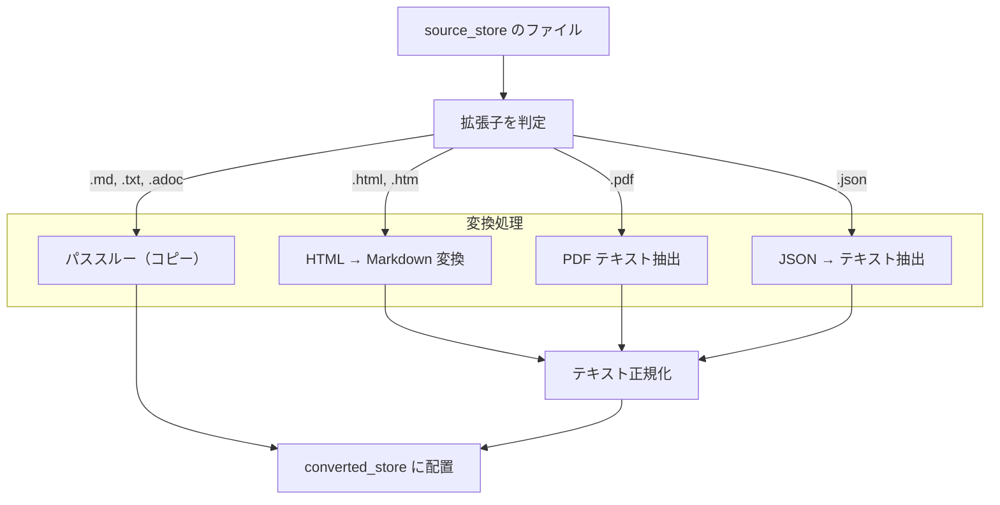

# コンバーター

## 概要

コンバーターは 3 段パイプライン（インジェスター → コンバーター → インデクサー）の中間層であり、source_store のオリジナルデータを converted_store のテキストファイルに変換する。

ファイル形式（拡張子）に応じた変換方式を選択し、インデクサーが処理可能な統一テキスト形式を出力する。変換不要なファイルはそのまま converted_store にコピーする（パススルー）。

スコープ:

- ファイル形式に応じたテキスト変換
- 変換不要ファイルのパススルー（コピー）
- converted_store へのファイル配置
- 再生成オプションの制御

スコープ外:

- source_store のディレクトリ構成・.meta 形式の定義（source_store 仕様の範疇）
- git 操作（パイプライン制御の範疇）
- インデックス構築・更新（インデクサーの範疇）
- 外部 API 通信（変換処理はローカルで完結する）

## 背景

- 3 段パイプラインにおいて、source_store のオリジナルデータ（HTML, PDF, JSON 等）をインデクサーが直接扱うと、インデクサーにファイル形式ごとの変換ロジックが混在する
- 変換ロジックを独立したステージに切り出すことで、変換方式の改修がインデクサーに影響しない構造にする
- converted_store にテキスト変換済みファイルを配置することで、インデクサーは常に converted_store のみを参照すればよい

## 制約

- **ファイル形式の判定は拡張子ベース**: source_store 内のファイル拡張子で変換方式を決定する。拡張子が同一であれば source_type に関わらず同じ変換方式を適用する。ただし、source_type 固有の前処理が必要な場合は source_type に応じた分岐を許容する
- **source_type の判定**: ファイルの source_store 内トップレベルディレクトリから判定する（値は [`_schema/enums.yml`](../../_schema/enums.yml) の `source_type` を参照）
- **変換対象外ファイル**: `.meta` サイドカーファイルおよび `metadata.db` は変換対象外とする（スキップする）
- **変換結果は UTF-8 テキスト**: 変換処理（HTML → Markdown、PDF テキスト抽出、JSON → テキスト）の出力は UTF-8 エンコーディングとする。パススルーファイルはバイト列コピーであり、この制約の対象外（元のエンコーディングをそのまま保持する）
- **converted_store は git 管理しない**: 再生成可能な派生データであるため、git 管理対象外とする
- **変換エラー時の継続**: 個別ファイルの変換エラーは当該ファイルをスキップし、エラーログに記録して残りのファイルの処理を続行する。パイプライン制御にエラー情報を返却する
- **テキスト正規化**: 変換後のテキストに対して共通の正規化処理を適用する（末尾空白の除去、連続する空行を最大 1 行に圧縮）

本コンポーネントは外部 API 通信を行わないため、想定プロファイル・安全制約セクションは省略する。

## インターフェース

### 変換操作

| 操作 | 入力 | 出力 | 振る舞い |
|------|------|------|---------|
| 単一ファイル変換 | source_store 内の相対パス、再生成オプション | converted_store 内の相対パス | ファイル拡張子に応じた変換を実行し、converted_store に配置する |
| 一括変換 | 相対パスのリスト、再生成オプション | 変換結果サマリ（成功数・スキップ数・エラー数） | リスト内の各ファイルを順次変換する |
| 単一ファイル削除 | converted_store 内の相対パス | なし | converted_store から指定ファイルを削除する |
| 全クリア | source_type フィルタ（任意） | なし | converted_store 内のファイルを全削除する。source_type 指定時はそのディレクトリのみ |

### 再生成オプション

変換済みファイルが既に converted_store に存在する場合の振る舞いを制御する。

| オプション | 振る舞い | 用途 |
|-----------|---------|------|
| `skip`（デフォルト） | 変換済みファイルが存在する場合、変換をスキップする | 差分更新時のデフォルト動作。新規・変更ファイルのみ処理 |
| `if_modified` | source_store のファイル更新日時が converted_store より新しい場合のみ再変換する | コンバートのみ再実行時に、未変更ファイルの再変換を回避 |
| `force` | 常に上書きする | 変換ロジック改修後の全再変換時に使用 |

パイプライン制御からの呼び出し時、差分更新では変更ファイルのみが渡されるため `skip` で十分に機能する。`if_modified` と `force` はコンバートのみ再実行・全再構築で使用する。

## コンポーネント構成

### 対応ファイル形式と変換方式

| 拡張子 | 入力形式 | 出力形式 | 出力拡張子 | 変換方式 |
|--------|---------|---------|-----------|---------|
| `.html` | HTML | Markdown | `.md` | HTML → Markdown 変換 |
| `.htm` | HTML | Markdown | `.md` | HTML → Markdown 変換（`.html` と同一処理） |
| `.pdf` | PDF | Markdown | `.md` | PDF テキスト抽出 |
| `.json` | JSON | Markdown | `.md` | source_type に応じた構造化テキスト抽出 |
| `.md` | Markdown | Markdown | `.md` | パススルー（コピー） |
| `.txt` | プレーンテキスト | プレーンテキスト | `.txt` | パススルー（コピー） |
| `.adoc` | AsciiDoc | AsciiDoc | `.adoc` | パススルー（コピー） |

未対応の拡張子のファイルは変換をスキップし、警告ログを出力する。

### 変換フロー

1. source_store からファイルを読み込む
2. 拡張子に応じた変換処理を選択する（HTML → Markdown / PDF → テキスト抽出 / JSON → テキスト抽出 / パススルー）
3. 変換結果にテキスト正規化を適用する（パススルーは正規化なし）
4. converted_store に配置する



### converted_store のディレクトリ構成

source_store のディレクトリ構成をミラーする。source_store 内の相対パスがそのまま converted_store 内の相対パスに対応する（拡張子は変換後の形式に変わる）。

変換例:

| source_store のパス | converted_store のパス |
|--------------------|----------------------|
| `web/https/example.com/docs/guide.html` | `web/https/example.com/docs/guide.md` |
| `web/https/example.com/docs/report.pdf` | `web/https/example.com/docs/report.md` |
| `bluesky/did：plc：xxx/2026/03/rkey.json` | `bluesky/did：plc：xxx/2026/03/rkey.md` |
| `zenn/alice/articles/slug.json` | `zenn/alice/articles/slug.md` |
| `youtube/UCxxx/video_id.json` | `youtube/UCxxx/video_id.md` |
| `aozora/000035/001567.html` | `aozora/000035/001567.md` |
| `local/my-notes/memo.md` | `local/my-notes/memo.md` |
| `local/my-notes/note.txt` | `local/my-notes/note.txt` |
| `local/docs/guide.adoc` | `local/docs/guide.adoc` |
| `journal/rag-knowledge/entry.md` | `journal/rag-knowledge/entry.md` |

### HTML → Markdown 変換

markdownify ベースの変換。RAG 用途に最適化したカスタマイズを行う。

#### コンテンツ領域の特定

HTML からナビゲーション・サイドバー・フッター等のボイラープレートを除外し、本文コンテンツを含む領域を特定する。以下の優先順で探索し、最初にヒットした要素をコンテンツ領域とする。

| 優先度 | 探索対象 | 根拠 |
|--------|---------|------|
| 1 | `<article>` タグ | HTML5 セマンティックタグ |
| 2 | `<main>` タグ | HTML5 セマンティックタグ |
| 3 | `role="main"` 属性を持つ要素 | WAI-ARIA ランドマーク |
| 4 | id 属性がコンテンツパターンに一致する要素 | 慣習的な命名パターン |
| 5 | class 属性がコンテンツパターンに一致する要素 | 慣習的な命名パターン |
| 6 | `<body>` 直下でテキスト量が最大の子要素 | テキスト密度フォールバック |
| 7 | `<body>` タグ | 最終フォールバック |

id/class パターンの一致判定:

- 部分一致（大文字小文字を区別しない）で判定する
- id パターンは長いパターンから順に試行する（具体的なパターンを優先）
- テキストが空の要素はスキップし、次の候補を試行する（空の `<div id="contents">` 等による誤検出を防止）

id パターン一覧（試行順）:

部分一致判定のため、短いパターンが先に試行されると、より具体的な id を持つ要素が短いパターンで先にマッチしてしまう。これを防ぐため長いパターンから順に試行する。ハイフンとアンダースコアは正規表現上別文字として扱われるため、両方の変種を個別パターンとして登録する。

| パターン | マッチ例 |
|---------|---------|
| `main-content` | `id="main-content"` |
| `main_content` | `id="main_content"` |
| `content-wrap` | `id="content-wrap"` |
| `content_wrap` | `id="content_wrap"` |
| `page-container` | `id="page-container"` |
| `page_container` | `id="page_container"` |
| `main-body` | `id="main-body"` |
| `main_body` | `id="main_body"` |
| `content` | `id="content"`, `id="content-area"` |
| `main` | `id="main"` |

class パターン一覧（試行順）:

| パターン | マッチ例 |
|---------|---------|
| `main-content` | `class="main-content"` |
| `main_content` | `class="main_content"` |
| `main_text` | `class="main_text"`（青空文庫 XHTML 等） |
| `main-text` | `class="main-text"` |
| `content-wrap` | `class="content-wrap"` |
| `content_wrap` | `class="content_wrap"` |
| `page-container` | `class="page-container"` |
| `page_container` | `class="page_container"` |

テキスト密度フォールバック:

- `<body>` 直下の子要素のうち、以下の条件で絞り込む:
  - `<script>`, `<style>`, `<nav>`, `<noscript>`, `<link>` を除外する
  - 子 Tag を持たない末端要素（`<p>`, `<h1>` 等）を除外する（コンテンツラッパーではないため）
- 残った候補のうち `get_text(strip=True)` のテキスト量が最大の要素を選択する
- コンテンツ領域の外にある要素（サイドバー、ヘッダー、フッター等）は、多くのケースでテキスト密度の条件により候補から外れるが、ページ構造によっては選択される可能性もある

#### コンテンツ領域内の非コンテンツ除去

コンテンツ領域の特定後、領域内に残る非コンテンツ要素を除去する。

タグ名ベースの除去:

| タグ | 理由 |
|------|------|
| `<script>` | JavaScript コード |
| `<style>` | CSS スタイル定義 |
| `<noscript>` | JavaScript 無効時の代替コンテンツ |
| `<form>` | 検索フォーム等の入力要素 |

class パターンベースの除去（部分一致、大文字小文字を区別しない）:

| パターン | 理由 |
|---------|------|
| `breadcrumb` | パンくずリスト |
| `topic-path` | パンくずリスト（Nintendo 等の命名） |
| `nextprev` | ページ送りナビゲーション |
| `pagination` | ページネーション |
| `toolbar` | ツールバー |

`<nav>`, `<header>`, `<footer>`, `<aside>` タグはコンテンツ領域の特定により自動的に除外されるケースが多いため、コンテンツ領域内では一律除去しない。これにより、コンテンツ領域内の `<header>` タグ（インタビュータイトル等）が誤って除去される問題を回避する。

#### Markdown 変換ルール

- 見出し: ATX スタイル（`#` 形式）で出力する
- テーブル: ヘッダーを自動推論し、Markdown テーブルとして保持する
- リンク: URL を除去し、リンクテキストのみを保持する。チャンクサイズの節約のため。引用 URL はメタデータ側で管理する
- 画像: ALT テキストのみを保持する（ALT テキストがない場合は空文字列）
- エスケープ: アンダースコア・アスタリスクのエスケープを無効化する（Markdown としての自然な表示を優先）
- ruby タグ: 漢字テキストを保持し、ふりがな（`<rt>`）を半角括弧付きで付与する（例: `髯(ひげ)`）。括弧要素（`<rp>`）は除去する。ふりがなを残すことで読みによる検索を可能にする

### PDF テキスト抽出

PDF ファイルからテキストを抽出し、Markdown 形式で出力する。2 つのバックエンドを使い分ける。

#### バックエンド選択

| バックエンド | 概要 | 使用条件 |
|-------------|------|---------|
| pymupdf4llm | 高速・軽量な PDF テキスト抽出 | デフォルト。通常の PDF に適する |
| MinerU | OCR 対応・数式対応の高精度抽出 | 数式が多い PDF、テキスト抽出品質が低い PDF |

`rag_pdf_backend` 設定で選択する:

| 設定値 | 振る舞い |
|--------|---------|
| `auto` | PDF の特性を自動判定してバックエンドを選択する |
| `pymupdf4llm` | 常に pymupdf4llm を使用する |
| `mineru` | 常に MinerU を使用する |

#### 自動判定（auto モード）

PDF の特性を 3 段階で評価し、バックエンドと処理モードを決定する。

判定フロー:

1. **メタデータ検査**: PDF の生成元情報（TeX/LaTeX 由来かどうか）を確認する
2. **フォント解析**: 数式フォント（cmmi, stix 等）の使用有無を確認する
3. **品質サンプリング**: サンプルページからテキスト抽出品質を評価する

判定基準（優先度順に評価、最初に該当した条件で決定）:

| 優先度 | 条件 | 判定結果 |
|--------|------|---------|
| 1 | ToUnicode CMap が欠落 | MinerU（OCR モード） |
| 2 | Unicode 置換文字率が閾値超過 | MinerU（OCR モード） |
| 3 | CJK 文字率が低く、かつギリシャ文字率が高い | MinerU（OCR モード） |
| 4 | ページあたり平均文字数が閾値未満 | MinerU（OCR モード） |
| 5 | 数式フォントを検出 | MinerU（テキストモード） |
| 6 | TeX 由来メタデータを検出 | MinerU（テキストモード） |
| 7 | 上記のいずれにも該当しない | pymupdf4llm |

### JSON → テキスト抽出

JSON ファイルから構造化テキストを抽出する。source_store に JSON 形式で保存されるのは BlueSky 投稿、YouTube 動画、Zenn 記事、Zenn スクラップ。source_type とファイルパスに応じたハンドラを選択する。

#### BlueSky 投稿（source_type: bluesky）

AT Protocol の投稿 JSON（`getAuthorFeed` レスポンスのフィードアイテム）からテキストを抽出する。投稿は最大 300 文字の短文であり、Markdown 変換は不要。プレーンテキストとして抽出する。

テキスト抽出は `post.record`（raw record）から行う。`post.record` の embed の `$type` に `#view` サフィックスは付かない。

**基本フィールド:**

| フィールド | パス | 説明 |
|-----------|------|------|
| 投稿テキスト | `post.record.text` | 投稿本文 |
| 画像 ALT テキスト | `post.record.embed.images[].alt` | 画像の代替テキスト |
| 動画 ALT テキスト | `post.record.embed.alt` | 動画の代替テキスト |
| リンクカードタイトル | `post.record.embed.external.title` | 外部リンクのタイトル |
| リンクカード URL | `post.record.embed.external.uri` | 外部リンクの URL |
| リンクカード説明 | `post.record.embed.external.description` | 外部リンクの説明文 |

**recordWithMedia 時のフィールド:**

embed の `$type` が `app.bsky.embed.recordWithMedia`（メディア + 引用の複合型）の場合、メディア部分は `embed.media` 配下にネストされる:

| フィールド | パス（recordWithMedia 時） | 説明 |
|-----------|--------------------------|------|
| 画像 ALT テキスト | `post.record.embed.media.images[].alt` | recordWithMedia 時の画像 ALT |
| 動画 ALT テキスト | `post.record.embed.media.alt` | recordWithMedia 時の動画 ALT |
| リンクカードタイトル | `post.record.embed.media.external.title` | recordWithMedia 時のリンクタイトル |
| リンクカード URL | `post.record.embed.media.external.uri` | recordWithMedia 時のリンク URL |
| リンクカード説明 | `post.record.embed.media.external.description` | recordWithMedia 時のリンク説明 |

**引用元投稿テキスト:**

引用リポスト（`post.record.embed.$type` が `app.bsky.embed.record` または `app.bsky.embed.recordWithMedia`）を検出した場合、引用元テキストを `post.embed`（view 版、API レスポンスに展開済み）から取得する:

| embed の $type | 引用元テキストのパス |
|----------------|-------------------|
| `app.bsky.embed.record` | `post.embed.record.value.text` |
| `app.bsky.embed.recordWithMedia` | `post.embed.record.record.value.text` |

引用元が投稿以外（スターターパック、フィードジェネレーター等）の場合は `value` キーが存在しない。この場合は引用元テキストなしとして扱う。

**抽出対象外:** 動画キャプション（VTT）

**テキスト構造:**

抽出したテキストは以下の構造で構築する。各セクションは空行で区切る。該当するセクションがない場合は省略する。

```
[Repost: @元投稿者ハンドル]
投稿テキスト

[Image ALT] 画像の代替テキスト（複数ある場合は改行で連結）
[Video ALT] 動画の代替テキスト

[Link Card]
Title: 外部リンクのタイトル
URL: 外部リンクの URL
Description: 外部リンクの説明文

[Quote]
引用元の投稿テキスト
```

- リポストの場合、先頭に `[Repost: @元投稿者ハンドル]` ヘッダーを付与する。元投稿者のハンドルは `post.author.handle` から取得する
- 投稿テキストを先頭に配置する（検索ヒット時に最も重要な情報が先頭に来る）
- セクションラベルは英語表記とする（LLM による検索・解釈の精度向上のため）

#### YouTube 動画（source_type: youtube）

YouTube 動画の JSON（字幕スニペット + メタデータ）からテキストを抽出し、Markdown 形式で出力する。

1. `title`、`uploader`、`upload_date`、`video_id`、`duration` フィールドからヘッダーを構築する
2. `snippets` 配列（タイムスタンプ + テキスト）を時系列で結合する
3. スニペット間の間隔が `rag_youtube_merge_gap_sec`（デフォルト: 2.0 秒）以上の場合、段落を分割する
4. 結合後のテキストが `rag_youtube_merge_max_chars`（デフォルト: 300 文字）を超えた場合、次の区切りポイントで分割する
5. ヘッダー + 結合テキストを Markdown として出力する

#### Zenn 記事（source_type: zenn、articles/ 配下の JSON）

Zenn 記事の JSON（`article` オブジェクト）から `body_html` を抽出し、HTML → Markdown 変換を適用する。

1. `article.body_html` フィールドを取得する
2. `body_html` が空または存在しない場合は変換をスキップする
3. `body_html` から `script`/`style` タグを除去し、Markdown 変換ルール（ATX 見出し、テーブル保持、リンク URL 除去等）を適用する。Zenn API の `body_html` はコンテンツ本文のみを含むため、コンテンツ領域の特定は行わない
4. .meta からタイトルを取得し、H1 見出しとして先頭に付与する（既存の `_prepend_title_from_meta` の振る舞いを維持）

#### Zenn スクラップ（source_type: zenn、scraps/ 配下の JSON）

Zenn スクラップの JSON（`scrap` オブジェクト）から `comments` 配列の各コメントの `body_html` を順序保持で結合し、Markdown に変換する。

1. `scrap.comments` 配列をインデックス順に走査する
2. 各コメントの `body_html` から `script`/`style` タグを除去し、Markdown 変換ルール（ATX 見出し、テーブル保持、リンク URL 除去等）を適用する。Zenn API の `body_html` はコンテンツ本文のみを含むため、コンテンツ領域の特定は行わない
3. 変換後の各コメントを `---`（水平線）で区切って結合する

コメントが 0 件または全コメントの `body_html` が空の場合は、変換をスキップする。converted_store に既存ファイルがある場合は削除する。パイプライン制御にスキップ結果（変換なし）を返却し、パイプライン制御がインデクサーに当該 source_id のインデックス削除を指示する。

### パススルー

変換不要なファイル（`.md`, `.txt`, `.adoc`）は source_store から converted_store にそのままコピーする。

パススルーの目的: インデクサーが常に converted_store のみを参照すればよい設計にする。source_store と converted_store の両方を参照するフォールバックロジックを不要にする。

### テキスト正規化

変換処理（HTML → Markdown、PDF テキスト抽出、JSON → テキスト）の後に共通の正規化処理を適用する。パススルーファイルには適用しない（オリジナルデータをそのまま保持する）。

| 処理 | 内容 |
|------|------|
| 末尾空白の除去 | 各行の末尾にある空白文字を除去する |
| 連続空行の圧縮 | 連続する空行を最大 1 行に圧縮する |

### 設定項目

| 設定項目 | 層 | 設計意図 |
|---------|-----|---------|
| `rag_pdf_backend` | 共通設定値 | PDF バックエンド選択。環境のGPU有無やPDF特性に応じて切り替える |
| `rag_pdf_mineru_mfd_conf_thres` | 共通設定値 | MinerU MFD 信頼度閾値。数式検出の感度を制御する |
| `rag_pdf_quality_ufffd_threshold` | 共通設定値 | Unicode 置換文字率の閾値。テキスト抽出品質の判定基準 |
| `rag_pdf_quality_greek_threshold` | 共通設定値 | ギリシャ文字率の閾値。数式含有の判定基準 |
| `rag_pdf_quality_cjk_min_threshold` | 共通設定値 | CJK 文字率の下限閾値。CJK テキスト検出の判定基準 |
| `rag_pdf_quality_min_chars_per_page` | 共通設定値 | ページあたり最低文字数。テキスト抽出品質の判定基準 |
| `rag_pdf_quality_sample_pages` | 共通設定値 | 品質サンプリングページ数。判定の精度とコストのバランス |
| `rag_youtube_merge_gap_sec` | 共通設定値 | YouTube スニペット結合の間隔閾値。段落分割の粒度を制御する |
| `rag_youtube_merge_max_chars` | 共通設定値 | YouTube スニペット結合の最大文字数。段落サイズの上限 |

`CONVERTED_STORE_DIR` は [pipeline-controller.md](pipeline-controller.md) の設定項目で定義済み。

## エッジケース

| ケース | 振る舞い |
|--------|---------|
| 未対応の拡張子のファイル | 変換をスキップし、警告ログを出力する。converted_store にはファイルを配置しない |
| 0 バイトのファイル | 変換をスキップし、警告ログを出力する |
| HTML ファイルの文字エンコーディングが UTF-8 以外 | charset_normalizer ベースのエンコーディング自動推定で元のエンコーディングを検出し、UTF-8 に変換する |
| PDF のテキスト抽出結果が空 | 変換をスキップし、警告ログを出力する。converted_store にはファイルを配置しない |
| MinerU が未インストールの環境で `rag_pdf_backend` が `auto` | auto 判定で MinerU が必要と判断された場合、pymupdf4llm にフォールバックし、警告ログを出力する |
| MinerU が未インストールの環境で `rag_pdf_backend` が `mineru` | エラーログを出力し、当該ファイルの変換をスキップする |
| Zenn 記事 JSON に `body_html` フィールドがない、または空 | 変換をスキップし、警告ログを出力する |
| JSON ファイルの source_type が不明 | 変換をスキップし、警告ログを出力する。JSON の変換は source_type に依存するため、source_type 情報なしでは変換できない |
| converted_store のディレクトリが存在しない場合 | 変換時に必要なディレクトリを自動作成する |
| パススルー対象ファイルのコピーエラー（I/O エラー等） | エラーログを出力し、当該ファイルのコピーをスキップする |
| `.meta` ファイルや `metadata.db` が変換対象として渡された場合 | 変換対象外としてスキップする |
| HTML の void 要素（``, `<br>` 等）が `html.parser` により非自己閉じとして解析された場合 | BeautifulSoup 解析後に void 要素の子ノードを親に巻き上げる前処理を適用し、本文の消失を防ぐ |

## 関連ドキュメント

- [source-store.md](source-store.md) — source_store 仕様
- [pipeline-controller.md](pipeline-controller.md) — パイプライン制御仕様
- [ingesters/bluesky.md](ingesters/bluesky.md) — BlueSky インジェスター仕様（JSON 保存形式の定義元）
- [ingesters/youtube.md](ingesters/youtube.md) — YouTube インジェスター仕様（JSON 保存形式の定義元）
- [ingesters/zenn.md](ingesters/zenn.md) — Zenn インジェスター仕様（JSON 保存形式の定義元）
