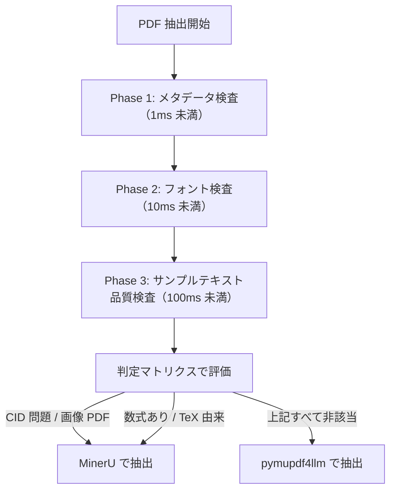
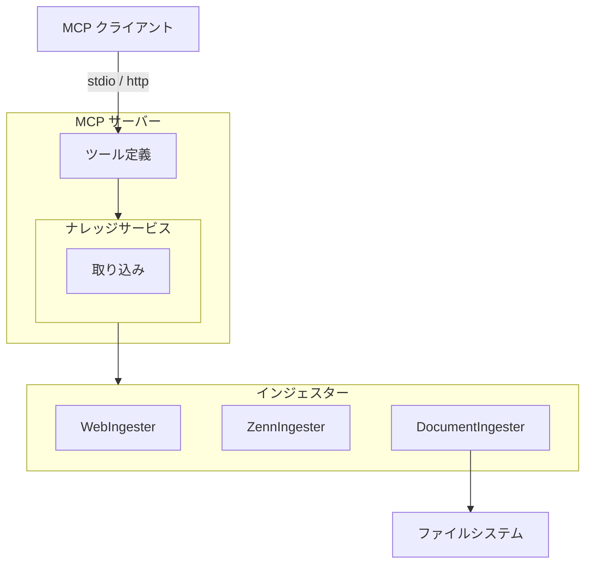
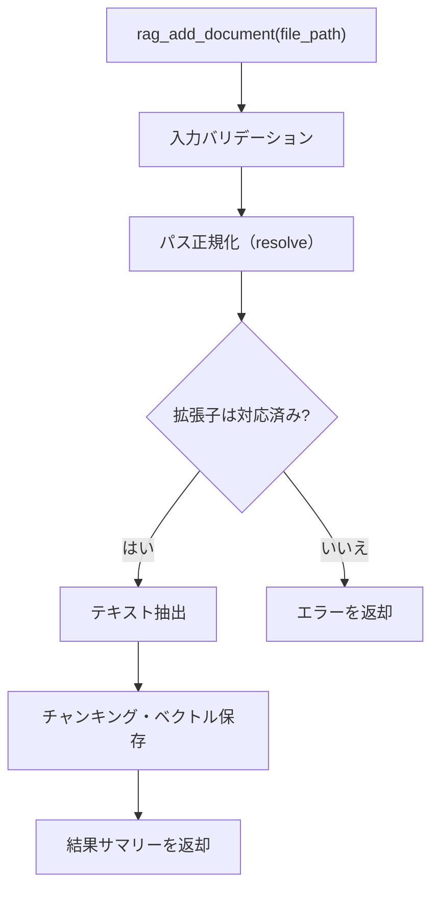
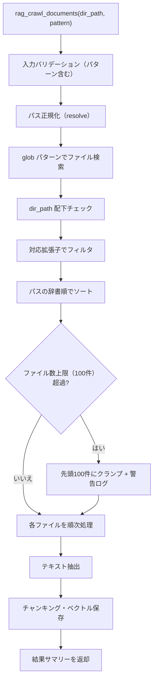

# ドキュメントインジェスター

## 概要

テキストドキュメントを読み取り、ナレッジベースに取り込むインジェスター。
単一ファイルの追加とディレクトリ一括取り込みの 2 つの操作を提供する。

スコープ:

- 単一ファイルのテキスト抽出とナレッジベースへの取り込み
- ディレクトリ内ファイルの glob パターンによる一括取り込み
- 複数ファイル形式（Markdown、プレーンテキスト、PDF、AsciiDoc）への対応
- MCP ツールとしてのファイル取り込みインターフェースの提供

スコープ外:

- リモートファイルシステム（SMB、NFS 等）上のファイル取得
- バイナリファイル（画像、音声、動画等）の取り込み
- ファイルの書き込み・編集・削除（読み取り専用）
- ファイル変更の自動監視（ウォッチ機能）

## 背景

- 既存のインジェスター（WebIngester、ZennIngester）は外部 Web リソースからの取り込みに特化しており、テキストドキュメント（職務経歴書、学習ノート等）を直接取り込む手段がない
- BaseIngester / IngestedContent の共通インターフェースに準拠し、プラグイン構造（#109）の一環として設計する

## 制約

- 現時点ではローカルファイルシステムのみ対象とする（外部 HTTP リクエストは発生しない）
- パストラバーサル対策: ファイルパスを `Path.resolve()` で正規化し、`..` を含むパスの解決後に実際のファイルシステムパスとして扱う
- アクセス許可ディレクトリの制限は設けない（OS レベルのファイル権限に委ねる）
  - **前提**: 本機能は stdio モードでの信頼済みローカル環境での利用を想定する。HTTP モードで外部公開する場合は、認証・ネットワーク制御等の対策が必須である。HTTP モードでの本ツールの有効化は明示的な opt-in とし、デフォルトでは無効とする
- ハードリミット（コード内定数。設定・引数・環境変数で緩和不可。厳格化は可能）:
  - ディレクトリ一括取り込み時のファイル数上限: 100 件
- バリデーションとクランプの使い分け:
  - **バリデーションエラー（拒否）**: 空文字列のパス、存在しないファイル、対応していない拡張子
  - **クランプ（警告ログ付き）**: 一括取り込み時に glob パターンがハードリミットを超える件数にマッチした場合、パスの辞書順でソートした上で先頭 100 件のみ処理する

## 安全制約

| 制約名 | 種別 | 値 | 解除可否 |
|--------|------|-----|---------|
| ディレクトリ一括取り込みファイル数上限 | ハードリミット | 100 件 | 引き上げ不可（引き下げ可） |
| パストラバーサル対策 | ハードリミット | `Path.resolve()` による正規化 | 無効化不可 |
| HTTP モードでのデフォルト無効 | 設定値 | HTTP モード時は明示的 opt-in が必要 | デフォルト: 無効。opt-in で有効化可能 |

テスト実行時の安全な値: ファイル数上限 5 件で実行する。異常値テスト（空パス、存在しないファイル、未対応拡張子、ハードリミット超過）を含めること。

## インターフェース

### MCP ツール

既存の `rag_add`（URL ベースの単一ページ追加）および `rag_crawl`（URL ベースの一括クロール）とは独立した新規ツールとして追加する。ドキュメントファイルはファイルシステムからの読み取りであり、Web クロールとは取得方式・制約が異なるため分離する。

| ツール | 入力 | 振る舞い |
|--------|------|---------|
| rag_add_document | file_path | 単一ドキュメントファイルを読み取り、ナレッジベースに取り込む。同一ファイルの再取り込み時は `source_id`（file URI）の一致で検出し、既存の知識を最新に置き換える |
| rag_crawl_documents | dir_path、pattern（任意） | 指定ディレクトリ内のドキュメントファイルを glob パターンで検索し、一括でナレッジベースに取り込む。同一ファイルの再取り込み時は `source_id`（file URI）の一致で検出し、既存の知識を最新に置き換える |

#### rag_add_document パラメータ

| パラメータ | 型 | 必須 | 説明 |
|-----------|-----|------|------|
| `file_path` | 文字列 | はい | 取り込み対象ファイルのパス（絶対パスまたは相対パス） |

ツール出力: 取り込み結果のサマリーテキスト（ファイル名、チャンク数）

#### rag_crawl_documents パラメータ

| パラメータ | 型 | 必須 | 説明 |
|-----------|-----|------|------|
| `dir_path` | 文字列 | はい | 取り込み対象ディレクトリのパス（絶対パスまたは相対パス） |
| `pattern` | 文字列 | いいえ | glob パターン。デフォルト: `**/*`（再帰的に全対応ファイルを検索） |

パターンのバリデーション: `pattern` に `..` が含まれる場合、または絶対パス（`Path(pattern).is_absolute()` で判定。`/` 始まりおよび Windows ドライブレター形式の両方を検出）の場合はバリデーションエラーとして拒否する。加えて、glob マッチ結果の各ファイルを `Path.resolve()` で正規化した後、`dir_path` の配下であることを検証し、配下でないファイルは除外する。

ツール出力: 取り込み結果のサマリーテキスト（処理ファイル数、総チャンク数、スキップ数、エラー数）

### 対応ファイル形式

| 拡張子 | テキスト抽出方式 |
|--------|----------------|
| `.md` | そのまま Markdown として取り込む |
| `.txt` | プレーンテキストとして取り込む（構造変換なし） |
| `.pdf` | PDF バックエンド自動選択により pymupdf4llm または MinerU で Markdown に変換して取り込む（詳細は「PDF 抽出バックエンドの自動選択」参照） |
| `.adoc` | AsciiDoc としてそのまま取り込む |

対応拡張子は環境変数 `RAG_DOCUMENT_SUPPORTED_EXTENSIONS` で追加可能（セクション「設定項目」参照）。追加した拡張子のファイルはプレーンテキストとして取り込む。

### source_id

ファイルの絶対パスを `Path.as_uri()` で file URI に変換した文字列を `source_id` として使用する。file URI を使用することで、パス中の `#` 等の特殊文字が適切にエスケープされ、下流の `urldefrag()` による誤った正規化を防止する。

- 例: `file:///home/user/documents/resume.md`（Linux）、`file:///C:/Users/user/documents/resume.md`（Windows）
- 相対パスで指定された場合も、内部で絶対パスに変換してから file URI に変換する
- 同一ファイルの再取り込み時は、`source_id` の一致で既存チャンクを削除→再登録する（既存インジェスターと同一パターン）

### PDF 抽出バックエンドの自動選択

PDF のテキスト抽出に pymupdf4llm と MinerU の 2 つのバックエンドを使い分ける。PDF の特性を事前に軽量検査し、最適なバックエンドを自動選択する。

#### バックエンド

| バックエンド | 用途 | ライセンス |
|------------|------|-----------|
| pymupdf4llm | 通常の PDF（テキストレイヤーが正常） | AGPL-3.0 |
| MinerU | CID フォント文字化け PDF、画像ベース PDF、数式を含む PDF | AGPL-3.0 |

MinerU はオプショナル依存。未インストール時は pymupdf4llm にフォールバックし、警告ログを出力する。

#### バックエンド選択方式

`RAG_PDF_BACKEND` 設定で選択方式を制御する:

| 値 | 振る舞い |
|----|---------|
| `auto` | 事前判定フローで自動選択（デフォルト） |
| `mineru` | MinerU を強制使用 |
| `pymupdf4llm` | pymupdf4llm を強制使用 |

#### 事前判定フロー

`RAG_PDF_BACKEND=auto` の場合、PDF 抽出の前に 3 フェーズの軽量検査を実行し、バックエンドを自動選択する。全ページ抽出前に判定するため、「抽出→品質不良→やり直し」の無駄が発生しない。

##### Phase 1: メタデータ検査

PDF メタデータの `producer` / `creator` に TeX/LaTeX 系キーワード（`tex`, `latex`, `pdflatex`, `xelatex`, `lualatex`, `dvips`, `dvipdfm`）が含まれるか確認する。該当すれば TeX 由来フラグを立てる。

##### Phase 2: フォント検査

各ページのフォント情報を検査する:

- Type0（CID）フォントの ToUnicode CMap 存在チェック
- 数式フォント名の検出（CMMI, CMSY, CMEX, MSAM, MSBM, STIX, Cambria Math, Latin Modern Math 等）

##### Phase 3: サンプルテキスト品質検査

均等分布で最大 `rag_pdf_quality_sample_pages` ページをサンプリングし、テキスト品質を計測する:

- Unicode 置換文字（U+FFFD）の出現率
- CJK 文字比率
- ギリシャ文字比率
- テキスト量（ページあたり文字数）

サンプリングは全体を均等分割した中間位置から取得する（先頭・末尾の内容が薄いページを回避）。

#### 判定マトリクス

上から順に評価し、最初にマッチした行のバックエンド・モードを採用する:

| 検出結果 | バックエンド | MinerU モード | 理由 |
|---------|------------|-------------|------|
| ToUnicode CMap 欠落 | MinerU | OCR | テキストレイヤーが信頼できない |
| ufffd 率 > 閾値 | MinerU | OCR | テキストレイヤーが信頼できない |
| CJK 比率 < 閾値 かつ ギリシャ文字比率 > 閾値 | MinerU | OCR | CID フォント文字化けの兆候 |
| テキスト量 < 閾値（画像ベース PDF） | MinerU | OCR | テキストレイヤーが存在しない |
| 数式フォント検出 | MinerU | txt | 数式の LaTeX 変換が目的 |
| TeX 由来メタデータ | MinerU | txt | 数式の LaTeX 変換が目的 |
| 上記すべて非該当 | pymupdf4llm | — | 通常の PDF |

#### MinerU のデバイス選択

CUDA が利用可能なら GPU、なければ CPU を自動選択する。

#### MinerU の MFD 信頼度閾値

MinerU の数式検出（MFD: Math Formula Detection）は YOLOv8 ベースで動作する。デフォルトの信頼度閾値（0.25）ではひらがな等の非数式要素を数式として誤検出する場合がある。`rag_pdf_mineru_mfd_conf_thres`（デフォルト: 0.6）で閾値を引き上げ、数式検出 100% を維持しつつ誤検出を 85% 削減する。

### 設定項目

#### 環境依存値（.env）

| 環境変数 | 型 | デフォルト | 許容範囲 | 説明 |
|---------|-----|-----------|---------|------|
| `RAG_DOCUMENT_SUPPORTED_EXTENSIONS` | 文字列 | `".md,.txt,.pdf,.adoc"` | ドット始まりのカンマ区切り文字列 | 対応ファイル拡張子のカンマ区切りリスト。先頭にドット（`.`）を含める |
| `RAG_PDF_BACKEND` | 文字列 | `"auto"` | `auto` / `mineru` / `pymupdf4llm` | PDF 抽出バックエンド選択 |

#### 共通設定値（config.toml）

| 設定キー | 型 | デフォルト | 許容範囲 | 説明 |
|---------|-----|-----------|---------|------|
| `rag_pdf_mineru_mfd_conf_thres` | float | 0.6 | 0.0〜1.0 | MinerU MFD の信頼度閾値 |
| `rag_pdf_quality_ufffd_threshold` | float | 0.10 | 0.0〜1.0 | ufffd 率の閾値（超過で MinerU OCR 選択） |
| `rag_pdf_quality_greek_threshold` | float | 0.15 | 0.0〜1.0 | ギリシャ文字比率の閾値 |
| `rag_pdf_quality_cjk_min_threshold` | float | 0.05 | 0.0〜1.0 | CJK 比率の下限閾値 |
| `rag_pdf_quality_min_chars_per_page` | int | 10 | 1〜10000 | ページあたり最小文字数の閾値 |
| `rag_pdf_quality_sample_pages` | int | 10 | 1〜100 | サンプリングページ数（PDF の全ページ数を超える場合は全ページ対象） |

## コンポーネント構成

### ドキュメントインジェスターの位置付け

### コンポーネント一覧

| コンポーネント | 役割 |
|--------------|------|
| DocumentIngester | ドキュメント取り込み用インジェスター。BaseIngester を継承し、ファイルシステムからドキュメントを読み取る |

### 単一ファイル取り込みフロー

### ディレクトリ一括取り込みフロー

### 単一ファイル取り込みの処理手順

1. `file_path` をバリデーションする（空文字列チェック）
2. `Path.resolve()` でパスを正規化する（シンボリックリンク解決、`..` 除去）
3. ファイルの存在を確認する
4. 拡張子が対応リストに含まれるか確認する
5. ファイル形式に応じたテキスト抽出を行う（テキストファイルは UTF-8 エンコーディングで読み取る）:
   - `.md`: ファイル内容をそのまま読み取る
   - `.txt`: ファイル内容をそのまま読み取る
   - `.pdf`: PDF バックエンド自動選択により pymupdf4llm または MinerU で Markdown に変換する
   - `.adoc`: ファイル内容をそのまま読み取る（AsciiDoc 構文はチャンカーの AsciiDoc モードで処理される）
   - その他（設定で追加された拡張子）: プレーンテキストとして読み取る
6. IngestedContent を構築する:
   - `source_id`: file URI（`Path.as_uri()` で生成）
   - `title`: ファイル名（拡張子なし）
   - `text`: 抽出済みテキスト
   - `source_type`: `"document"`
   - `metadata`: `file_extension`、`file_size_bytes`、`file_path`（元の指定パス）
7. ナレッジサービス経由でチャンキング・ベクトル保存を行う

### ディレクトリ一括取り込みの処理手順

1. `dir_path` をバリデーションする（空文字列チェック）
2. `Path.resolve()` でパスを正規化する
3. ディレクトリの存在を確認する
4. `pattern` をバリデーションする（`..` を含む場合、または `Path(pattern).is_absolute()` が真の場合は拒否）
5. glob パターンでファイルを検索する（デフォルト: `**/*`）
6. 各マッチファイルを `Path.resolve()` で正規化し、`dir_path` 配下でないファイルを除外する
7. 対応拡張子でフィルタする
8. パスの辞書順でソートする
9. ファイル数がハードリミット（100 件）を超える場合、先頭 100 件にクランプし警告ログを出力する
10. 各ファイルに対して単一ファイル取り込みの処理手順（手順 2〜7）を順次実行する
11. 個別ファイルの処理エラーは該当ファイルをスキップし、他のファイルの処理を続行する
12. 結果サマリーを返す（処理ファイル数、総チャンク数、スキップ数、エラー数）

## エッジケース

| ケース | 振る舞い |
|--------|---------|
| ファイルが存在しない | バリデーションエラーとして拒否する |
| ディレクトリが存在しない | バリデーションエラーとして拒否する |
| 対応していない拡張子のファイル | バリデーションエラーとして拒否する（単一取り込み時）。一括取り込み時はフィルタで除外する |
| `file_path` が空文字列 | バリデーションエラーとして拒否する |
| `dir_path` が空文字列 | バリデーションエラーとして拒否する |
| パスに `..` が含まれる | `Path.resolve()` で正規化し、解決後の実パスで処理する |
| シンボリックリンク | `Path.resolve()` でリンク先を解決し、実ファイルを処理する |
| ファイルの読み取り権限がない | 該当ファイルをスキップし、エラーをログ出力する |
| ファイルサイズが 0 バイト | 該当ファイルをスキップする。空テキストの取り込みは行わない |
| テキストエンコーディングが UTF-8 以外 | `UnicodeDecodeError` をキャッチし、該当ファイルをスキップする。エラーをログ出力する |
| PDF の変換に失敗 | 該当ファイルをスキップし、エラーをログ出力する |
| MinerU が未インストール（`RAG_PDF_BACKEND=auto`） | pymupdf4llm にフォールバックし、警告ログを出力する |
| MinerU が未インストール（`RAG_PDF_BACKEND=mineru`） | pymupdf4llm にフォールバックし、警告ログを出力する |
| PDF 事前判定で検査が失敗 | pymupdf4llm にフォールバックし、警告ログを出力する |
| `RAG_PDF_BACKEND` に無効な値が設定 | pydantic のバリデーションエラー（起動時に検出） |
| glob パターンがファイル数上限を超過 | パスの辞書順でソートした上で先頭 100 件にクランプし、警告ログを出力する。超過分は処理しない |
| glob パターンに一致するファイルが 0 件 | 0 件処理として正常終了する |
| 同一ファイルの再取り込み | `source_id`（file URI）の一致で検出し、既存データを最新に置き換える |
| ファイルが指定されたがディレクトリだった | バリデーションエラーとして拒否する（`rag_add_document` の場合） |
| ディレクトリが指定されたがファイルだった | バリデーションエラーとして拒否する（`rag_crawl_documents` の場合） |
| `pattern` に `..` が含まれる、または `Path(pattern).is_absolute()` が真 | バリデーションエラーとして拒否する |
| glob マッチ結果が `dir_path` 配下でない | 該当ファイルを除外する |

## 関連ドキュメント

- [rag-knowledge.md](rag-knowledge.md) — RAG ナレッジ基盤仕様
- [zenn-ingester.md](zenn-ingester.md) — Zenn インジェスター仕様（参考: インジェスター設計パターン）
