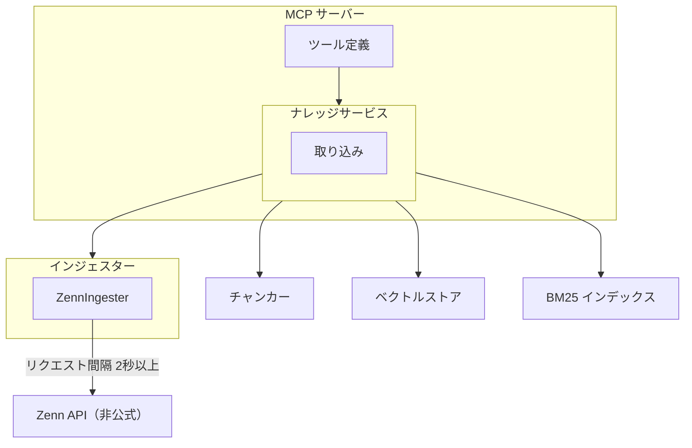

# Zenn インジェスター

## 概要

Zenn の記事を非公式 API 経由で取得し、RAG ナレッジに取り込むインジェスター。

`BaseIngester` を継承し、Zenn 記事の発見（`discover`）・個別取得（`fetch_single`）・一括取得（`fetch_batch`）を提供する。取り込んだ記事は `IngestedContent`（`source_type: "zenn"`）として返却し、既存のチャンキング・ベクトル保存パイプラインに統合する。

スコープ:

- Zenn 記事の一覧取得（ユーザー名指定、ページネーション付き）
- Zenn 記事の個別取得（slug または URL 指定）
- MCP ツールまたは CLI サブコマンドでの取り込みインターフェース

スコープ外:

- Zenn Books、Scraps、コメントの取り込み
- Zenn 以外のデータソース

## 背景

- RAG Knowledge の知識ソースを Web クロール以外に拡張するため、インジェスタープラグイン構造（#109）の最初のデータソース拡張として Zenn を対象とする
- 過去に 3 回の事故（無制限 API リクエストによる Cloudflare ブロック）と 3 回の revert を経験しており、安全制約の厳格な定義が必須
- Zenn は公式 API を提供していないため、非公式エンドポイントを使用する。外部サービスへの影響を最小化する保守的な制約設計が求められる

## 制約

### 外部 API 制約

Zenn API は非公式であり、以下の特性を前提とする:

- ドキュメントが存在しない
- Cloudflare 保護が有効
- レート制限の仕様が非公開
- 予告なく仕様が変更される可能性がある

### ページネーション許容範囲

記事一覧取得時のページネーション制御。

| 項目 | 値 | 根拠 |
|------|-----|------|
| 下限 | 1 ページ | 0 以下は無意味な値 |
| 上限（ハードリミット） | 10 ページ | 非公式 API のため保守的に設定。コードレベルで解除不可能 |
| デフォルト | 3 ページ | 通常利用で十分な量（約 144 件）を安全に取得可能 |

- 1 ページあたり約 48 件を返す（2025 年 3 月時点の観測値。非公式 API のため変更の可能性あり）
- 上限はコードレベルで解除不可能なハードリミットとして実装する
- `--no-limit` や制限解除フラグの作成は禁止。許容範囲をバイパスするいかなる手段も設けない
- `0 = 無制限` のセマンティクスは禁止

### 記事取得数の許容範囲

一度の操作で取得する記事数の制御。

| 項目 | 値 | 根拠 |
|------|-----|------|
| 下限 | 1 件 | 0 以下は無意味な値 |
| 上限（ハードリミット） | 100 件 | 非公式 API への負荷を制限。コードレベルで解除不可能 |
| デフォルト | 48 件 | 1 ページ分に相当 |

### バッチサイズ許容範囲

`fetch_batch` で一度に処理する記事数の制御。

| 項目 | 値 | 根拠 |
|------|-----|------|
| 下限 | 1 件 | 0 以下は無意味な値 |
| 上限（ハードリミット） | 10 件 | 並行リクエストによる外部サービスへの負荷を制限 |
| デフォルト | 5 件 | 安全と効率のバランス |

バッチ処理はバッチサイズ単位で順次実行する。バッチ間にもリクエスト間隔を適用する。

### リクエスト間隔

| 項目 | 値 | 根拠 |
|------|-----|------|
| 最小間隔（ハードリミット） | 2 秒 | Zenn API のレート制限が非公開のため、保守的に設定 |
| デフォルト | 2 秒 | 最小間隔と同値 |

- 最小間隔はコードレベルで短縮不可能なハードリミットとして実装する
- 設定で間隔を延長することは可能

### リクエストタイムアウト

| 項目 | 値 |
|------|-----|
| リクエストタイムアウト | 30 秒 |

### リトライ

| 項目 | 値 |
|------|-----|
| 最大リトライ回数 | 3 回 |
| バックオフ方式 | 指数バックオフ |
| 最小待機時間 | 1 秒 |
| 最大待機時間 | 30 秒 |
| 停止条件 | 3 回失敗で処理を停止しエラーを報告する |

### 不可逆操作の識別

以下の操作は不可逆操作として識別する:

- ベクトル DB への書き込み（チャンク保存）
- BM25 インデックスへの書き込み

取り込み操作は DB への書き込みを伴うため、不可逆操作に該当する。同一 `source_id` での再取り込み時は既存データを上書きする（rag_add と同じ振る舞い）。

### テスト実行時の安全な値

| 項目 | テスト時の値 |
|------|------------|
| 最大ページ数 | 1 ページ |
| 最大記事取得数 | 3 件 |
| バッチサイズ | 2 件 |

テストコードでは実際の Zenn API を呼び出さず、モックを使用する。

### 異常値バリデーション

以下の入力はバリデーションで拒否する:

- ページ数: 0、負数、上限（10）超過
- 記事取得数: 0、負数、上限（100）超過
- バッチサイズ: 0、負数、上限（10）超過
- リクエスト間隔: 最小間隔（2 秒）未満
- ユーザー名: 空文字列、None

### 上限到達時の振る舞い

ページネーション上限または記事取得数上限に達した場合:

- 取得済みデータを返す
- 上限に達した旨をログに出力する（WARNING レベル）
- エラーとしては扱わない

### 禁止事項

過去の事故原因に基づく禁止事項:

- `--no-limit` や制限解除フラグの作成禁止。許容範囲をバイパスするいかなる手段も設けない
- `0 = 無制限` のセマンティクス禁止
- 許容範囲の上限値を設定ファイルや引数で変更可能にすることの禁止（デフォルト値のみ変更可能）

### 設定項目

`.env` で管理する設定項目。`RAG_ZENN_*` プレフィックスを使用する。

| 設定項目 | 説明 | デフォルト値 |
|---------|------|------------|
| `RAG_ZENN_USERNAME` | 取得対象の Zenn ユーザー名 | なし（必須） |
| `RAG_ZENN_DEFAULT_MAX_PAGES` | デフォルトの最大取得ページ数（許容範囲: 1〜10） | 3 |
| `RAG_ZENN_REQUEST_INTERVAL` | リクエスト間隔（秒）（最小: 2） | 2 |

## 操作一覧

| 操作 | 概要 | トリガー |
|------|------|---------|
| 記事一覧取得 | 指定ユーザーの Zenn 記事一覧を取得する | MCP ツール / CLI サブコマンド |
| 単一記事取得 | slug または URL で指定した記事を取得・取り込む | MCP ツール / CLI サブコマンド |
| 一括取り込み | discover で発見した記事を一括取得・取り込む | MCP ツール / CLI サブコマンド |

## 各操作の仕様

### 記事一覧取得（discover）

**トリガー**: ユーザー名を指定して MCP ツールまたは CLI サブコマンドを実行する。

**振る舞い**:

1. ユーザー名のバリデーション（空文字列・None を拒否）
2. Zenn API（`https://zenn.dev/api/articles?username={username}&order=latest&page={page}`）にリクエストを送信する
3. ページネーションで次ページが存在する場合、リクエスト間隔を空けて次ページを取得する
4. ページネーション上限または記事取得数上限に達した場合、取得済みデータを返す
5. 取得した記事の slug リストを返す

**出力**: 発見された記事 slug のリスト。上限到達時はログに通知を出力する。

### 単一記事取得（fetch_single）

**トリガー**: slug または Zenn 記事 URL を指定して実行する。

**振る舞い**:

1. 識別子のバリデーションと正規化（`validate_identifier`）
   - URL 形式（`https://zenn.dev/{username}/articles/{slug}`）の場合、slug を抽出する
   - slug 形式の場合、`{username}/{slug}` として扱う
2. Zenn API またはページクロールで記事本文を取得する
3. 取得したコンテンツを `IngestedContent` に変換して返す

**出力**: `IngestedContent` オブジェクト。以下のフィールドを設定する:

| フィールド | 値 |
|-----------|-----|
| `source_id` | `https://zenn.dev/{username}/articles/{slug}` |
| `title` | 記事タイトル |
| `text` | 記事本文（Markdown） |
| `ingested_at` | 取得時刻（ISO 8601） |
| `source_type` | `"zenn"` |
| `metadata` | Zenn API が返す記事メタデータを保持: `slug`, `username`, `published_at`, `article_type`, `emoji` |

取得失敗時は None を返す。

### 一括取り込み（fetch_batch）

**トリガー**: 記事 slug のリストを指定して実行する。

**振る舞い**:

1. 入力リストのバリデーション（空リスト、上限超過のチェック）
2. バッチサイズ単位でグループ化する
3. 各バッチ内の記事を順次取得する（`fetch_single` を呼び出し）
4. バッチ間にリクエスト間隔を適用する
5. 取得に成功した `IngestedContent` のリストを返す

**出力**: 取得に成功した `IngestedContent` のリスト。個別の取得失敗はログに記録し、他の記事の処理を続行する。

## エッジケース

| ケース | 振る舞い |
|--------|---------|
| 存在しないユーザー名 | API が空の結果を返すため、空リストを返す |
| 非公開・下書き記事 | API レスポンスに含まれないため、取得対象外 |
| API レスポンス形式の変更 | パースエラーとしてログに記録し、処理を停止する |
| Cloudflare によるブロック（403/429） | リトライ上限まで再試行し、失敗時はエラーを報告して停止する |
| ネットワークタイムアウト | リトライ上限まで再試行し、失敗時はエラーを報告する |
| 記事本文が空 | `text` を空文字列として `IngestedContent` を返す。チャンキング段階で空チャンクは生成しない |
| 同一記事の再取り込み | 同一 `source_id` の既存データを上書きする |
| discover 中のページネーションエラー | 取得済みデータを返し、エラーをログに記録する |

## コンポーネント構成

### 関連ファイル

| ファイル | 役割 |
|---------|------|
| `src/rag/ingesters/base.py` | インジェスター基盤（BaseIngester / IngestedContent） |
| `src/rag/ingesters/zenn.py` | ZennIngester 実装（新設） |
| `src/rag/ingesters/__init__.py` | インジェスタープラグイン公開（ZennIngester の追加が必要） |

## 関連ドキュメント

- [RAG ナレッジ](../rag-knowledge.md) — 基盤仕様
- [全体仕様概要](../overview.md) — 機能一覧
