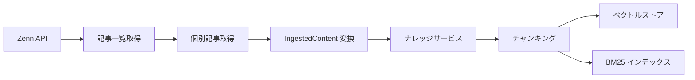

# Zenn インジェスター

## 概要

Zenn API を利用して特定ユーザーの記事を取得し、RAG ナレッジベースに取り込むインジェスター。

Zenn の記事ページは動的に生成されるため、Web クローラーによる HTML 取得では本文テキストを抽出できない。Zenn API (`/api/articles`) を直接利用して記事コンテンツを取得する。

スコープ:

- Zenn API からの記事一覧取得（ユーザー名指定）
- 個別記事の本文取得と IngestedContent への変換
- ページネーションの安全な制御

スコープ外:

- Zenn のブック（books）の取得
- Zenn のスクラップ（scraps）の取得
- Publication 単位での取得

## 背景

- Zenn の記事ページは Next.js による動的レンダリングのため、既存の Web クローラー（HTML 取得 → テキスト抽出）では本文を取得できない
- Zenn API は公式ドキュメントが公開されていない非公式 API であり、仕様変更の可能性がある。そのため、API 応答の変化に対する防御的な設計が必要
- 過去の実装（PR #83）で API への無制限リクエスト（約 5000 件 + 約 4800 件）が 2 回発生し、全変更を巻き戻した経緯がある。制約を先に定義し、安全な取り込みを保証する

## 制約

### ページネーション上限

- ページネーション取得上限: **10 ページ**（デフォルト、最大 480 件相当）
- 1 ページあたりの取得件数: API のデフォルト値（48 件）を使用し、クライアント側では指定しない
- 上限解除には CLI オプション `--no-limit` の明示的な指定を要求する
- 上限到達時は取得済みデータを返し、上限に達した旨をログに出力する（WARNING レベル）

### リクエスト間隔・頻度制限

- リクエスト間隔: **1 秒以上**（記事一覧ページ間、個別記事取得間のそれぞれに適用）
- Zenn API はレート制限の公式ドキュメントがないため、保守的な間隔を設定する

### タイムアウト

- 個別リクエストタイムアウト: **30 秒**
- 処理全体のタイムアウト: **なし**（ページネーション上限とリクエスト間隔で総処理時間を間接的に制御する）

### リトライ

- 最大リトライ回数: **3 回**
- バックオフ方式: 指数バックオフ（初回 1 秒、2 回目 2 秒、3 回目 4 秒）
- 3 回失敗で当該リクエストをスキップし、エラーをログに出力する
- 記事一覧取得のリトライ失敗時は処理全体を停止する
- 個別記事取得のリトライ失敗時は当該記事をスキップし、他の記事の処理を続行する

### テスト実行時の安全な値

- ページネーション上限: **1 ページ**
- 取得記事数上限: **3 件**
- テストでは Zenn API を直接呼び出さず、モックを使用する

### 副作用の影響範囲

- ベクトルストア（ChromaDB）: チャンクデータの追加・上書き
- BM25 インデックス: トークンインデックスの更新
- Zenn API: 読み取りのみ（書き込みなし）

### 不可逆操作

- ベクトルストア・BM25 インデックスへのデータ書き込みは不可逆操作に該当する
- 既存データの上書き: 同一 slug の記事を再取り込みした場合、既存チャンクを最新に置き換える（WebIngester と同じ振る舞い）
- Zenn API への書き込みは行わない（読み取り専用）

### 段階的実行

- `--dry-run` フラグ指定時は、取得対象の記事一覧（タイトル・slug）を表示するのみで、取り込みは行わない
- 一括取り込みの段階: `--dry-run`（プレビュー） → 単体取り込み（小規模確認） → 一括取り込み（フル実行）

### API の非公式性への対応

- Zenn API は公式ドキュメントが公開されていない非公式 API であり、予告なく仕様変更される可能性がある
- API 応答が期待するスキーマと異なる場合はエラーとして処理を停止し、ログに詳細を出力する
- User-Agent ヘッダーにアプリケーション名を含める

## 操作一覧

| 操作 | トリガー | 概要 |
| --- | --- | --- |
| Zenn 記事一括取り込み | MCP ツール / CLI | 指定ユーザーの記事を API 経由で一括取得し、ナレッジベースに取り込む |
| Zenn 記事単体取り込み | MCP ツール / CLI | slug 指定で単一記事を取得し、ナレッジベースに取り込む |

## 各操作の仕様

### Zenn 記事一括取り込み

**トリガー**: MCP ツール `rag_ingest_zenn` または CLI `ingest-zenn` コマンド

**入力**:

| パラメータ | 必須 | 説明 |
| --- | --- | --- |
| `username` | はい | Zenn ユーザー名 |
| `--dry-run` | いいえ | 取得対象の記事一覧を表示するのみで、取り込みを行わない |
| `--no-limit` | いいえ | ページネーション上限を解除する |

**振る舞い**:

1. `https://zenn.dev/api/articles?username={username}&order=latest&page={page}` に GET リクエストを送信する
2. レスポンスの `articles` 配列から記事 slug の一覧を取得する
3. `next_page` が `null` またはページネーション上限に到達するまでページを進める
4. 各記事の本文を `https://zenn.dev/api/articles/{slug}` から取得する。レスポンスの `body_html` フィールドを本文として使用する
5. 取得した記事を IngestedContent に変換し、ナレッジサービスに渡す
6. 同一 slug の記事が既存の場合、既存チャンクを最新に置き換える

**出力**:

- 取り込み結果のサマリ（取得記事数、チャンク数、エラー数、上限到達の有無）

### Zenn 記事単体取り込み

**トリガー**: MCP ツール `rag_add_zenn` または CLI `add-zenn` コマンド

**入力**:

| パラメータ | 必須 | 説明 |
| --- | --- | --- |
| `slug` | はい | Zenn 記事の slug（記事固有の識別子。例: `example-article-slug`） |

**振る舞い**:

1. `https://zenn.dev/api/articles/{slug}` に GET リクエストを送信する
2. 記事本文を取得し、IngestedContent に変換する
3. ナレッジサービスに渡してチャンキング・格納を行う
4. 同一 slug の記事が既存の場合、既存チャンクを最新に置き換える

**出力**:

- 取り込み結果（チャンク数）

## エッジケース

| ケース | 振る舞い |
| --- | --- |
| 存在しないユーザー名を指定 | API が空の `articles` 配列を返す。0 件取得として正常終了する |
| 記事が 0 件のユーザー | 空の `articles` 配列を返す。0 件取得として正常終了する |
| 個別記事の取得失敗（404 等） | 当該記事をスキップし、エラーをログに出力する。他の記事の処理を続行する |
| API 応答のスキーマ変更 | 必須フィールド（`articles`, `next_page`, `slug`, `body_html`）が欠落している場合はエラーとして処理を停止する |
| ネットワークタイムアウト | リトライポリシーに従う。3 回失敗でスキップまたは停止（制約セクション参照） |
| ページネーション上限到達 | 取得済みデータを返し、上限に達した旨をログに WARNING で出力する |
| `next_page` が予期しない値 | `null` でも正の整数でもない場合はページネーションを停止し、取得済みデータを返す |

## コンポーネント構成

### 取り込みフロー

### コンポーネント一覧

| コンポーネント | 役割 |
| --- | --- |
| ZennIngester | Zenn API からの記事取得を担うインジェスター。BaseIngester を継承する |
| ナレッジサービス | ZennIngester から受け取った IngestedContent のチャンキング・格納を行う |
| ベクトルストア | Embedding 生成とベクトル DB への格納・検索 |
| BM25 インデックス | キーワード検索用インデックスの更新 |

## 関連ドキュメント

- [RAG ナレッジ仕様書](../rag-knowledge.md)
