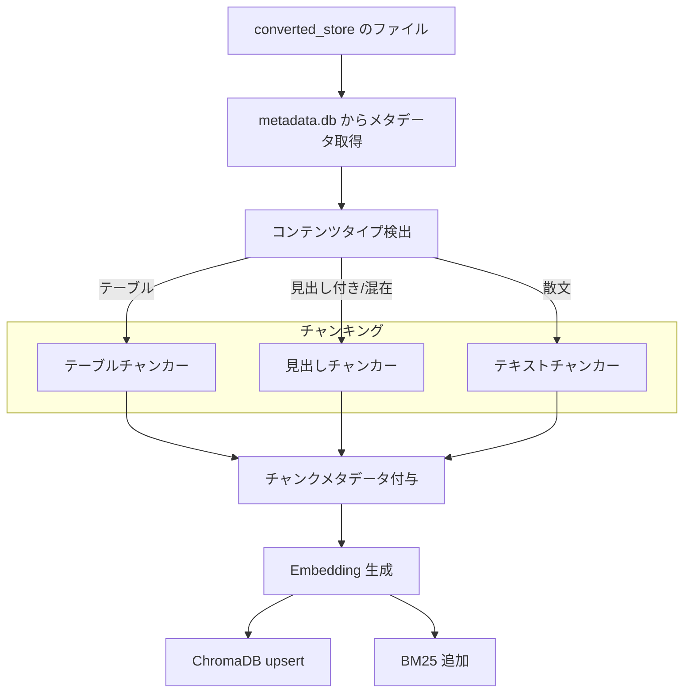

# インデクサー

## 概要

インデクサーは、converted_store のテキストファイルを入力とし、チャンキング・Embedding 生成・検索インデックス構築を行うコンポーネントである。

パイプライン制御から変更ファイルリストを受け取り、ChromaDB（ベクトル検索）と BM25s（キーワード検索）のインデックスを構築・更新する。

スコープ:

- converted_store のファイルからのチャンキング（テキスト分割）
- Embedding ベクトルの生成
- ChromaDB ベクトルインデックスの構築・更新・削除
- BM25 キーワードインデックスの構築・更新・削除
- チャンクメタデータの管理
- 差分更新（パイプライン制御からの変更リストに基づく処理）
- インデックスの全再構築

スコープ外:

- テキスト変換（コンバーターの範疇）
- 変更ファイルの検知・分類（パイプライン制御の範疇）
- source_store のファイル管理・git 操作（source_store / パイプライン制御の範疇）
- 検索クエリの実行・結果統合（検索レスポンス仕様の範疇）

## 背景

- 既存実装ではチャンキングからインデックス構築までがナレッジサービスに密結合しており、インジェスター種別ごとに同様の処理が散在していた
- 3段パイプライン（インジェスター → コンバーター → インデクサー）の最終段として独立させることで、入力を converted_store に限定し責務を明確化する
- converted_store のみを参照することで、source_store へのフォールバックが不要になりシンプルになる

## 制約

### 入力制約

- 入力は常に converted_store のファイルのみ。source_store を直接参照しない
- パススルーファイル（md/txt/adoc）もコンバーターが converted_store にコピー済みのため、フォールバックロジックは不要
- チャンクに付与するメタデータ（タイトル、ソース種別等）は metadata.db から取得する

### チャンキング制約

- コンテンツタイプ（テーブル/見出し付きテキスト/散文）に応じた適切なチャンキング戦略を自動選択する
- チャンクサイズ・オーバーラップは `config.toml` の共通設定値で管理する
- チャンカーの構文モード（Markdown/AsciiDoc）は、ソースファイルの拡張子に基づいて決定する。構文モードの詳細は [rag-knowledge.md](rag-knowledge.md) の「チャンカーの構文モード」を参照
- Embedding に渡る最終テキスト（チャンク本文 + 各種オーバーヘッド）は、Embedding モデルのコンテキスト長をトークン数で超えてはならない。文字数ベースの安全上限で制御する（トークナイザー依存は追加しない）

#### トークン安全上限

Embedding モデルのコンテキスト長（トークン数）から、文字数ベースの安全上限を逆算する。

- ローカルモデル（`text-embedding-nomic-embed-text-v2-moe`）のコンテキスト長: 512 トークン
- 日本語テキストの最悪ケーストークン/文字比率: 0.7（実測値。英語は 0.34、コードは 0.45）
- 安全上限: 512 / 0.7 ≈ **730文字**

Embedding に渡る最終テキストは「Embedding プレフィックス + チャンカー出力」で構成される。各チャンカーの出力には戦略固有のオーバーヘッド（overlap、breadcrumb 等）が含まれるため、チャンカーに渡す実効サイズは安全上限からオーバーヘッドを差し引いて算出する。

#### チャンカー別オーバーヘッドと実効サイズ

| 要因 | 最大追加文字数 | 対象チャンカー |
|------|-------------|--------------|
| Embedding プレフィックス（`search_document:` + 半角スペース） | 17 | 全チャンカー共通 |
| overlap バッファ | `rag_chunk_overlap` + 区切り文字（最大 +1） | 散文チャンカー |
| breadcrumb + 見出し + 改行 | 100（見出し階層5段・各15文字程度を想定。超過時は content を縮小して安全上限内に収める） | 見出しチャンカー |

各チャンカーに渡す実効 `max_chunk_size` の算出式（`rag_chunk_overlap = 30` の場合）:

| チャンカー | 算出式 | 実効サイズ |
|-----------|--------|----------|
| 散文 | 730 - 17 - (30 + 1) = 682 | 682 |
| 見出し | 730 - 17 - 100 = 613 | 613 |
| テーブル | 730 - 17 = 713 | 713 |

#### チャンカー別のサイズ超過時の振る舞い

| チャンカー | 超過の原因 | フォールバック戦略 |
|-----------|-----------|-----------------|
| 散文 | 単一の文が実効サイズを超える場合 | 文字数ベースで強制分割する |
| 見出し | 空行なしの長いコンテンツ（コードブロック等）で段落分割が効かない場合 | 行ベース → 文字数ベースの順でフォールバック分割する |
| 見出し | `formatted_text`（breadcrumb + heading + content）が安全上限を超える場合 | content を縮小して `formatted_text` 全体を安全上限以内に収める |
| テーブル | カラム数が多い or セル値が長い場合に `formatted_text` が実効サイズを超える | 段階的に削減する: (1) 周辺行を除去する（周辺行のデータは各行の独立チャンクに存在するため情報損失なし）。(2) それでも超過する場合、カラム属性を複数チャンクに分割する（各チャンクにエンティティ名を保持） |

### Embedding 制約

- Embedding プロバイダーはローカル（LM Studio）とオンライン（OpenAI）を切替可能
- Embedding モデルを変更した場合、既存インデックスとの互換性がないためインデックスの全再構築が必要
- プレフィックス付与（`search_document:` / `search_query:`）はプロバイダー設定に従う
- ローカル Embedding モデルのコンテキスト長は 512 トークン。これを超えるテキストはサイレントに切り詰められ、後半部分の意味がベクトルに反映されない。チャンキング制約の「トークン安全上限」で防止する

### インデックス制約

- ChromaDB は upsert 方式で冪等性を確保する。同一チャンク ID で再実行しても結果が変わらない
- BM25 インデックスはドキュメント追加・削除後にインメモリインデックスの再構築が必要（lazy rebuild: 検索実行時に自動再構築）
- BM25 の永続化はアトミックスワップ（一時ディレクトリ + リネーム）で破損を防止する

### バッチサイズ

- パイプライン制御層からのファイル数制限は設けない（各ファイルを順次処理）
- Embedding 生成時にオンラインプロバイダーを使用する場合、外部 API のレート制限・バックオフは Embedding プロバイダー側の責務とする
- 差分更新のファイル数はインジェスター側の安全制約（クロール上限等）で間接的に制限される。全再構築は管理者が意図的に実行する操作である

> **TODO:#242** オンライン Embedding 使用時の操作全体タイムアウトおよびファイル数上限について、パイプライン全体の安全性設計として別 Issue で検討する

## 想定プロファイル

オンライン Embedding プロバイダー（OpenAI）使用時に外部 API 通信が発生する。ローカルプロバイダー（LM Studio）使用時は外部 API 通信なし。

### 差分更新

| 項目 | 内容 |
|------|------|
| 最悪ケースリクエスト数 | 変更ファイル数 × 1（各ファイルのチャンクを 1 回の `embed_documents` 呼び出しでバッチ処理）。パイプライン制御がファイル数を制限しないため、大量変更時はファイル数分の API コールが発生する。参考値: 一括クロール 50 ページ追加時は 50 API コール |
| 最悪ケース所要時間 | Embedding プロバイダーの応答時間 × 変更ファイル数。参考値: OpenAI API の応答時間を 1 秒/コールとすると、50 ファイルで約 50 秒 |
| 想定エラー率 | OpenAI API のレート制限・一時障害。リトライは OpenAI SDK の組み込みリトライ・バックオフ機構に委ねる |

### インデックス全再構築

| 項目 | 内容 |
|------|------|
| 最悪ケースリクエスト数 | source_store 内の全 active ファイル数 × 1（各ファイルごとに `embed_documents` を 1 回呼び出し）。参考値: active ファイル 1,000 件の場合、1,000 API コール |
| 最悪ケース所要時間 | Embedding プロバイダーの応答時間 × active ファイル総数。参考値: 1,000 ファイル × 1 秒/コール = 約 17 分 |
| 想定エラー率 | 同上 |

## 安全制約

| 制約名 | 種別 | 値 | 解除可否 |
|--------|------|-----|---------|
| Embedding API レート制限 | 設定値 | OpenAI SDK の組み込みリトライ・バックオフ機構で制御（SDK のランタイム機構による L2 制御） | SDK 設定に依存 |
| Embedding プロバイダー疎通確認 | ハードリミット | インデックス処理開始前にプロバイダーの疎通を確認し、接続不可の場合は即座にエラーを返す | 不可 |
| チャンクサイズのトークン安全上限 | ハードリミット | Embedding に渡る最終テキストを 730 文字以内に制限する。各チャンカーにはオーバーヘッド差し引き済みの実効サイズを渡す。算出方法は「チャンキング制約」セクションを参照 | 不可 |
| BM25 永続化のアトミック性 | ハードリミット | 一時ディレクトリ + リネームによるアトミックスワップ。中間状態でのインデックス破損を防止する | 不可 |

## インターフェース

### インデックス操作

パイプライン制御から呼び出されるインデックス操作。

| 操作 | 入力 | 出力 | 振る舞い |
|------|------|------|---------|
| インデックス追加 | converted_store のファイルパス、source_id、メタデータ | なし | ファイルをチャンキングし、Embedding を生成して ChromaDB と BM25 に追加する。呼び出し元から受け取ったメタデータをチャンクに付与する |
| インデックス更新 | converted_store のファイルパス、source_id、メタデータ | なし | 再チャンキング・再 Embedding で新チャンクを upsert し、旧チャンクのうち新チャンクに含まれないもの（stale chunks）を削除する。チャンク数の増減に自動対応する |
| インデックス削除 | source_id | なし | 指定 source_id に紐づく全チャンクを ChromaDB と BM25 から削除する |
| メタデータ更新 | source_id、メタデータ | なし | チャンクの再生成は行わず、ChromaDB 内の既存チャンクのメタデータのみを upsert する。BM25 はメタデータを保持しないため更新不要 |
| インデックスクリア | source_type フィルタ（任意） | なし | インデックスをクリアする。source_type 指定時は該当 source_type のチャンクのみ削除する（他の source_type のインデックスは維持）。フィルタなしの場合は ChromaDB と BM25 を全クリアする |

インデックス全再構築（`clear` + 全ファイル `add`）はパイプライン制御（`run_index_only` / `run_full_rebuild`）がオーケストレーションする。インデクサー自体は個別操作のみを提供する。

### インデックス追加・更新の処理手順

1. converted_store からファイルの内容を読み取る
2. コンテンツタイプを検出する（テーブル/見出し付きテキスト/散文）
3. コンテンツタイプに応じたチャンキング戦略でテキストを分割する
4. 各チャンクに呼び出し元から受け取ったメタデータを付与する
5. Embedding プロバイダーでベクトルを生成する
6. ChromaDB に upsert する
7. BM25 インデックスに追加する
8. 更新の場合、旧チャンクのうち新チャンクに含まれないもの（stale chunks）を削除する

### メタデータ更新の処理手順

.meta サイドカーファイルのみが変更された場合（データ本体に変更がない場合）に実行される。

1. ChromaDB から source_id に紐づく全チャンクの ID を取得する
2. 各チャンクのメタデータを呼び出し元から受け取った値で upsert する（`title` 等の変更を反映）
3. チャンクの再生成・Embedding の再計算は行わない

## コンポーネント構成

### インデックス構築フロー

### stale チャンク削除フロー

インデックス更新時、チャンク数が減少した場合に旧チャンクを削除する。

### コンテンツタイプ検出

入力テキストを分析し、適切なチャンキング戦略を決定する。判定優先順位: テーブル → 見出し付きテキスト/混在 → 散文。テーブルと見出しが混在する場合は見出し付きテキスト（MIXED）として扱い、見出しチャンカーで処理する。

| コンテンツタイプ | 判定基準 | チャンキング戦略 |
|-----------------|---------|-----------------|
| テーブル（TABLE） | テーブル構造のみで構成されるテキスト（Markdown テーブル・タブ区切り・スペース区切り） | 行単位で分割し、各チャンクにヘッダー行を付加する |
| 見出し付きテキスト（HEADING/MIXED） | Markdown 見出し（`#`）・HTML 見出し（`<h1>`〜`<h6>`）を検出。テーブルとの混在も含む | 見出し単位で分割し、親見出しの階層情報を保持する |
| 散文（PROSE） | 上記に該当しないテキスト | 段落 → 文 → 文字数の優先順で分割する |

### チャンクメタデータ

各チャンクに付与するメタデータ。ChromaDB に格納され、フィルタリング検索に使用できる。

#### 共通フィールド

| フィールド | 型 | 内容 |
|-----------|-----|------|
| `source_id` | str | ソース識別子。[source-store.md](source-store.md) の source_id 決定方式に準拠 |
| `source_type` | str | 媒体種別（`web`, `bluesky`, `zenn`, `local`） |
| `title` | str | コンテンツのタイトル。metadata.db の `title` から取得 |
| `chunk_index` | int | チャンクの連番（0 始まり） |
| `total_chunks` | int | 当該ソースのチャンク総数（新規フィールド。既存の rag-knowledge.md には未定義） |
| `collected_at` | str | 取り込みタイムスタンプ（ISO 8601）。metadata.db の `created_at` から取得（.meta の `collected_at` 由来） |

#### カスタムフィールド

インジェスター固有のメタデータ。`custom:` プレフィックスを付与して共通フィールドと名前空間を分離する。

.meta サイドカーファイルの媒体別フィールド（[source-store.md](source-store.md) 参照）のうち、共通フィールドに含まれないものを `custom:{キー名}` として格納する。

#### 型変換ルール

ChromaDB のメタデータ値は `str | int | float | bool` のみ許容される。許容型でない値は以下のルールで変換する。

| 元の型 | 変換 | 例 |
|--------|------|-----|
| `str`, `int`, `float`, `bool` | そのまま | `"tech"` → `"tech"` |
| `list` | `str()` | `["Python", "AI"]` → `"['Python', 'AI']"` |
| その他 | `str()` | — |

### チャンク ID 生成規則

チャンク ID は source_id のハッシュとチャンク連番から生成する。

生成規則: `SHA-256(source_id)` の先頭 16 文字 + `_` + `chunk_index`

例: source_id が `https://example.com/docs/guide` の場合

- チャンク 0: `a1b2c3d4e5f67890_0`
- チャンク 1: `a1b2c3d4e5f67890_1`

この方式により、同一 source_id からは常に同じ ID プレフィックスが生成される。upsert 時にチャンク ID の一致で更新対象を特定できる。

### BM25 インデックスのデータ構造

BM25 インデックスは以下の情報を各ドキュメント（チャンク）に対して保持する。

| フィールド | 内容 |
|-----------|------|
| `doc_id` | チャンク ID |
| `text` | チャンクのテキスト |
| `source_id` | ソース識別子 |
| `source_type` | 媒体種別 |

BM25 のトークナイズには日本語形態素解析（fugashi）を使用し、名詞・動詞・形容詞・固有名詞を抽出する。fugashi が利用不可の場合は正規表現ベースの簡易トークナイザーにフォールバックする。

### 変更種別ごとの処理

パイプライン制御から受け取る変更種別と、インデクサーの処理の対応。

| 変更種別 | ChromaDB | BM25 | 備考 |
|---------|----------|------|------|
| 追加（`added`） | チャンク生成 → upsert | チャンク生成 → 追加 | 新規ソースのインデックス構築 |
| 変更（`modified`） | 旧チャンク削除 + 新チャンク upsert | 旧チャンク削除 + 新チャンク追加 | stale チャンク削除を含む |
| 削除（`deleted`） | source_id の全チャンク削除 | source_id の全チャンク削除 | metadata.db の論理削除は source_store 側で実行 |
| リネーム（`renamed`） | 旧 source_id の全チャンク削除 + 新 source_id で新規追加 | 同左 | source_id が変わるため削除 + 追加で処理 |
| .meta のみ変更 | メタデータ upsert（チャンク再生成なし） | 更新不要 | BM25 はメタデータを検索に使用しないため |

### 設定項目

チャンキング・Embedding・インデックスの設定は [rag-knowledge.md](rag-knowledge.md) の設定管理で定義されている。インデクサーが使用する設定項目を以下に示す。

#### `config.toml`（共通設定値）

| 設定項目 | 型 | 内容 | デフォルト |
|---------|-----|------|-----------|
| `rag_chunk_size` | int | チャンクの最大文字数 | 200 |
| `rag_chunk_overlap` | int | チャンク間のオーバーラップ文字数 | 30 |
| `embedding_model_local` | str | ローカル Embedding モデル名 | `text-embedding-nomic-embed-text-v2-moe` |
| `embedding_model_online` | str | オンライン Embedding モデル名 | `text-embedding-3-small` |
| `embedding_prefix_enabled` | bool | Embedding プレフィックスの付与 | `true` |
| `rag_bm25_k1` | float | BM25 の用語頻度飽和パラメータ | 2.5 |
| `rag_bm25_b` | float | BM25 の文書長正規化パラメータ | 0.50 |

#### `.env`（環境依存値）

| 設定項目 | 型 | 内容 |
|---------|-----|------|
| `EMBEDDING_PROVIDER` | str | Embedding プロバイダー（`local` または `online`） |
| `LMSTUDIO_BASE_URL` | str | LM Studio の接続先 URL |
| `CHROMADB_PERSIST_DIR` | str | ChromaDB の永続化ディレクトリパス |
| `BM25_PERSIST_DIR` | str | BM25 インデックスの永続化ディレクトリパス |

## 外部連携

| 連携先 | 用途 | 接続方式 |
|--------|------|---------|
| ChromaDB | ベクトルの永続化・類似度検索 | 組み込みモード（PersistentClient） |
| LM Studio | ローカル Embedding 生成 | OpenAI 互換 API（localhost） |
| OpenAI Embeddings API | オンライン Embedding 生成 | OpenAI SDK 経由の REST API |

Embedding プロバイダーの接続は OpenAI SDK を使用する。OpenAI SDK は独自の HTTP 管理を持ち、外部から httpx クライアントを差し込めないため、ConstrainedClient（py-common-lib）の対象外とする。レート制限・リトライ・タイムアウトは SDK の組み込み機構に委ねる。

## エッジケース

| ケース | 振る舞い |
|--------|---------|
| converted_store のファイルが空の場合 | チャンクが生成されないため、インデックスへの追加をスキップする。既存チャンクがあれば削除する |
| Embedding プロバイダーが接続不可の場合 | 処理開始前の疎通確認で検出し、エラーを返す。パイプライン制御にエラーを伝播する |
| ChromaDB の永続化ディレクトリが存在しない場合 | ChromaDB の PersistentClient が自動作成する |
| BM25 インデックスの永続化ファイルが破損した場合 | 空インデックスで起動する（フェイルセーフ）。次回のインデックス操作で再構築される |
| チャンク数が大幅に変わった場合（例: 10 → 2） | stale チャンク削除で旧チャンク（ID 2〜9）を削除し、新チャンク（ID 0〜1）を upsert する |
| metadata.db に対応するレコードがない場合 | 警告ログを出力し、ファイルパスから導出可能な情報（source_type）でメタデータを補完する。タイトルはファイル名から導出する |
| `status` が `deleted` のソースが変更リストに含まれる場合 | インデックスに追加しない。既存のインデックスエントリがあれば削除する |
| 同一 source_id で並行してインデックス操作が実行された場合 | パイプライン制御が順次実行を保証するため、並行操作は発生しない前提とする。この前提が破られた場合、ChromaDB の upsert は冪等だが stale チャンク削除で競合が発生しうる |
| fugashi（形態素解析）が利用不可の場合 | 正規表現ベースの簡易トークナイザーにフォールバックする。BM25 の精度は低下するが動作は継続する |
| 空行なしの長いコンテンツ（コードブロック等）が見出しチャンカーに入力された場合 | 段落分割が効かないため、行ベース → 文字数ベースの順でフォールバック分割する。コードの意味的な単位は保証されないが、トークン安全上限は守られる |
| カラム数が多い or セル値が長い Markdown テーブルがテーブルチャンカーに入力された場合 | `formatted_text` が実効サイズを超えないよう制御する。テーブル行の意味的な完全性より、トークン安全上限の遵守を優先する |
| Embedding モデルのコンテキスト長が変更された場合 | トークン安全上限（730 文字）の前提が変わるため、「チャンキング制約」セクションの算出式に基づいて実効サイズを再算出する必要がある |

## 関連ドキュメント

- [pipeline-controller.md](pipeline-controller.md) — パイプライン制御仕様
- [source-store.md](source-store.md) — source_store 仕様
- [rag-knowledge.md](rag-knowledge.md) — RAG ナレッジ仕様（設定管理・チャンクメタデータ・チャンカーの構文モード）
