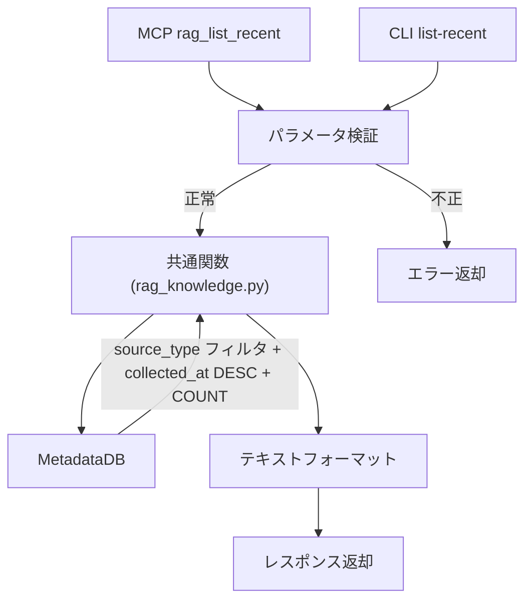

# コンテンツ一覧取得

## 概要

指定された `source_type` のソースを新しい順（`collected_at` 降順）で一覧取得する機能を MCP ツールおよび CLI サブコマンドとして提供する。

スコープ:

- ソース単位の一覧取得（MCP ツール + CLI サブコマンド）
- `source_type` 指定による絞り込み
- `collected_at` 降順のソート
- 取得件数の制限

スコープ外:

- チャンク単位の検索（rag_search の範疇）
- 全文取得（rag_get_document の範疇）
- 統計情報の表示（rag_stats の範疇）

## 背景

- 既存の検索機能（`rag_search`）はクエリベースの検索であり、「最近取り込んだコンテンツを一覧する」用途には対応していない
- 直近の情報を参照しやすくすることで、ナレッジベースの運用・確認が容易になる
- `rag_stats` はドメイン別の集計情報を提供するが、個別ソースの時系列的な一覧は提供していない

## 制約

- **ソース単位の返却**: チャンク単位ではなくソース単位で返却する。1ソース = 1エントリとして title、source_id、collected_at、file_size のメタデータを返す
- **データソースの限定**: 全データを MetadataDB から取得する。VectorStore や BM25 インデックスへの追加クエリは発行しない
- **source_type 必須**: `source_type` パラメータは必須とする。全 source_type 横断の一覧取得は提供しない
- **ソート基準の固定**: `collected_at` 降順でソートする。ソート基準の切り替えは提供しない
- **論理削除済みソースの除外**: `status` が `deleted` のソースは一覧に含めない
- **MCP + CLI 両提供**: MCP ツールと CLI サブコマンドの両方で提供する。内部ロジックは共通関数とする
- **レスポンス形式**: MCP ツールのレスポンスはプレーンテキスト形式とする（既存ツールと統一）

## インターフェース

### 操作一覧

| 操作 | 種別 | 提供方式 | 概要 |
|------|------|---------|------|
| rag_list_recent | 新規 | MCP ツール + CLI | 指定 source_type のソースを新しい順で一覧取得する |

### MCP ツール

#### rag_list_recent

指定された `source_type` のソースを `collected_at` の降順で取得する。

| 項目 | 内容 |
|------|------|
| ツール名 | `rag_list_recent` |
| 説明 | 指定した source_type のソースを新しい順で一覧取得する |

パラメータ:

| パラメータ | 型 | 必須 | 内容 |
|-----------|-----|------|------|
| `source_type` | str | はい | ソース種別（値は [`_schema/enums.yml`](../../../_schema/enums.yml) の `source_type` を参照） |
| `limit` | int | いいえ | 取得件数。デフォルト: `rag_list_recent_limit`（config.toml） |

バリデーション:

- `source_type` が有効値でない場合、エラーメッセージを返す（有効値の一覧を含める）
- `limit` が許容範囲外の場合、エラーメッセージを返す

出力:

プレーンテキスト形式。ヘッダー行にソース種別と件数を表示し、各ソースのメタデータを出力する。

```
source_type: web（5件 / 全80件）

1. Sample Documentation Site
   Source: https://example.com/docs
   Collected: 2025-06-15T10:30:00+09:00
   Size: 45.2 KB

2. Another Page Title
   Source: https://example.com/guide
   Collected: 2025-06-14T08:00:00+09:00
   Size: 12.8 KB
```

- ヘッダー行: `source_type: {type}（{表示件数}件 / 全{該当source_typeの総件数}件）`
  - 総件数: MetadataDB の `sources` テーブルに対して同一 `source_type` + `status = 'active'` 条件の `COUNT(*)` で取得する
- 各エントリ: 番号付きリスト。タイトル、source_id、collected_at、ファイルサイズを表示
  - ファイルサイズ: MetadataDB の `file_size` カラムから取得する。人間が読みやすい単位（KB / MB）でフォーマットする
- 該当するソースが0件の場合: `source_type: {type}（0件 / 全0件）`
- Source の値形式は source_type によって異なる（URL、AT URI、ファイルパス等。詳細は [source-store.md](../source-store.md) の source_id 決定方式を参照）
- クエリコスト: 一覧取得 1 クエリ + 総件数 COUNT 1 クエリの最大 2 クエリで完結する。全データは MetadataDB から取得し、VectorStore への追加クエリは発行しない

### CLI サブコマンド

#### list-recent コマンド

```
uv run python -m rag.cli list-recent --source-type <TYPE> [--limit <N>]
```

| オプション | 型 | 必須 | 内容 |
|-----------|-----|------|------|
| `--source-type` | str | はい | ソース種別（値は [`_schema/enums.yml`](../../../_schema/enums.yml) の `source_type` を参照） |
| `--limit` | int | いいえ | 取得件数。デフォルト: `rag_list_recent_limit`（config.toml） |

MCP ツール `rag_list_recent` と同じバリデーション・振る舞いを適用する。出力形式も同一。

### 設定項目

| 設定項目 | 層 | 設計意図 |
|---------|-----|---------|
| `rag_list_recent_limit` | 共通設定値 | `rag_list_recent` / `list-recent` のデフォルト取得件数。運用規模に応じて調整する |

## コンポーネント構成



### データ取得フロー

1. MCP ツールまたは CLI からパラメータを受け取る
2. `source_type` と `limit` のバリデーションを実行する
3. `rag_knowledge.py` の共通関数 `list_recent_sources` を呼び出す
4. `MetadataDB` から以下の 2 クエリを発行する:
   - 一覧取得: `source_type` + `status = 'active'` でフィルタし、`collected_at` 降順で `limit` 件取得
   - 総件数取得: 同条件の `COUNT(*)` で該当 source_type の全件数を取得
5. 結果をテキスト形式にフォーマットして返却する（file_size は人間が読みやすい単位に変換）

### 関連ファイル

| ファイル | 役割 |
|---------|------|
| `src/rag/server.py` | MCP ツール定義。パラメータ検証と共通関数呼び出し |
| `src/rag/cli.py` | CLI サブコマンド定義。パラメータ検証と共通関数呼び出し |
| `src/rag/rag_knowledge.py` | 共通ロジック。MetadataDB へのクエリとフォーマット処理 |
| `src/rag/store/metadata_db.py` | MetadataDB。`source_type` フィルタ + `collected_at` 降順ソートのクエリ |
| `src/rag/config.py` | `rag_list_recent_limit` 設定の定義 |
| `config.toml` | `rag_list_recent_limit` のデフォルト値 |

## エッジケース

| ケース | 振る舞い |
|--------|---------|
| 指定 source_type のソースが0件 | `source_type: {type}（0件 / 全0件）` を返す |
| limit が該当ソース件数より大きい | 全件返却する（エラーにはしない） |
| 無効な source_type を指定 | エラーメッセージを返す（有効値の一覧を含める） |
| limit が許容範囲外 | エラーメッセージを返す |
| 論理削除済みソースが存在 | 一覧に含めない（`status = 'active'` のみ対象） |
| `collected_at` が同一の複数ソース | ソート順序は不定（同一タイムスタンプ内の順序は保証しない） |

## 関連ドキュメント

- [検索レスポンス + 全文取得](../search-response.md) — チャンク単位の検索・全文取得
- [再構築・統計・バックアップ](../rebuild-stats.md) — rag_stats による統計情報
- [source_store](../source-store.md) — ソースデータの格納・メタデータ管理
- [インジェスター共通仕様](../ingesters/common.md) — source_type の定義
