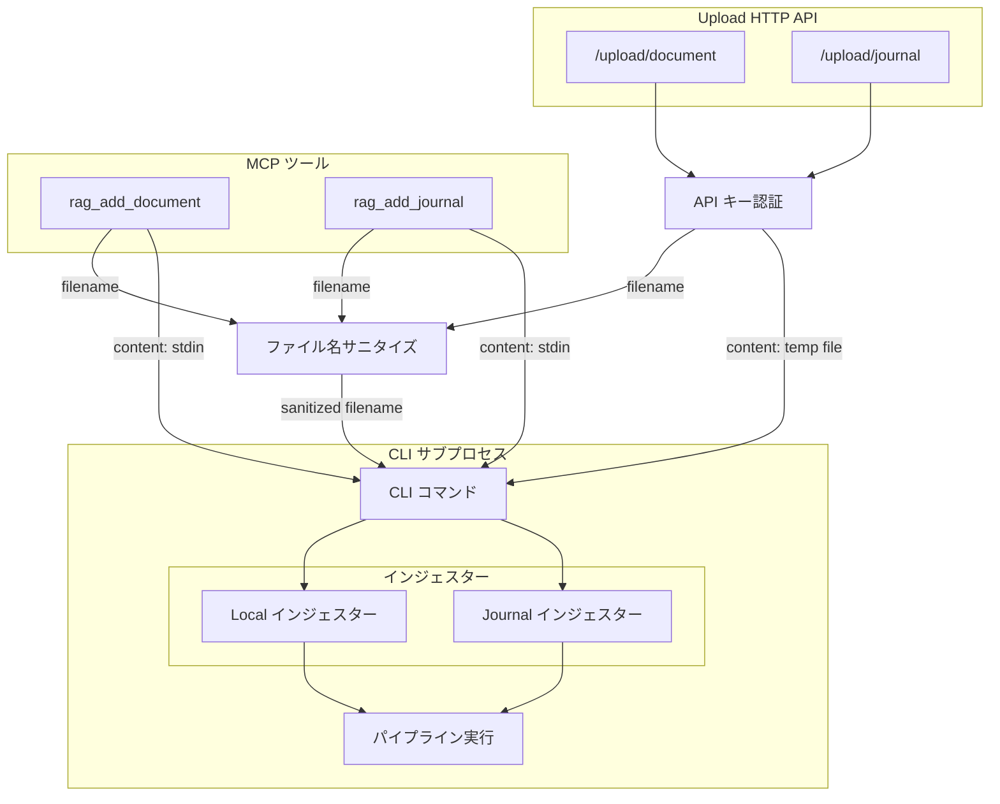

# コンテンツアップロード層

## 概要

ファイルコンテンツを MCP サーバーに取り込むための共通処理と、HTTP 経由のファイルアップロードエンドポイントを提供する。

スコープ:

- MCP ツール経由のバリデーション（encoding 許容値チェック・content 空チェック）
- アップロードファイル名のサニタイズ（パストラバーサル防止）
- Upload HTTP API によるファイル直接アップロード（`multipart/form-data`）
- 全インジェスト操作の排他制御

スコープ外:

- 対応拡張子リストの保持（各インジェスターが保持する設定に依存するため。本レイヤーはインジェスターから注入されたリストに基づき検証を行う）
- source_store へのファイル配置（インジェスターの責務）
- CLI からのファイル読み込み（CLI が直接バイト列を取得するため不要）
- 認証・API キー管理のライフサイクル（別仕様書で定義）

## 背景

MCP は JSON ベースのテキストプロトコルであるため、ツール引数でファイルコンテンツを渡す際に 2 つの構造的な制約がある:

1. **バイナリの非対応**: PDF 等のバイナリファイルをそのまま渡せない。base64 エンコードが必要
2. **長文テキストの崩れ**: MCP ツール引数は LLM が JSON 文字列として生成するため、長文 Markdown で JSON エスケープの崩れが構造的に発生する。MCP プロトコルにはクライアント→サーバー方向のファイル転送機構が存在せず（メンテナが「スコープ外」と明言）、プロトコルレベルでの解決は期待できない

これらの制約に対して、2 つの経路を提供する:

- **MCP ツール経由**（既存）: コンテンツデコードとファイル名サニタイズにより、テキスト・バイナリを MCP ツールで受け取れるようにする。stdio モードでも動作するが、長文テキストの崩れ問題は解決できない
- **Upload HTTP API**（新規）: FastMCP の `custom_route()` を使い、MCP サーバーと同一プロセスで HTTP アップロードエンドポイントを併設する。`multipart/form-data` でファイルを直接受信するため、JSON エスケープの崩れが発生しない。HTTP モード専用

コンテンツデコードは `rag_add_document` のみが使用する。`rag_add_journal` は journal が常に UTF-8 テキスト（Markdown）であるためデコード不要であり、ファイル名サニタイズのみ使用する。Upload HTTP API はファイルをバイト列として直接受信するため、コンテンツデコードを使用しない。CLI はファイルシステムから直接読み込むため、本レイヤーを使用しない。

## 制約

### MCP ユーティリティの制約

- **encoding の許容値**: `text`（デフォルト）または `base64` のみ。それ以外の値はバリデーションエラーとして拒否する
- **text エンコーディング**: `encoding=text` の場合、コンテンツは UTF-8 文字列として扱い、UTF-8 でエンコードしてバイト列に変換する
- **base64 デコード**: `encoding=base64` の場合、標準 base64（RFC 4648）でデコードする。パディング（`=`）は必須とする。不正な base64 文字列はバリデーションエラーとして拒否する
- **空コンテンツの拒否**: デコード後のバイト列が 0 バイトの場合はバリデーションエラーとして拒否する
- **ファイル名サニタイズ**: `filename` にディレクトリセパレータ（`/`, `\`）または `..` が含まれる場合、ファイル名部分（`Path(filename).name`）のみを採用する。ファイル名部分が空になる場合はバリデーションエラーとして拒否する
- **ファイル名の空チェック**: `filename` が空文字列の場合はバリデーションエラーとして拒否する

### Upload HTTP API の制約

- **HTTP モード専用**: Upload API は MCP サーバーが HTTP モード（`RAG_TRANSPORT=http`）で起動している場合のみ利用可能。stdio モードでは HTTP サーバーが起動しないため、Upload API のエンドポイントは存在しない
- **API キー認証必須**: 全エンドポイントへのアクセスに `X-API-Key` ヘッダーによる認証を必須とする。認証の詳細は [Upload HTTP API 認証](upload-auth.md) で定義する
- **バインドアドレス制約**: バインドアドレスに応じてサーバー起動を制御する。詳細は [Upload HTTP API 認証](upload-auth.md) で定義する
- **ファイルサイズ上限**: アップロード可能なファイルサイズの上限は設定可能値とする。上限を超えるリクエストは HTTP 413 で拒否する。PDF 抽出・チャンキング・Embedding 処理ではファイルサイズの数倍のメモリを消費するため、運用環境のメモリ容量に応じて調整する
- **エラーレスポンスの安全性**: エラーレスポンスにスタックトレース、内部ファイルパス、フレームワークバージョン等の内部情報を含めない
- **依存追加**: `python-multipart` パッケージが必要（Starlette の `multipart/form-data` パースに使用）

### インジェスト排他制御の制約

- **適用対象**: 全インジェスト操作に適用する。Upload HTTP API（`/upload/document`、`/upload/journal`）、MCP ツール（`rag_add_document`、`rag_add_journal`）、CLI 直接実行の全てが対象
- **ロック方式**: OS ファイルロックによるプロセス間排他制御。Unix では `fcntl.flock`、Windows では `msvcrt.locking` を使用する。
  ロック取得処理の実施主体は CLI とし、MCP サーバー（`server.py`）からのインジェストも CLI サブプロセスを起動して同一のロック取得処理を利用する。
  `server.py` 自身はロックファイルを直接操作しない
- **ロックファイル**: source_store ディレクトリ直下に配置する。インジェストロックと rebuild ロックでそれぞれ別のロックファイルを使用する
- **ノンブロッキング**: CLI はロック取得を試み（`LOCK_NB` / `LK_NBLCK`）、取得できない場合は待機せず即座にエラーを返却する。
  CLI はロック競合時に JSON Lines の error メッセージ（`type: "error"`）にロック競合である旨を含め、exit code 1 で終了する。
  `server.py` は CLI サブプロセスの error メッセージからロック競合を判定し、Upload HTTP API では HTTP 409、MCP ツールではエラーメッセージとして返却する。
  CLI 直接実行では標準エラー出力 + exit code 1 を返す
- **ステールロック対策**: OS ファイルロックはプロセス終了時（SEGFAULT 含む異常終了を含む）に OS が自動解放するため、明示的なステールロック対策は不要。OS クラッシュ・電源断の場合もロックはカーネルメモリ上のみに存在し、再起動後にクリーンな状態になる
- **Advisory lock の制約**: OS ファイルロックは advisory lock（協調ロック）であり、ロック取得のコードを経由しないアクセスは防げない。本システムでは全書き込み操作が CLI 経由（MCP サブプロセス + CLI 直接実行）のため問題ない
- **rebuild との独立性**: インジェストロックと rebuild ロックはそれぞれ別のロックファイルを使用し、独立して動作する。rebuild 実行中のインジェスト、およびインジェスト中の rebuild は、それぞれのロックで個別に制御される

## インターフェース

### MCP ユーティリティ

#### コンテンツデコード

MCP 薄層アダプター化により、コンテンツデコード（`content` + `encoding` → バイト列変換）は CLI 側の `--stdin` + `--encoding` オプションに移行する。MCP ツール（`rag_add_document`）は `content` を CLI サブプロセスの stdin にそのまま渡し、CLI が `--encoding` フラグに基づいてデコードする。

MCP 側に残るバリデーション:

- `encoding` の許容値チェック（`"text"` または `"base64"` のみ）
- `content` の空チェック（空文字列の場合はバリデーションエラー）
- `filename` のサニタイズ（後述）

#### ファイル名サニタイズ

`rag_add_document`、`rag_add_journal`、および Upload HTTP API が使用する。`filename` パラメータをサニタイズしてファイル名部分のみを返す。

| 引数 | 型 | 説明 |
|-----|----|------|
| `filename` | 文字列 | MCP ツールまたは Upload API から受け取ったファイル名 |

返り値: サニタイズ済みファイル名文字列（ディレクトリ部分を除いたファイル名のみ）

エラー: `filename` が空文字列またはサニタイズ後のファイル名が空になる場合にバリデーションエラーを送出する

### Upload HTTP API

MCP サーバー（HTTP モード）に `custom_route()` で併設する HTTP アップロードエンドポイント。ファイルを `multipart/form-data` で直接受信し、一時ファイルに書き出した上で CLI サブプロセスに委譲してインジェスト処理を実行する。

#### 操作一覧

| エンドポイント | メソッド | 概要 |
|---------------|---------|------|
| `/upload/document` | POST | ドキュメントのアップロード・インジェスト |
| `/upload/journal` | POST | ジャーナルエントリのアップロード・インジェスト |

#### POST /upload/document

ドキュメントファイルをアップロードし、Local インジェスターで取り込む。

リクエスト形式: `multipart/form-data`

| フィールド | 型 | 必須 | 説明 |
|-----------|-----|------|------|
| `file` | ファイル | はい | アップロードするファイル。ファイル名から拡張子を検証する |
| `upload_mode` | 文字列 | いいえ | `"fail"`（デフォルト）: 同名ファイル存在時にエラー / `"replace"`: 上書き |

バリデーション:

- `file` が未指定または空の場合、HTTP 400 を返す
- ファイル名をサニタイズし、拡張子が対応リスト（`.md`、`.txt`、`.pdf`、`.adoc`）に含まれない場合、HTTP 400 を返す
- `upload_mode` が `"fail"` でも `"replace"` でもない場合、HTTP 400 を返す
- ファイルサイズが上限を超える場合、HTTP 413 を返す。`Content-Length` ヘッダーで事前判定できる場合はボディ読み取り前に拒否し、事前判定できない場合はストリーミング読み取り中に上限超過を検知した時点で中断する

処理フロー:

1. API キー認証を検証する
2. ファイル名をサニタイズし、拡張子を検証する
3. ファイルコンテンツをバイト列として読み取る（読み取り中にファイルサイズ上限を超過した場合は即座に HTTP 413 を返す）
4. 一時ファイルにコンテンツを書き出す
5. CLI サブプロセスを実行する（`add-document --file <一時ファイルパス> --upload-mode <mode> --output json`）
6. サブプロセス完了後、一時ファイルを削除する

#### POST /upload/journal

ジャーナル Markdown ファイルをアップロードし、Journal インジェスターで取り込む。

リクエスト形式: `multipart/form-data`

| フィールド | 型 | 必須 | 説明 |
|-----------|-----|------|------|
| `file` | ファイル | はい | ジャーナル Markdown ファイル（`.md` のみ） |
| `title` | 文字列 | はい | エントリタイトル |
| `repository` | 文字列 | はい | リポジトリ名 |
| `entry_id` | 文字列 | いいえ | エントリ ID。省略時はサーバー側で自動生成する |

バリデーション:

- `file` が未指定または空の場合、HTTP 400 を返す
- ファイル名をサニタイズし、拡張子が `.md` でない場合、HTTP 400 を返す
- `title` が未指定または空の場合、HTTP 400 を返す
- `repository` が未指定または空の場合、HTTP 400 を返す
- ファイルサイズが上限を超える場合、HTTP 413 を返す。`Content-Length` ヘッダーで事前判定できる場合はボディ読み取り前に拒否し、事前判定できない場合はストリーミング読み取り中に上限超過を検知した時点で中断する

処理フロー:

1. API キー認証を検証する
2. ファイル名をサニタイズし、拡張子を検証する
3. ファイルコンテンツを UTF-8 テキストとして読み取る（読み取り中にファイルサイズ上限を超過した場合は即座に HTTP 413 を返す）
4. 一時ファイルにコンテンツを書き出す
5. CLI サブプロセスを実行する（`add-journal --file <一時ファイルパス> --title <title> --repository <repo> --output json`）
6. サブプロセス完了後、一時ファイルを削除する

#### 共通レスポンス形式

成功時（HTTP 200）:

```json
{"status": "ok", "message": "説明テキスト", "source_id": "ソース識別子"}
```

エラー時（HTTP 4xx / 5xx）:

```json
{"status": "error", "message": "エラー説明テキスト"}
```

#### HTTP ステータスコード

| ステータス | 条件 |
|-----------|------|
| 200 | 成功（インジェスト完了） |
| 400 | バリデーションエラー（不正なパラメータ、未対応拡張子、必須フィールド未指定等） |
| 401 | 認証失敗（API キー不正・未指定） |
| 409 | 競合（インジェストロック取得失敗、または `upload_mode=fail` で同名ファイル存在） |
| 413 | ファイルサイズ上限超過 |
| 500 | 内部エラー（インジェスト処理中の予期しないエラー） |

### 設定項目

| 設定項目 | 層 | 設計意図 |
|---------|-----|---------|
| `rag_upload_max_file_size_mb` | 共通設定値 | Upload API のファイルサイズ上限（MB）。運用環境のメモリ容量に応じて調整する |

## コンポーネント構成



### Upload HTTP API における呼び出し手順

Upload HTTP API はリクエストボディからファイルを受信し、一時ファイルに書き出した上で CLI サブプロセスに渡す。

#### /upload/document

1. API キーを検証する
2. ファイル名をサニタイズし、拡張子が対応リストに含まれるか確認する
3. ファイルコンテンツをバイト列として読み取る（サイズ上限超過時は HTTP 413）
4. 一時ファイルにコンテンツを書き出す
5. CLI サブプロセスを実行する: `add-document --file <一時ファイルパス> --upload-mode <mode> --output json`
6. サブプロセス完了後、一時ファイルを削除する

#### /upload/journal

1. API キーを検証する
2. ファイル名をサニタイズし、拡張子が `.md` であることを確認する
3. ファイルコンテンツを UTF-8 テキストとして読み取る（サイズ上限超過時は HTTP 413）
4. 一時ファイルにコンテンツを書き出す
5. CLI サブプロセスを実行する: `add-journal --file <一時ファイルパス> --title <title> --repository <repo> --output json`
6. サブプロセス完了後、一時ファイルを削除する

### MCP ツールにおける呼び出し手順

MCP ツールはクライアントからコンテンツを文字列で受け取り、CLI サブプロセスの stdin に渡す。

#### rag_add_document

1. ファイル名をサニタイズし、拡張子が対応リストに含まれるか確認する
2. CLI サブプロセスを実行する: `add-document --stdin --filename <filename> --encoding <encoding> --upload-mode <mode> --output json`
3. `content` を subprocess の stdin に書き込み、stdin をクローズする
4. サブプロセスの JSON Lines 出力をパースし、結果を返す

#### rag_add_journal

1. ファイル名をサニタイズし、拡張子が `.md` であることを確認する
2. CLI サブプロセスを実行する: `add-journal --stdin --title <title> --repository <repo> --output json`
3. `content` を subprocess の stdin に書き込み、stdin をクローズする
4. サブプロセスの JSON Lines 出力をパースし、結果を返す

### 経路別比較

| 経路 | コンテンツの取得方法 | CLI への渡し方 | コンテンツアップロード層の使用 |
|------|---------------------|---------------|-------------------------------|
| Upload HTTP API（/upload/document） | `multipart/form-data` でバイト列を直接受信 | 一時ファイル → `--file` | ファイル名サニタイズのみ |
| Upload HTTP API（/upload/journal） | `multipart/form-data` でテキストを直接受信 | 一時ファイル → `--file` | ファイル名サニタイズのみ |
| MCP 経由（rag_add_document） | MCP ツール引数の `content` 文字列 | stdin → `--stdin` | デコード不要（CLI が `--encoding` に基づきデコード） |
| MCP 経由（rag_add_journal） | MCP ツール引数の `content` 文字列 | stdin → `--stdin` | ファイル名サニタイズのみ |
| CLI 直接実行（add-document / add-journal） | ファイルを直接読み込み | `--file` | 使用しない |

### 関連ファイル

| ファイル | 役割 |
|---------|------|
| `src/rag/server.py` | MCP ツール定義（薄層アダプター）+ Upload HTTP API エンドポイント定義。CLI サブプロセスの起動・進捗中継を担当 |
| `src/rag/upload.py` | ファイル名サニタイズ（MCP ツール・Upload API 共通）。コンテンツデコードは CLI 側に移行 |
| `src/rag/cli.py` | CLI コマンド。`--stdin` オプションによる stdin 入力、`--output json` による JSON Lines 出力をサポート |
| `src/rag/pipeline/ingesters/local.py` | Local インジェスター（ドキュメント取り込み） |
| `src/rag/pipeline/ingesters/journal.py` | Journal インジェスター（ジャーナル取り込み） |
| `src/rag/infrastructure/file_lock.py` | OS ファイルロックによるプロセス間排他制御（インジェストロック・rebuild ロック） |
| `src/rag/config.py` | `rag_upload_max_file_size_mb` 設定の定義 |
| `config.toml` | ファイルサイズ上限のデフォルト値 |

## エッジケース

### MCP ユーティリティ

| ケース | 振る舞い |
|--------|---------|
| `encoding` が `"text"` でも `"base64"` でもない | バリデーションエラーとして拒否する |
| `content` が空文字列 | デコード後が 0 バイトとなりバリデーションエラーとして拒否する |
| `encoding=base64` で不正な base64 文字列 | バリデーションエラーとして拒否する |
| `encoding=base64` でパディングなしの base64 | バリデーションエラーとして拒否する |
| `filename` にディレクトリセパレータが含まれる | `Path(filename).name` でファイル名部分のみ採用する |
| `filename` に `..` が含まれる | `Path(filename).name` でファイル名部分のみ採用する。`..` 自体がファイル名部分に残る場合はバリデーションエラーとして拒否する |
| `filename` が空文字列 | バリデーションエラーとして拒否する |
| `filename` がパスのみでファイル名部分が空（例: `/`） | バリデーションエラーとして拒否する |
| デコード後のバイト列が 0 バイト | バリデーションエラーとして拒否する |

### Upload HTTP API

| ケース | 振る舞い |
|--------|---------|
| `X-API-Key` ヘッダーが未指定 | HTTP 401 を返す |
| `X-API-Key` の値が不正 | HTTP 401 を返す |
| `file` フィールドが未指定 | HTTP 400 を返す |
| アップロードファイルのサイズが上限超過 | HTTP 413 を返す |
| アップロードファイルが 0 バイト | HTTP 400 を返す |
| インジェストロック取得失敗（別のインジェスト実行中） | HTTP 409 を返す（エラーメッセージに「別のインジェストが実行中」である旨を含める） |
| `upload_mode=fail` で同名ファイルが既に存在 | HTTP 409 を返す |
| アップロードファイルの拡張子が未対応 | HTTP 400 を返す（対応拡張子の一覧をエラーメッセージに含める） |
| `/upload/journal` で `title` または `repository` が未指定 | HTTP 400 を返す |
| stdio モードで Upload API にアクセス | エンドポイント自体が存在しないため、接続不可 |
| パイプライン実行中にエラーが発生 | HTTP 500 を返す。インジェストロックは確実に解放する |

### インジェスト排他制御

| ケース | 振る舞い |
|--------|---------|
| MCP サブプロセスと CLI 直接実行が同時にインジェストを試みる | 先にファイルロックを取得した方が実行され、後発はエラーを返す |
| MCP ツールと Upload API が同時にインジェストを試みる | 先にファイルロックを取得した方が実行され、後発はエラーを返す |
| インジェスト処理中にプロセスが異常終了（SEGFAULT 等） | OS がファイルロックを自動解放する。次の操作でロック取得が可能 |
| インジェスト処理中に例外が発生 | ロックは確実に解放する（finally ブロック等） |
| rebuild 中にインジェストを実行 | インジェストロックと rebuild ロックは別のロックファイルを使用し独立しているため、両方が同時に実行される可能性がある。パイプラインレベルでの整合性はパイプライン制御側の責務 |

## 関連ドキュメント

- [Upload HTTP API 認証](upload-auth.md) — API キー認証・バインドアドレス制約
- [ingesters/local.md](../ingesters/local.md) — Local インジェスターの仕様
- [ingesters/journal.md](../ingesters/journal.md) — Journal インジェスターの仕様
- [パイプライン制御](../pipeline-controller.md) — パイプライン実行の仕様
