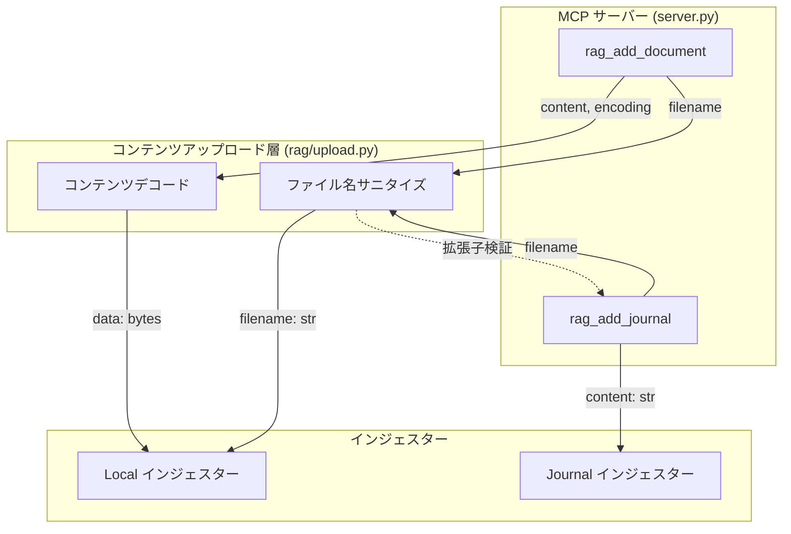

# コンテンツアップロード層

## 概要

MCP ツール経由でファイルコンテンツを受け取る際の共通デコード・バリデーション処理を提供するユーティリティ。

スコープ:

- `encoding` パラメータに基づくコンテンツのバイト列変換（テキスト / base64）
- アップロードファイル名のサニタイズ（パストラバーサル防止）
- コンテンツの空チェック

スコープ外:

- 拡張子の対応可否判断（各インジェスターが保持する設定に依存するため）
- source_store へのファイル配置（インジェスターの責務）
- CLI からのファイル読み込み（CLI が直接バイト列を取得するため不要）

## 背景

MCP は JSON ベースのテキストプロトコルであるため、バイナリファイル（PDF 等）をそのまま渡すことができない。クライアントが base64 エンコードしてテキストとして渡す方式を採用することで、テキスト・バイナリを問わずファイルコンテンツを MCP ツールで受け取れるようにする。

コンテンツデコードは `rag_add_document` のみが使用する。`rag_add_journal` は journal が常に UTF-8 テキスト（Markdown）であるためデコード不要であり、ファイル名サニタイズのみ使用する。CLI はファイルシステムから直接読み込むため、本ユーティリティを使用しない。

## 制約

- **encoding の許容値**: `text`（デフォルト）または `base64` のみ。それ以外の値はバリデーションエラーとして拒否する
- **text エンコーディング**: `encoding=text` の場合、コンテンツは UTF-8 文字列として扱い、UTF-8 でエンコードしてバイト列に変換する
- **base64 デコード**: `encoding=base64` の場合、標準 base64（RFC 4648）でデコードする。パディング（`=`）は必須とする。不正な base64 文字列はバリデーションエラーとして拒否する
- **空コンテンツの拒否**: デコード後のバイト列が 0 バイトの場合はバリデーションエラーとして拒否する
- **ファイル名サニタイズ**: `filename` にディレクトリセパレータ（`/`, `\`）または `..` が含まれる場合、ファイル名部分（`Path(filename).name`）のみを採用する。ファイル名部分が空になる場合はバリデーションエラーとして拒否する
- **ファイル名の空チェック**: `filename` が空文字列の場合はバリデーションエラーとして拒否する
- 外部 API 通信を行わないため、ConstrainedClient・想定プロファイル・安全制約テーブルは省略する

## インターフェース

### コンテンツデコード

`rag_add_document` が使用する。MCP ツールから受け取った `content` と `encoding` をバイト列に変換する（`decode_upload_content` 関数）。

| 引数 | 型 | 説明 |
|-----|----|------|
| `content` | 文字列 | MCP ツールが受け取ったコンテンツ文字列 |
| `encoding` | 文字列 | `"text"` または `"base64"` |

返り値: デコード済みバイト列（`bytes`）

エラー: 不正な `encoding` 値・不正な base64 文字列・デコード後が 0 バイトの場合に `ValueError` を送出する

### ファイル名サニタイズ

`rag_add_document` と `rag_add_journal` の両ツールが使用する。`filename` パラメータをサニタイズしてファイル名部分のみを返す（`sanitize_filename` 関数）。

| 引数 | 型 | 説明 |
|-----|----|------|
| `filename` | 文字列 | MCP ツールから受け取ったファイル名 |

返り値: サニタイズ済みファイル名文字列（ディレクトリ部分を除いたファイル名のみ）

エラー: `filename` が空文字列またはサニタイズ後のファイル名が空になる場合に `ValueError` を送出する

## コンポーネント構成

### MCP ツールにおける呼び出し手順

#### rag_add_document

1. ファイル名をサニタイズし、拡張子が対応リストに含まれるか確認する
2. コンテンツをデコードしてバイト列を取得する
3. Local インジェスターの取り込み処理を呼び出す（`upload_mode` を引き渡す）

#### rag_add_journal

1. ファイル名をサニタイズし、拡張子が `.md` であることを確認する
2. `content` をそのまま本文テキストとして Journal インジェスターの取り込み処理を呼び出す（デコード不要）

### CLI との比較

CLI はファイルシステムから直接バイト列を読み込むため、本ユーティリティを経由しない。

| パス | コンテンツの取得方法 | コンテンツアップロード層の使用 |
|------|---------------------|-------------------------------|
| MCP 経由（rag_add_document） | コンテンツをデコードしてバイト列を取得 | デコード + ファイル名サニタイズ |
| MCP 経由（rag_add_journal） | `content` 文字列をそのまま使用（デコード不要） | ファイル名サニタイズのみ |
| CLI 経由（add-document コマンド） | ファイルを直接読み込んでバイト列を取得 | 使用しない |
| CLI 経由（add-journal コマンド） | ファイルを直接読み込んでテキストを取得 | 使用しない |

## エッジケース

| ケース | 振る舞い |
|--------|---------|
| `encoding` が `"text"` でも `"base64"` でもない | バリデーションエラーとして拒否する |
| `content` が空文字列 | デコード後が 0 バイトとなりバリデーションエラーとして拒否する |
| `encoding=base64` で不正な base64 文字列 | バリデーションエラーとして拒否する |
| `encoding=base64` でパディングなしの base64 | バリデーションエラーとして拒否する |
| `filename` にディレクトリセパレータが含まれる | `Path(filename).name` でファイル名部分のみ採用する |
| `filename` に `..` が含まれる | `Path(filename).name` でファイル名部分のみ採用する。`..` 自体がファイル名部分に残る場合はバリデーションエラーとして拒否する |
| `filename` が空文字列 | バリデーションエラーとして拒否する |
| `filename` がパスのみでファイル名部分が空（例: `/`） | バリデーションエラーとして拒否する |
| デコード後のバイト列が 0 バイト | バリデーションエラーとして拒否する |

## 関連ドキュメント

- [ingesters/local.md](../ingesters/local.md) — LocalIngester の使用側仕様
- [ingesters/journal.md](../ingesters/journal.md) — JournalIngester の使用側仕様
