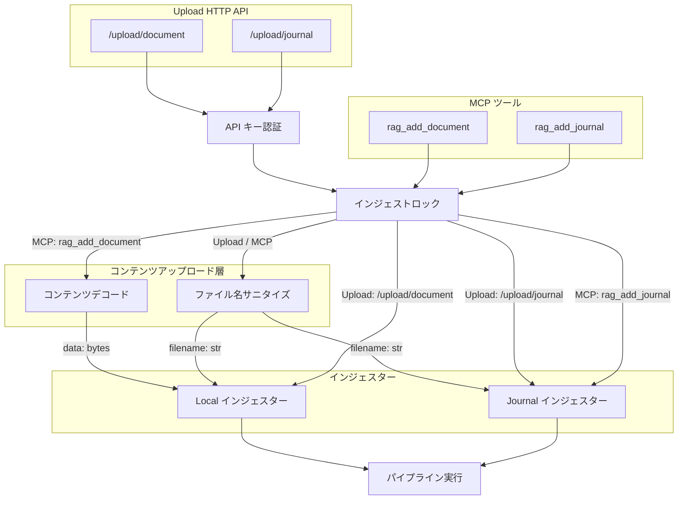

# コンテンツアップロード層

## 概要

ファイルコンテンツを MCP サーバーに取り込むための共通処理と、HTTP 経由のファイルアップロードエンドポイントを提供する。

スコープ:

- MCP ツール経由のコンテンツデコード・バリデーション（既存）
- アップロードファイル名のサニタイズ（パストラバーサル防止）
- Upload HTTP API によるファイル直接アップロード（`multipart/form-data`）
- 全インジェスト操作の排他制御

スコープ外:

- 対応拡張子リストの保持（各インジェスターが保持する設定に依存するため。本レイヤーはインジェスターから注入されたリストに基づき検証を行う）
- source_store へのファイル配置（インジェスターの責務）
- CLI からのファイル読み込み（CLI が直接バイト列を取得するため不要）
- 認証・API キー管理のライフサイクル（別仕様書で定義）

## 背景

MCP は JSON ベースのテキストプロトコルであるため、ツール引数でファイルコンテンツを渡す際に 2 つの構造的な制約がある:

1. **バイナリの非対応**: PDF 等のバイナリファイルをそのまま渡せない。base64 エンコードが必要
2. **長文テキストの崩れ**: MCP ツール引数は LLM が JSON 文字列として生成するため、長文 Markdown で JSON エスケープの崩れが構造的に発生する。MCP プロトコルにはクライアント→サーバー方向のファイル転送機構が存在せず（メンテナが「スコープ外」と明言）、プロトコルレベルでの解決は期待できない

これらの制約に対して、2 つの経路を提供する:

- **MCP ツール経由**（既存）: コンテンツデコードとファイル名サニタイズにより、テキスト・バイナリを MCP ツールで受け取れるようにする。stdio モードでも動作するが、長文テキストの崩れ問題は解決できない
- **Upload HTTP API**（新規）: FastMCP の `custom_route()` を使い、MCP サーバーと同一プロセスで HTTP アップロードエンドポイントを併設する。`multipart/form-data` でファイルを直接受信するため、JSON エスケープの崩れが発生しない。HTTP モード専用

コンテンツデコードは `rag_add_document` のみが使用する。`rag_add_journal` は journal が常に UTF-8 テキスト（Markdown）であるためデコード不要であり、ファイル名サニタイズのみ使用する。Upload HTTP API はファイルをバイト列として直接受信するため、コンテンツデコードを使用しない。CLI はファイルシステムから直接読み込むため、本レイヤーを使用しない。

## 制約

### MCP ユーティリティの制約

- **encoding の許容値**: `text`（デフォルト）または `base64` のみ。それ以外の値はバリデーションエラーとして拒否する
- **text エンコーディング**: `encoding=text` の場合、コンテンツは UTF-8 文字列として扱い、UTF-8 でエンコードしてバイト列に変換する
- **base64 デコード**: `encoding=base64` の場合、標準 base64（RFC 4648）でデコードする。パディング（`=`）は必須とする。不正な base64 文字列はバリデーションエラーとして拒否する
- **空コンテンツの拒否**: デコード後のバイト列が 0 バイトの場合はバリデーションエラーとして拒否する
- **ファイル名サニタイズ**: `filename` にディレクトリセパレータ（`/`, `\`）または `..` が含まれる場合、ファイル名部分（`Path(filename).name`）のみを採用する。ファイル名部分が空になる場合はバリデーションエラーとして拒否する
- **ファイル名の空チェック**: `filename` が空文字列の場合はバリデーションエラーとして拒否する

### Upload HTTP API の制約

- **HTTP モード専用**: Upload API は MCP サーバーが HTTP モード（`RAG_TRANSPORT=http`）で起動している場合のみ利用可能。stdio モードでは HTTP サーバーが起動しないため、Upload API のエンドポイントは存在しない
- **API キー認証必須**: 全エンドポイントへのアクセスに `X-API-Key` ヘッダーによる認証を必須とする。キーの検証はサーバー側で定数時間比較を使用する。認証・キー管理のライフサイクル（発行・更新・無効化）は別仕様書で定義する
- **HTTPS 強制（非 localhost）**: バインドアドレスに応じて HTTPS の強制レベルが異なる。API キーが平文で通信経路に流れることを防止する目的
  - `127.0.0.1` / `localhost`: HTTPS 不要
  - プライベートアドレス（RFC 1918: `10.0.0.0/8`、`172.16.0.0/12`、`192.168.0.0/16`）: 起動を許可するが、HTTPS 未設定の場合は警告ログを出力する
  - 上記以外（パブリックアドレス）: HTTPS（TLS 証明書）が未設定の場合、サーバーの起動を拒否する
- **ファイルサイズ上限**: アップロード可能なファイルサイズの上限は設定可能値とする（デフォルト: 50 MB）。上限を超えるリクエストは HTTP 413 で拒否する。PDF 抽出・チャンキング・Embedding 処理ではファイルサイズの数倍のメモリを消費するため、運用環境のメモリ容量に応じて調整する
- **エラーレスポンスの安全性**: エラーレスポンスにスタックトレース、内部ファイルパス、フレームワークバージョン等の内部情報を含めない
- **依存追加**: `python-multipart` パッケージが必要（Starlette の `multipart/form-data` パースに使用）

### インジェスト排他制御の制約

- **適用対象**: 全インジェスト操作に適用する。Upload HTTP API（`/upload/document`、`/upload/journal`）と MCP ツール（`rag_add_document`、`rag_add_journal`）の両方が対象
- **ロック方式**: `asyncio.Lock` による排他制御。同一プロセス内の全インジェスト操作で 1 つのロックを共有する
- **ノンブロッキング**: ロック取得を試み、取得できない場合は待機せず即座にエラーを返却する。Upload HTTP API では HTTP 409、MCP ツールではエラーメッセージを返す
- **rebuild との独立性**: インジェストロックは `rag_rebuild` の既存ロック（`_rebuild_lock`）とは独立。既存の `_rebuild_lock` はスレッドロック（同期ロック）であり、新規のインジェストロックは非同期ロックである。rebuild 実行中のインジェスト、およびインジェスト中の rebuild は、それぞれのロックで個別に制御される

本レイヤーは外部 API 通信を行わないため、想定プロファイル・安全制約テーブルは省略する。

## インターフェース

### MCP ユーティリティ

#### コンテンツデコード

`rag_add_document` が使用する。MCP ツールから受け取った `content` と `encoding` をバイト列に変換する。

| 引数 | 型 | 説明 |
|-----|----|------|
| `content` | 文字列 | MCP ツールが受け取ったコンテンツ文字列 |
| `encoding` | 文字列 | `"text"` または `"base64"` |

返り値: デコード済みバイト列

エラー: 不正な `encoding` 値・不正な base64 文字列・デコード後が 0 バイトの場合にバリデーションエラーを送出する

#### ファイル名サニタイズ

`rag_add_document`、`rag_add_journal`、および Upload HTTP API が使用する。`filename` パラメータをサニタイズしてファイル名部分のみを返す。

| 引数 | 型 | 説明 |
|-----|----|------|
| `filename` | 文字列 | MCP ツールまたは Upload API から受け取ったファイル名 |

返り値: サニタイズ済みファイル名文字列（ディレクトリ部分を除いたファイル名のみ）

エラー: `filename` が空文字列またはサニタイズ後のファイル名が空になる場合にバリデーションエラーを送出する

### Upload HTTP API

MCP サーバー（HTTP モード）に `custom_route()` で併設する HTTP アップロードエンドポイント。ファイルを `multipart/form-data` で直接受信し、既存インジェスターロジックを呼び出してパイプライン実行まで完結する。

#### 操作一覧

| エンドポイント | メソッド | 概要 |
|---------------|---------|------|
| `/upload/document` | POST | ドキュメントのアップロード・インジェスト |
| `/upload/journal` | POST | ジャーナルエントリのアップロード・インジェスト |

#### POST /upload/document

ドキュメントファイルをアップロードし、Local インジェスターで取り込む。

リクエスト形式: `multipart/form-data`

| フィールド | 型 | 必須 | 説明 |
|-----------|-----|------|------|
| `file` | ファイル | はい | アップロードするファイル。ファイル名から拡張子を検証する |
| `upload_mode` | 文字列 | いいえ | `"fail"`（デフォルト）: 同名ファイル存在時にエラー / `"replace"`: 上書き |

バリデーション:

- `file` が未指定または空の場合、HTTP 400 を返す
- ファイル名をサニタイズし、拡張子が対応リスト（`.md`、`.txt`、`.pdf`、`.adoc`）に含まれない場合、HTTP 400 を返す
- `upload_mode` が `"fail"` でも `"replace"` でもない場合、HTTP 400 を返す
- ファイルサイズが上限を超える場合、HTTP 413 を返す。`Content-Length` ヘッダーで事前判定できる場合はボディ読み取り前に拒否し、事前判定できない場合はストリーミング読み取り中に上限超過を検知した時点で中断する

処理フロー:

1. API キー認証を検証する
2. インジェストロックの取得を試みる（取得失敗時は HTTP 409）
3. ファイル名をサニタイズし、拡張子を検証する
4. ファイルコンテンツをバイト列として読み取る（読み取り中にファイルサイズ上限を超過した場合は即座に HTTP 413 を返す）
5. Local インジェスターの取り込み処理を呼び出す（`upload_mode` を引き渡す）
6. パイプラインを実行し、インジェストロックを解放する

#### POST /upload/journal

ジャーナル Markdown ファイルをアップロードし、Journal インジェスターで取り込む。

リクエスト形式: `multipart/form-data`

| フィールド | 型 | 必須 | 説明 |
|-----------|-----|------|------|
| `file` | ファイル | はい | ジャーナル Markdown ファイル（`.md` のみ） |
| `title` | 文字列 | はい | エントリタイトル |
| `repository` | 文字列 | はい | リポジトリ名 |
| `entry_id` | 文字列 | いいえ | エントリ ID。省略時はサーバー側で自動生成する |

バリデーション:

- `file` が未指定または空の場合、HTTP 400 を返す
- ファイル名をサニタイズし、拡張子が `.md` でない場合、HTTP 400 を返す
- `title` が未指定または空の場合、HTTP 400 を返す
- `repository` が未指定または空の場合、HTTP 400 を返す
- ファイルサイズが上限を超える場合、HTTP 413 を返す。`Content-Length` ヘッダーで事前判定できる場合はボディ読み取り前に拒否し、事前判定できない場合はストリーミング読み取り中に上限超過を検知した時点で中断する

処理フロー:

1. API キー認証を検証する
2. インジェストロックの取得を試みる（取得失敗時は HTTP 409）
3. ファイル名をサニタイズし、拡張子を検証する
4. ファイルコンテンツを UTF-8 テキストとして読み取る（読み取り中にファイルサイズ上限を超過した場合は即座に HTTP 413 を返す）
5. Journal インジェスターの取り込み処理を呼び出す（`title`、`repository`、`entry_id` を引き渡す）
6. パイプラインを実行し、インジェストロックを解放する

#### 共通レスポンス形式

成功時（HTTP 200）:

```json
{"status": "ok", "message": "説明テキスト", "source_id": "ソース識別子"}
```

エラー時（HTTP 4xx / 5xx）:

```json
{"status": "error", "message": "エラー説明テキスト"}
```

#### HTTP ステータスコード

| ステータス | 条件 |
|-----------|------|
| 200 | 成功（インジェスト完了） |
| 400 | バリデーションエラー（不正なパラメータ、未対応拡張子、必須フィールド未指定等） |
| 401 | 認証失敗（API キー不正・未指定） |
| 409 | 競合（インジェストロック取得失敗、または `upload_mode=fail` で同名ファイル存在） |
| 413 | ファイルサイズ上限超過 |
| 500 | 内部エラー（インジェスト処理中の予期しないエラー） |

### 設定項目

| 設定項目 | 層 | デフォルト | 許容範囲 | 説明 |
|----------|-----|-----------|---------|------|
| `rag_upload_max_file_size_mb` | config.toml | 50 | 1〜500 | Upload API のファイルサイズ上限（MB）。新規導入する設定項目 |

## コンポーネント構成



### Upload HTTP API における呼び出し手順

#### /upload/document

1. API キーを検証する
2. インジェストロックを取得する（取得失敗時は HTTP 409）
3. ファイル名をサニタイズし、拡張子が対応リストに含まれるか確認する
4. ファイルコンテンツをバイト列として読み取る（サイズ上限超過時は HTTP 413。コンテンツデコードは不要）
5. Local インジェスターの取り込み処理を呼び出す（`upload_mode` を引き渡す）
6. パイプラインを実行し、インジェストロックを解放する

#### /upload/journal

1. API キーを検証する
2. インジェストロックを取得する（取得失敗時は HTTP 409）
3. ファイル名をサニタイズし、拡張子が `.md` であることを確認する
4. ファイルコンテンツを UTF-8 テキストとして読み取る（サイズ上限超過時は HTTP 413）
5. Journal インジェスターの取り込み処理を呼び出す
6. パイプラインを実行し、インジェストロックを解放する

### MCP ツールにおける呼び出し手順

#### rag_add_document

1. インジェストロックを取得する（取得失敗時はエラーメッセージを返す）
2. ファイル名をサニタイズし、拡張子が対応リストに含まれるか確認する
3. コンテンツをデコードしてバイト列を取得する
4. Local インジェスターの取り込み処理を呼び出す（`upload_mode` を引き渡す）
5. パイプラインを実行し、インジェストロックを解放する

#### rag_add_journal

1. インジェストロックを取得する（取得失敗時はエラーメッセージを返す）
2. ファイル名をサニタイズし、拡張子が `.md` であることを確認する
3. `content` をそのまま本文テキストとして Journal インジェスターの取り込み処理を呼び出す（デコード不要）
4. パイプラインを実行し、インジェストロックを解放する

### 経路別比較

| 経路 | コンテンツの取得方法 | コンテンツアップロード層の使用 |
|------|---------------------|-------------------------------|
| Upload HTTP API（/upload/document） | `multipart/form-data` でバイト列を直接受信 | ファイル名サニタイズのみ |
| Upload HTTP API（/upload/journal） | `multipart/form-data` でテキストを直接受信 | ファイル名サニタイズのみ |
| MCP 経由（rag_add_document） | コンテンツをデコードしてバイト列を取得 | デコード + ファイル名サニタイズ |
| MCP 経由（rag_add_journal） | `content` 文字列をそのまま使用（デコード不要） | ファイル名サニタイズのみ |
| CLI 経由（add-document / add-journal） | ファイルを直接読み込み | 使用しない |

### 関連ファイル

| ファイル | 役割 |
|---------|------|
| `src/rag/server.py` | MCP ツール定義 + Upload HTTP API エンドポイント定義 |
| `src/rag/upload.py` | コンテンツデコード・ファイル名サニタイズ |
| `src/rag/pipeline/ingesters/local.py` | Local インジェスター（ドキュメント取り込み） |
| `src/rag/pipeline/ingesters/journal.py` | Journal インジェスター（ジャーナル取り込み） |
| `src/rag/config.py` | `rag_upload_max_file_size_mb` 設定の定義 |
| `config.toml` | ファイルサイズ上限のデフォルト値 |

## エッジケース

### MCP ユーティリティ

| ケース | 振る舞い |
|--------|---------|
| `encoding` が `"text"` でも `"base64"` でもない | バリデーションエラーとして拒否する |
| `content` が空文字列 | デコード後が 0 バイトとなりバリデーションエラーとして拒否する |
| `encoding=base64` で不正な base64 文字列 | バリデーションエラーとして拒否する |
| `encoding=base64` でパディングなしの base64 | バリデーションエラーとして拒否する |
| `filename` にディレクトリセパレータが含まれる | `Path(filename).name` でファイル名部分のみ採用する |
| `filename` に `..` が含まれる | `Path(filename).name` でファイル名部分のみ採用する。`..` 自体がファイル名部分に残る場合はバリデーションエラーとして拒否する |
| `filename` が空文字列 | バリデーションエラーとして拒否する |
| `filename` がパスのみでファイル名部分が空（例: `/`） | バリデーションエラーとして拒否する |
| デコード後のバイト列が 0 バイト | バリデーションエラーとして拒否する |

### Upload HTTP API

| ケース | 振る舞い |
|--------|---------|
| `X-API-Key` ヘッダーが未指定 | HTTP 401 を返す |
| `X-API-Key` の値が不正 | HTTP 401 を返す |
| `file` フィールドが未指定 | HTTP 400 を返す |
| アップロードファイルのサイズが上限超過 | HTTP 413 を返す |
| アップロードファイルが 0 バイト | HTTP 400 を返す |
| インジェストロック取得失敗（別のインジェスト実行中） | HTTP 409 を返す（エラーメッセージに「別のインジェストが実行中」である旨を含める） |
| `upload_mode=fail` で同名ファイルが既に存在 | HTTP 409 を返す |
| アップロードファイルの拡張子が未対応 | HTTP 400 を返す（対応拡張子の一覧をエラーメッセージに含める） |
| `/upload/journal` で `title` または `repository` が未指定 | HTTP 400 を返す |
| stdio モードで Upload API にアクセス | エンドポイント自体が存在しないため、接続不可 |
| パイプライン実行中にエラーが発生 | HTTP 500 を返す。インジェストロックは確実に解放する |

### インジェスト排他制御

| ケース | 振る舞い |
|--------|---------|
| MCP ツールと Upload API が同時にインジェストを試みる | 先にロックを取得した方が実行され、後発はエラーを返す |
| インジェスト処理中に例外が発生 | ロックは確実に解放する（finally ブロック等） |
| rebuild 中にインジェストを実行 | インジェストロックと rebuild ロックは独立しているため、両方が同時に実行される可能性がある。パイプラインレベルでの整合性はパイプライン制御側の責務 |

## 関連ドキュメント

- [ingesters/local.md](../ingesters/local.md) — Local インジェスターの仕様
- [ingesters/journal.md](../ingesters/journal.md) — Journal インジェスターの仕様
- [パイプライン制御](../pipeline-controller.md) — パイプライン実行の仕様

> **TODO:#402** Upload HTTP API 認証仕様 — API キー管理のライフサイクル（発行・更新・無効化）
