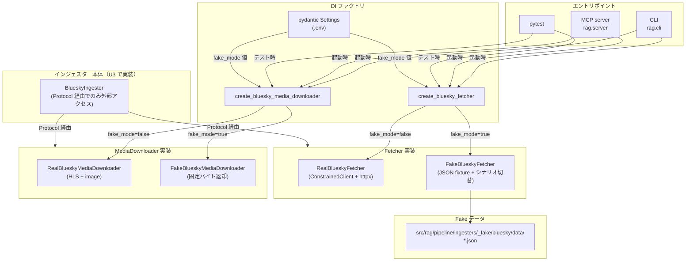

# BlueSky Fake Adapter

## 概要

BlueSky インジェスターの外部アクセス処理（AT Protocol API + メディア DL）を抽象化した
`BlueskyFetcher` / `BlueskyMediaDownloader` Protocol と、その fake 実装
`FakeBlueskyFetcher` / `FakeBlueskyMediaDownloader` を定義する。Fake モード基盤の
BlueSky 向け具体実装。

スコープ:

- `BlueskyFetcher` / `BlueskyMediaDownloader` Protocol のメソッド定義（メソッドシグネチャ・戻り値構造）
- `FakeBlueskyFetcher` / `FakeBlueskyMediaDownloader` のシナリオ切替仕様
- Fake データ JSON の構造とフィールド規約
- 契約検証用参照サンプルの管理規約
- pytest テストでの利用パターン
- QA スキルでの BlueSky 動作確認シナリオ

スコープ外:

- fake モード基盤共通の制約・切替機構（[Fake モード基盤](../fake-mode.md) で定義）
- Real Fetcher / Real MediaDownloader の振る舞い（既存 [BlueSky インジェスター](../../ingesters/bluesky.md) に従う）
- インジェスター本体（`BlueskyIngester`）の構造分割（[Issue #704](https://github.com/becky3/rag-knowledge/issues/704) の U3 で扱う）
- YouTube / Zenn 等の他 source_type 用 Fake Adapter（別個別仕様書で扱う）

## 背景

- BlueSky インジェスターは AT Protocol AppView（`getAuthorFeed` / `getPosts` / `resolveHandle`）と BlueSky CDN（画像・HLS 動画）の 2 系統の外部アクセスを持つ
- 既存実装では HTTP 通信を `fetch_get` 直呼びで行っており、テスト・QA で実 BlueSky アクセスを排除できなかった
- youtube パターンでは外部アクセスを単一の Fetcher Protocol に集約していたが、bluesky では責務が AT Protocol API とメディア DL で明確に異なるため、2 つの独立した Protocol（Fetcher と MediaDownloader）に分離する
- Fake Adapter 注入により、インジェスター本体は外部依存に直接依存しなくなり、L2 Mock E2E テスト・QA・運用環境での fake モード動作が可能になる

## 制約

### 共通制約の継承

Fake モード基盤の制約（[Fake モード基盤](../fake-mode.md)）はすべて適用される。本仕様書は BlueSky 固有の制約のみを追記する。

### BlueskyFetcher Protocol のメソッド定義

AT Protocol API アクセスを以下のメソッドに抽象化する:

| メソッド | 引数 | 戻り値 | 振る舞い |
|---|---|---|---|
| `get_author_feed` | `actor: str`、`limit: int`、`cursor: str \| None` | `dict[str, Any]`（`{"feed": [...], "cursor": ... \| null}`）| 著者タイムライン取得 1 ページ |
| `get_posts` | `at_uris: list[str]` | `dict[str, Any]`（`{"posts": [...]}`）| AT URI 指定の投稿取得 |
| `resolve_handle` | `handle: str` | `dict[str, Any]`（`{"did": "did:plc:..."}`）| handle → DID 解決 |

すべて `async` メソッド。Real / Fake で同じシグネチャを実装する。

戻り値の dict 構造の詳細フィールドは [BlueSky インジェスター](../../ingesters/bluesky.md) の「外部連携」セクション・既存 fixture を参照（コード SSoT）。

**Protocol の境界性**: `BlueskyFetcher` Protocol は AT Protocol AppView との境界に位置する。
Real Fetcher の戻り値はライブラリ（`httpx.Response.json()`）の戻り値をそのまま返す形を取り、
Fake Fetcher も同形式の dict を返す。`dict[str, Any]` の使用は coding-standards の
「`dict[str, Any]` は外部との境界での受信直後にのみ許容」ルールに該当する。
インジェスター本体側は dict から必要な情報を取り出す責務を持ち、
`dict[str, Any]` の越境は本 Protocol の境界で完結する。

### BlueskyMediaDownloader Protocol のメソッド定義

BlueSky CDN への画像・HLS 動画 DL を以下のメソッドに抽象化する:

| メソッド | 引数 | 戻り値 | 振る舞い |
|---|---|---|---|
| `download_image` | `url: str` | `tuple[bytes, str]`（`(画像バイナリ, Content-Type)`）| fullsize 画像 DL |
| `download_hls_video` | `playlist_url: str` | `bytes`（結合済み ts バイナリ）| HLS マスター/バリアント解決 + ts 結合 |

HLS バリアント選択（BANDWIDTH 最小）、SSRF 防止のための同一オリジンリダイレクト追従、ts セグメント結合は Real 実装内部で完結し、Fake 実装は単に固定バイトを返す。

### FakeBlueskyFetcher のシナリオ切替

Fake Fetcher は単一の戻り値だけでなく、テスト・QA で必要な複数シナリオに対応する。シナリオはコンストラクタ引数 `scenario` で切り替える:

| シナリオ名 | 振る舞い | 用途 |
|---|---|---|
| `happy`（デフォルト）| 全メソッドが正常 fixture を返す | 通常系の動作確認 |
| `not_found_handle` | `resolve_handle` が `httpx.HTTPStatusError`（404）を発生 | ハンドル未存在エラー検証 |
| `not_found_post` | `get_posts` が `{"posts": []}` を返す（投稿削除済み相当）| ピンポイント取り込み失敗の動作確認 |
| `circuit_breaker` | 任意のメソッドが `RuntimeError("circuit breaker tripped")` を発生 | サーキットブレーカー発動時のエラーハンドリング検証 |

シナリオ追加時は本テーブルに追記する。

### FakeBlueskyMediaDownloader のシナリオ切替

| シナリオ名 | 振る舞い | 用途 |
|---|---|---|
| `happy`（デフォルト）| 固定バイトを返す（synthetic PNG ヘッダー / synthetic ts ペイロード）| 通常系の動作確認 |
| `download_error` | 任意のメソッドが `RuntimeError("media download error")` を発生 | メディア DL 失敗時のエラーハンドリング検証 |

### カスタムデータ注入

シナリオ切替で対応できない細かい振る舞い検証には、コンストラクタ引数でカスタムデータを直接渡す方式を提供する。

**FakeBlueskyFetcher** のコンストラクタ引数:

| 引数名 | 種別 | 型 | 用途 |
|---|---|---|---|
| `fixture_dir` | 位置引数（必須）| Path | Fake データの配置ディレクトリ（存在しない場合は `__init__` で fail-fast）|
| `scenario` | キーワード引数 | str | シナリオ名（既定: `happy`）|
| `feed` | キーワード引数 | dict | `get_author_feed` の戻り値を上書き |
| `posts` | キーワード引数 | dict | `get_posts` の戻り値を上書き |
| `did_map` | キーワード引数 | dict[str, str] | `resolve_handle` の handle→DID マップ。指定された handle のみ動的に DID を返す |

カスタムデータが指定された場合は、シナリオ設定よりも優先される（ただしエラー系シナリオは例外を発生させ、戻り値カスタマイズより raise が優先される）。

**FakeBlueskyMediaDownloader** のコンストラクタ引数:

| 引数名 | 種別 | 型 | 用途 |
|---|---|---|---|
| `scenario` | キーワード引数 | str | シナリオ名（既定: `happy`）|
| `image_data` | キーワード引数 | bytes | `download_image` の戻り値バイナリを上書き |
| `image_content_type` | キーワード引数 | str | `download_image` の Content-Type を上書き |
| `video_data` | キーワード引数 | bytes | `download_hls_video` の戻り値を上書き |

### Fake データ JSON の構造

`src/rag/pipeline/ingesters/_fake/bluesky/data/` 配下に以下の JSON ファイルを配置する:

| ファイル | 対応メソッド・シナリオ | 内容 |
|---|---|---|
| `feed_happy.json` | `get_author_feed` (`happy`)| 通常投稿 + リプライ + リポスト + 外部リンク投稿（最低 4 アイテム）|
| `posts_happy.json` | `get_posts` (`happy`)| `{"posts": [...]}` 形式、最低 1 件 |
| `resolve_handle_happy.json` | `resolve_handle` (`happy`)| `{"did": "did:plc:test01234567"}`|

JSON のフィールド構造は対応する Real Fetcher の戻り値（AT Protocol AppView レスポンス）と同じ。実値は synthetic ID 規約（[Fake モード基盤](../fake-mode.md) の synthetic ID 規約セクション）に従う。

### 安全網の対象ライブラリ

[Fake モード基盤](../fake-mode.md) の autouse 安全網が `_RaiseOnUse` でブロックする bluesky 関連の外部ライブラリは、Issue #704 の U4（起動経路差し替え + autouse 安全網）で確定する。現時点では以下が候補:

- `httpx.AsyncClient.get` への bluesky 経由呼び出し（class 単位ブロックは過剰なため、`ConstrainedClient` の利用箇所を間接的に Fake 注入で防御する形を検討）
- 詳細は U4 の実装時に確定（本仕様書を更新する）

### 契約検証用参照サンプル

実 AT Protocol AppView レスポンスとの構造的等価性を検証するため、`src/rag/pipeline/ingesters/_fake/bluesky/data/reference/` に実 API レスポンスのサンプルを 1 件保存する。

- 配置: `reference/feed_real_sample.json`
- 実 ID は synthetic ID（`did:plc:test01234567` / `test.bsky.social` / `testrkey00000` 系）に置換する
- 契約検証テストでは「キーの存在と型（dict / list / str / int 等）」のみ比較対象とし、値の実態（具体的な ID 文字列等）は検証対象外とする
- 実 API 仕様変更時は参照サンプルを再収集し、Fake Fetcher の戻り値構造を追従させる

## インターフェース

### 環境変数

[Fake モード基盤](../fake-mode.md) で定義済み。bluesky 固有の値:

| 環境変数 | 既定値 | 振る舞い |
|---|---|---|
| `RAG_BLUESKY_FAKE_MODE` | `true` | true で `FakeBlueskyFetcher` / `FakeBlueskyMediaDownloader` を注入 |
| `RAG_BLUESKY_FAKE_FIXTURE_DIR` | `src/rag/pipeline/ingesters/_fake/bluesky/data` | Fake Fetcher が読み込む fixture ディレクトリ |

### Factory 関数

| 関数 | シグネチャ | 用途 |
|---|---|---|
| `create_bluesky_fetcher` | `(settings: RAGSettings, client: ConstrainedClient) -> BlueskyFetcher` | Settings の `rag_bluesky_fake_mode` で Real / Fake を切替 |
| `create_bluesky_media_downloader` | `(settings: RAGSettings, client: ConstrainedClient) -> BlueskyMediaDownloader` | 同上 |

両 factory とも `rag_bluesky_fake_mode=True` 時は Fake を返し、fixture ディレクトリ不在時は `FileNotFoundError` で fail-fast する（Fetcher のみ。MediaDownloader Fake は fixture 不要）。

## コンポーネント構成

## 想定プロファイル

本仕様書は外部 API 通信を行わない（fake モード機構の定義）ため、想定プロファイルは該当しない。Real 実装の想定プロファイルは [BlueSky インジェスター](../../ingesters/bluesky.md) を参照。

## 外部連携

本仕様書自体は外部連携を行わない。Real 実装の連携先は [BlueSky インジェスター](../../ingesters/bluesky.md) の「外部連携」セクションを参照。

## エッジケース

| ケース | 振る舞い |
|---|---|
| `RAG_BLUESKY_FAKE_FIXTURE_DIR` で指定したパスが存在しない | `create_bluesky_fetcher` 起動時に `FileNotFoundError` で fail-fast |
| 未知のシナリオ名（例: `scenario="bogus"`）| `FakeBlueskyFetcher.__init__` で `ValueError` |
| Fake Fetcher の戻り値構造が Real と乖離 | 契約検証テスト（`reference/feed_real_sample.json` を用いた構造比較）で検出する |
| pytest テストで Fake Fetcher 注入を忘れた | autouse 安全網（U4 で実装）が `RuntimeError` を発生させる |
| QA スキルで実アクセスを誤選択 | [Fake モード基盤](../fake-mode.md) の二重確認フローに従う |
| カスタム `did_map` に未登録の handle が指定された | デフォルトの fixture（`resolve_handle_happy.json`）にフォールバック |

## 関連ドキュメント

- [Fake モード基盤](../fake-mode.md) — 共通の制約・切替機構
- [BlueSky インジェスター](../../ingesters/bluesky.md) — Fetcher 抽象化対象のインジェスター仕様
- [YouTube Fake Adapter](youtube.md) — 先行する正解パターン（参照実装）
- [アーキテクチャ採用方針](../../architecture.md) — Fetcher Protocol + Fake Adapter の構造判断 SSoT
