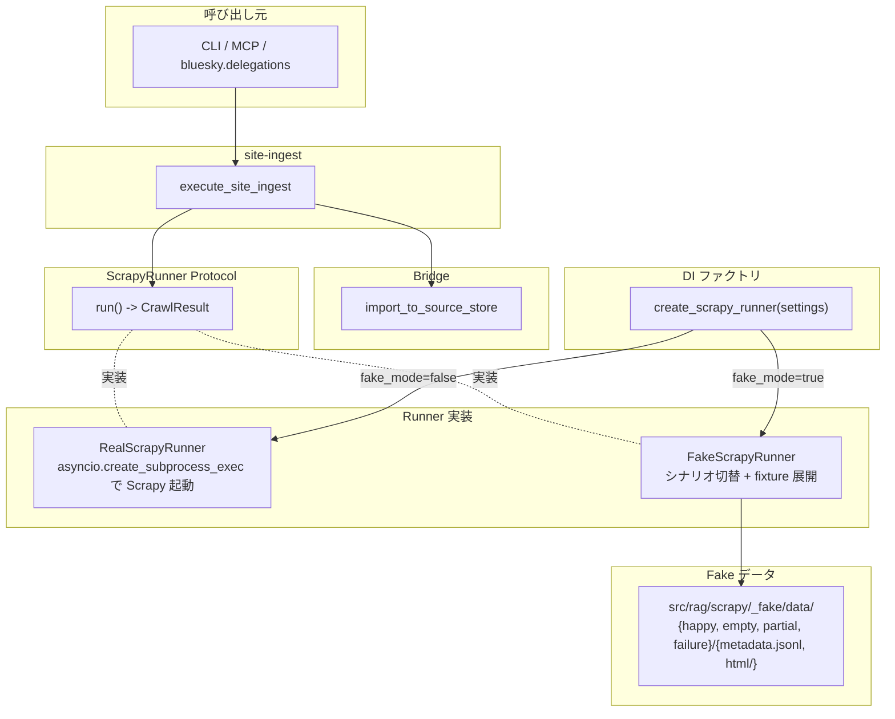

# Scrapy Fake Adapter

## 概要

site-ingest（大規模サイトの一括クロール）が利用する Scrapy subprocess ラッパーを抽象化した `ScrapyRunner` Protocol と、その fake 実装 `FakeScrapyRunner` を定義する。Fake モード基盤の web 系（site-ingest）向け具体実装。

スコープ:

- `ScrapyRunner` Protocol の定義（メソッドシグネチャ・戻り値構造）
- `FakeScrapyRunner` のシナリオ切替仕様
- fixture（JSONL + HTML）の構造と配置
- pytest テスト・E2E での利用パターン
- QA スキルでの site-ingest 動作確認シナリオ

スコープ外:

- fake モード基盤共通の制約・切替機構（[Fake モード基盤](../fake-mode.md) で定義）
- Real Runner の振る舞い（既存 [サイト一括取り込み](../../site-ingest.md) に従う）
- per-URL fetch（bluesky の web URL 自動取り込み）— site-ingest 経由に統一済み

## 背景

- site-ingest は Scrapy を subprocess で起動するため、テスト・QA の際に実 Web アクセスが発生してしまう
- pytest 内 mock では subprocess 越境（pytest → MCP CLI → Scrapy spider）の境界で fake 注入が成立しなかった
- `ScrapyRunner` を Port 化し、`FakeScrapyRunner` を `.env` 経由で注入することで、CLI / MCP / pytest のいずれの起動経路でも実 Web アクセスを排除する

## 制約

### 共通制約の継承

Fake モード基盤の制約（[Fake モード基盤](../fake-mode.md)）はすべて適用される。本仕様書は web (scrapy) 固有の制約のみを追記する。

### `ScrapyRunner` Protocol のメソッド定義

site-ingest が利用する subprocess 実行処理を以下のメソッドに抽象化する:

| メソッド | 引数（キーワード） | 戻り値 | 振る舞い |
|---|---|---|---|
| `run` | `start_url: str = ""`、`start_urls: list[str] | None = None`、`allowed_domains: str = ""`、`url_pattern: str = ""`、`max_pages: int | None = None`、`force: bool = False` | `CrawlResult`（exit_code / output_dir / jsonl_path / success / crawl_dir / stderr_tail） | クロール実行 |

`async` メソッド。Real / Fake で同じシグネチャを実装する。

戻り値の `CrawlResult` 構造は `src/rag/scrapy/runner.py` の dataclass 定義を SSoT とする。

### `FakeScrapyRunner` のシナリオ切替

Fake Runner はテスト・QA で必要な複数シナリオに対応する。シナリオはコンストラクタ引数 `scenario` で切り替える:

| シナリオ名 | 振る舞い | 用途 |
|---|---|---|
| `happy`（デフォルト）| 複数ページの JSONL + HTML を返却し、`success=True` | 通常系の動作確認 |
| `empty` | JSONL を空ファイルとして返し `no_output` 経路を踏ませる | クロール結果ゼロ件の早期 return 検証 |
| `partial` | JSONL に invalid な行を混在させ `parse_errors > 0` を発生 | parse エラーのカウント検証 |
| `failure` | `exit_code=1`、`success=False` を返す | subprocess 失敗時のハンドリング検証 |

`SCENARIOS` tuple で網羅性を管理。シナリオ追加時は本テーブルに追記する。未対応の値が渡された場合は `ValueError`（fail-fast）。

### Fake 動作の概要

- 入力 URL（`start_url` / `start_urls`）は **無視する**。FakeScrapyRunner は fixture から JSONL + HTML 群を tmp ディレクトリに展開し、その位置情報を `CrawlResult` で返す
- Real と整合する一時ディレクトリ構造（`<temp_dir>/<domain>/<crawl_key>/{html, metadata.jsonl}`）を生成する
- subprocess は起動しない。実 HTTP リクエストは発生しない

### fixture ディレクトリ構造

`src/rag/scrapy/_fake/data/` 配下に以下の構造で配置する:

```
src/rag/scrapy/_fake/data/
├── happy/
│   ├── metadata.jsonl              # 取り込み対象ページのメタデータ
│   └── html/                       # ページ本体
│       ├── page1.html
│       └── page2.html
├── empty/
│   └── metadata.jsonl              # 空ファイル
├── partial/
│   ├── metadata.jsonl              # 一部の行が invalid JSON
│   └── html/
│       └── ok.html
└── failure/                        # 実体不要（success=False を返却するだけ）
```

`metadata.jsonl` の各行は `bridge.py` が期待する形式（`url` / `title` / `status` / `depth` / `collected_at` / `filepath` フィールド）に準拠する。

### Synthetic URL 規約

Fake が返却する URL は実在しない synthetic ID を使う:

| 識別子種別 | 形式 | 例 |
|---|---|---|
| URL | `https://test.invalid/` プレフィックス | `https://test.invalid/page1` |

`test.invalid` は IANA 予約 TLD（RFC 6761）で実在しないため、synthetic 利用に最適。**Fake が返却する URL** に使用する。

**テスト入力 URL** は IANA 予約・実在ドメイン（`example.com` / `example.org` / `example.net`）を使う。これらは DNS / SSRF 検証を通過し、Fake Runner では実 HTTP リクエストが発生しないため安全。

### 安全網の対象

[Fake モード基盤](../fake-mode.md) の autouse 安全網は env 強制方式（`RAG_WEB_FAKE_MODE=true`）を採用する。

`_RaiseOnUse` クラス差し替え方式は採用しない:

- Twisted reactor / Scrapy のクラス階層が複雑で誤爆リスクが高い
- bluesky と同じ env 強制方式に統一することで運用がシンプルになる

`RAG_TESTS_ALLOW_NETWORK=1` 設定時のみ強制を解除する。

### Web (scrapy) 設定項目

`src/rag/config.py` の Settings に以下の項目を追加する:

| 項目名 | 層 | 設計意図 |
|---|---|---|
| `rag_web_fake_mode` | 環境依存値 | Web (scrapy) fake モード切替の上位スイッチ。`.env` で公開する唯一の web 系 fake フラグ |
| `rag_scrapy_fake_mode` | 環境依存値 | 内部: ScrapyRunner Fake モード切替。`.env` で個別指定がなければ `rag_web_fake_mode` から派生 |
| `rag_scrapy_fake_fixture_dir` | 環境依存値 | Fake Runner が読み込む fixture ディレクトリ。デフォルトは `src/rag/scrapy/_fake/data` |

具体値（デフォルト・許容範囲）は pydantic Field が SSoT。`rag_web_fake_mode → rag_scrapy_fake_mode` の派生は `_EnvLoader` の `model_validator(mode="after")` に集約する。

将来 `RAG_SCRAPY_FAKE_MODE` を個別 env として `.env` で明示できるようにする場合は、派生ロジックに数行の分岐を追加するだけで対応可能。

## インターフェース

### Protocol / 実装クラス

| 種別 | クラス名 | 配置 |
|---|---|---|
| Protocol | `ScrapyRunner` | `src/rag/scrapy/runner.py` |
| Real 実装 | `RealScrapyRunner` | `src/rag/scrapy/runner.py` |
| Fake 実装 | `FakeScrapyRunner` | `src/rag/scrapy/_fake/__init__.py` |
| ファクトリ関数 | `create_scrapy_runner(settings: RAGSettings) -> ScrapyRunner` | `src/rag/scrapy/runner.py` |

### `execute_site_ingest` 内での利用

`src/rag/pipeline/site_ingest_runner.py` の `execute_site_ingest` は `create_scrapy_runner(settings)` で Runner を生成し、`runner.run(...)` を呼び出す。fake モード判定は factory に閉じる。

### CLI / MCP からの利用

CLI / MCP は `execute_site_ingest` を経由するため直接 factory を呼ぶ必要はない。Settings がそのまま渡されるため、`.env` の `RAG_WEB_FAKE_MODE` が自動的に反映される。

## コンポーネント構成



## エッジケース

| ケース | 振る舞い |
|---|---|
| Fake Runner で `failure` シナリオ指定時 | `CrawlResult.success=False` / `exit_code=1` を返却。`execute_site_ingest` は Bridge を呼ばずに `no_output=False` で返却（jsonl_path が空のため `no_output=True` 相当の早期 return） |
| Fake Runner で `empty` シナリオ指定時 | JSONL が空のため Bridge が呼ばれても 0 件処理。`SiteIngestExecution.no_output=False`（jsonl は存在する）+ `ingest.placed=0` |
| Fake Runner で `partial` シナリオ指定時 | Bridge が JSONL の invalid 行を `parse_errors` でカウント。`SiteIngestExecution.parse_errors > 0` |
| 入力 URL が `test.invalid`（DNS 解決不可） | `validate_url` / `check_ssrf` で拒否される（DNS 解決失敗）。Fake テストでは `example.com` 等の実在ドメインを使うこと |
| Fake モードで運用環境（本番）起動 | `_fake/` ディレクトリが production パッケージに含まれるため動作する。WARNING ログで `[FAKE MODE: web]` を明示 |
| `RAG_SCRAPY_FAKE_FIXTURE_DIR` で指定したパスが存在しない | 起動時に `FileNotFoundError` で fail-fast |
| MCP 応答ラベル | fake モード時、`rag_site_ingest` 応答冒頭に `[FAKE MODE: web]` を付与。Embedding fake も同時有効なら `[FAKE MODE: embedding]` も並列出力 |
| `RAG_WEB_FAKE_MODE` と `RAG_SCRAPY_FAKE_MODE` の両方が `.env` で明示 | `RAG_SCRAPY_FAKE_MODE` が優先（`_EnvLoader.model_validator` の派生は None の場合のみ）。**ただし `RAG_SCRAPY_FAKE_MODE` env は本 Issue では未公開**（必要になった時点で追加可能） |

## QA シナリオ（fake モード）

QA スキルで実 Web アクセスなしで通すべき検証項目:

1. **rag_site_ingest** の単一 URL モード（クロールモード）で取り込み完了
2. **rag_site_ingest** の複数 URL モード（`urls` パラメータ）で取り込み完了
3. **rag_crawl_bluesky** で web URL を含む投稿を取り込み → site-ingest 委譲経由で fake が動作（Bluesky 投稿内 URL 自動取り込みの結合 QA）
4. MCP 応答冒頭に `[FAKE MODE: web]` ラベルが付与されていること（Embedding fake も同時有効なら `[FAKE MODE: embedding]` も並列出力）
5. 起動ログに `[FAKE MODE: web] Web (scrapy) は FAKE モードで起動中` が出力されていること

QA 結果はジャーナル または Issue コメントに記録する。

## 関連ドキュメント

- [Fake モード基盤](../fake-mode.md) — 共通基盤・切替機構・autouse 安全網・QA 運用を含む横断 SSoT
- [サイト一括取り込み](../../site-ingest.md) — 抽象化対象の Real Runner 仕様
- [BlueSky インジェスター](../../ingesters/bluesky.md) — 投稿内 URL 自動取り込みで site-ingest を経由する
