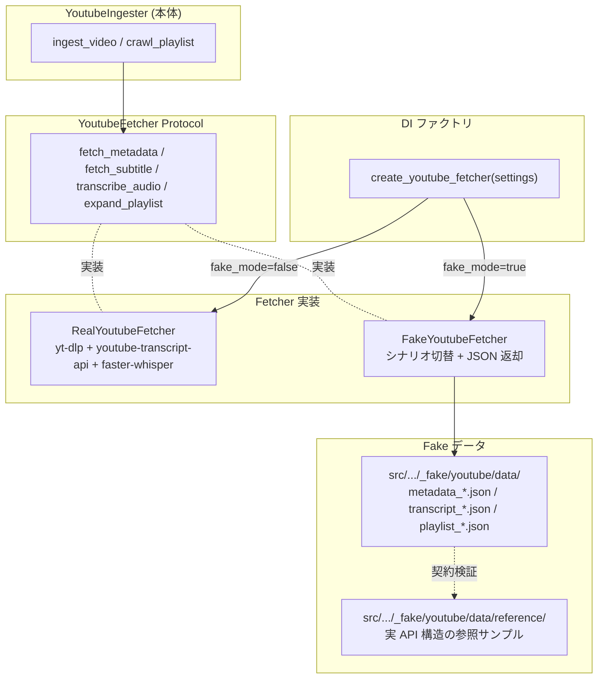

# YouTube Fake Adapter

## 概要

YouTube インジェスターの外部アクセス処理（字幕取得・動画メタデータ取得・プレイリスト展開・音声 Whisper 文字起こし）を抽象化した `YoutubeFetcher` Protocol と、その fake 実装 `FakeYoutubeFetcher` を定義する。Fake モード基盤の YouTube 向け具体実装。

スコープ:

- `YoutubeFetcher` Protocol の定義（メソッドシグネチャ・戻り値構造）
- `FakeYoutubeFetcher` のシナリオ切替仕様
- fake データ JSON の構造とフィールド規約
- 契約検証用参照サンプルの管理規約
- pytest テストでの利用パターン
- QA スキルでの YouTube 動作確認シナリオ

スコープ外:

- fake モード基盤共通の制約・切替機構（[Fake モード基盤](../fake-mode.md) で定義）
- Real Fetcher の振る舞い（既存 [YouTube インジェスター](../../ingesters/youtube.md) に従う）
- BlueSky / Zenn 等の他 source_type 用 Fake Adapter（別個別仕様書で扱う）

## 背景

- YouTube インジェスターは 3 つの外部ライブラリ（`yt_dlp` / `youtube_transcript_api` / `faster_whisper`）と FFmpeg に依存しており、結合テスト・QA で実 YouTube アクセスを排除する優先度が高い
- 過去の取り組み（Issue #683 前回失敗、2026-04-26）で「pytest 内 mock のみ」では QA 時の実アクセスを防げなかった
- Fetcher 抽象化により、インジェスター本体は外部ライブラリに直接依存しなくなり、Fake Fetcher 注入で本物の YouTube に行かずに ingester 全体の振る舞いを検証可能になる

## 制約

### 共通制約の継承

Fake モード基盤の制約（[Fake モード基盤](../fake-mode.md)）はすべて適用される。本仕様書は YouTube 固有の制約のみを追記する。

### YoutubeFetcher Protocol のメソッド定義

YouTube インジェスターの外部アクセス処理を以下のメソッドに抽象化する:

| メソッド | 引数 | 戻り値 | 振る舞い |
|---|---|---|---|
| `fetch_metadata` | `video_id: str` | `dict[str, Any]`（yt-dlp `extract_info` の info_dict 形式） | 動画メタデータ取得 |
| `fetch_subtitle` | `video_id: str`、`languages: list[str]` | `tuple[list[dict[str, Any]], str]`（snippets, language） | 字幕取得 |
| `transcribe_audio` | `video_id: str`、`languages: list[str]`、`whisper_model: str`、`whisper_device: str` | `tuple[list[dict[str, Any]], str]`（snippets, language） | 音声 DL + Whisper 文字起こし |
| `expand_playlist` | `playlist_url: str`、`max_videos: int` | `list[dict[str, Any]]`（entries） | プレイリスト展開 |

すべて `async` メソッド。Real / Fake で同じシグネチャを実装する。

戻り値の dict 構造の詳細フィールドは [YouTube インジェスター](../../ingesters/youtube.md) の「保存形式」セクション・既存実装の `_make_metadata()` テストヘルパーを参照（コード SSoT）。

**Fetcher Protocol の境界性**: `YoutubeFetcher` Protocol は外部ライブラリ（yt-dlp 等）との境界に位置する。Real Fetcher の戻り値はライブラリの戻り値（`extract_info` の info_dict 等）をそのまま返す形を取り、Fake Fetcher も同形式の dict を返す。`dict[str, Any]` の使用が許容されるのは coding-standards.md の「`dict[str, Any]` は外部との境界での受信直後にのみ許容」ルールに該当する。インジェスター本体側は dict から必要な情報を取り出す責務を持ち、`dict[str, Any]` の越境は本 Protocol の境界で完結する。

### FakeYoutubeFetcher のシナリオ切替

Fake Fetcher は単一の戻り値だけでなく、テスト・QA で必要な複数シナリオに対応する。シナリオはコンストラクタ引数 `scenario` で切り替える:

| シナリオ名 | 振る舞い | 用途 |
|---|---|---|
| `happy`（デフォルト）| 全メソッドが正常データを返す | 通常系の動作確認 |
| `no_subtitle` | `fetch_subtitle` が `NoTranscriptFound` を発生 | Whisper フォールバック検証 |
| `transcripts_disabled` | `fetch_subtitle` が `TranscriptsDisabled` を発生 | Whisper フォールバック検証 |
| `ip_blocked` | `fetch_subtitle` が `RequestBlocked` を発生 | エラーハンドリング検証 |
| `metadata_error` | `fetch_metadata` が `Exception` を発生 | エラーハンドリング検証 |
| `duration_exceeded` | `fetch_metadata` の `duration` が 24 時間超 | 動画長上限チェック検証 |
| `missing_channel_id` | `fetch_metadata` の `channel_id` が None | バリデーション検証 |
| `empty_playlist` | `expand_playlist` が `[]` を返す | 空プレイリスト検証 |
| `playlist_expand_error` | `expand_playlist` が `Exception` を発生 | プレイリストエラー検証 |

シナリオ追加時は本テーブルに追記する。

### カスタムデータ注入

シナリオ切替で対応できない細かい振る舞い検証（特定の値・特定の構造）には、コンストラクタ引数でカスタムデータを直接渡す方式を提供する。コンストラクタは以下のキーワード引数を受け取る:

| 引数名 | 型 | 用途 |
|---|---|---|
| `scenario` | str | シナリオ名（既定: `happy`） |
| `metadata` | dict | `fetch_metadata` の戻り値を上書き |
| `snippets` | list | `fetch_subtitle` / `transcribe_audio` の snippets を上書き |
| `language` | str | `fetch_subtitle` / `transcribe_audio` の language を上書き |
| `playlist_entries` | list | `expand_playlist` の戻り値を上書き |

カスタムデータが指定された場合は、シナリオ設定よりも優先される。

### Fake データ JSON の構造

`src/rag/pipeline/ingesters/_fake/youtube/data/` 配下に以下の JSON ファイルを配置する:

| ファイル | 対応メソッド・シナリオ | 内容 |
|---|---|---|
| `metadata_happy.json` | `fetch_metadata` (`happy`) | 通常系メタデータ（duration 120 秒、channel_id 等が valid） |
| `metadata_duration_exceeded.json` | `fetch_metadata` (`duration_exceeded`) | duration が 24 時間超のメタデータ |
| `metadata_missing_channel_id.json` | `fetch_metadata` (`missing_channel_id`) | channel_id が null のメタデータ |
| `transcript_ja.json` | `fetch_subtitle` (`happy`) | 日本語字幕（snippets 配列 + language=ja） |
| `transcript_whisper.json` | `transcribe_audio` (`happy`) | Whisper 文字起こし結果（snippets 配列 + language=ja） |
| `playlist_happy.json` | `expand_playlist` (`happy`) | 通常系プレイリスト entries（複数動画）|

JSON のフィールド構造は対応する Real Fetcher の戻り値と同じ。実値は synthetic ID 規約に従う。

### 安全網の対象ライブラリ

[Fake モード基盤](../fake-mode.md) の autouse 安全網が `_RaiseOnUse` でブロックする YouTube 関連の外部ライブラリ:

- `yt_dlp.YoutubeDL`
- `youtube_transcript_api.YouTubeTranscriptApi`
- `youtube_transcript_api` 内の例外クラス（`TranscriptsDisabled`、`NoTranscriptFound`、`RequestBlocked` 等）は import 可能とする（テスト内で `assert isinstance(exc, RequestBlocked)` 等の検証で使用するため）
- `faster_whisper.WhisperModel`

### 契約検証用参照サンプル

実 YouTube レスポンスとの構造的等価性を検証するため、`src/rag/pipeline/ingesters/_fake/youtube/data/reference/` に実 API レスポンスのサンプルを 1 件保存する。

- 配置: `reference/metadata_real_sample.json` 等
- 実 ID は synthetic ID（`TestVideo01` 等）に置換する
- 契約検証テストでは「キーの存在と型（dict / list / str / int 等）」のみ比較対象とし、値の実態（具体的な ID 文字列等）は検証対象外とする
- 実 API 仕様変更時は参照サンプルを再収集し、Fake Fetcher の戻り値構造を追従させる

### YouTube 設定項目

`src/rag/config.py` の Settings に以下の項目を追加する:

| 項目名 | 層 | 設計意図 |
|---|---|---|
| `youtube_fake_mode` | 環境依存値 | YouTube fake モード切替。デフォルトは安全側（true）。本番運用時のみ false を `.env` で明示 |
| `youtube_fake_fixture_dir` | 環境依存値 | Fake Fetcher が読み込む fixture ディレクトリ。デフォルトは `src/rag/pipeline/ingesters/_fake/youtube/data` 相当の相対パス |

具体値（デフォルト・許容範囲）は pydantic Field が SSoT。仕様書には Why のみ記述する。

## インターフェース

### Protocol / 実装クラス

| 種別 | クラス名 | 配置 |
|---|---|---|
| Protocol | `YoutubeFetcher` | `src/rag/pipeline/ingesters/youtube_fetcher.py` |
| Real 実装 | `RealYoutubeFetcher` | `src/rag/pipeline/ingesters/youtube_fetcher.py` |
| Fake 実装 | `FakeYoutubeFetcher` | `src/rag/pipeline/ingesters/_fake/youtube/__init__.py` |
| ファクトリ関数 | `create_youtube_fetcher(settings: Settings) -> YoutubeFetcher` | `src/rag/pipeline/ingesters/youtube_fetcher.py` |

### `YoutubeIngester` のシグネチャ変更

`YoutubeIngester.__init__` に `fetcher: YoutubeFetcher` パラメータを追加する。

- 必須（required）: コーディング規約のフォールバック禁止に従い、デフォルト値を持たない
- インジェスター本体（`ingest_video` / `crawl_playlist`）は `_fetch_metadata` 等の private メソッドを廃止し、Fetcher Protocol 経由で呼び出す
- 既存の `_fetch_metadata` / `_fetch_transcript` / `_fetch_subtitle` / `_transcribe_with_whisper` / `_download_audio` / `_expand_playlist` メソッドは `RealYoutubeFetcher` に移植する（既存ロジックの単純な再配置）
- **ハードリミット定数の所属**: 既存の `MAX_VIDEOS_HARD_LIMIT` / `MIN_REQUEST_INTERVAL` / `MAX_AUDIO_FILE_SIZE_MB` / `JITTER_MIN_RATIO` / `CIRCUIT_BREAKER_THRESHOLD` 等の定数は、本プロジェクトの既存慣例（モジュールトップレベル定数 + `# ハードリミット` コメント）に従い、インジェスター本体モジュール（`youtube.py`）のトップレベルに残す。Real Fetcher / Fake Fetcher は必要に応じてこれらを import して参照する。安全制約の種別は agent-commons の安全性ガイド `~/.claude/docs/specs/safety-guide.md` §2.5 の「ハードリミット」に該当する。記載パターンの規約化は別 Issue（becky3/agent-commons #275）で追跡する

### CLI / MCP からの利用

CLI / MCP のインジェスター生成箇所（`src/rag/cli.py` / `src/rag/server.py`）では、`create_youtube_fetcher(settings)` でファクトリ関数から Fetcher を生成し、`YoutubeIngester` のコンストラクタ引数 `fetcher` として渡す。

### pytest fixture

`tests/conftest.py` または `tests/fixtures/youtube/conftest.py` に以下の fixture を定義する:

| fixture 名 | 戻り値 | 用途 |
|---|---|---|
| `youtube_fake_fetcher` | `FakeYoutubeFetcher(scenario="happy")` | デフォルト fake fetcher |
| `youtube_fake_fetcher_factory` | コール可能オブジェクト（シナリオ・カスタムデータ指定可）| シナリオ切替が必要なテスト用 |

テスト関数は `youtube_fake_fetcher` または `youtube_fake_fetcher_factory` を引数として受け取り、`make_youtube_ingester` ヘルパー（既存テストヘルパー）の `fetcher` 引数として渡す。

## 想定プロファイル

本仕様は fake 実装定義のため外部 API 通信を行わない。Real Fetcher の想定プロファイルは [YouTube インジェスター](../../ingesters/youtube.md) を参照。

## コンポーネント構成

## エッジケース

| ケース | 振る舞い |
|---|---|
| Fake Fetcher で `ip_blocked` シナリオ指定時 | `fetch_subtitle` が `youtube_transcript_api.RequestBlocked` を発生。インジェスターはエラーカウンタを増やしてスキップ |
| Fake Fetcher で `no_subtitle` シナリオ指定時 | `fetch_subtitle` が `NoTranscriptFound` を発生 → インジェスターが Whisper フォールバック → `transcribe_audio` が `data/transcript_whisper.json` を返す |
| Fake モードで運用環境（本番）起動 | `_fake/` ディレクトリが production パッケージに含まれるため動作する。WARNING ログで「fake モードで起動中」を明示 |
| Fake Fetcher で playlist が空 | `empty_playlist` シナリオで `expand_playlist` が `[]` を返す。インジェスターは `placed=0` で正常終了 |
| 契約検証テストが Real / Fake の戻り値構造の差異を検出 | テストが失敗。実 API のレスポンス構造変更を契機に Fake Fetcher の戻り値構造を追従させる |
| カスタムデータ + シナリオ両方指定 | カスタムデータが優先。シナリオ設定は無視される |
| `RAG_YOUTUBE_FAKE_FIXTURE_DIR` で指定したパスが存在しない | 起動時に `FileNotFoundError` で fail-fast |
| pytest テストで `youtube_fake_fetcher` fixture を使わずに `YoutubeIngester` を直接構築 | コンストラクタが `fetcher` 引数必須のため `TypeError` で失敗。autouse 安全網も外部ライブラリ呼び出しを `_RaiseOnUse` でブロック |

## QA シナリオ（fake モード）

QA スキルで実 YouTube アクセスなしで通すべき検証項目:

1. **rag_add_youtube** で各 URL パターンを取り込み:
   - `https://www.youtube.com/watch?v={video_id}`
   - `https://youtu.be/{video_id}`
   - `https://www.youtube.com/shorts/{video_id}`
   - `https://www.youtube.com/live/{video_id}`
   - `https://www.youtube.com/embed/{video_id}`
   - `https://www.youtube.com/v/{video_id}`
   - `https://m.youtube.com/watch?v={video_id}`
2. **rag_crawl_bluesky** で YouTube URL を含む BlueSky 投稿を取り込み → YouTube インジェスターへの委譲確認（Issue #679 の URL パターン追加分の結合 QA）
3. 不正 video_id を含む URL（例: `?v=`、`youtu.be/short`）の `rag_crawl_bluesky` 取り込み時に `errors` カウンタが増加し、site_ingest に流れていないこと
4. 既存パターン（`?v=`, `youtu.be/`）の回帰確認
5. MCP 応答冒頭に `[FAKE MODE]` ラベルが付与されていること
6. 起動ログに「YouTube は FAKE モードで起動中」が出力されていること

QA 結果はジャーナル または Issue コメントに記録する。

## 関連ドキュメント

- [Fake モード基盤](../fake-mode.md) — 共通基盤・切替機構・autouse 安全網・QA 運用・Issue #692 との関係を含む横断 SSoT
- [YouTube インジェスター](../../ingesters/youtube.md) — 抽象化対象のインジェスター仕様
- [Issue #679（YouTube URL パターン取りこぼし修正）](https://github.com/becky3/rag-knowledge/issues/679) — 本仕様書に QA を委譲
- [Issue #683（YouTube モック基盤整備）](https://github.com/becky3/rag-knowledge/issues/683) — 本仕様書を作成する Issue
- [agent-commons #275（ハードリミット定数の記載パターン規約化）](https://github.com/becky3/agent-commons/issues/275) — ハードリミット定数の配置・命名規約の明文化を追跡
