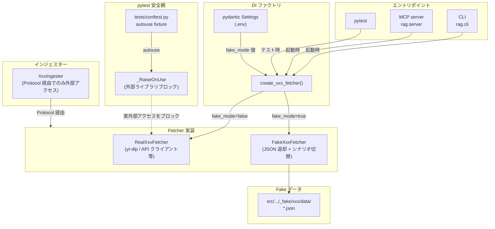

# Fake モード基盤

## 概要

外部 API・外部ライブラリを必要とするインジェスター（YouTube・BlueSky 等）に対し、外部アクセスを行わない代替実装（**Fake Adapter**）を注入できる仕組みを定義する。pytest テスト・QA・運用環境のいずれでも同一の Fake Adapter を使い回し、実外部アクセスをデフォルト無効化する。

スコープ:

- インジェスター単位の Fetcher 抽象（Port: Protocol）の定義規約
- Real Fetcher / Fake Fetcher の責務分離規約
- `.env` ベースの fake モード切替機構（pydantic Settings + DI ファクトリ）
- 起動時の状態可視化（ログ・MCP 応答ラベル）
- pytest における Fake Adapter の利用規約（autouse 安全網込み）
- QA スキル運用での fake / 実アクセス選択フロー

スコープ外:

- 個別 source_type の Fake Adapter の実装詳細（[fake-adapters/](fake-adapters/) 配下の個別仕様書で扱う）
- ChromaDB / SQLite 等の永続化層の fake 化
- LM Studio / Vision モデルの fake 化（メディア解析テスト等は別途扱う）
- MCP server / CLI subprocess を含む End-to-End テスト基盤（[Issue #692](https://github.com/becky3/rag-knowledge/issues/692) で別途扱う。本仕様の Fake Adapter を再利用する）

## 背景

- インジェスターの結合テスト・QA・運用環境での動作確認において、実外部 API へのアクセスは IP ブロック・API 仕様変更・コスト・レート制限等のリスクを伴う
- 過去の取り組み（Issue #683 前回失敗、2026-04-26）では「pytest プロセス内の mock 基盤」のみを作成し、MCP サーバー稼働時 / CLI 実行時には mock が一切効かず、QA 中に実 YouTube アクセスが発生した
- 既存テストはインジェスターの private メソッド（`_fetch_metadata` 等）を `unittest.mock.patch.object` で個別に差し替える方式を採用しているが、以下の課題がある:
  - private メソッド名・シグネチャ変更でテストが破壊されやすい
  - 「実外部アクセスをデフォルトで禁止する」 autouse 安全網が成立しない
  - Test Double が pytest 内部にしか存在せず、production 起動時の QA で再利用できない
  - MCP server / CLI subprocess 越境環境（[Issue #692](https://github.com/becky3/rag-knowledge/issues/692)）では別オブジェクトとなり patch.object が効かない
- インジェスターから外部アクセス処理を Fetcher 抽象（Port）として切り出し、Fake Fetcher を SSoT とすることで、上記課題をすべて解消する

## 制約

### Fetcher 抽象（Port）の定義

各インジェスターは外部アクセス処理を **Fetcher Protocol** として抽象化する。インジェスター本体は Fetcher Protocol 経由でのみ外部データを取得する。

- Fetcher Protocol は `src/rag/pipeline/ingesters/{source_type}_fetcher.py` 等の専用モジュールで定義する
- Real Fetcher（実外部アクセス実装）と Fake Fetcher（fixture 返却実装）の両方を提供する
- Real Fetcher と Fake Fetcher は同じ Protocol を実装し、戻り値の型・構造が完全に一致すること
- インジェスター本体は Protocol 型で Fetcher を受け取り、Real / Fake のいずれが注入されたかを意識しない

### Test Double の SSoT 統一

- **Test Double は Fake Fetcher 1 種類に統一する**: pytest テスト・production fake モード・QA すべてから同じ Fake Fetcher を使う
- pytest テストでも `patch.object(ingester, "_fetch_xxx")` 等の private メソッドパッチは新規追加禁止
- **既存テストの書き換え対象**: 既存の `tests/test_pipeline_ingesters_youtube.py` 等に存在する `patch.object(ingester, "_fetch_*")` 形式のパッチ箇所はすべて本 PR で Fake Fetcher 注入方式に書き換える（暫定的な共存は許容しない）
- pytest 単体テストで個別の振る舞い検証（例: 特定の例外を投げる）が必要な場合、Fake Fetcher にシナリオ切替の機構を持たせる（コンストラクタ引数 / ファクトリ関数等）

### `.env` ベースの切替機構

- 切替は `.env` 経由で pydantic Settings に読み込む形式を SSoT とする
- 環境変数名規約: `RAG_{SOURCE_TYPE}_FAKE_MODE`（例: `RAG_YOUTUBE_FAKE_MODE`）
- **デフォルト値は安全側（fake = true）に倒す**: `.env` に明示記述がない場合は fake モードで起動する。本番運用時のみ `RAG_{SOURCE_TYPE}_FAKE_MODE=false` を `.env` に明示する
- fake モード時の fixture ディレクトリは `RAG_{SOURCE_TYPE}_FAKE_FIXTURE_DIR` 環境変数で指定可能とする（デフォルトは個別 source_type 仕様書で定義）
- Settings の Field 定義が値の SSoT。仕様書には Why のみ記載する
- **既存運用環境への周知**: `.env.example` に本番運用想定値として `RAG_{SOURCE_TYPE}_FAKE_MODE=false` を記述する。既存の `.env` を持つユーザーは本変更後、`.env` への明示追記が必要となる（追記しない場合はデフォルトの fake モードで起動する）。リリース時の CHANGELOG・README で本変更点を周知する

### DI ファクトリ関数

- 各 source_type は `create_{source_type}_fetcher(settings: Settings) -> {SourceType}Fetcher` のファクトリ関数を提供する
- ファクトリ関数は Settings の `*_fake_mode` を見て Real / Fake を選択して返す
- インジェスター生成箇所（CLI / MCP / pytest）は必ずファクトリ関数経由で Fetcher を注入する
- **インジェスター本体は Settings に依存しない**: インジェスター本体は `Fetcher` Protocol のみを依存性として受け取り、Settings の参照や環境変数の直接読み取り（`os.getenv` 等）は行わない

### 起動時の状態可視化

CLI / MCP サーバー / pytest のいずれの起動経路でも、**起動時に 1 回のみ**現在のモードを以下の形で出力する:

- **fake モード**: WARNING レベルでログ出力する。「fake モードで起動中、実外部アクセスは発生しません」「本番運用時は `RAG_{SOURCE_TYPE}_FAKE_MODE=false` を `.env` に設定してください」のガイドを含める
- **real モード**: INFO レベルでログ出力する。「real モードで起動中、実外部アクセスが発生します」と明示

複数 source_type が混在する場合、各 source_type ごとに状態を出力する。

**起動時 1 回保証**: Settings はプロセス内シングルトンとして実装し、ログ出力は Settings 初期化時に 1 回のみ発生させる。pytest 実行時も session 開始時の Settings 初期化で 1 回のみ出力される（pytest-xdist 並列実行時は各 worker で 1 回ずつ）。テストごとに繰り返し WARNING が出力されないようにする。

### MCP 応答ラベル

MCP ツールの応答（`rag_add_youtube` / `rag_crawl_youtube` 等の取り込み系ツール）は、fake モード時に応答テキスト冒頭に `[FAKE MODE]` ラベルを付与する。MCP クライアント側で目視確認可能とする。

実アクセス時はラベルなし（通常応答）。

### autouse 安全網

`tests/conftest.py` に autouse fixture を配置し、**pytest プロセス内のみ**で対象 source_type の外部ライブラリ層を `_RaiseOnUse` センチネルに差し替える。

- **適用範囲**: pytest プロセス内のみ。CLI / MCP サーバー起動時は適用しない（CLI/MCP では `.env` 設定 + DI ファクトリ関数による Fetcher 選択が安全網となる）
- **差し替え対象の粒度**: クラス単位（例: `yt_dlp.YoutubeDL`、`youtube_transcript_api.YouTubeTranscriptApi`）。ライブラリのモジュール自体や例外クラスの import は阻害しない（テストコード内で `assert isinstance(exc, RequestBlocked)` 等の検証を可能にするため）
- 目的: テストで Fake Fetcher の注入を忘れた場合、即座に `RuntimeError` を発生させて検出する
- Fake Fetcher を注入したテストでは外部ライブラリは呼ばれないため、安全網はテスト動作に影響しない
- 環境変数 `RAG_TESTS_ALLOW_NETWORK=1` 設定時のみ安全網を解除する（手動の本番回帰検証等の特殊用途）
- 安全網の対象ライブラリは個別 source_type 仕様書で列挙する

### QA スキル運用

QA スキル（`/qa`）使用時は以下のフローで fake / 実アクセスを選択する:

1. QA 開始時、AskUserQuestion で「fake モード（推奨）」「実アクセスモード」を選択
2. fake モード選択時: `.env` の `RAG_{SOURCE_TYPE}_FAKE_MODE=true` を一時的に設定し、CLI/MCP を起動して動作確認
3. 実アクセスモード選択時: 二重確認（「実アクセスを発生させますが進めますか？対象ターゲット数: N 件」）の後、`.env` の `RAG_{SOURCE_TYPE}_FAKE_MODE=false` を一時的に設定して実行。実行完了後、取り込まれた実 URL 一覧を Issue / ジャーナルに記録する
4. デフォルトは fake モード。明示的に opt-in した場合のみ実アクセスを発生させる

### Synthetic ID 規約

Fake Fetcher が返すデータ内の識別子は実在の ID と衝突しないよう、source_type ごとに以下の prefix 規約に従う:

| source_type | 識別子種別 | 形式 | 例 |
|---|---|---|---|
| YouTube | video_id | 11 文字、`Test` プレフィックス | `TestVideo01` |
| YouTube | playlist_id | `PLtest` プレフィックス | `PLtest12345` |
| YouTube | channel_id | `UCtest` プレフィックス | `UCtest123456789012345` |
| BlueSky（将来）| DID | `did:plc:test` プレフィックス | `did:plc:test01234567` |
| Zenn（将来）| slug | `test-` プレフィックス | `test-article-001` |

新たな source_type を追加する際は、本テーブルに synthetic ID 規約を追記すること。

### Fake データの配置

- Fake Fetcher と fake データは `src/rag/pipeline/ingesters/_fake/{source_type}/` 配下に集約する
- `data/` サブディレクトリに JSON 形式で配置する
- production パッケージに含まれることを許容する（運用環境での fake モード動作のため）
- pytest テストからは `from rag.pipeline.ingesters._fake.{source_type} import Fake{SourceType}Fetcher` で参照する
- `tests/fixtures/` 配下には fake データを配置しない（src 配下が SSoT）

## インターフェース

### 環境変数

| 環境変数 | 値 | デフォルト | 振る舞い |
|---|---|---|---|
| `RAG_{SOURCE_TYPE}_FAKE_MODE` | `true` / `false` | `true` | true で Fake Fetcher を注入。false で Real Fetcher を注入 |
| `RAG_{SOURCE_TYPE}_FAKE_FIXTURE_DIR` | パス | source_type ごとに個別仕様書で定義 | Fake Fetcher が読み込む fixture ディレクトリ |
| `RAG_TESTS_ALLOW_NETWORK` | `1` | 未設定 | autouse 安全網を解除する（pytest 専用、特殊用途） |

### Fetcher Protocol（共通形式）

各 source_type は以下の形式で Fetcher Protocol を定義する。詳細は個別 source_type 仕様書で定義する。

- Protocol クラス名: `{SourceType}Fetcher`（例: `YoutubeFetcher`）
- 配置先: `src/rag/pipeline/ingesters/{source_type}_fetcher.py`
- メソッド: 各インジェスターが行う外部アクセス処理を抽象化したもの。シグネチャ・戻り値の型は個別仕様書で定義
- Real 実装クラス名: `Real{SourceType}Fetcher`
- Fake 実装クラス名: `Fake{SourceType}Fetcher`
- ファクトリ関数: `create_{source_type}_fetcher(settings: Settings) -> {SourceType}Fetcher`

### pydantic Settings の追加項目

各 source_type について、`src/rag/config.py` の Settings に以下の項目を追加する:

| 項目名 | 層 | 設計意図 |
|---|---|---|
| `{source_type}_fake_mode` | 環境依存値 | fake モード切替。デフォルトは安全側（fake 有効）に倒し、本番運用時のみ `.env` で false を明示する |
| `{source_type}_fake_fixture_dir` | 環境依存値 | Fake Fetcher が読み込む fixture ディレクトリ。デフォルトは個別 source_type 仕様書で定義 |

具体値（デフォルト・許容範囲）は pydantic Field が SSoT。本仕様書には Why のみ記述する。

## コンポーネント構成

### コンポーネント一覧

| コンポーネント | 役割 |
|---|---|
| `src/rag/config.py` の Settings | `*_fake_mode` / `*_fake_fixture_dir` を pydantic Field で SSoT 管理 |
| `src/rag/pipeline/ingesters/{source_type}_fetcher.py` | Fetcher Protocol + Real 実装 + ファクトリ関数 |
| `src/rag/pipeline/ingesters/_fake/{source_type}/` | Fake Fetcher + fake データ JSON |
| `src/rag/pipeline/ingesters/{source_type}.py` | インジェスター本体（Fetcher Protocol を依存性注入で受け取る） |
| エントリポイント（CLI / MCP / pytest）| ファクトリ関数経由で Fetcher を生成しインジェスターに注入 |
| `tests/conftest.py` | autouse 安全網（外部ライブラリ層を `_RaiseOnUse` でブロック）+ 共通 fixture |

### Fake モード起動の流れ

1. ユーザーが `.env` に `RAG_YOUTUBE_FAKE_MODE=true`（または未設定）を記述する
2. CLI / MCP サーバー起動時、pydantic Settings が `.env` を読み込む
3. インジェスター生成箇所がファクトリ関数を呼び出す: `fetcher = create_youtube_fetcher(settings)`
4. ファクトリ関数が Settings の `youtube_fake_mode=True` を確認し、`FakeYoutubeFetcher(fixture_dir)` を返す
5. インジェスターは `fetcher` を Protocol 型で受け取り、外部アクセス時に Fake Fetcher を呼び出す
6. 起動直後にログ出力: `WARNING: YouTube は FAKE モードで起動中（fixture: tests/fixtures/youtube）`
7. MCP ツール応答時、応答テキスト冒頭に `[FAKE MODE]` ラベルを付与

## 想定プロファイル

本仕様書は外部 API 通信を行わない（fake モード機構の定義）ため、想定プロファイルは該当しない。Real Fetcher 実装の想定プロファイルは個別 source_type のインジェスター仕様書を参照。

## 外部連携

本仕様書自体は外部連携を行わない（fake モード機構の定義）。Real Fetcher 実装が個別の外部 API と連携する。連携先・制約は個別 source_type 仕様書および対応するインジェスター仕様書で定義する。

## エッジケース

| ケース | 振る舞い |
|---|---|
| `.env` に `RAG_{SOURCE_TYPE}_FAKE_MODE` が未設定 | デフォルト値 `true`（fake モード）で起動。WARNING ログ出力 |
| `RAG_{SOURCE_TYPE}_FAKE_FIXTURE_DIR` で指定したパスが存在しない | 起動時に FileNotFoundError で fail-fast。エラーメッセージで設定を促す |
| Fake Fetcher の戻り値構造が Real と乖離 | 個別 source_type の契約検証テストで検出する |
| pytest テストで Fake Fetcher 注入を忘れた | autouse 安全網の `_RaiseOnUse` が `RuntimeError` を発生させる。エラーメッセージで Fake Fetcher の使用を促す |
| QA スキルで実アクセスを誤選択 | 二重確認フローで「実アクセス開始しますが本当に進めますか？」を表示。ユーザー確認後にのみ実行 |
| 複数 source_type を同時に扱うインジェスター（例: BlueSky の URL 自動取り込み）| 各 source_type ごとに `*_fake_mode` を独立して評価する。BlueSky は real、YouTube は fake のような混合モードも許容する |
| 運用環境での fake モード動作 | `_fake/` ディレクトリは production パッケージに含まれるため、運用環境でも fake モードで動作可能 |

## 関連ドキュメント

- [YouTube Fake Adapter](fake-adapters/youtube.md) — 最初の対象 source_type 個別仕様
- [YouTube インジェスター](../ingesters/youtube.md) — Fetcher 抽象化対象のインジェスター仕様
- [BlueSky インジェスター](../ingesters/bluesky.md) — 将来の水平展開対象
- [Zenn インジェスター](../ingesters/zenn.md) — 将来の水平展開対象
- [Issue #692（MCP 取り込み系ツールの E2E mock 基盤）](https://github.com/becky3/rag-knowledge/issues/692) — 本仕様の Fake Adapter を subprocess 越境環境で再利用する E2E 基盤
