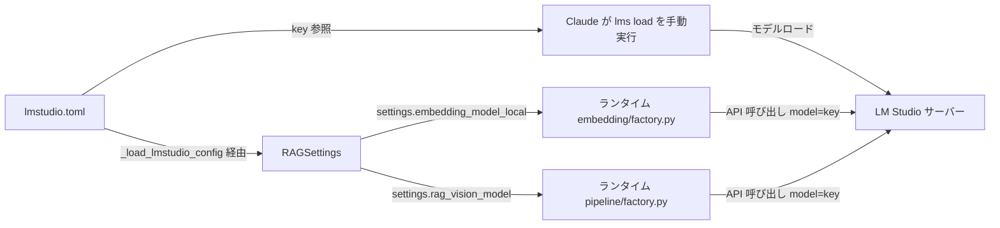

# LM Studio CLI リファレンス

## 概要

LM Studio を Claude 主導で運用するための CLI リファレンス。`lms` CLI コマンド、API 経由の推論パラメータと `config.toml` の対応、ハードウェアサーベイの取得方法を集約する。

セットアップ・運用フロー（読者: ユーザー＋Claude）は [lmstudio-operation.md](lmstudio-operation.md) を参照。

## 背景

「外部 API 以外の Fake モードは責務的にスコープ外」という方針が確定し、Embedding と Vision (MediaAnalyzer) を実 LM Studio 経由で運用することになった。これに伴い、Claude が LM Studio のライフサイクルを CLI 経由で管理するための仕様参照を集約する必要が生じた。

ロードパラメータ（`context_length` / `gpu_offload` / `ttl_seconds` / `parallel` 等）は LM Studio 側の per-model preset に委譲する方針のため、本リファレンスでは推奨値表を持たない。`lms load` の引数は最小（key のみ）で運用する。

## 制約

- 本リファレンスは **読者 = Claude** を前提とした仕様参照。実運用の手順は [lmstudio-operation.md](lmstudio-operation.md) に分離する
- ロード時パラメータの推奨値表は記載しない（LM Studio per-model preset への委譲方針のため）
- `lmstudio.toml` ↔ `lms` 引数の対応表は記載しない（`lmstudio.toml` は key のみ保持し、`lms load` には key だけを渡すため）
- 本リファレンスに記載する CLI コマンドは LM Studio 公式の CLI（`lms`）の挙動を反映する。LM Studio 側のバージョン更新により挙動が変わる可能性がある

## インターフェース

### `lms` CLI 主要コマンド

| コマンド | 用途 | 基本構文 |
|---|---|---|
| `lms server start` | LM Studio サーバーを起動する | `lms server start` |
| `lms server stop` | LM Studio サーバーを停止する | `lms server stop` |
| `lms server status` | サーバーの起動状態を確認する | `lms server status` |
| `lms ls` | ローカルにダウンロード済みのモデル一覧を表示する | `lms ls` |
| `lms ps` | 現在ロード中のモデル一覧を表示する | `lms ps` |
| `lms load` | モデルをロードする。追加パラメータなしで `lms load <key>` を実行した場合、per-model preset に従う | `lms load <key>` |
| `lms unload` | モデルを unload する | `lms unload <key>` または `lms unload --all` |
| `lms get` | モデルをダウンロードする | `lms get <repo>` |
| `lms runtime survey` | ハードウェア・利用可能ランタイムを調査する | `lms runtime survey` |

### API 経由の推論パラメータと設定ファイルの対応

LM Studio が公開する OpenAI 互換 API（`{LMSTUDIO_BASE_URL}/v1/...`）への呼び出し時に、
本プロジェクトでは下表の通り `lmstudio.toml` および `config.toml` の値をリクエストパラメータとして渡す。

| API パラメータ | 設定値の出所 | 備考 |
|---|---|---|
| `model`（Embedding） | `lmstudio.toml` の `models.embedding.key` | — |
| `model`（Vision） | `lmstudio.toml` の `models.vision.key` | — |
| `max_tokens`（Vision） | `config.toml` の `rag_vision_max_tokens` | Vision API レスポンスの上限トークン数 |
| `reasoning_effort`（Vision） | `config.toml` の `rag_vision_reasoning_effort` | 推論深度（`none` / `low` / `medium` / `high`） |
| `timeout`（Vision クライアント側） | `config.toml` の `rag_vision_api_timeout` | リクエストタイムアウト秒 |

### ハードウェアサーベイの取得方法

`lms runtime survey` で以下を取得できる:

- 検出された GPU の一覧（VRAM・ドライババージョン）
- 利用可能なランタイム（CUDA / CPU 等）
- 各ランタイムの対応モデル形式

per-model preset 設定時の `gpu_offload` 値や、同時ロード可能なモデルの判断材料として使用する。

## コンポーネント構成

`lmstudio.toml` がモデル key の SSoT。Claude は `lms load` 実行時に `lmstudio.toml` を参照する。
ランタイム（`src/rag/embedding/factory.py` / `src/rag/pipeline/factory.py`）も同じ key を `_load_lmstudio_config` 経由で読み込み、`RAGSettings` のフィールド（`embedding_model_local` / `rag_vision_model`）として API 呼び出しに使用する。

## 外部連携

- **LM Studio サーバー**: OpenAI 互換 API（`{LMSTUDIO_BASE_URL}/v1/...`）。`LMSTUDIO_BASE_URL` は `.env` 管理（環境依存値）
- **`lms` CLI**: LM Studio 公式 CLI。Claude が手動実行で使用する

## エッジケース

| 状況 | 振る舞い |
|---|---|
| `lmstudio.toml` が存在しない | `_load_lmstudio_config` が `FileNotFoundError`（fail-fast） |
| `lmstudio.toml` の `models.embedding.key` または `models.vision.key` が未設定 | `_load_lmstudio_config` が `ValueError`（fail-fast） |
| `key` が空文字列 | `RAGSettings` の `Field(min_length=1)` でバリデーション失敗（fail-fast） |
| `key` が文字列以外 | `_load_lmstudio_config` が `ValueError`（fail-fast） |
| LM Studio サーバーが停止中（Embedding） | API 呼び出しで `httpx.ConnectError` を送出 |
| LM Studio サーバーが停止中 / Vision モデル未ロード（Vision） | メディア解析モジュールでスキップ＋警告ログ。詳細は [media-analysis.md](media-analysis.md) のエッジケース参照 |
| 指定 key のモデルが未ダウンロード | `lms load` がエラー終了。モデルダウンロードはユーザー責務（[lmstudio-operation.md](lmstudio-operation.md) の責務分担表参照） |
| 指定 key のモデルが未ロード（Embedding API 呼び出し時） | 本プロジェクトは事前 `lms load` 必須。未ロード状態で API を叩いた場合の挙動は LM Studio 側に依存し、保証しない |

## 関連ドキュメント

- [lmstudio-operation.md](lmstudio-operation.md) — LM Studio セットアップ・運用手順書
- [docs/specs/infrastructure/media-analysis.md](media-analysis.md) — メディア解析（Vision モデル）
- [docs/specs/indexer.md](../indexer.md) — インデクサー（Embedding）
- [LM Studio 公式ドキュメント](https://lmstudio.ai/docs)
