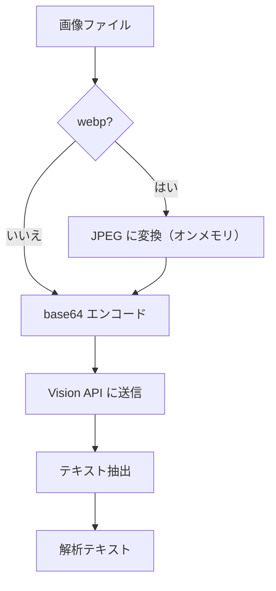
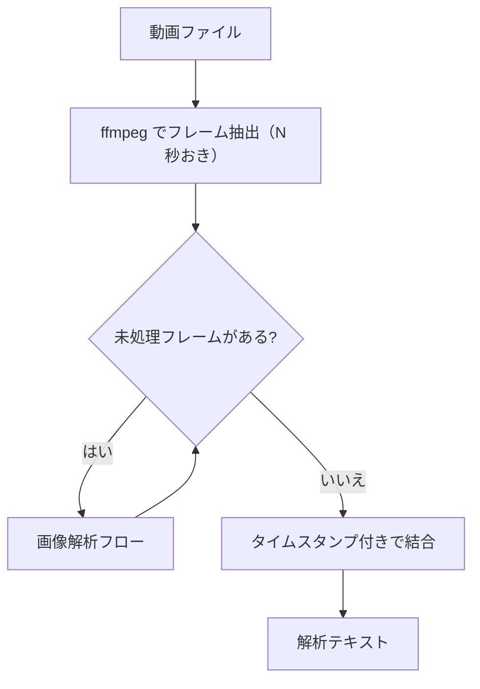

# メディア解析

## 概要

画像・動画をテキストに変換する共通モジュール。コンバーターから呼び出され、LM Studio 上の Vision モデル（Gemma 4 等）を使用してメディアの内容をテキスト化する。

スコープ:

- 画像のテキスト変換（Vision モデルによる内容要約）
- 動画のテキスト変換（フレーム抽出 + 各フレームの Vision モデル解析）
- LM Studio OpenAI 互換 API 経由の Vision モデル呼び出し

スコープ外:

- メディアファイルの取得・保存（インジェスターの範疇）
- テキスト化結果のチャンキング・インデックス構築（インデクサーの範疇）
- 音声文字起こし（将来拡張として検討中、現時点ではスコープ外）

## 背景

- RAG ナレッジベースに蓄積するデータは従来テキストのみであったが、BlueSky 投稿の画像・動画やローカルドキュメントの画像など、テキスト以外のメディアにも検索対象として有用な情報が含まれる
- LM Studio 上の Vision 対応モデル（Gemma 4 等）を活用することで、ローカル環境で画像・動画の内容をテキスト化し、RAG 検索の対象に含められる
- メディア→テキスト変換を共通モジュールとして切り出すことで、BlueSky・Local 等の source_type を問わず統一的にメディアを処理できる

## 制約

- **LM Studio 依存**: Vision モデルの推論は LM Studio の OpenAI 互換 API に依存する。LM Studio が停止している場合、メディア解析をスキップしテキストのみで処理を続行する（ログ警告を出力）
- **ffmpeg 依存**: 動画のフレーム抽出に ffmpeg を使用する。ffmpeg が未インストールの場合、動画解析をスキップする（ログ警告を出力）
- **画像フォーマット制限**: LM Studio の OpenAI 互換 API は webp 形式を直接受け付けない。webp 画像はオンメモリで JPEG に変換してから API に送信する
- **Embedding API との接続先共用**: Vision モデルの API エンドポイントは Embedding と同じ `LMSTUDIO_BASE_URL` を使用する。Vision モデルと Embedding モデルは LM Studio 上で同時にロードされている前提とする
- **処理の直列実行**: 1 画像ずつ Vision API に送信し、レスポンスを待ってから次の画像を処理する。並列リクエストは行わない（ローカル GPU リソースの競合を回避）

## 想定プロファイル

### 画像解析

| 項目 | 内容 |
|------|------|
| 最悪ケースリクエスト数 | 画像枚数 x 1 リクエスト（BlueSky 投稿: 最大 4 枚/投稿） |
| 想定エラー率 | ローカル API のためネットワークエラーは低い。モデルのメモリ不足でエラーとなる可能性がある |

### 動画解析

| 項目 | 内容 |
|------|------|
| 最悪ケースリクエスト数 | ceil(動画秒数 / `rag_vision_frame_interval`) x 1 リクエスト |
| 想定エラー率 | 画像解析と同等。加えて ffmpeg のフレーム抽出エラーの可能性がある |

## インターフェース

### 解析操作

| 操作 | 入力 | 出力 | 振る舞い |
|------|------|------|---------|
| 画像解析 | 画像ファイルパス | 解析テキスト | 画像を Vision モデルで解析し、内容を要約したテキストを返す |
| 動画解析 | 動画ファイルパス | 解析テキスト | 動画からフレームを抽出し、各フレームを Vision モデルで解析して結合テキストを返す |
| 利用可能チェック | なし | 真偽値 | LM Studio の Vision モデルが利用可能かを返す |

### 設定項目

| 設定項目 | 層 | 設計意図 |
|---------|-----|---------|
| `rag_vision_model` | 共通設定値 | Vision モデルの識別子。LM Studio にロードするモデルを指定する |
| `rag_vision_reasoning_effort` | 共通設定値 | Vision API の reasoning_effort パラメータ。推論の深度を制御し、処理速度と品質のバランスを調整する |
| `rag_vision_frame_interval` | 共通設定値 | 動画フレーム抽出の間隔（秒）。抽出頻度を制御し、処理時間とカバレッジのバランスを調整する |
| `rag_vision_max_tokens` | 共通設定値 | Vision API レスポンスの最大トークン数。出力長を制限する |

`LMSTUDIO_BASE_URL` は環境依存値（`.env`）で管理。Embedding と共用する。

## コンポーネント構成

### 画像解析フロー

1. 画像ファイルを読み込む
2. ファイル形式を判定する
3. webp の場合、オンメモリで JPEG に変換する（Pillow 使用）
4. 画像データを base64 エンコードする
5. OpenAI 互換 API（`/v1/chat/completions`）に画像を送信し、Vision モデルで解析する
6. レスポンスからテキストを抽出して返す



### 動画解析フロー

1. ffmpeg で動画からフレームを抽出する（N 秒おき）
2. 各フレーム画像に対して画像解析フローを実行する
3. 各フレームの解析テキストをタイムスタンプ付きで結合する
4. 結合テキストを返す



### フレーム抽出テキストの構造

動画解析の出力テキストは、各フレームの解析結果をタイムスタンプ付きで連結する:

```
[0:00] フレーム 1 の解析テキスト
[0:05] フレーム 2 の解析テキスト
[0:10] フレーム 3 の解析テキスト
```

## 外部連携

### LM Studio（OpenAI 互換 API）

| 連携先 | 用途 | 接続方式 |
|--------|------|---------|
| LM Studio | 画像・動画フレームの Vision 解析 | OpenAI 互換 API（`/chat/completions`） |

`LMSTUDIO_BASE_URL` は `/v1` を含む正準形（例: `http://localhost:1234/v1`）を前提とする。

API リクエスト形式:

| パラメータ | 値 |
|-----------|-----|
| エンドポイント | `{LMSTUDIO_BASE_URL}/chat/completions` |
| メソッド | POST |
| `model` | `rag_vision_model` で指定 |
| `messages` | `role: "user"`, `content` に画像データ（base64）とプロンプトを含む |
| `max_tokens` | `rag_vision_max_tokens` で指定 |
| `reasoning_effort` | `rag_vision_reasoning_effort` で指定 |

### ffmpeg

| 連携先 | 用途 | 接続方式 |
|--------|------|---------|
| ffmpeg | 動画からのフレーム抽出 | subprocess 呼び出し |

フレーム抽出コマンドの概要:

- 入力: 動画ファイルパス
- 出力: 一時ディレクトリに JPEG フレーム画像を出力
- 抽出間隔: `rag_vision_frame_interval` で設定（`fps=1/N`）

## エッジケース

| ケース | 振る舞い |
|--------|---------|
| LM Studio が停止中 | メディア解析をスキップし、ログ警告を出力する。コンバーターはテキストのみで処理を続行する |
| ffmpeg が未インストール | 動画解析をスキップし、ログ警告を出力する。画像解析は影響を受けない |
| 破損した画像ファイル | Pillow で読み込みエラーが発生した場合、当該画像の解析をスキップしログ警告を出力する |
| 破損した動画ファイル | ffmpeg がフレーム抽出に失敗した場合、当該動画の解析をスキップしログ警告を出力する |
| 0 バイトのメディアファイル | 解析をスキップし、ログ警告を出力する |
| Vision モデルのレスポンスが空 | 当該メディアの解析テキストを空文字列として扱い、ログ警告を出力する |
| Vision モデルのメモリ不足（OOM） | API エラーとして処理し、当該メディアの解析をスキップする |
| フレーム抽出結果が 0 枚 | 動画の解析テキストを空文字列として扱い、ログ警告を出力する |
| webp → JPEG 変換失敗 | 当該画像の解析をスキップし、ログ警告を出力する |

## 関連ドキュメント

- [../converter.md](../converter.md) — コンバーター仕様（メディア解析モジュールの呼び出し元）
- [../ingesters/bluesky.md](../ingesters/bluesky.md) — BlueSky インジェスター仕様（メディアファイルの取得・保存）
- [../ingesters/local.md](../ingesters/local.md) — ドキュメントインジェスター仕様（ローカルメディアの取り込み）
