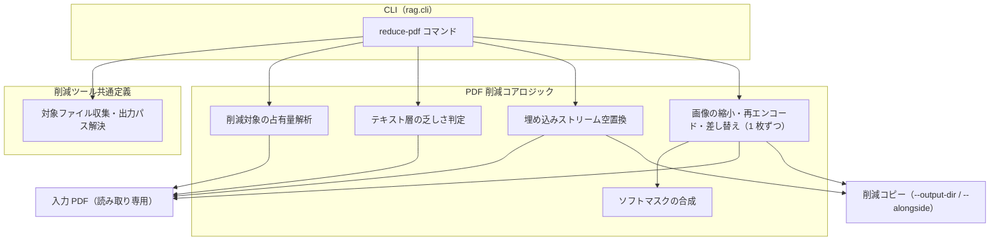

# PDF メディア削減ツール

## 概要

PDF から削減対象（高解像度画像・埋め込みファイルストリーム）の実体を除去・圧縮した軽量コピーを生成する CLI ツール。source_store への配置**前**にユーザーが実行する事前処理であり、取り込みパイプライン（インジェスター・コンバーター・インデクサー）の外側に位置する独立ユーティリティである。
[pptx メディア削減ツール](pptx-media-reduction.md) の PDF 版として同じ運用位置に立つ。

2 つの機能を提供する:

- **削減対象の抽出（レポート）**: 対象ファイルの削減対象の占有量を一覧表示し、削減の要否判断を支援する
- **削減（軽量コピー生成）**: 画像を再圧縮し、埋め込みファイルストリームの実体を空に置換した軽量コピーを別ファイルとして生成する（出力先ディレクトリ指定、または原本と同じフォルダへの別名出力）

スコープ外:

- source_store 配置後のファイルの削減（配置前の事前処理専用）
- PDF からのテキスト抽出（コンバーターの範疇。[../converter.md](../converter.md) 参照）
- 埋め込みフォントの除去（PDF ではテキストの表示・抽出に必要なため対象としない）

## 背景

発表資料の PDF には、元データが縮小されないまま埋め込まれた高解像度画像や、埋め込み動画により数百 MB 級になるファイルが存在する。source_store は git 管理されるため、巨大ファイルをそのまま配置すると push が拒否される（ホスティングサービスのファイルサイズ上限）ほか、git 履歴に恒久的に残り除去には history rewrite が必要になる。

一方、取り込みパイプラインは「オリジナルデータの無加工保存」原則（[../ingesters/common.md](../ingesters/common.md)）を維持すべきであり、配置時にインジェスターがデータを加工する構造は採らない。
このため、削減は source_store 配置前のユーザー操作として分離し、削減済みファイルを「オリジナル」として配置する運用とする。この責務分離は pptx メディア削減ツールと共通である。

## 制約

- **非破壊**: 入力ファイルは読み取り専用で開き、一切変更しない。削減結果は別ファイルとして出力する。in-place 上書きモードは設けない
- **出力先の既存ファイルを上書きしない**: 出力先に同名ファイルが存在する場合は該当ファイルをスキップし、警告を表示して残りの処理を続行する
- **削減対象の定義**: 埋め込みファイルストリーム（`/Type /Filespec` の `/EF` が参照するストリーム）と画像。前者には埋め込み動画（RichMedia アノテーションが参照するアセット）と添付ファイルの双方が含まれる。いずれもテキスト抽出の入力にならない
- **埋め込みファイルストリームは実体置換（エントリ削除ではない）**: ストリームオブジェクト自体は残し、実体を空に置換する。参照構造が壊れないため、削減後も正当な PDF として開ける（動画の再生・添付の取り出しはできなくなる）
- **画像は再圧縮であり除去ではない**: 実効解像度が閾値を超える画像は目標解像度へ縮小し、指定品質で再エンコードする。閾値以下の画像も再エンコードは試みる（可逆圧縮のまま埋め込まれた画像は縮小せずとも大きく縮むため）。再エンコード結果が元より大きい場合は元の画像を残す。画像は残るが画質は劣化する
- **画像は 1 枚ずつ差し替える**: PDF ライブラリが提供する一括再圧縮機能は使用しない。同一入力でも非決定的にプロセスごとクラッシュする既知の上流不具合があり、クラッシュしなかった実行でも誤った値を参照している可能性があるため、結果を信頼できない。画像単位の取り出し・縮小・差し替えを自前で行い、1 枚の失敗が処理全体を止めない構造とする
- **透過の保持**: PDF では透過情報が本体とは別のソフトマスク画像として格納される。本体だけを差し替えるとマスクへの参照が失われ、透過部分が不透明になって表示が崩れるため、マスクを合成してから 1 枚の画像として書き出す。透過を持つ画像は可逆形式で出力する。全面不透明なマスクは表示に影響しないため合成しない
- **差し替えに対応しない画像の除外**: `/ColorSpace` を持たない画像（ステンシルマスク・JBIG2 等）は差し替えるとエラーを出さずに表示が崩れるため、対象から除外して元のまま残す
- **テキスト内容の保持**: 削減前後でテキスト抽出の内容は保持される。ただし画像の有無・寸法が抽出器のレイアウト解析に影響するため、生成される Markdown の**整形**（見出し判定・行の結合位置・画像プレースホルダの出現）は変化しうる。バイト単位の同一性は保証しない
- **テキスト層の乏しい PDF の既定除外**: スキャン文書のようにページ画像自体がテキスト抽出（OCR）の入力になる PDF は、画像縮小が抽出品質を劣化させるため既定で削減対象から除外する。明示指定により削減できる
- **サイズ増加の回避**: 削減対象が少ない PDF でも、構造再構築によって出力が元より大きくならないようオブジェクトストリーム形式で保存する
- **外部通信なし**: ローカルファイル処理のみで完結する

## インターフェース

### CLI コマンド

| コマンド | 引数 | 振る舞い |
|---------|------|---------|
| `reduce-pdf` | `paths`（1 個以上。ファイルまたはディレクトリ）、`--output-dir` / `--alongside`（削減実行時にいずれか必須・排他）、`--report-only`（任意）、削減強度オプション（任意）、`--include-scanned`（任意） | 対象 PDF の削減対象の占有量レポートを表示し、`--report-only` でなければ軽量コピーを生成する |

パラメータ:

| パラメータ | 型 | 必須 | 説明 |
|-----------|-----|------|------|
| `paths` | 文字列（複数可） | はい | 対象ファイルまたはディレクトリのパス。ディレクトリ指定時は配下の `.pdf` を再帰的に収集する。`.reduced` サフィックス付きファイル（本ツールの出力物）は収集から除外する |
| `--output-dir` | 文字列 | 削減実行時（`--alongside` 未指定時） | 削減コピーの出力先ディレクトリ（フラット配置。ファイル名のみで出力するためディレクトリ間の同名ファイルは衝突する）。存在しない場合は作成する。`--alongside` と排他 |
| `--alongside` | フラグ | 削減実行時（`--output-dir` 未指定時） | 原本と同じフォルダに `<元名>.reduced.pdf` の別名で出力する。原本のフォルダ構造をそのまま持ち出す運用向け。ディレクトリ構造上の衝突は発生しない。`--output-dir` と排他 |
| `--report-only` | フラグ | いいえ | レポート表示のみで削減コピーを生成しない |
| `--dpi-threshold` | 整数 | いいえ | この実効解像度（DPI）を超える画像を縮小対象とする |
| `--dpi-target` | 整数 | いいえ | 縮小後の目標解像度（DPI） |
| `--quality` | 整数 | いいえ | 再エンコード時の JPEG 品質 |
| `--include-scanned` | フラグ | いいえ | テキスト層の乏しい PDF も削減対象に含める（既定では除外する） |

削減強度の既定値は削減モジュールのコード定義を SSoT とする（仕様書に転記しない）。既定値は、発表資料の表示に十分な解像度を保ちつつ、元データのまま埋め込まれた画像を縮小できる水準に置く。

### レポート出力

ファイルごとに以下を表示する:

- ファイルパス・全体サイズ・ページ数
- 画像の件数・現在の占有量・形式別内訳
- そのうち解像度閾値を超えるものの件数・占有量（縮小対象の規模）
- 埋め込みファイルストリームの件数・占有量
- 削減対象の合計サイズ
- テキスト層が乏しい場合はその注意表示

削減**後**のサイズは予測しない。画像の圧縮率は内容に依存し、PDF 構造の再構築でもサイズが変動するため、予測値は実測と乖離して判断を誤らせる。

### 削減結果出力

ファイルごとに削減前サイズ → 削減後サイズを表示し、末尾に処理サマリー（生成数・スキップ数・エラー数）を表示する。

### 終了コード

成果が 1 件もなくエラーが発生している場合（削減時: 生成 0 件かつエラーあり / レポートのみ時: レポート成功 0 件かつエラーあり）は非 0 で終了する。それ以外は 0 で終了する（一括処理系 CLI コマンドの慣例に合わせる）。

## コンポーネント構成

削減対象の解析・除去のコアロジックは PDF 専用モジュールが担い、CLI はそれをファイル出力向けに呼び出す薄い層である。対象ファイルの収集・出力パス解決・削減コピーの命名は pptx メディア削減ツールと共通の定義を用いる。

### 処理手順（削減）

1. `paths` から対象ファイルを収集する（ディレクトリは再帰走査し `.pdf` をフィルタ。`.reduced` サフィックス付きは除外）
2. 各ファイルについて削減対象の占有量を解析し、テキスト層の乏しさを判定してレポート表示する
3. `--report-only` の場合はここで終了する
4. テキスト層が乏しく `--include-scanned` が未指定の場合は、理由を表示してスキップする
5. 出力先パス（`--output-dir/<入力ファイル名>` または `--alongside` 時は `<原本と同じフォルダ>/<元名>.reduced.pdf`）が同一実行内で衝突する場合、または同名ファイルが既に存在する場合は警告してスキップする
6. 埋め込みファイルストリームの実体を空に置換する
7. 画像を 1 枚ずつ取り出し、透過を持つものはソフトマスクを合成したうえで、縮小・再エンコードして差し替える
8. 参照されなくなったオブジェクトの回収とコンテンツストリームの再構築を行って書き出す（これを省くと差し替えの残骸が残り、画像が縮んでもファイル全体が元より大きくなる）
9. 個別ファイルのエラー（壊れ PDF 等）は該当ファイルをスキップして続行し、サマリーに計上する

### テキスト層の乏しさ判定

先頭から等間隔にサンプリングしたページのテキスト量が 1 ページあたりの下限を下回る場合、テキスト層が乏しいと判定する。判定の観点は PDF テキスト抽出のバックエンド事前判定（[../converter.md](../converter.md)）と同じで、テキスト層を持たない PDF は OCR 経路で処理されるため画像が抽出品質に直結する。閾値はコード定義を SSoT とする。

## エッジケース

| ケース | 振る舞い |
|--------|---------|
| 対象ファイルが 0 件（ディレクトリ内に PDF がない） | 0 件処理として正常終了する |
| 0 バイトの PDF・壊れファイル・パスワード保護 | エラー計上し、スキップして続行する |
| 削減対象が存在しない PDF | レポートに削減対象 0 件と表示する。削減時は構造再構築のみのコピーを生成する |
| 指定ファイルの拡張子が PDF でない、または `.reduced` サフィックス付き | 警告してスキップする（エラーには計上しない）。ディレクトリ走査では黙って除外する |
| 出力先に同名ファイルが存在する | 警告してスキップする（上書きしない） |
| 異なるディレクトリ由来の同名ファイルで同一実行内の出力名が衝突する | 2 件目以降を警告してスキップする（1 件目の出力を保持する） |
| 入力パスが存在しない | 該当パスをエラー表示し、他のパスの処理を続行する |
| テキスト層が乏しい PDF | 既定ではスキップし、理由を表示する。`--include-scanned` 指定時は削減する |
| 個別の画像の取り出し・再圧縮・差し替えに失敗した | その画像は元のまま残し、他の画像の処理を続行する |
| 透過画像のソフトマスクを取り出せない | 透過を保証できないため、その画像は差し替えず元のまま残す |
| `/ColorSpace` を持たない画像（ステンシルマスク・JBIG2 等） | 差し替え対象から除外し、元のまま残す |
| `--output-dir` が入力ファイルと同一ディレクトリ | 同名出力になる場合はスキップ制約（上書きしない）により入力が保護される |

## 関連ドキュメント

- [pptx-media-reduction.md](pptx-media-reduction.md) — pptx メディア削減ツール（同じ運用位置に立つ前例。対象収集・出力パス解決の定義を共有）
- [../converter.md](../converter.md) — PDF テキスト抽出（削減が抽出内容に影響しない根拠、テキスト層判定の観点）
- [../ingesters/local.md](../ingesters/local.md) — ドキュメントインジェスター（削減済みファイルの取り込み先）
- [../ingesters/common.md](../ingesters/common.md) — 無加工保存原則（本ツールを配置前処理として分離する根拠）
- [../source-store.md](../source-store.md) — 配置先の仕様
