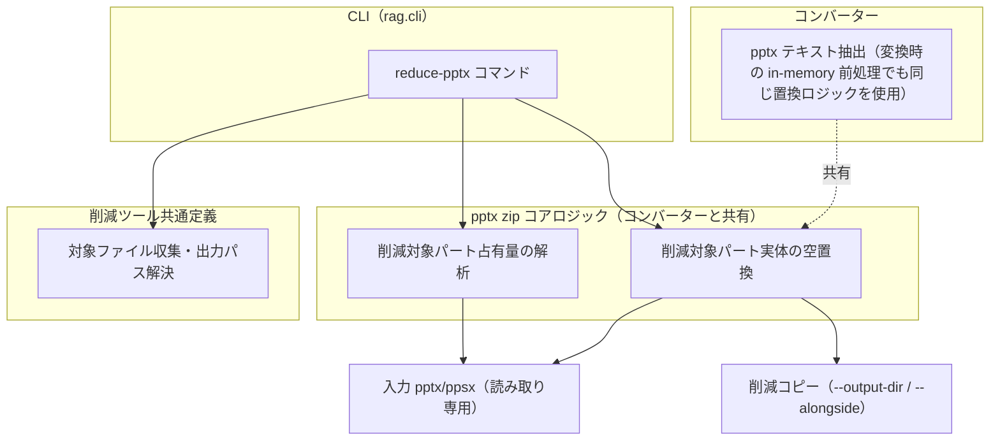

# pptx メディア削減ツール

## 概要

PowerPoint ファイル（`.pptx` / `.ppsx`）から削減対象パート（埋め込みメディア（動画・画像等）・埋め込みオブジェクト（OLE）・埋め込みフォント）の実体データを除去した軽量コピーを生成する CLI ツール。source_store への配置**前**にユーザーが実行する事前処理であり、取り込みパイプライン（インジェスター・コンバーター・インデクサー）の外側に位置する独立ユーティリティである。

2 つの機能を提供する:

- **削減対象の抽出（レポート）**: 対象ファイルの削減対象パートの占有量を一覧表示し、削減の要否判断を支援する
- **削減（除去コピー生成）**: 削減対象パートの実体を空データに置換した軽量コピーを別ファイルとして生成する（出力先ディレクトリ指定、または原本と同じフォルダへの別名出力）

スコープ外:

- source_store 配置後のファイルの削減（配置前の事前処理専用）
- pptx からのテキスト抽出（コンバーターの範疇。[../converter.md](../converter.md) 参照）
- `.ppt`（旧バイナリ形式）の削減

## 背景

pptx には動画埋め込みにより数百 MB〜GB 級になるファイルが存在し、ファイルサイズの大半をメディア実体が占める一方、テキスト XML はごく小さい。source_store は git 管理されるため、巨大ファイルをそのまま配置すると git 履歴に恒久的に残り、除去には history rewrite が必要になる。

一方、取り込みパイプラインは「オリジナルデータの無加工保存」原則（[../ingesters/common.md](../ingesters/common.md)）を維持すべきであり、配置時にインジェスターがデータを加工する構造は採らない。このため、削減は source_store 配置前のユーザー操作として分離し、削減済みファイルを「オリジナル」として配置する運用とする。

## 制約

- **非破壊**: 入力ファイルは読み取り専用で開き、一切変更しない。削減結果は別ファイルとして出力する。in-place 上書きモードは設けない
- **出力先の既存ファイルを上書きしない**: 出力先に同名ファイルが存在する場合は該当ファイルをスキップし、警告を表示して残りの処理を続行する
- **削減対象パートの定義**: `ppt/media/*`（メディア実体）・`ppt/embeddings/*`（埋め込み OLE オブジェクト）・`ppt/fonts/*`（埋め込みフォント）。いずれもテキスト抽出には使われないパートであり、削減してもコンバーターの抽出結果に影響しない
- **テキスト構造の完全保持**: 削減対象パート以外の zip エントリ（スライド XML・ノート XML・リレーション・content-type 等）は、エントリの内容（非圧縮データ）を同一に保持する（zip 圧縮バイト列レベルの同一性までは保証しない）。削減前後でコンバーターのテキスト抽出結果は同一になる
- **削減対象パートは実体置換（エントリ削除ではない）**: zip エントリ自体は残し、実体データを空（0 バイト）に置換する。リレーションの参照先が消えないため、削減後も正当な pptx として PowerPoint・変換処理の双方で開ける（メディア箇所の表示・埋め込みオブジェクトの実体・フォントの表示再現性は失われる）
- **ストリーミング処理**: GB 級入力でも削減対象パートの実体をメモリに読み込まない（zip エントリ単位の選択読み出し）
- **形式の維持**: `.ppsx` は `.ppsx` のまま出力する（content-type の変換はコンバーターの責務であり、本ツールはサイズ削減のみを担う）
- **外部通信なし**: ローカルファイル処理のみで完結する

## インターフェース

### CLI コマンド

| コマンド | 引数 | 振る舞い |
|---------|------|---------|
| `reduce-pptx` | `paths`（1 個以上。ファイルまたはディレクトリ）、`--output-dir` / `--alongside`（削減実行時にいずれか必須・排他）、`--report-only`（任意） | 対象 pptx/ppsx の削減対象パート占有量レポートを表示し、`--report-only` でなければ除去コピーを生成する |

パラメータ:

| パラメータ | 型 | 必須 | 説明 |
|-----------|-----|------|------|
| `paths` | 文字列（複数可） | はい | 対象ファイルまたはディレクトリのパス。ディレクトリ指定時は直下と配下の `.pptx` / `.ppsx` を再帰的に収集する。`.reduced` サフィックス付きファイル（本ツールの出力物）は収集から除外する |
| `--output-dir` | 文字列 | 削減実行時（`--alongside` 未指定時） | 削減コピーの出力先ディレクトリ（フラット配置。ファイル名のみで出力するためディレクトリ間の同名ファイルは衝突する）。存在しない場合は作成する。`--alongside` と排他 |
| `--alongside` | フラグ | 削減実行時（`--output-dir` 未指定時） | 原本と同じフォルダに `<元名>.reduced.<拡張子>` の別名で出力する。原本のフォルダ構造をそのまま持ち出す運用向け。ディレクトリ構造上の衝突は発生しない。`--output-dir` と排他 |
| `--report-only` | フラグ | いいえ | レポート表示のみで削減コピーを生成しない（削減対象の抽出のみを行う） |

### レポート出力

ファイルごとに以下を表示する:

- ファイルパス・全体サイズ
- 削減対象パート数・合計サイズ（zip 内圧縮後占有量）・種別内訳（拡張子別）
- 削減後の推定サイズ

### 削減結果出力

ファイルごとに削減前サイズ → 削減後サイズを表示し、末尾に処理サマリー（処理数・スキップ数・エラー数）を表示する。

### 終了コード

成果が 1 件もなくエラーが発生している場合（削減時: 生成 0 件かつエラーあり / レポートのみ時: レポート成功 0 件かつエラーあり）は非 0 で終了する。それ以外は 0 で終了する（一括処理系 CLI コマンドの慣例に合わせる）。

## コンポーネント構成

zip 解析・メディア置換のコアロジックはコンバーターの pptx テキスト抽出（[../converter.md](../converter.md)）と共有する。本ツールはコアロジックをファイル出力向けに呼び出す薄い CLI 層である。

対象ファイルの収集・出力パスの解決・削減コピーの命名は、[PDF メディア削減ツール](pdf-media-reduction.md) と共通の定義を用いる。両ツールは同じ運用位置（source_store 配置前の事前処理）に立ち、同じ CLI インターフェースを提供するため、形式に依存しない部分を共有して振る舞いのずれを防ぐ。

### 処理手順（削減）

1. `paths` から対象ファイルを収集する（ディレクトリは再帰走査し `.pptx` / `.ppsx` をフィルタ。`.reduced` サフィックス付きは除外）
2. 各ファイルについて zip セントラルディレクトリを読み、削減対象パートの占有量を解析してレポート表示する
3. `--report-only` の場合はここで終了する
4. 出力先パス（`--output-dir/<入力ファイル名>` または `--alongside` 時は `<原本と同じフォルダ>/<元名>.reduced.<拡張子>`）が同一実行内で衝突する場合、または同名ファイルが既に存在する場合は警告してスキップする
5. zip エントリを順にコピーし、削減対象パートのみ実体を空データに置換した削減コピーを出力する
6. 個別ファイルのエラー（壊れ zip 等）は該当ファイルをスキップして続行し、サマリーに計上する

## エッジケース

| ケース | 振る舞い |
|--------|---------|
| 対象ファイルが 0 件（ディレクトリ内に pptx/ppsx がない） | 0 件処理として正常終了する |
| 0 バイトの pptx | 壊れ zip としてエラー計上し、スキップして続行する |
| zip として開けない（壊れファイル・パスワード保護） | エラー計上し、スキップして続行する |
| 削減対象パートが存在しない pptx | レポートに削減対象 0 件と表示する。削減時は実質同一内容のコピーを生成する |
| 指定ファイルの拡張子が pptx/ppsx でない、または `.reduced` サフィックス付き | 警告してスキップする（エラーには計上しない）。ディレクトリ走査では黙って除外する |
| 出力先に同名ファイルが存在する | 警告してスキップする（上書きしない） |
| 異なるディレクトリ由来の同名ファイルで同一実行内の出力名が衝突する | 2 件目以降を警告してスキップする（1 件目の出力を保持する） |
| 入力パスが存在しない | 該当パスをエラー表示し、他のパスの処理を続行する |
| `--output-dir` が入力ファイルと同一ディレクトリ | 同名出力になる場合はスキップ制約（上書きしない）により入力が保護される |

## 関連ドキュメント

- [../converter.md](../converter.md) — pptx テキスト抽出（zip コアロジックの共有先）
- [../ingesters/local.md](../ingesters/local.md) — Local インジェスター（削減済みファイルの取り込み先）
- [../ingesters/common.md](../ingesters/common.md) — 無加工保存原則（本ツールを配置前処理として分離する根拠）
