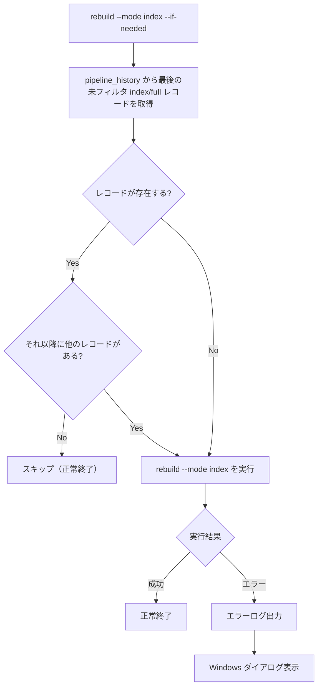

# 定期 index rebuild

## 概要

HNSW インデックスの品質劣化対策として、前回の index rebuild 以降に更新があった場合にのみ `rebuild --mode index` を自動実行する仕組みを提供する。

スコープ:

- `rebuild` コマンドの `--if-needed` オプション（条件付き実行）
- `pipeline_history` テーブルへの `mode` / `filter_source_type` / `filter_path` 列追加（rebuild モードと filter スコープの識別）
- エラー時の Windows ダイアログ通知
- Windows タスクスケジューラによる定期実行のセットアップ手順

スコープ外:

- rebuild の実行ロジック自体（パイプライン制御の範疇）
- MCP/CLI の rebuild インターフェース定義（rebuild-stats.md の範疇）
- HNSW インデックスの劣化メカニズム（Issue #443 で対応済み）

## 背景

逐次 upsert により HNSW グラフの接続品質が劣化し、ベクトル検索のリコールが低下する。パラメータ引き上げで軽減されるが、tombstone フラグメンテーションや到達不能ノードの問題はインデックス再構築でしかリセットできない。

HNSW グラフの劣化はインデックス側の問題であり、ソースファイルの再変換は不要。`rebuild --mode index` で converted_store からインデックスのみ再構築すれば十分。

手動での定期実行は運用負荷が高く忘れやすいため、タスクスケジューラによる自動化が必要。

## 制約

- **index モード限定**: 定期バッチで実行するのは `rebuild --mode index` のみ。full rebuild は手動実行とする
- **更新判定の基準**: `pipeline_history` を参照し、最後の **未フィルタの** `index` または `full` モードの実行（`filter_source_type = ''` かつ `filter_path = ''`）以降に新しい `pipeline_history` レコード（`incremental` や filter 付き rebuild 等）が存在するかで判定する。filter 付き rebuild は subset しか触っていないため判定基準には含めない（filter 付きを「全体 rebuild 完了」と誤認するとスキップ漏れが発生する）
- **スキップ時の挙動**: 更新がない場合は rebuild を実行せず、正常終了する（exit code 0）
- **排他制御**: 既存の rebuild ロック機構を使用する。ロック取得失敗時はエラーとする
- **実行環境**: Windows 11 の開発マシンを前提とする

## インターフェース

### `--if-needed` オプション

既存の `rebuild` CLI コマンドに `--if-needed` フラグを追加する。

```
uv run python -m rag.cli rebuild --mode index --if-needed
```

| オプション | 型 | 必須 | 内容 |
|-----------|-----|------|------|
| `--if-needed` | flag | いいえ | 前回の index/full rebuild 以降に更新がなければスキップする |

振る舞い:

1. `pipeline_history` から最後の **未フィルタの** `index` または `full` モードのレコードを取得する（`filter_source_type = ''` かつ `filter_path = ''`）
2. そのレコードより後に他のレコード（`incremental` や filter 付き rebuild 等）が存在するか確認する
3. 存在すれば rebuild を実行、存在しなければスキップして正常終了する
4. 該当レコードが空の場合（初回 / 過去の rebuild がすべて filter 付き）は rebuild を実行する

`--if-needed` は `--mode` が `index` または `full` の場合のみ有効。それ以外のモードで指定された場合はパラメータ検証エラーとする。

`--if-needed` と filter（`--source-type` / `--path`）の併用はパラメータ検証エラーとする。Why: filter 付き rebuild は `pipeline_history` の filter 列に記録され、`needs_index_rebuild()` の判定対象から除外される。filter 付きで `--if-needed` を実行すると「filter スコープが古ければ rebuild される」と誤期待されやすく、実際は「未フィルタの index/full」が古ければ filter スコープで rebuild が走るという挙動の乖離が起きる。スケジューラ運用では未フィルタの `--if-needed` 実行と、アドホックな filter 付き手動 rebuild を分離して運用する。

### 所要時間の表示形式

rebuild コマンドの所要時間表示を秒単位から時分秒表記に変更する。

| 所要時間 | 表示例 |
|---------|--------|
| 60 秒未満 | `3.2 秒` |
| 60 秒以上 60 分未満 | `2 分 15.0 秒` |
| 60 分以上 | `1 時間 5 分 30.0 秒` |

JSON 出力の `elapsed` フィールドは秒単位（数値）を維持する（機械処理向け）。テキスト出力のみ時分秒表記に変更する。

### エラー通知

rebuild 実行中にエラーが発生した場合、ログ出力に加えて Windows ダイアログを表示する。

| 項目 | 内容 |
|------|------|
| 表示条件 | rebuild がエラーで終了した場合 |
| ダイアログタイトル | `RAG Knowledge - Rebuild Error` |
| ダイアログ内容 | エラーメッセージの要約 |
| ダイアログ種別 | エラーアイコン付きメッセージボックス |

ダイアログ表示は `--if-needed` 指定時のみ有効とする（対話的な手動実行ではターミナルで確認できるため不要）。

非 Windows 環境ではダイアログ表示をスキップし、ログ出力のみとする。

## コンポーネント構成

### `--if-needed` の判定フロー



### `pipeline_history` テーブルの `mode` / `filter_source_type` / `filter_path` 列

`pipeline_history` テーブルの `mode` 列（[source-store.md](../source-store.md) で定義済み）に加え、`filter_source_type` / `filter_path` 列で filter 付き rebuild のスコープを記録する。

マイグレーション:

- `mode` 列: `ALTER TABLE pipeline_history ADD COLUMN mode TEXT NOT NULL DEFAULT 'incremental'`。既存レコードは `incremental` として扱う（安全側に倒す: index rebuild が必要と判定される）
- `filter_source_type` 列: `ALTER TABLE pipeline_history ADD COLUMN filter_source_type TEXT NOT NULL DEFAULT ''`。既存レコードは未フィルタ扱い
- `filter_path` 列: `ALTER TABLE pipeline_history ADD COLUMN filter_path TEXT NOT NULL DEFAULT ''`。既存レコードは未フィルタ扱い

最後の **未フィルタの** index/full rebuild の取得:

```
SELECT id FROM pipeline_history
WHERE mode IN ('index', 'full')
  AND filter_source_type = ''
  AND filter_path = ''
ORDER BY id DESC LIMIT 1
```

それ以降のレコード存在確認:

```
SELECT EXISTS(
  SELECT 1 FROM pipeline_history
  WHERE id > :last_index_rebuild_id
)
```

### 関連ファイル

| ファイル | 変更内容 |
|---------|---------|
| `src/rag/cli.py` | `--if-needed` オプション追加、所要時間の時分秒表記、エラー時 Windows ダイアログ |
| `src/rag/store/metadata_db.py` | `pipeline_history` への `mode` / `filter_source_type` / `filter_path` 列追加、マイグレーション、判定クエリ |
| `src/rag/pipeline/controller.py` | `pipeline_history` 記録時に `mode` を渡す |

## タスクスケジューラ設定手順

Windows タスクスケジューラで深夜に定期実行する設定手順。

### 前提条件

- ChromaDB サーバーが稼働していること（MCP サーバーが enabled であれば自動起動済み）
- LM Studio が起動していること（Embedding API に必要）

### 登録手順

1. タスクスケジューラを開く（`taskschd.msc`）
2. 「タスクの作成」を選択
3. 以下の設定を行う:

| タブ | 設定項目 | 値 |
|------|---------|-----|
| 全般 | 名前 | `RAG Knowledge - Index Rebuild` |
| 全般 | ユーザーがログオンしているかどうかにかかわらず実行する | 有効 |
| トリガー | スケジュール | 毎日、開始時刻は深夜帯（例: 3:00） |
| 操作 | プログラム/スクリプト | プロジェクトの uv 実行パス |
| 操作 | 引数の追加 | `run python -m rag.cli rebuild --mode index --if-needed` |
| 操作 | 開始（オプション） | プロジェクトのルートディレクトリ |
| 設定 | タスクを停止するまでの時間 | 1 時間 |

### 確認方法

手動でタスクを実行し、以下を確認する:

- 更新がある場合: rebuild が実行され、所要時間が表示される
- 更新がない場合: スキップされ、正常終了する
- エラーの場合: ログ出力と Windows ダイアログが表示される

## エッジケース

| ケース | 振る舞い |
|--------|---------|
| `--if-needed` を `--mode incremental` と組み合わせた場合 | パラメータ検証エラーを返す |
| `--if-needed` を `--mode convert` と組み合わせた場合 | パラメータ検証エラーを返す |
| `pipeline_history` が空（初回実行）の場合 | rebuild を実行する |
| ChromaDB サーバーが停止している場合 | rebuild エラー → ログ出力 + Windows ダイアログ |
| LM Studio が停止している場合 | Embedding API エラー → ログ出力 + Windows ダイアログ |
| 別の rebuild が実行中の場合 | ロック取得失敗 → エラー |

## 関連ドキュメント

- [rebuild-stats.md](../rebuild-stats.md) — 再構築 MCP/CLI インターフェース
- [pipeline-controller.md](../pipeline-controller.md) — パイプライン制御仕様
- [source-store.md](../source-store.md) — source_store 仕様（`pipeline_history` テーブル定義）
