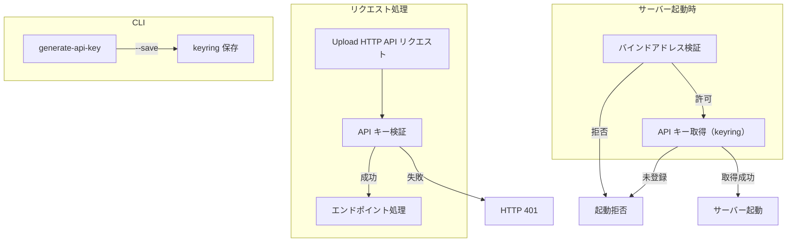

# Upload HTTP API 認証

## 概要

Upload HTTP API へのアクセスを API キーで認証し、不正なリクエストを拒否する。併せて、バインドアドレスに基づくサーバー起動制御により、API キーが平文で外部ネットワークに流出するリスクを防止する。

スコープ:

- API キーの生成・保管・検証
- API キー生成 CLI サブコマンド
- バインドアドレスに基づくサーバー起動制御
- キーローテーション（上書き更新）

スコープ外:

- HTTPS（TLS）対応（#449 で対応）
- Upload HTTP API のエンドポイント定義（[content-upload.md](content-upload.md) で定義）

## 背景

Upload HTTP API は `custom_route()` で HTTP エンドポイントを公開するため、認証なしではネットワーク上の任意のクライアントからアクセスできてしまう。API キーによる認証を導入し、正当なクライアントのみがアップロード操作を実行できるようにする。

## 制約

### API キー

- **キー登録必須**: HTTP モード（`RAG_TRANSPORT=http`）でのサーバー起動時に keyring から API キーを取得できない場合、サーバーの起動を拒否する。キー認証の無効化オプションは設けない
- **保管方式**: OS セキュアストレージ（keyring）に保管する。サービス名 `rag-knowledge`、キー名 `UPLOAD_API_KEY`
- **生成方式**: `secrets.token_urlsafe(32)` で生成する（256 bit エントロピー、43 文字程度、英数字 + `-` + `_`）
- **検証方式**: `X-API-Key` リクエストヘッダーの値と keyring に保管されたキーを `hmac.compare_digest` で定数時間比較する
- **エラーレスポンス**: 認証失敗時は HTTP 401 を返す。ヘッダー未指定・値不正を問わず同一のレスポンスメッセージとする。内部ログでは詳細（ヘッダー未指定 / 値不正）を出し分ける
- **stdio モードへの影響なし**: stdio モードでは Upload HTTP API のエンドポイント自体が存在しないため、API キー認証は動作しない

### バインドアドレス制約

API キーが平文で通信経路に流れることを防止する目的で、バインドアドレスに応じてサーバー起動を制御する。

| バインドアドレス | HTTPS なし | HTTPS あり |
|---|---|---|
| `127.0.0.1` / `localhost` | 許可 | 許可 |
| プライベートアドレス（RFC 1918: `10.0.0.0/8`、`172.16.0.0/12`、`192.168.0.0/16`） | 許可 | 許可 |
| `0.0.0.0` | 起動拒否 | 起動拒否 |
| 上記以外（パブリックアドレス） | 起動拒否 | 許可 |

- **`0.0.0.0` の拒否理由**: 全インターフェースでバインドするため、意図しない外部公開のリスクがある。LAN 内の他マシンからアクセスする場合は、具体的なプライベート IP アドレスを指定する
- **HTTPS 未実装の現状**: HTTPS（TLS）対応は #449 で実装予定。現時点ではパブリックアドレスでの運用は不可
- **stdio モードへの影響なし**: バインドアドレス検証は HTTP モードでのみ実行する

本コンポーネントは外部 API 通信を行わないため、想定プロファイル・安全制約テーブルは省略する。

## インターフェース

### 操作一覧

| 操作 | 種別 | 提供方式 | 概要 |
|------|------|---------|------|
| generate-api-key | 新規 | CLI サブコマンド | API キーの生成・表示・keyring への保存 |
| API キー検証 | 新規 | サーバー内部 | Upload HTTP API リクエストの認証 |
| バインドアドレス検証 | 新規 | サーバー内部 | HTTP モード起動時のアドレス検証 |

### CLI サブコマンド

#### generate-api-key

API キーを生成し、標準出力に表示する。`--save` オプションで keyring への保存も行う。

| 引数 | 短縮 | 必須 | 説明 |
|-----|------|------|------|
| `--save` | `-s` | いいえ | 生成したキーを keyring に保存する |
| `--force` | `-f` | いいえ | `--save` 時に既存キーがある場合、確認なしで上書きする |

出力（デフォルト: 表示のみ）:

- 生成したキーを標準出力に表示する
- 使い方の案内を表示する（`X-API-Key` ヘッダーへの設定方法、`--save` で keyring に保存できる旨）

出力（`--save` 指定時）:

- 生成したキーを標準出力に表示する
- keyring への保存完了メッセージを表示する
- 既存キーがある場合: 上書き確認を求める。`--force` 指定時は確認をスキップする

エラー:

- keyring へのアクセスに失敗した場合、エラーメッセージを表示して exit code 1 で終了する
- `--force` は `--save` なしでは無効（エラーにはしない、単に無視する）

### API キー検証

Upload HTTP API の全エンドポイント（`/upload/document`、`/upload/journal`）へのリクエストに対して、API キー認証を実行する。

検証フロー:

1. リクエストの `X-API-Key` ヘッダーを取得する
2. ヘッダーが未指定の場合: 内部ログに「API key header missing」を記録し、HTTP 401 を返す
3. keyring に保管されたキーと `hmac.compare_digest` で比較する
4. 不一致の場合: 内部ログに「Invalid API key」を記録し、HTTP 401 を返す
5. 一致の場合: 認証成功として処理を続行する

401 レスポンス形式:

```json
{"status": "error", "message": "Authentication required"}
```

### バインドアドレス検証

HTTP モードでのサーバー起動時に、バインドアドレスの安全性を検証する。

検証フロー:

1. `rag_http_host` の値を取得する
2. `0.0.0.0` の場合: エラーメッセージを出力して起動を拒否する
3. `127.0.0.1` または `localhost` の場合: 許可する
4. プライベートアドレス（RFC 1918）の場合: 許可する
5. 上記以外（パブリックアドレス）の場合: HTTPS が設定されていなければ起動を拒否する

### 設定項目

本仕様で新たに追加する設定項目はない。API キーは keyring で管理し、バインドアドレスは既存の `rag_http_host`（`.env`）を使用する。

## コンポーネント構成



### 関連ファイル

| ファイル | 役割 |
|---------|------|
| `src/rag/server.py` | API キー検証（`_check_api_key`）、バインドアドレス検証、サーバー起動制御 |
| `src/rag/cli.py` | `generate-api-key` サブコマンド |

## エッジケース

### API キー検証

| ケース | 振る舞い |
|--------|---------|
| `X-API-Key` ヘッダーが未指定 | HTTP 401 を返す。内部ログ: 「API key header missing」 |
| `X-API-Key` の値が不正 | HTTP 401 を返す。内部ログ: 「Invalid API key」 |
| keyring からキー取得に失敗（サーバー起動後に keyring が利用不可になった場合） | HTTP 500 を返す。内部ログにエラー詳細を記録する |

### CLI

| ケース | 振る舞い |
|--------|---------|
| `--save` で keyring アクセス失敗 | エラーメッセージを表示、exit code 1 |
| `--save` で既存キーあり、`--force` なし | 上書き確認プロンプトを表示。拒否した場合はキーを表示のみして終了 |
| `--save` で既存キーあり、`--force` あり | 確認なしで上書き |
| `--force` のみ（`--save` なし） | `--force` を無視し、通常の表示のみ動作 |

### バインドアドレス検証

| ケース | 振る舞い |
|--------|---------|
| `rag_http_host=0.0.0.0` | 起動拒否。エラーメッセージに具体的なプライベート IP の指定を案内する |
| `rag_http_host` がパブリックアドレスで HTTPS 未設定 | 起動拒否。エラーメッセージに HTTPS の必要性を案内する |
| `rag_http_host` がパブリックアドレスで HTTPS 設定済み | 許可（#449 実装後に有効） |
| stdio モードでのバインドアドレス検証 | 検証しない（HTTP モードでのみ実行） |

## 関連ドキュメント

- [コンテンツアップロード](content-upload.md) -- Upload HTTP API のエンドポイント定義・ファイルバリデーション
- [py-common-lib secret-store](https://github.com/becky3/py-common-lib/blob/main/docs/specs/infrastructure/secret-store.md) -- `get_secret` の仕様
