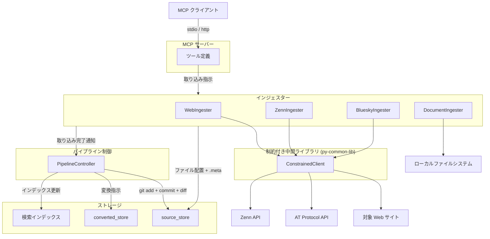
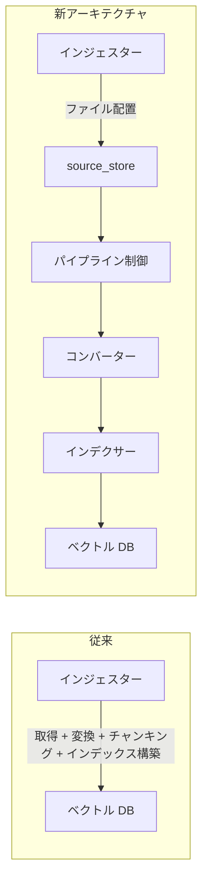
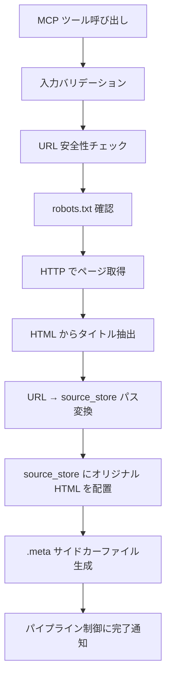
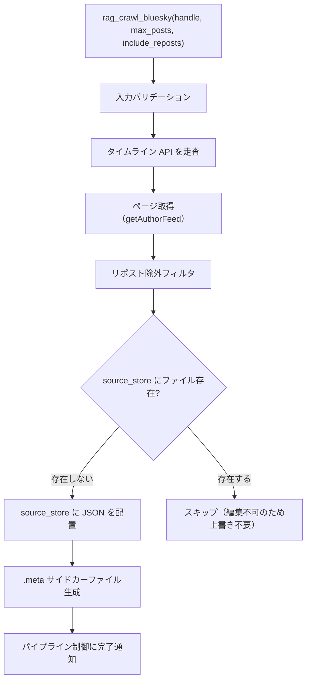
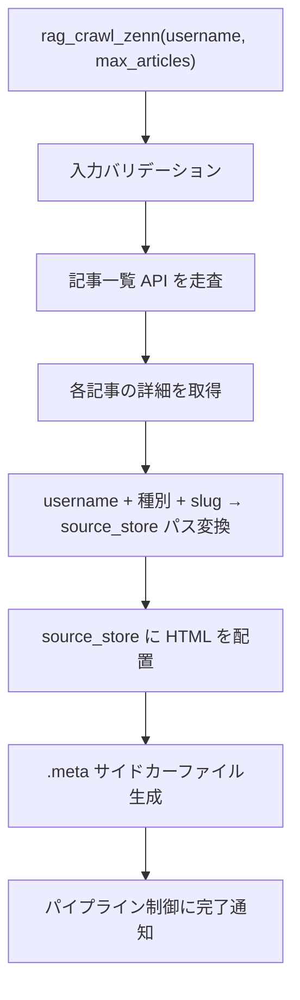
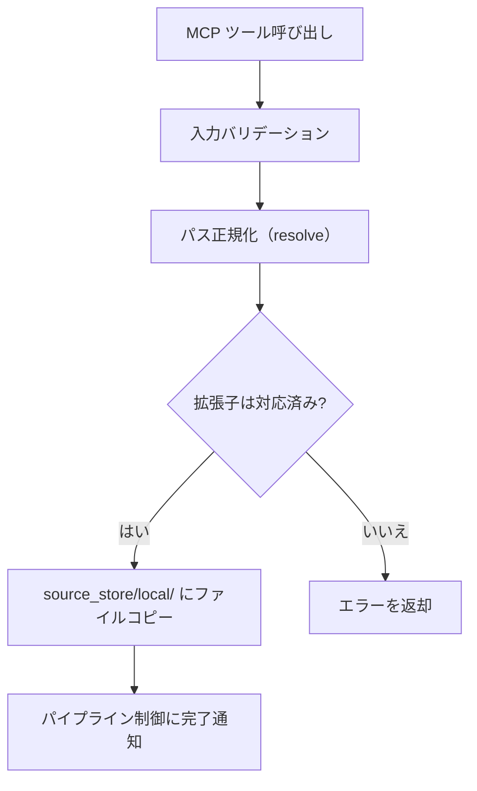

# インジェスター

## 概要

> **Note**: 本仕様書は設計先行（`docs(pre-impl)`）で作成している。後続の実装フェーズで既存インジェスター（`ingester/`, `bluesky_ingester/`, `zenn_ingester/`）を本仕様に基づき再実装する。現行コードとの不整合は意図的である。

インジェスターは各媒体からデータを取得し、source_store にファイルを配置するコンポーネントである。新アーキテクチャでは、インジェスターの責務は「source_store へのファイル配置 + .meta サイドカーファイルの生成」に限定される。

スコープ:

- 各媒体（web、bluesky、zenn、local）からのデータ取得
- source_store へのファイル配置
- .meta サイドカーファイルの生成（local 以外）
- ファイルシステムベースの重複検出

スコープ外:

- metadata.db への直接アクセス（パイプライン制御が .meta を読んで実行する）
- git 操作（パイプライン制御の範疇）
- テキスト変換・チャンキング・インデックス構築（コンバーター・インデクサーの範疇）
- ファイルの物理削除（source_store の制約）

## 背景

- 従来のインジェスターはデータ取得からチャンキング・インデックス構築まで一貫して行っていたが、Embedding モデル変更時の再構築や変換方式変更への対応が困難だった
- 3段パイプライン（インジェスター → コンバーター → インデクサー）への移行により、責務を分離し各ステージの独立性を確保する
- インジェスターが metadata.db に依存しない設計とすることで、DB 破損時も source_store からの再構築が可能となる

## 制約

- **metadata.db アクセス禁止**: インジェスターは metadata.db に直接アクセスしない。DB 登録はパイプライン制御が .meta を読んで実行する
- **git 操作禁止**: git 操作（add、commit、diff）はパイプライン制御のみが実行する。インジェスターは git コマンドを直接呼び出さない
- **オリジナルデータの無加工保存**: 取得したデータに加工（テキスト変換、メタデータ埋め込み等）を行わず、オリジナルのまま source_store に配置する
- **ファイル削除禁止**: source_store 内のファイルの物理削除は一切行わない
- **外部 HTTP リクエスト**: ConstrainedClient（py-common-lib）経由で実行する。ConstrainedClient の制約（リクエスト総数上限、最低リクエスト間隔、操作全体タイムアウト、サーキットブレーカー）は既存の各媒体仕様書を継承する
- **重複検出**: ファイルシステムベースで行う。source_id からファイルパスを導出し、ファイルの存在有無で判定する。metadata.db には依存しない

## 想定プロファイル

外部 API 通信の想定プロファイルは、各媒体の既存仕様書を継承する。各媒体のインジェスターは独立した MCP ツールから個別に呼び出される運用を前提とし、複数媒体の同時呼び出しは想定しない。万一並行実行された場合でも、各媒体が独立した ConstrainedClient インスタンスを使用するため、媒体ごとの安全制約は個別に成立する。インジェスターの責務変更（source_store 配置のみ）により、後続のチャンキング・インデックス構築のリクエストはなくなるが、データ取得部分のリクエスト特性は変わらない。

| 媒体 | 参照先 |
|------|--------|
| web | [rag-knowledge.md](rag-knowledge.md) — rag_crawl / rag_add / rag_crawl_preview |
| bluesky | [bluesky-ingester.md](bluesky-ingester.md) — rag_crawl_bluesky |
| zenn | [zenn-ingester.md](zenn-ingester.md) — rag_crawl_zenn |
| local | 外部 API 通信なし |

## 安全制約

外部 API 通信の安全制約は各媒体の既存仕様書から継承する。インジェスター共通の追加制約を以下に定義する。

| 制約名 | 種別 | 値 | 解除可否 |
|--------|------|-----|---------|
| metadata.db 直接アクセス禁止 | ハードリミット | インジェスターから metadata.db への読み書きを禁止 | 不可 |
| git 操作禁止 | ハードリミット | インジェスターから git コマンドの直接呼び出しを禁止 | 不可 |
| ファイル物理削除禁止 | ハードリミット | source_store 内のファイル削除を禁止 | 不可 |

媒体別の安全制約（ConstrainedClient、リクエスト上限、サーキットブレーカー等）は以下を参照:

- web: [rag-knowledge.md 安全制約](rag-knowledge.md)
- bluesky: [bluesky-ingester.md 安全制約](bluesky-ingester.md)
- zenn: [zenn-ingester.md 安全制約](zenn-ingester.md)
- local: [document-ingester.md 安全制約](document-ingester.md)

## インターフェース

### インジェスター操作

各インジェスターが提供する操作。取り込み操作の出力は source_store へのファイル配置であり、パイプライン制御への取り込み完了通知を含む。プレビュー操作は source_store への配置を行わない。

| 操作 | 媒体 | 入力 | 振る舞い |
|------|------|------|---------|
| 単一ページ取り込み | web | URL | 単一ページを HTTP 取得し、source_store に配置する。.meta を生成する |
| 一括クロール | web | URL、パターン | リンク集ページからリンクを抽出し、パターンに一致するページを一括取得して source_store に配置する。各ページの .meta を生成する |
| クロールプレビュー | web | URL、パターン | クロール対象ページのタイトルと URL の一覧を返す。source_store への配置は行わない |
| BlueSky 投稿取り込み | bluesky | handle、max_posts、include_reposts | 指定ユーザーの投稿をタイムライン API 経由で取得し、source_store に配置する。各投稿の .meta を生成する |
| Zenn 記事取り込み | zenn | username、max_articles | 指定ユーザーの記事を Zenn API 経由で取得し、source_store に配置する。各記事の .meta を生成する |
| 単一ドキュメント取り込み | local | file_path | 指定ファイルを source_store の `local/` 配下にコピーする。.meta は生成しない |
| ディレクトリ一括取り込み | local | dir_path、pattern | 指定ディレクトリ内のファイルを glob パターンで検索し、source_store の `local/` 配下にコピーする。.meta は生成しない |

### MCP ツール

既存の MCP ツール名・パラメータを維持する。内部的な処理フローが変更される。

| ツール | 媒体 | 変更点 |
|--------|------|--------|
| `rag_add` | web | 取得後に source_store 配置 + パイプライン処理。従来のチャンキング・インデックス直接構築を廃止 |
| `rag_crawl` | web | 一括取得後に source_store 配置 + パイプライン処理。従来のチャンキング・インデックス直接構築を廃止 |
| `rag_crawl_preview` | web | 変更なし（source_store 配置を行わないため） |
| `rag_crawl_bluesky` | bluesky | 投稿取得後に source_store 配置 + パイプライン処理。従来のチャンキング・インデックス直接構築を廃止 |
| `rag_crawl_zenn` | zenn | 記事取得後に source_store 配置 + パイプライン処理。従来のチャンキング・インデックス直接構築を廃止 |
| `rag_add_document` | local | ファイルを source_store にコピー + パイプライン処理。従来の直接取り込みを廃止 |
| `rag_crawl_documents` | local | ディレクトリ内ファイルを source_store にコピー + パイプライン処理。従来の直接取り込みを廃止 |

ツール入力パラメータ・バリデーション規則は各媒体の既存仕様書を継承する。ただし以下は新アーキテクチャに合わせて変更される:

- **出力形式**: 従来のチャンク数を含むサマリーに代わり、source_store への配置結果（配置ファイル数、スキップ数、エラー数）を返す
- **source_id**: 各媒体の source_id 決定方式は [source-store.md](source-store.md) の定義に従う。local 媒体の source_id は file URI から source_store 内の相対パスに変更される
- **重複検出**: metadata.db / ベクトル DB 照合からファイルシステム存在チェックに変更（本仕様書の「重複検出方式」セクション参照）

### 設定項目

インジェスター共通の追加設定はなし。各媒体固有の設定は既存仕様書を継承する。source_store のパスは [source-store.md](source-store.md) の `SOURCE_STORE_DIR` を使用する。

## コンポーネント構成

### 新アーキテクチャでのインジェスターの位置付け

### 従来アーキテクチャとの比較

### 媒体別処理フロー

#### web インジェスター

**ファイル配置先**: `web/{protocol}/{domain}/{path}`

URL からファイルパスへの変換規則は [source-store.md](source-store.md) の「URL パス変換規則」に従う。

**保存形式**: 取得した HTML をオリジナルのまま保存する。テキスト抽出・Markdown 変換はコンバーターの範疇。

**重複時の動作**: 同一 URL のファイルが既に存在する場合は上書きする。Web ページは内容が更新される可能性があるため、常に最新を取得する。

**既存機能の継承**:

- URL 安全性チェック（Google Safe Browsing API）
- SSRF 対策（プライベート IP・localhost へのアクセス拒否、リダイレクト追従無効化）
- robots.txt 遵守
- 一括クロール時のリンク抽出・パターンフィルタ
- クロールプレビュー

#### bluesky インジェスター

**ファイル配置先**: `bluesky/{did}/{yyyy}/{MM}/{rkey}.json`

- `did`: 投稿者の DID（`post.author.did`）
- `yyyy/MM`: 投稿日時（`record.createdAt`）の年月
- `rkey`: 投稿の Record Key（AT URI の末尾パス）

**保存形式**: `getAuthorFeed` レスポンスの投稿オブジェクト（`post`）を JSON として保存する。テキスト抽出はコンバーターの範疇。

**重複時の動作**: ファイルが既に存在する場合はスキップする。BlueSky は投稿編集不可のため、上書きは不要。

**テキスト抽出の扱い**: 従来インジェスターで行っていたテキスト抽出（投稿テキスト、画像 ALT、引用元テキスト等の構造化）はコンバーターに移行する。抽出対象フィールド・出力テキスト構造は [bluesky-ingester.md](bluesky-ingester.md) の「テキスト抽出」セクションを継承する。

**外部 API**: AT Protocol API の詳細（エンドポイント、パラメータ、レスポンス構造）は [bluesky-ingester.md](bluesky-ingester.md) の「外部連携」セクションを参照。

#### zenn インジェスター

**ファイル配置先**: `zenn/{username}/articles/{slug}.html` または `zenn/{username}/scraps/{slug}.html`

- `username`: Zenn ユーザー名
- `slug`: 記事スラッグ

**保存形式**: 記事詳細 API のレスポンスから `body_html` をオリジナルのまま保存する。HTML → Markdown 変換はコンバーターの範疇。

**重複時の動作**: 同一 slug のファイルが既に存在する場合は上書きする。Zenn 記事は編集可能なため、常に最新を取得する。web/zenn/local は「常に上書き」のため、bluesky のようなスキップ分岐はフローチャートに含めない。

**外部 API**: Zenn API の詳細（エンドポイント、パラメータ、レスポンス構造）は [zenn-ingester.md](zenn-ingester.md) の「外部連携」セクションを参照。

#### local（ドキュメントインジェスター）

**ファイル配置先**: `local/` 配下にユーザーが自由に構成する

MCP ツール経由の場合、以下の規則で配置先を決定する:

- `rag_add_document`: 指定ファイルを `local/{ファイル名}` に配置する。既にファイル名が存在する場合は上書きする
- `rag_crawl_documents`: 指定ディレクトリの構造を維持し、`local/{ディレクトリ名}/` 配下に配置する

**保存形式**: ファイルをオリジナルのままコピーする。テキスト抽出（PDF → Markdown 変換等）はコンバーターの範疇。

**.meta 不要**: local 媒体は .meta を生成しない。メタデータは source_store のファイルシステム情報と git 履歴から導出する（[source-store.md](source-store.md) の「.meta サイドカーファイル」制約を参照）。

**重複時の動作**: 同一パスのファイルが既に存在する場合は上書きする。

**対応ファイル形式**: [document-ingester.md](document-ingester.md) の「対応ファイル形式」を継承する。拡張子バリデーションはインジェスター段階で実施し、非対応ファイルの配置を防止する。

### .meta サイドカーファイルの生成

インジェスターは local 以外の媒体で .meta サイドカーファイルを生成する。.meta のフォーマット（共通フィールド、媒体別フィールド、YAML 形式）は [source-store.md](source-store.md) の「.meta サイドカーファイル」セクションに定義済み。

生成タイミング: データファイルの配置直後に同階層に .meta を生成する。正常時はデータファイルと .meta がペアで存在する。.meta の書き込みに失敗した場合は欠落し得る（フォールバック動作は [source-store.md](source-store.md) のエッジケースに定義済み）。

### 重複検出方式

インジェスターは metadata.db に依存せず、ファイルシステムのみで重複を検出する。

| 媒体 | source_id | ファイルパス導出 | 重複時の動作 |
|------|-----------|----------------|-------------|
| web | URL | URL パス変換規則で一意に決定 | 上書き |
| bluesky | AT URI | DID + 年月 + rkey で一意に決定 | スキップ |
| zenn | Zenn URL | username + slug で一意に決定 | 上書き |
| local | 相対パス | ユーザー指定パスで一意に決定 | 上書き |

重複検出の手順:

1. source_id からファイルパスを導出する（各媒体の変換規則に基づく）
2. source_store 内の該当パスにファイルが存在するか確認する
3. 存在する場合: 媒体の方針に従い上書きまたはスキップする
4. 存在しない場合: 新規ファイルとして配置する

### パイプライン制御への完了通知

インジェスターがファイル配置を完了した後、パイプライン制御に取り込み完了を通知する。パイプライン制御は通知を受けて以下を実行する:

1. source_store で `git add -A` + `git commit` を実行
2. `git diff` で変更ファイルを特定
3. 変更ファイルをコンバーター → インデクサーで処理

詳細は [pipeline-controller.md](pipeline-controller.md) の「インジェスター実行後のフロー」を参照。

### 既存実装との差分

| 項目 | 従来 | 新アーキテクチャ |
|------|------|----------------|
| データ保存先 | ベクトル DB に直接格納 | source_store にファイル配置 |
| テキスト変換 | インジェスター内で実行 | コンバーターに委譲 |
| チャンキング | インジェスター内で実行 | インデクサーに委譲 |
| インデックス構築 | インジェスター内で実行 | インデクサーに委譲 |
| metadata.db | インジェスターが直接操作 | パイプライン制御が .meta を読んで操作 |
| git 管理 | なし | パイプライン制御が git 操作を実行 |
| 重複検出 | metadata.db / ベクトル DB の source_id 照合 | ファイルシステム上のパス存在チェック |
| 再構築 | 外部 API への再アクセスが必要 | source_store からオフラインで再構築可能 |

## エッジケース

| ケース | 振る舞い |
|--------|---------|
| source_store ディレクトリが存在しない場合 | パイプライン制御がインジェスター起動前に source_store の存在を確認し、未作成であればディレクトリ作成と git リポジトリの初期化を行う。インジェスターはディレクトリの存在を前提とする |
| .meta ファイルの書き込みに失敗した場合 | ファイル物理削除禁止制約により、配置済みデータファイルのロールバックは行わない。エラーログを出力して処理を続行する。.meta 欠落時のフォールバックは [source-store.md](source-store.md) のエッジケースに定義済み |
| ファイル配置中にディスク容量不足が発生した場合 | OS エラーをそのまま伝播し、エラーログに記録する。部分的に書き込まれたファイルは次回の git commit で差分として検出される |
| 同一 source_id に対する並行実行 | 同一媒体の MCP ツールを並行呼び出ししない運用を前提とする。万一並行書き込みが発生した場合、ファイルシステムの最終書き込み結果が採用される（source_store の git commit 時点のスナップショットが正となる） |
| source_store の パス変換で Windows 禁止文字を含む URL | [source-store.md](source-store.md) の「URL パス変換規則」に従い全角文字に代替する |
| bluesky 投稿の createdAt が不正な形式 | 年月ディレクトリの導出に失敗する。エラーログを出力し、該当投稿をスキップする |
| zenn 記事の body_html が空 | 空ファイルとして配置する。コンバーターが空ファイルをスキップする |
| local 媒体でコピー元ファイルが読み取り不可 | 該当ファイルをスキップし、エラーをログ出力する。他のファイルの処理は続行する |
| local 媒体でコピー先に同名ディレクトリが存在 | エラーとして該当ファイルをスキップする |

媒体固有のエッジケース（API エラー、バジェット上限、サーキットブレーカー等）は各媒体の既存仕様書を継承する。

## 関連ドキュメント

- [source-store.md](source-store.md) — source_store 仕様（ディレクトリ構成、.meta 形式、URL パス変換）
- [pipeline-controller.md](pipeline-controller.md) — パイプライン制御仕様（git 操作、ステージ間連携）
- [rag-knowledge.md](rag-knowledge.md) — RAG ナレッジ基盤仕様（Web クロール、MCP ツール）
- [bluesky-ingester.md](bluesky-ingester.md) — BlueSky インジェスター仕様（AT Protocol API 詳細）
- [zenn-ingester.md](zenn-ingester.md) — Zenn インジェスター仕様（Zenn API 詳細）
- [document-ingester.md](document-ingester.md) — ドキュメントインジェスター仕様（対応ファイル形式、PDF バックエンド）
