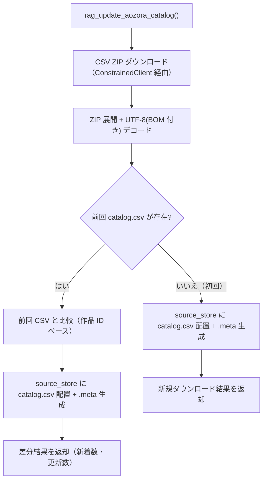
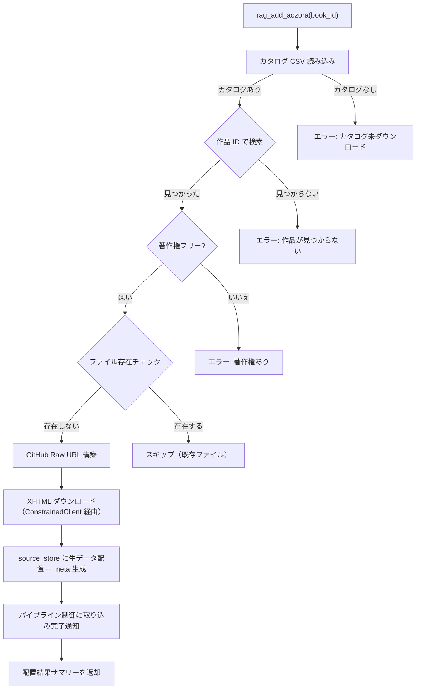
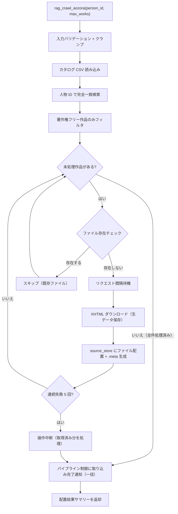

# 青空文庫インジェスター

## 概要

青空文庫（aozora.gr.jp）の作品を取り込み、source_store にファイルを配置するインジェスター。作品カタログ（CSV）の管理、カタログを用いた作品検索、および個別作品 XHTML の取得の 3 つの機能を提供する。

本インジェスターの責務は「青空文庫からのデータ取得 → source_store へのファイル配置 + .meta サイドカーファイルの生成」に限定される。テキスト変換・チャンキング・インデックス構築はパイプライン後段（コンバーター・インデクサー）が担当する。

スコープ:

- 作品カタログ CSV のダウンロードと source_store への配置
- カタログの新着・更新検出
- カタログを用いた著者名・作品名での検索
- 個別作品 XHTML の取得と source_store への配置
- 人物 ID（person_id）を指定した一括取り込み
- .meta サイドカーファイルの生成
- MCP ツール・CLI コマンドとしてのインターフェース提供
- パイプライン制御への取り込み完了通知

スコープ外:

- aozorahack API の使用（サーバー停止中、信頼性に懸念）
- テキスト変換・チャンキング・インデックス構築（コンバーター・インデクサーの範疇）
- metadata.db への直接アクセス（パイプライン制御の範疇）
- git 操作（パイプライン制御の範疇）
- ファイルの物理削除（source_store の制約）

## 背景

- 青空文庫は著作権切れの日本語文学作品を無料公開しており、日本語テキストの RAG ナレッジソースとして有用
- aozorahack API はサーバーダウン中で信頼性に懸念があるため、青空文庫公式サイトの CSV リストと GitHub Raw URL を組み合わせた安定的な取得方式を採用する
- 作品カタログ CSV を source_store に保存し git 管理することで、前回との差分から新着・更新作品を検出できる
- 3段パイプラインへの移行により、インジェスターの責務を source_store へのファイル配置に限定する

## 制約

### 責務の限定

[インジェスター共通仕様](common.md) の制約に従う:

- **metadata.db アクセス禁止**: metadata.db に直接アクセスしない。DB 登録はパイプライン制御が .meta を読んで実行する
- **git 操作禁止**: git 操作はパイプライン制御のみが実行する
- **オリジナルデータの無加工保存**: 作品 XHTML をダウンロードしたバイト列のまま source_store に保存する。エンコーディング変換（Shift_JIS → UTF-8）や ruby タグの処理等はコンバーターの責務
- **ファイル削除禁止**: source_store 内のファイルの物理削除は一切行わない

### 著作権チェック

著作権フラグが「なし」（著作権切れ）の作品のみ取り込み可能とする。これはハードリミットであり、設定や引数で解除できない。

### カタログファイルのパイプライン除外

`aozora/catalog.csv` はメタデータ管理用のファイルであり、RAG の検索対象コンテンツではない。パイプライン処理（コンバーター・インデクサー）の対象から除外する。

### 外部 HTTP リクエスト

- ConstrainedClient（py-common-lib）経由で実行する
- ConstrainedClient の共通ハードリミット:
  - 操作あたりリクエスト総数上限: 500
  - 最低リクエスト間隔: 0.1 秒（カタログダウンロード、各作品 XHTML 取得間を含む全外部リクエスト間に適用）
  - 操作全体タイムアウト: 600 秒（許容範囲 1〜600 秒）
  - サーキットブレーカー: 5 回連続失敗で操作全体を中断
- 青空文庫インジェスター固有のハードリミット:
  - 作品取得上限: 500 作品

### GitHub Raw URL のレート制限

作品 XHTML の取得先は GitHub Raw URL（`raw.githubusercontent.com`）である。未認証アクセスの場合、レート制限は 60 リクエスト/時間程度。リクエスト間隔のデフォルト値（1.0 秒）はこの制限を考慮した設定である。Token 認証は初期実装では対応しない。

### バリデーションとクランプの使い分け

- **バリデーションエラー（拒否）**: 型不正（非整数など）、0、負数。明らかな誤入力であり、クランプで救済しない
- **クランプ（警告ログ付き）**: 正の整数だが許容範囲外（例: `max_works=600` → 500 にクランプ）。意図的な大きい値の指定を安全な範囲に制限する
- `--no-limit` 等の制約バイパス手段は一切設けない
- `0 = 無制限` のセマンティクスを排除する

### 重複検出

[インジェスター共通仕様](common.md) のファイルシステムベース方式に従う。source_id（青空文庫作品 URL）からファイルパスを導出し、ファイルの存在有無で判定する。既存ファイルが存在する場合はスキップする（青空文庫のテキストは基本的に不変であり、上書きの必要性が低い）。

## 想定プロファイル

### rag_update_aozora_catalog（カタログ更新）

| 項目 | 内容 |
|------|------|
| 最悪ケースリクエスト数 | 1（ZIP ダウンロード） |
| 最悪ケース所要時間 | ZIP ファイルは約 2 MB。ネットワーク依存だが数秒以内 |
| 想定エラー率 | 青空文庫公式サイト依存。リトライ機構なし |

### rag_crawl_aozora（著者一括取り込み）

| 項目 | 内容 |
|------|------|
| 最悪ケースリクエスト数 | 500（作品取得上限）。バジェットトラッカー上限 500 の範囲内 |
| 最悪ケース所要時間 | 500 × 1.0 秒（デフォルト間隔）= 500 秒 + ダウンロード・処理時間。操作全体タイムアウト 600 秒の範囲内 |
| 想定エラー率 | GitHub Raw URL 依存。個別作品の失敗はスキップして続行。5 回連続失敗でサーキットブレーカーが発動し操作中断 |

### rag_add_aozora（単一作品取り込み）

| 項目 | 内容 |
|------|------|
| 最悪ケースリクエスト数 | 1（XHTML ダウンロード） |
| 最悪ケース所要時間 | 数秒以内 |
| 想定エラー率 | GitHub Raw URL 依存。リトライ機構なし |

## 安全制約

| 制約名 | 種別 | 値 | 解除可否 |
|--------|------|-----|---------|
| metadata.db 直接アクセス禁止 | ハードリミット | インジェスターから metadata.db への読み書きを禁止 | 不可 |
| git 操作禁止 | ハードリミット | インジェスターから git コマンドの直接呼び出しを禁止 | 不可 |
| ファイル物理削除禁止 | ハードリミット | source_store 内のファイル削除を禁止 | 不可 |
| 著作権フリーのみ取り込み可 | ハードリミット | CSV の著作権フラグが「なし」の作品のみ取り込み可能 | 不可 |
| 操作あたりリクエスト総数上限 | ハードリミット | 500 | 引き上げ不可（引き下げ可） |
| 最低リクエスト間隔 | ハードリミット | 0.1 秒 | 引き下げ不可（引き上げ可） |
| 操作全体タイムアウト | ハードリミット | 600 秒、許容範囲 1〜600 秒 | 引き上げ不可（引き下げ可、下限 1 秒） |
| サーキットブレーカー閾値 | ハードリミット | 5 回連続失敗 | 引き上げ不可（引き下げ可） |
| 作品取得上限 | ハードリミット | 500 作品 | 引き上げ不可（引き下げ可） |
| 取得作品数 | 設定値 | 許容範囲 1〜500、デフォルト 200 | 範囲内で変更可 |
| リクエストタイムアウト | 設定値 | 許容範囲 1〜120 秒、デフォルト 30 秒 | 範囲内で変更可 |
| リクエスト間隔 | 設定値 | 許容範囲 0.1〜60 秒、デフォルト 1.0 秒 | 範囲内で変更可 |
| 生 HTTP クライアント利用禁止 | CI チェック | `src/` 全体を grep で走査（httpx / aiohttp / requests / urllib.request）。`# safety:allowed` 行を除外。ConstrainedClient は py-common-lib パッケージで提供（`src/` 外のため検出対象外） | 許可例外は `# safety:allowed` コメントで可 |

テスト実行時の安全な値: 作品取得上限 3 件で実行する。異常値テスト（0、負数、上限超過）を含めること。

## インターフェース

### MCP ツール

既存のインジェスターツールとは独立したツールとして提供する。青空文庫はカタログベースの検索・取り込み方式であり、他のインジェスターとは取得フローが異なるため分離する。

| ツール | 入力 | 振る舞い |
|--------|------|---------|
| `rag_update_aozora_catalog` | なし | 青空文庫の作品カタログ CSV をダウンロードし、source_store に配置する。前回カタログとの差分から新着・更新作品を検出し結果を返す |
| `rag_search_aozora` | `author`、`title`、`limit`（任意） | ローカルカタログ CSV を読み、著者名・作品名で部分一致検索する。ネットワークアクセス不要 |
| `rag_add_aozora` | `book_id` | 指定作品の XHTML を取得し、source_store に配置する。取り込み完了後、パイプライン制御に通知する |
| `rag_crawl_aozora` | `person_id`、`max_works`（任意） | 指定著者（人物 ID）の著作権フリー作品を一括取り込みする。取り込み完了後、パイプライン制御に通知する |

#### rag_update_aozora_catalog パラメータ

パラメータなし。

ツール出力: カタログ更新結果サマリー（総作品数、新着数、更新数）。初回ダウンロード時は新着数 = 総作品数となる。

#### rag_search_aozora パラメータ

| パラメータ | 型 | 必須 | 説明 |
|-----------|-----|------|------|
| `author` | 文字列 | いいえ | 著者名（部分一致検索） |
| `title` | 文字列 | いいえ | 作品タイトル（部分一致検索） |
| `limit` | 整数 | いいえ | 最大表示件数。デフォルト: 20、許容範囲: 1〜2000 |

`author` と `title` の両方が未指定の場合はバリデーションエラーとする。両方指定時は AND 条件で検索する。

ツール出力: 検索結果リスト（作品 ID、タイトル、著者名、著作権フラグ）。結果は作品 ID の昇順でソートされる。カタログが未ダウンロードの場合はエラーメッセージを返す。

#### rag_add_aozora パラメータ

| パラメータ | 型 | 必須 | 説明 |
|-----------|-----|------|------|
| `book_id` | 文字列 | はい | 青空文庫の作品 ID（CSV の作品 ID カラムに対応） |

ツール出力: source_store への配置結果サマリー。

#### rag_crawl_aozora パラメータ

| パラメータ | 型 | 必須 | 説明 |
|-----------|-----|------|------|
| `person_id` | 文字列 | はい | 著者の人物 ID（`rag_search_aozora` で確認可能） |
| `max_works` | 整数 | いいえ | 取得する最大作品数。デフォルト: 200、許容範囲: 1〜500 |

ツール出力: source_store への配置結果（配置ファイル数、スキップ数、エラー数）のサマリーテキスト。

### CLI コマンド

| コマンド | 引数 | 振る舞い |
|---------|------|---------|
| `update-aozora-catalog` | なし | `rag_update_aozora_catalog` と同等の処理を CLI から実行する |
| `search-aozora` | `--author`（任意）、`--title`（任意）、`--limit`（任意） | `rag_search_aozora` と同等の処理を CLI から実行する |
| `ingest-aozora` | `book_id` | `rag_add_aozora` と同等の処理を CLI から実行する |
| `ingest-aozora-author` | `person_id`、`--max-works`（任意） | `rag_crawl_aozora` と同等の処理を CLI から実行する |

### 設定項目

| 設定項目 | 型 | 保管先 | デフォルト | 許容範囲 | 内容 |
|---------|-----|--------|-----------|---------|------|
| `rag_aozora_max_works` | 整数 | `config.toml` | 200 | 1〜500 | 一括取り込み時の最大作品数 |
| `rag_aozora_request_timeout` | 整数 | `config.toml` | 30 | 1〜120 | リクエストのタイムアウト（秒） |
| `rag_aozora_request_interval` | 小数 | `config.toml` | 1.0 | 0.1〜60 | リクエスト間の最低間隔（秒） |

## コンポーネント構成

### source_store 内のディレクトリ構成

青空文庫インジェスターは `aozora/` ディレクトリ配下にカタログと著者 ID + 作品 ID で階層化してファイルを配置する。

```
source_store/
  aozora/
    catalog.csv
    catalog.csv.meta
    {person_id}/
      {book_id}.html
      {book_id}.html.meta
```

- カタログ: 作品一覧 CSV（ZIP 展開後）を `aozora/catalog.csv` に配置
- 作品ファイル: XHTML をダウンロードしたまま保存（Shift_JIS、エンコーディング変換はコンバーターが実施）
- ファイル名: `{book_id}.html`
- .meta: データファイルと同階層に配置

### source_id とファイルパスの対応

| 対象 | source_id | ファイルパス |
|------|-----------|------------|
| カタログ | `aozora:catalog` | `aozora/catalog.csv` |
| 作品 | `https://www.aozora.gr.jp/cards/{person_id}/files/{book_id}_{file_id}.html` | `aozora/{person_id}/{book_id}.html` |

カタログの source_id は URL ではなく固定文字列 `aozora:catalog` とする。カタログは単一のリソースであり、URL ベースの識別は不要。

作品の source_id は青空文庫の図書カード XHTML URL とする。ファイルパスは `person_id` と `book_id` のみで構成し、`file_id` は含めない（同一作品に対するファイルパスの一意性を `book_id` で担保するため）。

### URL 変換規則

CSV に記載された青空文庫 URL を GitHub Raw URL に変換して作品を取得する。

```
CSV の URL: https://www.aozora.gr.jp/cards/{person_id}/files/{book_id}_{file_id}.html
  → GitHub Raw: https://raw.githubusercontent.com/aozorabunko/aozorabunko/master/cards/{person_id}/files/{book_id}_{file_id}.html
```

- `person_id`: 著者 ID（`000035` 等、ゼロ埋め 6 桁）
- `book_id`: 作品 ID（`1567` 等）
- `file_id`: ファイル ID（`14913` 等、CSV から取得）

### .meta サイドカーファイル

#### カタログ用 .meta

| フィールド | 型 | 内容 | 値の取得元 |
|-----------|-----|------|-----------|
| `source_id` | str | ソース識別子 | 固定値 `aozora:catalog` |
| `source_type` | str | 媒体種別 | 固定値 `aozora` |
| `title` | str | タイトル | 固定値 `"Aozora Bunko Catalog"` |
| `collected_at` | str | 取り込みタイムスタンプ（ISO 8601） | 取り込み実行時の現在時刻 |

#### 作品用 .meta

共通フィールド:

| フィールド | 型 | 内容 | 値の取得元 |
|-----------|-----|------|-----------|
| `source_id` | str | ソース識別子 | `https://www.aozora.gr.jp/cards/{person_id}/files/{book_id}_{file_id}.html` |
| `source_type` | str | 媒体種別 | 固定値 `aozora` |
| `title` | str | 作品タイトル | CSV の「作品名」カラム |
| `collected_at` | str | 取り込みタイムスタンプ（ISO 8601） | 取り込み実行時の現在時刻 |

青空文庫固有フィールド:

| フィールド | 型 | 内容 | 値の取得元 |
|-----------|-----|------|-----------|
| `book_id` | str | 作品 ID | CSV の「作品ID」カラム |
| `person_id` | str | 著者 ID | CSV の「人物ID」カラム |
| `author` | str | 著者名 | CSV の「姓」+「名」カラム |
| `author_kana` | str | 著者名カナ | CSV の「姓読み」+「名読み」カラム |
| `copyright_expired` | bool | 著作権切れフラグ | CSV の「作品著作権フラグ」カラム（「なし」→ `true`） |

.meta ファイルの形式例（作品）:

```yaml
source_id: "https://www.aozora.gr.jp/cards/000035/files/1567_14913.html"
source_type: aozora
title: "Sample Title"
collected_at: "2026-03-23T10:00:00+09:00"
book_id: "001567"
person_id: "000035"
author: "Alice Bob"
author_kana: "Sample Kana"
copyright_expired: true
```

### カタログ更新フロー



カタログ更新の処理手順:

1. 青空文庫公式サイトから CSV ZIP をダウンロードする（URL: `https://www.aozora.gr.jp/index_pages/list_person_all_extended_utf8.zip`）
2. ZIP を展開し、CSV を UTF-8（BOM 付き）でデコードする
3. 前回のカタログファイルが source_store に存在する場合、作品 ID ベースで差分を検出する
4. 新しいカタログを `aozora/catalog.csv` に配置し、.meta を生成する
5. カタログ配置はパイプライン制御に通知しない（カタログはパイプライン処理対象外のため）
6. 差分結果（新着数、更新数、総作品数）を返却する

### 単一作品取り込みフロー



### 著者一括取り込みフロー



### パイプライン制御との連携

作品ファイルの配置が完了した後、パイプライン制御に取り込み完了を通知する。パイプライン制御は通知を受けて以下を実行する:

1. source_store で `git add -A` + `git commit` を実行
2. `git diff` で変更ファイルを特定
3. 変更ファイルをコンバーター → インデクサーで処理

カタログ更新（`rag_update_aozora_catalog`）はパイプライン制御に通知しない。カタログはパイプライン処理対象外であり、git commit のみで管理される。

詳細は [pipeline-controller.md](../pipeline-controller.md) の「インジェスター実行後のフロー」を参照。

## 外部連携

### 青空文庫公式サイト

| 連携先 | 用途 | 接続方式 |
|--------|------|---------|
| aozora.gr.jp | 作品カタログ CSV ZIP のダウンロード | HTTPS（ConstrainedClient 経由） |

カタログ CSV URL: `https://www.aozora.gr.jp/index_pages/list_person_all_extended_utf8.zip`

- 約 2 MB（ZIP 圧縮）
- 全レコード: 約 19,000 作品
- カラム数: 55（作品 ID、タイトル、著者、底本情報、テキスト URL、XHTML URL 等）
- 文字コード: UTF-8（BOM 付き。`utf-8-sig` でデコード）

### GitHub Raw（aozorabunko リポジトリ）

| 連携先 | 用途 | 接続方式 |
|--------|------|---------|
| raw.githubusercontent.com | 作品 XHTML ファイルの取得 | HTTPS（ConstrainedClient 経由） |

- 青空文庫の全テキストは GitHub リポジトリ `aozorabunko/aozorabunko` でもミラーされている
- GitHub Raw URL は CDN 経由で安定的にアクセス可能
- 未認証アクセスのレート制限: 60 リクエスト/時間程度

## エッジケース

| ケース | 振る舞い |
|--------|---------|
| カタログ未ダウンロード状態で検索・取り込みを実行 | エラーメッセージを返す。先にカタログ更新を促す |
| 作品 ID がカタログに存在しない | エラーメッセージを返す |
| 著作権フラグが「なし」以外の作品を取り込み | エラーメッセージを返す（著作権ありの作品は取り込み不可） |
| 著者名で検索して 0 件 | 0 件の結果を返す |
| 著者の作品が 0 件（全て著作権あり） | 著作権フリー作品がない旨をメッセージで返す |
| CSV の XHTML URL が欠落 | 該当作品をスキップし、エラーログを出力する |
| GitHub Raw URL からの 404 | 該当作品をスキップし、エラーログを出力して処理を続行する |
| XHTML の文字コード（Shift_JIS） | 生データのまま source_store に保存。エンコーディング変換はコンバーターが charset_normalizer で自動検出して実施する |
| 同一作品の再取り込み | source_id からファイルパスを導出し、ファイルが存在する場合はスキップする |
| バジェット上限到達 | 取得済みデータを配置し、上限到達の旨をログ出力する |
| サーキットブレーカー発動 | 操作を中断し、取得済みデータを配置する。エラーの詳細をログ出力する |
| 操作全体タイムアウト | 操作を中断し、取得済みデータを配置する |
| 設定値がハードリミット超過（正の整数） | ハードリミット値にクランプし、警告ログを出力する |
| `max_works` に 0 や負数を指定 | バリデーションエラーとして拒否する（クランプ対象外） |
| `person_id` が空文字列 | バリデーションエラーとして拒否する |
| `book_id` が空文字列 | バリデーションエラーとして拒否する |
| カタログ ZIP のダウンロードに失敗 | エラーメッセージを返す |
| カタログ ZIP の展開に失敗（破損等） | エラーメッセージを返す |
| .meta ファイルの書き込みに失敗した場合 | ファイル物理削除禁止制約により、配置済みデータファイルのロールバックは行わない。エラーログを出力して処理を続行する |
| GitHub Raw URL のレート制限（429/403） | ConstrainedClient のサーキットブレーカーで検出される。連続失敗として計上し、閾値超過で操作を中断する |

## 関連ドキュメント

- [common.md](common.md) — インジェスター共通仕様
- [source-store.md](../source-store.md) — source_store 仕様（ディレクトリ構成、.meta 形式、source_id 決定方式）
- [pipeline-controller.md](../pipeline-controller.md) — パイプライン制御仕様（git 操作、ステージ間連携）
- [converter.md](../converter.md) — コンバーター仕様（ruby タグ処理）
