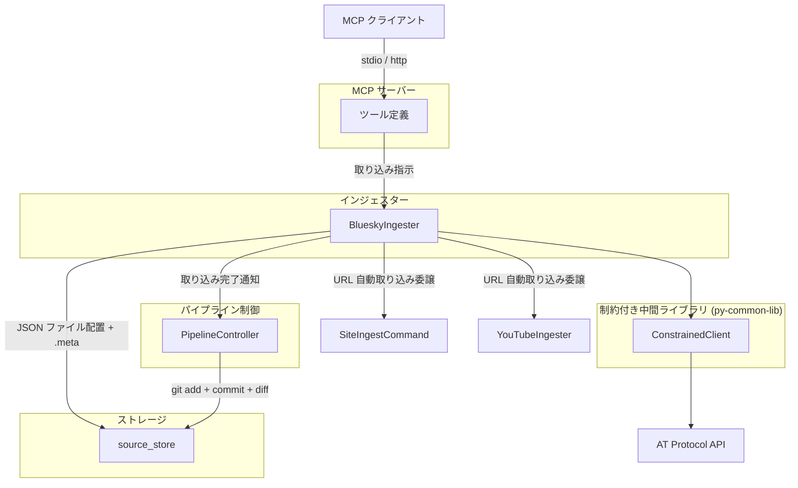
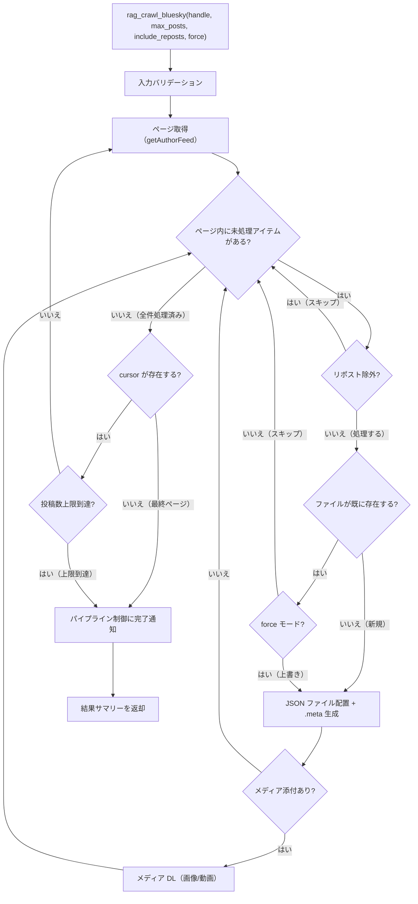

# BlueSky インジェスター

## 概要

BlueSky（AT Protocol）の投稿を API 経由で取得し、source_store にファイルを配置するインジェスター。`app.bsky.feed.getAuthorFeed` API を使用し、指定ユーザーの統一タイムライン（投稿・リポスト・リプライ混在）を一括取得する。

インジェスターの責務は「source_store へのファイル配置 + .meta サイドカーファイルの生成」に限定される。テキスト変換・チャンキング・インデックス構築は後続ステージ（コンバーター・インデクサー）が行う。

BlueSky 投稿は**複合ソース**として扱われる。投稿 JSON が親ソース（独立ソース）、`media/{rkey}/` 配下の画像・動画が attachment（独立ソースではない）として 1 論理ソースを構成する。
詳細は [source-store.md](../source-store.md) の「用語定義」「複合ソースの構造」を、複合ソース全般のルールは [common.md](common.md) の「複合ソースの attachment 配置ルール」を参照。

スコープ:

- 指定ユーザーの統一タイムラインの取得（投稿・引用リポスト・リポスト・リプライ）
- リポストのフィルタリング（`include_reposts` パラメータによる除外制御）
- source_store への JSON ファイル配置と .meta サイドカーファイルの生成
- 投稿内 URL の自動取り込み（site_ingest / YouTube インジェスターへの委譲）
- 投稿に添付されたメディア（画像・動画）の DL と source_store 配置
- MCP ツールとしての投稿取り込みインターフェースの提供

スコープ外:

- 他ユーザーの投稿の個別取得（タイムラインに含まれるリポスト・引用を除く）
- 投稿の作成・編集・削除（読み取り専用）
- DM（ダイレクトメッセージ）の取得
- フォロー・いいね等のソーシャルデータの取得
- テキスト変換・チャンキング・インデックス構築（コンバーター・インデクサーの範疇）
- metadata.db への直接アクセス（パイプライン制御が .meta を読んで実行する）
- git 操作（パイプライン制御の範疇）

## 背景

- 従来のインジェスターはデータ取得からチャンキング・インデックス構築まで一貫して行っていたが、3段パイプラインへの移行により責務が分離された
- 新アーキテクチャでは source_store にオリジナルデータ（JSON）を保存し、Embedding モデルやチャンクパラメータの変更時に外部 API アクセスなしで再構築を可能にする
- AT Protocol API を使用し、認証不要の公開 API 経由で BlueSky の投稿データを取得する

## 制約

### 責務の限定

- **metadata.db アクセス禁止**: metadata.db に直接アクセスしない。DB 登録はパイプライン制御が .meta を読んで実行する
- **git 操作禁止**: git 操作（init、add、commit、diff）はパイプライン制御のみが実行する
- **オリジナルデータの無加工保存**: API から取得したフィードアイテムの JSON データをそのまま source_store に配置する。テキスト変換やメタデータ埋め込み等の加工を行わない
- **ファイル削除禁止**: source_store 内のファイルの物理削除は一切行わない

### 外部 HTTP リクエスト

- [common.md](common.md) の外部 HTTP リクエスト制約に従う（ConstrainedClient 経由）
- BlueSky 固有のハードリミット: 投稿取得上限 1000 件（コード内定数、設定不可。タイムライン全体に適用。リポストを含む全アイテムが対象）

### バリデーション

- バリデーションとクランプの使い分け:
  - **バリデーションエラー（拒否）**: 型不正（非整数など）、0、負数。これらは明らかな誤入力であり、クランプで救済しない
  - **クランプ（警告ログ付き）**: 正の整数だが許容範囲外（例: `max_posts=2000` → 1000 にクランプ）。意図的な大きい値の指定を安全な範囲に制限する
- `--no-limit` 等の制約バイパス手段は一切設けない
- `0 = 無制限` のセマンティクスを排除する

## 想定プロファイル

### rag_crawl_bluesky（BlueSky 投稿一括取り込み）

`max_posts` はタイムライン全体（リポスト含む）に適用される。

| 項目 | 内容 |
|------|------|
| 最悪ケースリクエスト数 | BlueSky API: ceil(投稿取得上限/ページサイズ) 回（ConstrainedClient バジェット消費）。URL 先取り込み: site_ingest（Scrapy subprocess）が独立して HTTP リクエストを管理するため、ConstrainedClient バジェットを消費しない |
| 最悪ケース所要時間 | BlueSky API: リクエスト数 x リクエスト間隔（デフォルト・許容範囲は pydantic Field で定義）。URL 先取り込み: Scrapy subprocess の所要時間。直列実行のため合計時間 |
| 想定エラー率 | AT Protocol API 依存。リトライ機構なし。ConstrainedClient のサーキットブレーカー閾値で操作中断。中断時は取得済みデータを処理する |

## インターフェース

### MCP ツール

| ツール | 入力 | 振る舞い |
|--------|------|---------|
| rag_crawl_bluesky | handle、max_posts（任意）、include_reposts（任意）、force（任意） | 指定ユーザーの BlueSky 投稿を AT Protocol API 経由で取得し、source_store に JSON ファイルとして配置する。通常は既存ファイルと一致する投稿をスキップする。`force` 指定時は全データを上書き再取得する |

ツール入力パラメータ:

| パラメータ | 型 | 必須 | 説明 |
|-----------|-----|------|------|
| `handle` | 文字列 | はい | BlueSky ハンドル（例: `user.bsky.social`）。DID 形式（`did:` 始まり）はバリデーションで拒否する |
| `max_posts` | 整数 | いいえ | 取得する最大投稿数（タイムライン全体に適用） |
| `include_reposts` | 真偽値 | いいえ | タイムラインにリポストを含めるか。`false` の場合、リポスト（`reason.$type` が `app.bsky.feed.defs#reasonRepost` のアイテム）を除外する。デフォルト: `true` |
| `force` | 真偽値 | いいえ | 上書き再取得モード。`true` の場合、既存ファイルの有無に関わらず全データを再取得する。メディア DL・投稿内 URL 先の再取得も実行する。デフォルト: `false` |

ツール出力: 取り込み結果のサマリーテキスト（配置ファイル数、スキップ数、エラー数）

プレビュー機能は提供しない。BlueSky の投稿一覧は公開情報（`https://bsky.app/profile/{handle}` で閲覧可能）であり、取り込み前の確認は BlueSky 上で直接行える。

### CLI コマンド

| コマンド | 引数 | 振る舞い |
|---------|------|---------|
| `crawl-bluesky` | `handle`、`--max-posts`（任意）、`--include-reposts`（任意）、`--force`（任意） | `rag_crawl_bluesky` と同等の処理を CLI から実行する |

### 設定項目

| 設定項目 | 層 | 設計意図 |
|---------|-----|---------|
| `rag_bluesky_appview_url` | 共通設定値 | AppView のベース URL。代替サーバー利用時に変更 |
| `rag_bluesky_max_posts` | 共通設定値 | タイムライン全体の取得上限。API 負荷を抑制 |
| `rag_bluesky_request_timeout` | 共通設定値 | AT Protocol API リクエストのタイムアウト |
| `rag_bluesky_request_interval` | 共通設定値 | AT Protocol API リクエスト間の最低間隔 |
| `rag_bluesky_include_reposts` | 共通設定値 | リポストの取り込み制御。不要なコンテンツの除外に使用 |
| `rag_bluesky_force_youtube_reingest` | 共通設定値 | `--force` 時に YouTube URL を再取り込みするかの制御。YouTube の再取り込みはコストが高いため、個別に抑制できるようにする |

## コンポーネント構成

### BlueSky インジェスターの位置付け



### コンポーネント一覧

| コンポーネント | 役割 |
|--------------|------|
| BlueskyIngester | BlueSky 投稿取り込み用インジェスター。AT Protocol API 経由で投稿を取得し、source_store に JSON ファイルを配置する |
| ConstrainedClient (py-common-lib) | 全外部 HTTP リクエストのゲートウェイ。ハードリミット・バジェット・サーキットブレーカーを統合する |

### 複合ソース構造

BlueSky 投稿は親ファイル（投稿 JSON）と attachment（画像・動画）からなる複合ソースとして扱われる。

| 要素 | 位置付け | パス規則 | 独立ソース | `.meta` |
|------|---------|---------|-----------|---------|
| 投稿 JSON | 親 | `bluesky/{did}/{年}/{月}/{rkey}.json` | はい | `{rkey}.json.meta` に生成 |
| 画像 | attachment（media） | `bluesky/{did}/{年}/{月}/media/{rkey}/image_N.{ext}` | いいえ | 生成しない |
| 動画 | attachment（media） | `bluesky/{did}/{年}/{月}/media/{rkey}/video_N.{ext}` | いいえ | 生成しない |

拡張子の決定規則は「メディア DL と配置」セクションを参照（現時点の実装では動画は `.ts` 固定、画像は CDN レスポンスの Content-Type に基づく）。

- **独立ソースは親 JSON のみ**: 変換・インデックスの単位は親 JSON。attachment は [source-store.md](../source-store.md) の `is_source_file` で除外され、独立変換・独立インデックスの対象にならない
- **attachment → 親の逆引き**: `bluesky/{did}/{年}/{月}/media/{rkey}/...` のパスから親 JSON を計算する resolver を [source-store.md](../source-store.md) の `resolve_attachment_parent` 実装内に**静的に組み込む**。
  実行時の動的登録は行わない（詳細は [common.md](common.md) の「複合ソースの attachment 配置ルール」参照）。親パスは `bluesky/{did}/{年}/{月}/{rkey}.json` となる
- **親の削除は attachment を伴う**: 親 JSON を削除する場合、対応する `media/{rkey}/` サブディレクトリも再帰削除する（[source-store.md](../source-store.md) のファイル削除仕様参照）
- **attachment 変更は親の再変換トリガー**: attachment が追加・変更された場合、パイプライン制御が親 JSON を `modified` として処理対象に追加する（[pipeline-controller.md](../pipeline-controller.md) の「ソース列挙経路 > attachment の扱い」参照）

### source_id（ファイルパス）

独立ソース（親 JSON）の source_store 内の相対パス: `bluesky/{did}/{year}/{month}/{rkey}.json`

- `did`: `post.author.did` から取得した DID（例: `did:plc:xxx`）。リポストの場合は元投稿者の DID。コロンは全角に置換
- `rkey`: `post.uri` の末尾パス（`at://did:plc:xxx/app.bsky.feed.post/{rkey}` の `{rkey}` 部分）

attachment（`media/{rkey}/` 配下の画像・動画）は独立ソースではないため source_id を持たない。

AT URI は .meta の `at_uri` フィールドに格納する。AT URI を安定した識別子として .meta に保持する理由:

- DID はハンドル変更の影響を受けない安定した識別子であり、投稿の一意性を保証する
- ハンドルは変更可能なため、HTTPS URL 形式（`https://bsky.app/profile/{handle}/post/{rkey}`）では同一投稿に対して異なる URL が生成されるリスクがある

### ディレクトリ構成

source_store 内の配置先: `bluesky/{did}/{year}/{month}/{rkey}.json`

DID に含まれるコロン（`:`）は Windows のファイルパス禁止文字のため、[source-store.md](../source-store.md) の「禁止文字の全角代替」規則に従い全角コロン（`：`）に置換する。

```
source_store/
  bluesky/
    did：plc：abc123/
      2026/
        01/
          xyz789.json
          xyz789.json.meta
          media/
            xyz789/
              image_0.webp
              image_1.webp
        03/
          abc456.json
          abc456.json.meta
          media/
            abc456/
              video_0.ts
```

上記ツリーは**現行実装の具体例**（画像は CDN が webp を返した場合、動画は HLS ts 結合で保存される場合）である。
一般形としての attachment ファイル名は `image_N.{ext}` / `video_N.{ext}` であり、拡張子の決定規則は「メディア DL と配置」セクションを参照。

年月の導出: `post.record.createdAt`（投稿日時）から年（4桁）と月（2桁ゼロ埋め）を抽出する。

変換例:

| 要素 | 元の値 | パス上の値 |
|------|--------|-----------|
| DID | `did:plc:abc123` | `did：plc：abc123` |
| 年 | `2026` | `2026` |
| 月 | `3` | `03` |
| rkey | `xyz789` | `xyz789.json` |
| 完全パス | — | `bluesky/did：plc：abc123/2026/03/xyz789.json` |

### 保存形式

各投稿を `getAuthorFeed` レスポンスのフィードアイテムそのままの JSON として保存する。API から取得したデータに加工は行わない。

保存される JSON の構造（フィードアイテム）:

```json
{
  "post": {
    "uri": "at://did:plc:abc123/app.bsky.feed.post/xyz789",
    "cid": "...",
    "author": { "did": "did:plc:abc123", "handle": "alice.bsky.social", "displayName": "Alice" },
    "record": { "text": "投稿テキスト", "createdAt": "2026-01-15T09:00:00Z", "embed": null },
    "embed": null
  },
  "reason": null
}
```

リポストの場合は `reason` フィールドにリポスト情報が含まれる:

```json
{
  "post": {
    "uri": "at://did:plc:other/app.bsky.feed.post/abc456",
    "author": { "did": "did:plc:other", "handle": "bob.bsky.social" },
    "record": { "text": "元投稿のテキスト", "createdAt": "..." }
  },
  "reason": {
    "$type": "app.bsky.feed.defs#reasonRepost",
    "by": { "did": "did:plc:abc123", "handle": "alice.bsky.social" },
    "indexedAt": "2026-01-16T10:00:00Z"
  }
}
```

### .meta サイドカーファイルの生成

各 JSON ファイルと同階層に `.meta` サイドカーファイルを YAML 形式で生成する。フィールド定義は [source-store.md](../source-store.md) の「.meta サイドカーファイル」セクションに準拠する。

共通フィールド:

| フィールド | 型 | 内容 | 値の取得元 |
|-----------|-----|------|-----------|
| `source_id` | str | ソース識別子 | source_store 内の相対パス（例: `bluesky/did：plc：abc123/2026/01/xyz789.json`） |
| `source_type` | str | 媒体種別 | 固定値 `"bluesky"` |
| `title` | str | 投稿タイトル | `post.record.text` の先頭 50 文字（50 文字を超える場合は末尾に `...` を付加） |
| `collected_at` | str | 取り込みタイムスタンプ（ISO 8601） | 取り込み実行時の現在時刻 |

媒体別フィールド:

| フィールド | 型 | 内容 | 値の取得元 |
|-----------|-----|------|-----------|
| `at_uri` | str | AT URI | `at://{post.author.did}/app.bsky.feed.post/{rkey}` |
| `handle` | str | 元投稿者のハンドル（リポスト時も元投稿者） | `post.author.handle` |
| `did` | str | 元投稿者の DID | `post.author.did` |
| `rkey` | str | レコードキー | `post.uri` の末尾パス |
| `url` | str | 投稿の Web URL | `https://bsky.app/profile/{handle}/post/{rkey}` |
| `created_at` | str | 投稿日時（ISO 8601） | `post.record.createdAt` |
| `has_images` | bool | 画像添付の有無 | `post.record.embed` に画像データが含まれるか |
| `has_video` | bool | 動画添付の有無 | `post.record.embed` に動画データが含まれるか |
| `has_external_link` | bool | 外部リンクの有無 | `post.record.embed` に外部リンクが含まれるか |
| `is_reply` | bool | リプライかどうか | `post.record.reply` が存在するか |
| `is_repost` | bool | リポストかどうか | フィードアイテムの `reason.$type` が `app.bsky.feed.defs#reasonRepost` か |

.meta ファイル例:

```yaml
source_type: bluesky
title: "Sample post text"
collected_at: "2026-01-15T10:30:00+09:00"
at_uri: "at://did:plc:abc123/app.bsky.feed.post/xyz789"
handle: "alice.bsky.social"
did: "did:plc:abc123"
rkey: "xyz789"
url: "https://bsky.app/profile/alice.bsky.social/post/xyz789"
created_at: "2026-01-15T09:00:00Z"
has_images: false
has_video: false
has_external_link: true
is_reply: false
is_repost: false
```

### 投稿一括取り込みフロー

以下のフロー図は投稿の source_store 配置フェーズを示す。URL 自動取り込みフェーズの処理フローは「投稿内 URL の自動取り込み > 処理フロー」セクションで定義する。



### タイムライン走査の処理手順

1. `getAuthorFeed` API に `actor={handle}`、`limit=100` でリクエストを送信する
2. レスポンスから `feed` 配列を取得する
3. 各フィードアイテムを処理する:
   - `include_reposts` が `false` かつ `reason.$type` が `app.bsky.feed.defs#reasonRepost` の場合、スキップする
   - `post.uri` から `did` と `rkey` を抽出する
   - ファイルパスを導出し、source_store にファイルが存在するか確認する（重複検出）
   - 存在しない場合: フィードアイテムの JSON をファイルとして配置し、.meta を生成する
   - 存在する場合: `force` が `true` の場合は上書き再取得する。`false` の場合はスキップする
   - 投稿にメディア（画像・動画）が添付されている場合、メディアを DL して source_store に配置する
4. 終了判定（以下のいずれかで走査を終了する）:
   - `cursor` がレスポンスに存在しない（最終ページ）
   - 投稿数上限に到達
   - バジェット上限に到達（ConstrainedClient）
   - サーキットブレーカー発動（ConstrainedClient）
5. 終了条件を満たさない場合、`cursor` の値でリクエストパラメータを更新し、手順 1 に戻る
6. 全フィードアイテムの処理が完了したら、パイプライン制御に取り込み完了を通知する

### リポスト判定

フィードアイテムに `reason` フィールドが存在し、`reason.$type` が `app.bsky.feed.defs#reasonRepost` の場合、そのアイテムはリポストである。

リポスト時の振る舞い:

- `include_reposts` が `false` の場合: フィードアイテムをスキップする
- `include_reposts` が `true` の場合: 元投稿のデータを保存する。source_id（ファイルパス）は元投稿者の DID と rkey から導出する。.meta の `is_repost` を `true` にする

リポストの元投稿が `post` オブジェクトにそのまま含まれるため、追加の API リクエストは不要。

### 重複検出

ファイルシステムベースで行う（[ingesters/common.md](common.md) の重複検出方式に準拠）。

1. source_id（ファイルパス）から source_store 内の該当パスを特定する
2. ファイルが存在するか確認する
3. 存在する場合: スキップする（BlueSky は投稿編集不可のため上書き不要）
4. 存在しない場合: 新規ファイルとして配置する

タイムライン内で同一投稿が重複して出現する場合（リポストと元投稿の両方がタイムラインに含まれる等）も、ファイルパスの一致で重複を検出しスキップする。

### メディア DL と配置

投稿に添付された画像・動画を DL し、source_store に配置する。メディアの DL は投稿 JSON の配置と同時に行う。

#### 画像の DL

- BlueSky CDN から fullsize 画像を取得する（サムネイルではなくオリジナルサイズ）
- 画像 URL: `post.embed.images[].fullsize`（view 版 embed から取得）
- 保存形式: CDN が返す形式のまま保存する（変換はコンバーターフェーズで実施）。CDN は通常 webp を返すが、JPEG 等の他形式を返す可能性もある
- ファイル名: `image_0.{ext}`, `image_1.{ext}`, ...（0-indexed、拡張子は CDN レスポンスの Content-Type から決定）

#### 動画の DL

1. プレイリスト URL（`post.embed.playlist`、view 版 embed から取得）を取得する
2. プレイリストがマスタープレイリスト（`#EXT-X-STREAM-INF` を含む）の場合、BANDWIDTH 最小のバリアントプレイリスト URL を解決する。BANDWIDTH 属性が取得できない場合は最初のバリアントにフォールバックする
3. バリアントプレイリスト（または直接指定されたメディアプレイリスト）から ts セグメント URL を抽出する
4. ts セグメントを DL し、バイナリ結合（単純連結）して保存する

- Vision 解析用途のため、低画質（BANDWIDTH 最小）のバリアントで十分
- 保存形式: HLS の ts セグメント結合の場合は `.ts` のまま保存（mp4 変換は行わない）。将来、プレイリスト由来以外の動画形式に対応した場合は CDN レスポンスの Content-Type から決定される拡張子を用いる
- ファイル名: `video_0.{ext}`, `video_1.{ext}`, ...（0-indexed、拡張子は保存形式に対応。現時点の実装では全動画が `.ts` 固定）
- HLS 関連リクエスト（プレイリスト取得・セグメント DL）では CDN の 3xx リダイレクトに追従する。ただし SSRF 防止のため、リダイレクト先は元 URL と同一ベースドメイン（eTLD+1 相当）に限定し、異なるドメインへのリダイレクトは拒否する。リダイレクト追従の上限は 5 回

#### メディア配置先

投稿 JSON と同階層の `media/{rkey}/` ディレクトリに配置する:

```
{year}/{month}/media/{rkey}/image_0.{ext}
{year}/{month}/media/{rkey}/image_1.{ext}
{year}/{month}/media/{rkey}/video_0.{ext}
```

画像の拡張子は CDN レスポンスの Content-Type で決定される（通常 `.webp`、他形式もあり得る）。動画の拡張子は現時点の実装で `.ts` 固定。

#### recordWithMedia 時のメディア URL

embed の `$type` が `app.bsky.embed.recordWithMedia` の場合、メディアは `post.embed.media` 配下にネストされる:

| メディア種別 | URL パス（通常） | URL パス（recordWithMedia） |
|-------------|-----------------|---------------------------|
| 画像 | `post.embed.images[].fullsize` | `post.embed.media.images[].fullsize` |
| 動画 | `post.embed.playlist` | `post.embed.media.playlist` |

### --force オプション（上書き再取得）

`force` パラメータが `true` の場合、以下の全てを再取得する:

1. **投稿 JSON**: 既存ファイルを上書きする（通常モードではスキップ）。上書き時は `overwritten` に計上する（`placed` には計上しない。[common.md](common.md) の「`placed` と `overwritten` の排他関係」参照）
2. **メディアファイル**: 画像・動画を再 DL する
3. **投稿内 Web URL**: site_ingest で再取得する
4. **投稿内 YouTube URL**: 投稿が新規（初回取り込み）の場合は常に取り込む。投稿が上書き（既存ファイルの再取得）の場合は `rag_bluesky_force_youtube_reingest` が `true` の場合のみ再取得する。デフォルトは再取得しない（YouTube の再取り込みは字幕取得・音声 DL 等のコストが高いため）

`--force` は既存データの更新が必要な場合に使用する。主な用途:

- メディア DL 機能の追加後、既存投稿のメディアを取得する
- 変換ロジック改修後にオリジナルデータを再取得する

### 再取り込み時の挙動（通常モード）

BlueSky は投稿の編集が不可能なため、既存ファイルと一致する投稿はスキップする（上書き不要）。スキップ件数はサマリーに含めて返却する。

BlueSky 上で削除された投稿は source_store に残り続ける。削除同期（差分検出による自動削除）は行わない。ユーザーが `rag_delete` で手動削除する運用とする。

### スレッドの扱い

スレッド（連続投稿）は個別投稿として取り込む（結合しない）。各投稿が独立した JSON ファイルとして source_store に配置される。

### テキスト抽出（コンバーター向け参照情報）

BlueSky 投稿の JSON からのテキスト抽出仕様（フィールドパス、recordWithMedia 対応、引用元テキスト、テキスト構造）は [converter.md](../converter.md) の「JSON → テキスト抽出 > BlueSky 投稿」セクションで定義されている。converter.md が正本であり、本セクションでは概要のみ記載する。

- 投稿テキスト、画像/動画 ALT、リンクカード、引用元テキストを構造化プレーンテキストとして抽出する
- Markdown 変換は不要（投稿は最大 300 文字の短文）
- リポスト時は `[Repost: @handle]` ヘッダーを付与する

### チャンキング方針（インデクサー向け参照情報）

BlueSky の投稿は最大 300 文字の短文であり、1 投稿が意味の最小単位である。チャンカーによる文字数ベースの分割は URL の分断やコンテキストの喪失を招くため、1 投稿 = 1 チャンクで格納することを推奨する。

### 投稿内 URL の自動取り込み

BlueSky 投稿内に含まれる URL を抽出し、URL の種別に応じて site_ingest / YouTube インジェスターに委譲して取り込む。この機能はデフォルトで有効であり、`crawl_bluesky` 実行時に常に動作する。

#### URL 抽出対象

投稿の JSON データから以下の 3 箇所を走査して URL を抽出する:

| 抽出元 | JSON パス | 条件 |
|--------|----------|------|
| facets（リッチテキスト内リンク） | `post.record.facets[].features[].uri` | `features[].$type` が `app.bsky.richtext.facet#link` |
| 外部リンクカード | `post.record.embed.external.uri` | `embed.$type` が `app.bsky.embed.external` |
| 外部リンクカード（recordWithMedia） | `post.record.embed.media.external.uri` | `embed.$type` が `app.bsky.embed.recordWithMedia` かつ `media.$type` が `app.bsky.embed.external` |

対象外:

- テキスト内の生 URL（正規表現マッチ）— BlueSky は URL を自動的に facet に変換するため不要
- 引用リポストの引用元投稿内の URL — 自分の投稿のみ対象

#### URL 種別判定と委譲先

抽出した URL を以下のルールで種別判定し、対応するインジェスターに委譲する:

| URL パターン | 委譲先 | 備考 |
|-------------|--------|------|
| `youtube.com/watch?v=`, `youtu.be/`, `youtube.com/shorts/` | YoutubeIngester.ingest_video | YouTube 動画の字幕・文字起こしを取り込む |
| `bsky.app/profile/` | スキップ | BlueSky 投稿は既にインジェスト対象 |
| 上記以外の HTTP/HTTPS URL | site_ingest（複数 URL モード） | Web ページをバッチ取得する |

#### 処理フロー

1. 全投稿の source_store への配置が完了した後、配置した投稿の JSON から URL を一括抽出する
2. 抽出した URL を重複排除する（同一 URL が複数投稿に出現する場合）
3. URL 種別を判定し、Web / YouTube / スキップに分類する
4. Web URL を全てバッチ収集し、CLI の `site-ingest` コマンド（複数 URL モード）で 1 回の Scrapy subprocess として取り込む。`--download-only` と `--output json` を指定し、パイプライン処理は BlueSky 側で一括実行する。subprocess の JSON 出力から配置数を取得する
5. YouTube インジェスターで動画を取り込む（個別処理、URL 間に `rag_youtube_request_interval` に基づくスリープを挿入）
6. 全 URL の処理が完了した後、パイプライン制御に取り込み完了を通知する

#### エラーハンドリング

- URL 先の取り込みが失敗した場合（タイムアウト、404、Safe Browsing 危険判定等）、エラーをログに記録してスキップする
- BlueSky 投稿自体の取り込みは URL 先の失敗に影響されない
- URL 先の取り込み結果は別途ログ出力する（BlueSky 投稿の IngestResult とは分離）

#### 外部インジェスターとの連携

- Web URL の取り込みは CLI の `site-ingest` コマンドを subprocess で呼び出す。Scrapy が独自に HTTP リクエストを管理するため、ConstrainedClient のバジェットは消費しない
- BlueSky API 呼び出しのみ ConstrainedClient のバジェットを消費する
- YouTube インジェスターは内部で `youtube-transcript-api` / `yt-dlp` を使用しており、ConstrainedClient は適用外
- YouTube URL を複数処理する場合、URL 間に YouTube インジェスターの `request_interval`（デフォルト 5.0 秒）のスリープを挿入する。最後の URL の後はスリープしない。これはプレイリスト処理と同様のレート制御であり、連続リクエストによる IP ブロックを防止する

## 外部連携

### AT Protocol API

本インジェスターでは AppView（公開 API ゲートウェイ）経由で BlueSky のデータを取得する。AppView はユーザーのデータを集約して提供する公開 API であり、認証不要でアクセスできる。

AppView のベース URL は設定可能とし、デフォルトは `https://public.api.bsky.app`（BlueSky 公式 AppView）とする。

| 連携先 | 用途 | 接続方式 |
|--------|------|---------|
| AT Protocol AppView（デフォルト: public.api.bsky.app） | 投稿の取得 | REST API（ConstrainedClient 経由） |

#### getAuthorFeed エンドポイント（タイムライン取得）

| 項目 | 内容 |
|------|------|
| URL | `{appview_url}/xrpc/app.bsky.feed.getAuthorFeed`（デフォルト: `https://public.api.bsky.app/xrpc/app.bsky.feed.getAuthorFeed`） |
| メソッド | GET |
| 認証 | 不要（公開 API） |
| ページサイズ | `limit` パラメータで指定（最大 100） |
| ページネーション | レスポンスの `cursor` フィールド。存在しない場合は最終ページ |

クエリパラメータ:

| パラメータ | 型 | 必須 | 説明 |
|-----------|-----|------|------|
| `actor` | 文字列 | はい | ハンドルまたは DID（例: `user.bsky.social`） |
| `limit` | 整数 | いいえ | 1 ページあたりの取得件数（最大 100） |
| `cursor` | 文字列 | いいえ | ページネーションカーソル |

レスポンス構造:

| フィールド | 型 | 説明 |
|-----------|-----|------|
| `feed` | 配列 | フィードアイテムの配列 |
| `cursor` | 文字列 or 不在 | 次ページのカーソル。最終ページでは存在しない |

フィードアイテムの主要フィールド:

| フィールド | 型 | 説明 |
|-----------|-----|------|
| `post` | オブジェクト | 投稿オブジェクト（投稿データ・投稿者情報を含む） |
| `reason` | オブジェクト or 不在 | リポスト理由。リポストの場合のみ存在する |

投稿オブジェクト（`post`）の主要フィールド:

| フィールド | 型 | 説明 |
|-----------|-----|------|
| `uri` | 文字列 | AT URI（例: `at://did:plc:xxx/app.bsky.feed.post/rkey`） |
| `cid` | 文字列 | コンテンツ ID |
| `author` | オブジェクト | 投稿者情報（`did`、`handle`、`displayName` 等） |
| `record` | オブジェクト | 投稿レコード本体（raw record） |
| `embed` | オブジェクト or 不在 | 展開済み embed（view 版。`$type` に `#view` サフィックスが付く） |

投稿レコード（`record`）の主要フィールド:

| フィールド | 型 | 説明 |
|-----------|-----|------|
| `text` | 文字列 | 投稿テキスト（最大 300 grapheme） |
| `createdAt` | 文字列 | 投稿日時（ISO 8601） |
| `embed` | オブジェクト | 添付コンテンツ（raw 形式。`#view` サフィックスなし） |
| `reply` | オブジェクト | リプライ先情報（リプライの場合） |

リポスト理由（`reason`）:

| フィールド | 型 | 説明 |
|-----------|-----|------|
| `$type` | 文字列 | `app.bsky.feed.defs#reasonRepost`（リポストの場合） |
| `by` | オブジェクト | リポストしたユーザーの情報（`did`、`handle` 等） |
| `indexedAt` | 文字列 | リポスト日時（ISO 8601） |

#### getRecord エンドポイント（個別レコード取得）

タイムライン一括取得（`rag_crawl_bluesky`）では使用しない。AT URI 指定による個別投稿取得が必要になった場合に利用可能なエンドポイントとして記載する。

| 項目 | 内容 |
|------|------|
| URL | `{appview_url}/xrpc/com.atproto.repo.getRecord`（デフォルト: `https://public.api.bsky.app/xrpc/com.atproto.repo.getRecord`） |
| メソッド | GET |
| 認証 | 不要（AppView がプロキシ） |

クエリパラメータ:

| パラメータ | 型 | 必須 | 説明 |
|-----------|-----|------|------|
| `repo` | 文字列 | はい | DID またはハンドル（レコード所有者） |
| `collection` | 文字列 | はい | レコードコレクション（例: `app.bsky.feed.post`） |
| `rkey` | 文字列 | はい | レコードキー（AT URI の末尾パス） |
| `cid` | 文字列 | いいえ | 特定バージョンの CID（省略時は最新） |

レスポンス構造:

| フィールド | 型 | 説明 |
|-----------|-----|------|
| `uri` | 文字列 | AT URI |
| `cid` | 文字列 | コンテンツ ID |
| `value` | オブジェクト | レコード本体（投稿レコードと同じ構造） |

エラーレスポンス:

| HTTP ステータス | 意味 | 対応 |
|----------------|------|------|
| 400 | パラメータ不正 | エラーログ出力 |
| 404（`RecordNotFound`） | レコードが存在しない（削除済み等） | 警告ログ出力 |
| 502 / 503 / 504 | サーバーエラー | エラーログ出力、サーキットブレーカーに計上 |

#### API 選定理由

`listRecords` ではなく `getAuthorFeed` を採用する理由:

- `getAuthorFeed` は投稿・リポスト・リプライを時系列の統一タイムラインとして返すため、`max_posts` をタイムライン全体に一貫して適用できる
- リポストの元投稿データがレスポンスに含まれるため、`getRecord` による追加リクエストが不要
- 引用リポストの引用元テキストもレスポンスに展開済みで含まれるため、追加リクエストが不要
- `listRecords` では投稿とリポストが別系統のため `max_posts` の一貫した適用が困難

`getAuthorFeed` の既知の制約:

- 約 1,950 件でカーソルが消失するバグがある。ただし `max_posts` のハードリミットが 1000 件のため、本インジェスターの利用範囲では影響しない

## エッジケース

| ケース | 振る舞い |
|--------|---------|
| ハンドルが存在しない | API がエラーを返す。エラーメッセージとして「指定されたハンドルが見つかりません」を返す |
| ユーザーの投稿が 0 件 | 空の `feed` 配列。0 件取得として正常終了する |
| `getAuthorFeed` API のレスポンス形式変更 | JSON パースエラーまたは必須フィールド欠落として処理を中断する。エラーの詳細をログ出力する |
| 投稿レコードの `text` フィールドが空 | JSON ファイルとして保存する（テキスト抽出・スキップ判定はコンバーターの責務） |
| 同一投稿の重複（タイムライン内） | ファイルパスの一致で重複を検出し、2 件目以降をスキップする |
| 既存ファイルとの一致 | スキップする（BlueSky は投稿編集不可のため上書き不要） |
| 取り込み済み投稿が BlueSky 上で削除された | source_store に残る。削除同期は行わない。ユーザーが `rag_delete` で手動削除する |
| 大量投稿ユーザー（1000 件超） | 投稿取得上限（1000 件）で打ち切る。取得済み投稿を処理し、上限到達の旨を警告ログに出力する |
| バジェット上限到達 | 取得済みデータを処理してパイプライン制御に通知し、上限到達の旨をログ出力する |
| サーキットブレーカー発動 | 操作を中断し、取得済みデータを処理してパイプライン制御に通知する。エラーの詳細をログ出力する |
| 操作全体タイムアウト | 操作を中断し、取得済みデータを処理してパイプライン制御に通知する |
| 設定値がハードリミット超過（正の整数） | ハードリミット値にクランプし、警告ログを出力する |
| `max_posts` に 0 や負数を指定 | バリデーションエラーとして拒否する（クランプ対象外。制約セクション参照） |
| `handle` が空文字列 | バリデーションエラーとして拒否する |
| `handle` に DID 形式（`did:` 始まり）が指定された | バリデーションエラーとして拒否する |
| 引用元が投稿以外（スターターパック等） | 引用元テキストなしとして扱う。エラーにしない |
| AT Protocol のレート制限（429） | ConstrainedClient のサーキットブレーカーで検出される。連続失敗として計上し、閾値超過で操作を中断する |
| .meta ファイルの書き込みに失敗した場合 | ファイル物理削除禁止制約により、配置済み JSON ファイルのロールバックは行わない。エラーログを出力して処理を続行する |
| DID に含まれるコロンのパス変換 | 全角コロン（`：`）に置換して Windows パス互換性を確保する |
| 投稿内に URL が含まれない | URL 取り込みフェーズをスキップし、投稿のみ取り込む |
| 投稿内の URL が既に source_store に存在する | Web/YouTube インジェスターの既存の重複検出でスキップされる |
| 投稿内の URL 先の取り込みに失敗 | エラーをログに記録してスキップする。BlueSky 投稿の取り込みには影響しない |
| 同一 URL が複数投稿に出現 | URL 抽出時に重複排除し、1 回のみ取り込む |
| URL 先が Safe Browsing で危険判定 | 複数 URL モードでは Safe Browsing チェックは実行されない（大量 URL への API 呼び出しは非現実的なため）。SSRF チェック（プライベート IP 拒否）のみ実行される |
| YouTube URL の字幕取得に失敗 | YouTube インジェスターの既存のエラーハンドリングでスキップされる |
| Web URL が 0 件の場合 | site_ingest 呼び出しをスキップする |
| site_ingest subprocess が失敗 | エラーをログに記録し、`errors` に `delegation` カテゴリで計上する。BlueSky 投稿の取り込みには影響しない |
| `--force` 時に上書き投稿の YouTube 再取り込みが `rag_bluesky_force_youtube_reingest` で抑制されている | 上書き投稿の YouTube URL をスキップし、Web URL とメディアのみ再取得する。新規投稿の YouTube URL は常に取り込む |
| メディアが添付されていない投稿 | メディア DL フェーズをスキップし、JSON のみ配置する（既存動作と同じ） |

以下の `media_download` 系失敗はすべて `partial_failures` に計上する。投稿 JSON 自体の取り込みには影響しない（親成功）:

| ケース | 振る舞い |
|--------|---------|
| 画像の CDN URL が 404 / その他 HTTP エラー | エラーをログに記録し、当該画像の DL をスキップする |
| HLS プレイリストの取得に失敗 | エラーをログに記録し、当該動画の DL をスキップする |
| マスタープレイリストからバリアントを取得できない | 警告ログを出力し、当該動画の DL をスキップする |
| CDN リダイレクト先が異なるベースドメイン | リダイレクトを追従せず、警告ログを出力する |
| ts セグメントの一部が DL に失敗 | エラーをログに記録し、当該動画の DL をスキップする（部分的な動画は保存しない） |

## 関連ドキュメント

- [ingesters/common.md](common.md) — インジェスター共通仕様（責務・制約・重複検出方式・インジェスター間委譲）
- [../site-ingest.md](../site-ingest.md) — サイト一括取り込み仕様（Web URL 先取り込みの委譲先）
- [ingesters/youtube.md](youtube.md) — YouTube インジェスター仕様（YouTube URL 取り込みの委譲先）
- [source-store.md](../source-store.md) — source_store 仕様（ディレクトリ構成、.meta 形式、URL パス変換）
- [pipeline-controller.md](../pipeline-controller.md) — パイプライン制御仕様（git 操作、ステージ間連携）
- [infrastructure/media-analysis.md](../infrastructure/media-analysis.md) — メディア解析仕様（画像・動画→テキスト変換）
