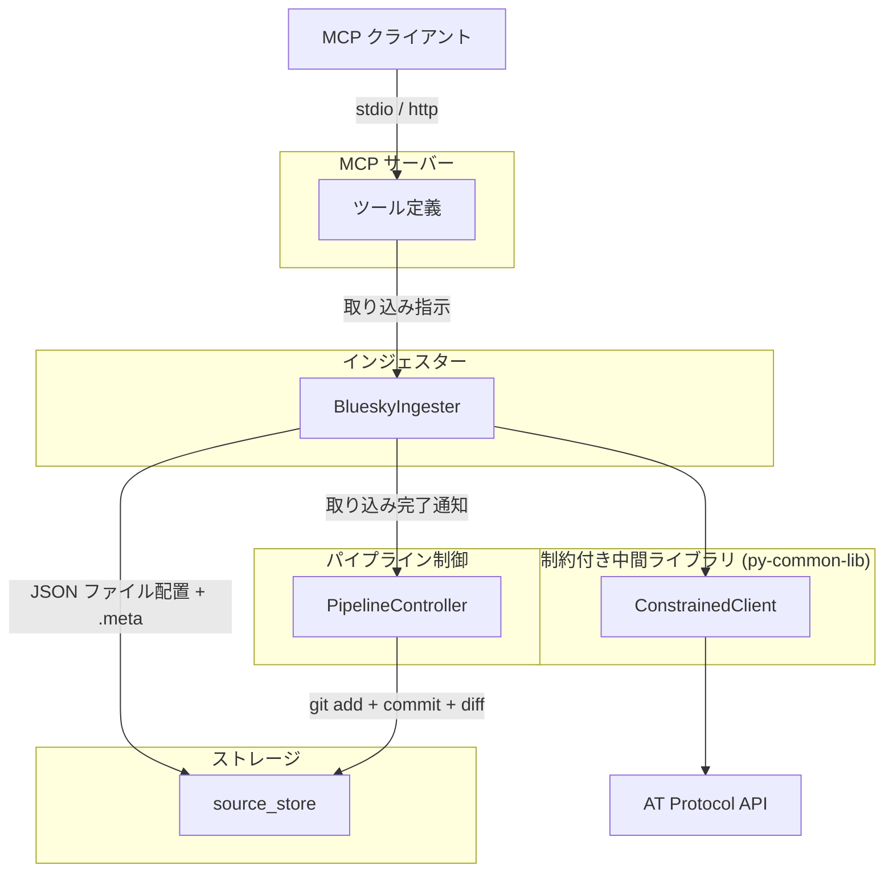
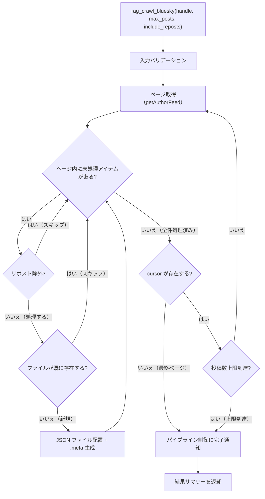

# BlueSky インジェスター

## 概要

> **Note**: 本仕様書は設計先行（`docs(pre-impl)`）で作成している。後続の実装フェーズで既存インジェスターを本仕様に基づき再実装する。現行コードとの不整合は意図的である。

BlueSky（AT Protocol）の投稿を API 経由で取得し、source_store にファイルを配置するインジェスター。`app.bsky.feed.getAuthorFeed` API を使用し、指定ユーザーの統一タイムライン（投稿・リポスト・リプライ混在）を一括取得する。

新アーキテクチャでは、インジェスターの責務は「source_store へのファイル配置 + .meta サイドカーファイルの生成」に限定される。テキスト変換・チャンキング・インデックス構築は後続ステージ（コンバーター・インデクサー）が行う。

スコープ:

- 指定ユーザーの統一タイムラインの取得（投稿・引用リポスト・リポスト・リプライ）
- リポストのフィルタリング（`include_reposts` パラメータによる除外制御）
- source_store への JSON ファイル配置と .meta サイドカーファイルの生成
- MCP ツールとしての投稿取り込みインターフェースの提供

スコープ外:

- 他ユーザーの投稿の個別取得（タイムラインに含まれるリポスト・引用を除く）
- 投稿の作成・編集・削除（読み取り専用）
- DM（ダイレクトメッセージ）の取得
- フォロー・いいね等のソーシャルデータの取得
- テキスト変換・チャンキング・インデックス構築（コンバーター・インデクサーの範疇）
- metadata.db への直接アクセス（パイプライン制御が .meta を読んで実行する）
- git 操作（パイプライン制御の範疇）

## 背景

- 従来のインジェスターはデータ取得からチャンキング・インデックス構築まで一貫して行っていたが、3段パイプラインへの移行により責務が分離された
- 新アーキテクチャでは source_store にオリジナルデータ（JSON）を保存し、Embedding モデルやチャンクパラメータの変更時に外部 API アクセスなしで再構築を可能にする
- AT Protocol API を使用し、認証不要の公開 API 経由で BlueSky の投稿データを取得する

## 制約

### 責務の限定

- **metadata.db アクセス禁止**: metadata.db に直接アクセスしない。DB 登録はパイプライン制御が .meta を読んで実行する
- **git 操作禁止**: git 操作（init、add、commit、diff）はパイプライン制御のみが実行する
- **オリジナルデータの無加工保存**: API から取得したフィードアイテムの JSON データをそのまま source_store に配置する。テキスト変換やメタデータ埋め込み等の加工を行わない
- **ファイル削除禁止**: source_store 内のファイルの物理削除は一切行わない

### 外部 HTTP リクエスト

- ConstrainedClient（py-common-lib）経由で実行する
- ハードリミット（コード内定数。設定・引数・環境変数で緩和不可。厳格化は可能）:
  - 操作あたりリクエスト総数上限: 500（ConstrainedClient 共通）
  - 最低リクエスト間隔: 0.1 秒（ConstrainedClient 共通。ページネーション走査中の各リクエスト間を含む全外部リクエスト間に適用）
  - 操作全体タイムアウト: 600 秒（許容範囲 1〜600 秒、ConstrainedClient 共通）
  - 投稿取得上限: 1000 件（BlueSky インジェスター固有。タイムライン全体に適用。リポストを含む全アイテムが対象）
- サーキットブレーカー: 5 回連続失敗で操作全体を中断する（ConstrainedClient 共通）

### バリデーション

- バリデーションとクランプの使い分け:
  - **バリデーションエラー（拒否）**: 型不正（非整数など）、0、負数。これらは明らかな誤入力であり、クランプで救済しない
  - **クランプ（警告ログ付き）**: 正の整数だが許容範囲外（例: `max_posts=2000` → 1000 にクランプ）。意図的な大きい値の指定を安全な範囲に制限する
- `--no-limit` 等の制約バイパス手段は一切設けない
- `0 = 無制限` のセマンティクスを排除する

## 想定プロファイル

### rag_crawl_bluesky（BlueSky 投稿一括取り込み）

`max_posts` はタイムライン全体（リポスト含む）に適用される。

| 項目 | 内容 |
|------|------|
| 最悪ケースリクエスト数 | ceil(1000/100) = 10。引用元テキストは `getAuthorFeed` のレスポンスに展開済みのため追加リクエスト不要。バジェットトラッカー上限 500 の範囲内 |
| 最悪ケース所要時間 | 10 × 0.1 秒（ハードリミット最小間隔での理論最短）= 1 秒。デフォルト設定（1.0 秒間隔）で 10 秒。操作全体タイムアウト 600 秒の範囲内 |
| 想定エラー率 | AT Protocol API 依存。リトライ機構なし（失敗したリクエストは再試行しない）。ConstrainedClient が連続失敗を監視し、5 回連続失敗でサーキットブレーカーが発動して操作を中断する。中断時は取得済みデータを処理する |

## 安全制約

| 制約名 | 種別 | 値 | 解除可否 |
|--------|------|-----|---------|
| metadata.db 直接アクセス禁止 | ハードリミット | インジェスターから metadata.db への読み書きを禁止 | 不可 |
| git 操作禁止 | ハードリミット | インジェスターから git コマンドの直接呼び出しを禁止 | 不可 |
| ファイル物理削除禁止 | ハードリミット | source_store 内のファイル削除を禁止 | 不可 |
| 操作あたりリクエスト総数上限 | ハードリミット | 500 | 引き上げ不可（引き下げ可） |
| 最低リクエスト間隔 | ハードリミット | 0.1 秒 | 引き下げ不可（引き上げ可） |
| 操作全体タイムアウト | ハードリミット | 600 秒、許容範囲 1〜600 秒 | 引き上げ不可（引き下げ可、下限 1 秒） |
| サーキットブレーカー閾値 | ハードリミット | 5 回連続失敗 | 引き上げ不可（引き下げ可） |
| 投稿取得上限 | ハードリミット | 1000 件（タイムライン全体。リポストを含む全アイテムが対象） | 引き上げ不可（引き下げ可） |
| 取得投稿数 | 設定値 | 許容範囲 1〜1000、デフォルト 200 | 範囲内で変更可 |
| リクエストタイムアウト | 設定値 | 許容範囲 1〜120 秒、デフォルト 30 秒 | 範囲内で変更可 |
| リクエスト間隔 | 設定値 | 許容範囲 0.1〜60 秒、デフォルト 1.0 秒 | 範囲内で変更可 |
| 生 HTTP クライアント利用禁止 | CI チェック | `src/` 全体を grep で走査（httpx / aiohttp / requests / urllib.request）。`# safety:allowed` 行を除外。ConstrainedClient は py-common-lib パッケージで提供（`src/` 外のため検出対象外） | 許可例外は `# safety:allowed` コメントで可 |

テスト実行時の安全な値: 投稿取得上限 3 件で実行する。異常値テスト（0、負数、上限超過）を含めること。

## インターフェース

### MCP ツール

| ツール | 入力 | 振る舞い |
|--------|------|---------|
| rag_crawl_bluesky | handle、max_posts（任意）、include_reposts（任意） | 指定ユーザーの BlueSky 投稿を AT Protocol API 経由で取得し、source_store に JSON ファイルとして配置する。BlueSky は投稿編集不可のため、既存ファイルと一致する投稿はスキップする |

ツール入力パラメータ:

| パラメータ | 型 | 必須 | 説明 |
|-----------|-----|------|------|
| `handle` | 文字列 | はい | BlueSky ハンドル（例: `user.bsky.social`）。DID 形式（`did:` 始まり）はバリデーションで拒否する |
| `max_posts` | 整数 | いいえ | 取得する最大投稿数（タイムライン全体に適用）。デフォルト: 200、許容範囲: 1〜1000 |
| `include_reposts` | 真偽値 | いいえ | タイムラインにリポストを含めるか。`false` の場合、リポスト（`reason.$type` が `app.bsky.feed.defs#reasonRepost` のアイテム）を除外する。デフォルト: `true` |

ツール出力: 取り込み結果のサマリーテキスト（配置ファイル数、スキップ数、エラー数）

プレビュー機能は提供しない。BlueSky の投稿一覧は公開情報（`https://bsky.app/profile/{handle}` で閲覧可能）であり、取り込み前の確認は BlueSky 上で直接行える。

### 設定項目

| 設定項目 | 型 | 保管先 | デフォルト | 許容範囲 | 内容 |
|---------|-----|--------|-----------|---------|------|
| `rag_bluesky_appview_url` | 文字列 | `config.toml` | `https://public.api.bsky.app` | 有効な HTTPS URL | AppView のベース URL |
| `rag_bluesky_max_posts` | 整数 | `config.toml` | 200 | 1〜1000 | 取得する最大投稿数（タイムライン全体に適用） |
| `rag_bluesky_request_timeout` | 整数 | `config.toml` | 30 | 1〜120 | リクエストタイムアウト（秒） |
| `rag_bluesky_request_interval` | 小数 | `config.toml` | 1.0 | 0.1〜60 | リクエスト間の最低間隔（秒） |
| `rag_bluesky_include_reposts` | 真偽値 | `config.toml` | true | true/false | タイムラインにリポストを含めるか |

## コンポーネント構成

### BlueSky インジェスターの位置付け



### コンポーネント一覧

| コンポーネント | 役割 |
|--------------|------|
| BlueskyIngester | BlueSky 投稿取り込み用インジェスター。AT Protocol API 経由で投稿を取得し、source_store に JSON ファイルを配置する |
| ConstrainedClient (py-common-lib) | 全外部 HTTP リクエストのゲートウェイ。ハードリミット・バジェット・サーキットブレーカーを統合する |

### source_id

AT URI 形式を使用する: `at://{did}/app.bsky.feed.post/{rkey}`

- `did`: `post.author.did` から取得した DID（例: `did:plc:xxx`）。リポストの場合は元投稿者の DID
- `rkey`: `post.uri` の末尾パス（`at://did:plc:xxx/app.bsky.feed.post/{rkey}` の `{rkey}` 部分）

AT URI を source_id に採用する理由:

- DID はハンドル変更の影響を受けない安定した識別子であり、再取り込み時の重複検出が確実に機能する
- ハンドルは変更可能なため、HTTPS URL 形式（`https://bsky.app/profile/{handle}/post/{rkey}`）では同一投稿に対して異なる source_id が生成されるリスクがある

### ディレクトリ構成

source_store 内の配置先: `bluesky/{did}/{year}/{month}/{rkey}.json`

DID に含まれるコロン（`:`）は Windows のファイルパス禁止文字のため、[source-store.md](../source-store.md) の「禁止文字の全角代替」規則に従い全角コロン（`：`）に置換する。

```
source_store/
  bluesky/
    did：plc：abc123/
      2026/
        01/
          xyz789.json
          xyz789.json.meta
        03/
          abc456.json
          abc456.json.meta
```

年月の導出: `post.record.createdAt`（投稿日時）から年（4桁）と月（2桁ゼロ埋め）を抽出する。

変換例:

| 要素 | 元の値 | パス上の値 |
|------|--------|-----------|
| DID | `did:plc:abc123` | `did：plc：abc123` |
| 年 | `2026` | `2026` |
| 月 | `3` | `03` |
| rkey | `xyz789` | `xyz789.json` |
| 完全パス | — | `bluesky/did：plc：abc123/2026/03/xyz789.json` |

### 保存形式

各投稿を `getAuthorFeed` レスポンスのフィードアイテムそのままの JSON として保存する。API から取得したデータに加工は行わない。

保存される JSON の構造（フィードアイテム）:

```json
{
  "post": {
    "uri": "at://did:plc:abc123/app.bsky.feed.post/xyz789",
    "cid": "...",
    "author": { "did": "did:plc:abc123", "handle": "alice.bsky.social", "displayName": "Alice" },
    "record": { "text": "投稿テキスト", "createdAt": "2026-01-15T09:00:00Z", "embed": null },
    "embed": null
  },
  "reason": null
}
```

リポストの場合は `reason` フィールドにリポスト情報が含まれる:

```json
{
  "post": {
    "uri": "at://did:plc:other/app.bsky.feed.post/abc456",
    "author": { "did": "did:plc:other", "handle": "bob.bsky.social" },
    "record": { "text": "元投稿のテキスト", "createdAt": "..." }
  },
  "reason": {
    "$type": "app.bsky.feed.defs#reasonRepost",
    "by": { "did": "did:plc:abc123", "handle": "alice.bsky.social" },
    "indexedAt": "2026-01-16T10:00:00Z"
  }
}
```

### .meta サイドカーファイルの生成

各 JSON ファイルと同階層に `.meta` サイドカーファイルを YAML 形式で生成する。フィールド定義は [source-store.md](../source-store.md) の「.meta サイドカーファイル」セクションに準拠する。

共通フィールド:

| フィールド | 導出元 |
|-----------|--------|
| `source_id` | `at://{post.author.did}/app.bsky.feed.post/{rkey}` |
| `source_type` | `"bluesky"` |
| `title` | `post.record.text` の先頭 50 文字（50 文字を超える場合は末尾に `...` を付加） |
| `collected_at` | 取り込み実行時のタイムスタンプ（ISO 8601） |

媒体別フィールド:

| フィールド | 型 | 導出元 |
|-----------|-----|--------|
| `handle` | str | `post.author.handle`（元投稿者のハンドル。リポスト時も元投稿者） |
| `did` | str | `post.author.did` |
| `rkey` | str | `post.uri` の末尾パス |
| `url` | str | `https://bsky.app/profile/{handle}/post/{rkey}` |
| `created_at` | str | `post.record.createdAt`（ISO 8601） |
| `has_images` | bool | `post.record.embed` に画像データが含まれるか |
| `has_video` | bool | `post.record.embed` に動画データが含まれるか |
| `has_external_link` | bool | `post.record.embed` に外部リンクが含まれるか |
| `is_reply` | bool | `post.record.reply` が存在するか |
| `is_repost` | bool | フィードアイテムの `reason.$type` が `app.bsky.feed.defs#reasonRepost` か |

.meta ファイル例:

```yaml
source_id: "at://did:plc:abc123/app.bsky.feed.post/xyz789"
source_type: bluesky
title: "Sample post text"
collected_at: "2026-01-15T10:30:00+09:00"
handle: "alice.bsky.social"
did: "did:plc:abc123"
rkey: "xyz789"
url: "https://bsky.app/profile/alice.bsky.social/post/xyz789"
created_at: "2026-01-15T09:00:00Z"
has_images: false
has_video: false
has_external_link: true
is_reply: false
is_repost: false
```

### 投稿一括取り込みフロー



### タイムライン走査の処理手順

1. `getAuthorFeed` API に `actor={handle}`、`limit=100` でリクエストを送信する
2. レスポンスから `feed` 配列を取得する
3. 各フィードアイテムを処理する:
   - `include_reposts` が `false` かつ `reason.$type` が `app.bsky.feed.defs#reasonRepost` の場合、スキップする
   - `post.uri` から `did` と `rkey` を抽出する
   - ファイルパスを導出し、source_store にファイルが存在するか確認する（重複検出）
   - 存在しない場合: フィードアイテムの JSON をファイルとして配置し、.meta を生成する
   - 存在する場合: スキップする
4. 終了判定（以下のいずれかで走査を終了する）:
   - `cursor` がレスポンスに存在しない（最終ページ）
   - 投稿数上限に到達
   - バジェット上限に到達（ConstrainedClient）
   - サーキットブレーカー発動（ConstrainedClient）
5. 終了条件を満たさない場合、`cursor` の値でリクエストパラメータを更新し、手順 1 に戻る
6. 全フィードアイテムの処理が完了したら、パイプライン制御に取り込み完了を通知する

### リポスト判定

フィードアイテムに `reason` フィールドが存在し、`reason.$type` が `app.bsky.feed.defs#reasonRepost` の場合、そのアイテムはリポストである。

リポスト時の振る舞い:

- `include_reposts` が `false` の場合: フィードアイテムをスキップする
- `include_reposts` が `true` の場合: 元投稿のデータを保存する。source_id・ファイルパスは元投稿者の DID と rkey から導出する。.meta の `is_repost` を `true` にする

リポストの元投稿が `post` オブジェクトにそのまま含まれるため、追加の API リクエストは不要。

### 重複検出

ファイルシステムベースで行う（[ingesters/common.md](common.md) の重複検出方式に準拠）。

1. source_id（AT URI）からファイルパスを導出する
2. source_store 内の該当パスにファイルが存在するか確認する
3. 存在する場合: スキップする（BlueSky は投稿編集不可のため上書き不要）
4. 存在しない場合: 新規ファイルとして配置する

タイムライン内で同一投稿が重複して出現する場合（リポストと元投稿の両方がタイムラインに含まれる等）も、ファイルパスの一致で重複を検出しスキップする。

### 再取り込み時の挙動

BlueSky は投稿の編集が不可能なため、既存ファイルと一致する投稿はスキップする（上書き不要）。スキップ件数はサマリーに含めて返却する。

BlueSky 上で削除された投稿は source_store に残り続ける。削除同期（差分検出による自動削除）は行わない。ユーザーが `rag_delete` で手動削除する運用とする。

### スレッドの扱い

スレッド（連続投稿）は個別投稿として取り込む（結合しない）。各投稿が独立した JSON ファイルとして source_store に配置される。

### テキスト抽出フィールドパス（コンバーター向け参照情報）

コンバーターが source_store 内の JSON ファイルからテキストを抽出する際に参照するフィールドパスを定義する。投稿は最大 300 文字（grapheme 単位）の短文であり、Markdown 変換は不要。プレーンテキストとして抽出する。

テキスト抽出は `post.record`（raw record）から行う。`post.record` の embed の `$type` に `#view` サフィックスは付かない。

#### 基本フィールド

| フィールド | パス | 説明 |
|-----------|------|------|
| 投稿テキスト | `post.record.text` | 投稿本文 |
| 画像 ALT テキスト | `post.record.embed.images[].alt` | 画像の代替テキスト |
| 動画 ALT テキスト | `post.record.embed.alt` | 動画の代替テキスト |
| リンクカードタイトル | `post.record.embed.external.title` | 外部リンクのタイトル |
| リンクカード URL | `post.record.embed.external.uri` | 外部リンクの URL |
| リンクカード説明 | `post.record.embed.external.description` | 外部リンクの説明文 |

#### recordWithMedia 時のフィールド

embed の `$type` が `app.bsky.embed.recordWithMedia`（メディア + 引用の複合型）の場合、メディア部分は `embed.media` 配下にネストされる:

| フィールド | パス（recordWithMedia 時） | 説明 |
|-----------|--------------------------|------|
| 画像 ALT テキスト | `post.record.embed.media.images[].alt` | recordWithMedia 時の画像 ALT |
| 動画 ALT テキスト | `post.record.embed.media.alt` | recordWithMedia 時の動画 ALT |
| リンクカードタイトル | `post.record.embed.media.external.title` | recordWithMedia 時のリンクタイトル |
| リンクカード URL | `post.record.embed.media.external.uri` | recordWithMedia 時のリンク URL |
| リンクカード説明 | `post.record.embed.media.external.description` | recordWithMedia 時のリンク説明 |

#### 引用元投稿テキスト

引用リポスト（`post.record.embed.$type` が `app.bsky.embed.record` または `app.bsky.embed.recordWithMedia`）を検出した場合、引用元テキストを `post.embed`（view 版、API レスポンスに展開済み）から取得する:

| embed の $type | 引用元テキストのパス |
|----------------|-------------------|
| `app.bsky.embed.record` | `post.embed.record.value.text` |
| `app.bsky.embed.recordWithMedia` | `post.embed.record.record.value.text` |

引用元が投稿以外（スターターパック、フィードジェネレーター等）の場合は `value` キーが存在しない。この場合は引用元テキストなしとして扱う。

#### 抽出対象外

- 動画キャプション（VTT）

#### テキスト構造

コンバーターが抽出したテキストは以下の構造で構築する。各セクションは空行で区切る。該当するセクションがない場合は省略する。

```
[Repost: @元投稿者ハンドル]
投稿テキスト

[Image ALT] 画像の代替テキスト（複数ある場合は改行で連結）
[Video ALT] 動画の代替テキスト

[Link Card]
Title: 外部リンクのタイトル
URL: 外部リンクの URL
Description: 外部リンクの説明文

[Quote]
引用元の投稿テキスト
```

- リポストの場合、先頭に `[Repost: @元投稿者ハンドル]` ヘッダーを付与する。元投稿者のハンドルは `post.author.handle` から取得する
- 投稿テキストを先頭に配置する（検索ヒット時に最も重要な情報が先頭に来る）
- 画像/動画 ALT テキストは `[Image ALT]` / `[Video ALT]` プレフィックスで区別する
- リンクカードは `[Link Card]` セクション内に構造化する
- 引用元テキストは `[Quote]` セクションに配置する
- セクションラベルは英語表記とする（LLM による検索・解釈の精度向上のため）

### チャンキング方針（インデクサー向け参照情報）

BlueSky の投稿は最大 300 文字の短文であり、1 投稿が意味の最小単位である。チャンカーによる文字数ベースの分割は URL の分断やコンテキストの喪失を招くため、1 投稿 = 1 チャンクで格納することを推奨する。

## 外部連携

### AT Protocol API

本インジェスターでは AppView（公開 API ゲートウェイ）経由で BlueSky のデータを取得する。AppView はユーザーのデータを集約して提供する公開 API であり、認証不要でアクセスできる。

AppView のベース URL は設定可能とし、デフォルトは `https://public.api.bsky.app`（BlueSky 公式 AppView）とする。

| 連携先 | 用途 | 接続方式 |
|--------|------|---------|
| AT Protocol AppView（デフォルト: public.api.bsky.app） | 投稿の取得 | REST API（ConstrainedClient 経由） |

#### getAuthorFeed エンドポイント（タイムライン取得）

| 項目 | 内容 |
|------|------|
| URL | `{appview_url}/xrpc/app.bsky.feed.getAuthorFeed`（デフォルト: `https://public.api.bsky.app/xrpc/app.bsky.feed.getAuthorFeed`） |
| メソッド | GET |
| 認証 | 不要（公開 API） |
| ページサイズ | `limit` パラメータで指定（最大 100） |
| ページネーション | レスポンスの `cursor` フィールド。存在しない場合は最終ページ |

クエリパラメータ:

| パラメータ | 型 | 必須 | 説明 |
|-----------|-----|------|------|
| `actor` | 文字列 | はい | ハンドルまたは DID（例: `user.bsky.social`） |
| `limit` | 整数 | いいえ | 1 ページあたりの取得件数（最大 100） |
| `cursor` | 文字列 | いいえ | ページネーションカーソル |

レスポンス構造:

| フィールド | 型 | 説明 |
|-----------|-----|------|
| `feed` | 配列 | フィードアイテムの配列 |
| `cursor` | 文字列 or 不在 | 次ページのカーソル。最終ページでは存在しない |

フィードアイテムの主要フィールド:

| フィールド | 型 | 説明 |
|-----------|-----|------|
| `post` | オブジェクト | 投稿オブジェクト（投稿データ・投稿者情報を含む） |
| `reason` | オブジェクト or 不在 | リポスト理由。リポストの場合のみ存在する |

投稿オブジェクト（`post`）の主要フィールド:

| フィールド | 型 | 説明 |
|-----------|-----|------|
| `uri` | 文字列 | AT URI（例: `at://did:plc:xxx/app.bsky.feed.post/rkey`） |
| `cid` | 文字列 | コンテンツ ID |
| `author` | オブジェクト | 投稿者情報（`did`、`handle`、`displayName` 等） |
| `record` | オブジェクト | 投稿レコード本体（raw record） |
| `embed` | オブジェクト or 不在 | 展開済み embed（view 版。`$type` に `#view` サフィックスが付く） |

投稿レコード（`record`）の主要フィールド:

| フィールド | 型 | 説明 |
|-----------|-----|------|
| `text` | 文字列 | 投稿テキスト（最大 300 grapheme） |
| `createdAt` | 文字列 | 投稿日時（ISO 8601） |
| `embed` | オブジェクト | 添付コンテンツ（raw 形式。`#view` サフィックスなし） |
| `reply` | オブジェクト | リプライ先情報（リプライの場合） |

リポスト理由（`reason`）:

| フィールド | 型 | 説明 |
|-----------|-----|------|
| `$type` | 文字列 | `app.bsky.feed.defs#reasonRepost`（リポストの場合） |
| `by` | オブジェクト | リポストしたユーザーの情報（`did`、`handle` 等） |
| `indexedAt` | 文字列 | リポスト日時（ISO 8601） |

#### getRecord エンドポイント（個別レコード取得）

タイムライン一括取得（`rag_crawl_bluesky`）では使用しない。AT URI 指定による個別投稿取得が必要になった場合に利用可能なエンドポイントとして記載する。

| 項目 | 内容 |
|------|------|
| URL | `{appview_url}/xrpc/com.atproto.repo.getRecord`（デフォルト: `https://public.api.bsky.app/xrpc/com.atproto.repo.getRecord`） |
| メソッド | GET |
| 認証 | 不要（AppView がプロキシ） |

クエリパラメータ:

| パラメータ | 型 | 必須 | 説明 |
|-----------|-----|------|------|
| `repo` | 文字列 | はい | DID またはハンドル（レコード所有者） |
| `collection` | 文字列 | はい | レコードコレクション（例: `app.bsky.feed.post`） |
| `rkey` | 文字列 | はい | レコードキー（AT URI の末尾パス） |
| `cid` | 文字列 | いいえ | 特定バージョンの CID（省略時は最新） |

レスポンス構造:

| フィールド | 型 | 説明 |
|-----------|-----|------|
| `uri` | 文字列 | AT URI |
| `cid` | 文字列 | コンテンツ ID |
| `value` | オブジェクト | レコード本体（投稿レコードと同じ構造） |

エラーレスポンス:

| HTTP ステータス | 意味 | 対応 |
|----------------|------|------|
| 400 | パラメータ不正 | エラーログ出力 |
| 404（`RecordNotFound`） | レコードが存在しない（削除済み等） | 警告ログ出力 |
| 502 / 503 / 504 | サーバーエラー | エラーログ出力、サーキットブレーカーに計上 |

#### API 選定理由

`listRecords` ではなく `getAuthorFeed` を採用する理由:

- `getAuthorFeed` は投稿・リポスト・リプライを時系列の統一タイムラインとして返すため、`max_posts` をタイムライン全体に一貫して適用できる
- リポストの元投稿データがレスポンスに含まれるため、`getRecord` による追加リクエストが不要
- 引用リポストの引用元テキストもレスポンスに展開済みで含まれるため、追加リクエストが不要
- `listRecords` では投稿とリポストが別系統のため `max_posts` の一貫した適用が困難

`getAuthorFeed` の既知の制約:

- 約 1,950 件でカーソルが消失するバグがある。ただし `max_posts` のハードリミットが 1000 件のため、本インジェスターの利用範囲では影響しない

## エッジケース

| ケース | 振る舞い |
|--------|---------|
| ハンドルが存在しない | API がエラーを返す。エラーメッセージとして「指定されたハンドルが見つかりません」を返す |
| ユーザーの投稿が 0 件 | 空の `feed` 配列。0 件取得として正常終了する |
| `getAuthorFeed` API のレスポンス形式変更 | JSON パースエラーまたは必須フィールド欠落として処理を中断する。エラーの詳細をログ出力する |
| 投稿レコードの `text` フィールドが空 | JSON ファイルとして保存する（テキスト抽出・スキップ判定はコンバーターの責務） |
| 同一投稿の重複（タイムライン内） | ファイルパスの一致で重複を検出し、2 件目以降をスキップする |
| 既存ファイルとの一致 | スキップする（BlueSky は投稿編集不可のため上書き不要） |
| 取り込み済み投稿が BlueSky 上で削除された | source_store に残る。削除同期は行わない。ユーザーが `rag_delete` で手動削除する |
| 大量投稿ユーザー（1000 件超） | 投稿取得上限（1000 件）で打ち切る。取得済み投稿を処理し、上限到達の旨を警告ログに出力する |
| バジェット上限到達 | 取得済みデータを処理してパイプライン制御に通知し、上限到達の旨をログ出力する |
| サーキットブレーカー発動 | 操作を中断し、取得済みデータを処理してパイプライン制御に通知する。エラーの詳細をログ出力する |
| 操作全体タイムアウト | 操作を中断し、取得済みデータを処理してパイプライン制御に通知する |
| 設定値がハードリミット超過（正の整数） | ハードリミット値にクランプし、警告ログを出力する |
| `max_posts` に 0 や負数を指定 | バリデーションエラーとして拒否する（クランプ対象外。制約セクション参照） |
| `handle` が空文字列 | バリデーションエラーとして拒否する |
| `handle` に DID 形式（`did:` 始まり）が指定された | バリデーションエラーとして拒否する |
| 引用元が投稿以外（スターターパック等） | 引用元テキストなしとして扱う。エラーにしない |
| AT Protocol のレート制限（429） | ConstrainedClient のサーキットブレーカーで検出される。連続失敗として計上し、閾値超過で操作を中断する |
| .meta ファイルの書き込みに失敗した場合 | ファイル物理削除禁止制約により、配置済み JSON ファイルのロールバックは行わない。エラーログを出力して処理を続行する |
| DID に含まれるコロンのパス変換 | 全角コロン（`：`）に置換して Windows パス互換性を確保する |

## 関連ドキュメント

- [ingesters/common.md](common.md) — インジェスター共通仕様（責務・制約・重複検出方式）
- [source-store.md](../source-store.md) — source_store 仕様（ディレクトリ構成、.meta 形式、URL パス変換）
- [pipeline-controller.md](../pipeline-controller.md) — パイプライン制御仕様（git 操作、ステージ間連携）
