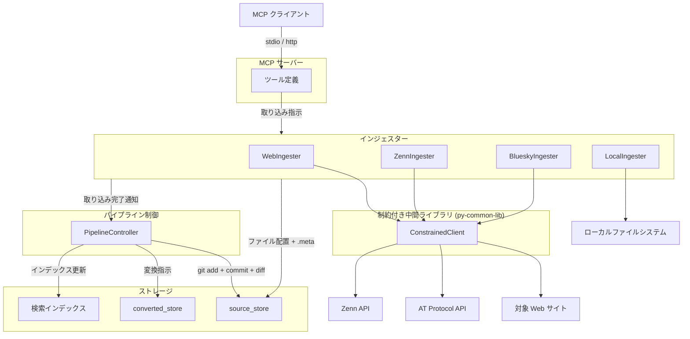

# インジェスター共通仕様

## 概要

> **Note**: 本仕様書は設計先行（`docs(pre-impl)`）で作成している。後続の実装フェーズで既存インジェスターを本仕様に基づき再実装する。現行コードとの不整合は意図的である。

インジェスターは各媒体からデータを取得し、source_store にファイルを配置するコンポーネントである。新アーキテクチャでは、インジェスターの責務は「source_store へのファイル配置 + .meta サイドカーファイルの生成」に限定される。

本仕様書はインジェスター共通の設計・制約を定義する。各媒体固有の仕様は媒体別仕様書を参照。

| 媒体 | 仕様書 |
|------|--------|
| Web | [web.md](web.md) |
| BlueSky | [bluesky.md](bluesky.md) |
| Zenn | [zenn.md](zenn.md) |
| Local | [local.md](local.md) |

スコープ:

- インジェスター共通の制約・安全制約
- ファイルシステムベースの重複検出方式
- .meta サイドカーファイル生成の共通ルール
- パイプライン制御への完了通知
- MCP ツール一覧（共通の変更点）

スコープ外:

- metadata.db への直接アクセス（パイプライン制御が .meta を読んで実行する）
- git 操作（パイプライン制御の範疇）
- テキスト変換・チャンキング・インデックス構築（コンバーター・インデクサーの範疇）
- ファイルの物理削除（source_store の制約）
- 各媒体固有の取得ロジック・API 連携・フォルダ階層（各媒体仕様書の範疇）

## 背景

- 従来のインジェスターはデータ取得からチャンキング・インデックス構築まで一貫して行っていたが、Embedding モデル変更時の再構築や変換方式変更への対応が困難だった
- 3段パイプライン（インジェスター → コンバーター → インデクサー）への移行により、責務を分離し各ステージの独立性を確保する
- インジェスターが metadata.db に依存しない設計とすることで、DB 破損時も source_store からの再構築が可能となる

## 制約

### 責務の限定

- **metadata.db アクセス禁止**: インジェスターは metadata.db に直接アクセスしない。DB 登録はパイプライン制御が .meta を読んで実行する
- **git 操作禁止**: git 操作（init、add、commit、diff）はパイプライン制御のみが実行する。インジェスターは git コマンドを直接呼び出さない
- **オリジナルデータの無加工保存**: 取得したデータに加工（テキスト変換、メタデータ埋め込み等）を行わず、オリジナルのまま source_store に配置する
- **ファイル削除禁止**: source_store 内のファイルの物理削除は一切行わない

### 外部 HTTP リクエスト

- ConstrainedClient（py-common-lib）経由で実行する
- ConstrainedClient の共通ハードリミット:
  - 操作あたりリクエスト総数上限: 500
  - 最低リクエスト間隔: 0.1 秒
  - 操作全体タイムアウト: 600 秒（許容範囲 1〜600 秒）
  - サーキットブレーカー: 5 回連続失敗で操作全体を中断
- 媒体固有のリクエスト設定（間隔、タイムアウト等）は各媒体仕様書で定義する
- local 媒体は外部 HTTP リクエストを行わない

### 重複検出

- ファイルシステムベースで行う。source_id からファイルパスを導出し、ファイルの存在有無で判定する
- metadata.db には依存しない

## 安全制約

| 制約名 | 種別 | 値 | 解除可否 |
|--------|------|-----|---------|
| metadata.db 直接アクセス禁止 | ハードリミット | インジェスターから metadata.db への読み書きを禁止 | 不可 |
| git 操作禁止 | ハードリミット | インジェスターから git コマンドの直接呼び出しを禁止 | 不可 |
| ファイル物理削除禁止 | ハードリミット | source_store 内のファイル削除を禁止 | 不可 |
| 操作あたりリクエスト総数上限 | ハードリミット | 500 | 引き上げ不可（引き下げ可） |
| 最低リクエスト間隔 | ハードリミット | 0.1 秒 | 引き下げ不可（引き上げ可） |
| 操作全体タイムアウト | ハードリミット | 600 秒、許容範囲 1〜600 秒 | 引き上げ不可（引き下げ可、下限 1 秒） |
| サーキットブレーカー閾値 | ハードリミット | 5 回連続失敗 | 引き上げ不可（引き下げ可） |

媒体固有の安全制約（リクエスト間隔のデフォルト値等）は各媒体仕様書で定義する。

## インターフェース

### インジェスター操作一覧

各インジェスターが提供する操作。取り込み操作の出力は source_store へのファイル配置であり、パイプライン制御への取り込み完了通知を含む。

| 操作 | 媒体 | MCP ツール | 概要 |
|------|------|-----------|------|
| 単一ページ取り込み | web | `rag_add` | 単一ページを HTTP 取得し配置 |
| 一括クロール | web | `rag_crawl` | リンク集から一括取得して配置 |
| クロールプレビュー | web | `rag_crawl_preview` | クロール対象のタイトル・URL 一覧を返す（配置なし） |
| BlueSky 投稿取り込み | bluesky | `rag_crawl_bluesky` | タイムラインから投稿を取得して配置 |
| Zenn コンテンツ取り込み | zenn | `rag_crawl_zenn` | Zenn API から記事・スクラップを取得して配置 |
| 単一ドキュメント取り込み | local | `rag_add_document` | 指定ファイルを local/ にコピー |
| ディレクトリ一括取り込み | local | `rag_crawl_documents` | glob パターンで検索してコピー |

各操作の入力パラメータ・振る舞い・エッジケースは媒体別仕様書を参照。

### MCP ツールの共通変更点

既存の MCP ツール名・パラメータを維持する。内部的な処理フローが以下のように変更される:

- **出力形式**: 従来のチャンク数を含むサマリーに代わり、source_store への配置結果（配置ファイル数、スキップ数、エラー数）を返す
- **source_id**: 各媒体の source_id 決定方式は [source-store.md](../source-store.md) の定義に従う
- **重複検出**: metadata.db / ベクトル DB 照合からファイルシステム存在チェックに変更（本仕様書の「重複検出方式」セクション参照）

### 設定項目

インジェスター共通の追加設定はない。source_store のパスは [source-store.md](../source-store.md) の `SOURCE_STORE_DIR` を使用する。各媒体固有の設定は媒体別仕様書で定義する。

## コンポーネント構成

### 新アーキテクチャでのインジェスターの位置付け

### 従来アーキテクチャとの比較

| 項目 | 従来 | 新アーキテクチャ |
|------|------|----------------|
| データ保存先 | ベクトル DB に直接格納 | source_store にファイル配置 |
| テキスト変換 | インジェスター内で実行 | コンバーターに委譲 |
| チャンキング | インジェスター内で実行 | インデクサーに委譲 |
| インデックス構築 | インジェスター内で実行 | インデクサーに委譲 |
| metadata.db | インジェスターが直接操作 | パイプライン制御が .meta を読んで操作 |
| git 管理 | なし | パイプライン制御が git 操作を実行 |
| 重複検出 | metadata.db / ベクトル DB の source_id 照合 | ファイルシステム上のパス存在チェック |
| 再構築 | 外部 API への再アクセスが必要 | source_store からオフラインで再構築可能 |

### .meta サイドカーファイルの生成

インジェスターは local 以外の媒体で .meta サイドカーファイルを生成する。.meta のフォーマット（共通フィールド、媒体別フィールド、YAML 形式）は [source-store.md](../source-store.md) の「.meta サイドカーファイル」セクションに定義済み。

生成タイミング: データファイルの配置直後に同階層に .meta を生成する。正常時はデータファイルと .meta がペアで存在する。.meta の書き込みに失敗した場合は欠落し得る（フォールバック動作は [source-store.md](../source-store.md) のエッジケースに定義済み）。

### 重複検出方式

インジェスターは metadata.db に依存せず、ファイルシステムのみで重複を検出する。

| 媒体 | source_id | ファイルパス導出 | 重複時の動作 |
|------|-----------|----------------|-------------|
| web | URL | URL パス変換規則で一意に決定 | 上書き |
| bluesky | AT URI | DID + 年月 + rkey で一意に決定 | スキップ |
| zenn | Zenn URL | username + slug で一意に決定 | 上書き |
| local | 相対パス | ユーザー指定パスで一意に決定 | 上書き |

重複検出の手順:

1. source_id からファイルパスを導出する（各媒体の変換規則に基づく）
2. source_store 内の該当パスにファイルが存在するか確認する
3. 存在する場合: 媒体の方針に従い上書きまたはスキップする
4. 存在しない場合: 新規ファイルとして配置する

### パイプライン制御への完了通知

インジェスターがファイル配置を完了した後、パイプライン制御に取り込み完了を通知する。パイプライン制御は通知を受けて以下を実行する:

1. source_store で `git add -A` + `git commit` を実行
2. `git diff` で変更ファイルを特定
3. 変更ファイルをコンバーター → インデクサーで処理

詳細は [pipeline-controller.md](../pipeline-controller.md) の「インジェスター実行後のフロー」を参照。

## エッジケース

| ケース | 振る舞い |
|--------|---------|
| source_store ディレクトリが存在しない場合 | パイプライン制御がインジェスター起動前に source_store の存在を確認し、未作成であればディレクトリ作成と git リポジトリの初期化を行う。インジェスターはディレクトリの存在を前提とする |
| .meta ファイルの書き込みに失敗した場合 | ファイル物理削除禁止制約により、配置済みデータファイルのロールバックは行わない。エラーログを出力して処理を続行する |
| ファイル配置中にディスク容量不足が発生した場合 | OS エラーをそのまま伝播し、エラーログに記録する |
| 同一 source_id に対する並行実行 | 同一媒体の MCP ツールを並行呼び出ししない運用を前提とする。万一並行書き込みが発生した場合、ファイルシステムの最終書き込み結果が採用される |
| source_store のパス変換で Windows 禁止文字を含む URL | [source-store.md](../source-store.md) の「URL パス変換規則」に従い全角文字に代替する |

媒体固有のエッジケース（API エラー、バジェット上限、サーキットブレーカー等）は各媒体仕様書を参照。

## 関連ドキュメント

- [source-store.md](../source-store.md) — source_store 仕様（ディレクトリ構成、.meta 形式、URL パス変換）
- [pipeline-controller.md](../pipeline-controller.md) — パイプライン制御仕様（git 操作、ステージ間連携）
