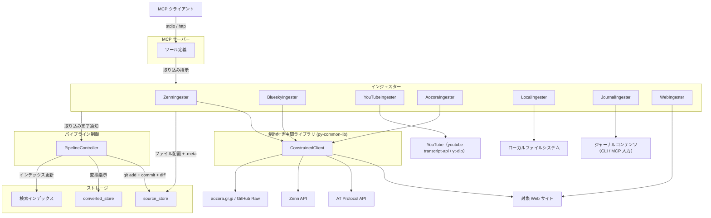

# インジェスター共通仕様

## 概要

インジェスターは各媒体からデータを取得し、source_store にファイルを配置するコンポーネントである。インジェスターの責務は「source_store へのファイル配置 + .meta サイドカーファイルの生成」に限定される。

本仕様書はインジェスター共通の設計・制約を定義する。各媒体固有の仕様は媒体別仕様書を参照。

| 媒体 | 仕様書 |
|------|--------|
| BlueSky | [bluesky.md](bluesky.md) |
| Zenn | [zenn.md](zenn.md) |
| YouTube | [youtube.md](youtube.md) |
| 青空文庫 | [aozora.md](aozora.md) |
| Local | [local.md](local.md) |
| Journal | [journal.md](journal.md) |

スコープ:

- インジェスター共通の制約・安全制約
- ファイルシステムベースの重複検出方式
- .meta サイドカーファイル生成の共通ルール
- パイプライン制御への完了通知
- MCP ツール一覧（共通の変更点）

スコープ外:

- metadata.db への直接アクセス（パイプライン制御が .meta を読んで実行する）
- git 操作（パイプライン制御の範疇）
- テキスト変換・チャンキング・インデックス構築（コンバーター・インデクサーの範疇）
- ファイルの物理削除（source_store の制約）
- 各媒体固有の取得ロジック・API 連携・フォルダ階層（各媒体仕様書の範疇）

## 背景

- 従来のインジェスターはデータ取得からチャンキング・インデックス構築まで一貫して行っていたが、Embedding モデル変更時の再構築や変換方式変更への対応が困難だった
- 3段パイプライン（インジェスター → コンバーター → インデクサー）への移行により、責務を分離し各ステージの独立性を確保する
- インジェスターが metadata.db に依存しない設計とすることで、DB 破損時も source_store からの再構築が可能となる

## 制約

### 責務の限定

- **metadata.db アクセス禁止**: インジェスターは metadata.db に直接アクセスしない。DB 登録はパイプライン制御が .meta を読んで実行する
- **git 操作禁止**: git 操作（init、add、commit、diff）はパイプライン制御のみが実行する。インジェスターは git コマンドを直接呼び出さない
- **オリジナルデータの無加工保存**: 取得したデータに加工（テキスト変換、メタデータ埋め込み等）を行わず、オリジナルのまま source_store に配置する。source_type 固有のテキスト抽出・整形は converter 側に集約する（[converter.md「責務境界」](../converter.md#責務境界) を参照）
- **ファイル削除禁止**: source_store 内のファイルの物理削除は一切行わない

### 外部 HTTP リクエスト

- [ConstrainedClient](https://github.com/becky3/py-common-lib/blob/main/src/py_common_lib/httpx/constrained_client.py)（py-common-lib）経由で実行する。ConstrainedClient のハードリミット（リクエスト総数上限、最低リクエスト間隔、操作全体タイムアウト、サーキットブレーカー閾値）は解除不可
- 媒体固有のリクエスト設定（間隔、タイムアウト等）は各媒体仕様書で定義する
- ConstrainedClient 非対応の媒体: YouTube（youtube-transcript-api / yt-dlp が独自 HTTP クライアントを内包）、local（外部 HTTP リクエストなし）、journal（外部 HTTP リクエストなし）。YouTube はインジェスター側で安全制約を独自実装する（詳細は [youtube.md](youtube.md) を参照）

#### HTTP ステータスチェックの共通ヘルパー

ConstrainedClient はサーキットブレーカーの責務（HTTP レスポンスを受信できたか）と HTTP ステータスの責務（レスポンスの成否）を意図的に分離している。HTTP ステータスの扱いは呼び出し側の責務となるため、ステータスチェック漏れを構造的に防ぐ目的で共通ヘルパー `fetch_get` を提供する。

背景: 過去にステータスチェックを忘れた呼び出し箇所で、503 のエラー HTML がそのまま画像ファイルとして保存される事象が発生した。呼び出し側の実装者に毎回「ステータスチェックを書く」ことを要求するのではなく、共通ヘルパーが例外を送出する契約にすることで、呼び出し側は必ず例外ハンドリングを意識する設計となり、再発を構造的に防ぐ。

- **配置**: `src/rag/pipeline/ingesters/_common.py`
- **契約**: 呼び出すと ConstrainedClient 経由で HTTP GET を実行し、レスポンスのステータスが 2xx 以外（1xx / 3xx / 4xx / 5xx いずれも）の場合は `httpx.HTTPStatusError` を送出する。判定は `httpx.Response.is_success` を用いて行い、`raise_for_status` の挙動差異に依存しない
- **Why**: 新しいインジェスター追加時にステータスチェックを書き忘れても、ヘルパーが例外を送出することで呼び出し側が必ず例外ハンドリングを意識する設計にする。503 等のエラーレスポンスがそのままファイルとして保存されるリスクを構造的に排除する
- **適用範囲**: ConstrainedClient 対応の全インジェスター（bluesky / zenn / aozora）の HTTP GET はすべてこのヘルパー経由とする
- **例外ハンドリング**: 呼び出し側は `HTTPStatusError` を捕捉してログ出力（URL・ステータスコードを含む）のうえ、媒体ごとの方針（スキップ継続 / 中断 / リトライ）を選択する
- **リダイレクト追従との関係**: リダイレクト追従を伴う HTTP GET（bluesky の HLS プレイリスト・セグメント取得等）は媒体固有ヘルパーで実装する
  - `fetch_get` は 3xx も例外化する契約のため、リダイレクト追従ヘルパー内では `fetch_get` を使わず、リダイレクト対象ステータス以外に到達した時点で `raise_for_status` を呼ぶ実装とする
  - こうすることで 301/302/307/308 は追従ロジックに回り、2xx は正常返却、それ以外の 3xx・4xx・5xx は例外化される
- **site-ingest (web) の扱い**: Scrapy subprocess 経由で独自の HTTP クライアントを持つため本ヘルパーの対象外。Scrapy のミドルウェア（HttpError）がステータスチェックを担う
- **媒体ごとの例外ハンドリング方針**: 各媒体仕様書（[bluesky.md](bluesky.md) / [zenn.md](zenn.md) / [aozora.md](aozora.md)）のエッジケースセクションを参照。代表的な方針: API の単発失敗は該当アイテムをスキップして処理継続、カタログ・一覧取得の失敗は中断。中断時の報告形式（`aborted` フィールド / 例外伝播）の使い分けは「失敗の観測性」セクションを参照

### 重複検出

- ファイルシステムベースで行う。source_id（= ファイルパス）の存在有無で判定する
- metadata.db には依存しない

### インジェスター間の委譲

インジェスターが取り込んだコンテンツ内の URL を別のインジェスターに委譲して取り込むことを許容する。委譲時のルール:

- **依存方向**: 委譲元 → 委譲先の一方向のみ。循環依存は禁止
- **越境直 import の禁止**: 委譲元は委譲先のモジュールを直 import せず、Protocol 経由でのみ呼び出す（後述「Protocol 注入規約」）
- **ConstrainedClient の共有**: 委譲元の ConstrainedClient を委譲先に渡す。バジェット（リクエスト総数上限）は委譲元と委譲先で共有される。ただし、ConstrainedClient 非対応の委譲先（YouTube インジェスター等）は対象外。
  生成・破棄を誰が担うかの判断基準（CLI 所有 / Adapter 所有 / 都度生成）は [architecture.md「ConstrainedClient 所有権原則」](../architecture.md#6-constrainedclient-所有権原則) を参照
- **エラー隔離**: 委譲先の取り込み失敗が委譲元の取り込み結果に影響してはならない
- **source_store の共有**: 委譲元と委譲先は同一の source_store インスタンスを使用する

### Protocol 注入規約

インジェスター本体（facade）は外部依存（外部 API クライアント / 委譲先インジェスター / 委譲先ランナー）を **Protocol 型のコンストラクタ引数** で受け取る。Real / Fake いずれも同じ Protocol を満たし、起動経路（CLI / MCP / pytest）が **factory 関数経由** で適切な実装を注入する。

- **Protocol の配置**: 各 source_type の専用 Adapter モジュール（`<source_type>_fetcher.py` 等）に Protocol + Real 実装 + factory 関数を集約する。Fake 実装は `_fake/<source_type>/` に配置する
- **コンストラクタ注入**: facade はコンストラクタで Protocol 型の依存を受け取り、HTTP クライアント (`ConstrainedClient`) は Adapter 内に内包する（facade のメソッドに `client` 引数を渡す形は禁止）
- **factory 関数経由の生成**: `create_<source_type>_<role>(settings, ...) -> <Protocol>` のシグネチャで factory を提供し、`RAG_<SOURCE_TYPE>_FAKE_MODE` を見て Real / Fake を返す
- **越境 import の撤去**: 委譲先モジュール（例: `youtube` / `web`）の関数・クラスを直 import せず、対応する Delegator Protocol（`YoutubeDelegator` / `WebDelegator` 等）経由で呼び出す
- **Adapter 単位の独立 factory**: 1 つのインジェスターが複数の Protocol（API Fetcher と MediaDownloader 等）を必要とする場合、各 Protocol ごとに独立した factory を提供し、起動経路で組み立てる

**正解パターン**: `bluesky/` パッケージ + `bluesky_fetcher.py` + `bluesky_media_downloader.py` + `_fake/bluesky/`（Issue #704）。詳細な構造判断 SSoT は [アーキテクチャ採用方針](../architecture.md) を参照。

### BaseIngester 共通基底

Ingester ファミリーの全クラスは `BaseIngester` 抽象基底を継承する（対象 `source_type` の SSoT は [`_schema/enums.yml`](../../../_schema/enums.yml)、継承の実体は各 Ingester のコードが SSoT）。

- **継承の意図**: 「Ingester ファミリーの一員である」ことをコード上で明示し、上位層から `BaseIngester` 型として Ingester 一般を扱える
- **共通契約**: コンストラクタで `source_store: SourceStore`（[source-store.md](../source-store.md) 参照）を受け取り、`source_store` プロパティとして公開する
- **エントリポイント**: 媒体ごとの取り込み手続きは多岐にわたるため、共通シグネチャは強制しない（抽象メソッド定義なし）。各 Ingester の `add_*` / `crawl_*` / `ingest_*` メソッドは媒体ごとに自由に定義する
- **役割と責務境界**: BaseIngester / Ingester ファミリー全体の役割境界（取り込み機構、元データを可能な限りいじらない原則）は [architecture.md §3.1](../architecture.md) を参照

### 失敗の観測性

インジェスターが検出した失敗を、運用者・スケジューラ・下流処理で漏れなく把握できる形で報告する。ログだけに残る「見えない失敗」を排除し、`IngestResult` を一次情報源とする。

背景: ログ出力のみで報告される失敗は、非対話実行（スケジューラ）では人間の目視なしに見逃される。過去に発生した「503 HTML が画像として保存される」「画像 1/3 の欠損が `placed=N, errors=0` と表示される」等の事象は、親アイテム成功と子リソース欠損が区別できないことに起因する。

#### 失敗の分類

インジェスターが検出した失敗は以下の3つに分類する。分類の境界判断は各インジェスターの実装に委ねる（媒体ごとのエラー特性に依存するため）。

| 分類 | 定義 | 運用アクション |
|---|---|---|
| 一過性エラー | ネットワーク一時障害・個別セグメント失敗など、再取り込みで回復する可能性がある失敗 | `force` 付き再取り込みを推奨 |
| 永続エラー | 403 Forbidden、404 Not Found、カタログ欠落、上限超過など、再取り込みしても回復しない失敗 | 原因調査 + 個別対応（認証更新・スキップ設定等） |
| 設計上のスキップ | 重複、著作権制限、フィルタ除外など、エラーではないが処理対象外となる項目 | 対応不要 |

#### IngestResult の報告契約

`IngestResult` は以下の観点を表現する。親アイテム単位のカウントに加え、子リソース欠損と処理中断を独立して報告する。

| 項目 | 意味 |
|------|------|
| `placed` | **新規**に配置した親アイテム数（同一 source_id の既存ファイルがない状態での書き込み） |
| `skipped` | 重複・設計上のスキップでスキップした親アイテム数 |
| `overwritten` | **既存ファイルを上書き**した親アイテム数（同一 source_id のファイルが存在する状態での書き込み） |
| `errors` | 親アイテム自体の取り込みに失敗した件数 |
| `error_details` | エラーの構造化詳細（下記「構造化詳細」参照） |
| `partial_failures` | 親アイテムは成功したが、付随する子リソース（画像・動画等）が欠損した件数 |
| `partial_failure_details` | 部分失敗の構造化詳細 |
| `aborted` | サーキットブレーカー発動等で処理を途中終了したかどうか |
| `abort_reason` | 中断理由（`aborted=True` の場合のみ） |

カウントの使い分け:

- 親アイテム自体の取り込み失敗（例: Zenn 記事 API の応答エラー） → `errors` に計上
- 親アイテムは成功したが付随リソースが欠損（例: BlueSky 投稿は保存されたが画像 DL 失敗） → `partial_failures` に計上
- サーキットブレーカーで後続処理を中断（連続失敗・バジェット枯渇） → `aborted=True` を設定

**Why**: 親失敗と部分失敗を分離する理由は、運用アクションが異なるため。親失敗は原因調査が必要だが、部分失敗は親アイテムが存在するため force 付き再取り込みで補完できる。合算すると運用判断に必要な粒度が失われる。

##### `placed` と `overwritten` の排他関係

`placed` と `overwritten` は **排他** に計上する。1 件の配置操作が同時に両方に計上されることはない。

- 新規ファイル（source_store 上に既存パスが存在しない状態での書き込み）: `placed += 1`
- 既存ファイル上書き（source_store 上に既存パスが存在する状態での書き込み）: `overwritten += 1`

1 つのインジェスター呼び出しで処理対象となった親アイテム数（記事・投稿・動画・ドキュメント等）は以下のように分解される:

```text
親アイテム数 = placed + overwritten + skipped + errors
```

`partial_failures` は親アイテムが成功した件数（`placed` または `overwritten` にも計上されている件数）の部分集合であり、上記合計には含めない。

**Why**: 「新規配置」と「既存上書き」は運用判断上の意味が異なる（新規はコンテンツの追加、上書きは更新・再取得）。合算すると、スケジューラや運用者が「今回実際に増えたコンテンツ件数」と「再取得された件数」を区別できない。排他計上により、`placed` だけで新規追加数が判定できる。

##### 既存ファイルの判定手順

`overwritten` の判定は以下の手順で行う。

- 書き込み直前に source_store 上の配置先パスに既存ファイルがあるかを確認する
- 書き込みが失敗した場合は `placed` / `overwritten` のどちらも計上しない（`errors` に計上する）
- 書き込み成功時のみ、判定結果に応じて `placed` または `overwritten` のいずれかをインクリメントする

各インジェスターが同一 source_id への重複書き込みを許容する条件は媒体別仕様書で定義する（`upload_mode` / `force` / 常時上書き 等）。

#### 構造化詳細

`error_details` / `partial_failure_details` は `IngestErrorDetail` TypedDict のリストとする。TypedDict 定義は `pipeline/ingesters/_common.py` が SSoT。

| フィールド | 必須 | 内容 |
|---|:-:|---|
| `category` | 必須 | 失敗種別。値は [`_schema/enums.yml`](../../../_schema/enums.yml) の `ingest_error_category` カテゴリを参照（`IngestErrorCategory` Enum の `value`） |
| `target` | 必須 | 失敗対象の識別子（`rel_path` / `source_id` / `slug` / `book_id` 等） |
| `status` | 任意 | HTTP ステータスコード（HTTP 系失敗のみ） |
| `url` | 任意 | 失敗した URL（HTTP 系失敗のみ） |
| `message` | 任意（例外由来では推奨） | 追加説明（例外メッセージ等。例外由来の失敗では `str(exc)` を記録することを推奨） |

各インジェスター・bridge 層は `IngestErrorDetail` 型として構築する。call 形式 `IngestErrorDetail(category=..., target=..., ...)` または
TypedDict 型注釈付き dict literal `detail: IngestErrorDetail = {...}` のいずれも許容する（後者は optional フィールドを条件付きで
追加する用途で使う）。**型注釈なしの `dict[str, Any]` literal による構築は禁止**（型チェッカーが TypedDict として検証できなくなるため）。
消費側（`_format_detail` / `cli._error_detail_message` 等）は構造化アクセス（`detail["target"]` / `detail["category"]`）で参照する。

`category` は全媒体で `IngestErrorCategory` Enum の値に統一する。集計・再取り込み判定で信頼できる集合として扱えるようにするため、列挙外の値は使用しない。値定義の SSoT は [`_schema/enums.yml`](../../../_schema/enums.yml) の `ingest_error_category` カテゴリ。

| 値 | 用途 |
|---|---|
| `metadata_fetch` | テキスト系 API からのメタデータ・本文取得の失敗（Zenn 記事 API の 404、aozora XHTML DL 失敗、YouTube メタデータ取得失敗等） |
| `media_download` | バイナリメディア（BlueSky の画像 CDN / HLS セグメント等）のダウンロード失敗 |
| `placement` | ファイル配置（source_store への書き込み・コピー）失敗 |
| `delegation` | 他インジェスターへの委譲失敗（BlueSky → site-ingest / YouTube 等） |

##### サマリ表示

`IngestResult.summary()` は `error_details` / `partial_failure_details` の各 dict を一行ずつ出力し、`target` と `category` を併記する（具体的な整形フォーマットは実装詳細）。

**Why**: `error_details` は運用者の目視だけでなくスケジューラや再取り込みツールが機械的に処理できる形を要求されるため、構造化 dict としている。`category` を固定列挙にすることで、再取り込み方針（`media_download` は force 再取得で回復、`metadata_fetch` は原因調査が必要、等）の自動判定が可能になる。

##### JSON シリアライズ

CLI `--output json` 出力は MCP 応答経路および外部スケジューラが解釈する workload 結果の SSoT である。
`IngestResult` の観測性フィールド
（`placed` / `skipped` / `overwritten` / `errors` / `error_details` /
`partial_failures` / `partial_failure_details` / `aborted` / `abort_reason`）
を欠落なく含め、スケジューラや再取り込みツールが親失敗・部分失敗・中断を独立して判定できるようにする。

**CLI exit code との関係**: `errors > 0` や `aborted = true` は CLI の exit code に反映されない（CLI exit code 体系の SSoT: [rebuild-stats.md](../rebuild-stats.md) の「CLI exit code 体系」）。

**error 行のエラーコード**: `type: "error"` 行には `code` フィールド（[`_schema/enums.yml`](../../../_schema/enums.yml) の `cli_error_code` 参照）を含める。
消費側が message 文字列のキーワードマッチに依存せずにエラー種別を判定できるようにする。
詳細は [rebuild-stats.md](../rebuild-stats.md) の「CLI JSON 出力体系」を参照。

**出力経路の区別**:

| 出力経路 | 内容 | 欠落可否 |
|---|------|---------|
| CLI `--output json`（SSoT） | `IngestResult` の全観測性フィールドを構造化 JSON で出力 | 欠落禁止。ゼロ値・空リスト・`None` も省略しない |
| MCP テキスト応答（表示層） | 構造化 JSON を表示用テキストへ変換（`src/rag/server/cli_subprocess.py` の共有フォーマッターおよび `src/rag/server/tools/` 配下の各ツール専用フォーマッターが担当） | 表示層の省略は許容（ゼロ件の内訳行を非表示にする等）。ただし表示対象から除外した情報も元 JSON には含まれる |

#### 中断系エラーの扱い

中断系エラー（回復不能な処理停止）は以下のように扱う:

- **サーキットブレーカー中断**: インジェスター内で捕捉し `aborted=True` として `IngestResult` に反映する。連続失敗・バジェット枯渇・外部 API 全体障害が該当
- **前提条件違反・プログラミングエラー**: バリデーション失敗・認証失敗・設定不備・型エラー等は例外を伝播させる。呼び出し側（CLI / MCP）が捕捉してユーザー向けエラーメッセージに変換する

**Why**: サーキットブレーカーは「設計上の安全機構が発動した状態」であり、インジェスター自身の責務で報告する。一方、前提条件違反は呼び出し側の不正入力であり、例外伝播による明確な失敗が運用ミスの早期発見に有効。

#### コンバーターとの連携

インジェスターは受信したバイト列がメディア形式として妥当かを検証しない（責務外）。HTTP ステータスが 2xx でも配信サーバーが誤コンテンツを返すケース（例: 503 HTML が画像 MIME タイプで返る）はインジェスター単独では検出できない。

この種の不整合は下流のコンバーターで検出する:

- 画像・動画ファイルの Vision 解析失敗は `ConvertBatchResult.errors` に計上し、`error_files` に診断情報を残す
- JSON ファイルのパースエラーは `ConvertBatchResult.errors` に計上する（`skipped` ではなく `errors` 扱い。詳細は [converter.md](../converter.md) の「スキップと失敗の区別」セクション参照）
- `error_files` は対象ファイルの相対パスとサイズ（`{path, size_bytes}`）を診断情報として保持する。サイズ取得に失敗した場合 `size_bytes` は None

**Why**: インジェスター（取得）とコンバーター（変換）で責務を分離しつつ、配信サーバーの異常による壊れファイルは必ずどちらかで検出する多層防御とする。

既に source_store に配置された壊れファイルの検出は `rebuild --mode full` の再実行で発動する。独立した事後スキャン CLI の要否は運用データに基づいて別 Issue で判断する。

## インターフェース

### インジェスター操作一覧

各インジェスターが提供する操作。取り込み操作の出力は source_store へのファイル配置であり、パイプライン制御への取り込み完了通知を含む。

| 操作 | 媒体 | MCP ツール | 概要 |
|------|------|-----------|------|
| サイト一括取り込み | web | `rag_site_ingest` | Scrapy でサイトを一括取得して配置 |
| BlueSky 投稿取り込み | bluesky | `rag_crawl_bluesky` | タイムラインから投稿を取得して配置 |
| BlueSky 単一投稿再取得 | bluesky | `rag_add_bluesky` | URL 指定で単一投稿を再取得して上書き配置 |
| Zenn コンテンツ取り込み | zenn | `rag_crawl_zenn` | Zenn API から記事・スクラップを取得して配置 |
| Zenn 単一コンテンツ再取得 | zenn | `rag_add_zenn` | URL 指定で単一記事・スクラップを再取得して上書き配置 |
| YouTube 単一動画取り込み | youtube | `rag_add_youtube` | 単一動画の字幕/文字起こしを取得して配置 |
| YouTube プレイリスト一括取り込み | youtube | `rag_crawl_youtube` | プレイリスト内の動画を一括取得して配置 |
| カタログ更新 | aozora | `rag_update_aozora_catalog` | 作品カタログ CSV をダウンロードして配置 |
| 作品検索 | aozora | `rag_search_aozora` | カタログから著者名・作品名で検索（配置なし） |
| 単一作品取り込み | aozora | `rag_add_aozora` | 指定作品の XHTML を取得して配置 |
| 著者一括取り込み | aozora | `rag_crawl_aozora` | 著者の全作品（著作権フリー）を一括取得して配置 |
| 単一ドキュメント取り込み | local | `rag_add_document` | 指定ファイルを local/ にコピー |
| ディレクトリ一括取り込み | local | `rag_crawl_documents` | glob パターンで検索してコピー |
| ジャーナルエントリ登録 | journal | `rag_add_journal` | ジャーナルエントリを journal/ に配置 |

各操作の入力パラメータ・振る舞い・エッジケースは媒体別仕様書を参照。

### MCP ツールの共通変更点

既存の MCP ツール名・パラメータを維持する。内部的な処理フローが以下のように変更される:

- **出力形式**: source_store への配置結果（配置ファイル数、スキップ数、エラー数）とパイプライン処理結果（コンバート・インデックス構築の処理件数）を統合して返す
- **source_id**: 全媒体共通で source_store 内の相対パスを使用する。詳細は [source-store.md](../source-store.md) の「source_id の決定方式」を参照
- **重複検出**: metadata.db / ベクトル DB 照合からファイルシステム存在チェックに変更（本仕様書の「重複検出方式」セクション参照）

### 設定項目

インジェスター共通の追加設定はない。source_store のパスは [source-store.md](../source-store.md) の `SOURCE_STORE_DIR` を使用する。各媒体固有の設定は媒体別仕様書で定義する。

### `--skip-pipeline` フラグ共通仕様

CLI および MCP / HTTP API で共通の **後段 pipeline 処理スキップ機構**。bulk 取り込み運用の高速化を目的とする。

#### 振る舞い

`--skip-pipeline` 指定時 / `skip_pipeline=True` 指定時に **スキップされる処理**:

- パイプライン制御 (`controller.ingest_and_index`) による converter 実行
- 同呼び出しによる indexer 実行（チャンキング・Embedding・ChromaDB 書込み・BM25 再構築）

`--skip-pipeline` 指定時にも **実行される処理**:

- インジェスターによる source_store へのファイル配置
- 配置後の git add + git commit（パイプライン制御の `commit` を介して実行）
- 入力バリデーション・stdout / JSON 出力

これにより、複数件の `--skip-pipeline` 取り込みを連続実行しても、BM25 全体再構築（`fugashi` 初期化 + 全コーパス再構築）は走らない。最後にユーザーが `rebuild --mode incremental` を 1 回実行することでまとめて差分処理する運用パターンを想定する。

**Why**: 1 件取り込みあたり BM25 全体再構築（数百万件規模で約 15 秒）が支配的な所要時間となる事象に対する現実的な改善策。bm25s 0.3.2.post1 は IDF が doc count に依存するため真の差分更新 API を持たず、再構築回数を減らす方針を採る。

#### 対象コマンド・ツール

| 経路 | フラグ / パラメータ | 対象 |
|------|---------------------|------|
| CLI | `--skip-pipeline` | `ingest-youtube` / `ingest-youtube-playlist` / `crawl-bluesky` / `crawl-zenn` / `ingest-bluesky` / `ingest-zenn` / `crawl-documents` / `site-ingest` / `ingest-aozora` / `ingest-aozora-author` / `delete` |
| MCP | `skip_pipeline: bool = False` | 同等の `rag_*` ツール群（[rag-knowledge.md](../rag-knowledge.md) の MCP ツール一覧参照）|

**対象外**:

- `add-document` / `rag_add_document`、`add-journal` / `rag_add_journal`、HTTP `POST /upload/document` / `POST /upload/journal`:
  外部 API 経由の単発取り込みが主用途であり、bulk 取り込みのニーズが低いため対象外。
  複数件を取り込みたい場合は `crawl-documents` / `migrate-journal` を使う
- `migrate-journal`: `controller.ingest_and_index` を呼ばないため対象外（ファイル配置のみ。後段 rebuild はユーザーが別途実行）

#### stdout 案内文

`--skip-pipeline` 指定時かつ JSON 出力でない場合、stdout に以下の案内文を 1 行で出力する:

```text
パイプライン未実行（--skip-pipeline 指定）。後で `uv run python -m rag.cli rebuild --mode incremental` を実行してください。
```

JSON 出力時は案内文を出力せず、`pipeline` フィールドは **省略**する（key 自体を含めない。後続のスケジューラはフィールドの有無で判定可能）。
MCP / HTTP API 経由の場合、CLI subprocess は常に `--output json` で起動され、JSON Lines の `type=result` / `type=error` のみがパースされる。通常の stdout / stderr 行（`--skip-pipeline` 案内文等）は応答本文に含まれず、stderr は server 側のログに転送されるのみとなる。MCP / HTTP API 経由のクライアントが `--skip-pipeline` 相当（`skip_pipeline=True`）を使う場合、案内文を見るには CLI 直接実行か、サーバー側のログ確認が必要。

#### 後段 rebuild の運用

`--skip-pipeline` で複数件取り込んだ後、最後に 1 回 `rebuild --mode incremental` を実行することで一括 index 更新を行う。`rebuild --mode incremental` は最後の commit 以降の差分を検出して処理するため、`--skip-pipeline` 取り込みで作成された commit 群がまとめて処理される。

自動連鎖（取り込み末尾で自動 rebuild 実行）は本仕様の対象外。ユーザーが明示的に rebuild を呼び出す運用とする。

#### 取り込み失敗との関係

`--skip-pipeline` の挙動はインジェスター段の成否とは独立。
インジェスターが部分失敗 (`partial_failures`) や全件失敗（例外）したとしても、`--skip-pipeline` の解釈は変わらず「pipeline をスキップする」の意味を持つ。
ただし `is_empty()` で 0 件配置だった場合は pipeline 呼び出し自体が省略されるため、`--skip-pipeline` 指定の有無で振る舞いに差はない。

## コンポーネント構成

### 新アーキテクチャでのインジェスターの位置付け



### 従来アーキテクチャとの比較

| 項目 | 従来 | 新アーキテクチャ |
|------|------|----------------|
| データ保存先 | ベクトル DB に直接格納 | source_store にファイル配置 |
| テキスト変換 | インジェスター内で実行 | コンバーターに委譲 |
| チャンキング | インジェスター内で実行 | インデクサーに委譲 |
| インデックス構築 | インジェスター内で実行 | インデクサーに委譲 |
| metadata.db | インジェスターが直接操作 | パイプライン制御が .meta を読んで操作 |
| git 管理 | なし | パイプライン制御が git 操作を実行 |
| 重複検出 | metadata.db / ベクトル DB の source_id 照合 | ファイルシステム上のパス存在チェック |
| 再構築 | 外部 API への再アクセスが必要 | source_store からオフラインで再構築可能 |

### .meta サイドカーファイルの生成

インジェスターは local 以外の媒体で .meta サイドカーファイルを生成する。.meta のフォーマット（共通フィールド、媒体別フィールド、YAML 形式）は [source-store.md](../source-store.md) の「.meta サイドカーファイル」セクションに定義済み。

生成タイミング: データファイルの配置直後に同階層に .meta を生成する。正常時はデータファイルと .meta がペアで存在する。.meta の書き込みに失敗した場合は欠落し得る（フォールバック動作は [source-store.md](../source-store.md) のエッジケースに定義済み）。

### 複合ソースの attachment 配置ルール

複数のファイルを 1 つの論理ソースとして扱う媒体（複合ソース、[source-store.md](../source-store.md) の「用語定義」参照）では、親ソースと attachment を以下のルールで配置する。

- **親ソースは独立ソースのパス規則に従って配置する**: 親ソースは各媒体の source_id 規則に従って配置し、`.meta` サイドカーを同階層に生成する
- **attachment は親ソースと同じディレクトリ階層に attachment 専用サブディレクトリを作成して配置する**:
  パス規則は `<親ソースが配置されるディレクトリ>/<attachment 種別名>/<親識別子>/<attachment ファイル>`。
  例（bluesky）: 親ソース `bluesky/{did}/{年}/{月}/{rkey}.json` に対する画像 attachment は `bluesky/{did}/{年}/{月}/media/{rkey}/image_0.{ext}`（親と同じ `{年}/{月}/` 配下に `media/{rkey}/` サブディレクトリを作成）。
  拡張子は媒体ごとのルールで決定される（bluesky では CDN レスポンスに従い通常 `.webp`）
- **attachment 自身の `.meta` は生成しない**: メタデータは親ソースの `.meta` に集約する
- **attachment パスから親パスへの逆引きを実装する**: 各媒体は attachment パスから親ソースパスを計算する規則を定義し、source_store はその規則を `resolve_attachment_parent` に**静的に保持する**。
  静的保持とは: プロセス起動時の初期化で一度だけ確定するか、`resolve_attachment_parent` の実装内に固定的に組み込む方式であり、実行時の動的登録・差し替えは行わない。
  `resolve_attachment_parent` は attachment パスのみを入力として親ソースパスを返す純粋関数であり、入力以外の状態（グローバル変数・設定・登録済み resolver の動的変化など）に依存してはならない。
  これにより パイプライン制御は attachment の変更検出時に、親ソースの再変換トリガーとして一意に解釈できる

現時点で複合ソース構造を持つ媒体は BlueSky（投稿 JSON + `media/{rkey}/`）のみ。将来、他媒体で attachment 構造を追加する場合も本ルールに従う。

### 重複検出方式

インジェスターは metadata.db に依存せず、ファイルシステムのみで重複を検出する。

| 媒体 | ファイルパス（= source_id）の決定方式 | 重複時の動作 |
|------|--------------------------------------|-------------|
| web | URL パス変換規則で一意に決定 | 上書き |
| bluesky | DID + 年月 + rkey で一意に決定 | スキップ |
| zenn | username + slug で一意に決定 | スキップ（force 指定時は上書き） |
| youtube | channel_id + video_id で一意に決定 | 上書き |
| aozora | person_id + book_id で一意に決定 | スキップ |
| local | ユーザー指定パスで一意に決定 | `upload_mode` による分岐（`fail`: エラー/スキップ、`replace`: 上書き） |
| journal | リポジトリ名 + entry_id で一意に決定 | 上書き |

重複検出の手順:

1. ファイルパス（= source_id）を決定する（各媒体の変換規則に基づく）
2. source_store 内の該当パスにファイルが存在するか確認する
3. 存在する場合: 媒体の方針に従い上書きまたはスキップする
4. 存在しない場合: 新規ファイルとして配置する

### パイプライン制御への完了通知

インジェスターがファイル配置を完了した後、パイプライン制御に取り込み完了を通知する。パイプライン制御は通知を受けて以下を実行する:

1. source_store で `git add -A` + `git commit` を実行
2. `git diff` で変更ファイルを特定
3. 変更ファイルをコンバーター → インデクサーで処理

詳細は [pipeline-controller.md](../pipeline-controller.md) の「インジェスター実行後のフロー」を参照。

## エッジケース

| ケース | 振る舞い |
|--------|---------|
| source_store ディレクトリが存在しない場合 | パイプライン制御がインジェスター起動前に source_store の存在を確認し、未作成であればディレクトリ作成と git リポジトリの初期化を行う。インジェスターはディレクトリの存在を前提とする |
| .meta ファイルの書き込みに失敗した場合 | ファイル物理削除禁止制約により、配置済みデータファイルのロールバックは行わない。エラーログを出力して処理を続行する |
| ファイル配置中にディスク容量不足が発生した場合 | OS エラーをそのまま伝播し、エラーログに記録する |
| 同一 source_id に対する並行実行 | 同一媒体の MCP ツールを並行呼び出ししない運用を前提とする。万一並行書き込みが発生した場合、ファイルシステムの最終書き込み結果が採用される |
| source_store のパス変換で Windows 禁止文字を含む URL | [source-store.md](../source-store.md) の「URL パス変換規則」に従い全角文字に代替する |

媒体固有のエッジケース（API エラー、バジェット上限、サーキットブレーカー等）は各媒体仕様書を参照。

## 関連ドキュメント

- [source-store.md](../source-store.md) — source_store 仕様（ディレクトリ構成、.meta 形式、URL パス変換）
- [pipeline-controller.md](../pipeline-controller.md) — パイプライン制御仕様（git 操作、ステージ間連携）
