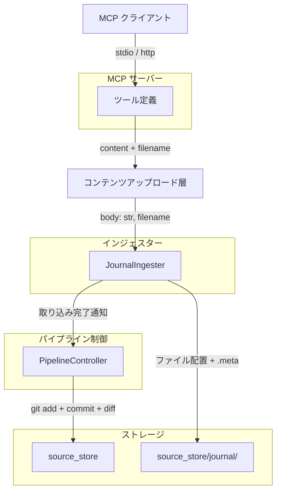
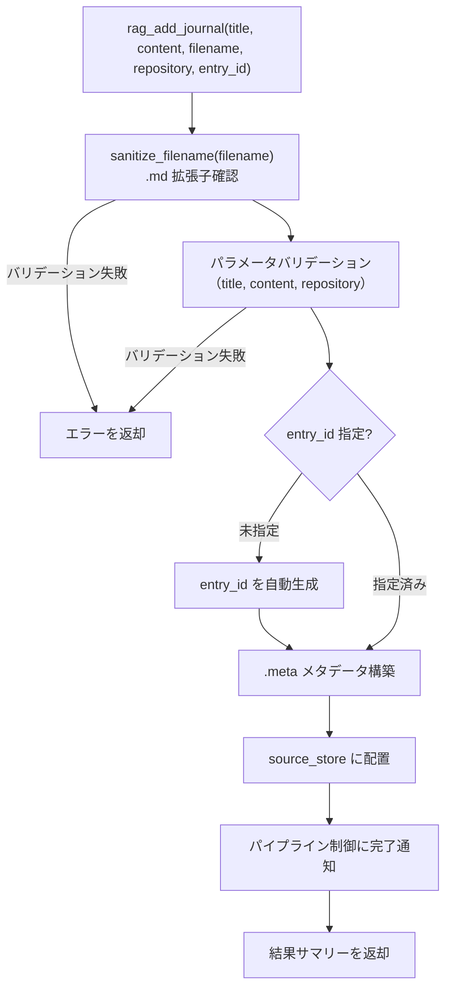

# Journal インジェスター

## 概要

Journal インジェスターは、開発ジャーナル（セッションごとの作業記録）を source_store の `journal/` ディレクトリに配置するコンポーネントである。テキスト変換・チャンキング・インデックス構築はコンバーター・インデクサーに委譲され、本インジェスターの責務は source_store へのファイル配置と .meta サイドカーファイルの生成に限定される。

単一エントリの登録とディレクトリ一括取り込み（マイグレーション）の 2 つの操作を提供する。

スコープ:

- 単一ジャーナルエントリの source_store への配置（`rag_add_journal`）
- 既存ジャーナルファイルの一括配置（CLI マイグレーション）
- .meta サイドカーファイルの生成
- エントリ ID の自動生成

スコープ外:

- テキスト変換（コンバーターの範疇）
- チャンキング・インデックス構築（インデクサーの範疇）
- ジャーナルの削除機能（ファイル削除機能の実装禁止ルールに従う）
- /handoff スキル統合（agent-commons リポジトリ側の変更）
- /restore スキルからの自動取り込み

## 背景

- ジャーナルはファイルベース（`$MEMORY_DIR/journal/*.md`）で保存されており、検索・フィルタリングができなかった
- 3段パイプライン移行完了後の現在は、rag-knowledge の既存パイプラインを活用してジャーナルを検索可能にできる
- ジャーナルはリポジトリ単位で記録される（プロジェクトごとに別ディレクトリ）

## 制約

- ローカルのメモリデータのみ対象とする（外部 HTTP リクエストは発生しない）
- パストラバーサル対策: repository 名と entry_id に `..`, `/`, `\` を含むことを禁止する
- **ファイル物理削除禁止**: source_store 内のファイルの物理削除は一切行わない
- **metadata.db アクセス禁止**: metadata.db に直接アクセスしない。DB 登録はパイプライン制御が実行する
- **git 操作禁止**: git 操作はパイプライン制御のみが実行する
- **.meta サイドカーファイルの生成あり**: journal 媒体は .meta を持つ（local とは異なる）
- **HTTP モード制限なし**: `rag_add_journal` はコンテンツアップロード型のため、HTTP モードの制限を受けない
- ハードリミット（コード内定数。設定・引数・環境変数で緩和不可。厳格化は可能）:
  - ディレクトリ一括取り込み時のファイル数上限: 500 件

本コンポーネントは外部 API 通信を行わないため、想定プロファイル・ConstrainedClient 関連の安全制約セクションは省略する。

## 安全制約

| 制約名 | 種別 | 値 | 解除可否 |
|--------|------|-----|---------|
| ディレクトリ一括取り込みファイル数上限 | ハードリミット | 500 件 | 引き上げ不可（引き下げ可） |
| パストラバーサル対策 | ハードリミット | repository / entry_id に `..`, `/`, `\` を禁止 | 無効化不可 |
| metadata.db 直接アクセス禁止 | ハードリミット | インジェスターから metadata.db への読み書きを禁止 | 不可 |
| git 操作禁止 | ハードリミット | インジェスターから git コマンドの直接呼び出しを禁止 | 不可 |
| ファイル物理削除禁止 | ハードリミット | source_store 内のファイル削除を禁止 | 不可 |

テスト実行時の安全な値: ファイル数上限 10 件で実行する。異常値テスト（空文字列のパラメータ、パストラバーサル試行）を含めること。

## インターフェース

### MCP ツール

| ツール | 入力 | 振る舞い |
|--------|------|---------|
| `rag_add_journal` | `title`, `content`, `filename`, `repository`, `entry_id`（任意） | 単一ジャーナルエントリを source_store の `journal/` に配置する。同一 entry_id の再登録時は上書きする |

#### rag_add_journal パラメータ

| パラメータ | 型 | 必須 | 説明 |
|-----------|-----|------|------|
| `title` | 文字列 | はい | エントリタイトル |
| `content` | 文字列 | はい | ジャーナル本文（Markdown）。MCP クライアントがファイルを読み込んでテキスト文字列として渡す |
| `filename` | 文字列 | はい | 元ファイルのファイル名（例: `session-summary.md`）。`.md` 拡張子であることの確認に使用する |
| `repository` | 文字列 | はい | リポジトリ名（例: `rag-knowledge`） |
| `entry_id` | 文字列 | いいえ | エントリ識別子。未指定時は自動生成。命名規則: `YYYYMMDD-HHMMSS-{topic}` |

`content` の `encoding` パラメータは存在しない。journal エントリは常に UTF-8 テキスト（Markdown）であるため固定。

ツール出力: 配置結果のサマリーテキスト（配置件数、パイプライン処理結果）

### CLI コマンド

| コマンド | 引数 | 振る舞い |
|---------|------|---------|
| `add-journal` | `--title`, `--file`, `--repository`, `--entry-id`（任意） | 単一ジャーナルエントリを登録する。パイプライン処理（convert → index）まで一貫して実行する |
| `migrate-journal` | `--dir`, `--repository` | 既存ジャーナルファイルを一括で source_store に配置する。パイプライン処理は含まない（事後に `rebuild --mode incremental` を実行する） |

#### add-journal パラメータ

| パラメータ | 短縮 | 必須 | 説明 |
|-----------|------|------|------|
| `--title` | `-t` | はい | エントリタイトル |
| `--file` | `-f` | はい | 本文 Markdown ファイルのパス。CLI がファイルを読み込んでコンテンツをインジェスターに渡す |
| `--repository` | `-r` | はい | リポジトリ名 |
| `--entry-id` | `-e` | いいえ | エントリ識別子（省略時は自動生成） |

MCP ツール（`rag_add_journal`）経由では `content` パラメータに Markdown 文字列を直接渡す。CLI は `--file` で指定したファイルを読み込み、同じインジェスターインターフェースを呼び出す。

#### migrate-journal パラメータ

| パラメータ | 短縮 | 必須 | 説明 |
|-----------|------|------|------|
| `--dir` | `-d` | はい | ジャーナルディレクトリパス |
| `--repository` | `-r` | はい | リポジトリ名 |

### source_type

`"journal"` — 新規追加する source_type。

### source_id

source_store 内の相対パスを source_id として使用する。

- 形式: `journal/{repository}/{entry_id}.md`
- 例: `journal/rag-knowledge/20260323-143000-session-summary.md`

### entry_id 自動生成規則

`entry_id` が未指定の場合、以下の規則で自動生成する:

- フォーマット: `YYYYMMDD-HHMMSS-{topic}`
- `{topic}`: title を NFKC 正規化し、英数字・ハイフン以外を除去、空白をハイフンに変換、50 文字上限
- タイムスタンプは UTC
- topic が空になる場合（日本語のみのタイトル等）はタイムスタンプのみ

### ファイル配置規則

#### 単一エントリ（`rag_add_journal`）

`journal/{repository}/{entry_id}.md` に配置する。

- 入力: `title="Session Summary"`, `repository="rag-knowledge"`, `entry_id=None`
- 配置先: `source_store/journal/rag-knowledge/20260323-143000-session-summary.md`
- source_id: `journal/rag-knowledge/20260323-143000-session-summary.md`

#### ディレクトリ一括（`migrate-journal`）

ファイル名をそのまま entry_id として使用する。

- 入力: `dir_path=/path/to/journal/`, `repository="rag-knowledge"`
- `20260323-143000-session-summary.md` → `source_store/journal/rag-knowledge/20260323-143000-session-summary.md`

### .meta サイドカーファイル

#### フィールド定義

| フィールド | 型 | 内容 |
|-----------|-----|------|
| `source_id` | str | `journal/{repository}/{entry_id}.md` |
| `source_type` | str | `"journal"` |
| `title` | str | エントリタイトル |
| `collected_at` | str | 登録日時（ISO 8601 UTC） |
| `repository` | str | リポジトリ名 |

#### 形式例

```yaml
source_id: "journal/rag-knowledge/20260323-143000-session-summary.md"
source_type: journal
title: "Session Summary: Pipeline Migration"
collected_at: "2026-03-23T14:30:00+00:00"
repository: rag-knowledge
```

### 重複検出

ファイルシステムベースで行う。配置先パスにファイルが既に存在する場合は上書きする（更新動作）。

### 設定項目

本コンポーネント固有の設定項目はない。source_store のパスは [source-store.md](../source-store.md) の `SOURCE_STORE_DIR` を使用する。

## コンポーネント構成

### Journal インジェスターの位置付け



CLI は `--file` で指定したファイルを直接読み込んでインジェスターに渡す（コンテンツアップロード層を経由しない）。

### 単一エントリ登録フロー



### 単一エントリ登録の処理手順

#### MCP ツール経由（rag_add_journal）

1. `sanitize_filename(filename)` でファイル名をサニタイズする（コンテンツアップロード層）
2. サニタイズ済みファイル名の拡張子が `.md` であることを確認する
3. パラメータバリデーション（title, content, repository の空文字チェック）
4. repository のバリデーション（パストラバーサル防止）
5. `entry_id` が未指定の場合、自動生成
6. `entry_id` のバリデーション（パストラバーサル防止）
7. `rel_path` = `journal/{repository}/{entry_id}.md` を構築
8. .meta メタデータ辞書を構築
9. `source_store.place_file()` でファイルと .meta を配置
10. パイプライン制御に取り込み完了を通知
11. 配置結果のサマリーを返す

#### CLI 経由（add-journal コマンド）

1. `--file` で指定したファイルパスをバリデーションする（空文字列チェック、存在確認）
2. ファイルを UTF-8 テキストとして読み込む
3. `JournalIngester.add_entry(title, body=content, repository, entry_id)` を呼び出す（手順 3 以降は MCP と共通）

### ディレクトリ一括取り込みの処理手順

1. パラメータバリデーション（dir_path, repository の空文字チェック）
2. repository のバリデーション（パストラバーサル防止）
3. ディレクトリの存在確認
4. `*.md` ファイルをスキャンし、パスの辞書順でソート
5. ファイル数がハードリミット（500 件）を超える場合、先頭 500 件にクランプし警告ログを出力
6. 各ファイルについて:
   a. ファイル名から entry_id を導出（拡張子を除いた部分）
   b. ファイル名からタイトルを抽出（`YYYYMMDD-HHMMSS-` プレフィックスを除去）
   c. ファイル内容を読み取る
   d. .meta メタデータを構築（`collected_at` はファイルの更新日時）
   e. `source_store.place_file()` で配置
7. 結果サマリーを返す（配置件数、スキップ件数、エラー件数）

## エッジケース

| ケース | 振る舞い |
|--------|---------|
| title が空文字列 | バリデーションエラーとして拒否する |
| `content` が空文字列 | バリデーションエラーとして拒否する |
| repository が空文字列 | バリデーションエラーとして拒否する |
| repository に `..` が含まれる | バリデーションエラーとして拒否する（パストラバーサル防止） |
| repository に `/` や `\` が含まれる | バリデーションエラーとして拒否する（パストラバーサル防止） |
| entry_id に `..` が含まれる | バリデーションエラーとして拒否する（パストラバーサル防止） |
| entry_id に `/` や `\` が含まれる | バリデーションエラーとして拒否する（パストラバーサル防止） |
| 同一 entry_id で再登録 | 上書き更新する |
| entry_id 未指定 | `YYYYMMDD-HHMMSS-{topic}` 形式で自動生成する |
| 日本語のみのタイトルで entry_id 自動生成 | topic 部分が空になり `YYYYMMDD-HHMMSS` のみとなる |
| マイグレーション対象ディレクトリが空 | 0 件処理として正常終了する |
| マイグレーション対象ディレクトリが存在しない | エラーを返す |
| マイグレーション対象に 0 バイトのファイル | スキップする（スキップ数としてサマリーに計上） |
| ファイル数がハードリミットを超過 | 先頭 500 件にクランプし警告ログを出力する |
| `filename` の拡張子が `.md` 以外 | バリデーションエラーとして拒否する |
| `filename` が空文字列 | コンテンツアップロード層でバリデーションエラーとして拒否する |
| HTTP モードで `rag_add_journal` 呼び出し | コンテンツアップロード型のため問題なく動作する |

## 関連ドキュメント

- [common.md](common.md) — インジェスター共通仕様
- [../infrastructure/content-upload.md](../infrastructure/content-upload.md) — コンテンツアップロード層（デコード・バリデーション）
- [../source-store.md](../source-store.md) — source_store 仕様（ディレクトリ構成、.meta 形式）
- [../pipeline-controller.md](../pipeline-controller.md) — パイプライン制御仕様（git 操作、ステージ間連携）
