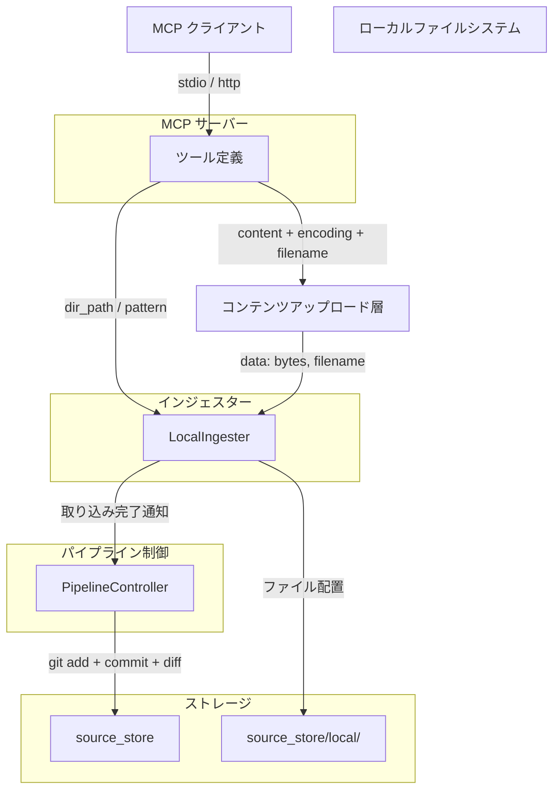
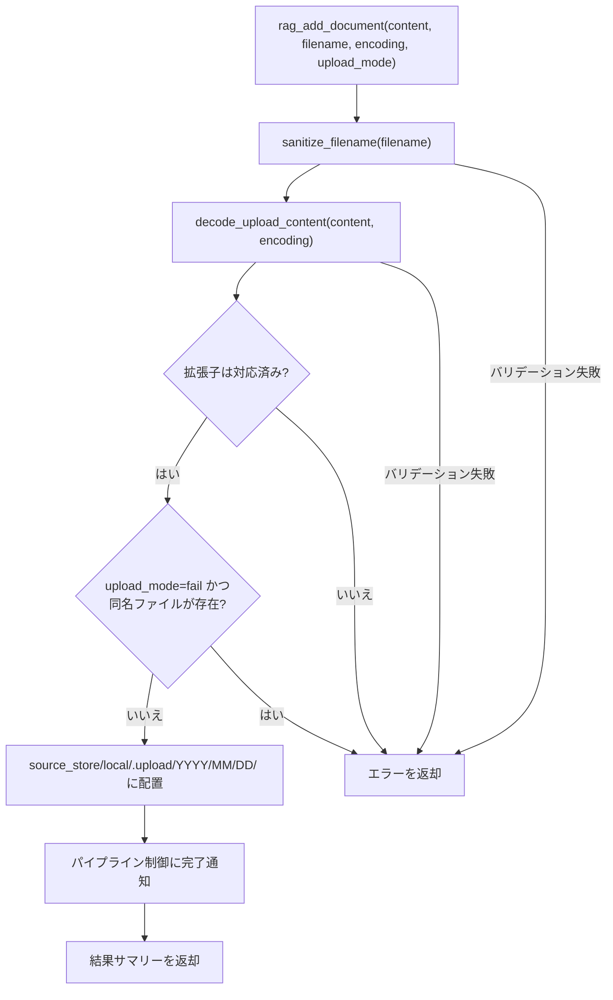
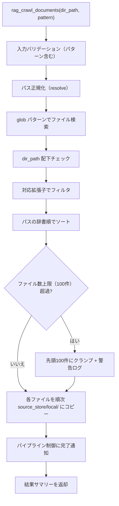

# Local インジェスター

## 概要

Local インジェスターは、ローカルファイルシステム上のテキストドキュメントを source_store の `local/` ディレクトリにコピーするコンポーネントである。テキスト抽出・チャンキング・インデックス構築はコンバーター・インデクサーに委譲され、本インジェスターの責務は source_store へのファイル配置のみに限定される。

単一ファイルの追加とディレクトリ一括取り込みの 2 つの操作を提供する。

スコープ:

- 単一ファイルの source_store への配置（`rag_add_document`）
- ディレクトリ内ファイルの glob パターンによる一括配置（`rag_crawl_documents`）
- 対応ファイル形式のバリデーション
- パス正規化とセキュリティチェック
- 手動配置ファイルとの共存

スコープ外:

- テキスト抽出・PDF 変換（コンバーターの範疇）
- チャンキング・インデックス構築（インデクサーの範疇）
- リモートファイルシステム（SMB、NFS 等）上のファイル取得
- バイナリファイル（画像、音声、動画等）の取り込み
- ファイルの書き込み・編集・削除（読み取りとコピーのみ）
- ファイル変更の自動監視（ウォッチ機能）
- .meta サイドカーファイルの生成（共通仕様ではインジェスターの責務に含まれるが、local 媒体は .meta 不要。メタデータは [source-store.md](../source-store.md) の導出方式に従う）

## 背景

- 既存のドキュメントインジェスターはデータ取得からチャンキング・インデックス構築まで一貫して行っていたが、新アーキテクチャでは責務を分離する
- テキストドキュメント（職務経歴書、学習ノート等）をナレッジベースに取り込む手段として、ローカルファイルの配置機能を提供する
- 手動で `source_store/local/` にファイルを配置する方式と MCP ツール経由の配置が共存する設計とする

## 制約

- ローカルファイルシステムのみ対象とする（外部 HTTP リクエストは発生しない）
- パストラバーサル対策: ファイルパスを `Path.resolve()` で正規化し、`..` を含むパスの解決後に実際のファイルシステムパスとして扱う
- アクセス許可ディレクトリの制限は設けない（OS レベルのファイル権限に委ねる）
  - **前提**: `rag_add_document` はコンテンツアップロード型のため HTTP・stdio 両モードで使用可能。`rag_crawl_documents` は HTTP モードでは opt-in 制御が必要（`rag_document_http_mode_enabled=true` かつ `rag_document_allowed_dirs` 指定）
- **ファイル物理削除禁止**: source_store 内のファイルの物理削除は一切行わない
- **metadata.db アクセス禁止**: metadata.db に直接アクセスしない。DB 登録はパイプライン制御が実行する
- **git 操作禁止**: git 操作はパイプライン制御のみが実行する
- **オリジナルデータの無加工保存**: 取得したファイルに加工を行わず、オリジナルのまま source_store に配置する
- **.meta サイドカーファイルの生成なし**: local 媒体は .meta を持たない。メタデータ（`title`、`collected_at` 等）はパイプライン制御がファイルシステムと git 履歴から導出する
- ハードリミット（コード内定数。設定・引数・環境変数で緩和不可。厳格化は可能）:
  - ディレクトリ一括取り込み時のファイル数上限: 100 件
- バリデーションとクランプの使い分け:
  - **バリデーションエラー（拒否）**: 空文字列のパス、存在しないファイル/ディレクトリ、対応していない拡張子
  - **クランプ（警告ログ付き）**: 一括取り込み時に glob パターンがハードリミットを超える件数にマッチした場合、パスの辞書順でソートした上で先頭 100 件のみ処理する

本コンポーネントは外部 API 通信を行わないため、想定プロファイル・ConstrainedClient 関連の安全制約セクションは省略する。

## 安全制約

| 制約名 | 種別 | 値 | 解除可否 |
|--------|------|-----|---------|
| ディレクトリ一括取り込みファイル数上限 | ハードリミット | 100 件 | 引き上げ不可（引き下げ可） |
| パストラバーサル対策 | ハードリミット | `Path.resolve()` による正規化 | 無効化不可 |
| HTTP モードでのローカルパスアクセス制限 | ハードリミット | `rag_crawl_documents`: HTTP モード時はデフォルト無効。`rag_document_http_mode_enabled=true` かつ `rag_document_allowed_dirs` 指定で有効化。許可ディレクトリ外のパスはエラー。`rag_add_document`: コンテンツアップロード型のため制限なし | `rag_crawl_documents`: opt-in で有効化可。`rag_add_document`: 制限なし |
| metadata.db 直接アクセス禁止 | ハードリミット | インジェスターから metadata.db への読み書きを禁止 | 不可 |
| git 操作禁止 | ハードリミット | インジェスターから git コマンドの直接呼び出しを禁止 | 不可 |
| ファイル物理削除禁止 | ハードリミット | source_store 内のファイル削除を禁止 | 不可 |

テスト実行時の安全な値: ファイル数上限 5 件で実行する。異常値テスト（空パス、存在しないファイル、未対応拡張子、ハードリミット超過）を含めること。

## インターフェース

### MCP ツール

| ツール | 入力 | 振る舞い |
|--------|------|---------|
| `rag_add_document` | `content`、`filename`、`encoding`（任意）、`upload_mode`（任意） | ファイルコンテンツを受け取り、source_store の `local/` に配置する。`upload_mode=fail`（デフォルト）では当日の配置先に同名ファイルが存在する場合エラーを返す。`upload_mode=replace` では上書きする |
| `rag_crawl_documents` | `dir_path`、`pattern`（任意） | 指定ディレクトリ内のドキュメントファイルを glob パターンで検索し、一括で source_store の `local/` にコピーする。同一パスの再取り込み時は上書きする |

#### rag_add_document パラメータ

| パラメータ | 型 | 必須 | 説明 |
|-----------|-----|------|------|
| `content` | 文字列 | はい | ファイルのコンテンツ。`encoding=text` の場合は UTF-8 文字列、`encoding=base64` の場合は base64 エンコードされた文字列 |
| `filename` | 文字列 | はい | 元ファイルのファイル名（例: `resume.pdf`、`notes.md`）。拡張子バリデーションおよびファイル配置先の命名に使用する |
| `encoding` | 文字列 | いいえ | コンテンツのエンコーディング。`"text"`（デフォルト）または `"base64"`。テキストファイル（`.md`, `.txt`, `.adoc`）は `text`、バイナリファイル（`.pdf`）は `base64` を使用する |
| `upload_mode` | 文字列 | いいえ | 同名ファイル存在時の動作。`"fail"`（デフォルト、エラーを返す）または `"replace"`（上書き） |

ツール出力: 配置結果のサマリーテキスト（ファイル名、配置先パス）

#### rag_crawl_documents パラメータ

| パラメータ | 型 | 必須 | 説明 |
|-----------|-----|------|------|
| `dir_path` | 文字列 | はい | 取り込み対象ディレクトリのパス（絶対パスまたは相対パス） |
| `pattern` | 文字列 | いいえ | glob パターン。デフォルト: `**/*`（再帰的に全対応ファイルを検索） |

パターンのバリデーション: `pattern` に `..` が含まれる場合、または絶対パス（`Path(pattern).is_absolute()` で判定。`/` 始まりおよび Windows ドライブレター形式の両方を検出）の場合はバリデーションエラーとして拒否する。加えて、glob マッチ結果の各ファイルを `Path.resolve()` で正規化した後、`dir_path` の配下であることを検証し、配下でないファイルは除外する。

ツール出力: 配置結果のサマリーテキスト（処理ファイル数、スキップ数、エラー数）

### 対応ファイル形式

| 拡張子 | 説明 |
|--------|------|
| `.md` | Markdown ファイル |
| `.txt` | プレーンテキストファイル |
| `.pdf` | PDF ファイル（テキスト変換はコンバーターが実行） |
| `.adoc` | AsciiDoc ファイル |

対応拡張子は `config.toml` の `rag_document_supported_extensions` で追加可能。追加した拡張子のファイルはプレーンテキストとしてコンバーターが処理する。

### source_id

source_store 内の相対パスを source_id として使用する。

- 例: `local/resume.pdf`、`local/project-docs/readme.md`
- source_id は配置先のパスから自動的に決定される

### ファイル配置規則

#### 単一ファイル（`rag_add_document`）

`filename` パラメータのファイル名部分のみを使用し、アップロード日付ディレクトリ配下に配置する。

- 入力: `filename="resume.pdf"`、`encoding="base64"`
- 配置先: `source_store/local/.upload/YYYY/MM/DD/resume.pdf`
- source_id: `local/.upload/YYYY/MM/DD/resume.pdf`

`YYYY/MM/DD` はアップロード時の日付（サーバーローカル時刻）。同一ファイルを再アップロードした場合、異なる日付ディレクトリに配置されるため別 source_id となる（`upload_mode=replace` を指定しても上書きは当日分のみ）。

#### ディレクトリ一括（`rag_crawl_documents`）

`dir_path` の末尾コンポーネント名をサブディレクトリとし、ディレクトリ内の相対パス構造を保持して `local/{dir_basename}/{relative_path}` に配置する。

- 入力: `dir_path=/home/user/project-docs/`、`pattern=**/*.md`
- `/home/user/project-docs/readme.md` → `source_store/local/project-docs/readme.md`
- `/home/user/project-docs/design/arch.md` → `source_store/local/project-docs/design/arch.md`
- source_id: `local/project-docs/readme.md`、`local/project-docs/design/arch.md`

#### 手動配置との共存

ユーザーが `source_store/local/` 配下に手動でファイルやフォルダを配置することも可能。手動配置ファイルはパイプライン制御の差分更新で自動的に検出・処理される。MCP ツール経由の配置と手動配置は同じディレクトリ構造を共有する。

### 重複検出

ファイルシステムベースで行う。配置先パスにファイルが既に存在する場合は上書きする。

- source_id から配置先パスを導出する
- ファイルの存在有無で重複を判定する
- 重複時は上書き（再取り込みの更新動作）

### 設定項目

#### `config.toml`（共通設定値）

| 設定キー | 型 | デフォルト | 許容範囲 | 説明 |
|---------|-----|-----------|---------|------|
| `rag_document_supported_extensions` | 文字列 | `".md,.txt,.pdf,.adoc"` | ドット始まりのカンマ区切り文字列 | 対応ファイル拡張子のカンマ区切りリスト |
| `rag_document_http_mode_enabled` | bool | `false` | `true` / `false` | HTTP モード時のローカルファイルアクセスツールの有効化 |
| `rag_document_allowed_dirs` | 文字列 | `""` | カンマ区切りのディレクトリパス | HTTP モード時にアクセスを許可するディレクトリ。空の場合は全パスを拒否 |

source_store のパスは [source-store.md](../source-store.md) の `SOURCE_STORE_DIR` を使用する。

## コンポーネント構成

### Local インジェスターの位置付け

CLI は `rag_add_document` のデコード処理を経由せず、ファイルをバイト列として直接読み込んでインジェスターに渡す。

### 単一ファイル取り込みフロー

### ディレクトリ一括取り込みフロー

### 単一ファイル取り込みの処理手順

#### MCP ツール経由（rag_add_document）

1. `sanitize_filename(filename)` でファイル名をサニタイズする（コンテンツアップロード層）
2. `decode_upload_content(content, encoding)` でバイト列を取得する（コンテンツアップロード層）
3. サニタイズ済みファイル名の拡張子が対応リストに含まれるか確認する
4. `upload_mode=fail` かつ当日の配置先パスにファイルが存在する場合はエラーを返す
5. `source_store/local/.upload/YYYY/MM/DD/{filename}` にファイルを配置する
6. パイプライン制御に取り込み完了を通知する
7. 配置結果のサマリーを返す

#### CLI 経由（add-document コマンド）

1. `file_path` をバリデーションする（空文字列チェック）
2. `Path.resolve()` でパスを正規化する（シンボリックリンク解決、`..` 除去）
3. ファイルの存在を確認する（ディレクトリの場合は拒否）
4. 拡張子が対応リストに含まれるか確認する
5. ファイルをバイト列として読み込む
6. `LocalIngester.add_document(data, filename, upload_mode)` を呼び出す（手順 4 以降は MCP と共通）
7. `source_store/local/.upload/YYYY/MM/DD/{filename}` にファイルを配置する
8. パイプライン制御に取り込み完了を通知する
9. 配置結果のサマリーを返す

### ディレクトリ一括取り込みの処理手順

1. `dir_path` をバリデーションする（空文字列チェック）
2. `Path.resolve()` でパスを正規化する
3. ディレクトリの存在を確認する（ファイルの場合は拒否）
4. `pattern` をバリデーションする（`..` を含む場合、または `Path(pattern).is_absolute()` が真の場合は拒否）
5. glob パターンでファイルを検索する（デフォルト: `**/*`）
6. 各マッチファイルを `Path.resolve()` で正規化し、`dir_path` 配下でないファイルを除外する
7. 対応拡張子でフィルタする
8. パスの辞書順でソートする
9. ファイル数がハードリミット（100 件）を超える場合、先頭 100 件にクランプし警告ログを出力する
10. 各ファイルを `source_store/local/{dir_basename}/{relative_path}` にコピーする
11. 個別ファイルのコピーエラーは該当ファイルをスキップし、他のファイルの処理を続行する
12. 全ファイルのコピー完了後、パイプライン制御に取り込み完了を通知する
13. 結果サマリーを返す（処理ファイル数、スキップ数、エラー数）

## エッジケース

| ケース | 振る舞い |
|--------|---------|
| `content` が空文字列 | コンテンツアップロード層でバリデーションエラーとして拒否する（`rag_add_document`） |
| `encoding` が `"text"` でも `"base64"` でもない | コンテンツアップロード層でバリデーションエラーとして拒否する（`rag_add_document`） |
| `encoding=base64` で不正な base64 文字列 | コンテンツアップロード層でバリデーションエラーとして拒否する（`rag_add_document`） |
| `filename` が空文字列 | コンテンツアップロード層でバリデーションエラーとして拒否する（`rag_add_document`） |
| `filename` にディレクトリセパレータや `..` が含まれる | コンテンツアップロード層が `Path(filename).name` でファイル名部分のみ採用する。サニタイズ後が空文字列または `..` の場合はバリデーションエラーとして拒否する（`rag_add_document`） |
| 対応していない拡張子 | バリデーションエラーとして拒否する（`rag_add_document` 単一取り込み時）。`rag_crawl_documents` 一括取り込み時はフィルタで除外する |
| `upload_mode=fail` かつ同日に同名ファイルが存在する | エラーを返す（`rag_add_document`） |
| `upload_mode=replace` かつ同日に同名ファイルが存在する | 上書きする（`rag_add_document`） |
| ファイルが存在しない（CLI） | バリデーションエラーとして拒否する（CLI `add-document` コマンド） |
| ディレクトリが存在しない（`rag_crawl_documents`） | バリデーションエラーとして拒否する |
| ファイルサイズが 0 バイト（`rag_crawl_documents`） | 該当ファイルをスキップする（スキップ数としてサマリーに計上）。空ファイルの配置は行わない |
| テキストファイルのエンコーディングが UTF-8 以外 | インジェスターはバイト列をそのまま保存するため影響なし。テキスト変換時のエンコーディング処理はコンバーターの責務（[converter.md](../converter.md) 参照） |
| glob パターンがファイル数上限を超過 | パスの辞書順でソートした上で先頭 100 件にクランプし、警告ログを出力する。超過分は処理しない |
| glob パターンに一致するファイルが 0 件 | 0 件処理として正常終了する |
| ディレクトリが指定されたがファイルだった（`rag_crawl_documents`） | バリデーションエラーとして拒否する |
| `pattern` に `..` が含まれる、または `Path(pattern).is_absolute()` が真 | バリデーションエラーとして拒否する |
| glob マッチ結果が `dir_path` 配下でない | 該当ファイルを除外する |
| コピー先ディレクトリが存在しない | 必要な中間ディレクトリを自動作成する |
| ディスク容量不足 | OS エラーをそのまま伝播し、エラーログに記録する |
| `dir_path` がルートディレクトリ（`/` や `C:\`） | バリデーションエラーとして拒否する |

## 関連ドキュメント

- [common.md](common.md) — インジェスター共通仕様
- [../infrastructure/content-upload.md](../infrastructure/content-upload.md) — コンテンツアップロード層（デコード・バリデーション）
- [../source-store.md](../source-store.md) — source_store 仕様（ディレクトリ構成、local 媒体のメタデータ導出）
- [../pipeline-controller.md](../pipeline-controller.md) — パイプライン制御仕様（git 操作、ステージ間連携）
- [../converter.md](../converter.md) — コンバーター仕様（テキスト変換、PDF バックエンド選択）
