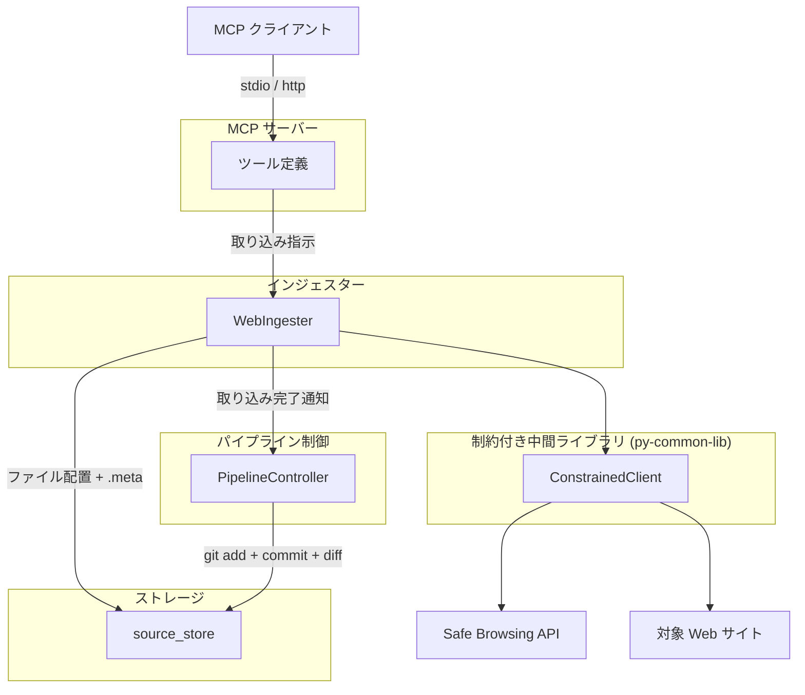
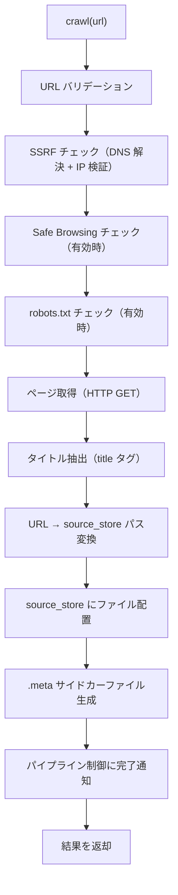
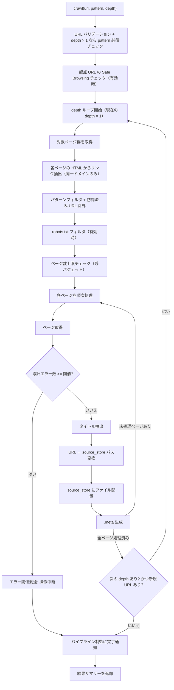
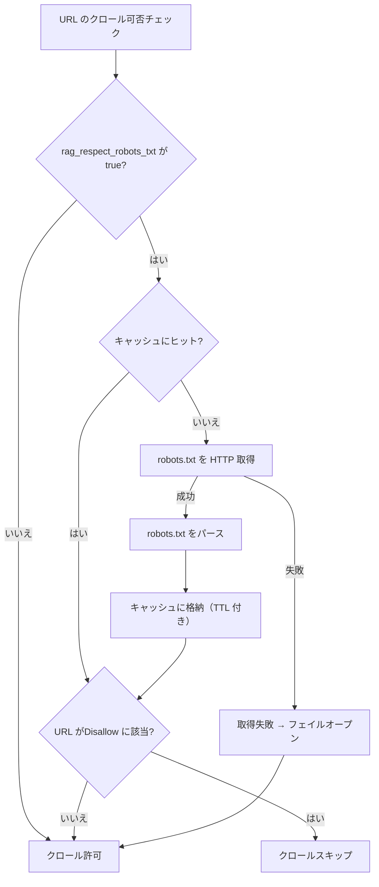

# Web インジェスター

## 概要

Web ページを HTTP 経由で取得し、source_store にファイルを配置するインジェスター。WebIngester クラスの `crawl()` メソッドとして、単一ページ追加と一括クロール（再帰クロール対応）の機能を提供する。MCP/CLI からは `rag_site_ingest` / `site-ingest` を使用する。BlueSky インジェスターから内部的に利用される。

スコープ:

- 単一 URL の Web ページ取得と source_store への配置
- リンク集ページからの一括クロール（再帰クロール対応）と source_store への配置
- URL 安全性チェック（Google Safe Browsing API）
- robots.txt 遵守
- SSRF 対策

スコープ外:

- テキスト変換・チャンキング・インデックス構築（コンバーター・インデクサーの範疇）
- metadata.db への直接アクセス（パイプライン制御が .meta を読んで実行する）
- git 操作（パイプライン制御の範疇）
- ファイルの物理削除（source_store の制約）

## 背景

- 従来の WebIngester はデータ取得からテキスト変換・チャンキング・インデックス構築まで一貫して行っていたが、Embedding モデル変更時の再構築や変換方式変更への対応が困難だった
- 3 段パイプライン（インジェスター → コンバーター → インデクサー）への移行により、Web インジェスターの責務を「source_store へのファイル配置 + .meta サイドカーファイルの生成」に限定する
- URL 安全性チェック・robots.txt 遵守・SSRF 対策は、外部 Web サイトへのアクセスを担うインジェスター層に引き続き残す

## 制約

### インジェスター共通制約

[インジェスター共通仕様](common.md) の制約に従う。主要な共通制約:

- metadata.db アクセス禁止
- git 操作禁止
- オリジナルデータの無加工保存（取得した HTML をそのまま source_store に配置）
- ファイル削除禁止

### 外部 HTTP リクエスト

- ConstrainedClient（py-common-lib）経由で実行する
- ハードリミット（コード内定数。設定・引数・環境変数で緩和不可。厳格化は可能）:
  - 操作あたりリクエスト総数上限: 500（ConstrainedClient 共通）
  - 最低リクエスト間隔: 0.1 秒（ConstrainedClient 共通。robots.txt 取得、ページ取得、タイトル取得を含む全外部リクエスト間に適用）
  - 操作全体タイムアウト: 600 秒（許容範囲 1〜600 秒、ConstrainedClient 共通）
  - クロール対象ページ数上限: 500 ページ（Web インジェスター固有）
  - クロール深度上限: 10（Web インジェスター固有）
- サーキットブレーカー: 5 回連続失敗で操作全体を中断する（ConstrainedClient 共通）

### バリデーションとクランプ

- **バリデーションエラー（拒否）**: 空文字列の URL、無効なスキーム（http/https 以外）、ホスト名なし
- **クランプ（警告ログ付き）**: 正の値だが許容範囲外（例: `max_pages=600` → 500 にクランプ）。意図的な大きい値の指定を安全な範囲に制限する
- 設定値がハードリミットの許容範囲外の場合は範囲内にクランプする（エラーにはしない。警告ログを出力する）
- `--no-limit` 等の制約バイパス手段は一切設けない
- `0 = 無制限` のセマンティクスを排除する

### SSRF 対策

プライベート IP アドレス・ローカルホストへのリクエストを拒否し、サーバーサイドリクエストフォージェリ（SSRF）を防止する。

ブロック対象:

| アドレス範囲 | 区分 |
|-------------|------|
| `127.0.0.0/8` | IPv4 ループバック |
| `10.0.0.0/8` | RFC 1918 プライベート |
| `172.16.0.0/12` | RFC 1918 プライベート |
| `192.168.0.0/16` | RFC 1918 プライベート |
| `169.254.0.0/16` | リンクローカル |
| `::1` | IPv6 ループバック |
| `fc00::/7` | IPv6 ユニークローカル |
| `fe80::/10` | IPv6 リンクローカル |
| `localhost` / `localhost.localdomain` | ホスト名文字列マッチ |

検証手順:

1. ホスト名が `localhost` / `localhost.localdomain` でないことを確認する
2. DNS 解決（`socket.getaddrinfo()`）で全ての解決済み IP アドレスを取得する
3. 全ての IP アドレスがブロック対象に該当しないことを検証する
4. いずれかが該当する場合は `ValueError` を送出する

リダイレクト追従は SSRF 防止のため無効化する。リダイレクトレスポンス（3xx）はブロックし、スキップ扱い（エラーカウント対象外）とする。

### robots.txt

- `rag_respect_robots_txt` が `true`（デフォルト）の場合、対象 URL の robots.txt を取得し、`Disallow` ディレクティブに従う
- User-Agent は `*`（デフォルト）として判定する
- `Crawl-delay` ディレクティブを読み取り、最低リクエスト間隔（ハードリミット: 0.1 秒）より大きい場合はそちらを採用する
- robots.txt の取得結果は TTL ベースでキャッシュする（デフォルト: 3600 秒）。キャッシュキーは `scheme://hostname:port`
- robots.txt の取得に失敗した場合はフェイルオープン（全 URL を許可）

### URL 安全性チェック

- `rag_url_safety_check` が `true`（デフォルト）の場合、Google Safe Browsing API で URL の安全性を検証する
- API キーは OS セキュアストレージ（keyring）から取得する（サービス名: `rag-knowledge`、キー名: `GOOGLE_SAFE_BROWSING_API_KEY`）
- API キーが未登録・空・不正（400 応答）の場合は設定エラー（`SafeBrowsingConfigError`）として即時中断する
- API キーは `x-goog-api-key` ヘッダーで送信する（URL パラメータではログに漏洩するため）
- 検出する脅威タイプ: MALWARE、SOCIAL_ENGINEERING、UNWANTED_SOFTWARE、POTENTIALLY_HARMFUL_APPLICATION
- チェック結果は TTL ベースでキャッシュする（デフォルト: 300 秒、最大 1000 エントリ）
- 常にフェイルクローズ: API 障害時（429/500/タイムアウト等）は URL をブロックしエラーとする
- チェック対象の範囲:
  - 単一ページ追加: 指定 URL をチェックする
  - 一括クロール: 起点 URL のみチェックする。各 depth で発見されたリンクにはチェックを行わない（ユーザーが安全性を認識しているサイトのクロールが前提であり、リンク抽出時の同一ドメインフィルタにより外部ドメインは除外されるため）

### 保存形式

- 取得した HTTP レスポンスボディを生バイト列のまま source_store に配置する。エンコーディング変換やテキスト加工は行わない
- テキスト変換（HTML → Markdown）はコンバーターの責務であり、インジェスターでは行わない
- .meta サイドカーファイルにはタイトル（`<title>` タグから抽出）を含める。タイトル抽出のためにレスポンスボディをメモリ上でデコードするが、保存対象は生バイト列である
- コンバーターが拡張子ベースで変換方式を決定するため、URL パスが Web インジェスターの既知拡張子（`.html`, `.htm`, `.pdf`, `.json`, `.md`, `.txt`, `.adoc`）を持たない場合（拡張子なし、または未知の拡張子）、source_store 配置時にファイル名末尾に `.html` を付与する。既知拡張子を持つ URL にはそのまま配置する

## 外部連携

### 対象 Web サイト

| 連携先 | 用途 | 接続方式 |
|--------|------|---------|
| 対象 Web サイト | クロール対象ページの取得、robots.txt の取得 | HTTP/HTTPS（ConstrainedClient 経由） |

対象 Web サイトは不特定多数であり、公式 API 仕様は存在しない。HTML ベースのページ取得を行う。

### Google Safe Browsing API

| 連携先 | 用途 | 接続方式 |
|--------|------|---------|
| Google Safe Browsing API v4 | URL 安全性チェック | REST API（ConstrainedClient 経由、オプション） |

Safe Browsing API はオプション機能。`rag_url_safety_check=false` で無効化できる。有効時に API キーが未登録・空・不正の場合は `SafeBrowsingConfigError` で即時中断する。

## 想定プロファイル

### 単一ページ追加

| 項目 | 内容 |
|------|------|
| 最悪ケースリクエスト数 | 1（Safe Browsing チェック）+ 1（robots.txt）+ 1（対象ページ）= 3 |
| 最悪ケース所要時間 | 3 × 30 秒（per-request タイムアウト）= 90 秒。操作全体タイムアウト 600 秒の範囲内 |
| 想定エラー率 | 低リスク。単一ページのみ |

### 一括クロール（depth=1）

| 項目 | 内容 |
|------|------|
| 最悪ケースリクエスト数（クロール用） | 1（インデックスページ）+ 1（robots.txt）+ 498（個別ページ）= 500。バジェットトラッカー上限 500 で打ち切り |
| Safe Browsing リクエスト数（別枠） | 1（起点 URL チェック）。SafeBrowsingClient が内部で専用の ConstrainedClient を使用するため、クロール用バジェットとは別管理 |
| 最悪ケース所要時間 | 500 × 0.1 秒（ハードリミット最小間隔での理論最短）= 50 秒。デフォルト設定（1.0 秒間隔）では 500 秒。per-request タイムアウト・処理時間は含まない。操作全体タイムアウト 600 秒で打ち切り |
| 想定エラー率 | 外部 Web サイト依存。リトライ機構なし（失敗ページはスキップし処理を続行）。累計エラー数が閾値に達した場合、またはサーキットブレーカー（5 回連続 HTTP 失敗）が発動した場合に操作中断 |

### 一括クロール（depth > 1）

| 項目 | 内容 |
|------|------|
| 最悪ケースリクエスト数 | depth=1 と同じ上限（500）を全 depth で共有する。各 depth でインデックスページ取得 + リンク抽出 + ページ取得を繰り返すが、トータルのバジェット・ページ数上限は変わらない |
| 最悪ケース所要時間 | depth=1 と同じ（操作全体タイムアウト 600 秒で打ち切り） |
| 想定エラー率 | depth が深いほど無関係なページに到達する確率が上がるため、pattern 必須でフィルタリングする。累計エラー数が閾値に達した場合に操作中断 |

## 安全制約

| 制約名 | 種別 | 値 | 解除可否 |
|--------|------|-----|---------|
| 操作あたりリクエスト総数上限 | ハードリミット | 500 | 引き上げ不可（引き下げ可） |
| 最低リクエスト間隔 | ハードリミット | 0.1 秒 | 引き下げ不可（引き上げ可） |
| 操作全体タイムアウト | ハードリミット | 600 秒、許容範囲 1〜600 秒 | 引き上げ不可（引き下げ可、下限 1 秒） |
| サーキットブレーカー閾値 | ハードリミット | 5 回連続失敗 | 引き上げ不可（引き下げ可） |
| クロール対象ページ数上限 | ハードリミット | 500 ページ | 引き上げ不可（引き下げ可） |
| クロール深度上限 | ハードリミット | 10 | 引き上げ不可（引き下げ可） |
| SSRF 対策 | ハードリミット | プライベート IP・ローカルホストへのリクエスト拒否 | 無効化不可 |
| リダイレクト追従無効化 | ハードリミット | HTTP リダイレクト（3xx）をブロックしスキップ扱いとする | 無効化不可 |
| HTTP エラーレスポンス拒否 | ハードリミット | HTTP 4xx/5xx レスポンスをエラーとして扱い、コンテンツを保存しない | 無効化不可 |
| クロール対象ページ数 | 設定値 | 許容範囲 1〜500、デフォルト 50 | 範囲内で変更可 |
| リクエストタイムアウト | 設定値 | 許容範囲 1〜120 秒、デフォルト 30 秒 | 範囲内で変更可 |
| クロールエラー停止閾値 | 設定値 | 許容範囲 5〜10、デフォルト 5 | 範囲内で変更可 |
| URL 拡張子フィルタ | ハードリミット | 許可リスト: 拡張子なし, `.html`, `.htm`, `.pdf` | 変更不可 |
| Content-Type フィルタ | ハードリミット | 許可リスト: `text/html`, `application/pdf` | 変更不可 |
| Safe Browsing キャッシュ最大エントリ数 | ハードリミット | 1000 エントリ | 引き上げ不可（引き下げ可） |
| 生 HTTP クライアント利用禁止 | CI チェック | `src/` 全体を grep で走査（httpx / aiohttp / requests / urllib.request）。`# safety:allowed` 行を除外。ConstrainedClient は py-common-lib パッケージで提供（`src/` 外のため検出対象外） | 許可例外は `# safety:allowed` コメントで可 |

テスト実行時の安全な値: クロール対象ページ数 3 件で実行する。異常値テスト（空 URL、無効スキーム、プライベート IP、上限超過）を含めること。

## インターフェース

### 公開インターフェース

WebIngester クラスのメソッドとして `crawl()` を提供する。MCP/CLI からの直接公開はなく、`rag_site_ingest` / `site-ingest` 経由で利用する。

#### crawl() メソッド

| パラメータ | 型 | 必須 | 説明 |
|-----------|-----|------|------|
| `url` | 文字列 | はい | 取り込み対象ページまたはリンク集ページの URL |
| `pattern` | 文字列 | 条件付き必須 | リンクをフィルタする正規表現パターン。`depth` が 2 以上の場合は必須。デフォルト: フィルタなし（全リンクが対象） |
| `depth` | 整数 | いいえ | クロール深度。0 = 起点 URL のみ（リンク抽出なし）、1 = インデックスページからの直接リンクのみ、2 以上 = 取得したページからさらにリンクを辿る。デフォルト: 1。許容範囲: 0〜10 |

出力: source_store への配置結果（配置ファイル数、スキップ数、エラー数）

### 設定項目

| 設定キー | 型 | 保管先 | デフォルト | 許容範囲 | 説明 |
|---------|-----|--------|-----------|---------|------|
| `rag_max_crawl_pages` | int | `config.toml` | 50 | 1〜500 | 1 回のクロール操作で取得する最大ページ数 |
| `rag_respect_robots_txt` | bool | `config.toml` | true | — | robots.txt の Disallow ディレクティブに従うか |
| `rag_robots_txt_cache_ttl` | int | `config.toml` | 3600 | 0 以上 | robots.txt キャッシュの有効期間（秒） |
| `rag_url_safety_check` | bool | `config.toml` | true | — | Google Safe Browsing API による URL 安全性チェックを有効にするか |
| `rag_url_safety_cache_ttl` | int | `config.toml` | 300 | 0 以上 | Safe Browsing チェック結果のキャッシュ有効期間（秒） |
| `rag_url_safety_timeout` | float | `config.toml` | 5.0 | 0 より大きい | Safe Browsing API のリクエストタイムアウト（秒） |
| `rag_crawl_request_timeout` | int | `config.toml` | 30 | 1〜120 | ページ取得時の per-request タイムアウト（秒） |
| `rag_crawl_max_errors` | int | `config.toml` | 5 | 5〜10 | 1 回のクロール操作で許容する累計エラー数。閾値に達すると操作を中断する |

## コンポーネント構成

### Web インジェスターの位置付け



### コンポーネント一覧

| コンポーネント | 役割 |
|--------------|------|
| WebIngester | Web ページ取り込み用インジェスター。URL の安全性検証・robots.txt チェック・SSRF 対策・リダイレクト無効化・文字エンコーディング検出を経て、ページ取得・source_store 配置を行う。robots.txt の取得・パース・キャッシュ管理、個別 URL の許可判定も内包する |
| SafeBrowsingClient | Google Safe Browsing API v4 によるURL 安全性チェック。キャッシュ付き |
| ConstrainedClient (py-common-lib) | 全外部 HTTP リクエストのゲートウェイ。ハードリミット・バジェット・サーキットブレーカーを統合する |

### 単一ページ追加フロー



### 一括クロールフロー



再帰クロールの動作:

- depth=1（デフォルト）: 従来動作。インデックスページの直接リンクのみを取得する
- depth=2 以上: 取得した各ページの HTML からリンクを再抽出し、次の depth の対象とする。全 depth を通じて訪問済み URL セットを共有し、ループを防止する
- `rag_max_crawl_pages` と ConstrainedClient のバジェット（500）は全 depth で共有する。いずれかの上限に達した時点で残りの depth をスキップする
- 累計エラー数が `rag_crawl_max_errors` に達した場合、操作を中断する。これは HTTP レベルのサーキットブレーカー（ConstrainedClient、接続エラー・タイムアウト検出）とは別のアプリケーションレベルの保護で、4xx/5xx レスポンス等のページレベルエラーを検出する

一括クロールでは、SSRF 対策として起点 URL および個別ページの取得時に SSRF 検証（DNS 解決 + IP 検証）を実行し、内部ネットワークへの到達を防止する。

Safe Browsing によるコンテンツ安全性チェック（マルウェア・フィッシング等）は起点 URL のみに適用し、各 depth で発見されたリンクには適用しない。
ユーザーが安全性を認識しているサイトのクロールが前提であり、リンク抽出時の同一ドメインフィルタにより外部ドメインは除外されるためである。

### リンク抽出

インデックスページ（および再帰クロール時の各ページ）の HTML からリンク（`<a href="...">`）を抽出する。

抽出規則:

- 同一ドメインのリンクのみを対象とする（異なるドメインへのリンクは除外）
- URL フラグメント（`#section`）は除去する
- 相対 URL は対象ページの URL を基準に絶対 URL に解決する
- 重複 URL は除去する（全 depth で訪問済み URL セットを共有）
- URL 拡張子フィルタ: 許可リスト方式で、拡張子なし・`.html`・`.htm`・`.pdf` のみ対象とする。それ以外の拡張子（`.exe`, `.zip`, `.png`, `.mp4` 等）のリンクは除外する

### ファイルタイプフィルタリング

クロール時にバイナリファイル等の不要なコンテンツを取得・配置しないための 2 層フィルタ。

#### 事前フィルタ（URL 拡張子、リクエスト前）

リンク抽出時に URL の拡張子を許可リストで判定し、対象外をスキップする。サーバーへのリクエストが発生しないため、バジェットを消費しない。

| 拡張子 | 判定 | 理由 |
|--------|------|------|
| なし（拡張子なし） | 許可 | HTML ページの大半がこのパターン |
| `.html`, `.htm` | 許可 | HTML ページ |
| `.pdf` | 許可 | converter が PDF テキスト抽出に対応 |
| その他 | スキップ | バイナリファイル・画像・スクリプト等 |

#### 事後フィルタ（Content-Type、GET レスポンス後）

GET レスポンスの `Content-Type` ヘッダを許可リストで判定し、対象外を破棄する。URL 拡張子では判定できないケース（拡張子なしの URL が画像を返す等）を捕捉する。

| Content-Type | 判定 | 理由 |
|-------------|------|------|
| `text/html` | 許可 | HTML ページ |
| `application/pdf` | 許可 | PDF ドキュメント |
| その他 | スキップ | バイナリ・画像・JSON API レスポンス等 |

Content-Type の判定では `;` 以降のパラメータ（`charset=utf-8` 等）を除去してから照合する。

### robots.txt チェック



- キャッシュキーは `scheme://hostname:port`
- キャッシュ TTL はドメインごとに `rag_robots_txt_cache_ttl` 秒
- `Crawl-delay` ディレクティブが設定されたリクエスト間隔より大きい場合、`Crawl-delay` の値を採用する

### URL パス変換と source_store 配置

URL から source_store 内のファイルパスへの変換は [source-store.md](../source-store.md) の「URL パス変換規則」に従う。

変換例（`.html` 拡張子付与を含む）:

| URL | source_store 内パス | 備考 |
|-----|-------------------|------|
| `https://example.com/docs/guide` | `web/https/example.com/docs/guide.html` | 拡張子なし → `.html` 付与 |
| `https://example.com/docs/guide.html` | `web/https/example.com/docs/guide.html` | 既知拡張子 → そのまま |
| `https://example.com/docs/guide.pdf` | `web/https/example.com/docs/guide.pdf` | 既知拡張子 → そのまま |
| `https://example.com/docs/guide?lang=ja` | `web/https/example.com/docs/guide？lang=ja.html` | 拡張子なし → `.html` 付与 |
| `http://localhost:8080/api/docs` | `web/http/localhost：8080/api/docs.html` | 拡張子なし → `.html` 付与 |

### .meta サイドカーファイル生成

データファイルの配置直後に同階層に .meta サイドカーファイルを生成する。フォーマットは [source-store.md](../source-store.md) の「.meta サイドカーファイル」に定義済み。

Web インジェスターが生成する .meta のフィールド:

| フィールド | 型 | 内容 |
|-----------|-----|------|
| `source_id` | str | ソース URL |
| `source_type` | str | `web` |
| `title` | str | `<title>` タグから抽出したページタイトル |
| `collected_at` | str | 取り込みタイムスタンプ（ISO 8601） |
| `url` | str | 元の URL |

.meta ファイルの形式例:

```yaml
source_id: "https://example.com/docs/guide"
source_type: web
title: "Guide Title"
collected_at: "2026-01-15T10:30:00+09:00"
url: "https://example.com/docs/guide"
```

### タイトル抽出

.meta の `title` フィールドに格納するために、取得した HTML からタイトルを抽出する。

- HTML の `<title>` タグのテキスト内容を使用する
- `<title>` タグが存在しない場合は空文字列とする

### source_id

URL を source_id として使用する。URL フラグメント（`#section`）は除去する。

source_id の決定方式は [source-store.md](../source-store.md) の「source_id の決定方式」に定義済み。

### 文字エンコーディング検出

タイトル抽出（.meta 生成用）のために、取得した HTTP レスポンスボディの文字エンコーディングを検出し、メモリ上でデコードする。source_store への保存は生バイト列のまま行うため、このデコード処理は保存データに影響しない。

- 文字エンコーディング自動検出ライブラリによる検出を使用する
- Shift_JIS、EUC-JP、UTF-8 等の日本語エンコーディングに対応する
- 検出に失敗した場合は UTF-8 でデコードし、デコードエラーは置換文字（U+FFFD）に変換する

### 重複検出

[インジェスター共通仕様](common.md) の重複検出方式に従う。

| 媒体 | source_id | ファイルパス導出 | 重複時の動作 |
|------|-----------|----------------|-------------|
| web | URL | URL パス変換規則で一意に決定 | 上書き |

同一 URL の再取り込み時はファイルを上書きし、.meta を再生成する。

### パイプライン制御への完了通知

ファイル配置を完了した後、パイプライン制御に取り込み完了を通知する。パイプライン制御は通知を受けて git commit → 差分検知 → コンバーター → インデクサーのフローを実行する。

詳細は [pipeline-controller.md](../pipeline-controller.md) の「インジェスター実行後のフロー」を参照。

## エッジケース

| ケース | 振る舞い |
|--------|---------|
| URL が空文字列 | バリデーションエラーとして拒否する |
| URL のスキームが http/https 以外 | バリデーションエラーとして拒否する |
| URL のホスト名がない | バリデーションエラーとして拒否する |
| プライベート IP・localhost へのアクセス | SSRF 対策としてリクエストを拒否する |
| HTTP リダイレクト（3xx） | SSRF 防止のためリダイレクト追従を無効化し、スキップ扱い（エラーカウント対象外）とする |
| HTTP 404（Not Found） | リンク切れとして扱い、スキップする（エラーカウント対象外）。一括クロールでは該当ページをスキップし、処理を続行する |
| HTTP クライアントエラー（403/429 等、404 以外の 4xx） | エラーカウント対象として扱い、レスポンスボディを保存しない。単一ページ取得では ValueError を発生させる。一括クロールでは該当ページをスキップし、累計エラー数に加算する |
| HTTP サーバーエラー（5xx） | 403/429 と同様にエラーカウント対象として扱う |
| DNS 解決に失敗した場合 | エラーログを出力し、該当ページをスキップする |
| robots.txt の Disallow に該当する URL | クロールをスキップする |
| robots.txt の取得に失敗した場合 | フェイルオープンでクロールを許可する |
| Safe Browsing API で危険と判定された URL | 単一ページ追加: エラーとして処理を中止する。一括クロール: 起点 URL のみチェックし、危険判定で操作を中断する（各 depth で発見されたリンクにはチェックを行わない） |
| Safe Browsing API の障害時（429/500/タイムアウト等） | 常にフェイルクローズ: URL をブロックしエラーとする |
| `GOOGLE_SAFE_BROWSING_API_KEY` が未登録・空・不正 | 設定エラー（`SafeBrowsingConfigError`）として即時中断する |
| URL にフラグメント（`#section`）が含まれる場合 | フラグメント部分を除去してから処理する。フラグメント違いの URL は同一ファイルとして扱う |
| URL にクエリパラメータが含まれる場合 | クエリパラメータも含めてパスに変換する（`?` → `？` の全角変換）。同一パスで異なるクエリの URL は異なるファイルとして扱う |
| クロール時の個別ページエラー | ページ単位でエラーを隔離し、成功したページの処理を続行する。404 はリンク切れとしてスキップ（エラーカウント対象外）。403/429/5xx は累計エラー数に加算し、`rag_crawl_max_errors` に達した場合は操作を中断する |
| 累計エラー数が閾値に到達 | 操作を中断し、取得済みデータを返す。エラー閾値到達の旨をログ出力する。攻撃とみなされアクセスがブロックされた場合等の過剰アクセスを防止する。404（リンク切れ）はエラーカウント対象外 |
| 同一 URL の再取り込み | ファイルを上書きし、.meta を再生成する |
| クロール対象ページ数が上限超過（設定値） | 上限に達した時点で残りのページをスキップし、取得済みデータを処理する |
| バジェット上限到達 | 取得済みデータを返し、上限到達の旨をログ出力する |
| サーキットブレーカー発動 | 操作を中断し、取得済みデータを返す。エラーの詳細をログ出力する |
| 操作全体タイムアウト | 操作を中断し、取得済みデータを返す |
| 設定値がハードリミット超過（正の値） | ハードリミット値にクランプし、警告ログを出力する |
| source_store ディレクトリが存在しない場合 | パイプライン制御がインジェスター起動前に source_store の存在を確認し、未作成であればディレクトリ作成と git リポジトリの初期化を行う。インジェスターはディレクトリの存在を前提とする |
| .meta ファイルの書き込みに失敗した場合 | ファイル物理削除禁止制約により、配置済みデータファイルのロールバックは行わない。エラーログを出力して処理を続行する |
| 文字エンコーディングの検出に失敗した場合 | UTF-8 としてデコードし、デコードエラーは置換文字（U+FFFD）に変換する |
| パス内の全角代替文字がユーザーの手動配置で使用された場合 | web 媒体のパス配下にユーザーが手動でファイルを配置することは想定しない |
| リンク集ページに同一ドメイン外のリンクのみ | 0 件対象として正常終了する |
| `depth` が 2 以上で `pattern` が未指定 | バリデーションエラーとして拒否する |
| `depth` がハードリミット（10）を超過 | ハードリミット値にクランプし、警告ログを出力する |
| 再帰クロール中に訪問済み URL に遭遇 | 訪問済み URL セットでスキップし、ループを防止する |
| 再帰クロール中に新規リンクが 0 件 | その depth で処理を終了し、残りの depth をスキップする |
| 再帰クロール中にページ数上限到達 | 残りの depth をスキップし、取得済みデータを処理する |
| リンク先の URL 拡張子が許可リスト外（.exe, .zip, .png 等） | リンク抽出時にスキップする。リクエストは発生しない |
| GET レスポンスの Content-Type が許可リスト外 | source_store に配置せずスキップする |

## 関連ドキュメント

- [common.md](common.md) — インジェスター共通仕様
- [source-store.md](../source-store.md) — source_store 仕様（ディレクトリ構成、.meta 形式、URL パス変換）
- [pipeline-controller.md](../pipeline-controller.md) — パイプライン制御仕様（git 操作、ステージ間連携）
