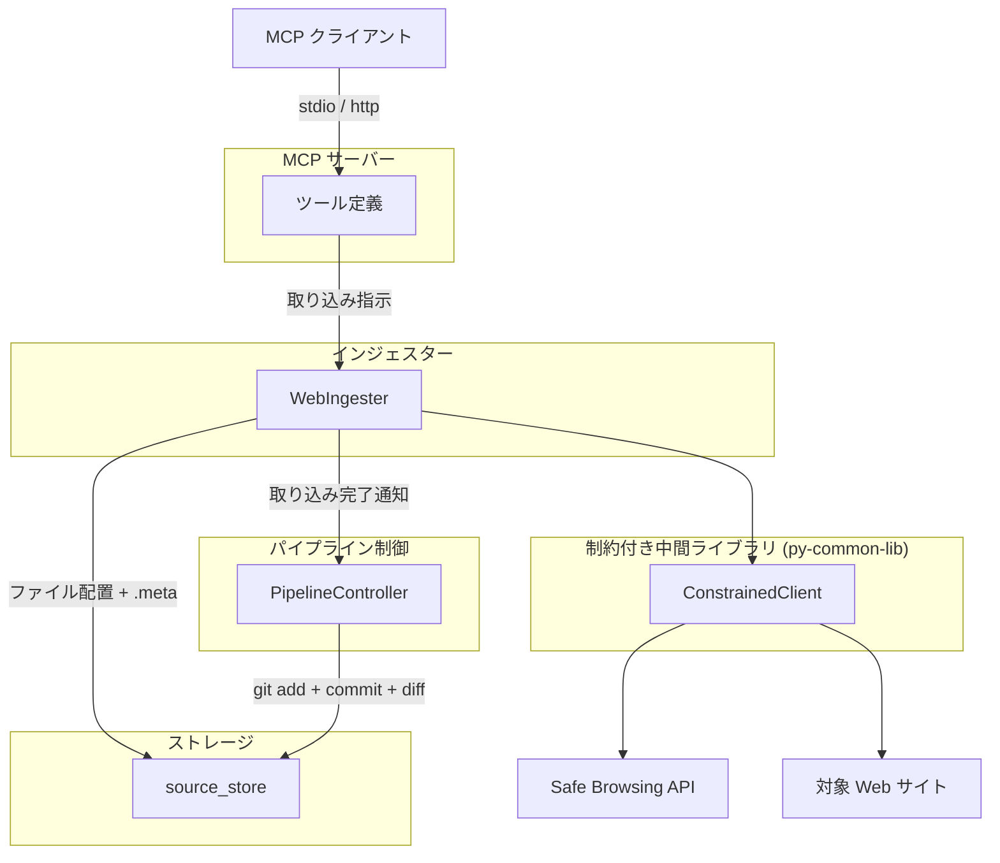
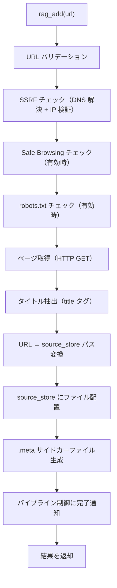
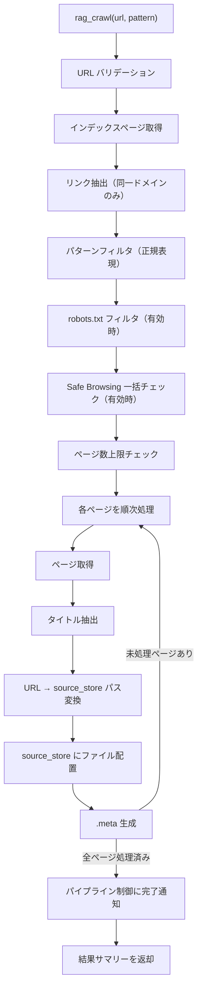
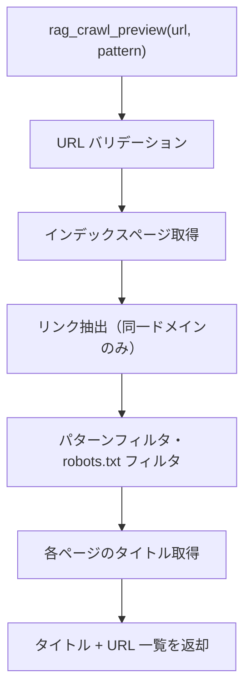
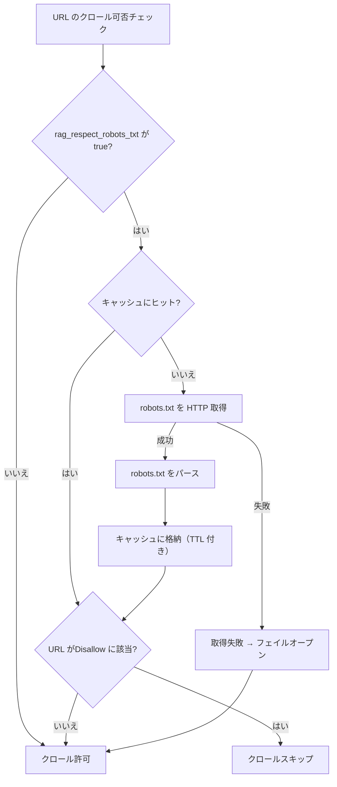

# Web インジェスター

## 概要

Web ページを HTTP 経由で取得し、source_store にファイルを配置するインジェスター。単一ページ追加（`rag_add`）、一括クロール（`rag_crawl`）の 2 つの取り込み操作に加え、クロール前のプレビュー機能（`rag_crawl_preview`）を提供する。

スコープ:

- 単一 URL の Web ページ取得と source_store への配置
- リンク集ページからの一括クロールと source_store への配置
- クロール対象ページのプレビュー（タイトル・URL 一覧の返却、source_store への配置なし）
- URL 安全性チェック（Google Safe Browsing API）
- robots.txt 遵守
- SSRF 対策

スコープ外:

- テキスト変換・チャンキング・インデックス構築（コンバーター・インデクサーの範疇）
- metadata.db への直接アクセス（パイプライン制御が .meta を読んで実行する）
- git 操作（パイプライン制御の範疇）
- ファイルの物理削除（source_store の制約）

## 背景

- 従来の WebIngester はデータ取得からテキスト変換・チャンキング・インデックス構築まで一貫して行っていたが、Embedding モデル変更時の再構築や変換方式変更への対応が困難だった
- 3 段パイプライン（インジェスター → コンバーター → インデクサー）への移行により、Web インジェスターの責務を「source_store へのファイル配置 + .meta サイドカーファイルの生成」に限定する
- URL 安全性チェック・robots.txt 遵守・SSRF 対策は、外部 Web サイトへのアクセスを担うインジェスター層に引き続き残す

## 制約

### インジェスター共通制約

[インジェスター共通仕様](common.md) の制約に従う。主要な共通制約:

- metadata.db アクセス禁止
- git 操作禁止
- オリジナルデータの無加工保存（取得した HTML をそのまま source_store に配置）
- ファイル削除禁止

### 外部 HTTP リクエスト

- ConstrainedClient（py-common-lib）経由で実行する
- ハードリミット（コード内定数。設定・引数・環境変数で緩和不可。厳格化は可能）:
  - 操作あたりリクエスト総数上限: 500（ConstrainedClient 共通）
  - 最低リクエスト間隔: 0.1 秒（ConstrainedClient 共通。robots.txt 取得、ページ取得、タイトル取得を含む全外部リクエスト間に適用）
  - 操作全体タイムアウト: 600 秒（許容範囲 1〜600 秒、ConstrainedClient 共通）
  - クロール対象ページ数上限: 500 ページ（Web インジェスター固有）
- サーキットブレーカー: 5 回連続失敗で操作全体を中断する（ConstrainedClient 共通）

### バリデーションとクランプ

- **バリデーションエラー（拒否）**: 空文字列の URL、無効なスキーム（http/https 以外）、ホスト名なし
- **クランプ（警告ログ付き）**: 正の値だが許容範囲外（例: `max_pages=600` → 500 にクランプ）。意図的な大きい値の指定を安全な範囲に制限する
- 設定値がハードリミットの許容範囲外の場合は範囲内にクランプする（エラーにはしない。警告ログを出力する）
- `--no-limit` 等の制約バイパス手段は一切設けない
- `0 = 無制限` のセマンティクスを排除する

### SSRF 対策

プライベート IP アドレス・ローカルホストへのリクエストを拒否し、サーバーサイドリクエストフォージェリ（SSRF）を防止する。

ブロック対象:

| アドレス範囲 | 区分 |
|-------------|------|
| `127.0.0.0/8` | IPv4 ループバック |
| `10.0.0.0/8` | RFC 1918 プライベート |
| `172.16.0.0/12` | RFC 1918 プライベート |
| `192.168.0.0/16` | RFC 1918 プライベート |
| `169.254.0.0/16` | リンクローカル |
| `::1` | IPv6 ループバック |
| `fc00::/7` | IPv6 ユニークローカル |
| `fe80::/10` | IPv6 リンクローカル |
| `localhost` / `localhost.localdomain` | ホスト名文字列マッチ |

検証手順:

1. ホスト名が `localhost` / `localhost.localdomain` でないことを確認する
2. DNS 解決（`socket.getaddrinfo()`）で全ての解決済み IP アドレスを取得する
3. 全ての IP アドレスがブロック対象に該当しないことを検証する
4. いずれかが該当する場合は `ValueError` を送出する

リダイレクト追従は SSRF 防止のため無効化する。リダイレクトレスポンス（3xx）はエラーとして扱う。

### robots.txt

- `rag_respect_robots_txt` が `true`（デフォルト）の場合、対象 URL の robots.txt を取得し、`Disallow` ディレクティブに従う
- User-Agent は `*`（デフォルト）として判定する
- `Crawl-delay` ディレクティブを読み取り、設定値より大きい場合はそちらを採用する
- robots.txt の取得結果は TTL ベースでキャッシュする（デフォルト: 3600 秒）。キャッシュキーは `scheme://hostname:port`
- robots.txt の取得に失敗した場合はフェイルオープン（全 URL を許可）

### URL 安全性チェック

- `rag_url_safety_check` が `true`（デフォルト）の場合、Google Safe Browsing API で URL の安全性を検証する
- API キーは OS セキュアストレージ（keyring）から取得する（サービス名: `rag-knowledge`、キー名: `GOOGLE_SAFE_BROWSING_API_KEY`）
- API キーが未登録の場合、チェックを無効化し警告ログを出力する
- 検出する脅威タイプ: MALWARE、SOCIAL_ENGINEERING、UNWANTED_SOFTWARE、POTENTIALLY_HARMFUL_APPLICATION
- チェック結果は TTL ベースでキャッシュする（デフォルト: 300 秒、最大 1000 エントリ）
- フェイルオープン/フェイルクローズ:
  - `rag_url_safety_fail_open=true`（デフォルト）: API 障害時は URL を許可する
  - `rag_url_safety_fail_open=false`: API 障害時は URL をブロックする

### 保存形式

- 取得した HTTP レスポンスボディを生バイト列のまま source_store に配置する。エンコーディング変換やテキスト加工は行わない
- テキスト変換（HTML → Markdown）はコンバーターの責務であり、インジェスターでは行わない
- .meta サイドカーファイルにはタイトル（`<title>` タグから抽出）を含める。タイトル抽出のためにレスポンスボディをメモリ上でデコードするが、保存対象は生バイト列である

## 外部連携

### 対象 Web サイト

| 連携先 | 用途 | 接続方式 |
|--------|------|---------|
| 対象 Web サイト | クロール対象ページの取得、robots.txt の取得 | HTTP/HTTPS（ConstrainedClient 経由） |

対象 Web サイトは不特定多数であり、公式 API 仕様は存在しない。HTML ベースのページ取得を行う。

### Google Safe Browsing API

| 連携先 | 用途 | 接続方式 |
|--------|------|---------|
| Google Safe Browsing API v4 | URL 安全性チェック | REST API（ConstrainedClient 経由、オプション） |

Safe Browsing API はオプション機能。API キーが未登録の場合は機能が無効化される。

## 想定プロファイル

### rag_add（単一ページ追加）

| 項目 | 内容 |
|------|------|
| 最悪ケースリクエスト数 | 1（Safe Browsing チェック）+ 1（robots.txt）+ 1（対象ページ）= 3 |
| 最悪ケース所要時間 | 3 × 30 秒（per-request タイムアウト）= 90 秒。操作全体タイムアウト 600 秒の範囲内 |
| 想定エラー率 | 低リスク。単一ページのみ |

### rag_crawl（一括クロール）

| 項目 | 内容 |
|------|------|
| 最悪ケースリクエスト数 | 1（インデックスページ）+ 1（robots.txt）+ 1（Safe Browsing 一括チェック。Lookup API v4 は最大 500 URL を 1 リクエストで検査可能）+ 497（個別ページ。バジェット 500 から先行リクエスト分を差し引き）= 500。バジェットトラッカー上限 500 で打ち切り |
| 最悪ケース所要時間 | 500 × 0.1 秒（ハードリミット最小間隔での理論最短）= 50 秒。デフォルト設定（1.0 秒間隔）では 500 秒。per-request タイムアウト・処理時間は含まない。操作全体タイムアウト 600 秒で打ち切り |
| 想定エラー率 | 外部 Web サイト依存。リトライ機構なし（失敗ページはスキップし処理を続行）。5 回連続失敗でサーキットブレーカーが発動し操作中断 |

### rag_crawl_preview（プレビュー）

| 項目 | 内容 |
|------|------|
| 最悪ケースリクエスト数 | 1（インデックスページ）+ 1（robots.txt）+ 498（タイトル取得）= 500。バジェットトラッカー上限 500 で打ち切り |
| 最悪ケース所要時間 | 500 × 0.1 秒（ハードリミット最小間隔での理論最短）= 50 秒。デフォルト設定（1.0 秒間隔）では 500 秒。操作全体タイムアウト 600 秒で打ち切り |
| 想定エラー率 | タイトル取得失敗時は空文字列とし処理を続行 |

## 安全制約

| 制約名 | 種別 | 値 | 解除可否 |
|--------|------|-----|---------|
| 操作あたりリクエスト総数上限 | ハードリミット | 500 | 引き上げ不可（引き下げ可） |
| 最低リクエスト間隔 | ハードリミット | 0.1 秒 | 引き下げ不可（引き上げ可） |
| 操作全体タイムアウト | ハードリミット | 600 秒、許容範囲 1〜600 秒 | 引き上げ不可（引き下げ可、下限 1 秒） |
| サーキットブレーカー閾値 | ハードリミット | 5 回連続失敗 | 引き上げ不可（引き下げ可） |
| クロール対象ページ数上限 | ハードリミット | 500 ページ | 引き上げ不可（引き下げ可） |
| SSRF 対策 | ハードリミット | プライベート IP・ローカルホストへのリクエスト拒否 | 無効化不可 |
| リダイレクト追従無効化 | ハードリミット | HTTP リダイレクト（3xx）をエラーとして扱う | 無効化不可 |
| HTTP エラーレスポンス拒否 | ハードリミット | HTTP 4xx/5xx レスポンスをエラーとして扱い、コンテンツを保存しない | 無効化不可 |
| クロール対象ページ数 | 設定値 | 許容範囲 1〜500、デフォルト 50 | 範囲内で変更可 |
| クロール遅延（リクエスト間隔） | 設定値 | 許容範囲 0.1〜60 秒、デフォルト 1.0 秒 | 範囲内で変更可 |
| リクエストタイムアウト | 設定値 | 許容範囲 1〜120 秒、デフォルト 30 秒 | 範囲内で変更可 |
| Safe Browsing キャッシュ最大エントリ数 | ハードリミット | 1000 エントリ | 引き上げ不可（引き下げ可） |
| 生 HTTP クライアント利用禁止 | CI チェック | `src/` 全体を grep で走査（httpx / aiohttp / requests / urllib.request）。`# safety:allowed` 行を除外。ConstrainedClient は py-common-lib パッケージで提供（`src/` 外のため検出対象外） | 許可例外は `# safety:allowed` コメントで可 |

テスト実行時の安全な値: クロール対象ページ数 3 件で実行する。異常値テスト（空 URL、無効スキーム、プライベート IP、上限超過）を含めること。

## インターフェース

### MCP ツール

| ツール | 入力 | 概要 |
|--------|------|------|
| `rag_add` | URL | 単一ページを HTTP 取得し source_store に配置する |
| `rag_crawl` | URL、パターン | リンク集から一括取得して source_store に配置する |
| `rag_crawl_preview` | URL、パターン | クロール対象のタイトル・URL 一覧を返す（配置なし） |

#### rag_add パラメータ

| パラメータ | 型 | 必須 | 説明 |
|-----------|-----|------|------|
| `url` | 文字列 | はい | 取り込み対象ページの URL |

ツール出力: source_store への配置結果（配置ファイル数、スキップ数、エラー数）

#### rag_crawl パラメータ

| パラメータ | 型 | 必須 | 説明 |
|-----------|-----|------|------|
| `url` | 文字列 | はい | リンク集ページの URL |
| `pattern` | 文字列 | いいえ | リンクをフィルタする正規表現パターン。デフォルト: フィルタなし（全リンクが対象） |

ツール出力: source_store への配置結果（配置ファイル数、スキップ数、エラー数）

#### rag_crawl_preview パラメータ

| パラメータ | 型 | 必須 | 説明 |
|-----------|-----|------|------|
| `url` | 文字列 | はい | リンク集ページの URL |
| `pattern` | 文字列 | いいえ | リンクをフィルタする正規表現パターン。デフォルト: フィルタなし |

ツール出力: クロール対象ページのタイトルと URL の一覧

### 設定項目

| 設定キー | 型 | 保管先 | デフォルト | 許容範囲 | 説明 |
|---------|-----|--------|-----------|---------|------|
| `rag_max_crawl_pages` | int | `config.toml` | 50 | 1〜500 | 1 回のクロール操作で取得する最大ページ数 |
| `rag_crawl_delay_sec` | float | `config.toml` | 1.0 | 0.1〜60 | リクエスト間の最低間隔（秒） |
| `rag_respect_robots_txt` | bool | `config.toml` | true | — | robots.txt の Disallow ディレクティブに従うか |
| `rag_robots_txt_cache_ttl` | int | `config.toml` | 3600 | 0 以上 | robots.txt キャッシュの有効期間（秒） |
| `rag_url_safety_check` | bool | `config.toml` | true | — | Google Safe Browsing API による URL 安全性チェックを有効にするか |
| `rag_url_safety_cache_ttl` | int | `config.toml` | 300 | 0 以上 | Safe Browsing チェック結果のキャッシュ有効期間（秒） |
| `rag_url_safety_fail_open` | bool | `config.toml` | true | — | Safe Browsing API 障害時に URL を許可するか |
| `rag_url_safety_timeout` | float | `config.toml` | 5.0 | 0 より大きい | Safe Browsing API のリクエストタイムアウト（秒） |
| `rag_crawl_request_timeout` | int | `config.toml` | 30 | 1〜120 | ページ取得時の per-request タイムアウト（秒） |

## コンポーネント構成

### Web インジェスターの位置付け



### コンポーネント一覧

| コンポーネント | 役割 |
|--------------|------|
| WebIngester | Web ページ取り込み用インジェスター。URL の安全性検証・robots.txt チェックを経て、ページ取得・source_store 配置を行う |
| WebCrawler | ページの HTTP 取得。SSRF 対策・リダイレクト無効化・文字エンコーディング検出を含む |
| RobotsChecker | robots.txt の取得・パース・キャッシュ管理。`can_fetch()` で個別 URL の許可判定を行う |
| SafeBrowsingClient | Google Safe Browsing API v4 によるURL 安全性チェック。キャッシュ付き |
| ConstrainedClient (py-common-lib) | 全外部 HTTP リクエストのゲートウェイ。ハードリミット・バジェット・サーキットブレーカーを統合する |

### 単一ページ追加フロー（rag_add）



### 一括クロールフロー（rag_crawl）



一括クロールでは、インデックスページの SSRF チェック通過により同一ドメインの安全性が確認される。個別ページの取得時にも WebCrawler が各 URL に対して SSRF 検証（DNS 解決 + IP 検証）を実行する。robots.txt フィルタを Safe Browsing チェックの前に実行するのは、robots.txt で除外される URL に対する不要な API 呼び出しを回避するためである。

### クロールプレビューフロー（rag_crawl_preview）



source_store への配置は行わない。クロール前に対象ページを確認する機能。

### リンク抽出

インデックスページの HTML からリンク（`<a href="...">`）を抽出する。

抽出規則:

- 同一ドメインのリンクのみを対象とする（異なるドメインへのリンクは除外）
- URL フラグメント（`#section`）は除去する
- 相対 URL はインデックスページの URL を基準に絶対 URL に解決する
- 重複 URL は除去する

### robots.txt チェック



- キャッシュキーは `scheme://hostname:port`
- キャッシュ TTL はドメインごとに `rag_robots_txt_cache_ttl` 秒
- `Crawl-delay` ディレクティブが設定されたリクエスト間隔より大きい場合、`Crawl-delay` の値を採用する

### URL パス変換と source_store 配置

URL から source_store 内のファイルパスへの変換は [source-store.md](../source-store.md) の「URL パス変換規則」に従う。

変換例:

| URL | source_store 内パス |
|-----|-------------------|
| `https://example.com/docs/guide` | `web/https/example.com/docs/guide` |
| `https://example.com/docs/guide.html` | `web/https/example.com/docs/guide.html` |
| `https://example.com/docs/guide?lang=ja` | `web/https/example.com/docs/guide？lang=ja` |
| `http://localhost:8080/api/docs` | `web/http/localhost：8080/api/docs` |

### .meta サイドカーファイル生成

データファイルの配置直後に同階層に .meta サイドカーファイルを生成する。フォーマットは [source-store.md](../source-store.md) の「.meta サイドカーファイル」に定義済み。

Web インジェスターが生成する .meta のフィールド:

| フィールド | 型 | 内容 |
|-----------|-----|------|
| `source_id` | str | ソース URL |
| `source_type` | str | `web` |
| `title` | str | `<title>` タグから抽出したページタイトル |
| `collected_at` | str | 取り込みタイムスタンプ（ISO 8601） |
| `url` | str | 元の URL |

.meta ファイルの形式例:

```yaml
source_id: "https://example.com/docs/guide"
source_type: web
title: "Guide Title"
collected_at: "2026-01-15T10:30:00+09:00"
url: "https://example.com/docs/guide"
```

### タイトル抽出

.meta の `title` フィールドに格納するために、取得した HTML からタイトルを抽出する。

- HTML の `<title>` タグのテキスト内容を使用する
- `<title>` タグが存在しない場合は空文字列とする

### source_id

URL を source_id として使用する。URL フラグメント（`#section`）は除去する。

source_id の決定方式は [source-store.md](../source-store.md) の「source_id の決定方式」に定義済み。

### 文字エンコーディング検出

タイトル抽出（.meta 生成用）のために、取得した HTTP レスポンスボディの文字エンコーディングを検出し、メモリ上でデコードする。source_store への保存は生バイト列のまま行うため、このデコード処理は保存データに影響しない。

- 文字エンコーディング自動検出ライブラリによる検出を使用する
- Shift_JIS、EUC-JP、UTF-8 等の日本語エンコーディングに対応する
- 検出に失敗した場合は UTF-8 でデコードし、デコードエラーは置換文字（U+FFFD）に変換する

### 重複検出

[インジェスター共通仕様](common.md) の重複検出方式に従う。

| 媒体 | source_id | ファイルパス導出 | 重複時の動作 |
|------|-----------|----------------|-------------|
| web | URL | URL パス変換規則で一意に決定 | 上書き |

同一 URL の再取り込み時はファイルを上書きし、.meta を再生成する。

### パイプライン制御への完了通知

ファイル配置を完了した後、パイプライン制御に取り込み完了を通知する。パイプライン制御は通知を受けて git commit → 差分検知 → コンバーター → インデクサーのフローを実行する。

詳細は [pipeline-controller.md](../pipeline-controller.md) の「インジェスター実行後のフロー」を参照。

## エッジケース

| ケース | 振る舞い |
|--------|---------|
| URL が空文字列 | バリデーションエラーとして拒否する |
| URL のスキームが http/https 以外 | バリデーションエラーとして拒否する |
| URL のホスト名がない | バリデーションエラーとして拒否する |
| プライベート IP・localhost へのアクセス | SSRF 対策としてリクエストを拒否する |
| HTTP リダイレクト（3xx） | SSRF 防止のためリダイレクト追従を無効化し、エラーとして扱う |
| HTTP クライアントエラー（4xx） | エラーとして扱い、レスポンスボディを保存しない。単一ページ取得（`rag_add`）では ValueError を発生させる。一括クロール（`rag_crawl`）では該当ページをスキップし、他のページの処理を続行する |
| HTTP サーバーエラー（5xx） | 4xx と同様にエラーとして扱う |
| DNS 解決に失敗した場合 | エラーログを出力し、該当ページをスキップする |
| robots.txt の Disallow に該当する URL | クロールをスキップする |
| robots.txt の取得に失敗した場合 | フェイルオープンでクロールを許可する |
| Safe Browsing API で危険と判定された URL | 該当ページをスキップし、警告ログを出力する |
| Safe Browsing API の障害時 | `rag_url_safety_fail_open` の設定に従い、URL を許可またはブロックする |
| `GOOGLE_SAFE_BROWSING_API_KEY` が未登録 | URL 安全性チェックを無効化し、警告ログを出力して処理を続行する |
| URL にフラグメント（`#section`）が含まれる場合 | フラグメント部分を除去してから処理する。フラグメント違いの URL は同一ファイルとして扱う |
| URL にクエリパラメータが含まれる場合 | クエリパラメータも含めてパスに変換する（`?` → `？` の全角変換）。同一パスで異なるクエリの URL は異なるファイルとして扱う |
| クロール時の個別ページエラー | ページ単位でエラーを隔離し、成功したページの処理を続行する |
| 同一 URL の再取り込み | ファイルを上書きし、.meta を再生成する |
| クロール対象ページ数が上限超過（設定値） | 上限に達した時点で残りのページをスキップし、取得済みデータを処理する |
| バジェット上限到達 | 取得済みデータを返し、上限到達の旨をログ出力する |
| サーキットブレーカー発動 | 操作を中断し、取得済みデータを返す。エラーの詳細をログ出力する |
| 操作全体タイムアウト | 操作を中断し、取得済みデータを返す |
| 設定値がハードリミット超過（正の値） | ハードリミット値にクランプし、警告ログを出力する |
| クロールプレビュー時のタイトル取得失敗 | タイトルを空文字列とし、URL のみ返す。他のページの処理は続行する |
| source_store ディレクトリが存在しない場合 | パイプライン制御がインジェスター起動前に source_store の存在を確認し、未作成であればディレクトリ作成と git リポジトリの初期化を行う。インジェスターはディレクトリの存在を前提とする |
| .meta ファイルの書き込みに失敗した場合 | ファイル物理削除禁止制約により、配置済みデータファイルのロールバックは行わない。エラーログを出力して処理を続行する |
| 文字エンコーディングの検出に失敗した場合 | UTF-8 としてデコードし、デコードエラーは置換文字（U+FFFD）に変換する |
| パス内の全角代替文字がユーザーの手動配置で使用された場合 | web 媒体のパス配下にユーザーが手動でファイルを配置することは想定しない |
| リンク集ページに同一ドメイン外のリンクのみ | 0 件対象として正常終了する |

## 関連ドキュメント

- [common.md](common.md) — インジェスター共通仕様
- [source-store.md](../source-store.md) — source_store 仕様（ディレクトリ構成、.meta 形式、URL パス変換）
- [pipeline-controller.md](../pipeline-controller.md) — パイプライン制御仕様（git 操作、ステージ間連携）
