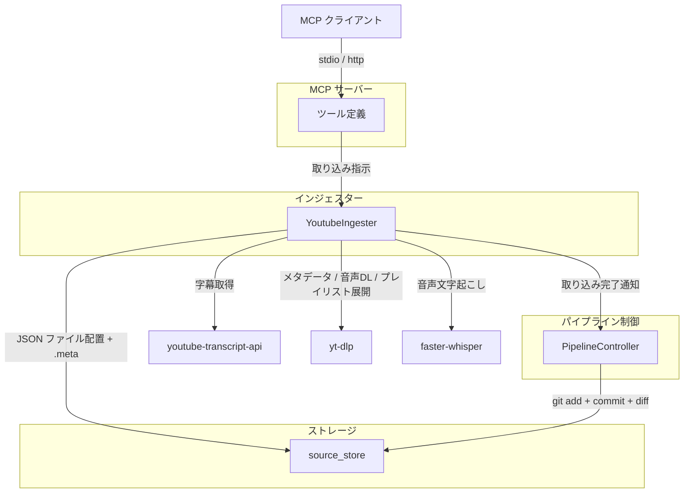
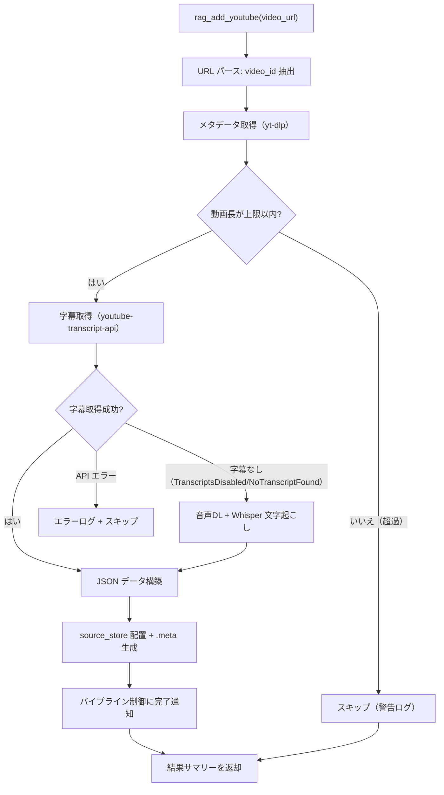
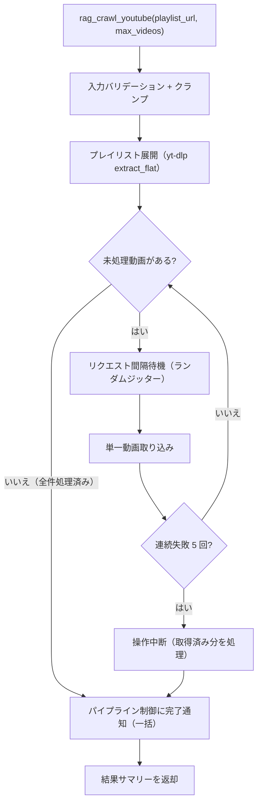

# YouTube インジェスター

## 概要

YouTube 動画の字幕・音声文字起こしを取得し、source_store にファイルを配置するインジェスター。字幕取得には youtube-transcript-api、メタデータ・音声ダウンロード・プレイリスト展開には yt-dlp、音声文字起こしには faster-whisper を使用する。

インジェスターの責務は「YouTube からのデータ取得 → source_store へのファイル配置 + .meta サイドカーファイルの生成」に限定される。テキスト変換・チャンキング・インデックス構築はパイプライン後段（コンバーター・インデクサー）が担当する。

スコープ:

- 単一動画の字幕・文字起こし取得と source_store への配置
- プレイリストの動画一覧展開と一括取り込み
- 字幕なし動画に対する音声文字起こし（faster-whisper）
- .meta サイドカーファイルの生成
- MCP ツール・CLI コマンドとしてのインターフェース提供
- パイプライン制御への取り込み完了通知

スコープ外:

- チャンネル URL からの動画取得（プレイリスト URL のみ対応）
- 動画のダウンロード・保存（音声は一時ファイルとして取得し処理後に削除）
- YouTube Data API v3 の使用（API キー不要の構成）
- テキスト変換・チャンキング・インデックス構築（コンバーター・インデクサーの範疇）
- metadata.db への直接アクセス（パイプライン制御の範疇）
- git 操作（パイプライン制御の範疇）
- ファイルの物理削除（source_store の制約）

## 背景

- YouTube 動画には技術解説・チュートリアル等の有用なナレッジが含まれるが、テキスト検索ができない
- 字幕（自動生成含む）や音声文字起こしを活用することで、動画内容をテキストとして検索可能にする
- 3段パイプラインへの移行により、インジェスターの責務を source_store へのファイル配置に限定する
- youtube-transcript-api は非公式 API であり、YouTube の仕様変更で動作しなくなるリスクがある

## 制約

### 責務の限定

[インジェスター共通仕様](common.md) の制約に従う:

- **metadata.db アクセス禁止**: metadata.db に直接アクセスしない。DB 登録はパイプライン制御が .meta を読んで実行する
- **git 操作禁止**: git 操作はパイプライン制御のみが実行する
- **オリジナルデータの無加工保存**: 字幕スニペット（タイムスタンプ + テキスト）と動画メタデータを JSON ファイルとして保存する。スニペットの結合・テキスト変換はコンバーターの範疇
- **ファイル削除禁止**: source_store 内のファイルの物理削除は一切行わない

### 外部アクセス

YouTube インジェスターは以下の 3 つのライブラリを使用して外部アクセスを行う:

| ライブラリ | 用途 | HTTP アクセス方式 |
|-----------|------|-----------------|
| youtube-transcript-api | 字幕取得 | ライブラリ内部で HTTP リクエストを実行（ConstrainedClient 経由ではない） |
| yt-dlp | メタデータ取得・音声DL・プレイリスト展開 | ライブラリ内部で HTTP リクエストを実行（ConstrainedClient 経由ではない） |
| faster-whisper | 音声文字起こし | 外部アクセスなし（ローカル処理） |

youtube-transcript-api と yt-dlp はそれぞれ独自の HTTP クライアントを内包しており、ConstrainedClient をトランスポート層として注入できない。そのため、以下の方式で安全制約を担保する:

- **リクエスト間隔**: インジェスター側で各動画の処理間にランダムジッター付きの待機を挟む。待機時間は `request_interval` を上限としてランダムに決定する（固定間隔によるボット検知を回避するため）
- **操作数上限**: プレイリストの動画数を `max_videos`（ハードリミット 500）で制限する
- **タイムアウト**: yt-dlp の `socket_timeout` オプションで制御する
- **サーキットブレーカー**: インジェスター側で連続失敗をカウントし、5 回連続失敗で操作を中断する

### IP ブロックリスク

youtube-transcript-api は非公式 API を使用しており、短時間に多数のリクエストを送ると YouTube に IP をブロックされる場合がある。

- IP ブロックは youtube-transcript-api のみに影響し、yt-dlp（メタデータ取得・音声ダウンロード）は継続動作する
- ブロックは一時的で、通常は数十分〜数時間で解除される
- プレイリスト一括取り込み時は `--max-videos` で段階的に取り込む（1 回あたり 10〜20 動画推奨）
- `rag_youtube_request_interval` を短くしすぎない
- IP ブロックが発生した場合は時間を置いて再実行する

### 外部ツール依存

- **FFmpeg**: yt-dlp の音声変換（`FFmpegExtractAudio`）に必要。Whisper フォールバック時に音声を WAV 形式に変換する際に使用する。未インストールの場合、音声文字起こしが失敗する
- **JS ランタイム**: yt-dlp の JS challenge 評価に必要。`deno` / `node` / `bun` / `quickjs` のいずれか 1 つを OS にインストールしておく。未インストールの場合、yt-dlp が劣化抽出モード（公式で deprecated 警告）に移行し、音声ダウンロード経路で transient エラーを引き起こすことがある

### バリデーションとクランプの使い分け

- **バリデーションエラー（拒否）**: 型不正（非整数など）、0、負数、不正な URL 形式
- **クランプ（警告ログ付き）**: 正の整数だが許容範囲外（例: `max_videos=600` → 500 にクランプ）
- `--no-limit` 等の制約バイパス手段は一切設けない
- `0 = 無制限` のセマンティクスを排除する

### 対応 URL 形式

YouTube インジェスターは以下の URL パターンを単一動画として認識する。判定ロジックは YouTube インジェスター内で一元定義し、BlueSky インジェスターから投稿内 URL の種別判定にも参照される（分類器と抽出器の drift 防止）。BlueSky 側の参照箇所は [bluesky.md](bluesky.md) を参照。

| URL パターン | 用途 |
|---|---|
| `https://{host}/watch?v={video_id}` | 通常の動画ページ |
| `https://youtu.be/{video_id}` | 短縮 URL |
| `https://{host}/shorts/{video_id}` | Shorts |
| `https://{host}/live/{video_id}` | ライブ配信 |
| `https://{host}/embed/{video_id}` | 埋め込みプレイヤー |
| `https://{host}/v/{video_id}` | レガシー埋め込み形式 |

補足:

- `{host}` は `www.youtube.com` / `youtube.com` / `m.youtube.com` のいずれか。ホストとパスは直交し、`m.youtube.com/shorts/{video_id}` 等の組み合わせも受理される
- `{video_id}` は 11 文字固定の識別子。各文字は半角英大文字・半角英小文字・半角数字、またはアンダースコア（`_`）・ハイフン（`-`）のいずれか
- `/watch?v={video_id}` の `v` 以外のクエリパラメータ（`t=30s`, `si=...` 等）と、短縮 URL・パスベース URL に付加されたクエリは判定で無視される
- ホスト名・パスのプレフィックス比較は大文字小文字を区別しない。一方 `{video_id}` 部分は大文字小文字を保持して抽出する
- プレイリスト URL（`/playlist?list=`）およびチャンネル URL（`/@handle`, `/c/`, `/channel/`）は本判定の対象外

### 重複検出

[インジェスター共通仕様](common.md) のファイルシステムベース方式に従う。source_id（source_store 内の相対パス）で該当ファイルの存在有無を判定する。

既存ファイルが存在する場合は上書きする（字幕は更新される可能性があるため）。上書き時は `overwritten` に計上する（`placed` には計上しない。[common.md](common.md) の「`placed` と `overwritten` の排他関係」参照）。

## 想定プロファイル

### rag_add_youtube（単一動画取り込み）

| 項目 | 内容 |
|------|------|
| 最悪ケースリクエスト数 | 3（メタデータ取得 1 + 字幕取得 1 + 音声DL 1）。字幕あり時は音声DL不要で 2 |
| 最悪ケース所要時間 | 字幕あり: 数秒。Whisper フォールバック: 音声DL時間 + 文字起こし時間（動画長依存） |
| 想定エラー率 | youtube-transcript-api 依存。非公式 API のため YouTube 仕様変更でエラー率が変動する可能性あり |

### rag_crawl_youtube（プレイリスト一括取り込み）

| 項目 | 内容 |
|------|------|
| 最悪ケースリクエスト数 | 1（プレイリスト展開）+ 取得動画数上限 x 3（各動画: メタデータ + 字幕 + 音声DL）。実際は大半が字幕ありのため約 2/3 |
| 最悪ケース所要時間 | (取得動画数上限 - 1) x リクエスト間隔（デフォルト・許容範囲は pydantic Field で定義）+ 字幕取得/Whisper 処理時間。操作全体タイムアウトは設けず、動画単位タイムアウト + サーキットブレーカーで安全性を担保する |
| 想定エラー率 | 個別動画の失敗はスキップして続行。サーキットブレーカー閾値（コード内定数）で操作中断 |

## インターフェース

### MCP ツール

| ツール | 入力 | 振る舞い |
|--------|------|---------|
| `rag_add_youtube` | `video_url` | 単一 YouTube 動画の字幕/文字起こしを取得し、source_store に JSON ファイルとして配置する |
| `rag_crawl_youtube` | `playlist_url`、`max_videos`（任意） | プレイリスト内の動画を一括取り込みする |

#### rag_add_youtube パラメータ

| パラメータ | 型 | 必須 | 説明 |
|-----------|-----|------|------|
| `video_url` | 文字列 | はい | YouTube 動画 URL。対応形式は[対応 URL 形式](#対応-url-形式) を参照 |

#### rag_crawl_youtube パラメータ

| パラメータ | 型 | 必須 | 説明 |
|-----------|-----|------|------|
| `playlist_url` | 文字列 | はい | YouTube プレイリスト URL（`youtube.com/playlist?list={id}` 形式） |
| `max_videos` | 整数 | いいえ | 取得する最大動画数 |

ツール出力: 取り込み結果のサマリーテキスト（配置ファイル数、スキップ数、エラー数）+ パイプライン処理結果

### CLI コマンド

| コマンド | 引数 | 振る舞い |
|---------|------|---------|
| `ingest-youtube` | `video_url` | `rag_add_youtube` と同等の処理を CLI から実行する |
| `ingest-youtube-playlist` | `playlist_url`、`--max-videos`（任意） | `rag_crawl_youtube` と同等の処理を CLI から実行する |

### 設定項目

| 設定項目 | 層 | 設計意図 |
|---------|-----|---------|
| `rag_youtube_max_videos` | 共通設定値 | プレイリスト取得時の最大動画数。API 負荷を抑制 |
| `rag_youtube_request_interval` | 共通設定値 | リクエスト間の最大待機時間（ランダムジッター付き）。固定間隔によるボット検知・IP ブロック回避 |
| `rag_youtube_request_timeout` | 共通設定値 | リクエストタイムアウト |
| `rag_youtube_whisper_model` | 環境依存値 | faster-whisper のモデル名。GPU メモリに応じて選択 |
| `rag_youtube_whisper_device` | 環境依存値 | faster-whisper のデバイス。GPU 有無で切替 |
| `rag_youtube_transcript_languages` | 共通設定値 | 字幕取得の優先言語 |
| `rag_youtube_max_duration` | 共通設定値 | 動画長上限。長時間動画の処理負荷を制限 |

YouTube スニペット結合に関する設定（`rag_youtube_merge_gap_sec`、`rag_youtube_merge_max_chars`）は [converter.md](../converter.md) の設定項目で定義。

## コンポーネント構成

### YouTube インジェスターの位置付け



### コンポーネント一覧

| コンポーネント | 役割 |
|--------------|------|
| YoutubeIngester | YouTube 動画取り込み用インジェスター。字幕/文字起こしを取得し、source_store に JSON ファイルを配置する |
| youtube-transcript-api | YouTube 内部 API 経由で字幕（手動・自動生成）を取得する。非公式 API |
| yt-dlp | 動画メタデータ取得、音声ダウンロード、プレイリスト展開を担当する |
| faster-whisper | 字幕なし動画の音声文字起こしを実行する（必須依存） |

### source_id

YouTube 動画 URL 形式を使用する: `https://www.youtube.com/watch?v={video_id}`

- `video_id`: YouTube 動画の 11 文字の一意識別子

### ディレクトリ構成

source_store 内の配置先: `youtube/{channel_id}/{video_id}.json`

- `channel_id`: `UC...` 形式のチャンネル ID（yt-dlp のメタデータから取得）
- `video_id`: 11 文字の動画 ID

```
source_store/
  youtube/
    UCxxxxxxxxxxxxxxxxxxxxxxx/
      xxxxxxxxxxx.json
      xxxxxxxxxxx.json.meta
      yyyyyyyyyyy.json
      yyyyyyyyyyy.json.meta
```

### 保存形式

各動画を字幕/文字起こしスニペット + メタデータの JSON として保存する。

| フィールド | 型 | 必須 | 説明 |
|-----------|-----|------|------|
| `video_id` | str | はい | YouTube 動画 ID |
| `title` | str | はい | 動画タイトル |
| `channel_id` | str | はい | チャンネル ID（`UC...` 形式） |
| `uploader` | str | はい | チャンネル名（表示名） |
| `upload_date` | str | はい | 公開日（`YYYYMMDD` 形式） |
| `duration` | int | はい | 動画長（秒） |
| `description` | str | はい | 動画説明文 |
| `transcript_source` | str | はい | テキスト取得元: `"subtitle"` または `"whisper"` |
| `whisper_model` | str | いいえ | Whisper 使用時のモデル名 |
| `language` | str | はい | 取得した字幕/文字起こしの言語コード |
| `snippets` | list | はい | タイムスタンプ付きテキストスニペットの配列 |

`snippets` 配列の各要素:

| フィールド | 型 | 説明 |
|-----------|-----|------|
| `start` | float | 開始時刻（秒） |
| `end` | float | 終了時刻（秒） |
| `text` | str | スニペットテキスト |

### .meta サイドカーファイルの生成

各 JSON ファイルと同階層に `.meta` サイドカーファイルを YAML 形式で生成する。

共通フィールド:

| フィールド | 型 | 内容 | 値の取得元 |
|-----------|-----|------|-----------|
| `source_type` | str | 媒体種別 | 固定値 `"youtube"` |
| `title` | str | 動画タイトル | yt-dlp メタデータの `title` フィールド |
| `collected_at` | str | 取り込みタイムスタンプ（ISO 8601） | 取り込み実行時の現在時刻 |

媒体別フィールド:

| フィールド | 型 | 内容 | 値の取得元 |
|-----------|-----|------|-----------|
| `url` | str | YouTube 動画 URL | `https://www.youtube.com/watch?v={video_id}` |
| `video_id` | str | YouTube 動画 ID | yt-dlp メタデータの `id` フィールド |
| `channel_id` | str | チャンネル ID（`UC...` 形式） | yt-dlp メタデータの `channel_id` フィールド |
| `uploader` | str | チャンネル名 | yt-dlp メタデータの `uploader` フィールド |
| `upload_date` | str | 公開日（`YYYYMMDD`） | yt-dlp メタデータの `upload_date` フィールド |
| `duration` | int | 動画長（秒） | yt-dlp メタデータの `duration` フィールド |
| `transcript_source` | str | テキスト取得元 | `"subtitle"` または `"whisper"` |
| `playlist_id` | str | プレイリスト ID（任意） | プレイリスト経由の場合のプレイリスト ID |

.meta ファイル例:

```yaml
source_type: youtube
url: "https://www.youtube.com/watch?v=xxxxxxxxxxx"
title: "Sample Video Title"
collected_at: "2026-03-23T10:30:00+09:00"
video_id: "xxxxxxxxxxx"
channel_id: "UCxxxxxxxxxxxxxxxxxxxxxxx"
uploader: "Sample Channel Name"
upload_date: "20240901"
duration: 120
transcript_source: "subtitle"
```

### 単一動画取り込みフロー



### プレイリスト一括取り込みフロー



## エッジケース

| ケース | 振る舞い |
|--------|---------|
| 字幕が無効な動画（`TranscriptsDisabled` / `NoTranscriptFound`） | Whisper フォールバックに移行する。字幕が存在しないことが確定した場合のみ |
| API エラー（IP ブロック、リクエスト失敗等） | Whisper にフォールバック**しない**。エラーログに記録し、`errors` に `metadata_fetch` カテゴリで計上してスキップする。一時的エラーで品質の低い Whisper 結果が生成されることを防ぐ |
| 動画取り込みの連続失敗がサーキットブレーカー閾値を超えた場合 | 以降の動画取り込みを中断し、`aborted=True` / `abort_reason="circuit breaker"` を設定する。取得済みデータは配置する（閾値はコード SSoT: `src/rag/pipeline/ingesters/youtube.py`） |
| 発話なし動画（音楽のみ等）| Whisper の VAD が発話なしと判定し、セグメント 0 件。空の snippets で source_store に配置する |
| 動画が非公開・削除済み | yt-dlp がエラーを返す。エラーログに記録し、`errors` に `metadata_fetch` カテゴリで計上してスキップする |
| 年齢制限付き動画 | yt-dlp がエラーを返す。エラーログに記録し、`errors` に `metadata_fetch` カテゴリで計上してスキップする |
| 動画の source_store への配置失敗（I/O エラー等） | `errors` に `placement` カテゴリで計上してエラーログを出力する |
| プレイリスト展開失敗 | `errors` に `metadata_fetch` カテゴリで計上し、プレイリスト取り込みを中断する |
| 音声ファイルが 500 MB を超える | ダウンロード後の実ファイルサイズでチェックする。超過時は警告ログ + スキップ（大容量ファイル自体は一度ダウンロードされる。動画長上限で間接的にサイズを制限） |
| タイトルが空または None の場合 | コンバーターが `"(Untitled)"` をフォールバック値として使用する |
| プレイリストが空 | 展開結果 0 件。placed=0 で正常終了する |
| 同一 video_id が複数の URL で指定された場合 | video_id でファイルパスが一意に決まるため、後から処理した方が上書きする。`overwritten` に計上する（`placed` には計上しない。[common.md](common.md) の「`placed` と `overwritten` の排他関係」参照） |
| channel_id が取得できない場合 | エラーログに記録してスキップし、`errors` に `metadata_fetch` カテゴリで計上する（ディレクトリ構成がチャンネル別のため、channel_id なしでは配置不可） |

## 関連ドキュメント

- [common.md](common.md) — インジェスター共通仕様
- [source-store.md](../source-store.md) — source_store 仕様
- [pipeline-controller.md](../pipeline-controller.md) — パイプライン制御仕様
- [converter.md](../converter.md) — コンバーター仕様
- [infrastructure/fake-mode.md](../infrastructure/fake-mode.md) — Fake モード基盤共通仕様
- [infrastructure/fake-adapters/youtube.md](../infrastructure/fake-adapters/youtube.md) — YouTube Fake Adapter（`.env` で `RAG_YOUTUBE_FAKE_MODE` を切替可能）
