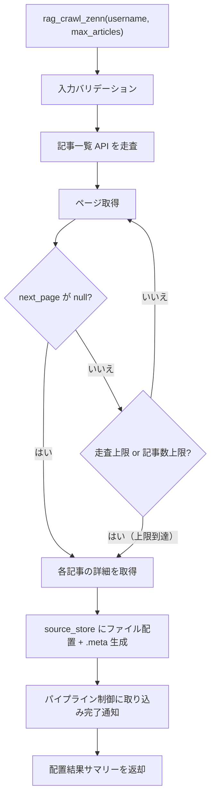

# Zenn インジェスター

## 概要

> **Note**: 本仕様書は設計先行（`docs(pre-impl)`）で作成している。後続の実装フェーズで既存インジェスターを本仕様に基づき再実装する。現行コードとの不整合は意図的である。

Zenn（zenn.dev）の記事を API 経由で取得し、source_store にファイルを配置するインジェスター。記事一覧の走査と個別記事の取得の 2 段階で動作する。

新アーキテクチャでは、本インジェスターの責務は「Zenn API からのデータ取得 → source_store へのファイル配置 + .meta サイドカーファイルの生成」に限定される。テキスト変換・チャンキング・インデックス構築はパイプライン後段（コンバーター・インデクサー）が担当する。

スコープ:

- 指定ユーザーの公開記事一覧の取得
- 個別記事の本文（HTML）取得と source_store への配置
- .meta サイドカーファイルの生成
- MCP ツールとしての記事取り込みインターフェースの提供
- パイプライン制御への取り込み完了通知

スコープ外:

- Zenn Books（本）の取得
- Zenn Scraps（スクラップ）の取得
- 記事の投稿・編集・削除（読み取り専用）
- テキスト変換・チャンキング・インデックス構築（コンバーター・インデクサーの範疇）
- metadata.db への直接アクセス（パイプライン制御の範疇）
- git 操作（パイプライン制御の範疇）
- ファイルの物理削除（source_store の制約）

## 背景

- Zenn は技術記事プラットフォームであり、API 経由で記事データを取得できる
- 既存の `rag_crawl`（Web クロール）は HTML ベースの取得方式であり、Zenn API のような構造化データ取得とは方式が異なる
- 過去に 3 回の品質事故（無制限 API リクエスト → Cloudflare IPv6 ブロック）を経験し、全て revert 済み
- 構造的安全対策（ConstrainedClient 導入、safety-guide の抜け道修正）が完了し、安全な再設計の前提が整った
- 旧アーキテクチャではインジェスターがデータ取得からインデックス構築まで一貫して行っていたが、3段パイプラインへの移行により責務を source_store へのファイル配置に限定する

## 制約

### 責務の限定

[インジェスター共通仕様](common.md) の制約に従う:

- **metadata.db アクセス禁止**: metadata.db に直接アクセスしない。DB 登録はパイプライン制御が .meta を読んで実行する
- **git 操作禁止**: git 操作はパイプライン制御のみが実行する
- **オリジナルデータの無加工保存**: Zenn API から取得した `body_html` をそのまま source_store に配置する
- **ファイル削除禁止**: source_store 内のファイルの物理削除は一切行わない

### 外部 HTTP リクエスト

- ConstrainedClient（py-common-lib）経由で実行する
- ConstrainedClient の共通ハードリミット:
  - 操作あたりリクエスト総数上限: 500
  - 最低リクエスト間隔: 0.1 秒（記事一覧走査中の各ページ間、個別記事取得間を含む全外部リクエスト間に適用）
  - 操作全体タイムアウト: 600 秒（許容範囲 1〜600 秒）
  - サーキットブレーカー: 5 回連続失敗で操作全体を中断
- Zenn インジェスター固有のハードリミット:
  - ページネーション走査上限: 10 ページ
  - 記事取得上限: 100 件

### バリデーションとクランプの使い分け

- **バリデーションエラー（拒否）**: 型不正（非整数など）、0、負数。明らかな誤入力であり、クランプで救済しない
- **クランプ（警告ログ付き）**: 正の整数だが許容範囲外（例: `max_articles=200` → 100 にクランプ）。意図的な大きい値の指定を安全な範囲に制限する
- `--no-limit` 等の制約バイパス手段は一切設けない
- `0 = 無制限` のセマンティクスを排除する

### 重複検出

[インジェスター共通仕様](common.md) のファイルシステムベース方式に従う。source_id（Zenn 記事 URL）からファイルパスを導出し、ファイルの存在有無で判定する。既存ファイルが存在する場合は上書きする。

## 想定プロファイル

### rag_crawl_zenn（Zenn 記事一括取り込み）

| 項目 | 内容 |
|------|------|
| 最悪ケースリクエスト数 | 10（ページネーション走査上限）+ 100（記事詳細取得上限）= 110。バジェットトラッカー上限 500 の範囲内 |
| 最悪ケース所要時間 | 110 × 0.1 秒（ハードリミット最小間隔での理論最短）= 11 秒。デフォルト設定（1.0 秒間隔）では 110 秒。per-request タイムアウト・処理時間は含まない。操作全体タイムアウト 600 秒の範囲内 |
| 想定エラー率 | Zenn API 依存。リトライ機構なし（失敗記事はスキップし処理を続行）。5 回連続失敗でサーキットブレーカーが発動し操作中断 |

## 安全制約

| 制約名 | 種別 | 値 | 解除可否 |
|--------|------|-----|---------|
| metadata.db 直接アクセス禁止 | ハードリミット | インジェスターから metadata.db への読み書きを禁止 | 不可 |
| git 操作禁止 | ハードリミット | インジェスターから git コマンドの直接呼び出しを禁止 | 不可 |
| ファイル物理削除禁止 | ハードリミット | source_store 内のファイル削除を禁止 | 不可 |
| 操作あたりリクエスト総数上限 | ハードリミット | 500 | 引き上げ不可（引き下げ可） |
| 最低リクエスト間隔 | ハードリミット | 0.1 秒 | 引き下げ不可（引き上げ可） |
| 操作全体タイムアウト | ハードリミット | 600 秒、許容範囲 1〜600 秒 | 引き上げ不可（引き下げ可、下限 1 秒） |
| サーキットブレーカー閾値 | ハードリミット | 5 回連続失敗 | 引き上げ不可（引き下げ可） |
| ページネーション走査上限 | ハードリミット | 10 ページ | 引き上げ不可（引き下げ可） |
| 記事取得上限 | ハードリミット | 100 件 | 引き上げ不可（引き下げ可） |
| 取得記事数 | 設定値 | 許容範囲 1〜100、デフォルト 50 | 範囲内で変更可 |
| リクエストタイムアウト | 設定値 | 許容範囲 1〜120 秒、デフォルト 30 秒 | 範囲内で変更可 |
| リクエスト間隔 | 設定値 | 許容範囲 0.1〜60 秒、デフォルト 1.0 秒 | 範囲内で変更可 |
| 生 HTTP クライアント利用禁止 | CI チェック | `src/` 全体を grep で走査（httpx / aiohttp / requests / urllib.request）。`# safety:allowed` 行を除外。ConstrainedClient は py-common-lib パッケージで提供（`src/` 外のため検出対象外） | 許可例外は `# safety:allowed` コメントで可 |

テスト実行時の安全な値: 走査上限 1 ページ、記事取得上限 3 件で実行する。異常値テスト（0、負数、上限超過）を含めること。

## インターフェース

### MCP ツール

既存の `rag_crawl`（URL ベースの Web クロール）とは独立したツールとして提供する。Zenn は API 経由でのデータ取得であり、Web クロールとは取得方式・制約が異なるため分離する。

| ツール | 入力 | 振る舞い |
|--------|------|---------|
| `rag_crawl_zenn` | username、max_articles（任意） | 指定ユーザーの Zenn 記事を API 経由で取得し、source_store にファイルを配置する。取り込み完了後、パイプライン制御に通知する |

ツール入力パラメータ:

| パラメータ | 型 | 必須 | 説明 |
|-----------|-----|------|------|
| `username` | 文字列 | はい | Zenn ユーザー名 |
| `max_articles` | 整数 | いいえ | 取得する最大記事数。デフォルト: 50、許容範囲: 1〜100 |

ツール出力: source_store への配置結果（配置ファイル数、スキップ数、エラー数）のサマリーテキスト。

プレビュー機能は提供しない。Zenn の記事一覧は公開情報（`https://zenn.dev/{username}` で閲覧可能）であり、取り込み前の確認は Zenn サイト上で直接行える。記事一覧走査自体が軽量な操作であり、Web クロールのように未知のリンク先を探索する性質がないため、専用のプレビューツールは不要と判断した。

### 設定項目

| 設定項目 | 型 | 保管先 | 内容 | デフォルト | 許容範囲 |
|---------|-----|--------|------|-----------|---------|
| `zenn.max_articles` | 整数 | `config.toml` | 取得する最大記事数 | 50 | 1〜100 |
| `zenn.request_timeout` | 整数 | `config.toml` | 記事取得時のリクエストタイムアウト（秒） | 30 | 1〜120 |
| `zenn.request_interval` | 小数 | `config.toml` | リクエスト間の最低間隔（秒） | 1.0 | 0.1〜60 |

## コンポーネント構成

### source_store 内のディレクトリ構成

Zenn インジェスターは `zenn/` ディレクトリ配下にユーザー名 + コンテンツ種別で階層化してファイルを配置する。

```
source_store/
  zenn/
    {username}/
      articles/
        {slug}.html
        {slug}.html.meta
```

- ファイル形式: Zenn API の `body_html` をそのまま保存する（HTML ファイル）
- ファイル名: 記事スラッグに `.html` 拡張子を付与
- .meta: データファイルと同階層に配置

### source_id とファイルパスの対応

| 項目 | 値 |
|------|-----|
| source_id | `https://zenn.dev/{username}/articles/{slug}` |
| ファイルパス | `zenn/{username}/articles/{slug}.html` |

source_id は記事の公開 URL であり、安定した識別子として機能する。

### .meta サイドカーファイル

[source-store.md](../source-store.md) の Zenn 媒体別フィールド定義に従い、以下のフィールドを含む .meta を生成する。

共通フィールド:

| フィールド | 型 | 内容 | 値の取得元 |
|-----------|-----|------|-----------|
| `source_id` | str | ソース識別子 | `https://zenn.dev{path}`（API レスポンスの `path` フィールド） |
| `source_type` | str | 媒体種別 | 固定値 `zenn` |
| `title` | str | 記事タイトル | API レスポンスの `title` フィールド |
| `collected_at` | str | 取り込みタイムスタンプ（ISO 8601） | 取り込み実行時の現在時刻 |

Zenn 固有フィールド:

| フィールド | 型 | 内容 | 値の取得元 |
|-----------|-----|------|-----------|
| `slug` | str | 記事スラッグ | API レスポンスの `slug` フィールド |
| `article_type` | str | 記事種別 | API レスポンスの `article_type` フィールド（`tech`, `idea` 等） |
| `published_at` | str | 公開日時（ISO 8601） | API レスポンスの `published_at` フィールド |
| `liked_count` | int | いいね数 | API レスポンスの `liked_count` フィールド |
| `topics` | list | トピックタグのリスト | API レスポンスの `topics` フィールド |
| `username` | str | 著者のユーザー名 | MCP ツール入力の `username` パラメータ |

.meta ファイルの形式例:

```yaml
source_id: "https://zenn.dev/alice/articles/sample-article"
source_type: zenn
title: "Sample Article Title"
collected_at: "2026-01-15T10:30:00+09:00"
slug: "sample-article"
article_type: "tech"
published_at: "2026-01-10T12:00:00+09:00"
liked_count: 42
topics:
  - "Python"
  - "FastAPI"
username: "alice"
```

### 記事一括取り込みフロー



### 記事一覧走査の処理手順

1. ページ番号を 1 に初期化する
2. 記事一覧 API にリクエストを送信する
3. レスポンスから記事の `slug` を抽出し、記事リストに追加する
4. 終了判定（以下のいずれかで走査を終了する）:
   - `next_page` が `null`（最終ページ）
   - ページネーション走査上限（10 ページ）に到達
   - 記事数上限に到達
   - バジェット上限に到達（ConstrainedClient）
   - サーキットブレーカー発動（ConstrainedClient）
5. 終了条件を満たさない場合、`next_page` の値でページ番号を更新し、手順 2 に戻る
6. 収集した `slug` のリストを返す

### 個別記事取得とファイル配置の処理手順

1. 記事詳細 API（`/api/articles/{slug}`）にリクエストを送信する
2. レスポンスから `body_html` を取得する
3. `body_html` をそのまま source_store に配置する（配置先: `zenn/{username}/articles/{slug}.html`）
4. .meta サイドカーファイルを同階層に生成する（配置先: `zenn/{username}/articles/{slug}.html.meta`）
5. 重複検出: 配置先パスにファイルが既に存在する場合は上書きする

### パイプライン制御との連携

全記事のファイル配置が完了した後、パイプライン制御に取り込み完了を通知する。パイプライン制御は通知を受けて以下を実行する:

1. source_store で `git add -A` + `git commit` を実行
2. `git diff` で変更ファイルを特定
3. 変更ファイルをコンバーター → インデクサーで処理

詳細は [pipeline-controller.md](../pipeline-controller.md) の「インジェスター実行後のフロー」を参照。

## 外部連携

### Zenn API

Zenn は公式の API ドキュメントを公開していない。以下は観測されたエンドポイントの仕様であり、予告なく変更される可能性がある（2026-03 時点の観測に基づく）。

| 連携先 | 用途 | 接続方式 |
|--------|------|---------|
| Zenn API | 記事一覧・記事詳細の取得 | REST API（ConstrainedClient 経由） |

#### 記事一覧エンドポイント

| 項目 | 内容 |
|------|------|
| URL | `https://zenn.dev/api/articles?username={username}&order=latest&page={page}` |
| メソッド | GET |
| 認証 | 不要 |
| ページサイズ | 1 ページあたり最大 48 件（サーバー側固定） |
| ページネーション | レスポンスの `next_page` フィールド。`null` の場合は最終ページ |

レスポンス構造:

| フィールド | 型 | 説明 |
|-----------|-----|------|
| `articles` | 配列 | 記事オブジェクトの配列 |
| `next_page` | 整数 or null | 次のページ番号。最終ページでは `null` |

記事オブジェクトの主要フィールド:

| フィールド | 型 | 説明 |
|-----------|-----|------|
| `slug` | 文字列 | 記事の識別子（URL の一部） |
| `title` | 文字列 | 記事タイトル |
| `path` | 文字列 | 記事パス（例: `/username/articles/slug`） |
| `article_type` | 文字列 | `"tech"` または `"idea"` |
| `published_at` | 文字列 | 公開日時（ISO 8601） |
| `body_updated_at` | 文字列 | 本文更新日時（ISO 8601） |
| `liked_count` | 整数 | いいね数 |
| `body_letters_count` | 整数 | 本文文字数 |

#### 記事詳細エンドポイント

| 項目 | 内容 |
|------|------|
| URL | `https://zenn.dev/api/articles/{slug}` |
| メソッド | GET |
| 認証 | 不要 |

レスポンスには記事一覧の全フィールドに加え、以下が含まれる:

| フィールド | 型 | 説明 |
|-----------|-----|------|
| `body_html` | 文字列 | 記事本文（HTML 形式） |
| `topics` | 配列 | トピックタグの配列 |

## エッジケース

| ケース | 振る舞い |
|--------|---------|
| ユーザーが存在しない | API が空の `articles` 配列を返す。0 件取得として正常終了する |
| ユーザーの記事が 0 件 | 空の `articles` 配列。0 件取得として正常終了する |
| 記事詳細取得に失敗（404 等） | 該当記事をスキップし、他の記事の処理を続行する。エラーをログ出力する |
| 記事一覧 API のレスポンス形式変更 | JSON パースエラーまたは必須フィールド欠落として処理を中断する。エラーの詳細をログ出力する |
| 記事詳細 API のレスポンス形式変更 | 該当記事をスキップし、他の記事の処理を続行する。エラーの詳細をログ出力する |
| `body_html` が空 | 該当記事をスキップする。空の HTML ファイルは source_store に配置しない |
| 下書き・非公開記事 | API が公開記事のみを返すため、考慮不要 |
| 大量記事ユーザー（480 件超 = 10 ページ超） | ページネーション走査上限（10 ページ）で打ち切る。取得済み記事を処理し、上限到達の旨を警告ログに出力する |
| 同一記事の再取り込み | source_id（記事の公開 URL）からファイルパスを導出し、既存ファイルを上書きする |
| バジェット上限到達 | 取得済みデータを配置し、上限到達の旨をログ出力する |
| サーキットブレーカー発動 | 操作を中断し、取得済みデータを配置する。エラーの詳細をログ出力する |
| 操作全体タイムアウト | 操作を中断し、取得済みデータを配置する |
| 設定値がハードリミット超過（正の整数） | ハードリミット値にクランプし、警告ログを出力する |
| `max_articles` に 0 や負数を指定 | バリデーションエラーとして拒否する（クランプ対象外） |
| `username` が空文字列 | バリデーションエラーとして拒否する |
| Zenn API のレート制限（429） | ConstrainedClient のサーキットブレーカーで検出される。連続失敗として計上し、閾値超過で操作を中断する |
| .meta ファイルの書き込みに失敗した場合 | ファイル物理削除禁止制約により、配置済みデータファイルのロールバックは行わない。エラーログを出力して処理を続行する |

## 関連ドキュメント

- [common.md](common.md) — インジェスター共通仕様
- [source-store.md](../source-store.md) — source_store 仕様（ディレクトリ構成、.meta 形式、source_id 決定方式）
- [pipeline-controller.md](../pipeline-controller.md) — パイプライン制御仕様（git 操作、ステージ間連携）
