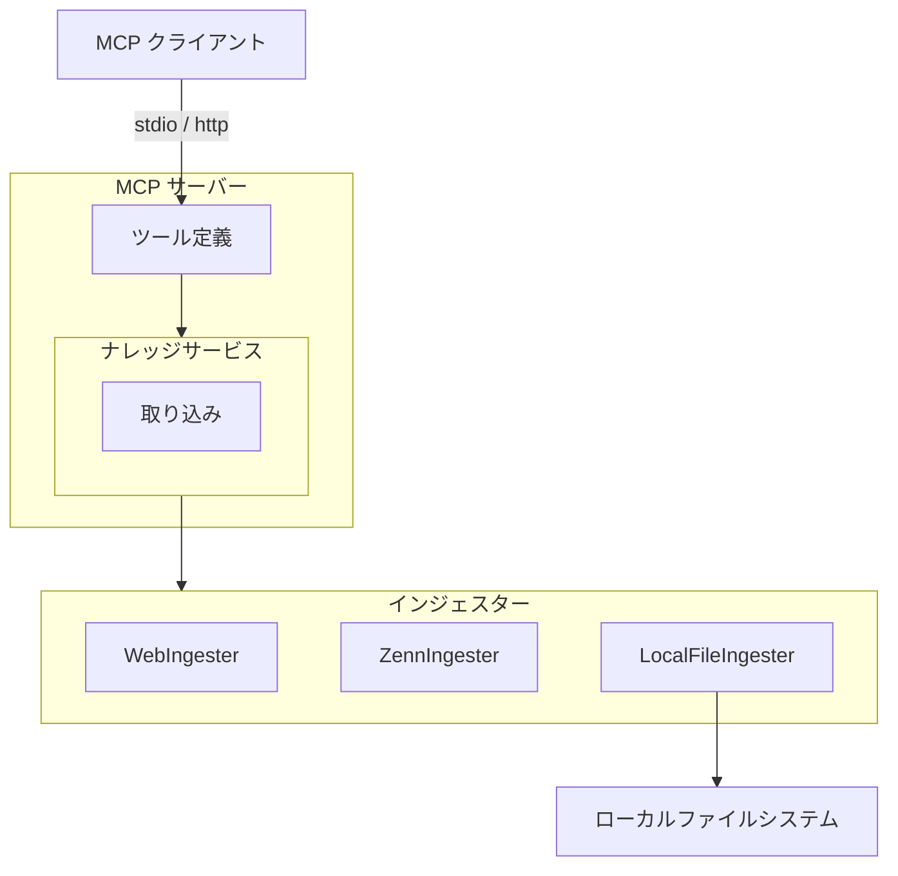
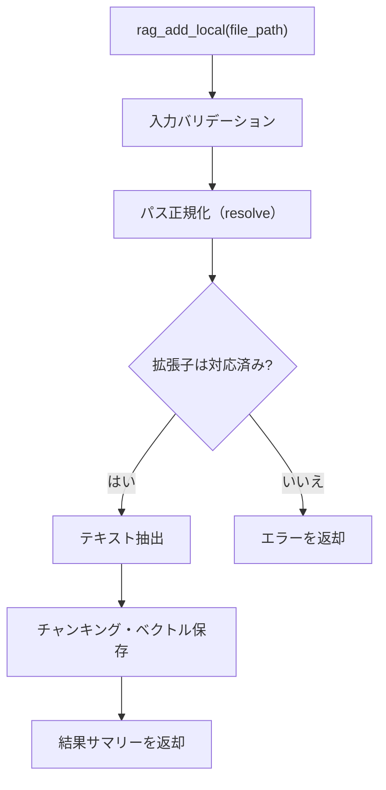
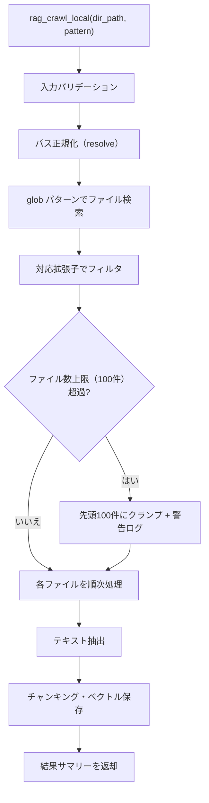

# ローカルファイルインジェスター

## 概要

ローカルファイルシステム上のドキュメントを読み取り、ナレッジベースに取り込むインジェスター。
単一ファイルの追加とディレクトリ一括取り込みの 2 つの操作を提供する。

スコープ:

- 単一ファイルのテキスト抽出とナレッジベースへの取り込み
- ディレクトリ内ファイルの glob パターンによる一括取り込み
- 複数ファイル形式（Markdown、プレーンテキスト、PDF、AsciiDoc）への対応
- MCP ツールとしてのファイル取り込みインターフェースの提供

スコープ外:

- リモートファイルシステム（SMB、NFS 等）上のファイル取得
- バイナリファイル（画像、音声、動画等）の取り込み
- ファイルの書き込み・編集・削除（読み取り専用）
- ファイル変更の自動監視（ウォッチ機能）

## 背景

- 既存のインジェスター（WebIngester、ZennIngester）は外部 Web リソースからの取り込みに特化しており、ローカルファイル（職務経歴書、学習ノート等）を直接取り込む手段がない
- BaseIngester / IngestedContent の共通インターフェースに準拠し、プラグイン構造（#109）の一環として設計する

## 制約

- ファイル読み取りはローカルファイルシステムのみ対象とする（外部 HTTP リクエストは発生しない）
- パストラバーサル対策: ファイルパスを `Path.resolve()` で正規化し、`..` を含むパスの解決後に実際のファイルシステムパスとして扱う
- アクセス許可ディレクトリの制限は設けない（OS レベルのファイル権限に委ねる）
- ハードリミット（コード内定数。設定・引数・環境変数で緩和不可。厳格化は可能）:
  - ディレクトリ一括取り込み時のファイル数上限: 100 件
- バリデーションとクランプの使い分け:
  - **バリデーションエラー（拒否）**: 空文字列のパス、存在しないファイル、対応していない拡張子
  - **クランプ（警告ログ付き）**: 一括取り込み時に glob パターンがハードリミットを超える件数にマッチした場合、先頭 100 件のみ処理する

## 安全制約

| 制約名 | 種別 | 値 | 解除可否 |
|--------|------|-----|---------|
| ディレクトリ一括取り込みファイル数上限 | ハードリミット | 100 件 | 引き上げ不可（引き下げ可） |
| パストラバーサル対策 | 構造的安全 | `Path.resolve()` による正規化 | 無効化不可 |

テスト実行時の安全な値: ファイル数上限 5 件で実行する。異常値テスト（空パス、存在しないファイル、未対応拡張子、ハードリミット超過）を含めること。

## インターフェース

### MCP ツール

既存の `rag_add`（URL ベースの単一ページ追加）および `rag_crawl`（URL ベースの一括クロール）とは独立した新規ツールとして追加する。ローカルファイルはファイルシステムからの読み取りであり、Web クロールとは取得方式・制約が異なるため分離する。

> **Note**: 本仕様書は設計先行（`docs(pre-impl)`）で作成している。後続の実装フェーズで `rag-knowledge.md` のツール数・ツール一覧も併せて更新する。

| ツール | 入力 | 振る舞い |
|--------|------|---------|
| rag_add_local | file_path | 単一ローカルファイルを読み取り、ナレッジベースに取り込む。同一ファイルの再取り込み時は `source_id`（ファイルの絶対パス）の一致で検出し、既存の知識を最新に置き換える |
| rag_crawl_local | dir_path、pattern（任意） | 指定ディレクトリ内のファイルを glob パターンで検索し、一括でナレッジベースに取り込む。同一ファイルの再取り込み時は `source_id`（ファイルの絶対パス）の一致で検出し、既存の知識を最新に置き換える |

#### rag_add_local パラメータ

| パラメータ | 型 | 必須 | 説明 |
|-----------|-----|------|------|
| `file_path` | 文字列 | はい | 取り込み対象ファイルのパス（絶対パスまたは相対パス） |

ツール出力: 取り込み結果のサマリーテキスト（ファイル名、チャンク数）

#### rag_crawl_local パラメータ

| パラメータ | 型 | 必須 | 説明 |
|-----------|-----|------|------|
| `dir_path` | 文字列 | はい | 取り込み対象ディレクトリのパス（絶対パスまたは相対パス） |
| `pattern` | 文字列 | いいえ | glob パターン。デフォルト: `**/*`（再帰的に全対応ファイルを検索） |

ツール出力: 取り込み結果のサマリーテキスト（処理ファイル数、総チャンク数、スキップ数、エラー数）

### 対応ファイル形式

| 拡張子 | テキスト抽出方式 |
|--------|----------------|
| `.md` | そのまま Markdown として取り込む |
| `.txt` | プレーンテキストとして取り込む（構造変換なし） |
| `.pdf` | `pymupdf4llm` で Markdown に変換して取り込む |
| `.adoc` | AsciiDoc としてそのまま取り込む（チャンカーが AsciiDoc モードで処理。#174 に依存） |

対応拡張子は環境変数 `RAG_LOCAL_SUPPORTED_EXTENSIONS` で追加可能（セクション「設定項目」参照）。追加した拡張子のファイルはプレーンテキストとして取り込む。

### source_id

ファイルの絶対パス（`Path.resolve()` で正規化済み）を `source_id` として使用する。

- 例: `/home/user/documents/resume.md`
- 相対パスで指定された場合も、内部で絶対パスに変換してから `source_id` とする
- 同一ファイルの再取り込み時は、`source_id` の一致で既存チャンクを削除→再登録する（既存インジェスターと同一パターン）

### 設定項目

| 環境変数 | 型 | デフォルト | 説明 |
|---------|-----|-----------|------|
| `RAG_LOCAL_SUPPORTED_EXTENSIONS` | 文字列 | `".md,.txt,.pdf,.adoc"` | 対応ファイル拡張子のカンマ区切りリスト。先頭にドット（`.`）を含める |

## コンポーネント構成

### ローカルファイルインジェスターの位置付け

### コンポーネント一覧

| コンポーネント | 役割 |
|--------------|------|
| LocalFileIngester | ローカルファイル取り込み用インジェスター。BaseIngester を継承し、ファイルシステムからドキュメントを読み取る |

### 単一ファイル取り込みフロー

### ディレクトリ一括取り込みフロー

### 単一ファイル取り込みの処理手順

1. `file_path` をバリデーションする（空文字列チェック）
2. `Path.resolve()` でパスを正規化する（シンボリックリンク解決、`..` 除去）
3. ファイルの存在を確認する
4. 拡張子が対応リストに含まれるか確認する
5. ファイル形式に応じたテキスト抽出を行う（テキストファイルは UTF-8 エンコーディングで読み取る）:
   - `.md`: ファイル内容をそのまま読み取る
   - `.txt`: ファイル内容をそのまま読み取る
   - `.pdf`: `pymupdf4llm` で Markdown に変換する
   - `.adoc`: ファイル内容をそのまま読み取る
   - その他（設定で追加された拡張子）: プレーンテキストとして読み取る
6. IngestedContent を構築する:
   - `source_id`: 正規化済み絶対パス
   - `title`: ファイル名（拡張子なし）
   - `text`: 抽出済みテキスト
   - `source_type`: `"local"`
   - `metadata`: `file_extension`、`file_size_bytes`、`file_path`（元の指定パス）
7. ナレッジサービス経由でチャンキング・ベクトル保存を行う

### ディレクトリ一括取り込みの処理手順

1. `dir_path` をバリデーションする（空文字列チェック）
2. `Path.resolve()` でパスを正規化する
3. ディレクトリの存在を確認する
4. glob パターンでファイルを検索する（デフォルト: `**/*`）
5. 対応拡張子でフィルタする
6. ファイル数がハードリミット（100 件）を超える場合、先頭 100 件にクランプし警告ログを出力する
7. 各ファイルに対して単一ファイル取り込みの処理手順（手順 2〜7）を順次実行する
8. 個別ファイルの処理エラーは該当ファイルをスキップし、他のファイルの処理を続行する
9. 結果サマリーを返す（処理ファイル数、総チャンク数、スキップ数、エラー数）

## エッジケース

| ケース | 振る舞い |
|--------|---------|
| ファイルが存在しない | バリデーションエラーとして拒否する |
| ディレクトリが存在しない | バリデーションエラーとして拒否する |
| 対応していない拡張子のファイル | バリデーションエラーとして拒否する（単一取り込み時）。一括取り込み時はフィルタで除外する |
| `file_path` が空文字列 | バリデーションエラーとして拒否する |
| `dir_path` が空文字列 | バリデーションエラーとして拒否する |
| パスに `..` が含まれる | `Path.resolve()` で正規化し、解決後の実パスで処理する |
| シンボリックリンク | `Path.resolve()` でリンク先を解決し、実ファイルを処理する |
| ファイルの読み取り権限がない | 該当ファイルをスキップし、エラーをログ出力する |
| ファイルサイズが 0 バイト | 該当ファイルをスキップする。空テキストの取り込みは行わない |
| テキストエンコーディングが UTF-8 以外 | `UnicodeDecodeError` をキャッチし、該当ファイルをスキップする。エラーをログ出力する |
| PDF の変換に失敗 | 該当ファイルをスキップし、エラーをログ出力する |
| glob パターンがファイル数上限を超過 | 先頭 100 件にクランプし、警告ログを出力する。超過分は処理しない |
| glob パターンに一致するファイルが 0 件 | 0 件処理として正常終了する |
| 同一ファイルの再取り込み | `source_id`（絶対パス）の一致で検出し、既存データを最新に置き換える |
| ファイルが指定されたがディレクトリだった | バリデーションエラーとして拒否する（`rag_add_local` の場合） |
| ディレクトリが指定されたがファイルだった | バリデーションエラーとして拒否する（`rag_crawl_local` の場合） |

## 関連ドキュメント

- [rag-knowledge.md](rag-knowledge.md) -- RAG ナレッジ基盤仕様
- [zenn-ingester.md](zenn-ingester.md) -- Zenn インジェスター仕様（参考: インジェスター設計パターン）

> **TODO:#174** `.adoc` ファイルのチャンキングはチャンカーの AsciiDoc モード対応（#174）に依存する。#174 完了まで `.adoc` の取り込みは未対応。
