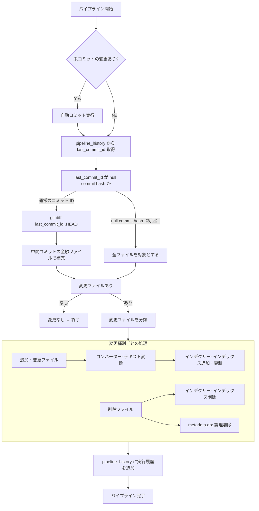
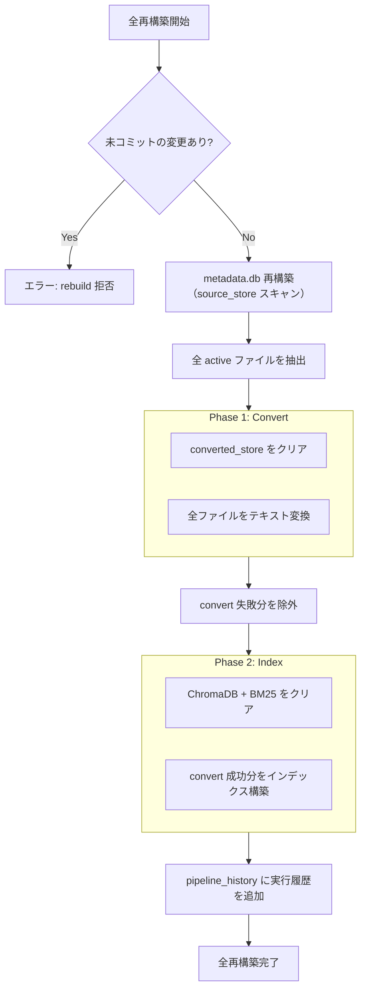
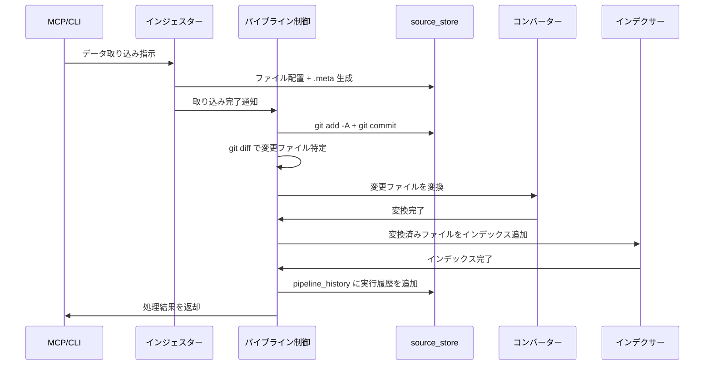

# パイプライン制御

## 概要

パイプライン制御は、3段パイプライン（インジェスター → コンバーター → インデクサー）のステージ間連携を担当するオーケストレーション層である。

各ステージは自分の責務のみに集中し、パイプライン制御が以下を一元管理する:

- source_store の git 操作（init、add、commit、diff）
- git diff による変更ファイルの特定
- ステージ間のデータ受け渡し
- 更新モードの制御（差分更新 / 全再構築）

スコープ:

- パイプラインの実行制御（差分更新、全再構築、コンバートのみ再実行、インデックスのみ再構築）
- source_store の git 操作（init、add、commit、diff）
- 変更ファイルの分類とステージへの振り分け
- `last_commit_id` の管理

スコープ外:

- 各ステージの内部処理ロジック（データ取得、テキスト変換、インデックス構築）
- 外部 API 通信（インジェスターの範疇）
- source_store のディレクトリ構成・.meta 形式の定義（source_store 仕様の範疇）

## 背景

- 3段パイプラインの各ステージ（インジェスター、コンバーター、インデクサー）が git 操作やステージ間連携を個別に実装すると、責務が混在し保守性が低下する
- git diff を使った変更検知を一箇所で管理することで、差分更新の信頼性を確保する

## 制約

- **git 操作の一元管理**: git 操作はパイプライン制御のみが実行する。各ステージ（インジェスター、コンバーター、インデクサー）は git コマンドを直接呼び出さない
- **ステージの独立性**: 各ステージは入力と出力のみを知り、他のステージの内部には依存しない
- **変更検知の正確性**: `last_commit_id` と HEAD の差分のみを処理対象とする。差分外のファイルは処理しない（全再構築モードを除く）
- **冪等性**: 同じ差分に対してパイプラインを再実行しても、結果が変わらないこと
- **バッチサイズ無制限**: 各ファイルを順次処理しメモリに全件を保持しないため、パイプライン制御層としてのバッチサイズ制限は設けない。ただし、後続ステージ（特にインデクサーの Embedding 生成）がオンラインプロバイダを使用する場合、外部 API へのリクエストが発生する。外部 API のレート制限・バックオフは各ステージ側の責務とする
- **git リネーム検知**: git のデフォルト挙動（類似度 50% 以上でリネームと判定）に従う。閾値のカスタマイズは行わない
- **同期処理のスレッドオフロード**: `_run_processing_loop` に渡される sync な `process_fn` は `asyncio.to_thread` でスレッドプールへオフロードされ、イベントループをブロックしない。これにより `concurrency` 設定が convert フェーズでも実効化する
- **差分更新ハンドラのオフロード**: 差分更新の各ハンドラ（`_handle_added` / `_handle_modified` / `_handle_renamed`）内の sync コンバーター呼び出しも `asyncio.to_thread` でオフロードする

本コンポーネントは外部 API 通信を行わないため、想定プロファイル・安全制約セクションは省略する。

## インターフェース

### パイプライン実行

| 操作 | 入力 | 出力 | 振る舞い |
|------|------|------|---------|
| 差分更新 | なし（自動検知） | 処理結果サマリ | source_store に未コミットの変更がある場合は自動コミットし、`last_commit_id` と HEAD の差分を検知して変更ファイルのみをパイプライン処理する。通常運用のデフォルト操作 |
| 全再構築 | source_type フィルタ または path フィルタ（任意・排他） | 処理結果サマリ | converted_store とインデックスをクリアし、source_store 全ファイルをパイプライン処理する。source_type 指定時はその媒体のみ対象。path 指定時はそのディレクトリ配下（再帰的）のみ対象。データ破損時や大規模な設計変更時に使用。source_store に未コミットの変更がある場合はエラー |
| コンバートのみ再実行 | source_type フィルタ または path フィルタ（任意・排他） | 処理結果サマリ | converted_store をクリアし、source_store 全ファイルをコンバーターで再処理する。source_type 指定時はその媒体のみ対象。path 指定時はそのディレクトリ配下（再帰的）のみ対象。コンバーターの変換ロジック改修時に使用。インデックスは後続のインデックス再構築で更新する。source_store に未コミットの変更がある場合はエラー |
| インデックスのみ再構築 | source_type フィルタ または path フィルタ（任意・排他） | 処理結果サマリ | ChromaDB + BM25 をクリアし、converted_store 全ファイルからインデックスを再構築する。source_type 指定時はその媒体のインデックスのみ削除して再構築する（他の source_type のインデックスは維持）。path 指定時はそのディレクトリ配下のソースのインデックスのみ削除して再構築する（配下外のインデックスは維持）。Embedding モデル変更時やチャンクパラメータ変更時に使用。source_store に未コミットの変更がある場合はエラー |
| 取り込み実行 | コミットメッセージ | 処理結果サマリ | インジェスター実行後の後処理を一括実行する。source_store の変更を `git add -A` + `git commit` し、差分更新を実行する。インジェスターと後続パイプライン処理を結合する便利操作 |

source_type フィルタと path フィルタは排他指定で、両者を同時に指定するとパラメータ検証エラーとなる。Why: 両者は異なる粒度の絞り込みであり、同時指定の意味（AND? path 優先?）を曖昧にしないため。path は `local/unity-docs` のように source_type ディレクトリを含むパスを指定できるため表現力は損なわれない。

#### path フィルタ

path フィルタの SSoT セクション。CLI / MCP インターフェース定義は [rebuild-stats.md](rebuild-stats.md) を参照。

| 項目 | 振る舞い |
|------|---------|
| 解釈 | ディレクトリ prefix。指定パス配下（再帰的な全サブディレクトリを含む）の `is_source_file == True` のソースを処理対象とする（ソース判定の SSoT は <<### ソース判定@source-store.md>>） |
| 0 件正常終了 | 配下に該当ソースが 1 件もない場合（attachment ディレクトリのみを指定した場合等。例: `bluesky/{did}/{年}/{月}/media/{rkey}/`）は対象 0 件として正常終了する。クリアも空対象のため実質 no-op |
| attachment の暗黙解決を行わない | rebuild は明示再構築のため、attachment 単独指定時の親ソースへの暗黙解決（`find_existing_parent`）は行わない。Why: ユーザー指定パスを暗黙拡張すると意図しないソースまで対象化されるため。incremental の差分処理での attachment 取扱いとは振る舞いが異なる |
| 正規化 | 受け取った path はバックスラッシュを `/` に変換し、両端のスラッシュを除去する |
| 無効パスのバリデーション | 詳細は下記「無効パスのバリデーション」を参照（パラメータ検証エラー） |
| 多層防御 | バリデーションは CLI / MCP の入口で実施し、下層（metadata.db / source_store / converter / indexer / vector_store / bm25_index の各 path 受け取り経路）でも同じバリデータを再実施する。Why: source_store / converted_store のルート外を誤って削除・走査する事故を防ぐ |
| ChromaDB 削除の最適化 | path の先頭セグメントから `source_type` を導出し、`where={"source_type": ...}` で事前絞り込みしてから Python 側で `source_id` の prefix 一致をフィルタする。ChromaDB は metadata に対する LIKE/startswith や文字列範囲比較をサポートしないため、媒体絞り込み + Python フィルタの組み合わせでスキャン量を圧縮する |

##### 無効パスのバリデーション

以下を満たさない path はパラメータ検証エラーとして拒否する:

- 空文字列・正規化後に空となるもの（`/`, `//` 等）
- 先頭が `/` で始まる絶対パス、`X:` で始まる Windows ドライブレター
- `..` セグメントを含むパス（パストラバーサル）
- `.` セグメントを含むパス（冗長表現）
- 先頭セグメントが既知の `source_type` でないもの

`source_type` の値リストの SSoT は [`_schema/enums.yml`](../../_schema/enums.yml) を参照。

#### filter 付き rebuild と --if-needed

`--if-needed`（[infrastructure/scheduled-rebuild.md](infrastructure/scheduled-rebuild.md) 参照）は「前回の **未フィルタの** index/full rebuild 以降に更新がなければスキップ」する判定を行う。

filter 付き rebuild（`--source-type` / `--path`）は subset しか触っていないため、
`pipeline_history` には `mode` に加えて `filter_source_type` / `filter_path` 列を記録し、
`needs_index_rebuild()` は **両 filter 列が空**（未フィルタ）の
`mode='full'` / `mode='index'` 行のみを判定基準にする。

Why: filter 付き rebuild を「全体 rebuild 完了」と誤認すると、配下外のソースが古いままでも `--if-needed` がスキップしてしまう。スケジューラ運用で「定期全体 rebuild」と「アドホックな部分 rebuild」を併用しても整合が取れる設計とする。

差分更新・コンバートのみ再実行・インデックスのみ再構築は処理結果サマリ（`PipelineSummary`）を返す。全再構築は convert フェーズと index フェーズそれぞれの `PipelineSummary` を保持する `FullRebuildResult` を返す。

サマリの構造:

| フィールド | 型 | 説明 |
|-----------|-----|------|
| `mode` | str | 実行モード（`incremental`, `convert`, `index`） |
| `total_files` | int | 処理対象ファイル総数 |
| `processed` | int | 正常処理されたファイル数 |
| `errors` | list[dict] | 予期しない例外が発生したファイルの構造化詳細（スキーマは下記） |
| `warnings` | list[str] | 非致命的スキップの詳細リスト（ファイルパス + 理由） |
| `from_commit_id` | str | 処理開始時点のコミット ID |
| `to_commit_id` | str | 処理終了時点のコミット ID |

`errors` の各エントリは `PipelineErrorEntry` TypedDict で定義されたスキーマに従う。path 文字列のみを返す `failed_paths()` アクセサも併せて提供する。

| フィールド | 型 | 必須 | 内容 |
|---|---|:-:|---|
| `path` | str | 必須 | エラー発生ファイルの rel_path |
| `size_bytes` | int \| None | 必須 | ファイルサイズ（取得できない場合は `None`）。取得元は phase で切り替わる: convert / convert_and_index は source_store 側、index は converted_store 側 |
| `message` | str | 必須 | 例外メッセージ（`str(exc)`） |
| `phase` | str | 必須 | フェーズ識別子。`PipelinePhase` Enum の `error_key`（`"convert"` / `"index"` / `"convert_and_index"` / `"fetch"`） |

`PipelineSummary.failed_paths()` は `errors` の各エントリから `path` を抽出した `set[str]` を返すアクセサ。集合演算（差分更新での convert 失敗分除外等）に使う consumer 側が dict 構造を意識しないようにするため。

`PipelinePhase` は処理フェーズを表す Enum で、以下の 2 属性を持つ:

- `display`: progress 通知用の人間向け表示名
- `error_key`: `PipelineErrorEntry.phase` に記録される snake_case キー

メンバーは `FETCH` / `CONVERT` / `INDEX` / `CONVERT_AND_INDEX`。未知フェーズは型で排除される（string literal ではなく Enum を使うため）。

**Why（構造化スキーマ）**: 例外メッセージ・ファイルサイズ等の診断情報を保持し、壊れファイル検出（JSON パースエラー等）の原因追跡と再取り込み判断を production 出力経路（CLI JSON / MCP レスポンス）に届けるため。`ConvertBatchResult.error_files`（converter）と `IngestResult.error_details`（インジェスター）の構造化と同方針で揃える。

**Why（`size_bytes` の phase 別取得）**: convert 側のエラー（JSON パース失敗等）では元データ（source_store）のサイズが原因追跡に有用。index 側のエラー（トークン超過等）では変換済みテキスト（converted_store）のサイズが診断に有用。phase ごとに「そのフェーズが扱っていたファイル」のサイズを返すことで、エラーの文脈に沿った診断情報を提供する。

全操作は `progress_callback`（任意）を受け取り、ファイル処理完了ごとにコールバックを呼び出す。callback シグネチャ: `(processed: int, total: int, current: str) -> None`。未指定時は進捗通知なし。詳細は [rebuild-stats.md](rebuild-stats.md) の CLI サブプロセス進捗通知セクションを参照。

`current` にはフェーズ名プレフィックスが付与される。フェーズ名はパイプライン処理の段階を示す:

| フェーズ名 | 意味 | 付与箇所 |
|-----------|------|---------|
| `[Fetch]` | 外部ソースからのデータ取得 | CLI がインジェスターに渡す callback をラップして付与 |
| `[Convert]` | ソースファイルのテキスト変換 | `run_convert_only`、`run_full_rebuild`（Phase 1） |
| `[Index]` | チャンキング・Embedding・インデックス登録 | `run_index_only`、`run_full_rebuild`（Phase 2） |
| `[Convert & Index]` | 変換とインデックスの一体処理 | `_process_changes`（差分更新） |

> **TODO:#495** MCP 経由の進捗通知では、Claude Code が `report_progress` の `message` パラメータを表示しないため、フェーズ名はユーザーに見えない
> （Claude Code の MCP クライアント側の制約。上流: anthropics/claude-code#3174）。
> CLI の `--output json` モードでは `current` フィールドにフェーズ名が含まれる。

### 未コミット変更の扱い

モードによって未コミット変更の扱いが異なる。

| モード | 未コミット変更がある場合の振る舞い |
|--------|-------------------------------|
| 差分更新（incremental） | 自動コミットしてから差分更新を実行する |
| 全再構築 / コンバートのみ / インデックスのみ | エラーとして再構築を拒否する |
| 取り込み実行 | 取り込み時のコミットに含まれる（従来動作） |

#### 差分更新の自動コミット

差分更新（incremental）は、未コミットの変更がある場合に自動コミットを実行してから差分を処理する。

1. source_store の未コミット変更を検知する
2. 変更がある場合、ステージング＋コミットで変更をコミットする（コミットメッセージ形式は「コミットメッセージ規則」を参照）
3. コミット成功後、差分更新処理に進む
4. 変更がない場合は自動コミットをスキップし、差分更新に進む
5. git commit コマンド自体が失敗した場合（権限エラー等）はエラーとする

#### 再構築操作の未コミットチェック

再構築操作（全再構築・コンバートのみ再実行・インデックスのみ再構築）は、未コミットの変更がある場合エラーとする。`source_type` または `path` 指定時はそのディレクトリのみをチェックする。

| 指定 | 未コミットチェックの範囲 |
|------|---------------------|
| `source_type` 指定あり | `git status --porcelain -- {source_type}/` でそのディレクトリのみチェック |
| `path` 指定あり | `git status --porcelain -- {path}/` でそのディレクトリのみチェック |
| いずれも指定なし | `git status --porcelain` で全体チェック |

### git 操作

| 操作 | 入力 | 出力 | 振る舞い |
|------|------|------|---------|
| リポジトリ初期化 | source_store パス | なし | source_store ディレクトリで `git init` を実行する。既に初期化済みの場合は何もしない |
| ステージング＋コミット | コミットメッセージ、対象パス（任意） | コミット ID | source_store 内の変更をステージング＋コミットする。対象パス指定時は `git add {対象パス}/` でそのパス配下のみをステージングする。未指定時は `git add -A` で全体をステージングする。変更がない場合はスキップする。CLI `rebuild --commit-message` 指定時は再構築前にこの操作を実行する |
| 差分取得 | 基準コミット ID | 変更ファイルリスト | `git diff --name-status <基準ID>..HEAD` で変更ファイル（追加・変更・削除・リネーム）を取得する |
| 中間コミット全触ファイル取得 | 基準コミット ID | ファイルパスの集合 | `git log --name-only --pretty=format: <基準ID>..HEAD` で中間コミットで1回でも変更されたファイルパスを返す。ネット差分では検出できない「削除→同一内容再追加」の補完に使用する |

### 変更ファイルリストの構造

git diff から取得する変更ファイルリストの各エントリが持つ情報。

| フィールド | 内容 |
|-----------|------|
| `status` | 変更種別: `added`（追加）、`modified`（変更）、`deleted`（削除）、`renamed`（リネーム）、`meta_only`（メタデータのみ変更） |
| `file_path` | source_store 内の相対パス |
| `old_path` | リネーム時の旧パス（リネーム以外では空） |

## コンポーネント構成

### パイプラインフロー（差分更新）

1. 未コミットの変更がある場合、自動コミットを実行する
2. `pipeline_history` から `last_commit_id` を取得する
3. `last_commit_id` が null commit hash（初回）の場合は全ファイルを対象とする。通常のコミット ID の場合は `git diff` で変更ファイルを取得する
4. ネット差分で検出されない中間変更を補完する。`git log --name-only` で中間コミットの全触ファイルを取得し、ネット差分に含まれないが HEAD に存在するファイルを `modified` として追加する。HEAD に存在しないファイル（一時的に追加→削除）は除外する
5. 変更ファイルがなければ終了する
6. 変更ファイルを種別（追加・変更 / 削除）ごとに分類する。
   複合ソースの attachment（例: `bluesky/.../media/{rkey}/` 配下）が追加・変更された場合、attachment 自身は独立 ChangeEntry として登録しない。
   [source-store.md](source-store.md) の `find_existing_parent` で親ソースを解決し、親ソースのみを `modified` として処理対象に追加する（詳細はエッジケース表を参照）
7. 追加・変更ファイルはコンバーターで変換後、インデクサーでインデックスに追加・更新する
8. 削除ファイルはインデクサーでインデックスから削除し、metadata.db で論理削除する
9. `pipeline_history` に実行履歴を追加する

### パイプラインフロー（全再構築）

全再構築は「全 convert → 全 index」の2フェーズで処理する。convert フェーズで失敗したファイルは index フェーズから除外される。

1. 未コミットの変更がある場合、エラーとして rebuild を拒否する
2. source_store スキャンで metadata.db を再構築する
3. source_store の全ファイルをスキャンし、status が active のファイルを抽出する
4. **Phase 1 (Convert)**: converted_store をクリアし、全ファイルをテキスト変換する
5. **Phase 2 (Index)**: ChromaDB + BM25 をクリアし、convert 成功分のみインデックス構築する
6. 両フェーズともエラーなしの場合、`pipeline_history` に実行履歴を追加する

### インジェスター実行後のフロー

インジェスター（MCP ツール・CLI 経由）の実行後、パイプライン制御がコミットとパイプライン処理を行う。

### コンバーターのパススルー

変換不要なファイル（md/txt/adoc）はコンバーターが source_store から converted_store にそのままコピーする。これによりインデクサーは常に converted_store のみを参照すればよく、フォールバックロジックは不要。

### ソース列挙経路

パイプライン制御と CLI `rag_stats` は、4 つの実装と 1 つの再利用の計 5 経路で source_store 内のソースを列挙する。
除外判定（sidecar、ロックファイル、OS 生成ファイル、複合ソースの attachment 等）はすべて [source-store.md](source-store.md) の `is_source_file` に一元化する（SSoT）。
各経路は列挙元のファイル一覧を `is_source_file` でフィルタしてから後続処理に渡す。

| # | 経路 | 使用箇所 | 列挙元 |
|---|------|----------|--------|
| 1 | `source_store.list_files()` | 全再構築 / コンバートのみ再実行 / インデックスのみ再構築 | ファイルシステム走査 |
| 2 | `_scan_all_as_added()` | 差分更新の初回（`last_commit_id` が null commit hash） | `git ls-tree HEAD` |
| 3 | `_classify_changes()` | 差分更新（`git diff`） | `git diff --name-status` |
| 4 | `_supplement_hidden_changes()` | 差分更新の中間コミット補完 | `git log --name-only` |
| 5 | `run_stats()` | CLI / MCP `rag_stats` | `source_store.list_files()`（経路 1 を再利用） |

いずれの経路も `is_source_file == False` のファイルを処理対象から除外する。除外対象には以下が含まれる:

- `.meta` サイドカー（任意階層）
- `/metadata.db*`・`/.gitignore`・`/.write.lock`・`/.rebuild.lock`（ルート直下のロック・管理ファイル）
- `.git/`（任意階層の `.git` ディレクトリ配下）
- `/aozora/catalog.csv`・`/aozora/catalog.csv.meta`（aozora sidecar）
- `.DS_Store`・`Thumbs.db`・`desktop.ini`（OS 生成ファイル、任意階層）
- 複合ソースの attachment（`resolve_attachment_parent` で親に解決されるパス）

除外対象の全リストとパターン定義は [source-store.md](source-store.md) の「ソース判定 > 除外対象」を参照（SSoT）。

#### attachment の扱い

複合ソースの attachment（bluesky media 等）は `is_source_file` で除外されるが、attachment の追加・変更は親ソースの再変換トリガーとして扱う必要がある。
経路 3（`_classify_changes`）では attachment 変更を検出した場合、`find_existing_parent` で親ソースを解決し、親ソースを `modified` の ChangeEntry として処理対象に追加する。
この挙動は [source-store.md](source-store.md) の「複合ソースの構造」契約（attachment の変更は親の再変換を伴う）を実装する。

#### invariant（呼び出し順序）

`is_source_file == True` を通過したファイルのみを下流処理（`detect_source_type` / コンバーター / インデクサー）に渡す。
この invariant により、下流処理は未知パスや attachment を考慮しなくてよい。
違反時の挙動は [source-store.md](source-store.md) の「ソース判定 > invariant」を参照。

### 変更種別と処理の対応

| git diff status | 変更種別 | コンバーター | インデクサー | metadata.db |
|-----------------|---------|-------------|-------------|-------------|
| `A`（追加） | 新規ファイル | 変換実行 | インデックス追加 | ソース登録 |
| `M`（変更） | 内容更新 | 再変換 | インデックス更新 | ソース更新（日時・ハッシュ） |
| `D`（削除） | ファイル削除 | converted_store から削除 | インデックス削除 | 論理削除 |
| `R`（リネーム） | パス変更 | 新パスで変換 | 旧パス削除 + 新パス追加 | `file_path` を更新。local 媒体は `source_id` も変わるため metadata.db の旧レコードを DELETE + 新規 INSERT する（ファイルの物理削除ではない） |
| `.meta` のみ変更 | メタデータ更新 | 再処理不要 | メタデータ upsert のみ | メタデータ更新 |

### コミットメッセージ規則

パイプライン制御が自動生成するコミットメッセージの形式。

| トリガー | メッセージ形式 |
|---------|-------------|
| インジェスター実行後 | `ingest({source_type}): {概要}` |
| 手動ファイル配置後（local） | `ingest(local): manual update` |
| 差分更新時の自動コミット | `auto-commit: incremental` |

`source_type` の取りうる値は [`_schema/enums.yml`](../../_schema/enums.yml) の `source_type` を参照。

## エッジケース

| ケース | 振る舞い |
|--------|---------|
| `last_commit_id` が null commit hash（初回実行） | source_store 全ファイルを対象として処理する |
| `last_commit_id` が指す commit が git 履歴に存在しない | 警告ログを出力し、全ファイルを対象として処理する |
| git diff の結果が空（変更なし） | 何もせず正常終了する |
| ネット差分で検出されない中間変更（削除→同一内容再追加等） | `git log --name-only` で中間コミットの全触ファイルを取得し、ネット差分に含まれないが HEAD に存在するファイルを `modified` として追加する。HEAD に存在しないファイル（一時的に追加→削除）は除外する |
| パイプライン処理中にエラーが発生した場合 | エラーが発生したファイルをスキップし、残りのファイルの処理を続行する。pipeline_history にレコードを追加しないことで `last_commit_id` が前回値のまま保持される（次回再実行で再処理される） |
| コンバーターが変換スキップを返したファイル（空テキスト、0バイト、未対応拡張子等） | 該当ファイルをスキップし、処理結果サマリの `warnings` に記録する（`errors` ではない）。非致命的なスキップであり、パイプライン全体の成否には影響しない |
| コンバーターが予期しない例外を発生させたファイル | 該当ファイルのインデックス追加をスキップし、処理結果サマリの `errors` に `PipelineErrorEntry`（`{path, size_bytes, message, phase}`）として記録する。`ConversionFailedError`（JSON パースエラー等、ファイルが壊れている可能性がある失敗）は同じ `errors` 経路で捕捉するが、スタックトレース不要の想定される業務的失敗として `logger.error` で記録する（予期しない `Exception` は `logger.exception` でスタックトレース付き）。例外メッセージには `path` を含めず、`PipelineErrorEntry.path` フィールドと重複させない |
| 大量のファイルが一度に変更された場合 | 全件を順次処理する。バッチサイズ制限は設けない |
| source_store の git リポジトリが未初期化 | パイプライン初回実行時に `git init` を自動実行する |
| .meta ファイルのみが変更された場合 | 拡張子 `.meta` で .meta ファイルを判定する。metadata.db のメタデータを更新する。コンバーターの再処理は行わない（データ本体に変更がないため）。インデックス側にメタデータ（title 等）を保持している場合は、インデクサーにメタデータ更新を指示する（チャンクの再生成は不要、メタデータのみ upsert） |
| metadata.db の `status` が `deleted` のファイルが git diff に含まれる場合 | ファイルの変更種別に応じた処理を行う。`deleted` ステータスのファイルはインデックスに追加しない |
| 再構築操作（全再構築・コンバートのみ・インデックスのみ）時に source_store に未コミットの変更がある場合 | エラーとして再構築を拒否する |
| 差分更新時に source_store に未コミットの変更がある場合 | 自動コミットを実行してから差分更新を続行する |
| 差分更新の自動コミット時に git commit が失敗した場合 | エラーとして差分更新を拒否する（コミット失敗の原因をエラーメッセージに含める） |
| 複合ソースの attachment が追加・変更された場合 | [source-store.md](source-store.md) の `find_existing_parent` で親ソースを解決し、親ソースのみを `modified` として処理対象に追加する。attachment ファイル自体は独立 ChangeEntry として登録しない（変換時に親から参照される添付ファイルで、独立変換すると二重変換になるため）。親ソースが source_store に存在しない孤児 attachment の場合は何も処理しない |
| 複合ソースの attachment のみが削除された場合（親ソースは残存） | `find_existing_parent` で親ソースを解決し、親ソースを `modified` として処理対象に追加する（attachment 追加・変更と対称）。これにより、削除後の attachment 構成に従って親ソースが再変換される（削除された attachment への参照は消える）。attachment 自体は独立 ChangeEntry として登録しない。親ソースが source_store に存在しない（親と attachment が同時削除された）場合は、親ソース自体の削除 ChangeEntry によりインデックスからも除去されるため、attachment 側は何も処理しない |
| 複合ソースの attachment が中間コミットで「削除→同一内容再追加」された場合（net-diff ゼロの hidden 変更） | 中間コミット補完（`_supplement_hidden_changes`）は attachment を独立 ChangeEntry として生成しない（`is_source_file == False` で除外）ため、親ソースの再変換は発動しない。通常の独立ソースにおける「削除→同一内容再追加」の扱い（net-diff ゼロ＝内容同一で再処理不要）と対称の挙動である。attachment の内容が実質同一であれば親ソース変換結果も同一となる前提で追加処理は行わない。Vision 解析の非決定性等で結果の同一性が疑われる場合は、`run_full_rebuild` 等の明示再構築で対処する |

### 設定項目

| 設定項目 | 層 | 設計意図 |
|---------|-----|---------|
| `CONVERTED_STORE_DIR` | 環境依存値 | converted_store のディレクトリパス。環境ごとにストレージ配置が異なる |

source_store のパスや metadata.db の参照は [source-store.md](source-store.md) の設定項目を使用する。

## 関連ドキュメント

- [source-store.md](source-store.md) — source_store 仕様
- [rag-knowledge.md](rag-knowledge.md) — RAG ナレッジ仕様（既存）
