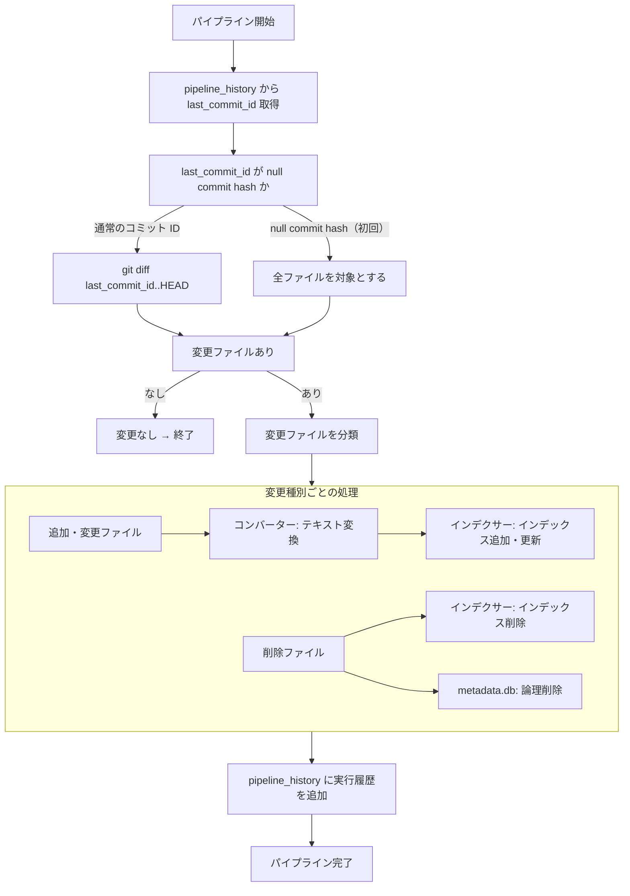
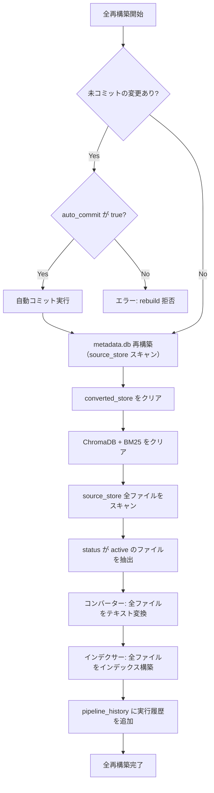
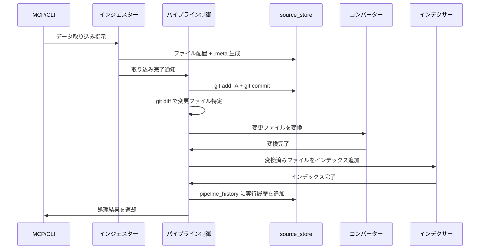

# パイプライン制御

## 概要

パイプライン制御は、3段パイプライン（インジェスター → コンバーター → インデクサー）のステージ間連携を担当するオーケストレーション層である。

各ステージは自分の責務のみに集中し、パイプライン制御が以下を一元管理する:

- source_store の git 操作（init、add、commit、diff）
- git diff による変更ファイルの特定
- ステージ間のデータ受け渡し
- 更新モードの制御（差分更新 / 全再構築）

スコープ:

- パイプラインの実行制御（差分更新、全再構築、コンバートのみ再実行、インデックスのみ再構築）
- source_store の git 操作（init、add、commit、diff）
- 変更ファイルの分類とステージへの振り分け
- `last_commit_id` の管理

スコープ外:

- 各ステージの内部処理ロジック（データ取得、テキスト変換、インデックス構築）
- 外部 API 通信（インジェスターの範疇）
- source_store のディレクトリ構成・.meta 形式の定義（source_store 仕様の範疇）

## 背景

- 3段パイプラインの各ステージ（インジェスター、コンバーター、インデクサー）が git 操作やステージ間連携を個別に実装すると、責務が混在し保守性が低下する
- git diff を使った変更検知を一箇所で管理することで、差分更新の信頼性を確保する

## 制約

- **git 操作の一元管理**: git 操作はパイプライン制御のみが実行する。各ステージ（インジェスター、コンバーター、インデクサー）は git コマンドを直接呼び出さない
- **ステージの独立性**: 各ステージは入力と出力のみを知り、他のステージの内部には依存しない
- **変更検知の正確性**: `last_commit_id` と HEAD の差分のみを処理対象とする。差分外のファイルは処理しない（全再構築モードを除く）
- **冪等性**: 同じ差分に対してパイプラインを再実行しても、結果が変わらないこと
- **バッチサイズ無制限**: 各ファイルを順次処理しメモリに全件を保持しないため、パイプライン制御層としてのバッチサイズ制限は設けない。ただし、後続ステージ（特にインデクサーの Embedding 生成）がオンラインプロバイダを使用する場合、外部 API へのリクエストが発生する。外部 API のレート制限・バックオフは各ステージ側の責務とする
- **git リネーム検知**: git のデフォルト挙動（類似度 50% 以上でリネームと判定）に従う。閾値のカスタマイズは行わない

本コンポーネントは外部 API 通信を行わないため、想定プロファイル・安全制約セクションは省略する。

## インターフェース

### パイプライン実行

| 操作 | 入力 | 出力 | 振る舞い |
|------|------|------|---------|
| 差分更新 | なし（自動検知） | 処理結果サマリ | `last_commit_id` と HEAD の差分を検知し、変更ファイルのみをパイプライン処理する。通常運用のデフォルト操作 |
| 全再構築 | source_type フィルタ（任意）、auto_commit（任意） | 処理結果サマリ | converted_store とインデックスをクリアし、source_store 全ファイルをパイプライン処理する。source_type 指定時はその媒体のみ対象。データ破損時や大規模な設計変更時に使用。source_store に未コミットの変更がある場合の振る舞いは auto_commit の設定に従う |
| コンバートのみ再実行 | source_type フィルタ（任意）、auto_commit（任意） | 処理結果サマリ | converted_store をクリアし、source_store 全ファイルをコンバーターで再処理する。source_type 指定時はその媒体のみ対象。コンバーターの変換ロジック改修時に使用。インデックスは後続のインデックス再構築で更新する。source_store に未コミットの変更がある場合の振る舞いは auto_commit の設定に従う |
| インデックスのみ再構築 | source_type フィルタ（任意）、auto_commit（任意） | 処理結果サマリ | ChromaDB + BM25 をクリアし、converted_store 全ファイルからインデックスを再構築する。source_type 指定時はその媒体のインデックスのみ削除して再構築する（他の source_type のインデックスは維持）。Embedding モデル変更時やチャンクパラメータ変更時に使用。source_store に未コミットの変更がある場合の振る舞いは auto_commit の設定に従う |
| 取り込み実行 | コミットメッセージ | 処理結果サマリ | インジェスター実行後の後処理を一括実行する。source_store の変更を `git add -A` + `git commit` し、差分更新を実行する。インジェスターと後続パイプライン処理を結合する便利操作 |

全操作は `progress_callback`（任意）を受け取り、ファイル処理完了ごとにコールバックを呼び出す。callback シグネチャ: `(processed: int, total: int, current: str) -> None`。未指定時は進捗通知なし。詳細は [rebuild-stats.md](rebuild-stats.md) のサブプロセス進捗通知セクションを参照。

### 未コミット変更チェックと auto_commit

再構築操作（全再構築・コンバートのみ再実行・インデックスのみ再構築）の実行前に、source_store に未コミットの変更があるかチェックする。チェック範囲と自動コミット範囲は `source_type` の指定有無に応じて変わる。

| auto_commit の値 | 未コミット変更がある場合の振る舞い |
|-----------------|-------------------------------|
| `false`（デフォルト） | エラーとして再構築を拒否する（従来動作） |
| `true` | 自動コミットを実行し、コミット成功後に再構築を続行する |

#### source_type によるスコープ

| source_type | 未コミットチェックの範囲 | auto_commit のステージング範囲 |
|-------------|---------------------|--------------------------|
| 指定あり | `git status --porcelain -- {source_type}/` でそのディレクトリのみチェック | `git add {source_type}/` でそのディレクトリのみステージング＋コミット |
| 指定なし | `git status --porcelain` で全体チェック（従来動作） | `git add -A` で全体ステージング＋コミット（従来動作） |

source_type を指定することで、他の source_type ディレクトリに編集途中のファイルがあっても影響を受けずに再構築を実行できる。

#### auto_commit が `true` の場合の処理フロー

1. source_store の未コミット変更を検知する（source_type 指定時はそのディレクトリのみ）
2. ステージング＋コミットで変更をコミットする（コミットメッセージ形式は「コミットメッセージ規則」を参照）
3. コミット成功後、再構築処理に進む
4. auto_commit が `true` だが変更がない場合は自動コミットをスキップし、再構築に進む。git commit コマンド自体が失敗した場合（権限エラー等）はエラーとする

差分更新および取り込み実行は未コミット変更チェックの対象外であり、auto_commit パラメータは適用されない。

### git 操作

| 操作 | 入力 | 出力 | 振る舞い |
|------|------|------|---------|
| リポジトリ初期化 | source_store パス | なし | source_store ディレクトリで `git init` を実行する。既に初期化済みの場合は何もしない |
| ステージング＋コミット | コミットメッセージ、対象パス（任意） | コミット ID | source_store 内の変更をステージング＋コミットする。対象パス指定時は `git add {対象パス}/` でそのパス配下のみをステージングする。未指定時は `git add -A` で全体をステージングする。変更がない場合はスキップする |
| 差分取得 | 基準コミット ID | 変更ファイルリスト | `git diff --name-status <基準ID>..HEAD` で変更ファイル（追加・変更・削除・リネーム）を取得する |

### 変更ファイルリストの構造

git diff から取得する変更ファイルリストの各エントリが持つ情報。

| フィールド | 内容 |
|-----------|------|
| `status` | 変更種別: `added`（追加）、`modified`（変更）、`deleted`（削除）、`renamed`（リネーム）、`meta_only`（メタデータのみ変更） |
| `file_path` | source_store 内の相対パス |
| `old_path` | リネーム時の旧パス（リネーム以外では空） |

## コンポーネント構成

### パイプラインフロー（差分更新）

### パイプラインフロー（全再構築）

### インジェスター実行後のフロー

インジェスター（MCP ツール・CLI 経由）の実行後、パイプライン制御がコミットとパイプライン処理を行う。

### コンバーターのパススルー

変換不要なファイル（md/txt/adoc）はコンバーターが source_store から converted_store にそのままコピーする。これによりインデクサーは常に converted_store のみを参照すればよく、フォールバックロジックは不要。

### 変更種別と処理の対応

| git diff status | 変更種別 | コンバーター | インデクサー | metadata.db |
|-----------------|---------|-------------|-------------|-------------|
| `A`（追加） | 新規ファイル | 変換実行 | インデックス追加 | ソース登録 |
| `M`（変更） | 内容更新 | 再変換 | インデックス更新 | ソース更新（日時・ハッシュ） |
| `D`（削除） | ファイル削除 | converted_store から削除 | インデックス削除 | 論理削除 |
| `R`（リネーム） | パス変更 | 新パスで変換 | 旧パス削除 + 新パス追加 | `file_path` を更新。local 媒体は `source_id` も変わるため metadata.db の旧レコードを DELETE + 新規 INSERT する（ファイルの物理削除ではない） |
| `.meta` のみ変更 | メタデータ更新 | 再処理不要 | メタデータ upsert のみ | メタデータ更新 |

### コミットメッセージ規則

パイプライン制御が自動生成するコミットメッセージの形式。

| トリガー | メッセージ形式 |
|---------|-------------|
| インジェスター実行後 | `ingest({source_type}): {概要}` |
| 手動ファイル配置後（local） | `ingest(local): manual update` |
| 再構築時の自動コミット（source_type 指定なし） | `auto-commit: rebuild ({mode})` |
| 再構築時の自動コミット（source_type 指定あり） | `auto-commit: rebuild ({mode}, {source_type})` |

`{mode}` は再構築モード（`full`、`convert`、`index`）が入る。

`source_type` の取りうる値は [source-store.md](source-store.md) の「source_id の決定方式」を参照（`web`, `bluesky`, `zenn`, `local`）。

## エッジケース

| ケース | 振る舞い |
|--------|---------|
| `last_commit_id` が null commit hash（初回実行） | source_store 全ファイルを対象として処理する |
| `last_commit_id` が指す commit が git 履歴に存在しない | 警告ログを出力し、全ファイルを対象として処理する |
| git diff の結果が空（変更なし） | 何もせず正常終了する |
| パイプライン処理中にエラーが発生した場合 | エラーが発生したファイルをスキップし、残りのファイルの処理を続行する。pipeline_history にレコードを追加しないことで `last_commit_id` が前回値のまま保持される（次回再実行で再処理される） |
| コンバーターがエラーを返したファイル | 該当ファイルのインデックス追加をスキップし、エラーログに記録する |
| 大量のファイルが一度に変更された場合 | 全件を順次処理する。バッチサイズ制限は設けない |
| source_store の git リポジトリが未初期化 | パイプライン初回実行時に `git init` を自動実行する |
| .meta ファイルのみが変更された場合 | 拡張子 `.meta` で .meta ファイルを判定する。metadata.db のメタデータを更新する。コンバーターの再処理は行わない（データ本体に変更がないため）。インデックス側にメタデータ（title 等）を保持している場合は、インデクサーにメタデータ更新を指示する（チャンクの再生成は不要、メタデータのみ upsert） |
| metadata.db の `status` が `deleted` のファイルが git diff に含まれる場合 | ファイルの変更種別に応じた処理を行う。`deleted` ステータスのファイルはインデックスに追加しない |
| 再構築操作（全再構築・コンバートのみ・インデックスのみ）時に source_store に未コミットの変更がある場合 | auto_commit が `false`（デフォルト）の場合はエラーとして再構築を拒否する。auto_commit が `true` の場合は自動コミットを実行してから再構築を続行する |
| 自動コミット時に git commit が失敗した場合 | エラーとして再構築を拒否する（コミット失敗の原因をエラーメッセージに含める） |

### 設定項目

| 設定項目 | 型 | 保管先 | 内容 | デフォルト |
|---------|-----|--------|------|-----------|
| `CONVERTED_STORE_DIR` | str | `.env` | converted_store のディレクトリパス | なし（必須） |

source_store のパスや metadata.db の参照は [source-store.md](source-store.md) の設定項目を使用する。

## 関連ドキュメント

- [source-store.md](source-store.md) — source_store 仕様
- [rag-knowledge.md](rag-knowledge.md) — RAG ナレッジ仕様（既存）
