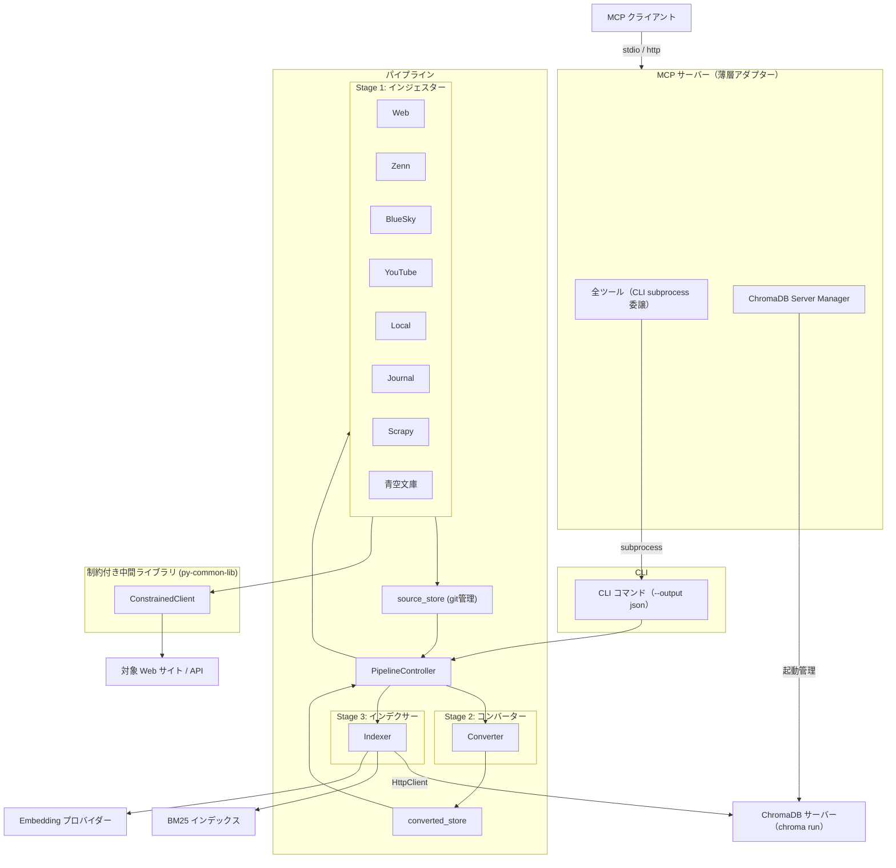
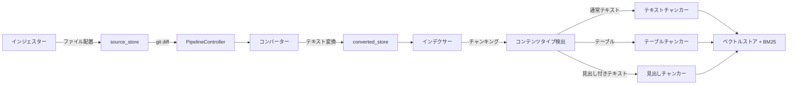
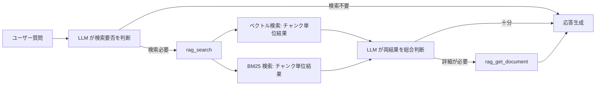

# RAG ナレッジ

## 概要

外部 Web ページから収集した知識をベクトル DB に蓄積し、
MCP クライアントからのクエリに対して関連情報を検索・提供する
RAG（Retrieval-Augmented Generation）基盤。
MCP サーバーとして独立動作し、18 個のツールを提供する。

スコープ:

- 知識の取り込み（サイト一括取り込み・Zenn 記事取り込み・BlueSky 投稿取り込み・YouTube 動画取り込み・ドキュメントファイル取り込み・ジャーナル取り込み・青空文庫作品取り込み）
- 知識の検索（ベクトル検索・BM25 キーワード検索）
- 知識の管理（統計表示・削除）
- 検索精度の評価（評価 CLI）

## 背景

- LLM の学習済み知識とリアルタイムの会話コンテキストのみでは、特定 Web サイトの情報に基づいた回答ができない
- 知識ベースの蓄積・検索を MCP サーバーとして提供し、呼び出し元との疎結合を維持する
- Embedding モデルはローカルとオンラインを切替可能にし、運用環境に応じてプロバイダーを選択できるようにする

## 制約

### 設定管理

設定値はセキュリティレベルに応じて3層に分離し、各設定値の取得元は1つに固定する（フォールバックなし）。
同一の設定値を複数の層に重複定義しない（各設定値の取得元は必ず1つ）。
`.env` は環境変数の慣例に従い大文字、`config.toml` は TOML の慣例に従い小文字スネークケースで記述する。

| 層 | 保管先 | git管理 | 分類基準 |
|---|--------|---------|---------|
| シークレット | OS セキュアストレージ (keyring) | 管理外 | 漏洩時に直接被害が発生する値。py-common-lib の `get_secret` で取得 |
| 環境依存値 | `.env` | 管理外 | デプロイ先・マシンごとに異なる値 |
| 共通設定値 | `config.toml` | **管理する** | プロジェクトとして統一管理する値 |

#### `.env`（環境依存値）

| カテゴリ | 設定項目 |
|---------|---------|
| Embedding 接続 | `EMBEDDING_PROVIDER`, `LMSTUDIO_BASE_URL` |
| ストレージ | `CHROMADB_PERSIST_DIR`, `BM25_PERSIST_DIR`, `SOURCE_STORE_DIR`, `CONVERTED_STORE_DIR` |
| ChromaDB サーバー | `CHROMADB_SERVER_HOST`, `CHROMADB_SERVER_PORT`, `CHROMADB_AUTO_START` |
| トランスポート | `RAG_TRANSPORT`, `RAG_HTTP_HOST`, `RAG_HTTP_PORT`, `RAG_DNS_REBINDING_PROTECTION` |
| デバッグ | `RAG_DEBUG_LOG_ENABLED` |
| ログファイル出力 | `RAG_LOG_DIR` |
| YouTube Whisper | `RAG_YOUTUBE_WHISPER_MODEL`, `RAG_YOUTUBE_WHISPER_DEVICE` |
| サイト一括取り込み | `SITE_INGEST_TEMP_DIR` |
| Embedding 並列 | `RAG_EMBEDDING_CONCURRENCY` |

#### `config.toml`（共通設定値）

| カテゴリ | 設定項目 |
|---------|---------|
| Embedding モデル | `embedding_model_local`, `embedding_model_online`, `embedding_prefix_enabled`, `rag_embedding_retry_count`, `rag_embedding_retry_base_delay` |
| チャンキング | `rag_chunk_size`, `rag_chunk_overlap`, `rag_embedding_context_length`, `rag_worst_token_char_ratio` |
| 検索 | `rag_retrieval_count`, `rag_similarity_threshold` |
| ハイブリッド検索 | `rag_hybrid_search_enabled`, `rag_vector_weight`, `rag_bm25_k1`, `rag_bm25_b`, `rag_min_combined_score` |
| ChromaDB | `chromadb_collection_name` |
| URL 安全性 | `rag_url_safety_check`, `rag_url_safety_cache_ttl`, `rag_url_safety_timeout` |
| レスポンス制御 | `rag_max_response_chars`（rag_get_document のトランケーション）, `rag_stats_max_sources`, `rag_list_recent_limit` |
| ログファイル出力 | `rag_log_file_max_bytes` |
| Zenn インジェスター | `rag_zenn_max_articles`, `rag_zenn_request_timeout`, `rag_zenn_request_interval` |
| BlueSky インジェスター | `rag_bluesky_appview_url`, `rag_bluesky_max_posts`, `rag_bluesky_request_timeout`, `rag_bluesky_request_interval`, `rag_bluesky_include_reposts` |
| ドキュメントインジェスター | `rag_document_supported_extensions`, `rag_document_http_mode_enabled`, `rag_document_allowed_dirs` |
| PDF バックエンド | `rag_pdf_backend`, `rag_pdf_mineru_mfd_conf_thres`, `rag_pdf_quality_ufffd_threshold`, `rag_pdf_quality_greek_threshold`, `rag_pdf_quality_cjk_min_threshold`, `rag_pdf_quality_min_chars_per_page`, `rag_pdf_quality_sample_pages` |
| HNSW パラメータ | `hnsw_m`, `hnsw_construction_ef`, `hnsw_search_ef` |
| Upload HTTP API | `rag_upload_max_file_size_mb` |
| YouTube インジェスター | `rag_youtube_max_videos`, `rag_youtube_request_interval`, `rag_youtube_request_timeout`, `rag_youtube_transcript_languages`, `rag_youtube_merge_gap_sec`, `rag_youtube_merge_max_chars`, `rag_youtube_max_duration` |
| 青空文庫インジェスター | `rag_aozora_max_works`, `rag_aozora_request_interval`, `rag_aozora_request_timeout` |
| サイト一括取り込み | `site_ingest_delay_sec`, `site_ingest_max_pages`, `site_ingest_download_timeout`, `site_ingest_timeout_sec`, `site_ingest_error_count` |

- `hnsw_m` と `hnsw_construction_ef` はコレクション作成時のみ適用される（不変）。既存コレクションへの反映には `rebuild --mode full`（コレクション削除 → 再作成）が必要。`hnsw_search_ef` は起動時に `collection.modify()` で既存コレクションにも自動適用される
- Embedding モデルを変更した場合、既存データとの類似度計算が不正確になるため、コレクション再構築が必要
- ローカル Embedding モデルにはコンテキスト長の制限（512 トークン）がある。チャンキング時にこの制限を超えないよう文字数ベースで制御する。詳細は [indexer.md](indexer.md) の「トークン安全上限」を参照
- 呼び出し元が MCP クライアントとして本サーバーに接続することで RAG 機能を利用できる
- トランスポートは stdio（デフォルト）と http（Streamable HTTP）を切替可能。`.env` でトランスポート種別・ホスト・ポート・DNS リバインディング保護を設定する。HTTP モードはローカル／信頼済みネットワーク向けを想定しており、デフォルトではループバックアドレスにバインドする。外部ネットワークへ公開する場合は、ファイアウォールやリバースプロキシでの認証付与などによりアクセス制御を行うこと
- `src/` 配下の外部 HTTP リクエストは ConstrainedClient（py-common-lib パッケージで提供）経由で実行する。`httpx.AsyncClient`/`httpx.Client`・`aiohttp.ClientSession`・`requests`・`urllib.request` の直接利用は禁止
- CI（`check-raw-http` ワークフロー）で ConstrainedClient を経由しない直接 HTTP クライアント利用を検出し、違反があればマージをブロックする。ConstrainedClient は `src/` 外のパッケージのため検出対象外。許可例外: `# safety:allowed` コメントが付与された行
- 設定値がハードリミットの許容範囲外の場合は範囲内にクランプする（エラーにはしない。警告ログを出力する）

### アプリケーションログ

運用時の処理追跡を目的として、各コンポーネントに INFO レベルのログを出力する。

#### ログレベル設計

| レベル | 用途 | 例 |
|--------|------|-----|
| INFO | 処理の開始・完了・サマリ。運用時のデフォルト出力 | 変換完了、バッチサマリ、サーバー起動、CLI サブプロセス起動/完了 |
| WARNING | 処理は継続するが注意が必要な状況 | ファイル未検出、未対応拡張子、フォールバック発生 |
| ERROR | 処理が失敗した状況 | 変換エラー、外部サービス接続失敗 |
| DEBUG | 開発・調査用の詳細情報。通常は非表示 | CLI サブプロセスの stderr 転送、内部状態の詳細 |

#### ログ出力対象

以下のイベントに INFO レベルのログを出力する:

- **コンバーター**: 個別ファイルの変換完了（パススルーコピー含む、入力パス・出力パス）、バッチ開始件数・完了サマリ（success/skipped/errors）、変換済みファイルの削除、メディア解析完了
- **PDF 抽出**: バックエンド選択（auto 判定結果 / 明示指定）、抽出完了
- **パイプライン制御**: パイプライン実行開始（モード・対象件数）、フェーズ（convert/index）の開始・完了、全体完了サマリ
- **インジェスター**: 取り込み開始（対象識別子）、取り込み完了サマリ
- **MCP サーバー**: サーバー起動パラメータ（transport/host/port）、CLI サブプロセスの起動・正常完了、Upload API の正常完了、シャットダウン

#### MCP サーバーのロガー設定

MCP サーバープロセスでは `rag` 名前空間ロガーに StreamHandler を直接設定する。`logging.basicConfig` は使用しない（uvicorn / FastMCP のルートロガー設定を上書きしないため）。

`rag_debug_log_enabled` が有効な場合、`rag` 名前空間ロガーのレベルを DEBUG に切り替える。これにより CLI サブプロセスの stderr 転送等の詳細情報が出力される。

#### ログファイル出力

`rag_log_dir` が設定されている場合、stderr 出力を維持したまま追加でログファイルに出力する。未設定時は従来通り stderr のみ。本節で「セッション」はサーバープロセスの 1 起動期間（起動から終了まで）を指す。

- **パスの解釈**: `rag_log_dir` は絶対パス、またはサーバープロセスの CWD からの相対パスとして解釈する
- **ディレクトリの準備**: 指定ディレクトリが存在しない場合は親を含めて自動作成する
- **ファイル命名**: `rag-server-YYYYMMDD-HHMMSS-NNNNN.log`（サーバー起動時刻 + 5 桁ゼロパディングの連番）
  - 起動時刻はローカルタイム（運用者がログを確認する際の可読性を優先）
  - 連番はセッション開始時に `-00001` から始まる
- **プロセス起動中のローテーション**: 書き込み時点で現在のファイルサイズが `rag_log_file_max_bytes`（バイト）以上であれば、連番をインクリメントして新ファイルを開く。旧ファイルは削除しない
- **ファイル衝突時の扱い**: セッション開始時の `-00001`、およびローテーション時に生成するファイルパスが既に存在する場合は、同一の「既存ファイルを上書きしない」ポリシーで失敗させる。起動時は起動失敗、ローテーション時は logging の `handleError` に委ねる
- **空文字列の扱い**: `rag_log_dir` に空文字列（または空白のみ）が指定された場合は設定ミスとして起動時エラー。ファイル出力を無効化したい場合は未設定とする
- **`rag_debug_log_enabled` との関係**: ファイル出力にも同一のログレベルを適用する

#### CLI サブプロセスの stderr 転送

MCP サーバーが CLI サブプロセスを実行した際、正常終了時の stderr 出力を行単位で `[CLI]` プレフィックス付きの DEBUG ログとして転送する。異常終了時の stderr はエラーメッセージに含まれる（従来通り）。

### MCP 薄層アダプターパターン

MCP サーバーの全ツールは CLI サブプロセスに委譲する（薄層アダプターパターン）。MCP ツール側にビジネスロジックを持たず、パラメータの組み立て・バリデーション・結果の整形のみを行う。

- CLI が `--output json` で構造化 JSON を返し、MCP ツールはその結果をテキスト応答に整形する
- 書き込み系ツール: C 拡張（BM25s 等）の SEGFAULT からサーバープロセスを隔離する
- 読み取り系ツール（検索・統計・一覧）: SEGFAULT リスクは低いが、一貫性のため同一パターンに統一する。サブプロセス起動のオーバーヘッドは許容する
- ロジックの重複を排除し、CLI と MCP で同一のコードパスを通す

## インターフェース

### MCP ツール

MCP サーバーが公開する 18 個のツール。

#### rag_search

ベクトル検索と BM25 の生結果をチャンク単位で返す。各結果にスコア・Source・Title・Chunk位置・Typeのメタデータを含める。詳細は [search-response.md](search-response.md) を参照。

| 引数 | 型 | 必須 | デフォルト | 説明 |
|------|-----|------|-----------|------|
| `query` | str | Yes | — | 検索クエリ |
| `n_results` | int \| None | No | None（設定値を使用） | 各エンジンから取得する結果数 |
| `source_type` | str \| None | No | None（全種別） | ソース種別フィルタ（値は [`_schema/enums.yml`](../../_schema/enums.yml) の `source_type` を参照） |
| `filters` | str \| None | No | None（フィルタなし） | メタデータフィルタ（`key=value` 形式、カンマ区切りで複数指定可。完全一致） |

#### rag_get_document

ソース全文を取得する。MCP 経由では `rag_max_response_chars` でトランケーションを行う。詳細は [search-response.md](search-response.md) を参照。

| 引数 | 型 | 必須 | デフォルト | 説明 |
|------|-----|------|-----------|------|
| `source_id` | str | Yes | — | ソース識別子（rag_search の Source 値） |
| `format` | str | No | `"text"` | 取得形式。`"text"`（変換済みテキスト）または `"original"`（オリジナル） |

#### rag_crawl_zenn

指定ユーザーの Zenn 記事・スクラップを API 経由で取得し、ナレッジベースに取り込む。同一記事の再取り込み時は `source_id`（source_store 内の相対パス）の一致で検出し、既存の知識を最新に置き換える。

| 引数 | 型 | 必須 | デフォルト | 説明 |
|------|-----|------|-----------|------|
| `username` | str | Yes | — | Zenn ユーザー名 |
| `max_articles` | int \| None | No | None（設定値を使用） | 取得する最大コンテンツ数 |
| `content_type` | str | No | `"all"` | 取得対象。`"articles"`（記事のみ）、`"scraps"`（スクラップのみ）、`"all"`（両方） |
| `force` | bool | No | `false` | 既存ファイルを上書きするか |

#### rag_crawl_bluesky

指定ユーザーの BlueSky 投稿を AT Protocol API 経由で取得し、ナレッジベースに取り込む。max_posts はタイムライン全体（リポスト含む）に適用。既存投稿はスキップする（BlueSky は投稿編集不可のため上書き不要）。

| 引数 | 型 | 必須 | デフォルト | 説明 |
|------|-----|------|-----------|------|
| `handle` | str | Yes | — | BlueSky ハンドル（例: user.bsky.social）。DID 形式は不可 |
| `max_posts` | int \| None | No | None（設定値を使用） | 取得する最大投稿数 |
| `include_reposts` | bool \| None | No | None（設定値を使用） | タイムラインにリポストを含めるか |

#### rag_add_youtube

単一 YouTube 動画の字幕/文字起こしを取得し、ナレッジベースに取り込む。詳細は [ingesters/youtube.md](ingesters/youtube.md) を参照。

| 引数 | 型 | 必須 | デフォルト | 説明 |
|------|-----|------|-----------|------|
| `video_url` | str | Yes | — | YouTube 動画 URL（`youtube.com/watch?v=` または `youtu.be/` 形式） |

#### rag_crawl_youtube

YouTube プレイリスト内の動画を一括取り込みする。詳細は [ingesters/youtube.md](ingesters/youtube.md) を参照。

| 引数 | 型 | 必須 | デフォルト | 説明 |
|------|-----|------|-----------|------|
| `playlist_url` | str | Yes | — | YouTube プレイリスト URL（`youtube.com/playlist?list=` 形式） |
| `max_videos` | int \| None | No | None（設定値を使用） | 取得する最大動画数 |

#### rag_add_document

単一ドキュメントファイルのコンテンツを受け取り、ナレッジベースに取り込む。同一ファイルの再取り込み時は `source_id`（source_store 内の相対パス）の一致で検出し、既存の知識を最新に置き換える。

| 引数 | 型 | 必須 | デフォルト | 説明 |
|------|-----|------|-----------|------|
| `content` | str | Yes | — | ファイルのコンテンツ。`encoding=text` の場合は UTF-8 文字列、`encoding=base64` の場合は base64 文字列 |
| `filename` | str | Yes | — | 元ファイルのファイル名（例: `resume.pdf`）。拡張子バリデーションに使用 |
| `encoding` | str | No | `"text"` | コンテンツのエンコーディング。`"text"` または `"base64"` |
| `upload_mode` | str | No | `"fail"` | 同名ファイル存在時の動作。`"fail"`（エラー）または `"replace"`（上書き） |

#### rag_crawl_documents

指定ディレクトリ内のドキュメントファイルを glob パターンで検索し、一括でナレッジベースに取り込む。stdio モード専用。

| 引数 | 型 | 必須 | デフォルト | 説明 |
|------|-----|------|-----------|------|
| `dir_path` | str | Yes | — | 取り込み対象ディレクトリのパス |
| `pattern` | str | No | `"**/*"` | glob パターン（再帰的に全対応ファイルを検索） |
| `upload_mode` | str | No | `"fail"` | 同名ファイル存在時の動作。`"fail"`（スキップ）または `"replace"`（上書き） |

#### rag_add_journal

ジャーナルエントリを source_store に配置し、パイプライン処理でインデックスに取り込む。詳細は [ingesters/journal.md](ingesters/journal.md) を参照。

| 引数 | 型 | 必須 | デフォルト | 説明 |
|------|-----|------|-----------|------|
| `title` | str | Yes | — | エントリタイトル |
| `content` | str | Yes | — | ジャーナル本文（Markdown） |
| `filename` | str | Yes | — | 元ファイルのファイル名（`.md` 拡張子必須） |
| `repository` | str | Yes | — | リポジトリ名（例: `rag-knowledge`） |
| `entry_id` | str \| None | No | None（自動生成） | エントリ識別子（命名規則: `YYYYMMDD-HHMMSS-topic`） |

#### rag_site_ingest

Scrapy subprocess で対象サイトをクロールし、source_store に配置後、パイプライン処理を実行する。単一 URL はリンク追従クロール、複数 URL は指定 URL のみ取得。詳細は [site-ingest.md](site-ingest.md) を参照。

| 引数 | 型 | 必須 | デフォルト | 説明 |
|------|-----|------|-----------|------|
| `url` | str | No | `""` | クロール開始 URL（クロールモード、`urls` と排他） |
| `urls` | list[str] \| None | No | None | 取得対象 URL のリスト（複数 URL モード、`url` と排他） |
| `url_pattern` | str | No | `""` | URL フィルタパターン（正規表現、クロールモードのみ） |
| `max_pages` | int \| None | No | None（設定値を使用） | ページ数上限（クロールモードのみ） |
| `force` | bool | No | `false` | JOBDIR を削除して最初からクロール（クロールモードのみ） |
| `download_only` | bool | No | `false` | パイプライン処理をスキップし、Scrapy クロール + Bridge のみ実行 |

#### rag_delete

ソース識別子指定で source_store からファイルを物理削除し、パイプライン経由でインデックス・metadata.db を更新する。git 管理下のため、削除後も git checkout で復旧可能。

| 引数 | 型 | 必須 | デフォルト | 説明 |
|------|-----|------|-----------|------|
| `source_id` | str | Yes | — | 削除するソース識別子 |

#### rag_rebuild

パイプラインの再構築を実行する。詳細は [rebuild-stats.md](rebuild-stats.md) を参照。

| 引数 | 型 | 必須 | デフォルト | 説明 |
|------|-----|------|-----------|------|
| `mode` | str | Yes | — | 再構築モード。`"full"`（全再構築）、`"convert"`（コンバートのみ）、`"index"`（インデックスのみ）、`"incremental"`（差分更新） |
| `source_type` | str \| None | No | None（全媒体） | 対象媒体フィルタ（値は [`_schema/enums.yml`](../../_schema/enums.yml) の `source_type` を参照）。`incremental` では指定不可 |

#### rag_update_aozora_catalog

青空文庫の作品カタログ CSV をダウンロードし、source_store に配置する。前回カタログとの差分から新着・更新作品を検出して結果を返す。引数なし。

#### rag_search_aozora

ローカルカタログ CSV を著者名・作品名で部分一致検索する。ネットワークアクセス不要。

| 引数 | 型 | 必須 | デフォルト | 説明 |
|------|-----|------|-----------|------|
| `author` | str \| None | No | None | 著者名（部分一致検索） |
| `title` | str \| None | No | None | 作品タイトル（部分一致検索） |
| `limit` | int | No | `20` | 最大表示件数（許容範囲: 1〜2000） |

#### rag_add_aozora

指定作品の XHTML を取得し、ナレッジベースに取り込む。著作権フリーの作品のみ対応。

| 引数 | 型 | 必須 | デフォルト | 説明 |
|------|-----|------|-----------|------|
| `book_id` | str | Yes | — | 青空文庫の作品 ID（カタログ検索で取得） |

#### rag_crawl_aozora

指定著者（人物 ID）の著作権フリー作品を一括取り込みする。

| 引数 | 型 | 必須 | デフォルト | 説明 |
|------|-----|------|-----------|------|
| `person_id` | str | Yes | — | 著者の人物 ID（rag_search_aozora で確認可能） |
| `max_works` | int \| None | No | None（設定値を使用） | 取得する最大作品数 |

#### rag_list_recent

指定 source_type のソースを新しい順で一覧取得する。ナレッジベースの内容把握に使用する。

| 引数 | 型 | 必須 | デフォルト | 説明 |
|------|-----|------|-----------|------|
| `source_type` | str | Yes | — | ソース種別（値は [`_schema/enums.yml`](../../_schema/enums.yml) の `source_type` を参照） |
| `limit` | int \| None | No | None（設定値を使用） | 取得件数 |

#### rag_stats

統計情報（総チャンク数、ソース URL 数）と蓄積データ概要（ドメイン別ソース URL 一覧・タイトル）を返す。表示件数上限は `rag_stats_max_sources` で制御する。引数なし。

### 取り込みツールの出力形式

取り込みツール（rag_crawl_zenn、rag_crawl_bluesky、rag_add_youtube、rag_crawl_youtube、
rag_add_document、rag_crawl_documents、rag_add_journal、rag_site_ingest、
rag_add_aozora、rag_crawl_aozora）は、
source_store への配置結果とパイプライン処理結果を統合したサマリーを返す。
配置結果には配置ファイル数・スキップ数・エラー数を含み、
パイプライン処理結果にはコンバート・インデックス構築の処理件数を含む。

### 検索結果の設計

rag_search はベクトル検索と BM25 検索の生結果をチャンク単位で個別に返す。全文が必要な場合は rag_get_document で取得する。詳細は [search-response.md](search-response.md) を参照。

<!-- How追加理由: 統合パイプライン(CC)を迂回する設計判断の根拠 -->
統合パイプライン（正規化・スコア結合）を迂回し、
各エンジンの生結果を呼び出し元に渡す方式を採用している。
個別の検索エンジンは良好な精度を示す一方、
統合パイプラインが有用な信号を破壊するケースがあったため。
既存の統合パイプラインは設定で戻せるよう保持している。

### 評価 CLI

検索精度の評価とリグレッション検出を行うコマンドラインツール。

| サブコマンド | 振る舞い |
| --- | --- |
| evaluate | 評価データセットで検索精度を計測しレポートを出力する。ベースライン比較でリグレッションを検出できる |
| init-test-db | テスト用のベクトル DB と BM25 インデックスを初期化する |
| get-document | ソース全文を取得する。`--format text\|original`、`--output-file` でファイル出力（トランケーションなし） |

評価指標: Precision、Recall、F1、NDCG@K、MRR

## コンポーネント構成

### 全体アーキテクチャ（3段パイプライン + ChromaDB サーバー）

### ChromaDB client/server 構成

ChromaDB は `uv run chroma run` によるサーバーモードで動作し、MCP サーバー・CLI の両方が `HttpClient` で接続する。これにより、`PersistentClient` の単一プロセス制約を解消し、MCP と CLI の同時アクセスを可能にする。

| 項目 | 仕様 |
|------|------|
| ChromaDB クライアント | `chromadb.HttpClient`（`PersistentClient` から移行） |
| ChromaDB サーバー | `uv run chroma run --path <persist_dir> --port <port>` |
| ライフサイクル管理 | MCP サーバー起動時にヘルスチェック → 未起動なら自動起動 |
| CLI からの接続 | 既存サーバーに接続（手動起動 or MCP 経由で起動済み前提） |
| テスト時 | `EphemeralClient` を使用（ChromaDB サーバー不要） |
| セキュリティ | デフォルトは localhost 限定。リモート接続時は TLS を要件とする |

#### ChromaDB サーバー設定（`.env`）

| 設定項目 | 層 | 設計意図 |
|---------|-----|---------|
| `CHROMADB_SERVER_HOST` | 環境依存値 | ChromaDB サーバーの接続先ホスト。デプロイ環境に応じて変更する |
| `CHROMADB_SERVER_PORT` | 環境依存値 | ChromaDB サーバーのポート。他サービスとのポート競合を回避するために変更可能 |
| `CHROMADB_AUTO_START` | 環境依存値 | MCP サーバー起動時に ChromaDB サーバーを自動起動するか。CLI 単体利用時は手動起動が必要 |

### MCP 薄層アダプター実装方式

MCP サーバーの全ツールは CLI サブプロセスに委譲する。設計方針は「MCP 薄層アダプターパターン」セクション（制約内）を参照。

#### MCP ツール → CLI コマンドマッピング

| MCP ツール / エンドポイント | CLI コマンド | 備考 |
|---------------------------|------------|------|
| `rag_search` | `search` | |
| `rag_get_document` | `get-document` | |
| `rag_stats` | `stats` | |
| `rag_list_recent` | `list-recent` | |
| `rag_search_aozora` | `search-aozora` | |
| `rag_crawl_zenn` | `crawl-zenn` | |
| `rag_crawl_bluesky` | `crawl-bluesky` | |
| `rag_add_youtube` | `ingest-youtube` | |
| `rag_crawl_youtube` | `ingest-youtube-playlist` | |
| `rag_add_document` | `add-document` | stdin 入力（後述） |
| `rag_crawl_documents` | `crawl-documents` | |
| `rag_add_journal` | `add-journal` | stdin 入力（後述） |
| `rag_site_ingest` | `site-ingest` | |
| `rag_add_aozora` | `ingest-aozora` | |
| `rag_crawl_aozora` | `ingest-aozora-author` | |
| `rag_update_aozora_catalog` | `update-aozora-catalog` | |
| `rag_delete` | `delete` | |
| `rag_rebuild` | `rebuild` | |
| `/upload/document` | `add-document` | 一時ファイル経由 |
| `/upload/journal` | `add-journal` | 一時ファイル経由 |

#### stdout 保護機構

`--output json` モード時、CLI は fd レベルで stdout を保護する。サードパーティライブラリ（yt-dlp、BM25s 等）が stdout に直接書き込むと JSON Lines 通信が破壊されるため、以下の方式で隔離する:

1. 元の stdout fd を複製して JSON 専用チャネルとして保存
2. fd 1 を stderr にリダイレクト（Python レベル・OS レベルの両方）
3. JSON 出力ヘルパーは保存した fd に書き込む

これにより `print()` や C 拡張の stdout 書き込みは全て stderr に流れ、JSON 通信チャネルは汚染されない。

#### CLI サブプロセス実行方式

MCP サーバーは CLI サブプロセス実行ヘルパーで CLI コマンドを実行する:

1. コマンド構築: `python -m rag.cli <command> --output json [args...]`
2. `asyncio.create_subprocess_exec` でサブプロセスを起動
3. stdout と stderr を `asyncio.gather` で並行に読み取る（パイプバッファのデッドロック防止）:
   - stdout: 行単位で非同期に読み取り、各行を JSON パース:
     - `type: "progress"` → `ctx.info()` でログ通知 + `ctx.report_progress()` で数値通知
     - `type: "result"` → 結果として返却
     - `type: "error"` → エラーとして処理
   - stderr: 全量を読み取り、エラー時の診断に使用
4. SEGFAULT 検出: exit code が SEGFAULT シグナル（Unix: -11/139、Windows: -1073741819/3221225477）の場合、エラーメッセージを返却

CLI の JSON 出力は JSON Lines 形式:

| メッセージ種別 | 用途 |
|-------------|------|
| `{"type": "progress", "processed": N, "total": M, "current": "..."}` | 進捗報告（MCP `ctx.report_progress` に中継） |
| `{"type": "result", ...}` | コマンド結果（コマンド固有のフィールドを含む） |
| `{"type": "error", "error": true, "message": "..."}` | エラー報告（exit code 1） |

全 CLI コマンドが `--output json` オプションに対応している（evaluate, init-test-db, migrate-journal, generate-api-key を除く。これらは評価専用・マイグレーション専用であり、MCP 経由では使用しない）。

#### 進捗コールバック

複数件処理を行うコマンドは `--output json` モード時に `progress` メッセージを出力し、MCP 経由で進捗を通知する。

| CLI コマンド | 進捗の粒度 |
|------------|----------|
| `rebuild` | パイプライン処理ファイル単位 |
| `ingest-youtube-playlist` | 動画単位 |
| `crawl-bluesky` | 投稿単位 |
| `crawl-zenn` | 記事/スクラップ単位 |
| `crawl-documents` | ファイル単位 |
| `ingest-aozora-author` | 作品単位 |

#### CLI stdin 入力プロトコル

`rag_add_journal` と `rag_add_document` は MCP クライアントからコンテンツを文字列で受け取る。CLI コマンドはファイルパスを期待するため、`--stdin` オプションで stdin からコンテンツを読み取る方式を提供する。

| MCP ツール | CLI コマンド | stdin の内容 | 追加引数 |
|-----------|------------|------------|---------|
| `rag_add_journal` | `add-journal --stdin --title T --repository R` | UTF-8 テキスト（Markdown 本文） | `--title`, `--repository`, `--entry-id`（任意） |
| `rag_add_document` | `add-document --stdin --filename F --encoding E` | encoding に応じたデータ（`text`: UTF-8 テキスト、`base64`: base64 文字列） | `--filename`, `--encoding`（デフォルト: `text`）、`--upload-mode`（`fail`: 同名存在時エラー（デフォルト）、`replace`: 上書き） |

MCP 側の処理フロー:

1. MCP ツールが `content` パラメータを受け取る
2. CLI サブプロセス実行ヘルパーでサブプロセスを起動し、stdin パイプを確保する
3. `content` を subprocess の stdin に書き込み、stdin をクローズする
4. CLI が stdin からコンテンツを読み取り、通常のファイル読み取りと同様に処理する

Upload HTTP API（`/upload/document`, `/upload/journal`）はリクエストボディからファイルを受信し、一時ファイルに書き出した上で CLI の `--file` オプション経由で渡す。stdin は使用しない。一時ファイルは `finally` ブロックで確実に削除する（正常完了・エラー・SEGFAULT 後のいずれでも削除される）。

### 取り込みフロー（3段パイプライン）

1. **Stage 1（インジェスター）**: データソースからファイルを取得し、source_store に配置する
2. **Stage 2（コンバーター）**: PipelineController が git diff で変更を検知し、コンバーターが source_store のファイルを converted_store のテキスト（Markdown）に変換する
3. **Stage 3（インデクサー）**: converted_store のテキストをチャンキング → Embedding 生成 → ベクトルストア（ChromaDB）と BM25 インデックスに格納する
   - コンテンツタイプ検出で種類を判定し、適切なチャンカーに振り分ける（テキスト / テーブル / 見出し付きテキスト）

### チャンクメタデータ

各チャンクに付与するメタデータの構造を定義する。メタデータは ChromaDB に格納され、フィルタリング検索に使用できる。

#### 共通フィールド

全インジェスター共通で付与するフィールド。

| フィールド | 型 | 内容 |
|-----------|-----|------|
| `source_id` | str | ソース識別子（source_store 内の相対パス） |
| `title` | str | コンテンツのタイトル |
| `chunk_index` | int | チャンクの連番（0 始まり） |
| `collected_at` | str | 取り込みタイムスタンプ（ISO 8601） |
| `source_type` | str | データソース種別（値は [`_schema/enums.yml`](../../_schema/enums.yml) の `source_type` を参照） |
| `section_path` | str | 見出し階層（`>` 区切り、現セクションを含む）。見出しチャンカーが生成する。テーブルチャンカー・テキストチャンカーでは空文字列 |

#### カスタムフィールド

インジェスター固有のメタデータ。`custom:` プレフィックスを付与して共通フィールドと名前空間を分離する。

各ソースの `.meta` ファイルに格納された追加フィールドを `custom:{キー名}` として保存する。

#### 型変換ルール

ChromaDB のメタデータ値は `str | int | float | bool` のみ許容される。`.meta` ファイルの値が許容型でない場合、以下のルールで変換する。

| 元の型 | 変換 | 例 |
|--------|------|-----|
| `str` | そのまま | `"tech"` → `"tech"` |
| `int` | そのまま | `42` → `42` |
| `float` | そのまま | `0.95` → `0.95` |
| `bool` | そのまま | `True` → `True` |
| `list` | `str()` | `["Python", "AI"]` → `"['Python', 'AI']"` |
| その他 | `str()` | — |

### チャンカーの構文モード（未実装・設計仕様）

> **実装ステータス**: 未実装。本セクションは設計仕様であり、後続フェーズで実装予定。
> 現状のチャンカーは Markdown モードのみ対応している。
> 実装時は [indexer.md](indexer.md) に移設すること（チャンキングはインデクサーの責務）。

見出しチャンカー・テーブルチャンカーは、入力ファイルの形式に応じて構文認識を切り替える。構文モードは取り込みフロー図のコンテンツタイプ検出とは直交する概念であり、各チャンカーがモードパラメータに基づいて内部的に構文認識（見出し記法、テーブル記法等）を切り替える。

#### モード分岐

ファイルパスの拡張子に基づいてモードを決定する。チャンカーの呼び出し元（ナレッジサービス）が `IngestedContent` の `source_id` フィールドから拡張子を抽出し、チャンカーにモードパラメータとして渡す。

| 拡張子 | モード | デフォルト |
|--------|--------|-----------|
| `.adoc`, `.asciidoc` | AsciiDoc モード | - |
| 上記以外 | Markdown モード | Yes |

拡張子が不明な場合（Web クロール等）は Markdown モード（デフォルト）を使用する。

#### AsciiDoc モードで認識する構文

| 要素 | AsciiDoc 構文 | Markdown 相当 | 対象チャンカー |
|------|---------------|---------------|---------------|
| 見出し | `= Title` / `== Section` / `=== Sub` / `==== SubSub` | `#` / `##` / `###` / `####` | 見出しチャンカー |
| テーブル | <code>&#124;===</code> 開閉デリミタ | <code>&#124;---&#124;</code> 区切り | テーブルチャンカー |
| コードブロック | `----` デリミタ | <code>&#96;&#96;&#96;</code> | 見出しチャンカー（分割防止） |
| リテラルブロック | `....` デリミタ | なし | 見出しチャンカー（分割防止） |
| サイドバーブロック | `****` デリミタ | なし | 見出しチャンカー（分割防止） |
| 引用ブロック | `____` デリミタ | なし | 見出しチャンカー（分割防止） |
| パススルーブロック | `++++` デリミタ | なし | 見出しチャンカー（分割防止） |
| コメントブロック | `////` デリミタ | なし | 見出しチャンカー（分割防止） |
| 例示ブロック | `====` デリミタ（4 文字以上。見出しとは空白+テキストの有無で区別） | なし | 見出しチャンカー（分割防止） |

#### 見出しチャンカーの AsciiDoc 対応

- AsciiDoc の見出し構文（`=` の繰り返し + 空白 + テキスト）を検出し、レベルに応じて分割する
  - `= Title`（レベル 1）、`== Section`（レベル 2）、`=== Sub`（レベル 3）、以降同様
  - AsciiDoc 公式仕様ではドキュメントタイトル `=` はレベル 0 だが、Markdown チャンカーとの整合性のためレベル 1 として扱う（`=` が 1 つ → レベル 1、`==` が 2 つ → レベル 2）
- AsciiDoc デリミタブロック（`----`, `....`, `====`, `****`, `____`, `++++`, `////`）内では見出し分割を行わない
  - デリミタは同一記号が 4 文字以上連続する行で開閉を判定する
  - 開きデリミタと閉じデリミタは同じ記号・同じ長さの行である
- 親見出しの階層追跡・パンくずリスト生成は Markdown モードと同じ仕組みを使用する

#### テーブルチャンカーの AsciiDoc 対応

- AsciiDoc テーブルは `|===` 行で開始・終了するブロック形式で記述される
- `|===` デリミタで囲まれたブロックをテーブルとして検出する
- テーブル内の行を解析し、ヘッダー行とデータ行に分割する
  - `|===` 直後の最初の行をヘッダー行として扱う（AsciiDoc の `[options="header"]` 等の属性は認識しない簡易方式）
- 各チャンクにヘッダー行を付加する方式は Markdown モードと同じ

### 検索フロー（準 Agentic Search）

1. LLM がユーザーの質問に対して検索の要否を判断する
2. 検索が必要な場合、rag_search を呼び出す
3. rag_search がベクトル検索と BM25 検索の両方を実行し、チャンク単位の結果を返す
4. LLM が両エンジンの結果を総合判断する
5. 詳細が必要な場合は rag_get_document で全文を取得し、応答を生成する
6. 検索結果で十分な場合はそのまま応答を生成する

### コンポーネント一覧

| コンポーネント | 役割 |
| --- | --- |
| PipelineController | 3段パイプラインのオーケストレーション。source_store の git 操作、差分検知、ステージ間連携を一元管理する |
| インジェスター群 | データソースからファイルを取得し source_store に配置する（Web / Zenn / BlueSky / YouTube / Local / Journal / Scrapy / 青空文庫） |
| コンバーター | source_store のファイルを converted_store のテキスト（Markdown）に変換する |
| インデクサー | converted_store のテキストからチャンキング・Embedding・インデックス構築を行う |
| Web クローラー | ページの取得と本文テキスト抽出。SSRF 対策・robots.txt 遵守を含む |
| コンテンツタイプ検出 | テキストの種類（通常・テーブル・見出し付きテキスト）を判定する |
| テキストチャンカー | 段落・文・文字数の優先順で分割する。チャンク間にオーバーラップを適用する |
| テーブルチャンカー | テーブルデータを行単位で分割し、各チャンクにヘッダー行を付加する。現状は Markdown テーブルに対応。AsciiDoc テーブル（<code>&#124;===</code> デリミタ）対応は未実装 |
| 見出しチャンカー | 見出し単位で分割し、親見出しの階層情報をメタデータ（`section_path`）に保持する。チャンク本文は純粋な本文テキストのみ。現状は Markdown 見出し（`#`）と HTML 見出しに対応。AsciiDoc 見出し（`==`）対応は未実装 |
| ベクトルストア | Embedding 生成とベクトル DB への格納・検索を担う |
| BM25 インデックス | 日本語形態素解析によるキーワード検索。ディスク永続化に対応する |
| ハイブリッド検索エンジン | ベクトル検索と BM25 のスコアを正規化・統合する。設定で有効化できる |
| Embedding プロバイダー | テキストをベクトルに変換する。ローカルとオンラインを切替可能 |
| URL 安全性チェック | 外部 API によるマルウェア・フィッシングサイト判定 |
| ConstrainedClient (py-common-lib) | 全外部 HTTP リクエストのゲートウェイ。ハードリミット・バジェット・サーキットブレーカーを統合し、httpx.AsyncClient をラップする |
| BudgetTracker (py-common-lib) | 操作あたりのリクエスト総数を追跡し、上限到達で BudgetExhaustedError を送出する |
| CircuitBreaker (py-common-lib) | 連続失敗回数を監視し、閾値超過で CircuitBreakerOpenError を送出する |
| ChromaDB Server Manager | MCP サーバー起動時に ChromaDB サーバーのヘルスチェック・自動起動を行う。グレースフルデグレードにより起動失敗時も MCP は稼働継続する |
| 評価ツール | Precision、Recall、F1、NDCG、MRR の計算とベースライン比較 |

## 外部連携

| 連携先 | 用途 | 接続方式 |
| --- | --- | --- |
| ChromaDB | ベクトルの永続化・類似度検索 | HttpClient（ChromaDB サーバーに接続） |
| LM Studio | ローカル Embedding 生成 | OpenAI 互換 API |
| OpenAI Embeddings API | オンライン Embedding 生成 | REST API |
| Google Safe Browsing API | URL 安全性チェック | REST API（オプション） |
| 対象 Web サイト | クロール対象 | HTTP/HTTPS |
| YouTube | 動画字幕・音声文字起こしの取得 | youtube-transcript-api / yt-dlp / faster-whisper |
| Zenn API | Zenn 記事・スクラップの取得 | REST API |
| BlueSky (AT Protocol) | BlueSky 投稿の取得 | AT Protocol API |
| 青空文庫 | 著作権切れ作品の取得 | HTTP（カタログ CSV / XHTML） |

## エッジケース

| ケース | 振る舞い |
| --- | --- |
| MCP クライアント未接続 | サーバーは起動済みだがクライアントからの接続がない場合、待機状態を維持する |
| 未定義ツール呼び出し | MCP プロトコルに従いエラーレスポンスを返す |
| クロール時の個別ページエラー | ページ単位でエラーを隔離し、成功したページの処理を続行する |
| プライベート IP・localhost へのアクセス | SSRF 対策としてリクエストを拒否する |
| HTTP リダイレクト | SSRF 防止のためリダイレクト追従を無効化する |
| robots.txt の Disallow | クロールをスキップする。取得失敗時はフェイルオープンでクロールを許可する |
| BM25 インデックスの破損 | 空インデックスで起動する（フェイルセーフ） |
| Embedding プロバイダー接続不可 | 疎通確認で検出し、エラーを返す |
| `OPENAI_API_KEY` が未登録 | オンライン Embedding プロバイダーの初期化に失敗し、エラーを返す |
| `GOOGLE_SAFE_BROWSING_API_KEY` が未登録・空・不正 | 設定エラー（`SafeBrowsingConfigError`）として即時中断する |
| rag_get_document レスポンスサイズ超過 | MCP 経由で `rag_max_response_chars` 超過時はトランケーションし、末尾に CLI `--output-file` オプションでの全文取得を案内する。CLI の `--output-file` 指定時はトランケーションなし |
| バジェット上限到達 | 取得済みデータを返し、上限到達の旨をログ出力する |
| サーキットブレーカー発動 | 操作を中断し、取得済みデータを返す。エラーの詳細をログ出力する |
| 操作全体タイムアウト | 操作を中断し、取得済みデータを返す |
| 設定値がハードリミット超過 | ハードリミット値にクランプし、警告ログを出力する |
| AsciiDoc デリミタブロックが閉じられていない | ファイル末尾までをブロック内とみなし、ブロック内での見出し分割を行わない |
| ネストしたデリミタブロック（AsciiDoc モード） | AsciiDoc 仕様に従い、同一種類のデリミタはネスト不可。最初の閉じデリミタで終了する |
| ChromaDB サーバー自動起動失敗（chroma コマンド未検出・起動タイムアウト・プロセス異常終了） | 警告ログを出力し、MCP サーバーは稼働を継続する（グレースフルデグレード）。ツール呼び出し時に接続エラーを返す |
| ChromaDB サーバーがダウンしている状態でのツール呼び出し | 接続エラーを検出し、エラーメッセージを返す。MCP サーバー自体は稼働を継続する |

## 関連ドキュメント

- [source-store.md](source-store.md) — source_store 仕様
- [pipeline-controller.md](pipeline-controller.md) — パイプライン制御仕様
- [converter.md](converter.md) — コンバーター仕様
- [indexer.md](indexer.md) — インデクサー仕様
- [ingesters/common.md](ingesters/common.md) — インジェスター共通仕様
- [ingesters/youtube.md](ingesters/youtube.md) — YouTube インジェスター仕様
- [ingesters/journal.md](ingesters/journal.md) — Journal インジェスター仕様
- [ingesters/aozora.md](ingesters/aozora.md) — 青空文庫インジェスター仕様
- [search-response.md](search-response.md) — 検索レスポンス + 全文取得仕様
- [rebuild-stats.md](rebuild-stats.md) — 再構築・統計・バックアップ仕様
- [site-ingest.md](site-ingest.md) — サイト一括取り込み仕様
