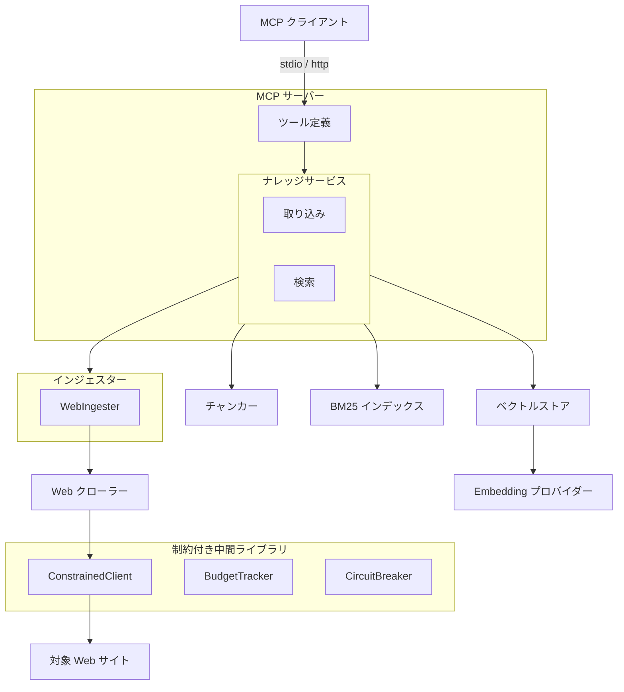
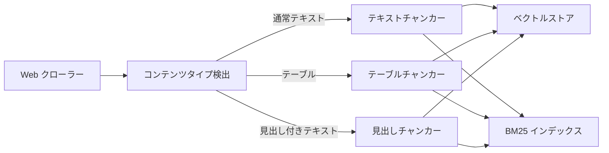
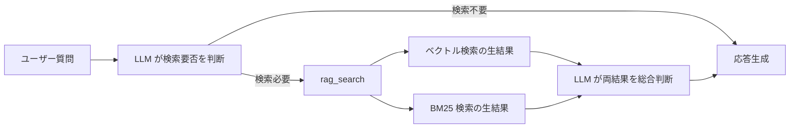

# RAG ナレッジ

## 概要

外部 Web ページから収集した知識をベクトル DB に蓄積し、
MCP クライアントからのクエリに対して関連情報を検索・提供する
RAG（Retrieval-Augmented Generation）基盤。
MCP サーバーとして独立動作し、6 つのツールを提供する。

スコープ:

- 知識の取り込み（クロール・単一ページ追加）
- 知識の検索（ベクトル検索・BM25 キーワード検索）
- 知識の管理（統計表示・削除）
- クロールプレビュー（対象ページの事前確認）
- 検索精度の評価（評価 CLI）

## 背景

- LLM の学習済み知識とリアルタイムの会話コンテキストのみでは、特定 Web サイトの情報に基づいた回答ができない
- 知識ベースの蓄積・検索を MCP サーバーとして提供し、呼び出し元との疎結合を維持する
- Embedding モデルはローカルとオンラインを切替可能にし、運用環境に応じてプロバイダーを選択できるようにする

## 制約

- 外部アプリケーションのモジュールを import しない。必要なモジュールはすべて本リポジトリ内に配置する
- プロジェクトルートの `.env` で設定を管理する
- Embedding モデルを変更した場合、既存データとの類似度計算が不正確になるため、コレクション再構築が必要
- 呼び出し元が MCP クライアントとして本サーバーに接続することで RAG 機能を利用できる
- トランスポートは stdio（デフォルト）と http（Streamable HTTP）を切替可能。環境変数でトランスポート種別・ホスト・ポート・DNS リバインディング保護を設定する。HTTP モードはローカル／信頼済みネットワーク向けを想定しており、デフォルトではループバックアドレスにバインドする。外部ネットワークへ公開する場合は、ファイアウォールやリバースプロキシでの認証付与などによりアクセス制御を行うこと
- クロール処理における外部 HTTP リクエストは ConstrainedClient（制約付き中間ライブラリ）経由で実行する。クロール関連コードでの `aiohttp.ClientSession` の直接利用は禁止
- ハードリミット（コード内定数。設定・引数・環境変数で引き上げ不可。引き下げは可能）:
  - 操作あたりリクエスト総数上限: 500
  - 最低リクエスト間隔: 0.5 秒
  - 操作全体タイムアウト: 600 秒
- サーキットブレーカー: 5 回連続失敗で操作全体を中断する
- 設定値がハードリミットを超える場合はハードリミット値にクランプする（エラーにはしない。警告ログを出力する）

## 想定プロファイル

### rag_crawl（一括クロール）

| 項目 | 内容 |
|------|------|
| 最悪ケースリクエスト数 | 1（インデックスページ）+ 1（robots.txt）+ 498（個別ページ。バジェット 500 から先行リクエスト分を差し引き）= 500。バジェットトラッカー上限 500 で打ち切り |
| 最悪ケース所要時間 | 500 × 0.5 秒（最低リクエスト間隔）= 250 秒（理論値。per-request タイムアウト・処理時間は含まない）。操作全体タイムアウト 600 秒で打ち切り |
| 想定エラー率 | 外部 Web サイト依存。リトライ機構なし（失敗ページはスキップし処理を続行）。5 回連続失敗でサーキットブレーカーが発動し操作中断 |

### rag_add（単一ページ追加）

| 項目 | 内容 |
|------|------|
| 最悪ケースリクエスト数 | 1（robots.txt）+ 1（対象ページ）= 2 |
| 最悪ケース所要時間 | 2 × 30 秒（per-request タイムアウト）= 60 秒 |
| 想定エラー率 | 低リスク。単一ページのみ |

### rag_crawl_preview（プレビュー）

| 項目 | 内容 |
|------|------|
| 最悪ケースリクエスト数 | 1（インデックスページ）+ 1（robots.txt）+ 498（タイトル取得）= 500。バジェットトラッカー上限 500 で打ち切り |
| 最悪ケース所要時間 | 500 × 0.5 秒 = 250 秒（理論値）。操作全体タイムアウト 600 秒で打ち切り |
| 想定エラー率 | タイトル取得失敗時は空文字列とし処理を続行 |

## 安全制約

| 制約名 | 種別 | 値 | 解除可否 |
|--------|------|-----|---------|
| 操作あたりリクエスト総数上限 | ハードリミット | 500 | 引き上げ不可（引き下げ可） |
| 最低リクエスト間隔 | ハードリミット | 0.5 秒 | 引き上げ不可（引き下げ可） |
| 操作全体タイムアウト | ハードリミット | 600 秒 | 引き上げ不可（引き下げ可） |
| サーキットブレーカー閾値 | ハードリミット | 5 回連続失敗 | 引き上げ不可（引き下げ可） |
| クロール対象ページ数上限 | 設定値 | 許容範囲 1〜500、デフォルト 50 | 範囲内で変更可 |
| クロール遅延 | 設定値 | 許容範囲 0.5〜60 秒、デフォルト 1.0 秒 | 範囲内で変更可 |
| リクエストタイムアウト | 設定値 | 許容範囲 1〜120 秒、デフォルト 30 秒 | 範囲内で変更可 |

## インターフェース

### MCP ツール

MCP サーバーが公開する 6 つのツール。

| ツール | 入力 | 振る舞い |
| --- | --- | --- |
| rag_search | クエリ、件数 | ベクトル検索と BM25 の生結果を個別に返す。ページ全文を返却し、同一 URL は省略する。レスポンス文字数上限（`RAG_MAX_RESPONSE_CHARS`）設定時は累積文字数を追跡し、上限到達後はページ全文取得を早期打ち切りして末尾に通知を付記する |
| rag_add | URL | 単一ページをクロールして取り込む。同一 URL の再取り込み時は既存の知識を最新に置き換える |
| rag_crawl | URL、パターン | リンク集ページから一括クロールして取り込む。同一ドメインのみ対象 |
| rag_crawl_preview | URL、パターン | リンク集ページからクロール対象ページのタイトルと URL の一覧を返す。取り込みは行わない |
| rag_delete | URL | ソース URL 指定でナレッジを削除する |
| rag_stats | なし | 統計情報（総チャンク数、ソース URL 数）と蓄積データ概要（ドメイン別ソース URL 一覧・タイトル）を返す。表示件数上限は `RAG_STATS_MAX_SOURCES` で制御する |

### 検索結果の設計

rag_search はベクトル検索と BM25 検索の生結果を個別に返す。

<!-- How追加理由: 統合パイプライン(CC)を迂回する設計判断の根拠 -->
統合パイプライン（正規化・スコア結合）を迂回し、
各エンジンの生結果を呼び出し元に渡す方式を採用している。
個別の検索エンジンは良好な精度を示す一方、
統合パイプラインが有用な信号を破壊するケースがあったため。
既存の統合パイプラインは設定で戻せるよう保持している。

### 評価 CLI

検索精度の評価とリグレッション検出を行うコマンドラインツール。

| サブコマンド | 振る舞い |
| --- | --- |
| evaluate | 評価データセットで検索精度を計測しレポートを出力する。ベースライン比較でリグレッションを検出できる |
| init-test-db | テスト用のベクトル DB と BM25 インデックスを初期化する |
| crawl-preview | 指定 URL からクロール対象ページのタイトルと URL の一覧を表示する。`--format json` で JSON 出力に対応 |

評価指標: Precision、Recall、F1、NDCG@K、MRR

## コンポーネント構成

### 全体アーキテクチャ

### 取り込みフロー

### 検索フロー（準 Agentic Search）

### クロールプレビューフロー

クロール前に対象ページを確認する機能。実際の取り込み（チャンキング・Embedding 生成・DB 格納）は行わない。
タイトル取得に失敗した場合はタイトルを空文字列とし、URL のみ返す。

### コンポーネント一覧

| コンポーネント | 役割 |
| --- | --- |
| ナレッジサービス | 取り込み・検索・削除のオーケストレーション |
| インジェスター基盤 | データソースの抽象化（BaseIngester / IngestedContent） |
| WebIngester | Web ページ取り込み用インジェスター。WebCrawler に委譲し、Safe Browsing チェックを統合する |
| Web クローラー | ページの取得と本文テキスト抽出。SSRF 対策・robots.txt 遵守を含む |
| コンテンツタイプ検出 | テキストの種類（通常・テーブル・見出し付きテキスト）を判定する |
| テキストチャンカー | 段落・文・文字数の優先順で分割する。チャンク間にオーバーラップを適用する |
| テーブルチャンカー | テーブルデータを行単位で分割し、各チャンクにヘッダー行を付加する |
| 見出しチャンカー | 見出し単位で分割し、親見出しの階層情報を保持する |
| ベクトルストア | Embedding 生成とベクトル DB への格納・検索を担う |
| BM25 インデックス | 日本語形態素解析によるキーワード検索。ディスク永続化に対応する |
| ハイブリッド検索エンジン | ベクトル検索と BM25 のスコアを正規化・統合する。設定で有効化できる |
| Embedding プロバイダー | テキストをベクトルに変換する。ローカルとオンラインを切替可能 |
| URL 安全性チェック | 外部 API によるマルウェア・フィッシングサイト判定 |
| ConstrainedClient | 全外部 HTTP リクエストのゲートウェイ。ハードリミット・バジェット・サーキットブレーカーを統合し、aiohttp.ClientSession をラップする |
| BudgetTracker | 操作あたりのリクエスト総数を追跡し、上限到達で BudgetExhaustedError を送出する |
| CircuitBreaker | 連続失敗回数を監視し、閾値超過で CircuitBreakerOpenError を送出する |
| 評価ツール | Precision、Recall、F1、NDCG、MRR の計算とベースライン比較 |

## 外部連携

| 連携先 | 用途 | 接続方式 |
| --- | --- | --- |
| ChromaDB | ベクトルの永続化・類似度検索 | 組み込みモード |
| LM Studio | ローカル Embedding 生成 | OpenAI 互換 API |
| OpenAI Embeddings API | オンライン Embedding 生成 | REST API |
| Google Safe Browsing API | URL 安全性チェック | REST API（オプション） |
| 対象 Web サイト | クロール対象 | HTTP/HTTPS |

## エッジケース

| ケース | 振る舞い |
| --- | --- |
| MCP クライアント未接続 | サーバーは起動済みだがクライアントからの接続がない場合、待機状態を維持する |
| 未定義ツール呼び出し | MCP プロトコルに従いエラーレスポンスを返す |
| クロール時の個別ページエラー | ページ単位でエラーを隔離し、成功したページの処理を続行する |
| プライベート IP・localhost へのアクセス | SSRF 対策としてリクエストを拒否する |
| HTTP リダイレクト | SSRF 防止のためリダイレクト追従を無効化する |
| robots.txt の Disallow | クロールをスキップする。取得失敗時はフェイルオープンでクロールを許可する |
| BM25 インデックスの破損 | 空インデックスで起動する（フェイルセーフ） |
| Embedding プロバイダー接続不可 | 疎通確認で検出し、エラーを返す |
| クロールプレビュー時のタイトル取得失敗 | タイトルを空文字列とし、URL のみ返す。他のページの処理は続行する |
| rag_search レスポンスサイズ超過 | `RAG_MAX_RESPONSE_CHARS` 超過時はレスポンス構築中に累積文字数を追跡し、上限到達後は以降のページ全文取得を打ち切る（早期打ち切り）。末尾にトランケート通知を付記する。未設定時は無制限 |
| バジェット上限到達 | 取得済みデータを返し、上限到達の旨をログ出力する |
| サーキットブレーカー発動 | 操作を中断し、取得済みデータを返す。エラーの詳細をログ出力する |
| 操作全体タイムアウト | 操作を中断し、取得済みデータを返す |
| 設定値がハードリミット超過 | ハードリミット値にクランプし、警告ログを出力する |

## 関連ドキュメント

なし
