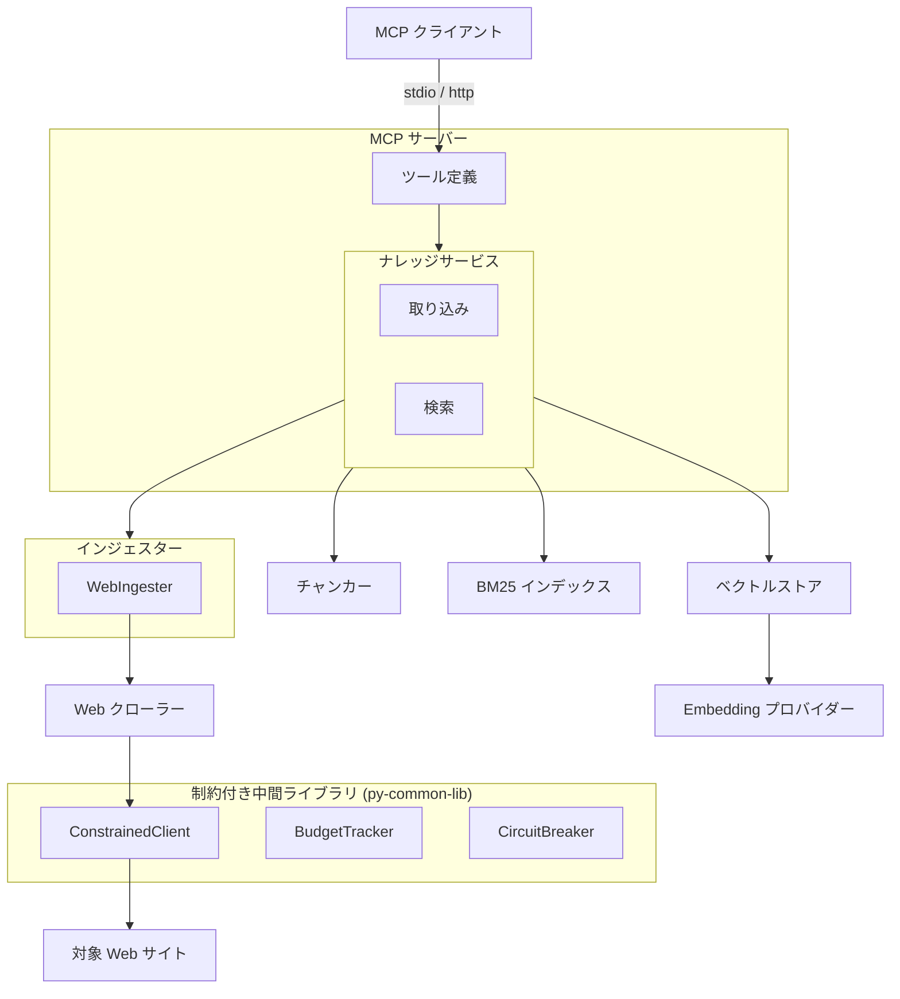
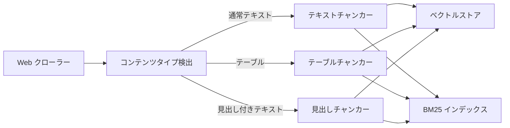
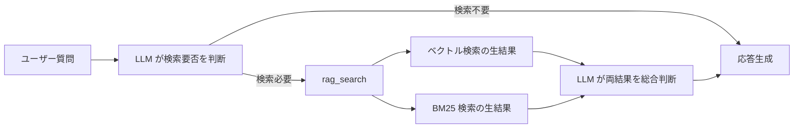

# RAG ナレッジ

## 概要

外部 Web ページから収集した知識をベクトル DB に蓄積し、
MCP クライアントからのクエリに対して関連情報を検索・提供する
RAG（Retrieval-Augmented Generation）基盤。
MCP サーバーとして独立動作し、10 個のツールを提供する。

スコープ:

- 知識の取り込み（クロール・単一ページ追加・Zenn 記事取り込み・BlueSky 投稿取り込み・ドキュメントファイル取り込み）
- 知識の検索（ベクトル検索・BM25 キーワード検索）
- 知識の管理（統計表示・削除）
- クロールプレビュー（対象ページの事前確認）
- 検索精度の評価（評価 CLI）

## 背景

- LLM の学習済み知識とリアルタイムの会話コンテキストのみでは、特定 Web サイトの情報に基づいた回答ができない
- 知識ベースの蓄積・検索を MCP サーバーとして提供し、呼び出し元との疎結合を維持する
- Embedding モデルはローカルとオンラインを切替可能にし、運用環境に応じてプロバイダーを選択できるようにする

## 制約

### 設定管理

設定値はセキュリティレベルに応じて3層に分離し、各設定値の取得元は1つに固定する（フォールバックなし）。
`.env` と `config.toml` は同じキーを持たない（取得元の一意性を保証）。
`.env` は環境変数の慣例に従い大文字、`config.toml` は TOML の慣例に従い小文字スネークケースで記述する。

| 層 | 保管先 | git管理 | 分類基準 |
|---|--------|---------|---------|
| シークレット | OS セキュアストレージ (keyring) | 管理外 | 漏洩時に直接被害が発生する値。py-common-lib の `get_secret` で取得 |
| 環境依存値 | `.env` | 管理外 | デプロイ先・マシンごとに異なる値 |
| 共通設定値 | `config.toml` | **管理する** | プロジェクトとして統一管理する値 |

#### `.env`（環境依存値）

| カテゴリ | 設定項目 |
|---------|---------|
| Embedding 接続 | `EMBEDDING_PROVIDER`, `LMSTUDIO_BASE_URL` |
| ストレージ | `CHROMADB_PERSIST_DIR`, `BM25_PERSIST_DIR` |
| トランスポート | `RAG_TRANSPORT`, `RAG_HTTP_HOST`, `RAG_HTTP_PORT`, `RAG_DNS_REBINDING_PROTECTION` |
| デバッグ | `RAG_DEBUG_LOG_ENABLED` |

#### `config.toml`（共通設定値）

| カテゴリ | 設定項目 |
|---------|---------|
| Embedding モデル | `embedding_model_local`, `embedding_model_online`, `embedding_prefix_enabled` |
| チャンキング | `rag_chunk_size`, `rag_chunk_overlap` |
| 検索 | `rag_retrieval_count`, `rag_similarity_threshold` |
| ハイブリッド検索 | `rag_hybrid_search_enabled`, `rag_vector_weight`, `rag_bm25_k1`, `rag_bm25_b`, `rag_min_combined_score` |
| クロール | `rag_max_crawl_pages`, `rag_crawl_delay_sec` |
| robots.txt | `rag_respect_robots_txt`, `rag_robots_txt_cache_ttl` |
| URL 安全性 | `rag_url_safety_check`, `rag_url_safety_cache_ttl`, `rag_url_safety_fail_open`, `rag_url_safety_timeout` |
| レスポンス制御 | `rag_max_response_chars`, `rag_stats_max_sources` |
| Zenn インジェスター | `rag_zenn_max_articles`, `rag_zenn_request_timeout`, `rag_zenn_request_interval` |
| BlueSky インジェスター | `rag_bluesky_appview_url`, `rag_bluesky_max_posts`, `rag_bluesky_request_timeout`, `rag_bluesky_request_interval`, `rag_bluesky_include_reposts` |
| ドキュメントインジェスター | `rag_document_supported_extensions` |

- Embedding モデルを変更した場合、既存データとの類似度計算が不正確になるため、コレクション再構築が必要
- 呼び出し元が MCP クライアントとして本サーバーに接続することで RAG 機能を利用できる
- トランスポートは stdio（デフォルト）と http（Streamable HTTP）を切替可能。`.env` でトランスポート種別・ホスト・ポート・DNS リバインディング保護を設定する。HTTP モードはローカル／信頼済みネットワーク向けを想定しており、デフォルトではループバックアドレスにバインドする。外部ネットワークへ公開する場合は、ファイアウォールやリバースプロキシでの認証付与などによりアクセス制御を行うこと
- `src/` 配下の外部 HTTP リクエストは ConstrainedClient（py-common-lib パッケージで提供）経由で実行する。`httpx.AsyncClient`/`httpx.Client`・`aiohttp.ClientSession`・`requests`・`urllib.request` の直接利用は禁止
- CI（`check-raw-http` ワークフロー）で ConstrainedClient を経由しない直接 HTTP クライアント利用を検出し、違反があればマージをブロックする。ConstrainedClient は `src/` 外のパッケージのため検出対象外。許可例外: `# safety:allowed` コメントが付与された行
- ハードリミット（コード内定数。設定・引数・環境変数で緩和不可。厳格化は可能）:
  - 操作あたりリクエスト総数上限: 500
  - 最低リクエスト間隔: 0.1 秒
  - 操作全体タイムアウト: 600 秒（許容範囲 1〜600 秒）
- サーキットブレーカー: 5 回連続失敗で操作全体を中断する
- 設定値がハードリミットの許容範囲外の場合は範囲内にクランプする（エラーにはしない。警告ログを出力する）

## 想定プロファイル

### rag_crawl（一括クロール）

| 項目 | 内容 |
|------|------|
| 最悪ケースリクエスト数 | 1（インデックスページ）+ 1（robots.txt）+ 498（個別ページ。バジェット 500 から先行リクエスト分を差し引き）= 500。バジェットトラッカー上限 500 で打ち切り |
| 最悪ケース所要時間 | 500 × 0.1 秒（ハードリミット最小間隔での理論最短）= 50 秒。デフォルト設定（1.0 秒間隔）では 500 秒。per-request タイムアウト・処理時間は含まない。操作全体タイムアウト 600 秒で打ち切り |
| 想定エラー率 | 外部 Web サイト依存。リトライ機構なし（失敗ページはスキップし処理を続行）。5 回連続失敗でサーキットブレーカーが発動し操作中断 |

### rag_add（単一ページ追加）

| 項目 | 内容 |
|------|------|
| 最悪ケースリクエスト数 | 1（robots.txt）+ 1（対象ページ）= 2 |
| 最悪ケース所要時間 | 2 × 30 秒（per-request タイムアウト）= 60 秒 |
| 想定エラー率 | 低リスク。単一ページのみ |

### rag_crawl_preview（プレビュー）

| 項目 | 内容 |
|------|------|
| 最悪ケースリクエスト数 | 1（インデックスページ）+ 1（robots.txt）+ 498（タイトル取得）= 500。バジェットトラッカー上限 500 で打ち切り |
| 最悪ケース所要時間 | 500 × 0.1 秒（ハードリミット最小間隔での理論最短）= 50 秒。デフォルト設定（1.0 秒間隔）では 500 秒。操作全体タイムアウト 600 秒で打ち切り |
| 想定エラー率 | タイトル取得失敗時は空文字列とし処理を続行 |

## 安全制約

| 制約名 | 種別 | 値 | 解除可否 |
|--------|------|-----|---------|
| 操作あたりリクエスト総数上限 | ハードリミット | 500 | 引き上げ不可（引き下げ可） |
| 最低リクエスト間隔 | ハードリミット | 0.1 秒 | 引き下げ不可（引き上げ可） |
| 操作全体タイムアウト | ハードリミット | 600 秒、許容範囲 1〜600 秒 | 引き上げ不可（引き下げ可、下限 1 秒） |
| サーキットブレーカー閾値 | ハードリミット | 5 回連続失敗 | 引き上げ不可（引き下げ可） |
| クロール対象ページ数上限 | 設定値 | 許容範囲 1〜500、デフォルト 50 | 範囲内で変更可 |
| クロール遅延 | 設定値 | 許容範囲 0.1〜60 秒、デフォルト 1.0 秒 | 範囲内で変更可 |
| リクエストタイムアウト | 設定値 | 許容範囲 1〜120 秒、デフォルト 30 秒 | 範囲内で変更可 |
| 生 HTTP クライアント利用禁止 | CI チェック | `src/` 全体を grep で走査（httpx / aiohttp / requests / urllib.request）。`# safety:allowed` 行を除外。ConstrainedClient は py-common-lib パッケージで提供（`src/` 外のため検出対象外） | 許可例外の追加は `# safety:allowed` コメントで可 |

## インターフェース

### MCP ツール

MCP サーバーが公開する 10 個のツール。

| ツール | 入力 | 振る舞い |
| --- | --- | --- |
| rag_search | クエリ、件数、source_type（任意） | ベクトル検索と BM25 の生結果を個別に返す。ページ全文を返却し、同一 URL は省略する。`source_type` 指定時はそのソース種別のチャンクのみを検索対象とする。レスポンス文字数上限（`RAG_MAX_RESPONSE_CHARS`）設定時は累積文字数を追跡し、上限到達後はページ全文取得を早期打ち切りして末尾に通知を付記する |
| rag_add | URL | 単一ページをクロールして取り込む。同一 URL の再取り込み時は既存の知識を最新に置き換える |
| rag_crawl | URL、パターン | リンク集ページから一括クロールして取り込む。同一ドメインのみ対象 |
| rag_crawl_preview | URL、パターン | リンク集ページからクロール対象ページのタイトルと URL の一覧を返す。取り込みは行わない |
| rag_crawl_zenn | username、max_articles（任意） | 指定ユーザーの Zenn 記事を API 経由で取得し、ナレッジベースに取り込む。同一記事の再取り込み時は `source_id`（記事の公開 URL）の一致で検出し、既存の知識を最新に置き換える |
| rag_crawl_bluesky | handle、max_posts（任意）、include_reposts（任意） | 指定ユーザーの BlueSky 投稿を AT Protocol API 経由で取得し、ナレッジベースに取り込む。max_posts はタイムライン全体（リポスト含む）に適用。BlueSky は投稿編集不可のため、既存 `source_id` と一致する投稿はスキップする（上書き不要） |
| rag_add_document | file_path | 単一ドキュメントファイルを読み取り、ナレッジベースに取り込む。同一ファイルの再取り込み時は `source_id`（file URI）の一致で検出し、既存の知識を最新に置き換える |
| rag_crawl_documents | dir_path、pattern（任意） | 指定ディレクトリ内のドキュメントファイルを glob パターンで検索し、一括でナレッジベースに取り込む。同一ファイルの再取り込み時は `source_id`（file URI）の一致で検出し、既存の知識を最新に置き換える |
| rag_delete | URL | ソース URL 指定でナレッジを削除する |
| rag_stats | なし | 統計情報（総チャンク数、ソース URL 数）と蓄積データ概要（ドメイン別ソース URL 一覧・タイトル）を返す。表示件数上限は `RAG_STATS_MAX_SOURCES` で制御する |

### 検索結果の設計

rag_search はベクトル検索と BM25 検索の生結果を個別に返す。

<!-- How追加理由: 統合パイプライン(CC)を迂回する設計判断の根拠 -->
統合パイプライン（正規化・スコア結合）を迂回し、
各エンジンの生結果を呼び出し元に渡す方式を採用している。
個別の検索エンジンは良好な精度を示す一方、
統合パイプラインが有用な信号を破壊するケースがあったため。
既存の統合パイプラインは設定で戻せるよう保持している。

### 評価 CLI

検索精度の評価とリグレッション検出を行うコマンドラインツール。

| サブコマンド | 振る舞い |
| --- | --- |
| evaluate | 評価データセットで検索精度を計測しレポートを出力する。ベースライン比較でリグレッションを検出できる |
| init-test-db | テスト用のベクトル DB と BM25 インデックスを初期化する |
| crawl-preview | 指定 URL からクロール対象ページのタイトルと URL の一覧を表示する。`--format json` で JSON 出力に対応 |

評価指標: Precision、Recall、F1、NDCG@K、MRR

## コンポーネント構成

### 全体アーキテクチャ

### 取り込みフロー

### チャンクメタデータ

各チャンクに付与するメタデータの構造を定義する。メタデータは ChromaDB に格納され、フィルタリング検索に使用できる。

#### 共通フィールド

全インジェスター共通で付与するフィールド。

| フィールド | 型 | 内容 |
|-----------|-----|------|
| `source_url` | str | ソース識別子（URL、file URI、AT URI 等）。フラグメント除去済み |
| `title` | str | コンテンツのタイトル |
| `chunk_index` | int | チャンクの連番（0 始まり） |
| `crawled_at` | str | 取り込みタイムスタンプ（ISO 8601） |
| `source_type` | str | データソース種別（`"web"`, `"zenn"`, `"bluesky"`, `"document"`） |

#### カスタムフィールド

インジェスター固有のメタデータ。`custom:` プレフィックスを付与して共通フィールドと名前空間を分離する。

各インジェスターが `IngestedContent.metadata` に格納した全フィールドを `custom:{キー名}` として保存する。

#### 型変換ルール

ChromaDB のメタデータ値は `str | int | float | bool` のみ許容される。`IngestedContent.metadata` の値が許容型でない場合、以下のルールで変換する。

| 元の型 | 変換 | 例 |
|--------|------|-----|
| `str` | そのまま | `"tech"` → `"tech"` |
| `int` | そのまま | `42` → `42` |
| `float` | そのまま | `0.95` → `0.95` |
| `bool` | そのまま | `True` → `True` |
| `list` | `str()` | `["Python", "AI"]` → `"['Python', 'AI']"` |
| その他 | `str()` | — |

### チャンカーの構文モード（未実装・設計仕様）

> **実装ステータス**: 未実装。本セクションは設計仕様であり、後続フェーズで実装予定。
> 現状のチャンカーは Markdown モードのみ対応している。

見出しチャンカー・テーブルチャンカーは、入力ファイルの形式に応じて構文認識を切り替える。構文モードは取り込みフロー図のコンテンツタイプ検出とは直交する概念であり、各チャンカーがモードパラメータに基づいて内部的に構文認識（見出し記法、テーブル記法等）を切り替える。

#### モード分岐

ソース URL またはファイルパスの拡張子に基づいてモードを決定する。チャンカーの呼び出し元（ナレッジサービス）が `IngestedContent` の `source_id` フィールドから拡張子を抽出し、チャンカーにモードパラメータとして渡す。

| 拡張子 | モード | デフォルト |
|--------|--------|-----------|
| `.adoc`, `.asciidoc` | AsciiDoc モード | - |
| 上記以外 | Markdown モード | Yes |

拡張子が不明な場合（Web クロール等）は Markdown モード（デフォルト）を使用する。

#### AsciiDoc モードで認識する構文

| 要素 | AsciiDoc 構文 | Markdown 相当 | 対象チャンカー |
|------|---------------|---------------|---------------|
| 見出し | `= Title` / `== Section` / `=== Sub` / `==== SubSub` | `#` / `##` / `###` / `####` | 見出しチャンカー |
| テーブル | <code>&#124;===</code> 開閉デリミタ | <code>&#124;---&#124;</code> 区切り | テーブルチャンカー |
| コードブロック | `----` デリミタ | <code>&#96;&#96;&#96;</code> | 見出しチャンカー（分割防止） |
| リテラルブロック | `....` デリミタ | なし | 見出しチャンカー（分割防止） |
| サイドバーブロック | `****` デリミタ | なし | 見出しチャンカー（分割防止） |
| 引用ブロック | `____` デリミタ | なし | 見出しチャンカー（分割防止） |
| パススルーブロック | `++++` デリミタ | なし | 見出しチャンカー（分割防止） |
| コメントブロック | `////` デリミタ | なし | 見出しチャンカー（分割防止） |
| 例示ブロック | `====` デリミタ（4 文字以上。見出しとは空白+テキストの有無で区別） | なし | 見出しチャンカー（分割防止） |

#### 見出しチャンカーの AsciiDoc 対応

- AsciiDoc の見出し構文（`=` の繰り返し + 空白 + テキスト）を検出し、レベルに応じて分割する
  - `= Title`（レベル 1）、`== Section`（レベル 2）、`=== Sub`（レベル 3）、以降同様
  - AsciiDoc 公式仕様ではドキュメントタイトル `=` はレベル 0 だが、Markdown チャンカーとの整合性のためレベル 1 として扱う（`=` が 1 つ → レベル 1、`==` が 2 つ → レベル 2）
- AsciiDoc デリミタブロック（`----`, `....`, `====`, `****`, `____`, `++++`, `////`）内では見出し分割を行わない
  - デリミタは同一記号が 4 文字以上連続する行で開閉を判定する
  - 開きデリミタと閉じデリミタは同じ記号・同じ長さの行である
- 親見出しの階層追跡・パンくずリスト生成は Markdown モードと同じ仕組みを使用する

#### テーブルチャンカーの AsciiDoc 対応

- AsciiDoc テーブルは `|===` 行で開始・終了するブロック形式で記述される
- `|===` デリミタで囲まれたブロックをテーブルとして検出する
- テーブル内の行を解析し、ヘッダー行とデータ行に分割する
  - `|===` 直後の最初の行をヘッダー行として扱う（AsciiDoc の `[options="header"]` 等の属性は認識しない簡易方式）
- 各チャンクにヘッダー行を付加する方式は Markdown モードと同じ

### 検索フロー（準 Agentic Search）

### クロールプレビューフロー

クロール前に対象ページを確認する機能。実際の取り込み（チャンキング・Embedding 生成・DB 格納）は行わない。
タイトル取得に失敗した場合はタイトルを空文字列とし、URL のみ返す。

### コンポーネント一覧

| コンポーネント | 役割 |
| --- | --- |
| ナレッジサービス | 取り込み・検索・削除のオーケストレーション |
| インジェスター基盤 | データソースの抽象化（BaseIngester / IngestedContent） |
| WebIngester | Web ページ取り込み用インジェスター。WebCrawler に委譲し、Safe Browsing チェックを統合する |
| Web クローラー | ページの取得と本文テキスト抽出。SSRF 対策・robots.txt 遵守を含む |
| コンテンツタイプ検出 | テキストの種類（通常・テーブル・見出し付きテキスト）を判定する |
| テキストチャンカー | 段落・文・文字数の優先順で分割する。チャンク間にオーバーラップを適用する |
| テーブルチャンカー | テーブルデータを行単位で分割し、各チャンクにヘッダー行を付加する。現状は Markdown テーブルに対応。AsciiDoc テーブル（<code>&#124;===</code> デリミタ）対応は未実装 |
| 見出しチャンカー | 見出し単位で分割し、親見出しの階層情報を保持する。現状は Markdown 見出し（`#`）と HTML 見出しに対応。AsciiDoc 見出し（`==`）対応は未実装 |
| ベクトルストア | Embedding 生成とベクトル DB への格納・検索を担う |
| BM25 インデックス | 日本語形態素解析によるキーワード検索。ディスク永続化に対応する |
| ハイブリッド検索エンジン | ベクトル検索と BM25 のスコアを正規化・統合する。設定で有効化できる |
| Embedding プロバイダー | テキストをベクトルに変換する。ローカルとオンラインを切替可能 |
| URL 安全性チェック | 外部 API によるマルウェア・フィッシングサイト判定 |
| ConstrainedClient (py-common-lib) | 全外部 HTTP リクエストのゲートウェイ。ハードリミット・バジェット・サーキットブレーカーを統合し、httpx.AsyncClient をラップする |
| BudgetTracker (py-common-lib) | 操作あたりのリクエスト総数を追跡し、上限到達で BudgetExhaustedError を送出する |
| CircuitBreaker (py-common-lib) | 連続失敗回数を監視し、閾値超過で CircuitBreakerOpenError を送出する |
| 評価ツール | Precision、Recall、F1、NDCG、MRR の計算とベースライン比較 |

## 外部連携

| 連携先 | 用途 | 接続方式 |
| --- | --- | --- |
| ChromaDB | ベクトルの永続化・類似度検索 | 組み込みモード |
| LM Studio | ローカル Embedding 生成 | OpenAI 互換 API |
| OpenAI Embeddings API | オンライン Embedding 生成 | REST API |
| Google Safe Browsing API | URL 安全性チェック | REST API（オプション） |
| 対象 Web サイト | クロール対象 | HTTP/HTTPS |

## エッジケース

| ケース | 振る舞い |
| --- | --- |
| MCP クライアント未接続 | サーバーは起動済みだがクライアントからの接続がない場合、待機状態を維持する |
| 未定義ツール呼び出し | MCP プロトコルに従いエラーレスポンスを返す |
| クロール時の個別ページエラー | ページ単位でエラーを隔離し、成功したページの処理を続行する |
| プライベート IP・localhost へのアクセス | SSRF 対策としてリクエストを拒否する |
| HTTP リダイレクト | SSRF 防止のためリダイレクト追従を無効化する |
| robots.txt の Disallow | クロールをスキップする。取得失敗時はフェイルオープンでクロールを許可する |
| BM25 インデックスの破損 | 空インデックスで起動する（フェイルセーフ） |
| Embedding プロバイダー接続不可 | 疎通確認で検出し、エラーを返す |
| `OPENAI_API_KEY` が未登録 | オンライン Embedding プロバイダーの初期化に失敗し、エラーを返す |
| `GOOGLE_SAFE_BROWSING_API_KEY` が未登録 | URL 安全性チェックを無効化し、警告ログを出力して処理を続行する |
| クロールプレビュー時のタイトル取得失敗 | タイトルを空文字列とし、URL のみ返す。他のページの処理は続行する |
| rag_search レスポンスサイズ超過 | `RAG_MAX_RESPONSE_CHARS` 超過時はレスポンス構築中に累積文字数を追跡し、上限到達後は以降のページ全文取得を打ち切る（早期打ち切り）。末尾にトランケート通知を付記する。未設定時はトランケーションなし（検索結果をそのまま返す） |
| バジェット上限到達 | 取得済みデータを返し、上限到達の旨をログ出力する |
| サーキットブレーカー発動 | 操作を中断し、取得済みデータを返す。エラーの詳細をログ出力する |
| 操作全体タイムアウト | 操作を中断し、取得済みデータを返す |
| 設定値がハードリミット超過 | ハードリミット値にクランプし、警告ログを出力する |
| AsciiDoc デリミタブロックが閉じられていない | ファイル末尾までをブロック内とみなし、ブロック内での見出し分割を行わない |
| ネストしたデリミタブロック（AsciiDoc モード） | AsciiDoc 仕様に従い、同一種類のデリミタはネスト不可。最初の閉じデリミタで終了する |

## 関連ドキュメント

- [zenn-ingester.md](zenn-ingester.md) — Zenn インジェスター仕様
- [bluesky-ingester.md](bluesky-ingester.md) — BlueSky インジェスター仕様
- [document-ingester.md](document-ingester.md) — ドキュメントインジェスター仕様
