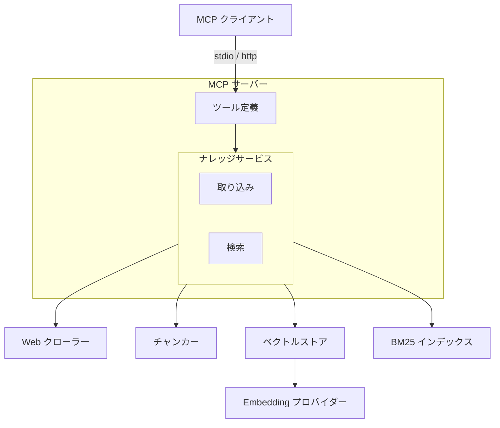
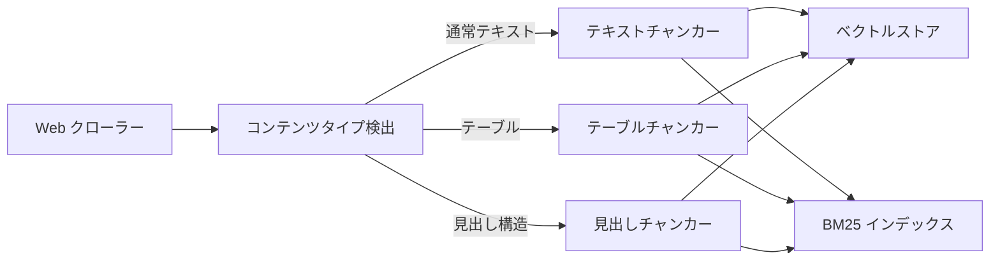
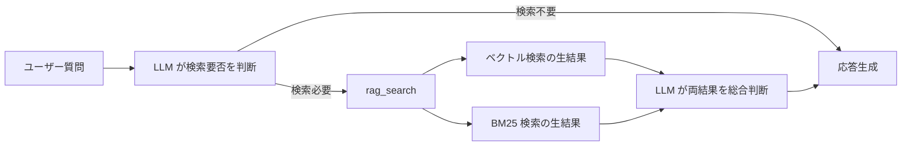

# RAG ナレッジ

## 概要

外部 Web ページから収集した知識をベクトル DB に蓄積し、
MCP クライアントからのクエリに対して関連情報を検索・提供する
RAG（Retrieval-Augmented Generation）基盤。
MCP サーバーとして独立動作し、5 つのツールを提供する。

スコープ:

- 知識の取り込み（クロール・単一ページ追加）
- 知識の検索（ベクトル検索・BM25 キーワード検索）
- 知識の管理（統計表示・削除）
- 検索精度の評価（評価 CLI）

## 背景

- LLM の学習済み知識とリアルタイムの会話コンテキストのみでは、特定 Web サイトの情報に基づいた回答ができない
- 知識ベースの蓄積・検索を MCP サーバーとして提供し、呼び出し元との疎結合を維持する
- Embedding モデルはローカルとオンラインを切替可能にし、運用環境に応じてプロバイダーを選択できるようにする

## 制約

- 外部アプリケーションのモジュールを import しない。必要なモジュールはすべて本リポジトリ内に配置する
- プロジェクトルートの `.env` で設定を管理する
- Embedding モデルを変更した場合、既存データとの類似度計算が不正確になるため、コレクション再構築が必要
- 呼び出し元が MCP クライアントとして本サーバーに接続することで RAG 機能を利用できる
- トランスポートは stdio（デフォルト）と http（Streamable HTTP）を切替可能。環境変数でトランスポート種別・ホスト・ポート・DNS リバインディング保護を設定する
- HTTP モード時はデータ変更ツール（`rag_add`, `rag_crawl`, `rag_delete`）を非公開にし、読み取り専用ツールのみ提供する

## インターフェース

### MCP ツール

MCP サーバーが公開する 5 つのツール。

| ツール | 入力 | 振る舞い |
| --- | --- | --- |
| rag_search | クエリ、件数 | ベクトル検索と BM25 の生結果を個別に返す。ページ全文を返却し、同一 URL は省略する |
| rag_add | URL | 単一ページをクロールして取り込む。同一 URL の再取り込み時は既存の知識を最新に置き換える |
| rag_crawl | URL、パターン | リンク集ページから一括クロールして取り込む。同一ドメインのみ対象 |
| rag_delete | URL | ソース URL 指定でナレッジを削除する |
| rag_stats | なし | 統計情報（総チャンク数、ソース URL 数）を返す |

### 検索結果の設計

rag_search はベクトル検索と BM25 検索の生結果を個別に返す。

<!-- How追加理由: 統合パイプライン(CC)を迂回する設計判断の根拠 -->
統合パイプライン（正規化・スコア結合）を迂回し、
各エンジンの生結果を呼び出し元に渡す方式を採用している。
個別の検索エンジンは良好な精度を示す一方、
統合パイプラインが有用な信号を破壊するケースがあったため。
既存の統合パイプラインは設定で戻せるよう保持している。

### 評価 CLI

検索精度の評価とリグレッション検出を行うコマンドラインツール。

| サブコマンド | 振る舞い |
| --- | --- |
| evaluate | 評価データセットで検索精度を計測しレポートを出力する。ベースライン比較でリグレッションを検出できる |
| init-test-db | テスト用のベクトル DB と BM25 インデックスを初期化する |

評価指標: Precision、Recall、F1、NDCG@K、MRR

## コンポーネント構成

### 全体アーキテクチャ

### 取り込みフロー

### 検索フロー（準 Agentic Search）

### コンポーネント一覧

| コンポーネント | 役割 |
| --- | --- |
| ナレッジサービス | 取り込み・検索・削除のオーケストレーション |
| Web クローラー | ページの取得と本文テキスト抽出。SSRF 対策・robots.txt 遵守を含む |
| コンテンツタイプ検出 | テキストの種類（通常・テーブル・見出し付きテキスト）を判定する |
| テキストチャンカー | 段落・文・文字数の優先順で分割する。チャンク間にオーバーラップを適用する |
| テーブルチャンカー | テーブルデータを行単位で分割し、各チャンクにヘッダー行を付加する |
| 見出しチャンカー | 見出し単位で分割し、親見出しの階層情報を保持する |
| ベクトルストア | Embedding 生成とベクトル DB への格納・検索を担う |
| BM25 インデックス | 日本語形態素解析によるキーワード検索。ディスク永続化に対応する |
| ハイブリッド検索エンジン | ベクトル検索と BM25 のスコアを正規化・統合する。設定で有効化できる |
| Embedding プロバイダー | テキストをベクトルに変換する。ローカルとオンラインを切替可能 |
| URL 安全性チェック | 外部 API によるマルウェア・フィッシングサイト判定 |
| 評価ツール | Precision、Recall、F1、NDCG、MRR の計算とベースライン比較 |

## 外部連携

| 連携先 | 用途 | 接続方式 |
| --- | --- | --- |
| ChromaDB | ベクトルの永続化・類似度検索 | 組み込みモード |
| LM Studio | ローカル Embedding 生成 | OpenAI 互換 API |
| OpenAI Embeddings API | オンライン Embedding 生成 | REST API |
| Google Safe Browsing API | URL 安全性チェック | REST API（オプション） |
| 対象 Web サイト | クロール対象 | HTTP/HTTPS |

## エッジケース

| ケース | 振る舞い |
| --- | --- |
| MCP クライアント未接続 | サーバーは起動済みだがクライアントからの接続がない場合、待機状態を維持する |
| 未定義ツール呼び出し | MCP プロトコルに従いエラーレスポンスを返す |
| クロール時の個別ページエラー | ページ単位でエラーを隔離し、成功したページの処理を続行する |
| プライベート IP・localhost へのアクセス | SSRF 対策としてリクエストを拒否する |
| HTTP リダイレクト | SSRF 防止のためリダイレクト追従を無効化する |
| robots.txt の Disallow | クロールをスキップする。取得失敗時はフェイルオープンでクロールを許可する |
| BM25 インデックスの破損 | 空インデックスで起動する（フェイルセーフ） |
| Embedding プロバイダー接続不可 | 疎通確認で検出し、エラーを返す |

## 関連ドキュメント

なし
