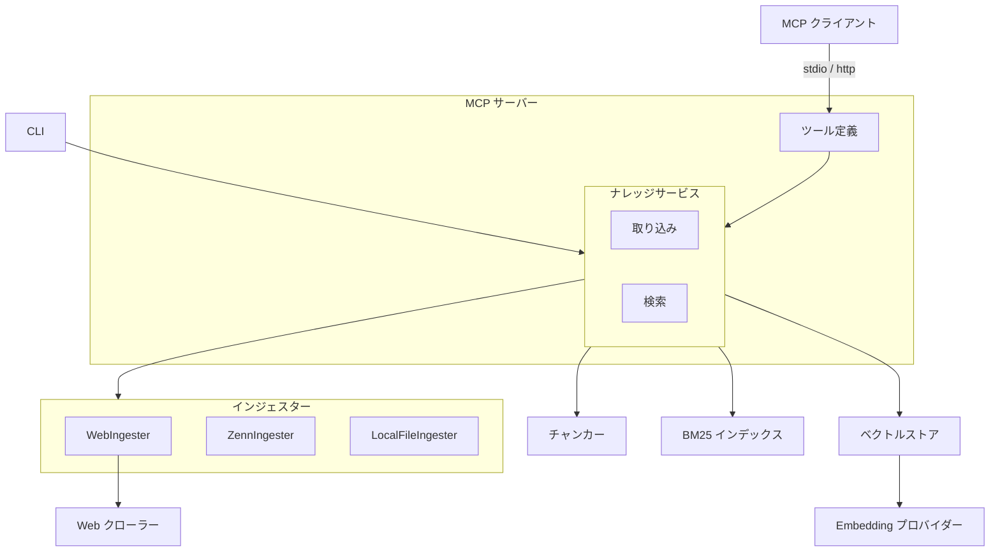
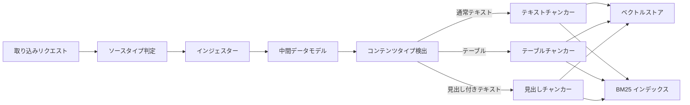
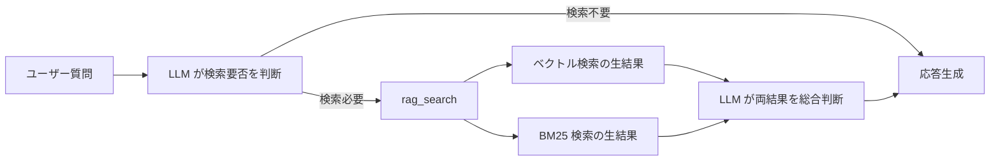

# RAG ナレッジ

## 概要

複数のデータソース（Web ページ、ローカルファイル、外部 API 等）から収集した知識をベクトル DB に蓄積し、
MCP クライアントからのクエリに対して関連情報を検索・提供する
RAG（Retrieval-Augmented Generation）基盤。
MCP サーバーとして独立動作し、8 つのツールを提供する。

スコープ:

- 知識の取り込み（Web クロール・単一ページ追加・マルチソース一括取り込み）
- 知識の検索（ベクトル検索・BM25 キーワード検索）
- 知識の管理（統計表示・削除）
- クロールプレビュー（対象ページの事前確認）
- 検索精度の評価（評価 CLI）

## 背景

- LLM の学習済み知識とリアルタイムの会話コンテキストのみでは、特定 Web サイトの情報に基づいた回答ができない
- 知識ベースの蓄積・検索を MCP サーバーとして提供し、呼び出し元との疎結合を維持する
- Embedding モデルはローカルとオンラインを切替可能にし、運用環境に応じてプロバイダーを選択できるようにする

## 制約

- 外部アプリケーションのモジュールを import しない。必要なモジュールはすべて本リポジトリ内に配置する
- プロジェクトルートの `.env` で設定を管理する
- Embedding モデルを変更した場合、既存データとの類似度計算が不正確になるため、コレクション再構築が必要
- 呼び出し元が MCP クライアントとして本サーバーに接続することで RAG 機能を利用できる
- トランスポートは stdio（デフォルト）と http（Streamable HTTP）を切替可能。環境変数でトランスポート種別・ホスト・ポート・DNS リバインディング保護を設定する。HTTP モードはローカル／信頼済みネットワーク向けを想定しており、デフォルトではループバックアドレスにバインドする。外部ネットワークへ公開する場合は、ファイアウォールやリバースプロキシでの認証付与などによりアクセス制御を行うこと

## インターフェース

### MCP ツール

MCP サーバーが公開する 8 つのツール。

#### 既存ツール

| ツール | 入力 | 振る舞い |
| --- | --- | --- |
| rag_search | クエリ、件数 | ベクトル検索と BM25 の生結果を個別に返す。ページ全文を返却し、同一 URL は省略する。レスポンス文字数上限（`RAG_MAX_RESPONSE_CHARS`）設定時は累積文字数を追跡し、上限到達後はページ全文取得を早期打ち切りして末尾に通知を付記する |
| rag_add | URL | 単一ページをクロールして取り込む。同一 URL の再取り込み時は既存の知識を最新に置き換える |
| rag_crawl | URL、パターン | リンク集ページから一括クロールして取り込む。同一ドメインのみ対象 |
| rag_crawl_preview | URL、パターン | リンク集ページからクロール対象ページのタイトルと URL の一覧を返す。取り込みは行わない |
| rag_delete | URL | ソース URL 指定でナレッジを削除する |
| rag_stats | なし | 統計情報（総チャンク数、ソース URL 数）と蓄積データ概要（ドメイン別ソース URL 一覧・タイトル）を返す。表示件数上限は `RAG_STATS_MAX_SOURCES` で制御する |

#### マルチソース取り込みツール

インジェスター基盤を活用し、Web 以外のデータソースにも対応する取り込みツール。

| ツール | 入力 | 振る舞い |
| --- | --- | --- |
| rag_ingest | ソースタイプ、識別子、オプション | 指定されたソースタイプに対応するインジェスターで単一コンテンツを取り込む。同一識別子の再取り込み時は既存の知識を最新に置き換える |
| rag_ingest_batch | ソースタイプ、ソース、オプション | 指定されたソースタイプに対応するインジェスターで一括取り込みを行う。discover で対象を発見し、バッチで取り込む |

#### rag_ingest の設計

rag_ingest は単一コンテンツの取り込みを行う汎用ツール。

入力パラメータ:

| パラメータ | 必須 | 説明 |
| --- | --- | --- |
| source_type | はい | データソース種別。対応するインジェスターにルーティングする |
| identifier | はい | ソース固有の識別子（URL、ファイルパス、記事スラッグ等） |
| options | いいえ | ソースタイプ固有の追加パラメータ（JSON オブジェクト） |

ソースタイプ一覧:

| source_type | 識別子の例 | 説明 |
| --- | --- | --- |
| web | URL | 既存の rag_add と同等。Web ページ取り込み用インジェスターを使用する |
| zenn | 記事スラッグ | Zenn API 経由で単一記事を取得する |
| local_file | ファイルパス | ローカルファイルを読み込む |

ルーティング: ナレッジサービスが `source_type` に基づいて登録済みインジェスターに委譲する。未登録のソースタイプが指定された場合はエラーを返す。

#### rag_ingest_batch の設計

rag_ingest_batch はソース単位の一括取り込みを行う。インジェスターの discover 機能で取り込み対象を自動発見し、バッチ取り込みを実行する。

入力パラメータ:

| パラメータ | 必須 | 説明 |
| --- | --- | --- |
| source_type | はい | データソース種別 |
| source | はい | 発見元（Zenn ユーザー名、ディレクトリパス、リンク集 URL 等） |
| options | いいえ | ソースタイプ固有の追加パラメータ（JSON オブジェクト） |

ソースタイプ別の振る舞い:

| source_type | source の意味 | options | 振る舞い |
| --- | --- | --- | --- |
| web | リンク集 URL | `url_pattern`（正規表現） | 既存の rag_crawl と同等。リンク集からURL を発見し一括取り込み |
| zenn | ユーザー名 | なし | ユーザーの全記事を API で発見し一括取り込み |
| local_file | ディレクトリパス | `pattern`（glob パターン） | ディレクトリ内のファイルを glob で発見し一括取り込み |

処理フロー:

1. ソースタイプに対応するインジェスターを取得
2. 発見元とオプションを使って取り込み対象の識別子リストを取得
3. 識別子リストからコンテンツを一括取得
4. 各コンテンツをチャンキング・ベクトル保存

結果として取り込みサマリー（取り込み件数、チャンク数、エラー数）を返す。

#### 既存ツールとの関係

既存の `rag_add` / `rag_crawl` / `rag_crawl_preview` は Web ソース専用のショートカットとして維持する。

| 既存ツール | 対応する汎用ツール |
| --- | --- |
| rag_add | rag_ingest でソースタイプを web、識別子を URL として呼び出した場合と同等 |
| rag_crawl | rag_ingest_batch でソースタイプを web、ソースをリンク集 URL として呼び出した場合と同等 |

既存ツールは後方互換性のために残す。内部的にはインジェスター基盤を経由する（現在の実装と同様）。

### 検索結果の設計

rag_search はベクトル検索と BM25 検索の生結果を個別に返す。

<!-- How追加理由: 統合パイプライン(CC)を迂回する設計判断の根拠 -->
統合パイプライン（正規化・スコア結合）を迂回し、
各エンジンの生結果を呼び出し元に渡す方式を採用している。
個別の検索エンジンは良好な精度を示す一方、
統合パイプラインが有用な信号を破壊するケースがあったため。
既存の統合パイプラインは設定で戻せるよう保持している。

### CLI

コマンドラインインターフェース。評価ツール・取り込み・プレビュー機能を提供する。

#### 評価サブコマンド

| サブコマンド | 振る舞い |
| --- | --- |
| evaluate | 評価データセットで検索精度を計測しレポートを出力する。ベースライン比較でリグレッションを検出できる |
| init-test-db | テスト用のベクトル DB と BM25 インデックスを初期化する |

評価指標: Precision、Recall、F1、NDCG@K、MRR

#### 取り込みサブコマンド

| サブコマンド | 振る舞い |
| --- | --- |
| ingest | 指定されたソースタイプとパラメータでコンテンツを取り込む。単一取り込みと一括取り込み（`--batch`）の両方に対応する |
| crawl-preview | 指定 URL からクロール対象ページのタイトルと URL の一覧を表示する。`--format json` で JSON 出力に対応 |

`ingest` サブコマンドのパラメータ:

| パラメータ | 必須 | 説明 |
| --- | --- | --- |
| `--source-type` | はい | データソース種別 |
| `--identifier` | 単一取り込み時 | ソース識別子（URL、ファイルパス等） |
| `--batch` | いいえ | 一括取り込みモード。`--source` と組み合わせて使用 |
| `--source` | 一括取り込み時 | 発見元（ユーザー名、ディレクトリパス等） |
| `--option` | いいえ | ソースタイプ固有のオプション（`key=value` 形式、複数指定可） |

使用例:

- 単一取り込み: `uv run python -m rag.cli ingest --source-type local_file --identifier /path/to/file.md`
- 一括取り込み: `uv run python -m rag.cli ingest --source-type zenn --batch --source USERNAME`
- Web 一括取り込み: `uv run python -m rag.cli ingest --source-type web --batch --source INDEX_URL --option url_pattern=REGEX`

## コンポーネント構成

### 全体アーキテクチャ

### 取り込みフロー

ソースタイプに基づいて適切なインジェスターにルーティングし、インジェスターが返す中間データモデルを共通のチャンキング・保存パイプラインで処理する。

### 検索フロー（準 Agentic Search）

### クロールプレビューフロー

クロール前に対象ページを確認する機能。実際の取り込み（チャンキング・Embedding 生成・DB 格納）は行わない。
タイトル取得に失敗した場合はタイトルを空文字列とし、URL のみ返す。

### コンポーネント一覧

| コンポーネント | 役割 |
| --- | --- |
| ナレッジサービス | 取り込み・検索・削除のオーケストレーション。ソースタイプに基づくインジェスターへのルーティングを行う |
| インジェスター基盤 | データソースの抽象化層。取り込み対象の取得（単一・一括）・対象の発見のインターフェースを定義し、共通の中間データモデルでコンテンツを統一的に表現する |
| WebIngester | Web ページ取り込み用インジェスター。WebCrawler に委譲し、Safe Browsing チェックを統合する |
| ZennIngester | Zenn API 経由で記事を取得するインジェスター。ユーザー名指定での記事一覧取得（discover）に対応する |
| LocalFileIngester | ローカルファイル取り込み用インジェスター。Markdown・テキスト等のファイル読み込みに対応し、ディレクトリ一括取り込み（discover + glob パターン）をサポートする |
| Web クローラー | ページの取得と本文テキスト抽出。SSRF 対策・robots.txt 遵守を含む |
| コンテンツタイプ検出 | テキストの種類（通常・テーブル・見出し付きテキスト）を判定する |
| テキストチャンカー | 段落・文・文字数の優先順で分割する。チャンク間にオーバーラップを適用する |
| テーブルチャンカー | テーブルデータを行単位で分割し、各チャンクにヘッダー行を付加する |
| 見出しチャンカー | 見出し単位で分割し、親見出しの階層情報を保持する |
| ベクトルストア | Embedding 生成とベクトル DB への格納・検索を担う |
| BM25 インデックス | 日本語形態素解析によるキーワード検索。ディスク永続化に対応する |
| ハイブリッド検索エンジン | ベクトル検索と BM25 のスコアを正規化・統合する。設定で有効化できる |
| Embedding プロバイダー | テキストをベクトルに変換する。ローカルとオンラインを切替可能 |
| URL 安全性チェック | 外部 API によるマルウェア・フィッシングサイト判定 |
| 評価ツール | Precision、Recall、F1、NDCG、MRR の計算とベースライン比較 |

## 外部連携

| 連携先 | 用途 | 接続方式 |
| --- | --- | --- |
| ChromaDB | ベクトルの永続化・類似度検索 | 組み込みモード |
| LM Studio | ローカル Embedding 生成 | OpenAI 互換 API |
| OpenAI Embeddings API | オンライン Embedding 生成 | REST API |
| Google Safe Browsing API | URL 安全性チェック | REST API（オプション） |
| 対象 Web サイト | クロール対象 | HTTP/HTTPS |
| Zenn API | 記事の取得・一覧取得 | REST API |
| ローカルファイルシステム | ファイル読み込み | ファイル I/O |

## エッジケース

| ケース | 振る舞い |
| --- | --- |
| MCP クライアント未接続 | サーバーは起動済みだがクライアントからの接続がない場合、待機状態を維持する |
| 未定義ツール呼び出し | MCP プロトコルに従いエラーレスポンスを返す |
| 未登録のソースタイプ指定 | rag_ingest / rag_ingest_batch で未登録のソースタイプが指定された場合、対応するインジェスターが存在しない旨のエラーを返す |
| クロール時の個別ページエラー | ページ単位でエラーを隔離し、成功したページの処理を続行する |
| バッチ取り込み時の個別エラー | コンテンツ単位でエラーを隔離し、成功した分の処理を続行する。エラー件数をサマリーに含める |
| プライベート IP・localhost へのアクセス | SSRF 対策としてリクエストを拒否する（Web ソースのみ） |
| HTTP リダイレクト | SSRF 防止のためリダイレクト追従を無効化する（Web ソースのみ） |
| robots.txt の Disallow | クロールをスキップする。取得失敗時はフェイルオープンでクロールを許可する |
| BM25 インデックスの破損 | 空インデックスで起動する（フェイルセーフ） |
| Embedding プロバイダー接続不可 | 疎通確認で検出し、エラーを返す |
| クロールプレビュー時のタイトル取得失敗 | タイトルを空文字列とし、URL のみ返す。他のページの処理は続行する |
| rag_search レスポンスサイズ超過 | `RAG_MAX_RESPONSE_CHARS` 超過時はレスポンス構築中に累積文字数を追跡し、上限到達後は以降のページ全文取得を打ち切る（早期打ち切り）。末尾にトランケート通知を付記する。未設定時は無制限 |
| ローカルファイルが存在しない | エラーを返す。バッチ時は他のファイルの処理を続行する |
| ローカルファイルの文字コード | UTF-8 を前提とする。デコードエラー時はそのファイルをスキップしエラーを記録する |
| discover で対象が 0 件 | 取り込み対象なしのメッセージを返す。エラーとしては扱わない |

## 関連ドキュメント

なし
