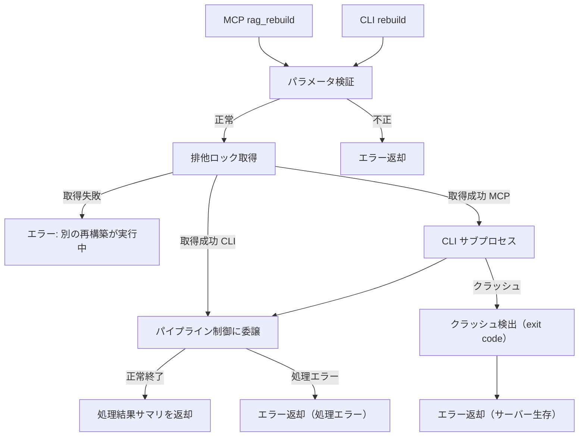

# 再構築・統計・バックアップ

## 概要

3段パイプラインの運用支援機能を MCP ツールおよび CLI として提供する。

- **再構築**: パイプライン制御の4モードを MCP/CLI で公開し、データ破損時やパラメータ変更時の復旧・再生成手段を提供する
- **統計**: source_store・converted_store・インデックス・metadata.db の状態を統合的に可視化する（既存 `rag_stats` の拡張）
- **バックアップ**: source_store のバックアップ・リストア手順を定義する

スコープ:

- 再構築の4モード（全再構築 / コンバートのみ再実行 / インデックスのみ再構築 / 差分更新）の MCP/CLI インターフェース
- `source_type` フィルタによる対象媒体の絞り込み
- `rag_stats` の出力拡張（source_store / converted_store / metadata.db 統計の追加）
- バックアップ・リストア手順の定義

スコープ外:

- パイプラインの内部処理ロジック（パイプライン制御の範疇）
- 各ステージの変換・インデックス構築ロジック（コンバーター・インデクサーの範疇）
- source_store のディレクトリ構成・.meta 形式（source_store 仕様の範疇）

## 背景

- 新アーキテクチャでは converted_store とインデックスは source_store から再生成可能な派生データとなる。データ破損やパラメータ変更時に再構築する手段を MCP/CLI で提供する必要がある
- 運用監視のために、source_store・converted_store・パイプライン実行状態を含めた統計情報を統合的に把握したい
- source_store は全データの根源（SSoT）であり、バックアップ方針を明確に定義する必要がある

## 制約

- **パイプライン制御への委譲**: 再構築の実行ロジックはパイプライン制御に委譲する。本コンポーネントは MCP/CLI インターフェースの提供とパラメータの検証のみを担当する
- **再構築中の排他制御**: 再構築処理は同時に1つのみ実行可能とする。実行中に別の再構築要求を受けた場合はエラーを返す
- **全再構築のコスト認知**: 全再構築およびインデックスのみ再構築は Embedding API を呼び出すため、データ量に比例したコストが発生する。MCP ツール・CLI の説明文にこの旨を明記し、利用者が意図せず大量の API 呼び出しを行わないようにする
- **MCP サーバーのクラッシュ耐性**: MCP 経由のパイプライン処理（再構築・取り込み後のインデックス構築・削除）は CLI を別プロセスとして実行する（MCP 薄層アダプターパターン）。C 拡張（BM25s 等）の SEGFAULT が発生しても MCP サーバープロセスは生存し、エラーメッセージをクライアントに返却する。CLI 直接実行は独立プロセスのため対策不要

本コンポーネント自体は外部 API 通信を行わないが、再構築実行時にパイプラインを通じて Embedding API 等の外部通信が発生する。外部 API の安全制約は各ステージの仕様に従うため、想定プロファイル・安全制約セクションは省略する。

## インターフェース

### MCP ツール

#### rag_rebuild

ナレッジベースの再構築を実行する。

| 項目 | 内容 |
|------|------|
| ツール名 | `rag_rebuild` |
| 説明 | パイプラインの再構築を指定モードで実行する |

パラメータ:

| パラメータ | 型 | 必須 | 内容 |
|-----------|-----|------|------|
| `mode` | str | はい | 再構築モード（下表参照） |
| `source_type` | str | いいえ | 対象媒体フィルタ（値は [`_schema/enums.yml`](../../_schema/enums.yml) の `source_type` を参照）。未指定時は全媒体 |

再構築モード:

| モード値 | 対応するパイプライン操作 | `source_type` フィルタ | 用途 |
|---------|----------------------|----------------------|------|
| `full` | 全再構築 | 適用可 | データ破損時や大規模な設計変更時。未コミット変更があればエラー |
| `convert` | コンバートのみ再実行 | 適用可 | コンバーターの変換ロジック改修時。未コミット変更があればエラー |
| `index` | インデックスのみ再構築 | 適用可 | Embedding モデル変更時やチャンクパラメータ変更時。未コミット変更があればエラー |
| `incremental` | 差分更新 | 適用不可（git diff に従う） | 通常運用。未コミット変更は自動コミットされる |

- `source_type` フィルタが適用不可のモード（`incremental`）で `source_type` が指定された場合、エラーを返す
- 戻り値: 処理結果サマリ（処理件数、エラー件数、所要時間）をテキストで返す。`full` モードは Convert / Index の2フェーズ結果を表示する

#### rag_stats（拡張）

既存の `rag_stats` ツールを拡張し、source_store・converted_store・metadata.db の統計情報を追加する。

- パラメータの追加なし（既存インターフェースと後方互換）
- `SOURCE_STORE_DIR` / `CONVERTED_STORE_DIR` の検証はツール実行時に行う（サーバー起動時のバリデーション対象外）。未設定の場合は該当セクションを「未設定」と表示し、エラーにはしない

### CLI

#### rebuild コマンド

```
uv run python -m rag.cli rebuild --mode <MODE> [--source-type <TYPE>]
```

| オプション | 型 | 必須 | 内容 |
|-----------|-----|------|------|
| `--mode` | str | はい | 再構築モード: `full`、`convert`、`index`、`incremental` |
| `--source-type` | str | いいえ | 対象媒体フィルタ（値は [`_schema/enums.yml`](../../_schema/enums.yml) の `source_type` を参照） |
| `--if-needed` | flag | いいえ | 前回の index/full rebuild 以降に更新がなければスキップする。`--mode` が `index` または `full` の場合のみ有効 |
| `--concurrency` | int | いいえ | インデックス再構築の並列数。`.env` の `RAG_EMBEDDING_CONCURRENCY` を上書きする。`index` / `full` モードで有効。CLI 限定（MCP ツールでは `.env` の設定値が使用される） |

MCP ツール `rag_rebuild` と同じバリデーション・振る舞いを適用する。`--if-needed` の詳細は [infrastructure/scheduled-rebuild.md](infrastructure/scheduled-rebuild.md) を参照。

## コンポーネント構成

### 再構築フロー

1. MCP ツール または CLI からパラメータを受け取る
2. パラメータを検証する（不正な場合はエラー返却）
3. 排他ロックを取得する（取得失敗時は「別の再構築が実行中」エラー）
4. MCP 経由の場合は CLI サブプロセスとして実行する。CLI 直接実行の場合はそのままパイプライン制御に委譲する
5. 処理結果サマリを返却する（クラッシュ時はエラー返却、サーバーは生存）



MCP 経由の場合、パイプライン処理（再構築・取り込み後のインデックス構築・削除）は CLI を別プロセスとして実行する
（MCP 薄層アダプターパターン、詳細は [rag-knowledge.md](rag-knowledge.md) を参照）。
C 拡張の SEGFAULT が発生してもサーバープロセスは生存し、SEGFAULT 検出時は専用のエラーメッセージを返却する
（判定ロジックは後述「MCP 応答契約」参照）。CLI 直接実行は独立プロセスのためサブプロセス化は不要。

### CLI サブプロセス進捗通知

MCP ツール経由のパイプライン処理中、CLI サブプロセスの進捗をリアルタイムで MCP クライアントに通知する。

#### 通知方式

2 系統の通知を並行して送信する:

| 方式 | MCP メッセージ | 用途 | クライアント要件 |
|------|--------------|------|----------------|
| Logging notification | `notifications/message` | テキストベースの進捗メッセージ | なし（標準 MCP） |
| Progress notification | `notifications/progress` | 数値進捗（processed / total） | `progressToken` の送信が必要。未送信時は no-op |

FastMCP の `Context` オブジェクト経由で送信する。ツール関数に `ctx: Context` パラメータを追加する。

#### CLI stdout プロトコル

CLI は `--output json` 指定時に JSON Lines 形式で stdout に出力する。各行は `type` フィールドで識別する。

| `type` 値 | 出力タイミング | フィールド |
|-----------|-------------|-----------|
| `progress` | ファイル処理完了ごと | `processed`（int）、`total`（int）、`current`（str: 処理済みファイルパス） |
| `result` | 処理完了時（最終行） | コマンド固有のフィールド（`mode`, `total_files`, `processed`, `errors`, `warnings`, `elapsed` 等。`full` モードは `convert` / `index` オブジェクトに分割）。`errors` は [pipeline-controller.md](pipeline-controller.md) の `PipelineSummary.errors` スキーマに従う構造化 dict のリスト（`{path, size_bytes, message, phase}`）を出力する。ingest 系コマンドでは `IngestResult` の全観測性フィールド（`partial_failures` / `aborted` 等）も併せて含める（[ingesters/common.md](ingesters/common.md) の「JSON シリアライズ」参照） |
| `error` | エラー時（最終行） | `error`（bool, 常に `true`）、`message`（str） |

MCP サーバー（server.py）は stdout を行単位で読み取り、`progress` 行を MCP 通知に変換し、`result` / `error` 行で処理結果を確定する。

#### CLI exit code 体系（2 値）

CLI の exit code は「CLI プロセスが最終 JSON 行（`type: "result"` または `type: "error"`）を出力して正常終了したか」を示す 2 値であり、workload の結果（`errors` / `aborted`）は JSON 出力の構造化フィールドで表現する。

| exit code | 意味 | 発生条件 |
|-----------|------|---------|
| `0` | CLI プロセスが最終 JSON 行を出力して正常終了した | workload の errors 有無は問わない（`errors>0` でも `0`、`aborted=true` でも `0`） |
| `1` | CLI プロセスが致命的に失敗した | パラメータ・設定不備による進行不能、プログラミングエラー、未捕捉例外。`type: "error"` JSON 行を出力するか、または出力前にクラッシュする |

**設計意図 (Why)**: MCP 経路は CLI の stdout を構造化 JSON として解釈する。workload の errors を exit code に反映すると「非ゼロ exit → 例外化」のガード経路と衝突し、構造化サマリが MCP クライアントに届かなくなる。CLI 側は「完走したか」のみを exit code で表現し、workload の結果は JSON 経路に単一責任を持たせる。

**argparse バリデーション失敗の扱い**:
Python 標準の argparse はバリデーション失敗時に exit code 2 を返す（POSIX usage-error 慣習）。
本プロジェクトでは 2 値契約との一貫性を優先し、`_JsonAwareArgumentParser`（`src/rag/cli.py`）で exit code を 1 に統一する。
`--output json` 指定時は `_output_error` 経由で構造化エラー行を出力する。

**SEGFAULT の扱い**: C 拡張のクラッシュにより `_SEGFAULT_EXIT_CODES`（`src/rag/server.py` で定義）に含まれる exit code が返る場合、2 値契約の範囲外として MCP 応答契約で個別検出する（後述の優先度 1 参照）。

**スケジューラ運用**: 致命的失敗の検知は exit code（`cmd && ...`）、workload の errors/aborted の判定は JSON parse（`jq '.errors | length > 0'` / `jq '.aborted'`）で行う。

#### MCP 応答契約（stdout 判定ロジック）

`src/rag/server.py::_run_cli_subprocess` は CLI の stdout を以下の優先順位で判定する。SEGFAULT 検出を除き、exit code は判定に使わず debug ログ出力および「出力なし」エラーメッセージでの参照のみに用いる。

| 優先 | 検出対象 | 動作 |
|------|----------|------|
| 1 | `exit_code in _SEGFAULT_EXIT_CODES` | `CLISubprocessError("SEGFAULT, exit_code={code}")` を raise |
| 2 | stdout に `type: "error"` 行 | `message` を取り出して `CLISubprocessError(message)` を raise（ロック競合判定は `_is_lock_conflict_error` が message 内のキーワード有無で実施。詳細は `src/rag/server.py`） |
| 3 | stdout に `type: "result"` 行 | JSON をパースして dict を返す（`errors>0` でも `aborted=true` でも返却） |
| 4 | 出力なし | `CLISubprocessError("出力が空 (exit_code={code})")` を raise（stderr tail を付加） |

**設計意図 (Why)**: `errors>0` を含む result 行は MCP クライアントが期待する構造化サマリであり、exit code の値で破棄してはならない。error 行が明示的に出ている場合のみ失敗として扱う。

#### サーバー側の処理

`_run_cli_subprocess` で CLI コマンドを実行し、stdout を行単位でストリーミングする:

1. `asyncio.create_subprocess_exec` で CLI サブプロセスを起動
2. stdout を行単位で非同期に読み取る（`readline()` ループ）
3. 各行を JSON パースし:
   - `type: "progress"` → `ctx.report_progress(processed, total, message=current)` で進捗通知
   - `type: "result"` → 最終結果候補として保持
   - `type: "error"` → エラー候補として保持
4. stderr はプロセス終了後に読み取る（ログ転送のみ）
5. 上記「MCP 応答契約」の優先順位に従って判定する

#### PipelineController の変更

処理ループを持つメソッドに `progress_callback` パラメータを追加する:

| メソッド | 対象ループ |
|---------|-----------|
| `run_full_rebuild` | Phase 1: 全レコードのコンバート、Phase 2: convert 成功分のインデックス |
| `run_convert_only` | 全レコードのコンバート |
| `run_index_only` | 全レコードのインデックス |
| `_process_changes` | 差分変更エントリの処理 |

callback シグネチャ: `(processed: int, total: int, current: str) -> None`

`ingest_and_index` および `run_incremental` も `progress_callback` パラメータを受け取り、内部的に `_process_changes` に中継する。

CLI は `--output json` 指定時にこの callback 内で進捗 JSON を stdout に出力する。callback 未指定時は従来通り無出力。

| ファイル | 役割 |
|-------------|------|
| `src/rag/cli.py` | CLI コマンド。`--output json` 指定時に JSON Lines 形式で進捗・結果を出力。MCP 薄層アダプターからサブプロセスとして呼び出される際のエントリポイント |
| `src/rag/server.py` | MCP ツール（薄層アダプター）。パラメータ検証を行い CLI をサブプロセスで起動。stdout を行単位でストリーミングし、進捗を MCP 通知として転送 |

### rag_stats 出力項目

`rag_stats` は以下の4セクションで統計情報を出力する。

#### source_store 統計

| 項目 | 内容 |
|------|------|
| 総ファイル数 | source_store 内の独立ソース数（[source-store.md](source-store.md) の `is_source_file` で `True` と判定されたファイルのみをカウント。`.meta` サイドカー・ロックファイル・OS 生成ファイル・複合ソースの attachment は除外される） |
| 総サイズ | 全独立ソースの合計サイズ |
| 媒体別ファイル数 | `source_type` ごとの独立ソース数 |
| 媒体別サイズ | `source_type` ごとの合計サイズ |

##### 件数の妥当性要件

`rag_stats` が表示する件数は他のパイプライン経路（全再構築・差分更新等）と同じ除外判定を適用しなければならない。`rag_stats` の列挙経路（`run_stats`）は [pipeline-controller.md](pipeline-controller.md) の「ソース列挙経路」5 経路のうちの 1 つであり、他の経路と共通の `is_source_file` を使用する。

以下は `source_type` フィルタを同条件で適用した場合に成立する件数一致である:

- フィルタなしの `rag_stats` と `rag_rebuild --mode full`（`source_type` 指定なし）が対象とする総ファイル数は一致する
- `source_type={T}` を指定した `rag_stats` の媒体別件数と、`rag_rebuild --mode full --source-type {T}` が対象とするファイル数は一致する
- `rag_stats` が表示する媒体別件数は各 `source_type` ディレクトリ配下の独立ソース数と一致する（attachment・sidecar は含まない）
- ロックファイル（`.ingest.lock`・`.rebuild.lock`）・`aozora/catalog.csv`・複合ソースの attachment は `rag_stats` に現れない

5 経路の詳細・除外判定の SSoT は [pipeline-controller.md](pipeline-controller.md) の「ソース列挙経路」および [source-store.md](source-store.md) の「ソース判定」を参照。

#### converted_store 統計

| 項目 | 内容 |
|------|------|
| 総ファイル数 | converted_store 内のファイル数 |
| 総サイズ | 全ファイルの合計サイズ |

#### インデックス統計（既存データ項目を維持）

| 項目 | 内容 |
|------|------|
| 総チャンク数 | ChromaDB コレクション内のチャンク数 |
| ソース数 | ユニークなソース数（source_id の種類数） |
| ドメイン別ソース一覧 | ドメインごとのページ数・チャンク数（表示上限: `rag_stats_max_sources` 設定値） |

既存の `rag_stats` が提供するデータ項目を維持する。出力テキストの形式は新セクション（source_store / converted_store / metadata.db）の追加に伴い統合フォーマットに変更する。

#### metadata.db 統計

| 項目 | 内容 |
|------|------|
| パイプライン最終処理日時 | `pipeline_history` の最新行の `processed_at` |
| パイプライン実行回数 | `pipeline_history` の総行数 |
| `last_commit_id` | `pipeline_history` の最新行の `to_commit_id` |
| 論理削除件数 | `status` が `deleted` のレコード数 |

#### 出力フォーマット

```
📊 RAG Knowledge 統計

■ source_store
  総ファイル数: 123
  総サイズ: 45.6 MB
  媒体別:
    web: 80 files (30.2 MB)
    bluesky: 25 files (5.1 MB)
    zenn: 10 files (8.0 MB)
    youtube: 5 files (1.2 MB)
    aozora: 3 files (0.8 MB)
    local: 8 files (2.3 MB)
    journal: 2 files (0.1 MB)

■ converted_store
  総ファイル数: 120
  総サイズ: 12.3 MB

■ インデックス
  総チャンク数: 1,234
  ソース数: 120
  ドメイン別:
    example.com: 5 pages (150 chunks)
    ...
  (以下省略、50件まで表示)

■ パイプライン
  最終処理: 2026-03-19T10:30:00+09:00
  実行回数: 42
  last_commit_id: abc1234
  論理削除: 3 件
```

- source_store / converted_store が未設定の場合、該当セクションは「未設定」と表示する
- metadata.db が未初期化の場合、パイプラインセクションは「未初期化」と表示する
- サイズ表示は人間が読みやすい単位（B / KB / MB / GB）に自動変換する

### バックアップ

#### バックアップ対象

| 対象 | バックアップ | 理由 |
|------|------------|------|
| source_store ディレクトリ | 必須 | 全データの根源（SSoT） |
| metadata.db | 必須（source_store 内に含まれる） | メタデータ索引。再構築可能だが、`pipeline_history` の保持のためにバックアップに含める |
| converted_store | 不要 | source_store から再生成可能 |
| ChromaDB | 不要 | converted_store から再構築可能 |
| BM25 インデックス | 不要 | converted_store から再構築可能 |

#### バックアップ手順

前提条件: パイプライン処理が実行中でないこと。バックアップ中に metadata.db への書き込みが発生すると整合性が崩れる可能性がある。

1. metadata.db の WAL をフラッシュする

   ```
   PRAGMA wal_checkpoint(TRUNCATE)
   ```

2. source_store ディレクトリを丸ごとコピーまたは圧縮保存する

WAL フラッシュを行わないと、WAL ファイルと DB ファイルの不整合によりバックアップが破損する可能性がある。

#### リストア手順

1. source_store ディレクトリをリストア先に配置する
2. パイプライン制御の「全再構築」を実行して converted_store とインデックスを再生成する

   ```
   uv run python -m rag.cli rebuild --mode full
   ```

metadata.db が破損・消失している場合は、パイプライン制御の DB 再構築機能が source_store のファイルと `.meta` から metadata.db を再構築する（[source-store.md](source-store.md) のエッジケース参照）。

### 設定項目

#### `.env`（環境依存値）

| 設定項目 | 層 | 設計意図 |
|---------|-----|---------|
| `RAG_EMBEDDING_CONCURRENCY` | 環境依存値 | インデックス再構築時のソース並列数。Embedding プロバイダーの処理能力に応じて環境ごとに調整する |

source_store のパスは [source-store.md](source-store.md) の設定項目、converted_store のパスは [pipeline-controller.md](pipeline-controller.md) の設定項目を使用する。

## エッジケース

| ケース | 振る舞い |
|--------|---------|
| `SOURCE_STORE_DIR` が未設定の場合 | `rag_stats` は source_store セクションを「未設定」と表示する。`rag_rebuild` はエラーを返す |
| `CONVERTED_STORE_DIR` が未設定の場合 | `rag_stats` は converted_store セクションを「未設定」と表示する。`rag_rebuild` はエラーを返す |
| source_store ディレクトリが存在しない場合 | `rag_stats` は source_store の各項目を 0 で表示する。`rag_rebuild` はエラーを返す |
| 再構築中に別の再構築が要求された場合 | 後発の要求にエラーを返す（排他制御） |
| `incremental` モードで `source_type` が指定された場合 | パラメータ検証エラーを返す |
| metadata.db が存在しない場合の `rag_stats` | パイプラインセクションを「未初期化」と表示する。source_store のファイルシステムベースの統計は表示する |
| `full` モードで `source_type` が指定された場合 | metadata.db の再構築は指定 type のレコードのみ削除・再登録する。他の type のレコードは保持される。converted_store・インデックスも指定 type のみクリア・再構築する |
| 再構築中にエラーが発生した場合 | パイプライン制御のエラーハンドリングに従う（エラーファイルをスキップし残りを処理続行。`pipeline_history` に履歴を追加しない） |

## 関連ドキュメント

- [pipeline-controller.md](pipeline-controller.md) — パイプライン制御仕様（再構築の実行ロジック）
- [source-store.md](source-store.md) — source_store 仕様（データ構成・metadata.db スキーマ）
- [rag-knowledge.md](rag-knowledge.md) — RAG ナレッジ仕様（既存の `rag_stats`・設定管理）
