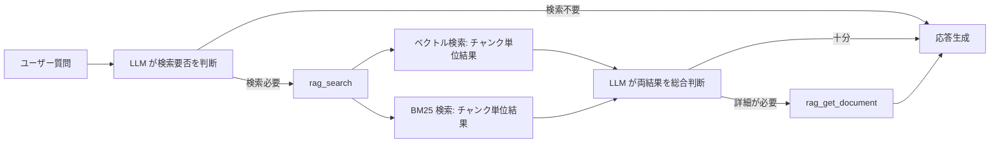
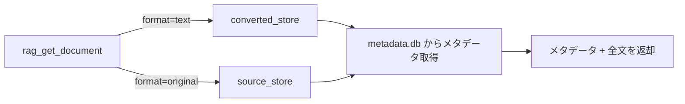

# 検索レスポンス + 全文取得

## 概要

rag_search のレスポンスをチャンク単位の返却に変更し、全文取得を独立したツールとして提供する。

スコープ:

- rag_search のレスポンス形式変更（ページ全文返却 → チャンク単位返却）
- 全文取得ツール（rag_get_document）の新設（MCP ツール + CLI サブコマンド）
- 既存レスポンスからの移行方針

スコープ外:

- 検索アルゴリズムの変更（ベクトル検索・BM25 のロジックは既存仕様を踏襲）
- インデクサーのチャンク格納方式の変更（インデクサー仕様の範疇）
- source_store / converted_store の構成変更

## 背景

- 大規模ドキュメント（PDF 等、数百チャンク規模）がヒットすると、ページ全文返却によりレスポンスが 100,000 文字超になり、MCP クライアントのトークン制限に抵触する
- 3段パイプラインにより source_store にオリジナルデータ、converted_store に変換済みテキストが常に保持されるため、チャンク単位返却 + 必要時の全文取得という責務分離が可能になった
- LLM がクエリに対して必要な箇所のみを受け取り、必要に応じて全文を取得する 2 段階アクセスにより、トークン効率が向上する

## 制約

- **破壊的変更**: rag_search のレスポンス形式変更は MCP クライアント側の対応が必要な破壊的変更
- **検索ロジック非変更**: ベクトル検索・BM25 の検索ロジック、スコア計算、類似度閾値の振る舞いは変更しない
- **準 Agentic Search の維持**: ベクトル検索と BM25 検索の生結果を個別に返す設計を維持する
- **レスポンス形式**: MCP ツールのレスポンスはプレーンテキスト形式を維持する（JSON 等の構造化形式には変更しない）
- **全文取得の論理削除対応**: `status` が `deleted` のソースも全文取得可能とする（[source-store.md](source-store.md) の「ファイル取得」インターフェースの設計意図を踏襲）
- **MCP + CLI 両提供**: rag_get_document は MCP ツールと CLI サブコマンドの両方で提供する。内部ロジックは共通関数とする

本コンポーネントは外部 API 通信を行わないため、想定プロファイル・安全制約セクションは省略する。

## 操作一覧

| 操作 | 種別 | 提供方式 | 概要 |
|------|------|---------|------|
| rag_search | 変更 | MCP ツール | レスポンスをチャンク単位返却に変更する |
| rag_get_document | 新規 | MCP ツール + CLI | source_id 指定でドキュメント全文を取得する |

## 各操作の仕様

### rag_search（変更）

#### トリガー

MCP クライアントからの rag_search ツール呼び出し。入力パラメータは既存仕様から変更なし。

| パラメータ | 型 | 必須 | 内容 |
|-----------|-----|------|------|
| `query` | str | Yes | 検索キーワード |
| `n_results` | int | No | エンジンあたりの結果件数 |
| `source_type` | str | No | ソース種別フィルタ |

#### 振る舞い

検索ロジック（ベクトル検索・BM25 検索の実行、類似度閾値によるフィルタリング）は変更しない。レスポンス構築のみ以下のように変更する:

1. 各検索エンジンの生結果をチャンク単位で返却する
2. 各結果にはチャンクテキストとメタデータ（ソース識別子、タイトル、チャンク位置、ソース種別）を含める
3. ページ全文の取得・結合は行わない

#### 出力

レスポンスはプレーンテキスト形式。

**セクション構成:**

| セクション | 出力条件 |
|-----------|---------|
| ベクトル検索結果 | ベクトル検索の結果が 1 件以上ある場合 |
| BM25 検索結果 | BM25 検索の結果が 1 件以上ある場合 |

両セクションとも結果が 0 件の場合は、結果なしメッセージ（`該当する情報が見つかりませんでした`）を返す。

**各結果のメタデータ:**

| 項目 | 内容 | 例 |
|------|------|-----|
| スコア | ベクトル検索: `distance`、BM25: `score` | `[distance=0.234]`、`[score=4.521]` |
| Source | ソース識別子 | `Source: https://example.com/docs/guide` |
| Title | コンテンツのタイトル | `Title: ガイドページ` |
| Chunk | チャンク位置（現在位置/全体数、1 始まり表示） | `Chunk: 3/15` |
| Type | ソース種別 | `Type: web` |

メタデータの後に空行を挟み、チャンクテキストを出力する。

レスポンスの Source 値は、既存のチャンクメタデータフィールド `source_url` の値に対応する。この値をそのまま rag_get_document の `source_id` パラメータとして使用できる。

**レスポンス形式例（ベクトル検索結果 2 件 + BM25 検索結果 1 件）:**

```
## ベクトル検索結果 (意味的類似度)

### Result 1 [distance=0.234]
Source: https://example.com/docs/guide
Title: ガイドページ
Chunk: 3/15
Type: web

チャンクテキストがここに入る...

### Result 2 [distance=0.456]
Source: at://did:plc:abc123/app.bsky.feed.post/xyz789
Title: Sample post
Chunk: 1/1
Type: bluesky

チャンクテキストがここに入る...

## BM25検索結果 (キーワード一致)

### Result 1 [score=4.521]
Source: https://zenn.dev/alice/articles/sample
Title: サンプル記事
Chunk: 5/20
Type: zenn

チャンクテキストがここに入る...
```

**チャンク位置情報の取得:**

各チャンクの `chunk_index`（0 始まり、既存チャンクメタデータフィールド）と、そのソースの全チャンク数 `total_chunks`（新規チャンクメタデータフィールド。インデクサーがチャンク格納時に ChromaDB の各チャンクメタデータへ記録する）から算出する。表示上は 1 始まりとする（`chunk_index + 1` / `total_chunks`）。

#### 廃止する機能

| 廃止機能 | 理由 |
|---------|------|
| ページ全文の結合・返却 | チャンク単位返却に置き換え。全文が必要な場合は rag_get_document を使用する |
| 同一 URL の重複省略表示 | チャンク単位のため不要。同一ソースの異なるチャンクは個別に表示する |
| `rag_max_response_chars` によるトランケーション | チャンク単位返却により自然にレスポンスがコンパクトになるため不要。設定項目を廃止する |

### rag_get_document（新規）

#### トリガー

MCP クライアントからの rag_get_document ツール呼び出し、または CLI サブコマンド `get-document` の実行。

| パラメータ | 型 | 必須 | 内容 | デフォルト |
|-----------|-----|------|------|-----------|
| `source_id` | str | Yes | ソース識別子 | — |
| `format` | str | No | 取得形式: `"text"`（変換済みテキスト）または `"original"`（オリジナル） | `"text"` |

#### 振る舞い

`source_id` に対応するドキュメントの全文を取得する。

- `format` が `"text"` の場合: converted_store からテキスト変換済みファイルを読み取る
- `format` が `"original"` の場合: source_store からオリジナルファイルを読み取る

メタデータは metadata.db から取得する。[source-store.md](source-store.md) の「ファイル取得」インターフェースを使用する。

#### 出力

レスポンスはプレーンテキスト形式。

**メタデータヘッダー:**

| 項目 | 内容 |
|------|------|
| Source | ソース識別子 |
| Title | コンテンツのタイトル |
| Type | ソース種別 |
| Format | 取得形式（`text` または `original`） |

メタデータヘッダーの後に空行を挟み、ドキュメント全文を出力する。

**レスポンス形式例:**

```
Source: https://example.com/docs/guide
Title: ガイドページ
Type: web
Format: text

ドキュメントの全文テキストがここに入る...
```

#### CLI サブコマンド

```
uv run python -m rag.cli get-document <source_id> [--format text|original] [--output <file_path>]
```

- `--output` 指定時はファイルに出力する。未指定時は標準出力に出力する
- `--format` のデフォルトは `text`

## エッジケース

| ケース | 振る舞い |
|--------|---------|
| rag_get_document で存在しない source_id を指定 | エラーメッセージを返す |
| rag_get_document で論理削除済みのソースを指定 | ドキュメントを返す（論理削除済みでも全文取得可能） |
| rag_get_document で converted_store にファイルが存在しない場合（format=text） | エラーメッセージを返す。source_store にオリジナルが存在する旨を通知し、`format=original` での取得を提案する |
| rag_search で `total_chunks` が未設定または 0 のチャンク（レガシーデータ等） | Chunk 位置を `?/?` と表示する |
| rag_get_document で format=original 指定時にバイナリファイル（PDF 等）の場合 | ファイルの MIME タイプとファイルサイズを返し、テキスト形式での取得（format=text）を提案する。バイナリデータ自体は返さない |

## コンポーネント構成

### 検索フロー（変更後）



### 全文取得フロー



### 既存コンポーネントへの影響

| コンポーネント | 影響 |
|-------------|------|
| MCP ツール定義 | rag_search のレスポンス構築ロジック変更、rag_get_document の追加 |
| ナレッジサービス | ページ全文結合の廃止、converted_store / source_store からのファイル読み取りによる全文取得の新規実装 |
| インデクサー | チャンクメタデータに `total_chunks`（新規フィールド）を追加 |
| CLI | `get-document` サブコマンドの追加 |

### 移行方針

rag_search のレスポンス形式変更は破壊的変更だが、以下の理由から直接切り替え（一斉移行）とする:

- MCP クライアントは LLM であり、ツール description の変更で自然に新形式に適応する
- 段階的な移行メカニズム（バージョニング等）のオーバーヘッドが利点を上回る
- 旧形式でのページ全文返却は、rag_get_document で代替可能

**移行時の変更点:**

| 項目 | 旧（現行） | 新 |
|------|---------|-----|
| rag_search レスポンス | ページ全文 | チャンクテキスト |
| 全文取得 | rag_search 内で自動取得 | rag_get_document で明示的に取得 |
| レスポンスサイズ制御 | `rag_max_response_chars` でトランケーション | チャンク単位返却で自然にコンパクト |
| 同一ソースの重複 | 全文を省略表示 | チャンク単位のため不要 |

**廃止する設定項目:**

| 設定項目 | 理由 |
|---------|------|
| `rag_max_response_chars` | チャンク単位返却により不要 |

## 関連ドキュメント

- [rag-knowledge.md](rag-knowledge.md) — RAG ナレッジ仕様（rag_search の現行仕様、MCP ツール一覧）。本仕様の実装時に MCP ツール一覧（ツール数・rag_search の説明）と `config.toml` 設定項目（`rag_max_response_chars` の削除）の更新が必要
- [source-store.md](source-store.md) — source_store 仕様（ファイル取得インターフェース）
- [pipeline-controller.md](pipeline-controller.md) — パイプライン制御仕様（converted_store）
