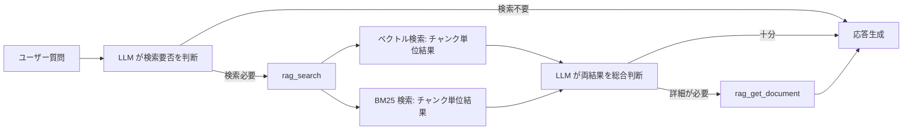
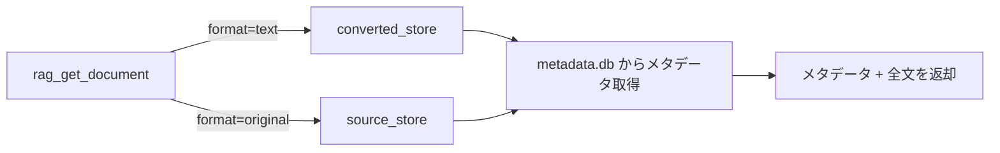

# 検索レスポンス + 全文取得

## 概要

rag_search のレスポンスをチャンク単位の返却に変更し、全文取得を独立したツールとして提供する。

スコープ:

- rag_search のレスポンス形式変更（ページ全文返却 → チャンク単位返却）
- 全文取得ツール（rag_get_document）の新設（MCP ツール + CLI サブコマンド）
- 既存レスポンスからの移行方針

スコープ外:

- 検索アルゴリズムの変更（ベクトル検索・BM25 のロジックは既存仕様を踏襲）
- インデクサーのチャンク格納方式の変更（インデクサー仕様の範疇）
- source_store / converted_store の構成変更

## 背景

- 大規模ドキュメント（PDF 等、数百チャンク規模）がヒットすると、ページ全文返却によりレスポンスが 100,000 文字超になり、MCP クライアントのトークン制限に抵触する
- 3段パイプラインにより source_store にオリジナルデータ、converted_store に変換済みテキストが常に保持されるため、チャンク単位返却 + 必要時の全文取得という責務分離が可能になった
- LLM がクエリに対して必要な箇所のみを受け取り、必要に応じて全文を取得する 2 段階アクセスにより、トークン効率が向上する

## 制約

- **破壊的変更**: rag_search のレスポンス形式変更は MCP クライアント側の対応が必要な破壊的変更
- **検索ロジック非変更**: ベクトル検索・BM25 の検索ロジック、スコア計算、類似度閾値の振る舞いは変更しない
- **準 Agentic Search の維持**: ベクトル検索と BM25 検索の生結果を個別に返す設計を維持する
- **レスポンス形式**: MCP ツールのレスポンスはプレーンテキスト形式を維持する（JSON 等の構造化形式には変更しない）
- **全文取得の論理削除対応**: `status` が `deleted` のソースも全文取得可能とする（[source-store.md](source-store.md) の「ファイル取得」インターフェースの設計意図を踏襲）
- **MCP + CLI 両提供**: rag_get_document は MCP ツールと CLI サブコマンドの両方で提供する。内部ロジックは共通関数とする
- **レスポンスサイズ制御**: rag_get_document は大規模ドキュメントに対して `rag_max_response_chars`（既存設定項目を継続利用）でトランケーションを行う。上限超過時は末尾にトランケート通知（CLI の `--output` オプションでの全文取得を案内）を付記し、CLI の `--output` オプションによるファイル出力ではトランケーションを適用しない（全文出力）

本コンポーネントは外部 API 通信を行わないため、想定プロファイル・安全制約セクションは省略する。

## 操作一覧

| 操作 | 種別 | 提供方式 | 概要 |
|------|------|---------|------|
| rag_search | 変更 | MCP ツール | レスポンスをチャンク単位返却に変更する |
| rag_get_document | 新規 | MCP ツール + CLI | source_id 指定でドキュメント全文を取得する |

## 各操作の仕様

### rag_search（変更）

#### トリガー

MCP クライアントからの rag_search ツール呼び出し。

| パラメータ | 型 | 必須 | 内容 |
|-----------|-----|------|------|
| `query` | str | Yes | 検索キーワード |
| `n_results` | int | No | エンジンあたりの結果件数（未指定時は `rag_retrieval_count` 設定値を使用、1 以上） |
| `source_type` | str | No | ソース種別フィルタ（値は [`_schema/enums.yml`](../../_schema/enums.yml) の `source_type` を参照） |
| `filters` | str | No | カスタムメタデータフィルタ（`key=value` 形式、複数指定時はカンマ区切り）。`.meta` の extra フィールドで検索結果を絞り込む。完全一致。例: `repository=rag-knowledge` / `repository=rag-knowledge,tag=dev` |

#### フィルタの動作

`filters` は `.meta` サイドカーのカスタムフィールドによる絞り込みを行う。内部的にはキーに `custom:` プレフィックスを付与し、ChromaDB の `where` 句と BM25 のポストフィルタに適用する。

- `source_type` と `filters` は併用可能。両方指定時は AND 条件として結合する
- `filters` のキーにはユーザーが `custom:` プレフィックスを付ける必要はない（内部で自動付与）
- `filters` のパース形式: `key=value` をカンマ区切り。値は全て文字列として扱う
- `filters` が不正な形式（`=` を含まないペアがある等）の場合はエラーメッセージを返す
- `filters` 未指定時はフィルタなし（全件対象）
- フィルタ比較: BM25 側はメタデータ値を文字列変換・大文字化して比較する（大文字小文字を区別しない。int/bool 等の非文字列カスタムフィールドにもマッチする）。ChromaDB 側は `where` 句による完全一致（型・大文字小文字を区別する）

#### 振る舞い

検索ロジック（ベクトル検索・BM25 検索の実行、類似度閾値によるフィルタリング）は変更しない。レスポンス構築のみ以下のように変更する:

1. 各検索エンジンの生結果をチャンク単位で返却する
2. 各結果にはチャンクテキストとメタデータ（ソース識別子、タイトル、チャンク位置、ソース種別）を含める
3. ページ全文の取得・結合は行わない

#### 出力

レスポンスはプレーンテキスト形式。

**セクション構成:**

| セクション | 出力条件 |
|-----------|---------|
| ベクトル検索結果 | ベクトル検索の結果が 1 件以上ある場合 |
| BM25 検索結果 | BM25 検索の結果が 1 件以上ある場合 |

両セクションとも結果が 0 件の場合は、結果なしメッセージ（`該当する情報が見つかりませんでした`）を返す。

**各結果のメタデータ:**

| 項目 | 内容 | 出力条件 | 例 |
|------|------|---------|-----|
| スコア | ベクトル検索: `distance`、BM25: `score` | 常時 | `[distance=0.234]`、`[score=4.521]` |
| Source | ソース識別子（source_store 内の相対パス） | 常時 | `Source: web/https/example.com/docs/guide.html` |
| URL | 元 URL（`.meta` の `url` フィールド。存在する場合のみ） | 値がある場合のみ | `URL: https://example.com/docs/guide` |
| Title | コンテンツのタイトル | 常時 | `Title: ガイドページ` |
| Chunk | チャンク位置（現在位置/全体数、1 始まり表示） | 常時 | `Chunk: 3/15` |
| Type | ソース種別 | 常時 | `Type: web` |
| Section | 見出し階層（`section_path`） | 値がある場合のみ | `Section: 第1章 > 1.1 前処理` |
| Collected | 取り込み日時 | 値がある場合のみ | `Collected: 2025-01-15T10:30:00Z` |

メタデータの後に `<<content>>` / `<</content>>` タグでチャンクテキストを囲む。タグによりメタデータと本文の境界を明確にし、本文中に Markdown 見出し（`###` 等）が含まれる場合でも Result ヘッダーとの混同を防ぐ。

レスポンスの Source 値は、[source-store.md](source-store.md) で定義された `source_id`（= source_store 内の相対パス）を使用する。この値をそのまま rag_get_document の `source_id` パラメータとして使用できる。元 URL がある場合は URL 行に表示される。

**レスポンス形式例（ベクトル検索結果 2 件 + BM25 検索結果 1 件）:**

```
## ベクトル検索結果 (意味的類似度)

### Result 1 [distance=0.234]
Source: web/https/example.com/docs/guide.html
URL: https://example.com/docs/guide
Title: ガイドページ
Chunk: 3/15
Type: web
Section: 第1章 導入 > 1.1 セットアップ
Collected: 2025-01-15T10:30:00Z
<<content>>
チャンクテキストがここに入る...
<</content>>

### Result 2 [distance=0.456]
Source: bluesky/did：plc：abc123/2026/01/xyz789.json
URL: https://bsky.app/profile/alice.bsky.social/post/xyz789
Title: Sample post
Chunk: 1/1
Type: bluesky
Collected: 2025-01-20T14:00:00Z
<<content>>
チャンクテキストがここに入る...
<</content>>

## BM25 検索結果 (キーワード一致)

### Result 1 [score=4.521]
Source: zenn/alice/articles/sample.json
URL: https://zenn.dev/alice/articles/sample
Title: サンプル記事
Chunk: 5/20
Type: zenn
Collected: 2025-01-18T08:00:00Z
<<content>>
チャンクテキストがここに入る...
<</content>>
```

**チャンク位置情報の取得:**

各チャンクの `chunk_index`（0 始まり、既存チャンクメタデータフィールド）と、そのソースの全チャンク数 `total_chunks`（新規チャンクメタデータフィールド。インデクサーがチャンク格納時に ChromaDB の各チャンクメタデータへ記録する）から算出する。表示上は 1 始まりとする（`chunk_index + 1` / `total_chunks`）。

#### 廃止する機能

| 廃止機能 | 理由 |
|---------|------|
| ページ全文の結合・返却 | チャンク単位返却に置き換え。全文が必要な場合は rag_get_document を使用する |
| 同一 URL の重複省略表示 | チャンク単位のため不要。同一ソースの異なるチャンクは個別に表示する |
| rag_search での `rag_max_response_chars` トランケーション | チャンク単位返却により rag_search では不要。設定項目は rag_get_document のレスポンスサイズ制御に転用する |

### rag_get_document（新規）

#### トリガー

MCP クライアントからの rag_get_document ツール呼び出し、または CLI サブコマンド `get-document` の実行。

| パラメータ | 型 | 必須 | 内容 | デフォルト |
|-----------|-----|------|------|-----------|
| `source_id` | str | Yes | ソース識別子 | — |
| `format` | str | No | 取得形式: `"text"`（変換済みテキスト）または `"original"`（オリジナル） | `"text"` |

#### 振る舞い

`source_id` に対応するドキュメントの全文を取得する。

- `format` が `"text"` の場合: converted_store からテキスト変換済みファイルを読み取る
- `format` が `"original"` の場合: source_store からオリジナルファイルを読み取る

メタデータは metadata.db から取得する。[source-store.md](source-store.md) の「ファイル取得」インターフェースを使用する。

#### 出力

レスポンスはプレーンテキスト形式。

**メタデータヘッダー:**

| 項目 | 内容 | 出力条件 |
|------|------|---------|
| Source | ソース識別子 | 常時 |
| Title | コンテンツのタイトル | 常時 |
| Type | ソース種別 | 常時 |
| Format | 取得形式（`text` または `original`） | 常時 |
| Collected | 取り込み日時 | 値がある場合のみ |
| (custom フィールド) | ソース種別固有のメタデータ（`.meta` ファイルの extra フィールド） | 値がある場合のみ |

メタデータヘッダーの後に空行を挟み、ドキュメント全文を出力する。

**レスポンス形式例:**

```
Source: web/https/example.com/docs/guide.html
Title: ガイドページ
Type: web
Format: text
Collected: 2025-01-15T10:30:00Z

ドキュメントの全文テキストがここに入る...
```

#### CLI サブコマンド

```
uv run python -m rag.cli get-document <source_id> [--format text|original] [--output-file <file_path>]
```

- `source_id` は位置引数（`--` プレフィックスなし）
- `--output-file` 指定時はファイルに出力する。未指定時は標準出力に出力する
- `--format` のデフォルトは `text`

## エッジケース

| ケース | 振る舞い |
|--------|---------|
| rag_get_document で存在しない source_id を指定 | エラーメッセージを返す |
| rag_get_document で論理削除済みのソースを指定 | ドキュメントを返す（論理削除済みでも全文取得可能） |
| rag_get_document で converted_store にファイルが存在しない場合（format=text） | エラーメッセージを返す。source_store にオリジナルが存在する旨を通知し、`format=original` での取得を提案する |
| rag_search で `total_chunks` が未設定または 0 のチャンク（レガシーデータ等） | Chunk 位置を `{chunk_index+1}/?` と表示する（現在位置は既知のため保持し、総数のみ不明とする） |
| rag_get_document で format=original 指定時にバイナリファイル（PDF 等）の場合 | ファイルの MIME タイプとファイルサイズを返し、テキスト形式での取得（format=text）を提案する。バイナリデータ自体は返さない |
| rag_get_document で大規模ドキュメントの場合（MCP 経由） | `rag_max_response_chars` でトランケーションし、末尾に「トランケートされました。CLI の `--output` オプションで全文取得できます」と付記する |
| rag_get_document で大規模ドキュメントの場合（CLI `--output` 指定） | トランケーションを適用せず全文をファイルに出力する |

## コンポーネント構成

### 検索フロー（変更後）



### 全文取得フロー



### 既存コンポーネントへの影響

| コンポーネント | 影響 |
|-------------|------|
| MCP ツール定義 | rag_search のレスポンス構築ロジック変更、rag_get_document の追加 |
| ナレッジサービス | ページ全文結合の廃止、converted_store / source_store からのファイル読み取りによる全文取得の新規実装 |
| インデクサー | チャンクメタデータに `total_chunks`（新規フィールド）を追加 |
| CLI | `get-document` サブコマンドの追加 |

### 移行方針

rag_search のレスポンス形式変更は破壊的変更だが、以下の理由から直接切り替え（一斉移行）とする:

- MCP クライアントは LLM であり、ツール description の変更で自然に新形式に適応する
- 段階的な移行メカニズム（バージョニング等）のオーバーヘッドが利点を上回る
- 旧形式でのページ全文返却は、rag_get_document で代替可能

**移行時の変更点:**

| 項目 | 旧（現行） | 新 |
|------|---------|-----|
| rag_search レスポンス | ページ全文 | チャンクテキスト |
| 全文取得 | rag_search 内で自動取得 | rag_get_document で明示的に取得 |
| レスポンスサイズ制御 | `rag_max_response_chars` で rag_search をトランケーション | rag_search は不要。rag_get_document に転用 |
| 同一ソースの重複 | 全文を省略表示 | チャンク単位のため不要 |

**用途変更する設定項目:**

| 設定項目 | 理由 |
|---------|------|
| `rag_max_response_chars` | rag_search では不要。rag_get_document のレスポンスサイズ制御に転用するため、設定項目自体は維持する |

## 関連ドキュメント

- [rag-knowledge.md](rag-knowledge.md) — RAG ナレッジ仕様（rag_search の現行仕様、MCP ツール一覧）。本仕様の実装時に MCP ツール一覧（ツール数・rag_search の説明）と `config.toml` 設定項目（`rag_max_response_chars` の用途変更）の更新が必要
- [source-store.md](source-store.md) — source_store 仕様（ファイル取得インターフェース）
- [pipeline-controller.md](pipeline-controller.md) — パイプライン制御仕様（converted_store）
