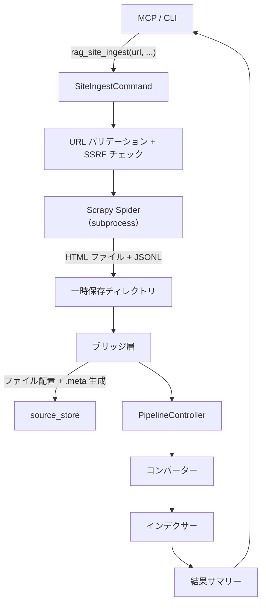
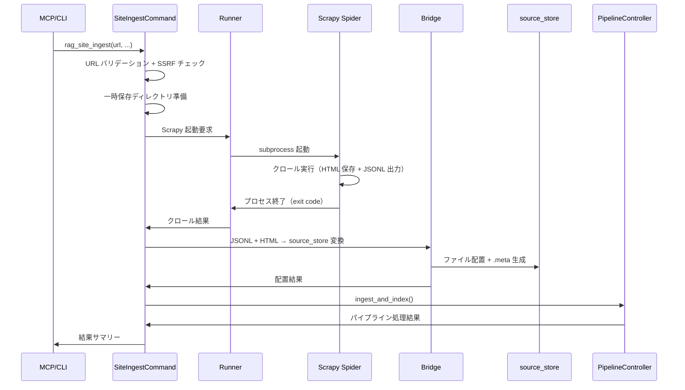

# サイト一括取り込み（Scrapy subprocess）

## 概要

Scrapy を subprocess 方式で起動し、数千ページ規模の大規模サイトを一括取り込みする機能。Scrapy の汎用 Spider でサイトをクロールし、取得した HTML ファイルとメタデータ JSONL をブリッジ層で source_store に変換した後、パイプライン制御で converter → indexer を実行する。

MCP ツール `rag_site_ingest` と CLI コマンド `site-ingest` の 2 つのインターフェースを提供する。

スコープ:

- Scrapy subprocess によるサイト一括クロール
- 汎用 Spider のパラメータ化（URL、ドメイン制約、URL パターン）
- JSONL メタデータ + HTML ファイルの一時保存
- ブリッジ層による一時保存データから source_store への変換・配置
- JOBDIR による中断再開
- 既存 `rag_crawl` の非推奨化

スコープ外:

- テキスト変換・チャンキング・インデックス構築（コンバーター・インデクサーの範疇）
- git 操作（パイプライン制御の範疇）
- 検索機能（rag_search 等）

## 背景

- 既存の `rag_crawl` は ConstrainedClient 経由の httpx ベースであり、ハードリミット 500 ページ・操作全体タイムアウト 600 秒の制約がある。数千ページ規模のサイト取り込みには適さない
- Scrapy をライブラリとして組み込む方式は、Twisted の `ReactorNotRestartable` 問題（reactor はプロセスごとに 1 回しか起動できない）により、MCP サーバー（長時間稼働 asyncio プロセス）での複数回クロールが不可能。subprocess 方式で根本回避する
- #308 の検証で、Scrapy subprocess 方式が Unity Manual 3,503 ページ / 16 分 / データ品質 12/12 完全一致の実績を確認済み

## 制約

### Scrapy の subprocess 実行

- Scrapy は `asyncio.create_subprocess_exec` で別プロセスとして起動する。MCP サーバーの asyncio イベントループと Twisted の reactor を分離する
- ConstrainedClient は使用しない。Scrapy が HTTP リクエストを直接管理する
- 現行の raw HTTP チェック（`check-raw-http` ワークフロー）は aiohttp/httpx/requests/urllib.request の直接利用のみを検出対象としており、Scrapy の利用は検出対象外のため、`# safety:allowed` コメントによる CI 例外指定は不要である

### ドメイン制約

- Scrapy の `allowed_domains` により、クロール対象を初回 URL と同一ドメインに制限する
- リンク辿りで発見された URL は同一ドメイン制約で自動的に制限される

### パスプレフィックス制約

- `url_pattern` が未指定の場合、開始 URL のパスプレフィックスから正規表現パターンを自動生成する
- 例: `https://example.com/docs/` → `^https://example\.com/docs/`
- パスが `/` のみの場合はパターンを生成しない（ドメイン全体が対象）
- ユーザーが `url_pattern` を明示的に指定した場合はその値を優先する

### Safe Browsing チェック

- 数千件規模の URL に対する Google Safe Browsing API 呼び出しは非現実的なためスキップする
- SSRF チェックは初回 URL（ユーザー入力）のみ実施する。Scrapy が後続で辿る URL（同一ドメイン内）については、per-request の IP 解決検証は行わない。DNS リバインディング等のリスクは `allowed_domains` によるドメイン制約で緩和する。per-request の SSRF チェック（Downloader Middleware）は将来対応とする

### robots.txt

- Scrapy の `ROBOTSTXT_OBEY = True` に委譲する

### ページ数上限

- `site_ingest_max_pages`（config.toml）でクロール対象ページ数を制限する（デフォルト: 10,000）
- Scrapy の `CLOSESPIDER_PAGECOUNT` 設定で制御する

### リクエスト間隔

- `site_ingest_delay_sec`（config.toml）でリクエスト間隔を制御する（デフォルト: 0.1 秒）
- Scrapy の `DOWNLOAD_DELAY` 設定で制御する

### 操作全体タイムアウト

- `site_ingest_timeout_sec`（config.toml）でクロール全体のタイムアウトを制御する（デフォルト: 7,200 秒 = 2 時間）
- Scrapy の `CLOSESPIDER_TIMEOUT` 設定で制御する
- タイムアウト後も JOBDIR が残存するため、再実行で続きから取得できる

### エラー停止閾値

- `site_ingest_error_count`（config.toml）でエラー数による停止閾値を制御する（デフォルト: 10）
- Scrapy の `CLOSESPIDER_ERRORCOUNT` 設定で制御する
- 閾値到達後も JOBDIR が残存するため、再実行で続きから取得できる

### Windows エンコーディング

- cp932 コンソールでの `UnicodeEncodeError` 対策として、subprocess 起動時に `PYTHONIOENCODING=utf-8` を環境変数に設定する

### バリデーション

- **バリデーションエラー（拒否）**: 空文字列の URL、無効なスキーム（http/https 以外）、ホスト名なし、SSRF チェック違反
- **クランプ（警告ログ付き）**: `max_pages` が許容範囲外の場合、範囲内にクランプする

## 想定プロファイル

| 項目 | 内容 |
|------|------|
| 最悪ケースリクエスト数 | `site_ingest_max_pages`（デフォルト 10,000）+ robots.txt 取得 1 件。Scrapy の重複フィルタにより実際のリクエスト数は対象サイトのユニーク URL 数に依存する |
| 最悪ケース所要時間 | 10,000 × 0.1 秒（最小間隔）= 1,000 秒（約 17 分）。`site_ingest_download_timeout`（デフォルト 30 秒）× リクエスト数分の接続待ち時間が加算される可能性あり。Scrapy プロセスの終了で操作が完了する |
| 想定エラー率 | サイト依存。Scrapy のリトライミドルウェア（デフォルト: 2 回リトライ）が対象ステータスコード（500, 502, 503, 504, 522, 524, 408, 429）に適用される |

## 安全制約

| 制約名 | 種別 | 値 | 解除可否 |
|--------|------|-----|---------|
| SSRF チェック | ハードリミット | 初回 URL に対して実施。プライベート IP・ローカルホストを拒否 | 無効化不可 |
| ドメイン制約 | ハードリミット | `allowed_domains` で初回 URL と同一ドメインに制限 | 無効化不可 |
| robots.txt 遵守 | ハードリミット | `ROBOTSTXT_OBEY = True`（固定） | 無効化不可 |
| ページ数上限 | 設定値 | 許容範囲 1〜50,000、デフォルト 10,000 | 範囲内で変更可 |
| リクエスト間隔 | 設定値 | 許容範囲 0.05〜60 秒、デフォルト 0.1 秒 | 範囲内で変更可 |
| ダウンロードタイムアウト | 設定値 | 許容範囲 1〜300 秒、デフォルト 30 秒 | 範囲内で変更可 |
| 操作全体タイムアウト | 設定値 | 許容範囲 60〜86,400 秒、デフォルト 7,200 | 範囲内で変更可 |
| エラー停止閾値 | 設定値 | 許容範囲 1〜1,000、デフォルト 10 | 範囲内で変更可 |

テスト実行時の安全な値: `max_pages: 3`, `delay_sec: 1.0`

## インターフェース

### MCP ツール

| ツール | 入力 | 振る舞い |
|--------|------|---------|
| `rag_site_ingest` | `url`（必須）、`url_pattern`（任意）、`max_pages`（任意）、`force`（任意） | Scrapy subprocess で対象サイトをクロールし、取得した HTML を source_store に配置後、パイプライン処理を実行する。結果サマリー（取得ページ数、エラー数、所要時間）を返す |

#### `rag_site_ingest` パラメータ

| パラメータ | 型 | デフォルト | 説明 |
|-----------|-----|-----------|------|
| `url` | str | — | クロール開始 URL（必須） |
| `url_pattern` | str | なし | クロール対象 URL のフィルタパターン（正規表現）。未指定時は開始 URL のパスプレフィックスから自動生成する（例: `https://example.com/docs/` → `^https://example\.com/docs/`）。パスが `/` のみの場合はパターンなし（ドメイン全体が対象）。明示的に指定した場合はその値を優先する |
| `max_pages` | int | `site_ingest_max_pages` | ページ数上限。config.toml の値を上書き可能 |
| `force` | bool | `false` | `true` の場合、ドメインディレクトリ全体（JOBDIR、HTML、JSONL）を削除して最初からクロールする |

### CLI コマンド

| コマンド | 振る舞い |
|---------|---------|
| `site-ingest` | MCP ツール `rag_site_ingest` と同等の機能を CLI で提供する |

#### `site-ingest` オプション

| オプション | 型 | デフォルト | 説明 |
|-----------|-----|-----------|------|
| `url`（位置引数） | str | — | クロール開始 URL |
| `--url-pattern` | str | なし | URL フィルタパターン |
| `--max-pages` | int | `site_ingest_max_pages` | ページ数上限 |
| `--force` | フラグ | `false` | ドメインディレクトリ全体を削除して再クロール |

### 取り込み結果の出力形式

既存の取り込みツール共通のサマリー形式（source_store 配置結果 + パイプライン処理結果）に加え、以下の情報を含む:

| フィールド | 内容 |
|-----------|------|
| クロール統計 | Scrapy が取得したページ数、エラー数 |
| 所要時間 | クロール開始から完了までの経過時間 |
| source_store 配置結果 | 配置ファイル数、スキップ数（重複等）、エラー数 |
| パイプライン処理結果 | コンバート・インデックス構築の処理件数 |

### 既存 `rag_crawl` との関係

- `rag_crawl`、`rag_crawl_preview`、`rag_add` は非推奨として残す（動作は維持）
- MCP ツールの description に非推奨メッセージと `rag_site_ingest` への誘導を追加する
- 将来的に `rag_crawl` は廃止予定

## コンポーネント構成

### 全体フロー

### コンポーネント一覧

| コンポーネント | ファイル | 役割 |
|-------------|---------|------|
| Spider | `src/rag/scrapy/spider.py` | 汎用 Scrapy Spider。URL・ドメイン制約・URL パターンをパラメータで受け取り、HTML ファイルを一時保存ディレクトリに保存する |
| Runner | `src/rag/scrapy/runner.py` | subprocess ラッパー。Scrapy プロセスの起動・監視・終了判定を行う |
| Bridge | `src/rag/scrapy/bridge.py` | JSONL + HTML を source_store に変換・配置する。.meta サイドカーファイルを生成する |
| パッケージ初期化 | `src/rag/scrapy/__init__.py` | パッケージ初期化 |

### Spider

汎用の Scrapy Spider。以下のパラメータで動作をカスタマイズする。

| パラメータ | 用途 |
|-----------|------|
| `start_url` | クロール開始 URL |
| `allowed_domains` | ドメイン制約（初回 URL から自動導出） |
| `url_pattern` | URL フィルタ（正規表現、任意） |
| `output_dir` | HTML ファイルの保存先ディレクトリ |

Spider の振る舞い:

- `start_url` からクロールを開始し、ページ内のリンクを辿る
- `allowed_domains` に含まれないドメインへのリクエストは自動的にフィルタされる
- `url_pattern` が指定されている場合、パターンに一致する URL のみ取得・保存する
- 取得した HTML をファイルとして `output_dir` に保存する。URL パスのディレクトリ構造を維持する（例: `https://example.com/docs/api/auth.html` → `output_dir/docs/api/auth.html`）
- URL パスが `.html`, `.htm` 等の Web 系拡張子で終わっている場合は `.html` を付加しない。拡張子がないパス（`/docs/api/` 等）のみ `.html` を付加する
- `start_requests` をオーバーライドし `dont_filter=False` でリクエストを発行する。これにより start_url のフィンガープリントが重複フィルタに記録され、リンク辿りでの再取得を防止する
- FEEDS 機能で JSONL にメタデータ（url, title, status, depth, collected_at）を出力する
- 非テキストレスポンス（Content-Type がテキスト系でない場合）はスキップする

### Runner

Scrapy プロセスの subprocess ラッパー。

振る舞い:

- `asyncio.create_subprocess_exec` で Scrapy を起動する
- `asyncio.create_subprocess_exec` で Scrapy を起動し、インラインスクリプト内で `CrawlerProcess(settings=...)` を構成する
- JOBDIR を指定して中断再開に対応する
- 環境変数 `PYTHONIOENCODING=utf-8` を設定する
- Scrapy プロセスの終了を待機し、exit code で成否を判定する
- exit code 0 以外の場合はエラーログを出力する

Scrapy に渡す設定:

| Scrapy 設定 | 値の由来 |
|-------------|---------|
| `ROBOTSTXT_OBEY` | `True`（固定） |
| `DOWNLOAD_DELAY` | `site_ingest_delay_sec`（config.toml） |
| `DOWNLOAD_TIMEOUT` | `site_ingest_download_timeout`（config.toml） |
| `CLOSESPIDER_PAGECOUNT` | `max_pages` パラメータまたは `site_ingest_max_pages`（config.toml） |
| `CLOSESPIDER_TIMEOUT` | `site_ingest_timeout_sec`（config.toml） |
| `CLOSESPIDER_ERRORCOUNT` | `site_ingest_error_count`（config.toml） |
| `JOBDIR` | 一時保存ディレクトリ内の `jobdir/` |
| `FEEDS` | JSONL 出力パス |
| `LOG_LEVEL` | `INFO` |

### Bridge

JSONL + HTML から source_store への変換・配置。

処理手順:

1. JSONL ファイルを行単位で読み込む
2. 各行の URL に対応する HTML ファイルを一時保存ディレクトリから読み取る
3. `SourceStore.place_file_from_url` で source_store に配置する
4. .meta サイドカーファイルを生成する（JSONL のメタデータから変換）

#### .meta 生成

JSONL の各行から .meta サイドカーファイルへの変換:

| JSONL フィールド | .meta フィールド | 説明 |
|-----------------|----------------|------|
| `url` | `source_id` | ソース識別子 |
| — | `source_type` | `"web"`（固定） |
| `title` | `title` | ページタイトル |
| `collected_at` | `collected_at` | 取得日時（ISO 8601） |
| `url` | `url` | ページ URL |

`status`, `depth` は .meta に含めない（source_store メタデータとして不要）。

### 中断再開

- JOBDIR にスケジューラキューと重複フィルタが永続化される
- 同じ JOBDIR で再実行すると、処理済み URL をスキップして続きから取得
- JOBDIR のレジュームは「重複スキップ付き再クロール」として動作する（Scrapy Issue #4106）。プロセス強制終了時にキューが失われる場合がある
- `--force` オプション指定時はドメインディレクトリ全体（JOBDIR、HTML、JSONL）を削除して最初からクロールする

### 一時保存ディレクトリ

| 内容 | パス |
|------|------|
| HTML ファイル | `{SITE_INGEST_TEMP_DIR}/{domain}/html/` |
| JSONL メタデータ | `{SITE_INGEST_TEMP_DIR}/{domain}/metadata.jsonl` |
| JOBDIR | `{SITE_INGEST_TEMP_DIR}/{domain}/jobdir/` |

`SITE_INGEST_TEMP_DIR` のデフォルト値は `.tmp/site_ingest`。

### 処理フロー

### 設定項目

#### `.env`（環境依存値）

| 設定項目 | 型 | デフォルト | 説明 |
|---------|-----|-----------|------|
| `SITE_INGEST_TEMP_DIR` | str | `.tmp/site_ingest` | 一時保存ディレクトリ |

#### `config.toml`（共通設定値）

| 設定項目 | 型 | デフォルト | 許容範囲 | 説明 |
|---------|-----|-----------|---------|------|
| `site_ingest_delay_sec` | float | `0.1` | 0.05〜60 | リクエスト間隔（秒） |
| `site_ingest_max_pages` | int | `10000` | 1〜50,000 | ページ数上限 |
| `site_ingest_download_timeout` | int | `30` | 1〜300 | 1 リクエストのタイムアウト（秒） |
| `site_ingest_timeout_sec` | float | `7200` | 60〜86,400 | 操作全体タイムアウト（秒） |
| `site_ingest_error_count` | int | `10` | 1〜1,000 | エラー停止閾値 |

## 外部連携

| 連携先 | 用途 | 接続方式 |
|--------|------|---------|
| 対象 Web サイト | クロール対象 | HTTP/HTTPS（Scrapy が直接管理） |
| Scrapy | サイトクロールエンジン | subprocess 起動 |

Scrapy は独立した Python パッケージとして `pyproject.toml` に依存を追加する。Twisted / lxml / pyOpenSSL 等の推移的依存が追加される。

## エッジケース

| ケース | 振る舞い |
|--------|---------|
| 非テキストレスポンス（動画埋め込み等） | Spider 内で Content-Type を検査し、テキスト系でないレスポンスはスキップする |
| Scrapy プロセスが異常終了した場合 | Runner がエラーログを出力し、JSONL が部分的に出力されていれば、出力済み分を source_store に配置する。未出力分は次回再実行時に取得される（JOBDIR が残存している場合） |
| JOBDIR が破損している場合 | Scrapy がエラーで終了する。`--force` で JOBDIR を削除して再実行する |
| 一時保存ディレクトリのディスク容量不足 | Scrapy プロセスが I/O エラーで終了する。エラーログに記録する |
| JSONL に記載されているが HTML ファイルが存在しない場合 | ブリッジ層で当該エントリをスキップし、警告ログを出力する |
| 同一 URL が既に source_store に存在する場合 | `SourceStore.place_file_from_url` が既存ファイルを上書きする（通常の重複検出動作） |
| `url_pattern` が無効な正規表現の場合 | バリデーションエラーとして拒否する |
| Windows でのファイルロック | Scrapy プロセス終了後に JOBDIR のファイルがロックされている場合、`--force` による JOBDIR 削除が失敗する可能性がある。リトライまたは手動削除を案内する |

## 関連ドキュメント

- [rag-knowledge.md](rag-knowledge.md) — RAG ナレッジ全体仕様（既存 `rag_crawl` の定義元）
- [source-store.md](source-store.md) — source_store 仕様
- [pipeline-controller.md](pipeline-controller.md) — パイプライン制御仕様
- [converter.md](converter.md) — コンバーター仕様
- [ingesters/common.md](ingesters/common.md) — インジェスター共通仕様
- [ingesters/web.md](ingesters/web.md) — Web インジェスター仕様（既存 `rag_crawl` の実装元）
