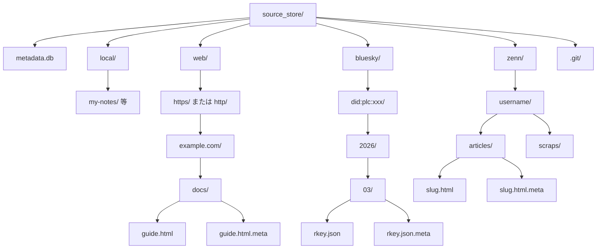

# source_store

## 概要

source_store は RAG Knowledge の全データの根源（Single Source of Truth）となるストレージである。各媒体から取得したオリジナルデータを無加工で保存し、git リポジトリとして管理する。

metadata.db、converted_store、検索インデックスは全て source_store から派生する。

スコープ:

- オリジナルデータの保存・管理
- .meta サイドカーファイルによるメタデータ管理
- metadata.db によるメタデータの索引
- source_id の決定規則
- URL とファイルパスの双方向変換
- 論理削除

スコープ外:

- converted_store の管理（コンバーター仕様の範疇）
- git 操作の実行（パイプライン制御の範疇）
- 検索インデックスの構築・更新（インデクサーの範疇）

## 背景

- Embedding モデルやチャンクパラメータの変更時に、外部アクセスなしで再構築したい
- 取得したオリジナルデータを無加工で保持し、将来の変換方式変更に備えたい
- 取り込み・変換・インデックス構築の責務分離において、データの根源となるストレージが必要

## 制約

### データ保全

- **オリジナルデータの物理削除機能は一切実装しない**。設定パス誤りによるシステムファイル削除リスクを排除する
- オリジナルデータは無加工で保存する。メタデータの埋め込み等の加工を行わない
- 参照させたくないデータは論理削除（metadata.db のステータス変更）で対応する

### git 管理

- source_store は独立した git リポジトリとして管理する（プロジェクト本体の git リポジトリとは別）
- git 操作（init、add、commit、diff）はパイプライン制御層が実行する。各ステージ（インジェスター等）は git 操作を行わない
- .meta ファイルもオリジナルデータと同様に git 管理対象に含める（再構築の根拠として重要）
- metadata.db は git 管理対象外とする（`.gitignore` で除外）。バイナリファイルのため差分管理に適さず、source_store のファイルと .meta から再構築可能

### Windows パス制約

- Windows のファイルパス禁止文字は全角文字で代替する（変換規則は「URL パス変換」を参照）
- Windows はファイルパスの大文字小文字を区別しないが、大文字小文字の表現は保持される。URL 通りのケースでファイル名を作成し、パスから URL への逆算を可能にする
- 長いパスの利用は `LongPathsEnabled` レジストリが有効であることを前提とする

### .meta サイドカーファイル

- 自動取り込み媒体（web、bluesky、zenn）のファイルには `.meta` サイドカーファイルを同階層に配置する
- local 媒体は `.meta` 不要。sources テーブルの各フィールドは以下から導出する:
  - `title`: ファイル名（拡張子除去）
  - `created_at`: git の初回コミット日時
  - `updated_at`: git の最終コミット日時
  - `content_hash`: ファイル内容から算出
  - `file_size`: ファイルシステムから取得
- `.meta` ファイルの形式は YAML とする

### metadata.db

- source_store ディレクトリ内に配置する
- SQLite WAL モードで運用する
- metadata.db が破損した場合、source_store のファイルと `.meta` からの再構築が可能であること
- バックアップ時は metadata.db の WAL をフラッシュするため、事前に `PRAGMA wal_checkpoint(TRUNCATE)` を実行すること

本コンポーネントは外部 API 通信を行わないため、想定プロファイル・安全制約セクションは省略する。

## インターフェース

### ストア操作

| 操作 | 入力 | 出力 | 振る舞い |
|------|------|------|---------|
| ファイル配置 | source_type、ファイルデータ、メタデータ | 配置先パス | source_type に応じたディレクトリにファイルを配置し、.meta を生成する（local 以外） |
| .meta 読み取り | ファイルパス | メタデータ辞書 | 指定ファイルの .meta サイドカーを YAML として読み取る |
| .meta 書き込み | ファイルパス、メタデータ辞書 | なし | 指定ファイルの .meta サイドカーを YAML として書き込む |
| ファイル一覧 | source_type（任意） | ファイルパスのリスト | source_store 内のファイルを列挙する。source_type 指定時はそのディレクトリのみ |
| 論理削除 | source_id | なし | metadata.db のステータスを `deleted` に変更する。ファイル自体は削除しない |
| 論理削除解除 | source_id | なし | metadata.db のステータスを `active` に戻す |
| ファイル取得 | source_id | ファイルデータ + メタデータ | source_id に対応するファイルと .meta を返す。論理削除済みのファイルも取得可能（全文取得ツール等で使用） |

### metadata.db 操作

| 操作 | 入力 | 出力 | 振る舞い |
|------|------|------|---------|
| ソース登録 | ソースメタデータ | なし | sources テーブルにレコードを挿入する |
| ソース更新 | source_id、更新フィールド | なし | 指定レコードを更新する |
| ソース検索 | 検索条件 | ソースメタデータのリスト | 条件に合致するレコードを返す |
| パイプライン履歴追加 | from_commit_id、to_commit_id | なし | pipeline_history テーブルに実行履歴を追加する |
| 最終コミット ID 取得 | なし | コミット ID | pipeline_history の最新行の `to_commit_id` を返す。履歴がない場合は null commit hash を返す |
| DB 再構築 | なし | なし | source_store のファイルと .meta をスキャンし、metadata.db を再構築する |

### URL パス変換

| 操作 | 入力 | 出力 | 振る舞い |
|------|------|------|---------|
| URL → パス | URL 文字列 | source_store 内の相対パス | URL をディレクトリ構成に変換する。禁止文字は全角代替する |
| パス → URL | source_store 内の相対パス | URL 文字列 | パスから元の URL を復元する。全角文字を半角に戻す |

## コンポーネント構成

### ディレクトリ構成



- **source_store/**: ルートディレクトリ。パスは `.env` の設定値で指定
- **metadata.db**: メタデータ索引。source_store ルート直下に配置
- **.git/**: git リポジトリ管理ディレクトリ
- **local/**: ユーザーが手動で自由にファイル・フォルダを配置する領域
- **web/**: Web インジェスターが URL ベースのパス構成で自動配置
- **bluesky/**: BlueSky インジェスターが DID + 年月で階層化して自動配置
- **zenn/**: Zenn インジェスターがユーザー名 + コンテンツ種別（articles/scraps）で階層化して自動配置

### converted_store のディレクトリ構成

converted_store は source_store のディレクトリ構成をミラーする。source_store 内の相対パスがそのまま converted_store 内の相対パスに対応する（拡張子は変換後の形式に変わる）。

変換不要なファイル（md/txt/adoc）もそのまま converted_store にコピーする。これによりインデクサーは常に converted_store のみを参照すればよい。

### source_id の決定方式

| 媒体 | source_id | 安定性の根拠 | 例 |
|------|-----------|-------------|-----|
| local | source_store 内の相対パス | ユーザー自身が配置を管理 | `local/my-notes/memo.md` |
| web | URL | URL 自体が安定識別子 | `https://example.com/docs/guide` |
| bluesky | AT URI | AT Protocol の安定識別子 | `at://did:plc:xxx/app.bsky.feed.post/rkey` |
| zenn | Zenn 記事 URL | URL が安定識別子 | `https://zenn.dev/user/articles/slug` |

### URL パス変換規則

Web URL を source_store のファイルパスに変換する際、以下の規則を適用する。

#### プロトコル分離

URL のスキームに応じてトップレベルディレクトリを分ける。

| URL スキーム | ディレクトリ |
|-------------|------------|
| `https://` | `web/https/` |
| `http://` | `web/http/` |

#### 禁止文字の全角代替

Windows のファイルパス禁止文字を全角文字に置換する。逆変換（パス → URL）時は全角を半角に戻す。

| 半角（URL 内） | 全角（パス内） | Unicode |
|---------------|---------------|---------|
| `:` | `：` | U+FF1A |
| `?` | `？` | U+FF1F |
| `*` | `＊` | U+FF0A |
| `<` | `＜` | U+FF1C |
| `>` | `＞` | U+FF1E |
| `\|` | `｜` | U+FF5C |
| `"` | `＂` | U+FF02 |

#### 変換例

URL: `https://example.com/docs/guide?lang=ja`

パス: `web/https/example.com/docs/guide？lang=ja`

逆変換: パスから `web/https/` を除去し、全角文字を半角に戻して `https://` を付与する。

#### ポート番号の扱い

URL にポート番号が含まれる場合（例: `localhost:8080`）、`:` を全角 `：` に置換する。

URL: `http://localhost:8080/api/docs`

パス: `web/http/localhost：8080/api/docs`

### .meta サイドカーファイル

#### ファイル命名規則

元ファイル名に `.meta` サフィックスを付加する。

| 元ファイル | .meta ファイル |
|-----------|---------------|
| `guide.html` | `guide.html.meta` |
| `post_xyz.json` | `post_xyz.json.meta` |
| `article-slug.html` | `article-slug.html.meta` |

#### 共通フィールド

全媒体（local 以外）の .meta に含まれるフィールド。

| フィールド | 型 | 内容 |
|-----------|-----|------|
| `source_id` | str | ソース識別子 |
| `source_type` | str | 媒体種別（`web`, `bluesky`, `zenn`） |
| `title` | str | コンテンツのタイトル |
| `collected_at` | str | 取り込みタイムスタンプ（ISO 8601） |

#### 媒体別フィールド

**web:**

| フィールド | 型 | 内容 |
|-----------|-----|------|
| `url` | str | 元の URL |

**bluesky:**

| フィールド | 型 | 内容 |
|-----------|-----|------|
| `handle` | str | 投稿者のハンドル |
| `did` | str | 投稿者の DID |
| `rkey` | str | 投稿の Record Key |
| `url` | str | 投稿の Web URL |
| `created_at` | str | 投稿日時（ISO 8601） |
| `has_images` | bool | 画像添付の有無 |
| `has_video` | bool | 動画添付の有無 |
| `has_external_link` | bool | 外部リンクの有無 |
| `is_reply` | bool | リプライかどうか |
| `is_repost` | bool | リポストかどうか |

**zenn:**

| フィールド | 型 | 内容 |
|-----------|-----|------|
| `slug` | str | 記事スラッグ |
| `article_type` | str | 記事種別（`tech`, `idea` 等） |
| `published_at` | str | 公開日時（ISO 8601） |
| `liked_count` | int | いいね数 |
| `topics` | list | トピックタグのリスト |
| `username` | str | 著者のユーザー名 |

#### .meta ファイルの形式例

**web:**

```yaml
source_id: "https://example.com/docs/guide"
source_type: web
title: "Guide Title"
collected_at: "2026-01-15T10:30:00+09:00"
url: "https://example.com/docs/guide"
```

**bluesky:**

```yaml
source_id: "at://did:plc:abc123/app.bsky.feed.post/xyz789"
source_type: bluesky
title: "Sample post text"
collected_at: "2026-01-15T10:30:00+09:00"
handle: "alice.bsky.social"
did: "did:plc:abc123"
rkey: "xyz789"
url: "https://bsky.app/profile/alice.bsky.social/post/xyz789"
created_at: "2026-01-15T09:00:00Z"
has_images: false
has_video: false
has_external_link: true
is_reply: false
is_repost: false
```

**zenn:**

```yaml
source_id: "https://zenn.dev/alice/articles/sample-article"
source_type: zenn
title: "Sample Article Title"
collected_at: "2026-01-15T10:30:00+09:00"
slug: "sample-article"
article_type: "tech"
published_at: "2026-01-10T12:00:00+09:00"
liked_count: 42
topics:
  - "Python"
  - "FastAPI"
username: "alice"
```

### metadata.db スキーマ

#### sources テーブル

source_store 内の全ファイルのメタデータ索引。

| カラム | 型 | 制約 | 内容 |
|--------|-----|------|------|
| `source_id` | TEXT | PRIMARY KEY | ソース識別子 |
| `source_type` | TEXT | NOT NULL | 媒体種別 |
| `file_path` | TEXT | NOT NULL, UNIQUE | source_store 内の相対パス |
| `title` | TEXT | NOT NULL | コンテンツのタイトル |
| `status` | TEXT | NOT NULL, DEFAULT 'active' | `active` または `deleted` |
| `content_hash` | TEXT | NOT NULL | ファイル内容の SHA-256 ハッシュ |
| `file_size` | INTEGER | NOT NULL | ファイルサイズ（バイト） |
| `created_at` | TEXT | NOT NULL | 初回登録日時（ISO 8601） |
| `updated_at` | TEXT | NOT NULL | 最終更新日時（ISO 8601） |

#### pipeline_history テーブル

パイプライン実行履歴。最新行の `to_commit_id` が現在の `last_commit_id` に相当する。

| カラム | 型 | 制約 | 内容 |
|--------|-----|------|------|
| `id` | INTEGER | PRIMARY KEY AUTOINCREMENT | 連番 |
| `from_commit_id` | TEXT | NOT NULL | 処理前のコミット ID。初回は null commit hash（40文字ゼロ） |
| `to_commit_id` | TEXT | NOT NULL | 処理後のコミット ID |
| `processed_at` | TEXT | NOT NULL | 処理日時（ISO 8601） |

- `last_commit_id` の取得: `SELECT to_commit_id FROM pipeline_history ORDER BY id DESC LIMIT 1`
- 初回実行時の `from_commit_id` には git の null commit hash `0000000000000000000000000000000000000000`（40文字ゼロ）を使用する
- この値は git の慣例で「コミットなし」を意味するため、初回処理であることが自明

### 設定項目

| 設定項目 | 型 | 保管先 | 内容 | デフォルト |
|---------|-----|--------|------|-----------|
| `SOURCE_STORE_DIR` | str | `.env` | source_store のディレクトリパス | なし（必須） |

> **TODO:#239** 実装時に `rag-knowledge.md` の `.env`（環境依存値）一覧にも `SOURCE_STORE_DIR` を追記すること。

## エッジケース

| ケース | 振る舞い |
|--------|---------|
| metadata.db が破損・消失した場合 | source_store のファイルと .meta をスキャンして再構築する。pipeline_history も消失するため、再構築後の初回パイプライン実行は null commit hash（初回扱い）となり、全ファイルが処理対象になる |
| .meta ファイルが欠落している場合（自動取り込み媒体） | 警告ログを出力し、ファイルパスから導出可能な情報で metadata.db に登録する。導出不可能なフィールドは空とする |
| local ファイルが source_store 外から参照された場合 | source_store 内の相対パスのみを受け付ける。外部パスはエラーとする |
| URL の大文字小文字が異なる同一パスへのアクセス | Windows は大文字小文字を区別しないため、先に配置されたファイルのケースが保持される。URL の逆算時はファイルシステム上のケースを使用する |
| URL にクエリパラメータが含まれる場合 | クエリパラメータも含めてパスに変換する（`?` → `？` の全角変換）。同一パスで異なるクエリの URL は異なるファイルとして扱う |
| source_store の git リポジトリが未初期化の場合 | パイプライン制御が初回実行時に `git init` を行う |
| 同一 source_id のファイルが既に存在する場合 | 上書きする（再取り込み時の更新動作） |
| metadata.db の `status` が `deleted` のファイルへの再取り込み | ステータスを `active` に戻し、ファイルを上書きする |
| URL にフラグメント（`#section`）が含まれる場合 | パス変換前にフラグメント部分を除去する。フラグメント違いの URL は同一ファイルとして扱う |
| `LongPathsEnabled` が無効で長いパスの操作に失敗した場合 | OS エラーをそのまま伝播し、エラーログに `LongPathsEnabled` の有効化を促すメッセージを出力する |
| パス内の全角代替文字がユーザーの手動配置で使用された場合（local 媒体） | local 媒体は URL 逆変換を行わないため影響なし。web 媒体のパス配下にユーザーが手動でファイルを配置することは想定しない |

## 関連ドキュメント

- [pipeline-controller.md](pipeline-controller.md) — パイプライン制御仕様
- [rag-knowledge.md](rag-knowledge.md) — RAG ナレッジ仕様（既存）
