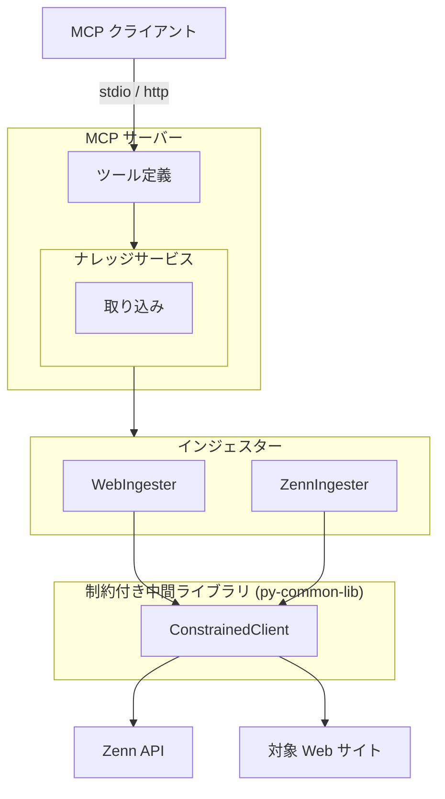
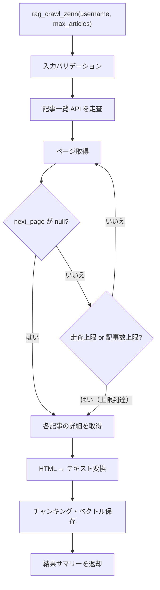

# Zenn インジェスター

## 概要

Zenn（zenn.dev）の記事を API 経由で取得し、ナレッジベースに取り込むインジェスター。
記事一覧の走査と個別記事の取得の 2 段階で動作する。

スコープ:

- 指定ユーザーの公開記事一覧の取得
- 個別記事の本文取得とナレッジベースへの取り込み
- MCP ツールとしての記事取り込みインターフェースの提供

スコープ外:

- Zenn Books（本）の取得
- Zenn Scraps（スクラップ）の取得
- 記事の投稿・編集・削除（読み取り専用）

## 背景

- Zenn は技術記事プラットフォームであり、API 経由で記事データを取得できる
- 既存の `rag_crawl`（Web クロール）は HTML ベースの取得方式であり、Zenn API のような構造化データ取得とは方式が異なる
- 過去に 3 回の品質事故（無制限 API リクエスト → Cloudflare IPv6 ブロック）を経験し、全て revert 済み
- 構造的安全対策（ConstrainedClient 導入、safety-guide の抜け道修正）が完了し、安全な再設計の前提が整った

## 制約

- 外部 HTTP リクエストは ConstrainedClient（py-common-lib）経由で実行する
- ハードリミット（コード内定数。設定・引数・環境変数で引き上げ不可。引き下げは可能）:
  - 操作あたりリクエスト総数上限: 500（ConstrainedClient 共通）
  - 最低リクエスト間隔: 0.5 秒（ConstrainedClient 共通。記事一覧走査中の各ページ間、個別記事取得間を含む全外部リクエスト間に適用）
  - 操作全体タイムアウト: 600 秒（許容範囲 1〜600 秒、ConstrainedClient 共通）
  - ページネーション走査上限: 10 ページ（Zenn インジェスター固有）
  - 記事取得上限: 100 件（Zenn インジェスター固有）
- サーキットブレーカー: 5 回連続失敗で操作全体を中断する（ConstrainedClient 共通）
- バリデーションとクランプの使い分け:
  - **バリデーションエラー（拒否）**: 型不正（非整数など）、0、負数。これらは明らかな誤入力であり、クランプで救済しない
  - **クランプ（警告ログ付き）**: 正の整数だが許容範囲外（例: `max_articles=200` → 100 にクランプ）。意図的な大きい値の指定を安全な範囲に制限する
- `--no-limit` 等の制約バイパス手段は一切設けない
- `0 = 無制限` のセマンティクスを排除する

## 外部連携

### Zenn API

Zenn は公式の API ドキュメントを公開していない。以下は観測されたエンドポイントの仕様であり、予告なく変更される可能性がある（2026-03 時点の観測に基づく）。

| 連携先 | 用途 | 接続方式 |
|--------|------|---------|
| Zenn API | 記事一覧・記事詳細の取得 | REST API（ConstrainedClient 経由） |

#### 記事一覧エンドポイント

| 項目 | 内容 |
|------|------|
| URL | `https://zenn.dev/api/articles?username={username}&order=latest&page={page}` |
| メソッド | GET |
| 認証 | 不要 |
| ページサイズ | 1 ページあたり最大 48 件（サーバー側固定） |
| ページネーション | レスポンスの `next_page` フィールド。`null` の場合は最終ページ |

レスポンス構造:

| フィールド | 型 | 説明 |
|-----------|-----|------|
| `articles` | 配列 | 記事オブジェクトの配列 |
| `next_page` | 整数 or null | 次のページ番号。最終ページでは `null` |

記事オブジェクトの主要フィールド:

| フィールド | 型 | 説明 |
|-----------|-----|------|
| `slug` | 文字列 | 記事の識別子（URL の一部） |
| `title` | 文字列 | 記事タイトル |
| `path` | 文字列 | 記事パス（例: `/username/articles/slug`） |
| `article_type` | 文字列 | `"tech"` または `"idea"` |
| `published_at` | 文字列 | 公開日時（ISO 8601） |
| `body_updated_at` | 文字列 | 本文更新日時（ISO 8601） |
| `liked_count` | 整数 | いいね数 |
| `body_letters_count` | 整数 | 本文文字数 |

#### 記事詳細エンドポイント

| 項目 | 内容 |
|------|------|
| URL | `https://zenn.dev/api/articles/{slug}` |
| メソッド | GET |
| 認証 | 不要 |

レスポンスには記事一覧の全フィールドに加え、以下が含まれる:

| フィールド | 型 | 説明 |
|-----------|-----|------|
| `body_html` | 文字列 | 記事本文（HTML 形式） |
| `topics` | 配列 | トピックタグの配列 |

## 想定プロファイル

### rag_crawl_zenn（Zenn 記事一括取り込み）

| 項目 | 内容 |
|------|------|
| 最悪ケースリクエスト数 | 10（ページネーション走査上限）+ 100（記事詳細取得上限）= 110。バジェットトラッカー上限 500 の範囲内 |
| 最悪ケース所要時間 | 110 × 0.5 秒（最低リクエスト間隔）= 55 秒（理論値。per-request タイムアウト・処理時間は含まない）。操作全体タイムアウト 600 秒の範囲内 |
| 想定エラー率 | Zenn API 依存。リトライ機構なし（失敗記事はスキップし処理を続行）。5 回連続失敗でサーキットブレーカーが発動し操作中断 |

## 安全制約

| 制約名 | 種別 | 値 | 解除可否 |
|--------|------|-----|---------|
| 操作あたりリクエスト総数上限 | ハードリミット | 500 | 引き上げ不可（引き下げ可） |
| 最低リクエスト間隔 | ハードリミット | 0.5 秒 | 引き上げ不可（引き下げ可） |
| 操作全体タイムアウト | ハードリミット | 600 秒、許容範囲 1〜600 秒 | 引き上げ不可（引き下げ可、下限 1 秒） |
| サーキットブレーカー閾値 | ハードリミット | 5 回連続失敗 | 引き上げ不可（引き下げ可） |
| ページネーション走査上限 | ハードリミット | 10 ページ | 引き上げ不可（引き下げ可） |
| 記事取得上限 | ハードリミット | 100 件 | 引き上げ不可（引き下げ可） |
| 取得記事数 | 設定値 | 許容範囲 1〜100、デフォルト 50 | 範囲内で変更可 |
| リクエストタイムアウト | 設定値 | 許容範囲 1〜120 秒、デフォルト 30 秒 | 範囲内で変更可 |
| 生 HTTP クライアント利用禁止 | CI チェック | `src/` 全体を grep で走査（httpx / aiohttp / requests / urllib.request）。`# safety:allowed` 行を除外。ConstrainedClient は py-common-lib パッケージで提供（`src/` 外のため検出対象外） | 許可例外は `# safety:allowed` コメントで可 |

テスト実行時の安全な値: 走査上限 1 ページ、記事取得上限 3 件で実行する。異常値テスト（0、負数、上限超過）を含めること。

## インターフェース

### MCP ツール

既存の `rag_crawl`（URL ベースの Web クロール）とは独立した新規ツールとして追加する。Zenn は API 経由でのデータ取得であり、Web クロールとは取得方式・制約が異なるため分離する。

> **Note**: 本仕様書は設計先行（`docs(pre-impl)`）で作成している。後続の実装フェーズで `rag-knowledge.md` のツール数・ツール一覧も併せて更新する。

| ツール | 入力 | 振る舞い |
|--------|------|---------|
| rag_crawl_zenn | username、max_articles（任意） | 指定ユーザーの Zenn 記事を API 経由で取得し、ナレッジベースに取り込む。同一記事の再取り込み時は `source_id`（記事の公開 URL）の一致で検出し、既存の知識を最新に置き換える |

ツール入力パラメータ:

| パラメータ | 型 | 必須 | 説明 |
|-----------|-----|------|------|
| `username` | 文字列 | はい | Zenn ユーザー名 |
| `max_articles` | 整数 | いいえ | 取得する最大記事数。デフォルト: 50、許容範囲: 1〜100 |

ツール出力: 取り込み結果のサマリーテキスト（取得記事数、チャンク数、エラー数）

プレビュー機能は提供しない。Zenn の記事一覧は公開情報（`https://zenn.dev/{username}` で閲覧可能）であり、取り込み前の確認は Zenn サイト上で直接行える。記事一覧走査（discover 段階）自体が軽量な操作であり、Web クロールのように未知のリンク先を探索する性質がないため、専用のプレビューツールは不要と判断した。

### 設定項目

| 環境変数 | 型 | デフォルト | 許容範囲 | 説明 |
|---------|-----|-----------|---------|------|
| `RAG_ZENN_MAX_ARTICLES` | 整数 | 50 | 1〜100 | 取得する最大記事数 |
| `RAG_ZENN_REQUEST_TIMEOUT` | 整数 | 30 | 1〜120 | 記事取得時のリクエストタイムアウト（秒） |

## コンポーネント構成

### Zenn インジェスターの位置付け

### コンポーネント一覧

| コンポーネント | 役割 |
|--------------|------|
| ZennIngester | Zenn 記事取り込み用インジェスター。BaseIngester を継承し、Zenn API 経由で記事を取得する |
| ConstrainedClient (py-common-lib) | 全外部 HTTP リクエストのゲートウェイ。ハードリミット・バジェット・サーキットブレーカーを統合する |

### 記事一括取り込みフロー

### 記事一覧走査の処理手順

1. ページ番号を 1 に初期化する
2. 記事一覧 API にリクエストを送信する
3. レスポンスから記事の `slug` を抽出し、記事リストに追加する
4. 終了判定（以下のいずれかで走査を終了する）:
   - `next_page` が `null`（最終ページ）
   - ページネーション走査上限（10 ページ）に到達
   - 記事数上限に到達
   - バジェット上限に到達（ConstrainedClient）
   - サーキットブレーカー発動（ConstrainedClient）
5. 終了条件を満たさない場合、`next_page` の値でページ番号を更新し、手順 2 に戻る
6. 収集した `slug` のリストを返す

### 個別記事取得の処理手順

1. 記事詳細 API（`/api/articles/{slug}`）にリクエストを送信する
2. レスポンスから `body_html` を取得する
3. HTML からテキストを抽出する（HTML タグの除去）
4. IngestedContent を構築して返す:
   - `source_id`: `https://zenn.dev{path}`（記事の公開 URL。`path` は `/username/articles/slug` 形式で先頭 `/` を含むため、ホスト名の末尾に `/` を付けない）
   - `title`: 記事タイトル
   - `text`: 抽出済みテキスト
   - `source_type`: `"zenn"`
   - `metadata`: `slug`、`username`、`topics`、`article_type`、`published_at`、`liked_count`

## エッジケース

| ケース | 振る舞い |
|--------|---------|
| ユーザーが存在しない | API が空の `articles` 配列を返す。0 件取得として正常終了する |
| ユーザーの記事が 0 件 | 空の `articles` 配列。0 件取得として正常終了する |
| 記事詳細取得に失敗（404 等） | 該当記事をスキップし、他の記事の処理を続行する。エラーをログ出力する |
| 記事一覧 API のレスポンス形式変更 | JSON パースエラーまたは必須フィールド欠落として処理を中断する。エラーの詳細をログ出力する |
| 記事詳細 API のレスポンス形式変更 | 該当記事をスキップし、他の記事の処理を続行する。エラーの詳細をログ出力する |
| `body_html` が空 | 該当記事をスキップする。空テキストの取り込みは行わない |
| 下書き・非公開記事 | API が公開記事のみを返すため、考慮不要 |
| 大量記事ユーザー（480 件超 = 10 ページ超） | ページネーション走査上限（10 ページ）で打ち切る。取得済み記事を処理し、上限到達の旨を警告ログに出力する |
| 同一記事の再取り込み | `source_id`（記事の公開 URL）の一致で検出し、既存データを最新に置き換える |
| バジェット上限到達 | 取得済みデータを返し、上限到達の旨をログ出力する |
| サーキットブレーカー発動 | 操作を中断し、取得済みデータを返す。エラーの詳細をログ出力する |
| 操作全体タイムアウト | 操作を中断し、取得済みデータを返す |
| 設定値がハードリミット超過（正の整数） | ハードリミット値にクランプし、警告ログを出力する |
| `max_articles` に 0 や負数を指定 | バリデーションエラーとして拒否する（クランプ対象外。制約セクション参照） |
| `username` が空文字列 | バリデーションエラーとして拒否する |
| Zenn API のレート制限（429） | ConstrainedClient のサーキットブレーカーで検出される。連続失敗として計上し、閾値超過で操作を中断する |

## 関連ドキュメント

- [rag-knowledge.md](rag-knowledge.md) — RAG ナレッジ基盤仕様（ConstrainedClient・安全制約の共通定義）
